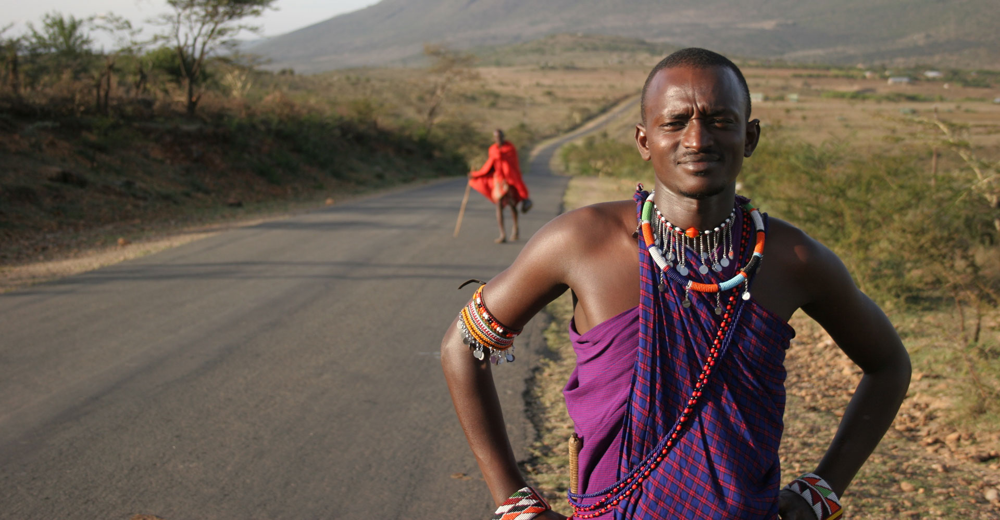
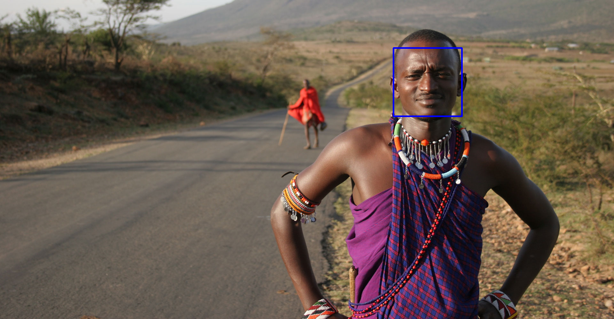

# Face Recognition Model

A simple face recognition tool using Cascade Classifier from OpenCV


```python
import pandas as pd
from cv2 import CascadeClassifier
import cv2
from google.colab.patches import cv2_imshow

model = CascadeClassifier('/content/face_recog_data.xml')
model
```


    <CascadeClassifier 0x7f7750024ef0>


## Load and show the image


```python
image = cv2.imread('/content/peoples.jpg')
cv2_imshow(image)
cv2.waitKey()
```


    

    


    -1


## Change the space color


```python
gray_image = cv2.cvtColor(image, cv2.COLOR_BGR2GRAY)
cv2_imshow(gray_image)
```


    

    


```python
face = model.detectMultiScale(gray_image, 1.3, 5)
face  # Return a numpy array with [x, y, width, hight]
```


    array([[1230,  150,  214,  214]], dtype=int32)


```python
for x, y, w, h in face:
  cv2.rectangle(image, (x, y), (x + w, y + h), (255, 0, 0), 3)

cv2_imshow(image)
```


    

    


## Create a function to recognize the face


```python
def face_recognition(image_path):
  model = CascadeClassifier('/content/face_recog_data.xml')
  image = cv2.imread(image_path)
  gray_image = cv2.cvtColor(image, cv2.COLOR_BGR2GRAY)
  face = model.detectMultiScale(gray_image, 1.3, 5)
  
  for x, y, w, h in face:
    cv2.rectangle(image, (x, y), (x + w, y + h), (255, 0, 0), 3)

  return image
```


```python
cv2_imshow(face_recognition('/content/peoples.jpg'))
```


    

    

