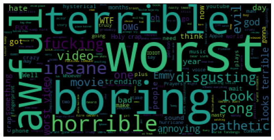
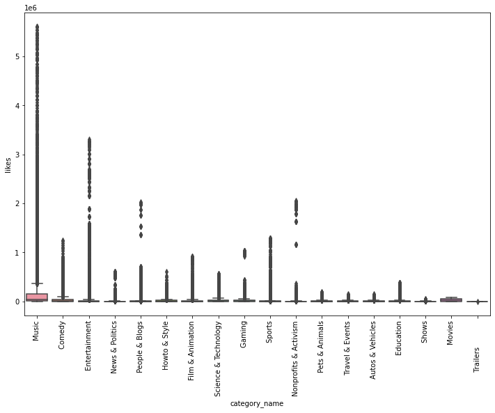
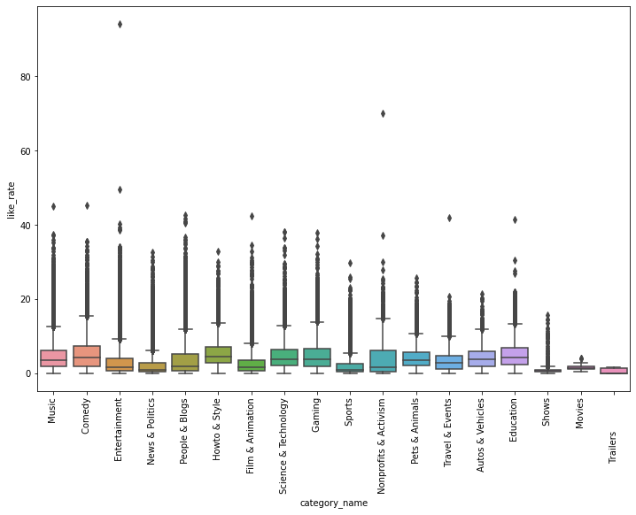
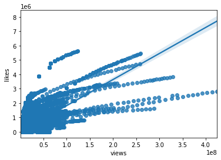
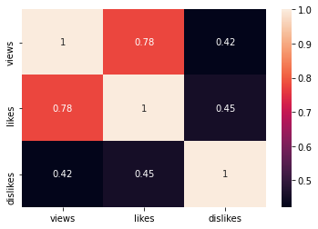
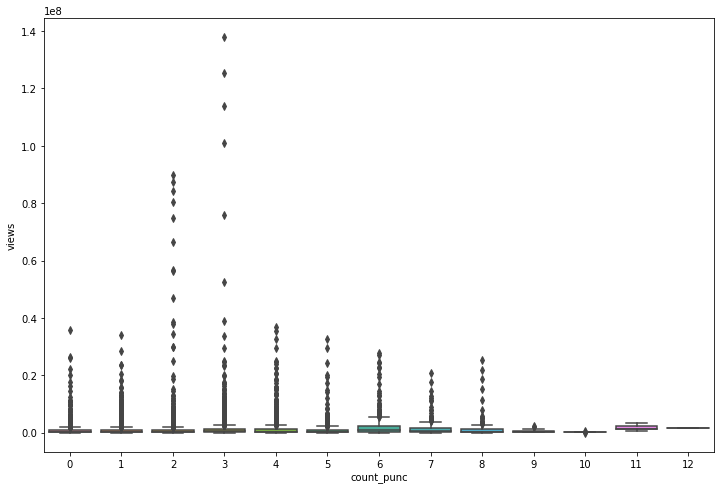

# Youtube Sentimental Analysis

## Import necessary libraries


```python
import pandas as pd
import numpy as np
import seaborn as sns
import matplotlib.pyplot as plt
```


```python
df_comments = pd.read_csv('/content/UScomments.csv', on_bad_lines='skip', quoting=csv.QUOTE_NONE, encoding='utf-8', low_memory=False)
df_comments.head()
```


  <div id="df-9308d4d8-919f-4678-8b46-eebd1f9abf37">
    <div class="colab-df-container">
      <div>
<style scoped>
    .dataframe tbody tr th:only-of-type {
        vertical-align: middle;
    }

    .dataframe tbody tr th {
        vertical-align: top;
    }

    .dataframe thead th {
        text-align: right;
    }
</style>
<table border="1" class="dataframe">
  <thead>
    <tr style="text-align: right;">
      <th></th>
      <th>video_id</th>
      <th>comment_text</th>
      <th>likes</th>
      <th>replies</th>
    </tr>
  </thead>
  <tbody>
    <tr>
      <th>0</th>
      <td>XpVt6Z1Gjjo</td>
      <td>"Logan Paul it's yo big day ‼️‼️‼️"</td>
      <td>4</td>
      <td>0</td>
    </tr>
    <tr>
      <th>1</th>
      <td>XpVt6Z1Gjjo</td>
      <td>"I've been following you from the start of you...</td>
      <td>3</td>
      <td>0</td>
    </tr>
    <tr>
      <th>2</th>
      <td>XpVt6Z1Gjjo</td>
      <td>"Say hi to Kong and maverick for me"</td>
      <td>3</td>
      <td>0</td>
    </tr>
    <tr>
      <th>3</th>
      <td>XpVt6Z1Gjjo</td>
      <td>"MY FAN . attendance"</td>
      <td>3</td>
      <td>0</td>
    </tr>
    <tr>
      <th>4</th>
      <td>XpVt6Z1Gjjo</td>
      <td>"trending 😉"</td>
      <td>3</td>
      <td>0</td>
    </tr>
  </tbody>
</table>
</div>

## Lets find out missing values in your data

```python
df_comments.isna().sum()
```

    video_id          0
    comment_text      6
    likes           108
    replies         110
    dtype: int64

## Drop missing values as we have very few & update datafraem as well..

```python
df_comments.dropna(inplace=True)
df_comments.isna().sum()
```

    video_id        0
    comment_text    0
    likes           0
    replies         0
    dtype: int64

## 1.How to perform Sentiment Analysis

In short , Sentiment analysis is all about analyszing sentiments of Users. Lets perform sentiment analysis using TextBlob which is a NLP library built on top of NLTK )..

```python
!pip install textblob
from textblob import TextBlob

TextBlob('Logan Paul its yo big day ‼️‼️‼️').sentiment.polarity
```

    Requirement already satisfied: textblob in /usr/local/lib/python3.7/dist-packages (0.15.3)
    Requirement already satisfied: nltk>=3.1 in /usr/local/lib/python3.7/dist-packages (from textblob) (3.2.5)
    Requirement already satisfied: six in /usr/local/lib/python3.7/dist-packages (from nltk>=3.1->textblob) (1.15.0)
    0.0

```python
df_comments.shape
```

    (147461, 4)

```python
df = df_comments[0:1000]

polarity = []
for comment in df_comments['comment_text']:
    try:
        polarity.append(TextBlob(comment).sentiment.polarity)
    except:
        polarity.append(0)

print(polarity[0:50])
```

    [0.0, 0.0, 0.0, 0.0, 0.0, 0.0, 0.0, 0.0, 0.8, -0.13571428571428573, 0.0, -0.023333333333333352, 0.5, 0.0, 0.8, 0.0, 0.25, -0.8, 0.0, 0.0, 0.0, 0.375, 0.0, 0.0, 0.5, -0.04999999999999999, 0.34448051948051944, 0.5, 0.6, 0.0, 0.0, -0.30625, -0.36458333333333337, 0.5, 0.012499999999999997, 0.11904761904761905, 0.16666666666666666, 0.0, -0.4, -0.125, -0.07142857142857142, 0.0, 0.35, 0.0, -0.03415584415584416, -0.4, 0.8, 0.0, 0.0, 0.0]

```python
df_comments['polarity'] = polarity
df_comments.head(12)
```

  <div id="df-ee07da3e-da01-419b-add2-a85c0a6e31c9">
    <div class="colab-df-container">
      <div>
<style scoped>
    .dataframe tbody tr th:only-of-type {
        vertical-align: middle;
    }

    .dataframe tbody tr th {
        vertical-align: top;
    }

    .dataframe thead th {
        text-align: right;
    }
</style>
<table border="1" class="dataframe">
  <thead>
    <tr style="text-align: right;">
      <th></th>
      <th>video_id</th>
      <th>comment_text</th>
      <th>likes</th>
      <th>replies</th>
      <th>polarity</th>
    </tr>
  </thead>
  <tbody>
    <tr>
      <th>0</th>
      <td>XpVt6Z1Gjjo</td>
      <td>"Logan Paul it's yo big day ‼️‼️‼️"</td>
      <td>4</td>
      <td>0</td>
      <td>0.000000</td>
    </tr>
    <tr>
      <th>1</th>
      <td>XpVt6Z1Gjjo</td>
      <td>"I've been following you from the start of you...</td>
      <td>3</td>
      <td>0</td>
      <td>0.000000</td>
    </tr>
    <tr>
      <th>2</th>
      <td>XpVt6Z1Gjjo</td>
      <td>"Say hi to Kong and maverick for me"</td>
      <td>3</td>
      <td>0</td>
      <td>0.000000</td>
    </tr>
    <tr>
      <th>3</th>
      <td>XpVt6Z1Gjjo</td>
      <td>"MY FAN . attendance"</td>
      <td>3</td>
      <td>0</td>
      <td>0.000000</td>
    </tr>
    <tr>
      <th>4</th>
      <td>XpVt6Z1Gjjo</td>
      <td>"trending 😉"</td>
      <td>3</td>
      <td>0</td>
      <td>0.000000</td>
    </tr>
    <tr>
      <th>5</th>
      <td>XpVt6Z1Gjjo</td>
      <td>"#1 on trending AYYEEEEE"</td>
      <td>3</td>
      <td>0</td>
      <td>0.000000</td>
    </tr>
    <tr>
      <th>6</th>
      <td>XpVt6Z1Gjjo</td>
      <td>"The end though 😭👍🏻❤️"</td>
      <td>4</td>
      <td>0</td>
      <td>0.000000</td>
    </tr>
    <tr>
      <th>7</th>
      <td>XpVt6Z1Gjjo</td>
      <td>"#1 trending!!!!!!!!!"</td>
      <td>3</td>
      <td>0</td>
      <td>0.000000</td>
    </tr>
    <tr>
      <th>8</th>
      <td>XpVt6Z1Gjjo</td>
      <td>"Happy one year vlogaversary"</td>
      <td>3</td>
      <td>0</td>
      <td>0.800000</td>
    </tr>
    <tr>
      <th>9</th>
      <td>XpVt6Z1Gjjo</td>
      <td>"You and your shit brother may have single han...</td>
      <td>0</td>
      <td>0</td>
      <td>-0.135714</td>
    </tr>
    <tr>
      <th>10</th>
      <td>XpVt6Z1Gjjo</td>
      <td>"There should be a mini Logan Paul too!"</td>
      <td>0</td>
      <td>0</td>
      <td>0.000000</td>
    </tr>
    <tr>
      <th>11</th>
      <td>XpVt6Z1Gjjo</td>
      <td>"Honestly Evan is so annoying. Like its not fu...</td>
      <td>0</td>
      <td>0</td>
      <td>-0.023333</td>
    </tr>
  </tbody>
</table>
</div>

### Try it :

a) perform sentiment analysis using NLTK Vader SentimentAnalyzer.

b) perform sentiment analysis using spacy.

## 2.. Wordcloud Analysis of your data

```python
positive_comments = df_comments[df_comments['polarity'] == 1]
negative_comments = df_comments[df_comments['polarity'] == -1]
negative_comments.head(2)
```

  <div id="df-d8675e18-362b-4678-a993-ecbe06aed210">
    <div class="colab-df-container">
      <div>
<style scoped>
    .dataframe tbody tr th:only-of-type {
        vertical-align: middle;
    }

    .dataframe tbody tr th {
        vertical-align: top;
    }

    .dataframe thead th {
        text-align: right;
    }
</style>
<table border="1" class="dataframe">
  <thead>
    <tr style="text-align: right;">
      <th></th>
      <th>video_id</th>
      <th>comment_text</th>
      <th>likes</th>
      <th>replies</th>
      <th>polarity</th>
    </tr>
  </thead>
  <tbody>
    <tr>
      <th>419</th>
      <td>8wNr-NQImFg</td>
      <td>"BEN CARSON IS THE MAN!!!!! THEY HATE HIM CAUS...</td>
      <td>0</td>
      <td>0</td>
      <td>-1.0</td>
    </tr>
    <tr>
      <th>454</th>
      <td>8wNr-NQImFg</td>
      <td>"Well… The brain surgeon Ben Carson just prove...</td>
      <td>0</td>
      <td>0</td>
      <td>-1.0</td>
    </tr>
  </tbody>
</table>
</div>

```python
#!pip install wordcloud

from wordcloud import WordCloud , STOPWORDS

negative_comments['comment_text']
```

    419       "BEN CARSON IS THE MAN!!!!! THEY HATE HIM CAUS...
    454       "Well… The brain surgeon Ben Carson just prove...
    778            "WHY DID YOU MAKE FURRY FORCE?! SO NASTY!!!"
    1136                                       "WTF BRUH!!!!!!"
    1156                      "cheeseus christ thats insane!!!"
                                    ...                        
    146958    "Worst book? This isn't The Catcher in the Rye...
    146971                   "Worst book ever? \nHold my beer."
    146979    "This will be the worst book I will ever read ...
    147494    "Did she lose her b00bs in a horrible accident...
    147514    "This looks terrible. She looks like she can't...
    Name: comment_text, Length: 794, dtype: object

```python
total_comments = ' '.join(negative_comments['comment_text'])
total_comments[0:100]
```

    '"BEN CARSON IS THE MAN!!!!! THEY HATE HIM CAUSE HE EXPOSED HITLARY\'S RITUAL ABUSE ON CHILDREN!!!!!!!'

```python
wordcloud = WordCloud(stopwords=set(STOPWORDS)).generate(total_comments)
plt.figure(figsize=(15,5))
plt.imshow(wordcloud)
plt.axis('off');
```
   

    
# Conclusion:
Users are emphasizing more on Terrible , worst ,horrible ,boring , disgusting etc..

### Try it:
a. Extract positive comments using query() function of pandas.

b .Extract positive comments using where() function of numpy.

### Lets perform EDA for the Negative sentences

```python
total_comments2 = ' '.join(positive_comments['comment_text'])
wordcloud = WordCloud(stopwords=set(STOPWORDS)).generate(total_comments2)
plt.figure(figsize=(15,5))
plt.imshow(wordcloud)
plt.axis('off');
```
    

    
## 3..Perform Emoji's Analysis

```python
!pip install emoji

import emoji

df_comments.head(14)
```

    Collecting emoji
      Downloading emoji-1.7.0.tar.gz (175 kB)
         |████████████████████████████████| 175 kB 5.0 MB/s 
    [?25hBuilding wheels for collected packages: emoji
      Building wheel for emoji (setup.py) ... [?25l[?25hdone
      Created wheel for emoji: filename=emoji-1.7.0-py3-none-any.whl size=171046 sha256=4a729d4389937016608c418eb3f0ff752e054b7e7fe6d76d2715fa64616ce3fe
      Stored in directory: /root/.cache/pip/wheels/8a/4e/b6/57b01db010d17ef6ea9b40300af725ef3e210cb1acfb7ac8b6
    Successfully built emoji
    Installing collected packages: emoji
    Successfully installed emoji-1.7.0

  <div id="df-bd3519f4-7cd7-4086-9711-4bf231331cbe">
    <div class="colab-df-container">
      <div>
<style scoped>
    .dataframe tbody tr th:only-of-type {
        vertical-align: middle;
    }

    .dataframe tbody tr th {
        vertical-align: top;
    }

    .dataframe thead th {
        text-align: right;
    }
</style>
<table border="1" class="dataframe">
  <thead>
    <tr style="text-align: right;">
      <th></th>
      <th>video_id</th>
      <th>comment_text</th>
      <th>likes</th>
      <th>replies</th>
      <th>polarity</th>
    </tr>
  </thead>
  <tbody>
    <tr>
      <th>0</th>
      <td>XpVt6Z1Gjjo</td>
      <td>"Logan Paul it's yo big day ‼️‼️‼️"</td>
      <td>4</td>
      <td>0</td>
      <td>0.000000</td>
    </tr>
    <tr>
      <th>1</th>
      <td>XpVt6Z1Gjjo</td>
      <td>"I've been following you from the start of you...</td>
      <td>3</td>
      <td>0</td>
      <td>0.000000</td>
    </tr>
    <tr>
      <th>2</th>
      <td>XpVt6Z1Gjjo</td>
      <td>"Say hi to Kong and maverick for me"</td>
      <td>3</td>
      <td>0</td>
      <td>0.000000</td>
    </tr>
    <tr>
      <th>3</th>
      <td>XpVt6Z1Gjjo</td>
      <td>"MY FAN . attendance"</td>
      <td>3</td>
      <td>0</td>
      <td>0.000000</td>
    </tr>
    <tr>
      <th>4</th>
      <td>XpVt6Z1Gjjo</td>
      <td>"trending 😉"</td>
      <td>3</td>
      <td>0</td>
      <td>0.000000</td>
    </tr>
    <tr>
      <th>5</th>
      <td>XpVt6Z1Gjjo</td>
      <td>"#1 on trending AYYEEEEE"</td>
      <td>3</td>
      <td>0</td>
      <td>0.000000</td>
    </tr>
    <tr>
      <th>6</th>
      <td>XpVt6Z1Gjjo</td>
      <td>"The end though 😭👍🏻❤️"</td>
      <td>4</td>
      <td>0</td>
      <td>0.000000</td>
    </tr>
    <tr>
      <th>7</th>
      <td>XpVt6Z1Gjjo</td>
      <td>"#1 trending!!!!!!!!!"</td>
      <td>3</td>
      <td>0</td>
      <td>0.000000</td>
    </tr>
    <tr>
      <th>8</th>
      <td>XpVt6Z1Gjjo</td>
      <td>"Happy one year vlogaversary"</td>
      <td>3</td>
      <td>0</td>
      <td>0.800000</td>
    </tr>
    <tr>
      <th>9</th>
      <td>XpVt6Z1Gjjo</td>
      <td>"You and your shit brother may have single han...</td>
      <td>0</td>
      <td>0</td>
      <td>-0.135714</td>
    </tr>
    <tr>
      <th>10</th>
      <td>XpVt6Z1Gjjo</td>
      <td>"There should be a mini Logan Paul too!"</td>
      <td>0</td>
      <td>0</td>
      <td>0.000000</td>
    </tr>
    <tr>
      <th>11</th>
      <td>XpVt6Z1Gjjo</td>
      <td>"Honestly Evan is so annoying. Like its not fu...</td>
      <td>0</td>
      <td>0</td>
      <td>-0.023333</td>
    </tr>
    <tr>
      <th>12</th>
      <td>XpVt6Z1Gjjo</td>
      <td>"Casey is still better then logan"</td>
      <td>0</td>
      <td>0</td>
      <td>0.500000</td>
    </tr>
    <tr>
      <th>13</th>
      <td>XpVt6Z1Gjjo</td>
      <td>"aw geez rick this guy is the face of YouTube."</td>
      <td>0</td>
      <td>0</td>
      <td>0.000000</td>
    </tr>
  </tbody>
</table>
</div>

```python
print('\U0001F600')
```

    😀

### Lets extract emoji from below comment

```python
comment = 'trending 😉'
comment
```

    'trending 😉'

```python
[c for c in comment if c in emoji.EMOJI_DATA]
```

    ['😉']

```python
emoji_list=[]
for comment in df_comments['comment_text']:
    for char in comment:
        if char in emoji.EMOJI_DATA:
            emoji_list.append(char)
          
len(emoji_list)
```

    65456

```python
emoji_list[:10]
```

    ['‼', '‼', '‼', '😉', '😭', '👍', '🏻', '❤', '😍', '💋']

### Now we have to compute frequencies of each & every emojis..

```python
from collections import Counter

Counter(emoji_list).most_common(10)
```

    [('😂', 8442),
     ('❤', 6925),
     ('😍', 6435),
     ('😬', 3143),
     ('😭', 1957),
     ('🔥', 1847),
     ('👏', 1498),
     ('💕', 1344),
     ('👍', 1285),
     ('😘', 1137)]


```python
emojis = [Counter(emoji_list).most_common(10)[emoji][0] for emoji in range(10)]
emojis
```

    ['😂', '❤', '😍', '😬', '😭', '🔥', '👏', '💕', '👍', '😘']


```python
frequencies = [Counter(emoji_list).most_common(10)[emoji][1] for emoji in range(10)]
frequencies
```

    [8442, 6925, 6435, 3143, 1957, 1847, 1498, 1344, 1285, 1137]


```python
!pip install plotly

import plotly.graph_objs as go
from plotly.offline import iplot

trace = go.Bar(x=emojis, y=frequencies)
iplot([trace])
```

    Requirement already satisfied: plotly in /usr/local/lib/python3.7/dist-packages (5.5.0)
    Requirement already satisfied: six in /usr/local/lib/python3.7/dist-packages (from plotly) (1.15.0)
    Requirement already satisfied: tenacity>=6.2.0 in /usr/local/lib/python3.7/dist-packages (from plotly) (8.0.1)


<html>
<head><meta charset="utf-8" /></head>
<body>
    <div>            <script src="https://cdnjs.cloudflare.com/ajax/libs/mathjax/2.7.5/MathJax.js?config=TeX-AMS-MML_SVG"></script><script type="text/javascript">if (window.MathJax) {MathJax.Hub.Config({SVG: {font: "STIX-Web"}});}</script>                <script type="text/javascript">window.PlotlyConfig = {MathJaxConfig: 'local'};</script>
        <script src="https://cdn.plot.ly/plotly-2.8.3.min.js"></script>                <div id="58264c4e-e55b-4b13-b65c-0728d4c089e6" class="plotly-graph-div" style="height:525px; width:100%;"></div>            <script type="text/javascript">                                    window.PLOTLYENV=window.PLOTLYENV || {};                                    if (document.getElementById("58264c4e-e55b-4b13-b65c-0728d4c089e6")) {                    Plotly.newPlot(                        "58264c4e-e55b-4b13-b65c-0728d4c089e6",                        [{"x":["\ud83d\ude02","\u2764","\ud83d\ude0d","\ud83d\ude2c","\ud83d\ude2d","\ud83d\udd25","\ud83d\udc4f","\ud83d\udc95","\ud83d\udc4d","\ud83d\ude18"],"y":[8442,6925,6435,3143,1957,1847,1498,1344,1285,1137],"type":"bar"}],                        {"template":{"data":{"barpolar":[{"marker":{"line":{"color":"#E5ECF6","width":0.5},"pattern":{"fillmode":"overlay","size":10,"solidity":0.2}},"type":"barpolar"}],"bar":[{"error_x":{"color":"#2a3f5f"},"error_y":{"color":"#2a3f5f"},"marker":{"line":{"color":"#E5ECF6","width":0.5},"pattern":{"fillmode":"overlay","size":10,"solidity":0.2}},"type":"bar"}],"carpet":[{"aaxis":{"endlinecolor":"#2a3f5f","gridcolor":"white","linecolor":"white","minorgridcolor":"white","startlinecolor":"#2a3f5f"},"baxis":{"endlinecolor":"#2a3f5f","gridcolor":"white","linecolor":"white","minorgridcolor":"white","startlinecolor":"#2a3f5f"},"type":"carpet"}],"choropleth":[{"colorbar":{"outlinewidth":0,"ticks":""},"type":"choropleth"}],"contourcarpet":[{"colorbar":{"outlinewidth":0,"ticks":""},"type":"contourcarpet"}],"contour":[{"colorbar":{"outlinewidth":0,"ticks":""},"colorscale":[[0.0,"#0d0887"],[0.1111111111111111,"#46039f"],[0.2222222222222222,"#7201a8"],[0.3333333333333333,"#9c179e"],[0.4444444444444444,"#bd3786"],[0.5555555555555556,"#d8576b"],[0.6666666666666666,"#ed7953"],[0.7777777777777778,"#fb9f3a"],[0.8888888888888888,"#fdca26"],[1.0,"#f0f921"]],"type":"contour"}],"heatmapgl":[{"colorbar":{"outlinewidth":0,"ticks":""},"colorscale":[[0.0,"#0d0887"],[0.1111111111111111,"#46039f"],[0.2222222222222222,"#7201a8"],[0.3333333333333333,"#9c179e"],[0.4444444444444444,"#bd3786"],[0.5555555555555556,"#d8576b"],[0.6666666666666666,"#ed7953"],[0.7777777777777778,"#fb9f3a"],[0.8888888888888888,"#fdca26"],[1.0,"#f0f921"]],"type":"heatmapgl"}],"heatmap":[{"colorbar":{"outlinewidth":0,"ticks":""},"colorscale":[[0.0,"#0d0887"],[0.1111111111111111,"#46039f"],[0.2222222222222222,"#7201a8"],[0.3333333333333333,"#9c179e"],[0.4444444444444444,"#bd3786"],[0.5555555555555556,"#d8576b"],[0.6666666666666666,"#ed7953"],[0.7777777777777778,"#fb9f3a"],[0.8888888888888888,"#fdca26"],[1.0,"#f0f921"]],"type":"heatmap"}],"histogram2dcontour":[{"colorbar":{"outlinewidth":0,"ticks":""},"colorscale":[[0.0,"#0d0887"],[0.1111111111111111,"#46039f"],[0.2222222222222222,"#7201a8"],[0.3333333333333333,"#9c179e"],[0.4444444444444444,"#bd3786"],[0.5555555555555556,"#d8576b"],[0.6666666666666666,"#ed7953"],[0.7777777777777778,"#fb9f3a"],[0.8888888888888888,"#fdca26"],[1.0,"#f0f921"]],"type":"histogram2dcontour"}],"histogram2d":[{"colorbar":{"outlinewidth":0,"ticks":""},"colorscale":[[0.0,"#0d0887"],[0.1111111111111111,"#46039f"],[0.2222222222222222,"#7201a8"],[0.3333333333333333,"#9c179e"],[0.4444444444444444,"#bd3786"],[0.5555555555555556,"#d8576b"],[0.6666666666666666,"#ed7953"],[0.7777777777777778,"#fb9f3a"],[0.8888888888888888,"#fdca26"],[1.0,"#f0f921"]],"type":"histogram2d"}],"histogram":[{"marker":{"pattern":{"fillmode":"overlay","size":10,"solidity":0.2}},"type":"histogram"}],"mesh3d":[{"colorbar":{"outlinewidth":0,"ticks":""},"type":"mesh3d"}],"parcoords":[{"line":{"colorbar":{"outlinewidth":0,"ticks":""}},"type":"parcoords"}],"pie":[{"automargin":true,"type":"pie"}],"scatter3d":[{"line":{"colorbar":{"outlinewidth":0,"ticks":""}},"marker":{"colorbar":{"outlinewidth":0,"ticks":""}},"type":"scatter3d"}],"scattercarpet":[{"marker":{"colorbar":{"outlinewidth":0,"ticks":""}},"type":"scattercarpet"}],"scattergeo":[{"marker":{"colorbar":{"outlinewidth":0,"ticks":""}},"type":"scattergeo"}],"scattergl":[{"marker":{"colorbar":{"outlinewidth":0,"ticks":""}},"type":"scattergl"}],"scattermapbox":[{"marker":{"colorbar":{"outlinewidth":0,"ticks":""}},"type":"scattermapbox"}],"scatterpolargl":[{"marker":{"colorbar":{"outlinewidth":0,"ticks":""}},"type":"scatterpolargl"}],"scatterpolar":[{"marker":{"colorbar":{"outlinewidth":0,"ticks":""}},"type":"scatterpolar"}],"scatter":[{"marker":{"colorbar":{"outlinewidth":0,"ticks":""}},"type":"scatter"}],"scatterternary":[{"marker":{"colorbar":{"outlinewidth":0,"ticks":""}},"type":"scatterternary"}],"surface":[{"colorbar":{"outlinewidth":0,"ticks":""},"colorscale":[[0.0,"#0d0887"],[0.1111111111111111,"#46039f"],[0.2222222222222222,"#7201a8"],[0.3333333333333333,"#9c179e"],[0.4444444444444444,"#bd3786"],[0.5555555555555556,"#d8576b"],[0.6666666666666666,"#ed7953"],[0.7777777777777778,"#fb9f3a"],[0.8888888888888888,"#fdca26"],[1.0,"#f0f921"]],"type":"surface"}],"table":[{"cells":{"fill":{"color":"#EBF0F8"},"line":{"color":"white"}},"header":{"fill":{"color":"#C8D4E3"},"line":{"color":"white"}},"type":"table"}]},"layout":{"annotationdefaults":{"arrowcolor":"#2a3f5f","arrowhead":0,"arrowwidth":1},"autotypenumbers":"strict","coloraxis":{"colorbar":{"outlinewidth":0,"ticks":""}},"colorscale":{"diverging":[[0,"#8e0152"],[0.1,"#c51b7d"],[0.2,"#de77ae"],[0.3,"#f1b6da"],[0.4,"#fde0ef"],[0.5,"#f7f7f7"],[0.6,"#e6f5d0"],[0.7,"#b8e186"],[0.8,"#7fbc41"],[0.9,"#4d9221"],[1,"#276419"]],"sequential":[[0.0,"#0d0887"],[0.1111111111111111,"#46039f"],[0.2222222222222222,"#7201a8"],[0.3333333333333333,"#9c179e"],[0.4444444444444444,"#bd3786"],[0.5555555555555556,"#d8576b"],[0.6666666666666666,"#ed7953"],[0.7777777777777778,"#fb9f3a"],[0.8888888888888888,"#fdca26"],[1.0,"#f0f921"]],"sequentialminus":[[0.0,"#0d0887"],[0.1111111111111111,"#46039f"],[0.2222222222222222,"#7201a8"],[0.3333333333333333,"#9c179e"],[0.4444444444444444,"#bd3786"],[0.5555555555555556,"#d8576b"],[0.6666666666666666,"#ed7953"],[0.7777777777777778,"#fb9f3a"],[0.8888888888888888,"#fdca26"],[1.0,"#f0f921"]]},"colorway":["#636efa","#EF553B","#00cc96","#ab63fa","#FFA15A","#19d3f3","#FF6692","#B6E880","#FF97FF","#FECB52"],"font":{"color":"#2a3f5f"},"geo":{"bgcolor":"white","lakecolor":"white","landcolor":"#E5ECF6","showlakes":true,"showland":true,"subunitcolor":"white"},"hoverlabel":{"align":"left"},"hovermode":"closest","mapbox":{"style":"light"},"paper_bgcolor":"white","plot_bgcolor":"#E5ECF6","polar":{"angularaxis":{"gridcolor":"white","linecolor":"white","ticks":""},"bgcolor":"#E5ECF6","radialaxis":{"gridcolor":"white","linecolor":"white","ticks":""}},"scene":{"xaxis":{"backgroundcolor":"#E5ECF6","gridcolor":"white","gridwidth":2,"linecolor":"white","showbackground":true,"ticks":"","zerolinecolor":"white"},"yaxis":{"backgroundcolor":"#E5ECF6","gridcolor":"white","gridwidth":2,"linecolor":"white","showbackground":true,"ticks":"","zerolinecolor":"white"},"zaxis":{"backgroundcolor":"#E5ECF6","gridcolor":"white","gridwidth":2,"linecolor":"white","showbackground":true,"ticks":"","zerolinecolor":"white"}},"shapedefaults":{"line":{"color":"#2a3f5f"}},"ternary":{"aaxis":{"gridcolor":"white","linecolor":"white","ticks":""},"baxis":{"gridcolor":"white","linecolor":"white","ticks":""},"bgcolor":"#E5ECF6","caxis":{"gridcolor":"white","linecolor":"white","ticks":""}},"title":{"x":0.05},"xaxis":{"automargin":true,"gridcolor":"white","linecolor":"white","ticks":"","title":{"standoff":15},"zerolinecolor":"white","zerolinewidth":2},"yaxis":{"automargin":true,"gridcolor":"white","linecolor":"white","ticks":"","title":{"standoff":15},"zerolinecolor":"white","zerolinewidth":2}}}},                        {"responsive": true}                    ).then(function(){

var gd = document.getElementById('58264c4e-e55b-4b13-b65c-0728d4c089e6');
var x = new MutationObserver(function (mutations, observer) {{
        var display = window.getComputedStyle(gd).display;
        if (!display || display === 'none') {{
            console.log([gd, 'removed!']);
            Plotly.purge(gd);
            observer.disconnect();
        }}
}});

// Listen for the removal of the full notebook cells
var notebookContainer = gd.closest('#notebook-container');
if (notebookContainer) {{
    x.observe(notebookContainer, {childList: true});
}}

// Listen for the clearing of the current output cell
var outputEl = gd.closest('.output');
if (outputEl) {{
    x.observe(outputEl, {childList: true});
}}

                        })                };                            </script>        </div>
</body>
</html>

### Try it :
Once u have list of emojis , how to create a dictionary like : 
```
{'emoji':'frequency of emoji'}
```        
1. Code completely from scratch (by iterating over the list and counting frequency)

2 Using list in-built count function
3.Using dictionary in-buult get function

## 4. Collect Entire data of Youtube

```python
import os

path = r'F:\Data Analysis_projects\Youtube\additional_data'

files = os.listdir(path)
files
files_csv = [files[i] for i in range(0,len(files),2)]
files_csv
```

```python
full_df = pd.DataFrame()

for file in files_csv:
    current_df = pd.read_csv(path + '/' + file, encoding='iso-8859-1', error_bad_lines=False)
    current_df['country'] = file.split('.')[0][0:2]
    full_df = pd.concat([full_df, current_df])

full_df.head(4)  
```

```python
full_df.shape
```

    (375942, 17)

```python
full_df['category_id'].unique()
```

    array([10, 23, 24, 25, 22, 26,  1, 28, 20, 17, 29, 15, 19,  2, 27, 43, 30,
           44], dtype=int64)

```python
cat = pd.read_csv('F:\Data Analysis_projects\Youtube/category_file.txt', sep=':')
cat.reset_index(inplace=True)
cat.columns=['category_id', 'Category_name']
cat.set_index('category_id', inplace=True)
cat
```

<div>
<style scoped>
    .dataframe tbody tr th:only-of-type {
        vertical-align: middle;
    }

    .dataframe tbody tr th {
        vertical-align: top;
    }

    .dataframe thead th {
        text-align: right;
    }
</style>
<table border="1" class="dataframe">
  <thead>
    <tr style="text-align: right;">
      <th></th>
      <th>Category_name</th>
    </tr>
    <tr>
      <th>category_id</th>
      <th></th>
    </tr>
  </thead>
  <tbody>
    <tr>
      <th>1</th>
      <td>Film &amp; Animation</td>
    </tr>
    <tr>
      <th>2</th>
      <td>Autos &amp; Vehicles</td>
    </tr>
    <tr>
      <th>10</th>
      <td>Music</td>
    </tr>
    <tr>
      <th>15</th>
      <td>Pets &amp; Animals</td>
    </tr>
    <tr>
      <th>17</th>
      <td>Sports</td>
    </tr>
    <tr>
      <th>18</th>
      <td>Short Movies</td>
    </tr>
    <tr>
      <th>19</th>
      <td>Travel &amp; Events</td>
    </tr>
    <tr>
      <th>20</th>
      <td>Gaming</td>
    </tr>
    <tr>
      <th>21</th>
      <td>Videoblogging</td>
    </tr>
    <tr>
      <th>22</th>
      <td>People &amp; Blogs</td>
    </tr>
    <tr>
      <th>23</th>
      <td>Comedy</td>
    </tr>
    <tr>
      <th>24</th>
      <td>Entertainment</td>
    </tr>
    <tr>
      <th>25</th>
      <td>News &amp; Politics</td>
    </tr>
    <tr>
      <th>26</th>
      <td>Howto &amp; Style</td>
    </tr>
    <tr>
      <th>27</th>
      <td>Education</td>
    </tr>
    <tr>
      <th>28</th>
      <td>Science &amp; Technology</td>
    </tr>
    <tr>
      <th>29</th>
      <td>Nonprofits &amp; Activism</td>
    </tr>
    <tr>
      <th>30</th>
      <td>Movies</td>
    </tr>
    <tr>
      <th>31</th>
      <td>Anime/Animation</td>
    </tr>
    <tr>
      <th>32</th>
      <td>Action/Adventure</td>
    </tr>
    <tr>
      <th>33</th>
      <td>Classics</td>
    </tr>
    <tr>
      <th>34</th>
      <td>Comedy</td>
    </tr>
    <tr>
      <th>35</th>
      <td>Documentary</td>
    </tr>
    <tr>
      <th>36</th>
      <td>Drama</td>
    </tr>
    <tr>
      <th>37</th>
      <td>Family</td>
    </tr>
    <tr>
      <th>38</th>
      <td>Foreign</td>
    </tr>
    <tr>
      <th>39</th>
      <td>Horror</td>
    </tr>
    <tr>
      <th>40</th>
      <td>Sci-Fi/Fantasy</td>
    </tr>
    <tr>
      <th>41</th>
      <td>Thriller</td>
    </tr>
    <tr>
      <th>42</th>
      <td>Shorts</td>
    </tr>
    <tr>
      <th>43</th>
      <td>Shows</td>
    </tr>
    <tr>
      <th>44</th>
      <td>Trailers</td>
    </tr>
  </tbody>
</table>
</div>

```python
dct = cat.to_dict()
dct['Category_name']
```

    {1: ' Film & Animation',
     2: ' Autos & Vehicles',
     10: ' Music',
     15: ' Pets & Animals',
     17: ' Sports',
     18: ' Short Movies',
     19: ' Travel & Events',
     20: ' Gaming',
     21: ' Videoblogging',
     22: ' People & Blogs',
     23: ' Comedy',
     24: ' Entertainment',
     25: ' News & Politics',
     26: ' Howto & Style',
     27: ' Education',
     28: ' Science & Technology',
     29: ' Nonprofits & Activism',
     30: ' Movies',
     31: ' Anime/Animation',
     32: ' Action/Adventure',
     33: ' Classics',
     34: ' Comedy',
     35: ' Documentary',
     36: ' Drama',
     37: ' Family',
     38: ' Foreign',
     39: ' Horror',
     40: ' Sci-Fi/Fantasy',
     41: ' Thriller',
     42: ' Shorts',
     43: ' Shows',
     44: ' Trailers            '}

```python
full_df['category_name'] = full_df['category_id'].map(dct['Category_name'])
full_df.columns
```

    Index(['video_id', 'trending_date', 'title', 'channel_title', 'category_id',
           'publish_time', 'tags', 'views', 'likes', 'dislikes', 'comment_count',
           'thumbnail_link', 'comments_disabled', 'ratings_disabled',
           'video_error_or_removed', 'description', 'country', 'category_name'],
          dtype='object')

```python
full_df.head(3)
```

<div>
<style scoped>
    .dataframe tbody tr th:only-of-type {
        vertical-align: middle;
    }

    .dataframe tbody tr th {
        vertical-align: top;
    }

    .dataframe thead th {
        text-align: right;
    }
</style>
<table border="1" class="dataframe">
  <thead>
    <tr style="text-align: right;">
      <th></th>
      <th>video_id</th>
      <th>trending_date</th>
      <th>title</th>
      <th>channel_title</th>
      <th>category_id</th>
      <th>publish_time</th>
      <th>tags</th>
      <th>views</th>
      <th>likes</th>
      <th>dislikes</th>
      <th>comment_count</th>
      <th>thumbnail_link</th>
      <th>comments_disabled</th>
      <th>ratings_disabled</th>
      <th>video_error_or_removed</th>
      <th>description</th>
      <th>country</th>
      <th>category_name</th>
    </tr>
  </thead>
  <tbody>
    <tr>
      <th>0</th>
      <td>n1WpP7iowLc</td>
      <td>17.14.11</td>
      <td>Eminem - Walk On Water (Audio) ft. Beyoncé</td>
      <td>EminemVEVO</td>
      <td>10</td>
      <td>2017-11-10T17:00:03.000Z</td>
      <td>Eminem|"Walk"|"On"|"Water"|"Aftermath/Shady/In...</td>
      <td>17158579</td>
      <td>787425</td>
      <td>43420</td>
      <td>125882</td>
      <td>https://i.ytimg.com/vi/n1WpP7iowLc/default.jpg</td>
      <td>False</td>
      <td>False</td>
      <td>False</td>
      <td>Eminem's new track Walk on Water ft. Beyoncé ...</td>
      <td>CA</td>
      <td>Music</td>
    </tr>
    <tr>
      <th>1</th>
      <td>0dBIkQ4Mz1M</td>
      <td>17.14.11</td>
      <td>PLUSH - Bad Unboxing Fan Mail</td>
      <td>iDubbbzTV</td>
      <td>23</td>
      <td>2017-11-13T17:00:00.000Z</td>
      <td>plush|"bad unboxing"|"unboxing"|"fan mail"|"id...</td>
      <td>1014651</td>
      <td>127794</td>
      <td>1688</td>
      <td>13030</td>
      <td>https://i.ytimg.com/vi/0dBIkQ4Mz1M/default.jpg</td>
      <td>False</td>
      <td>False</td>
      <td>False</td>
      <td>STill got a lot of packages. Probably will las...</td>
      <td>CA</td>
      <td>Comedy</td>
    </tr>
    <tr>
      <th>2</th>
      <td>5qpjK5DgCt4</td>
      <td>17.14.11</td>
      <td>Racist Superman | Rudy Mancuso, King Bach &amp; Le...</td>
      <td>Rudy Mancuso</td>
      <td>23</td>
      <td>2017-11-12T19:05:24.000Z</td>
      <td>racist superman|"rudy"|"mancuso"|"king"|"bach"...</td>
      <td>3191434</td>
      <td>146035</td>
      <td>5339</td>
      <td>8181</td>
      <td>https://i.ytimg.com/vi/5qpjK5DgCt4/default.jpg</td>
      <td>False</td>
      <td>False</td>
      <td>False</td>
      <td>WATCH MY PREVIOUS VIDEO ▶ \n\nSUBSCRIBE ► ...</td>
      <td>CA</td>
      <td>Comedy</td>
    </tr>
  </tbody>
</table>
</div>

```python
plt.figure(figsize=(12,8))
sns.boxplot(x='category_name',y='likes',data=full_df)
plt.xticks(rotation='vertical')
```

    (array([ 0,  1,  2,  3,  4,  5,  6,  7,  8,  9, 10, 11, 12, 13, 14, 15, 16,
            17]),
     [Text(0, 0, ' Music'),
      Text(1, 0, ' Comedy'),
      Text(2, 0, ' Entertainment'),
      Text(3, 0, ' News & Politics'),
      Text(4, 0, ' People & Blogs'),
      Text(5, 0, ' Howto & Style'),
      Text(6, 0, ' Film & Animation'),
      Text(7, 0, ' Science & Technology'),
      Text(8, 0, ' Gaming'),
      Text(9, 0, ' Sports'),
      Text(10, 0, ' Nonprofits & Activism'),
      Text(11, 0, ' Pets & Animals'),
      Text(12, 0, ' Travel & Events'),
      Text(13, 0, ' Autos & Vehicles'),
      Text(14, 0, ' Education'),
      Text(15, 0, ' Shows'),
      Text(16, 0, ' Movies'),
      Text(17, 0, ' Trailers            ')])
   

    
## 6.. Find out whether audience is engaged or not

```python
full_df['like_rate'] = (full_df['likes'] / full_df['views']) * 100
full_df['dislike_rate'] = (full_df['dislikes'] / full_df['views']) * 100
full_df['comment_count_rate'] = (full_df['comment_count'] / full_df['views']) * 100
full_df.head(3)
```

<div>
<style scoped>
    .dataframe tbody tr th:only-of-type {
        vertical-align: middle;
    }

    .dataframe tbody tr th {
        vertical-align: top;
    }

    .dataframe thead th {
        text-align: right;
    }
</style>
<table border="1" class="dataframe">
  <thead>
    <tr style="text-align: right;">
      <th></th>
      <th>video_id</th>
      <th>trending_date</th>
      <th>title</th>
      <th>channel_title</th>
      <th>category_id</th>
      <th>publish_time</th>
      <th>tags</th>
      <th>views</th>
      <th>likes</th>
      <th>dislikes</th>
      <th>...</th>
      <th>thumbnail_link</th>
      <th>comments_disabled</th>
      <th>ratings_disabled</th>
      <th>video_error_or_removed</th>
      <th>description</th>
      <th>country</th>
      <th>category_name</th>
      <th>like_rate</th>
      <th>dislike_rate</th>
      <th>comment_count_rate</th>
    </tr>
  </thead>
  <tbody>
    <tr>
      <th>0</th>
      <td>n1WpP7iowLc</td>
      <td>17.14.11</td>
      <td>Eminem - Walk On Water (Audio) ft. Beyoncé</td>
      <td>EminemVEVO</td>
      <td>10</td>
      <td>2017-11-10T17:00:03.000Z</td>
      <td>Eminem|"Walk"|"On"|"Water"|"Aftermath/Shady/In...</td>
      <td>17158579</td>
      <td>787425</td>
      <td>43420</td>
      <td>...</td>
      <td>https://i.ytimg.com/vi/n1WpP7iowLc/default.jpg</td>
      <td>False</td>
      <td>False</td>
      <td>False</td>
      <td>Eminem's new track Walk on Water ft. Beyoncé ...</td>
      <td>CA</td>
      <td>Music</td>
      <td>4.589104</td>
      <td>0.253051</td>
      <td>0.733639</td>
    </tr>
    <tr>
      <th>1</th>
      <td>0dBIkQ4Mz1M</td>
      <td>17.14.11</td>
      <td>PLUSH - Bad Unboxing Fan Mail</td>
      <td>iDubbbzTV</td>
      <td>23</td>
      <td>2017-11-13T17:00:00.000Z</td>
      <td>plush|"bad unboxing"|"unboxing"|"fan mail"|"id...</td>
      <td>1014651</td>
      <td>127794</td>
      <td>1688</td>
      <td>...</td>
      <td>https://i.ytimg.com/vi/0dBIkQ4Mz1M/default.jpg</td>
      <td>False</td>
      <td>False</td>
      <td>False</td>
      <td>STill got a lot of packages. Probably will las...</td>
      <td>CA</td>
      <td>Comedy</td>
      <td>12.594873</td>
      <td>0.166363</td>
      <td>1.284185</td>
    </tr>
    <tr>
      <th>2</th>
      <td>5qpjK5DgCt4</td>
      <td>17.14.11</td>
      <td>Racist Superman | Rudy Mancuso, King Bach &amp; Le...</td>
      <td>Rudy Mancuso</td>
      <td>23</td>
      <td>2017-11-12T19:05:24.000Z</td>
      <td>racist superman|"rudy"|"mancuso"|"king"|"bach"...</td>
      <td>3191434</td>
      <td>146035</td>
      <td>5339</td>
      <td>...</td>
      <td>https://i.ytimg.com/vi/5qpjK5DgCt4/default.jpg</td>
      <td>False</td>
      <td>False</td>
      <td>False</td>
      <td>WATCH MY PREVIOUS VIDEO ▶ \n\nSUBSCRIBE ► ...</td>
      <td>CA</td>
      <td>Comedy</td>
      <td>4.575843</td>
      <td>0.167292</td>
      <td>0.256342</td>
    </tr>
  </tbody>
</table>
<p>3 rows × 21 columns</p>
</div>

```python
plt.figure(figsize=(12,8))
sns.boxplot(x='category_name',y='like_rate',data=full_df)
plt.xticks(rotation='vertical')
```

    (array([ 0,  1,  2,  3,  4,  5,  6,  7,  8,  9, 10, 11, 12, 13, 14, 15, 16,
            17]),
     [Text(0, 0, ' Music'),
      Text(1, 0, ' Comedy'),
      Text(2, 0, ' Entertainment'),
      Text(3, 0, ' News & Politics'),
      Text(4, 0, ' People & Blogs'),
      Text(5, 0, ' Howto & Style'),
      Text(6, 0, ' Film & Animation'),
      Text(7, 0, ' Science & Technology'),
      Text(8, 0, ' Gaming'),
      Text(9, 0, ' Sports'),
      Text(10, 0, ' Nonprofits & Activism'),
      Text(11, 0, ' Pets & Animals'),
      Text(12, 0, ' Travel & Events'),
      Text(13, 0, ' Autos & Vehicles'),
      Text(14, 0, ' Education'),
      Text(15, 0, ' Shows'),
      Text(16, 0, ' Movies'),
      Text(17, 0, ' Trailers            ')])
    

    
## Analysing relationship between views & likes

```python
sns.regplot(data=full_df,x='views',y='likes')
```

    <AxesSubplot:xlabel='views', ylabel='likes'>
    

    
## Finding co-relation values between ['views', 'likes', 'dislikes']

```python
sns.heatmap(full_df[['views', 'likes', 'dislikes']].corr(),annot=True)
```

    <AxesSubplot:>
    
 

```python
full_df.head(3)
```

<div>
<style scoped>
    .dataframe tbody tr th:only-of-type {
        vertical-align: middle;
    }

    .dataframe tbody tr th {
        vertical-align: top;
    }

    .dataframe thead th {
        text-align: right;
    }
</style>
<table border="1" class="dataframe">
  <thead>
    <tr style="text-align: right;">
      <th></th>
      <th>video_id</th>
      <th>trending_date</th>
      <th>title</th>
      <th>channel_title</th>
      <th>category_id</th>
      <th>publish_time</th>
      <th>tags</th>
      <th>views</th>
      <th>likes</th>
      <th>dislikes</th>
      <th>...</th>
      <th>thumbnail_link</th>
      <th>comments_disabled</th>
      <th>ratings_disabled</th>
      <th>video_error_or_removed</th>
      <th>description</th>
      <th>country</th>
      <th>category_name</th>
      <th>like_rate</th>
      <th>dislike_rate</th>
      <th>comment_count_rate</th>
    </tr>
  </thead>
  <tbody>
    <tr>
      <th>0</th>
      <td>n1WpP7iowLc</td>
      <td>17.14.11</td>
      <td>Eminem - Walk On Water (Audio) ft. Beyoncé</td>
      <td>EminemVEVO</td>
      <td>10</td>
      <td>2017-11-10T17:00:03.000Z</td>
      <td>Eminem|"Walk"|"On"|"Water"|"Aftermath/Shady/In...</td>
      <td>17158579</td>
      <td>787425</td>
      <td>43420</td>
      <td>...</td>
      <td>https://i.ytimg.com/vi/n1WpP7iowLc/default.jpg</td>
      <td>False</td>
      <td>False</td>
      <td>False</td>
      <td>Eminem's new track Walk on Water ft. Beyoncé ...</td>
      <td>CA</td>
      <td>Music</td>
      <td>4.589104</td>
      <td>0.253051</td>
      <td>0.733639</td>
    </tr>
    <tr>
      <th>1</th>
      <td>0dBIkQ4Mz1M</td>
      <td>17.14.11</td>
      <td>PLUSH - Bad Unboxing Fan Mail</td>
      <td>iDubbbzTV</td>
      <td>23</td>
      <td>2017-11-13T17:00:00.000Z</td>
      <td>plush|"bad unboxing"|"unboxing"|"fan mail"|"id...</td>
      <td>1014651</td>
      <td>127794</td>
      <td>1688</td>
      <td>...</td>
      <td>https://i.ytimg.com/vi/0dBIkQ4Mz1M/default.jpg</td>
      <td>False</td>
      <td>False</td>
      <td>False</td>
      <td>STill got a lot of packages. Probably will las...</td>
      <td>CA</td>
      <td>Comedy</td>
      <td>12.594873</td>
      <td>0.166363</td>
      <td>1.284185</td>
    </tr>
    <tr>
      <th>2</th>
      <td>5qpjK5DgCt4</td>
      <td>17.14.11</td>
      <td>Racist Superman | Rudy Mancuso, King Bach &amp; Le...</td>
      <td>Rudy Mancuso</td>
      <td>23</td>
      <td>2017-11-12T19:05:24.000Z</td>
      <td>racist superman|"rudy"|"mancuso"|"king"|"bach"...</td>
      <td>3191434</td>
      <td>146035</td>
      <td>5339</td>
      <td>...</td>
      <td>https://i.ytimg.com/vi/5qpjK5DgCt4/default.jpg</td>
      <td>False</td>
      <td>False</td>
      <td>False</td>
      <td>WATCH MY PREVIOUS VIDEO ▶ \n\nSUBSCRIBE ► ...</td>
      <td>CA</td>
      <td>Comedy</td>
      <td>4.575843</td>
      <td>0.167292</td>
      <td>0.256342</td>
    </tr>
  </tbody>
</table>
<p>3 rows × 21 columns</p>
</div>

## 7. Which channels have the largest number of trending videos?

```python
cdf = full_df.groupby('channel_title')['video_id'].count().sort_values(ascending=False).to_frame().reset_index().rename(columns={'video_id':'total_videos'})
cdf
```

<div>
<style scoped>
    .dataframe tbody tr th:only-of-type {
        vertical-align: middle;
    }

    .dataframe tbody tr th {
        vertical-align: top;
    }

    .dataframe thead th {
        text-align: right;
    }
</style>
<table border="1" class="dataframe">
  <thead>
    <tr style="text-align: right;">
      <th></th>
      <th>channel_title</th>
      <th>total_videos</th>
    </tr>
  </thead>
  <tbody>
    <tr>
      <th>0</th>
      <td>The Late Show with Stephen Colbert</td>
      <td>984</td>
    </tr>
    <tr>
      <th>1</th>
      <td>WWE</td>
      <td>804</td>
    </tr>
    <tr>
      <th>2</th>
      <td>Late Night with Seth Meyers</td>
      <td>773</td>
    </tr>
    <tr>
      <th>3</th>
      <td>VikatanTV</td>
      <td>763</td>
    </tr>
    <tr>
      <th>4</th>
      <td>TheEllenShow</td>
      <td>743</td>
    </tr>
    <tr>
      <th>...</th>
      <td>...</td>
      <td>...</td>
    </tr>
    <tr>
      <th>37819</th>
      <td>LIGHTS - 001 jrny</td>
      <td>1</td>
    </tr>
    <tr>
      <th>37820</th>
      <td>bangtanist</td>
      <td>1</td>
    </tr>
    <tr>
      <th>37821</th>
      <td>LIGAMX Femenil</td>
      <td>1</td>
    </tr>
    <tr>
      <th>37822</th>
      <td>LIGA COLOMBIANA OFICIAL</td>
      <td>1</td>
    </tr>
    <tr>
      <th>37823</th>
      <td>Pavel Sidorik TV</td>
      <td>1</td>
    </tr>
  </tbody>
</table>
<p>37824 rows × 2 columns</p>
</div>

```python
import plotly.express as px

px.bar(data_frame=cdf[0:20], x='channel_title', y='total_videos')
```

## 8..Does Punctuations in title and tags have any relation with views, likes, dislikes comments?

```python
import string

string.punctuation
```

    '!"#$%&\'()*+,-./:;<=>?@[\\]^_`{|}~'

```python
def punc_count(x):
    return len([c for c in x if c in string.punctuation])
    
full_df['title'][0]
```

    0          Eminem - Walk On Water (Audio) ft. Beyoncé
    0    Sing zu Ende! | Gesangseinlagen vom Feinsten |...
    0             Malika LePen : Femme de Gauche - Trailer
    0        John Lewis Christmas Ad 2017 - #MozTheMonster
    0    Sharry Mann: Cute Munda ( Song Teaser) | Parmi...
    0    陸自ヘリ、垂直に落下＝路上の車ã...
    0             좋아 by 민서_윤ì¢
    신_좋니 답가
    0                       Capítulo 12 | MasterChef 2017
    0    ЗаÑ
    ар и Полина учатся эко...
    0                   WE WANT TO TALK ABOUT OUR MARRIAGE
    Name: title, dtype: object

```python
text = 'Eminem - Walk On Water (Audio) ft. Beyoncé'
punc_count(text)
sample=full_df[0:10000]
sample['count_punc']=sample['title'].apply(punc_count)
sample.head()
```

<div>
<style scoped>
    .dataframe tbody tr th:only-of-type {
        vertical-align: middle;
    }

    .dataframe tbody tr th {
        vertical-align: top;
    }

    .dataframe thead th {
        text-align: right;
    }
</style>
<table border="1" class="dataframe">
  <thead>
    <tr style="text-align: right;">
      <th></th>
      <th>video_id</th>
      <th>trending_date</th>
      <th>title</th>
      <th>channel_title</th>
      <th>category_id</th>
      <th>publish_time</th>
      <th>tags</th>
      <th>views</th>
      <th>likes</th>
      <th>dislikes</th>
      <th>...</th>
      <th>comments_disabled</th>
      <th>ratings_disabled</th>
      <th>video_error_or_removed</th>
      <th>description</th>
      <th>country</th>
      <th>category_name</th>
      <th>like_rate</th>
      <th>dislike_rate</th>
      <th>comment_count_rate</th>
      <th>count_punc</th>
    </tr>
  </thead>
  <tbody>
    <tr>
      <th>0</th>
      <td>n1WpP7iowLc</td>
      <td>17.14.11</td>
      <td>Eminem - Walk On Water (Audio) ft. Beyoncé</td>
      <td>EminemVEVO</td>
      <td>10</td>
      <td>2017-11-10T17:00:03.000Z</td>
      <td>Eminem|"Walk"|"On"|"Water"|"Aftermath/Shady/In...</td>
      <td>17158579</td>
      <td>787425</td>
      <td>43420</td>
      <td>...</td>
      <td>False</td>
      <td>False</td>
      <td>False</td>
      <td>Eminem's new track Walk on Water ft. Beyoncé ...</td>
      <td>CA</td>
      <td>Music</td>
      <td>4.589104</td>
      <td>0.253051</td>
      <td>0.733639</td>
      <td>4</td>
    </tr>
    <tr>
      <th>1</th>
      <td>0dBIkQ4Mz1M</td>
      <td>17.14.11</td>
      <td>PLUSH - Bad Unboxing Fan Mail</td>
      <td>iDubbbzTV</td>
      <td>23</td>
      <td>2017-11-13T17:00:00.000Z</td>
      <td>plush|"bad unboxing"|"unboxing"|"fan mail"|"id...</td>
      <td>1014651</td>
      <td>127794</td>
      <td>1688</td>
      <td>...</td>
      <td>False</td>
      <td>False</td>
      <td>False</td>
      <td>STill got a lot of packages. Probably will las...</td>
      <td>CA</td>
      <td>Comedy</td>
      <td>12.594873</td>
      <td>0.166363</td>
      <td>1.284185</td>
      <td>1</td>
    </tr>
    <tr>
      <th>2</th>
      <td>5qpjK5DgCt4</td>
      <td>17.14.11</td>
      <td>Racist Superman | Rudy Mancuso, King Bach &amp; Le...</td>
      <td>Rudy Mancuso</td>
      <td>23</td>
      <td>2017-11-12T19:05:24.000Z</td>
      <td>racist superman|"rudy"|"mancuso"|"king"|"bach"...</td>
      <td>3191434</td>
      <td>146035</td>
      <td>5339</td>
      <td>...</td>
      <td>False</td>
      <td>False</td>
      <td>False</td>
      <td>WATCH MY PREVIOUS VIDEO ▶ \n\nSUBSCRIBE ► ...</td>
      <td>CA</td>
      <td>Comedy</td>
      <td>4.575843</td>
      <td>0.167292</td>
      <td>0.256342</td>
      <td>3</td>
    </tr>
    <tr>
      <th>3</th>
      <td>d380meD0W0M</td>
      <td>17.14.11</td>
      <td>I Dare You: GOING BALD!?</td>
      <td>nigahiga</td>
      <td>24</td>
      <td>2017-11-12T18:01:41.000Z</td>
      <td>ryan|"higa"|"higatv"|"nigahiga"|"i dare you"|"...</td>
      <td>2095828</td>
      <td>132239</td>
      <td>1989</td>
      <td>...</td>
      <td>False</td>
      <td>False</td>
      <td>False</td>
      <td>I know it's been a while since we did this sho...</td>
      <td>CA</td>
      <td>Entertainment</td>
      <td>6.309630</td>
      <td>0.094903</td>
      <td>0.835851</td>
      <td>3</td>
    </tr>
    <tr>
      <th>4</th>
      <td>2Vv-BfVoq4g</td>
      <td>17.14.11</td>
      <td>Ed Sheeran - Perfect (Official Music Video)</td>
      <td>Ed Sheeran</td>
      <td>10</td>
      <td>2017-11-09T11:04:14.000Z</td>
      <td>edsheeran|"ed sheeran"|"acoustic"|"live"|"cove...</td>
      <td>33523622</td>
      <td>1634130</td>
      <td>21082</td>
      <td>...</td>
      <td>False</td>
      <td>False</td>
      <td>False</td>
      <td>🎧: https://ad.gt/yt-perfect\n💰: https://...</td>
      <td>CA</td>
      <td>Music</td>
      <td>4.874563</td>
      <td>0.062887</td>
      <td>0.253752</td>
      <td>3</td>
    </tr>
  </tbody>
</table>
<p>5 rows × 22 columns</p>
</div>

```python
plt.figure(figsize=(12,8))
sns.boxplot(x='count_punc',y='views',data=sample)
```

    <AxesSubplot:xlabel='count_punc', ylabel='views'>
    

    
```python
sample['count_punc'].corr(sample['views'])
```

    0.06510009783044877

