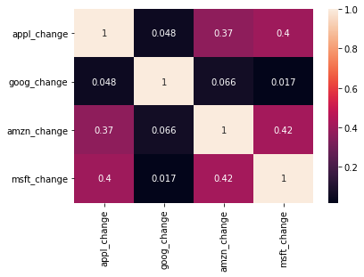

```python
import pandas as pd
import numpy as np
import matplotlib.pyplot as plt
import seaborn as sns

# Avoid warning
from warnings import filterwarnings
filterwarnings('ignore')
```

##### The tech stocks we'll use for this analysis

```python
path = '/content/'
company_list = ['AAPL_data.csv', 'GOOG_data.csv', 'MSFT_data.csv', 'AMZN_data.csv']

#blank dataframe
all_data = pd.DataFrame()

for file in company_list:
    current_df = pd.read_csv(f'{path}{file}')
    all_data = pd.concat([all_data, current_df])
    
all_data.shape
```

    (4752, 7)

```python
all_data.head()
```

  <div id="df-f1af04b3-5cde-4419-bae1-887e61f3b4c3">
    <div class="colab-df-container">
      <div>
<style scoped>
    .dataframe tbody tr th:only-of-type {
        vertical-align: middle;
    }

    .dataframe tbody tr th {
        vertical-align: top;
    }

    .dataframe thead th {
        text-align: right;
    }
</style>
<table border="1" class="dataframe">
  <thead>
    <tr style="text-align: right;">
      <th></th>
      <th>date</th>
      <th>open</th>
      <th>high</th>
      <th>low</th>
      <th>close</th>
      <th>volume</th>
      <th>Name</th>
    </tr>
  </thead>
  <tbody>
    <tr>
      <th>0</th>
      <td>2013-02-08</td>
      <td>67.7142</td>
      <td>68.4014</td>
      <td>66.8928</td>
      <td>67.8542</td>
      <td>158168416</td>
      <td>AAPL</td>
    </tr>
    <tr>
      <th>1</th>
      <td>2013-02-11</td>
      <td>68.0714</td>
      <td>69.2771</td>
      <td>67.6071</td>
      <td>68.5614</td>
      <td>129029425</td>
      <td>AAPL</td>
    </tr>
    <tr>
      <th>2</th>
      <td>2013-02-12</td>
      <td>68.5014</td>
      <td>68.9114</td>
      <td>66.8205</td>
      <td>66.8428</td>
      <td>151829363</td>
      <td>AAPL</td>
    </tr>
    <tr>
      <th>3</th>
      <td>2013-02-13</td>
      <td>66.7442</td>
      <td>67.6628</td>
      <td>66.1742</td>
      <td>66.7156</td>
      <td>118721995</td>
      <td>AAPL</td>
    </tr>
    <tr>
      <th>4</th>
      <td>2013-02-14</td>
      <td>66.3599</td>
      <td>67.3771</td>
      <td>66.2885</td>
      <td>66.6556</td>
      <td>88809154</td>
      <td>AAPL</td>
    </tr>
  </tbody>
</table>
</div>

```python
all_data.dtypes
```

    date       object
    open      float64
    high      float64
    low       float64
    close     float64
    volume      int64
    Name       object
    dtype: object

```python
all_data['date'] = pd.to_datetime(all_data['date'])
all_data.columns
```

    Index(['date', 'open', 'high', 'low', 'close', 'volume', 'Name'], dtype='object')

## Analyse closing price of all the stocks

```python
tech_list = all_data['Name'].unique()

plt.figure(figsize=(20, 12))
for i, company in enumerate(tech_list, 1):
    plt.subplot(2, 2, i)
    df = all_data[all_data['Name'] == company]
    plt.plot(df['date'], df['close'])
    plt.title(company)    
```
    


## Let's analyse the total volume of stock being traded each day

```python
plt.figure(figsize=(20,12))
for i, company in enumerate(tech_list, 1):
    plt.subplot(2, 2, i)
    df = all_data[all_data['Name']==company]
    plt.plot(df['date'],df['volume'])
    plt.title(company)

```
    

   
## Using plotly

```python
import plotly.express as px

for company in (tech_list):
    df = all_data[all_data['Name']==company]
    fig = px.line(df, x="date", y="volume", title=company)
    fig.show()
```

<html>
<head><meta charset="utf-8" /></head>
<body>
    <div>            <script src="https://cdnjs.cloudflare.com/ajax/libs/mathjax/2.7.5/MathJax.js?config=TeX-AMS-MML_SVG"></script><script type="text/javascript">if (window.MathJax) {MathJax.Hub.Config({SVG: {font: "STIX-Web"}});}</script>                <script type="text/javascript">window.PlotlyConfig = {MathJaxConfig: 'local'};</script>
        <script src="https://cdn.plot.ly/plotly-2.8.3.min.js"></script>                <div id="ffe23f0d-d1cc-4fda-87ff-37fcca05c18d" class="plotly-graph-div" style="height:525px; width:100%;"></div>            <script type="text/javascript">                                    window.PLOTLYENV=window.PLOTLYENV || {};                                    if (document.getElementById("ffe23f0d-d1cc-4fda-87ff-37fcca05c18d")) {                    Plotly.newPlot(                        "ffe23f0d-d1cc-4fda-87ff-37fcca05c18d",                        [{"hovertemplate":"date=%{x}<br>volume=%{y}<extra></extra>","legendgroup":"","line":{"color":"#636efa","dash":"solid"},"marker":{"symbol":"circle"},"mode":"lines","name":"","showlegend":false,"x":["2013-02-08T00:00:00","2013-02-11T00:00:00","2013-02-12T00:00:00","2013-02-13T00:00:00","2013-02-14T00:00:00","2013-02-15T00:00:00","2013-02-19T00:00:00","2013-02-20T00:00:00","2013-02-21T00:00:00","2013-02-22T00:00:00","2013-02-25T00:00:00","2013-02-26T00:00:00","2013-02-27T00:00:00","2013-02-28T00:00:00","2013-03-01T00:00:00","2013-03-04T00:00:00","2013-03-05T00:00:00","2013-03-06T00:00:00","2013-03-07T00:00:00","2013-03-08T00:00:00","2013-03-11T00:00:00","2013-03-12T00:00:00","2013-03-13T00:00:00","2013-03-14T00:00:00","2013-03-15T00:00:00","2013-03-18T00:00:00","2013-03-19T00:00:00","2013-03-20T00:00:00","2013-03-21T00:00:00","2013-03-22T00:00:00","2013-03-25T00:00:00","2013-03-26T00:00:00","2013-03-27T00:00:00","2013-03-28T00:00:00","2013-04-01T00:00:00","2013-04-02T00:00:00","2013-04-03T00:00:00","2013-04-04T00:00:00","2013-04-05T00:00:00","2013-04-08T00:00:00","2013-04-09T00:00:00","2013-04-10T00:00:00","2013-04-11T00:00:00","2013-04-12T00:00:00","2013-04-15T00:00:00","2013-04-16T00:00:00","2013-04-17T00:00:00","2013-04-18T00:00:00","2013-04-19T00:00:00","2013-04-22T00:00:00","2013-04-23T00:00:00","2013-04-24T00:00:00","2013-04-25T00:00:00","2013-04-26T00:00:00","2013-04-29T00:00:00","2013-04-30T00:00:00","2013-05-01T00:00:00","2013-05-02T00:00:00","2013-05-03T00:00:00","2013-05-06T00:00:00","2013-05-07T00:00:00","2013-05-08T00:00:00","2013-05-09T00:00:00","2013-05-10T00:00:00","2013-05-13T00:00:00","2013-05-14T00:00:00","2013-05-15T00:00:00","2013-05-16T00:00:00","2013-05-17T00:00:00","2013-05-20T00:00:00","2013-05-21T00:00:00","2013-05-22T00:00:00","2013-05-23T00:00:00","2013-05-24T00:00:00","2013-05-28T00:00:00","2013-05-29T00:00:00","2013-05-30T00:00:00","2013-05-31T00:00:00","2013-06-03T00:00:00","2013-06-04T00:00:00","2013-06-05T00:00:00","2013-06-06T00:00:00","2013-06-07T00:00:00","2013-06-10T00:00:00","2013-06-11T00:00:00","2013-06-12T00:00:00","2013-06-13T00:00:00","2013-06-14T00:00:00","2013-06-17T00:00:00","2013-06-18T00:00:00","2013-06-19T00:00:00","2013-06-20T00:00:00","2013-06-21T00:00:00","2013-06-24T00:00:00","2013-06-25T00:00:00","2013-06-26T00:00:00","2013-06-27T00:00:00","2013-06-28T00:00:00","2013-07-01T00:00:00","2013-07-02T00:00:00","2013-07-03T00:00:00","2013-07-05T00:00:00","2013-07-08T00:00:00","2013-07-09T00:00:00","2013-07-10T00:00:00","2013-07-11T00:00:00","2013-07-12T00:00:00","2013-07-15T00:00:00","2013-07-16T00:00:00","2013-07-17T00:00:00","2013-07-18T00:00:00","2013-07-19T00:00:00","2013-07-22T00:00:00","2013-07-23T00:00:00","2013-07-24T00:00:00","2013-07-25T00:00:00","2013-07-26T00:00:00","2013-07-29T00:00:00","2013-07-30T00:00:00","2013-07-31T00:00:00","2013-08-01T00:00:00","2013-08-02T00:00:00","2013-08-05T00:00:00","2013-08-06T00:00:00","2013-08-07T00:00:00","2013-08-08T00:00:00","2013-08-09T00:00:00","2013-08-12T00:00:00","2013-08-13T00:00:00","2013-08-14T00:00:00","2013-08-15T00:00:00","2013-08-16T00:00:00","2013-08-19T00:00:00","2013-08-20T00:00:00","2013-08-21T00:00:00","2013-08-22T00:00:00","2013-08-23T00:00:00","2013-08-26T00:00:00","2013-08-27T00:00:00","2013-08-28T00:00:00","2013-08-29T00:00:00","2013-08-30T00:00:00","2013-09-03T00:00:00","2013-09-04T00:00:00","2013-09-05T00:00:00","2013-09-06T00:00:00","2013-09-09T00:00:00","2013-09-10T00:00:00","2013-09-11T00:00:00","2013-09-12T00:00:00","2013-09-13T00:00:00","2013-09-16T00:00:00","2013-09-17T00:00:00","2013-09-18T00:00:00","2013-09-19T00:00:00","2013-09-20T00:00:00","2013-09-23T00:00:00","2013-09-24T00:00:00","2013-09-25T00:00:00","2013-09-26T00:00:00","2013-09-27T00:00:00","2013-09-30T00:00:00","2013-10-01T00:00:00","2013-10-02T00:00:00","2013-10-03T00:00:00","2013-10-04T00:00:00","2013-10-07T00:00:00","2013-10-08T00:00:00","2013-10-09T00:00:00","2013-10-10T00:00:00","2013-10-11T00:00:00","2013-10-14T00:00:00","2013-10-15T00:00:00","2013-10-16T00:00:00","2013-10-17T00:00:00","2013-10-18T00:00:00","2013-10-21T00:00:00","2013-10-22T00:00:00","2013-10-23T00:00:00","2013-10-24T00:00:00","2013-10-25T00:00:00","2013-10-28T00:00:00","2013-10-29T00:00:00","2013-10-30T00:00:00","2013-10-31T00:00:00","2013-11-01T00:00:00","2013-11-04T00:00:00","2013-11-05T00:00:00","2013-11-06T00:00:00","2013-11-07T00:00:00","2013-11-08T00:00:00","2013-11-11T00:00:00","2013-11-12T00:00:00","2013-11-13T00:00:00","2013-11-14T00:00:00","2013-11-15T00:00:00","2013-11-18T00:00:00","2013-11-19T00:00:00","2013-11-20T00:00:00","2013-11-21T00:00:00","2013-11-22T00:00:00","2013-11-25T00:00:00","2013-11-26T00:00:00","2013-11-27T00:00:00","2013-11-29T00:00:00","2013-12-02T00:00:00","2013-12-03T00:00:00","2013-12-04T00:00:00","2013-12-05T00:00:00","2013-12-06T00:00:00","2013-12-09T00:00:00","2013-12-10T00:00:00","2013-12-11T00:00:00","2013-12-12T00:00:00","2013-12-13T00:00:00","2013-12-16T00:00:00","2013-12-17T00:00:00","2013-12-18T00:00:00","2013-12-19T00:00:00","2013-12-20T00:00:00","2013-12-23T00:00:00","2013-12-24T00:00:00","2013-12-26T00:00:00","2013-12-27T00:00:00","2013-12-30T00:00:00","2013-12-31T00:00:00","2014-01-02T00:00:00","2014-01-03T00:00:00","2014-01-06T00:00:00","2014-01-07T00:00:00","2014-01-08T00:00:00","2014-01-09T00:00:00","2014-01-10T00:00:00","2014-01-13T00:00:00","2014-01-14T00:00:00","2014-01-15T00:00:00","2014-01-16T00:00:00","2014-01-17T00:00:00","2014-01-21T00:00:00","2014-01-22T00:00:00","2014-01-23T00:00:00","2014-01-24T00:00:00","2014-01-27T00:00:00","2014-01-28T00:00:00","2014-01-29T00:00:00","2014-01-30T00:00:00","2014-01-31T00:00:00","2014-02-03T00:00:00","2014-02-04T00:00:00","2014-02-05T00:00:00","2014-02-06T00:00:00","2014-02-07T00:00:00","2014-02-10T00:00:00","2014-02-11T00:00:00","2014-02-12T00:00:00","2014-02-13T00:00:00","2014-02-14T00:00:00","2014-02-18T00:00:00","2014-02-19T00:00:00","2014-02-20T00:00:00","2014-02-21T00:00:00","2014-02-24T00:00:00","2014-02-25T00:00:00","2014-02-26T00:00:00","2014-02-27T00:00:00","2014-02-28T00:00:00","2014-03-03T00:00:00","2014-03-04T00:00:00","2014-03-05T00:00:00","2014-03-06T00:00:00","2014-03-07T00:00:00","2014-03-10T00:00:00","2014-03-11T00:00:00","2014-03-12T00:00:00","2014-03-13T00:00:00","2014-03-14T00:00:00","2014-03-17T00:00:00","2014-03-18T00:00:00","2014-03-19T00:00:00","2014-03-20T00:00:00","2014-03-21T00:00:00","2014-03-24T00:00:00","2014-03-25T00:00:00","2014-03-26T00:00:00","2014-03-27T00:00:00","2014-03-28T00:00:00","2014-03-31T00:00:00","2014-04-01T00:00:00","2014-04-02T00:00:00","2014-04-03T00:00:00","2014-04-04T00:00:00","2014-04-07T00:00:00","2014-04-08T00:00:00","2014-04-09T00:00:00","2014-04-10T00:00:00","2014-04-11T00:00:00","2014-04-14T00:00:00","2014-04-15T00:00:00","2014-04-16T00:00:00","2014-04-17T00:00:00","2014-04-21T00:00:00","2014-04-22T00:00:00","2014-04-23T00:00:00","2014-04-24T00:00:00","2014-04-25T00:00:00","2014-04-28T00:00:00","2014-04-29T00:00:00","2014-04-30T00:00:00","2014-05-01T00:00:00","2014-05-02T00:00:00","2014-05-05T00:00:00","2014-05-06T00:00:00","2014-05-07T00:00:00","2014-05-08T00:00:00","2014-05-09T00:00:00","2014-05-12T00:00:00","2014-05-13T00:00:00","2014-05-14T00:00:00","2014-05-15T00:00:00","2014-05-16T00:00:00","2014-05-19T00:00:00","2014-05-20T00:00:00","2014-05-21T00:00:00","2014-05-22T00:00:00","2014-05-23T00:00:00","2014-05-27T00:00:00","2014-05-28T00:00:00","2014-05-29T00:00:00","2014-05-30T00:00:00","2014-06-02T00:00:00","2014-06-03T00:00:00","2014-06-04T00:00:00","2014-06-05T00:00:00","2014-06-06T00:00:00","2014-06-09T00:00:00","2014-06-10T00:00:00","2014-06-11T00:00:00","2014-06-12T00:00:00","2014-06-13T00:00:00","2014-06-16T00:00:00","2014-06-17T00:00:00","2014-06-18T00:00:00","2014-06-19T00:00:00","2014-06-20T00:00:00","2014-06-23T00:00:00","2014-06-24T00:00:00","2014-06-25T00:00:00","2014-06-26T00:00:00","2014-06-27T00:00:00","2014-06-30T00:00:00","2014-07-01T00:00:00","2014-07-02T00:00:00","2014-07-03T00:00:00","2014-07-07T00:00:00","2014-07-08T00:00:00","2014-07-09T00:00:00","2014-07-10T00:00:00","2014-07-11T00:00:00","2014-07-14T00:00:00","2014-07-15T00:00:00","2014-07-16T00:00:00","2014-07-17T00:00:00","2014-07-18T00:00:00","2014-07-21T00:00:00","2014-07-22T00:00:00","2014-07-23T00:00:00","2014-07-24T00:00:00","2014-07-25T00:00:00","2014-07-28T00:00:00","2014-07-29T00:00:00","2014-07-30T00:00:00","2014-07-31T00:00:00","2014-08-01T00:00:00","2014-08-04T00:00:00","2014-08-05T00:00:00","2014-08-06T00:00:00","2014-08-07T00:00:00","2014-08-08T00:00:00","2014-08-11T00:00:00","2014-08-12T00:00:00","2014-08-13T00:00:00","2014-08-14T00:00:00","2014-08-15T00:00:00","2014-08-18T00:00:00","2014-08-19T00:00:00","2014-08-20T00:00:00","2014-08-21T00:00:00","2014-08-22T00:00:00","2014-08-25T00:00:00","2014-08-26T00:00:00","2014-08-27T00:00:00","2014-08-28T00:00:00","2014-08-29T00:00:00","2014-09-02T00:00:00","2014-09-03T00:00:00","2014-09-04T00:00:00","2014-09-05T00:00:00","2014-09-08T00:00:00","2014-09-09T00:00:00","2014-09-10T00:00:00","2014-09-11T00:00:00","2014-09-12T00:00:00","2014-09-15T00:00:00","2014-09-16T00:00:00","2014-09-17T00:00:00","2014-09-18T00:00:00","2014-09-19T00:00:00","2014-09-22T00:00:00","2014-09-23T00:00:00","2014-09-24T00:00:00","2014-09-25T00:00:00","2014-09-26T00:00:00","2014-09-29T00:00:00","2014-09-30T00:00:00","2014-10-01T00:00:00","2014-10-02T00:00:00","2014-10-03T00:00:00","2014-10-06T00:00:00","2014-10-07T00:00:00","2014-10-08T00:00:00","2014-10-09T00:00:00","2014-10-10T00:00:00","2014-10-13T00:00:00","2014-10-14T00:00:00","2014-10-15T00:00:00","2014-10-16T00:00:00","2014-10-17T00:00:00","2014-10-20T00:00:00","2014-10-21T00:00:00","2014-10-22T00:00:00","2014-10-23T00:00:00","2014-10-24T00:00:00","2014-10-27T00:00:00","2014-10-28T00:00:00","2014-10-29T00:00:00","2014-10-30T00:00:00","2014-10-31T00:00:00","2014-11-03T00:00:00","2014-11-04T00:00:00","2014-11-05T00:00:00","2014-11-06T00:00:00","2014-11-07T00:00:00","2014-11-10T00:00:00","2014-11-11T00:00:00","2014-11-12T00:00:00","2014-11-13T00:00:00","2014-11-14T00:00:00","2014-11-17T00:00:00","2014-11-18T00:00:00","2014-11-19T00:00:00","2014-11-20T00:00:00","2014-11-21T00:00:00","2014-11-24T00:00:00","2014-11-25T00:00:00","2014-11-26T00:00:00","2014-11-28T00:00:00","2014-12-01T00:00:00","2014-12-02T00:00:00","2014-12-03T00:00:00","2014-12-04T00:00:00","2014-12-05T00:00:00","2014-12-08T00:00:00","2014-12-09T00:00:00","2014-12-10T00:00:00","2014-12-11T00:00:00","2014-12-12T00:00:00","2014-12-15T00:00:00","2014-12-16T00:00:00","2014-12-17T00:00:00","2014-12-18T00:00:00","2014-12-19T00:00:00","2014-12-22T00:00:00","2014-12-23T00:00:00","2014-12-24T00:00:00","2014-12-26T00:00:00","2014-12-29T00:00:00","2014-12-30T00:00:00","2014-12-31T00:00:00","2015-01-02T00:00:00","2015-01-05T00:00:00","2015-01-06T00:00:00","2015-01-07T00:00:00","2015-01-08T00:00:00","2015-01-09T00:00:00","2015-01-12T00:00:00","2015-01-13T00:00:00","2015-01-14T00:00:00","2015-01-15T00:00:00","2015-01-16T00:00:00","2015-01-20T00:00:00","2015-01-21T00:00:00","2015-01-22T00:00:00","2015-01-23T00:00:00","2015-01-26T00:00:00","2015-01-27T00:00:00","2015-01-28T00:00:00","2015-01-29T00:00:00","2015-01-30T00:00:00","2015-02-02T00:00:00","2015-02-03T00:00:00","2015-02-04T00:00:00","2015-02-05T00:00:00","2015-02-06T00:00:00","2015-02-09T00:00:00","2015-02-10T00:00:00","2015-02-11T00:00:00","2015-02-12T00:00:00","2015-02-13T00:00:00","2015-02-17T00:00:00","2015-02-18T00:00:00","2015-02-19T00:00:00","2015-02-20T00:00:00","2015-02-23T00:00:00","2015-02-24T00:00:00","2015-02-25T00:00:00","2015-02-26T00:00:00","2015-02-27T00:00:00","2015-03-02T00:00:00","2015-03-03T00:00:00","2015-03-04T00:00:00","2015-03-05T00:00:00","2015-03-06T00:00:00","2015-03-09T00:00:00","2015-03-10T00:00:00","2015-03-11T00:00:00","2015-03-12T00:00:00","2015-03-13T00:00:00","2015-03-16T00:00:00","2015-03-17T00:00:00","2015-03-18T00:00:00","2015-03-19T00:00:00","2015-03-20T00:00:00","2015-03-23T00:00:00","2015-03-24T00:00:00","2015-03-25T00:00:00","2015-03-26T00:00:00","2015-03-27T00:00:00","2015-03-30T00:00:00","2015-03-31T00:00:00","2015-04-01T00:00:00","2015-04-02T00:00:00","2015-04-06T00:00:00","2015-04-07T00:00:00","2015-04-08T00:00:00","2015-04-09T00:00:00","2015-04-10T00:00:00","2015-04-13T00:00:00","2015-04-14T00:00:00","2015-04-15T00:00:00","2015-04-16T00:00:00","2015-04-17T00:00:00","2015-04-20T00:00:00","2015-04-21T00:00:00","2015-04-22T00:00:00","2015-04-23T00:00:00","2015-04-24T00:00:00","2015-04-27T00:00:00","2015-04-28T00:00:00","2015-04-29T00:00:00","2015-04-30T00:00:00","2015-05-01T00:00:00","2015-05-04T00:00:00","2015-05-05T00:00:00","2015-05-06T00:00:00","2015-05-07T00:00:00","2015-05-08T00:00:00","2015-05-11T00:00:00","2015-05-12T00:00:00","2015-05-13T00:00:00","2015-05-14T00:00:00","2015-05-15T00:00:00","2015-05-18T00:00:00","2015-05-19T00:00:00","2015-05-20T00:00:00","2015-05-21T00:00:00","2015-05-22T00:00:00","2015-05-26T00:00:00","2015-05-27T00:00:00","2015-05-28T00:00:00","2015-05-29T00:00:00","2015-06-01T00:00:00","2015-06-02T00:00:00","2015-06-03T00:00:00","2015-06-04T00:00:00","2015-06-05T00:00:00","2015-06-08T00:00:00","2015-06-09T00:00:00","2015-06-10T00:00:00","2015-06-11T00:00:00","2015-06-12T00:00:00","2015-06-15T00:00:00","2015-06-16T00:00:00","2015-06-17T00:00:00","2015-06-18T00:00:00","2015-06-19T00:00:00","2015-06-22T00:00:00","2015-06-23T00:00:00","2015-06-24T00:00:00","2015-06-25T00:00:00","2015-06-26T00:00:00","2015-06-29T00:00:00","2015-06-30T00:00:00","2015-07-01T00:00:00","2015-07-02T00:00:00","2015-07-06T00:00:00","2015-07-07T00:00:00","2015-07-08T00:00:00","2015-07-09T00:00:00","2015-07-10T00:00:00","2015-07-13T00:00:00","2015-07-14T00:00:00","2015-07-15T00:00:00","2015-07-16T00:00:00","2015-07-17T00:00:00","2015-07-20T00:00:00","2015-07-21T00:00:00","2015-07-22T00:00:00","2015-07-23T00:00:00","2015-07-24T00:00:00","2015-07-27T00:00:00","2015-07-28T00:00:00","2015-07-29T00:00:00","2015-07-30T00:00:00","2015-07-31T00:00:00","2015-08-03T00:00:00","2015-08-04T00:00:00","2015-08-05T00:00:00","2015-08-06T00:00:00","2015-08-07T00:00:00","2015-08-10T00:00:00","2015-08-11T00:00:00","2015-08-12T00:00:00","2015-08-13T00:00:00","2015-08-14T00:00:00","2015-08-17T00:00:00","2015-08-18T00:00:00","2015-08-19T00:00:00","2015-08-20T00:00:00","2015-08-21T00:00:00","2015-08-24T00:00:00","2015-08-25T00:00:00","2015-08-26T00:00:00","2015-08-27T00:00:00","2015-08-28T00:00:00","2015-08-31T00:00:00","2015-09-01T00:00:00","2015-09-02T00:00:00","2015-09-03T00:00:00","2015-09-04T00:00:00","2015-09-08T00:00:00","2015-09-09T00:00:00","2015-09-10T00:00:00","2015-09-11T00:00:00","2015-09-14T00:00:00","2015-09-15T00:00:00","2015-09-16T00:00:00","2015-09-17T00:00:00","2015-09-18T00:00:00","2015-09-21T00:00:00","2015-09-22T00:00:00","2015-09-23T00:00:00","2015-09-24T00:00:00","2015-09-25T00:00:00","2015-09-28T00:00:00","2015-09-29T00:00:00","2015-09-30T00:00:00","2015-10-01T00:00:00","2015-10-02T00:00:00","2015-10-05T00:00:00","2015-10-06T00:00:00","2015-10-07T00:00:00","2015-10-08T00:00:00","2015-10-09T00:00:00","2015-10-12T00:00:00","2015-10-13T00:00:00","2015-10-14T00:00:00","2015-10-15T00:00:00","2015-10-16T00:00:00","2015-10-19T00:00:00","2015-10-20T00:00:00","2015-10-21T00:00:00","2015-10-22T00:00:00","2015-10-23T00:00:00","2015-10-26T00:00:00","2015-10-27T00:00:00","2015-10-28T00:00:00","2015-10-29T00:00:00","2015-10-30T00:00:00","2015-11-02T00:00:00","2015-11-03T00:00:00","2015-11-04T00:00:00","2015-11-05T00:00:00","2015-11-06T00:00:00","2015-11-09T00:00:00","2015-11-10T00:00:00","2015-11-11T00:00:00","2015-11-12T00:00:00","2015-11-13T00:00:00","2015-11-16T00:00:00","2015-11-17T00:00:00","2015-11-18T00:00:00","2015-11-19T00:00:00","2015-11-20T00:00:00","2015-11-23T00:00:00","2015-11-24T00:00:00","2015-11-25T00:00:00","2015-11-27T00:00:00","2015-11-30T00:00:00","2015-12-01T00:00:00","2015-12-02T00:00:00","2015-12-03T00:00:00","2015-12-04T00:00:00","2015-12-07T00:00:00","2015-12-08T00:00:00","2015-12-09T00:00:00","2015-12-10T00:00:00","2015-12-11T00:00:00","2015-12-14T00:00:00","2015-12-15T00:00:00","2015-12-16T00:00:00","2015-12-17T00:00:00","2015-12-18T00:00:00","2015-12-21T00:00:00","2015-12-22T00:00:00","2015-12-23T00:00:00","2015-12-24T00:00:00","2015-12-28T00:00:00","2015-12-29T00:00:00","2015-12-30T00:00:00","2015-12-31T00:00:00","2016-01-04T00:00:00","2016-01-05T00:00:00","2016-01-06T00:00:00","2016-01-07T00:00:00","2016-01-08T00:00:00","2016-01-11T00:00:00","2016-01-12T00:00:00","2016-01-13T00:00:00","2016-01-14T00:00:00","2016-01-15T00:00:00","2016-01-19T00:00:00","2016-01-20T00:00:00","2016-01-21T00:00:00","2016-01-22T00:00:00","2016-01-25T00:00:00","2016-01-26T00:00:00","2016-01-27T00:00:00","2016-01-28T00:00:00","2016-01-29T00:00:00","2016-02-01T00:00:00","2016-02-02T00:00:00","2016-02-03T00:00:00","2016-02-04T00:00:00","2016-02-05T00:00:00","2016-02-08T00:00:00","2016-02-09T00:00:00","2016-02-10T00:00:00","2016-02-11T00:00:00","2016-02-12T00:00:00","2016-02-16T00:00:00","2016-02-17T00:00:00","2016-02-18T00:00:00","2016-02-19T00:00:00","2016-02-22T00:00:00","2016-02-23T00:00:00","2016-02-24T00:00:00","2016-02-25T00:00:00","2016-02-26T00:00:00","2016-02-29T00:00:00","2016-03-01T00:00:00","2016-03-02T00:00:00","2016-03-03T00:00:00","2016-03-04T00:00:00","2016-03-07T00:00:00","2016-03-08T00:00:00","2016-03-09T00:00:00","2016-03-10T00:00:00","2016-03-11T00:00:00","2016-03-14T00:00:00","2016-03-15T00:00:00","2016-03-16T00:00:00","2016-03-17T00:00:00","2016-03-18T00:00:00","2016-03-21T00:00:00","2016-03-22T00:00:00","2016-03-23T00:00:00","2016-03-24T00:00:00","2016-03-28T00:00:00","2016-03-29T00:00:00","2016-03-30T00:00:00","2016-03-31T00:00:00","2016-04-01T00:00:00","2016-04-04T00:00:00","2016-04-05T00:00:00","2016-04-06T00:00:00","2016-04-07T00:00:00","2016-04-08T00:00:00","2016-04-11T00:00:00","2016-04-12T00:00:00","2016-04-13T00:00:00","2016-04-14T00:00:00","2016-04-15T00:00:00","2016-04-18T00:00:00","2016-04-19T00:00:00","2016-04-20T00:00:00","2016-04-21T00:00:00","2016-04-22T00:00:00","2016-04-25T00:00:00","2016-04-26T00:00:00","2016-04-27T00:00:00","2016-04-28T00:00:00","2016-04-29T00:00:00","2016-05-02T00:00:00","2016-05-03T00:00:00","2016-05-04T00:00:00","2016-05-05T00:00:00","2016-05-06T00:00:00","2016-05-09T00:00:00","2016-05-10T00:00:00","2016-05-11T00:00:00","2016-05-12T00:00:00","2016-05-13T00:00:00","2016-05-16T00:00:00","2016-05-17T00:00:00","2016-05-18T00:00:00","2016-05-19T00:00:00","2016-05-20T00:00:00","2016-05-23T00:00:00","2016-05-24T00:00:00","2016-05-25T00:00:00","2016-05-26T00:00:00","2016-05-27T00:00:00","2016-05-31T00:00:00","2016-06-01T00:00:00","2016-06-02T00:00:00","2016-06-03T00:00:00","2016-06-06T00:00:00","2016-06-07T00:00:00","2016-06-08T00:00:00","2016-06-09T00:00:00","2016-06-10T00:00:00","2016-06-13T00:00:00","2016-06-14T00:00:00","2016-06-15T00:00:00","2016-06-16T00:00:00","2016-06-17T00:00:00","2016-06-20T00:00:00","2016-06-21T00:00:00","2016-06-22T00:00:00","2016-06-23T00:00:00","2016-06-24T00:00:00","2016-06-27T00:00:00","2016-06-28T00:00:00","2016-06-29T00:00:00","2016-06-30T00:00:00","2016-07-01T00:00:00","2016-07-05T00:00:00","2016-07-06T00:00:00","2016-07-07T00:00:00","2016-07-08T00:00:00","2016-07-11T00:00:00","2016-07-12T00:00:00","2016-07-13T00:00:00","2016-07-14T00:00:00","2016-07-15T00:00:00","2016-07-18T00:00:00","2016-07-19T00:00:00","2016-07-20T00:00:00","2016-07-21T00:00:00","2016-07-22T00:00:00","2016-07-25T00:00:00","2016-07-26T00:00:00","2016-07-27T00:00:00","2016-07-28T00:00:00","2016-07-29T00:00:00","2016-08-01T00:00:00","2016-08-02T00:00:00","2016-08-03T00:00:00","2016-08-04T00:00:00","2016-08-05T00:00:00","2016-08-08T00:00:00","2016-08-09T00:00:00","2016-08-10T00:00:00","2016-08-11T00:00:00","2016-08-12T00:00:00","2016-08-15T00:00:00","2016-08-16T00:00:00","2016-08-17T00:00:00","2016-08-18T00:00:00","2016-08-19T00:00:00","2016-08-22T00:00:00","2016-08-23T00:00:00","2016-08-24T00:00:00","2016-08-25T00:00:00","2016-08-26T00:00:00","2016-08-29T00:00:00","2016-08-30T00:00:00","2016-08-31T00:00:00","2016-09-01T00:00:00","2016-09-02T00:00:00","2016-09-06T00:00:00","2016-09-07T00:00:00","2016-09-08T00:00:00","2016-09-09T00:00:00","2016-09-12T00:00:00","2016-09-13T00:00:00","2016-09-14T00:00:00","2016-09-15T00:00:00","2016-09-16T00:00:00","2016-09-19T00:00:00","2016-09-20T00:00:00","2016-09-21T00:00:00","2016-09-22T00:00:00","2016-09-23T00:00:00","2016-09-26T00:00:00","2016-09-27T00:00:00","2016-09-28T00:00:00","2016-09-29T00:00:00","2016-09-30T00:00:00","2016-10-03T00:00:00","2016-10-04T00:00:00","2016-10-05T00:00:00","2016-10-06T00:00:00","2016-10-07T00:00:00","2016-10-10T00:00:00","2016-10-11T00:00:00","2016-10-12T00:00:00","2016-10-13T00:00:00","2016-10-14T00:00:00","2016-10-17T00:00:00","2016-10-18T00:00:00","2016-10-19T00:00:00","2016-10-20T00:00:00","2016-10-21T00:00:00","2016-10-24T00:00:00","2016-10-25T00:00:00","2016-10-26T00:00:00","2016-10-27T00:00:00","2016-10-28T00:00:00","2016-10-31T00:00:00","2016-11-01T00:00:00","2016-11-02T00:00:00","2016-11-03T00:00:00","2016-11-04T00:00:00","2016-11-07T00:00:00","2016-11-08T00:00:00","2016-11-09T00:00:00","2016-11-10T00:00:00","2016-11-11T00:00:00","2016-11-14T00:00:00","2016-11-15T00:00:00","2016-11-16T00:00:00","2016-11-17T00:00:00","2016-11-18T00:00:00","2016-11-21T00:00:00","2016-11-22T00:00:00","2016-11-23T00:00:00","2016-11-25T00:00:00","2016-11-28T00:00:00","2016-11-29T00:00:00","2016-11-30T00:00:00","2016-12-01T00:00:00","2016-12-02T00:00:00","2016-12-05T00:00:00","2016-12-06T00:00:00","2016-12-07T00:00:00","2016-12-08T00:00:00","2016-12-09T00:00:00","2016-12-12T00:00:00","2016-12-13T00:00:00","2016-12-14T00:00:00","2016-12-15T00:00:00","2016-12-16T00:00:00","2016-12-19T00:00:00","2016-12-20T00:00:00","2016-12-21T00:00:00","2016-12-22T00:00:00","2016-12-23T00:00:00","2016-12-27T00:00:00","2016-12-28T00:00:00","2016-12-29T00:00:00","2016-12-30T00:00:00","2017-01-03T00:00:00","2017-01-04T00:00:00","2017-01-05T00:00:00","2017-01-06T00:00:00","2017-01-09T00:00:00","2017-01-10T00:00:00","2017-01-11T00:00:00","2017-01-12T00:00:00","2017-01-13T00:00:00","2017-01-17T00:00:00","2017-01-18T00:00:00","2017-01-19T00:00:00","2017-01-20T00:00:00","2017-01-23T00:00:00","2017-01-24T00:00:00","2017-01-25T00:00:00","2017-01-26T00:00:00","2017-01-27T00:00:00","2017-01-30T00:00:00","2017-01-31T00:00:00","2017-02-01T00:00:00","2017-02-02T00:00:00","2017-02-03T00:00:00","2017-02-06T00:00:00","2017-02-07T00:00:00","2017-02-08T00:00:00","2017-02-09T00:00:00","2017-02-10T00:00:00","2017-02-13T00:00:00","2017-02-14T00:00:00","2017-02-15T00:00:00","2017-02-16T00:00:00","2017-02-17T00:00:00","2017-02-21T00:00:00","2017-02-22T00:00:00","2017-02-23T00:00:00","2017-02-24T00:00:00","2017-02-27T00:00:00","2017-02-28T00:00:00","2017-03-01T00:00:00","2017-03-02T00:00:00","2017-03-03T00:00:00","2017-03-06T00:00:00","2017-03-07T00:00:00","2017-03-08T00:00:00","2017-03-09T00:00:00","2017-03-10T00:00:00","2017-03-13T00:00:00","2017-03-14T00:00:00","2017-03-15T00:00:00","2017-03-16T00:00:00","2017-03-17T00:00:00","2017-03-20T00:00:00","2017-03-21T00:00:00","2017-03-22T00:00:00","2017-03-23T00:00:00","2017-03-24T00:00:00","2017-03-27T00:00:00","2017-03-28T00:00:00","2017-03-29T00:00:00","2017-03-30T00:00:00","2017-03-31T00:00:00","2017-04-03T00:00:00","2017-04-04T00:00:00","2017-04-05T00:00:00","2017-04-06T00:00:00","2017-04-07T00:00:00","2017-04-10T00:00:00","2017-04-11T00:00:00","2017-04-12T00:00:00","2017-04-13T00:00:00","2017-04-17T00:00:00","2017-04-18T00:00:00","2017-04-19T00:00:00","2017-04-20T00:00:00","2017-04-21T00:00:00","2017-04-24T00:00:00","2017-04-25T00:00:00","2017-04-26T00:00:00","2017-04-27T00:00:00","2017-04-28T00:00:00","2017-05-01T00:00:00","2017-05-02T00:00:00","2017-05-03T00:00:00","2017-05-04T00:00:00","2017-05-05T00:00:00","2017-05-08T00:00:00","2017-05-09T00:00:00","2017-05-10T00:00:00","2017-05-11T00:00:00","2017-05-12T00:00:00","2017-05-15T00:00:00","2017-05-16T00:00:00","2017-05-17T00:00:00","2017-05-18T00:00:00","2017-05-19T00:00:00","2017-05-22T00:00:00","2017-05-23T00:00:00","2017-05-24T00:00:00","2017-05-25T00:00:00","2017-05-26T00:00:00","2017-05-30T00:00:00","2017-05-31T00:00:00","2017-06-01T00:00:00","2017-06-02T00:00:00","2017-06-05T00:00:00","2017-06-06T00:00:00","2017-06-07T00:00:00","2017-06-08T00:00:00","2017-06-09T00:00:00","2017-06-12T00:00:00","2017-06-13T00:00:00","2017-06-14T00:00:00","2017-06-15T00:00:00","2017-06-16T00:00:00","2017-06-19T00:00:00","2017-06-20T00:00:00","2017-06-21T00:00:00","2017-06-22T00:00:00","2017-06-23T00:00:00","2017-06-26T00:00:00","2017-06-27T00:00:00","2017-06-28T00:00:00","2017-06-29T00:00:00","2017-06-30T00:00:00","2017-07-03T00:00:00","2017-07-05T00:00:00","2017-07-06T00:00:00","2017-07-07T00:00:00","2017-07-10T00:00:00","2017-07-11T00:00:00","2017-07-12T00:00:00","2017-07-13T00:00:00","2017-07-14T00:00:00","2017-07-17T00:00:00","2017-07-18T00:00:00","2017-07-19T00:00:00","2017-07-20T00:00:00","2017-07-21T00:00:00","2017-07-24T00:00:00","2017-07-25T00:00:00","2017-07-26T00:00:00","2017-07-27T00:00:00","2017-07-28T00:00:00","2017-07-31T00:00:00","2017-08-01T00:00:00","2017-08-02T00:00:00","2017-08-03T00:00:00","2017-08-04T00:00:00","2017-08-07T00:00:00","2017-08-08T00:00:00","2017-08-09T00:00:00","2017-08-10T00:00:00","2017-08-11T00:00:00","2017-08-14T00:00:00","2017-08-15T00:00:00","2017-08-16T00:00:00","2017-08-17T00:00:00","2017-08-18T00:00:00","2017-08-21T00:00:00","2017-08-22T00:00:00","2017-08-23T00:00:00","2017-08-24T00:00:00","2017-08-25T00:00:00","2017-08-28T00:00:00","2017-08-29T00:00:00","2017-08-30T00:00:00","2017-08-31T00:00:00","2017-09-01T00:00:00","2017-09-05T00:00:00","2017-09-06T00:00:00","2017-09-07T00:00:00","2017-09-08T00:00:00","2017-09-11T00:00:00","2017-09-12T00:00:00","2017-09-13T00:00:00","2017-09-14T00:00:00","2017-09-15T00:00:00","2017-09-18T00:00:00","2017-09-19T00:00:00","2017-09-20T00:00:00","2017-09-21T00:00:00","2017-09-22T00:00:00","2017-09-25T00:00:00","2017-09-26T00:00:00","2017-09-27T00:00:00","2017-09-28T00:00:00","2017-09-29T00:00:00","2017-10-02T00:00:00","2017-10-03T00:00:00","2017-10-04T00:00:00","2017-10-05T00:00:00","2017-10-06T00:00:00","2017-10-09T00:00:00","2017-10-10T00:00:00","2017-10-11T00:00:00","2017-10-12T00:00:00","2017-10-13T00:00:00","2017-10-16T00:00:00","2017-10-17T00:00:00","2017-10-18T00:00:00","2017-10-19T00:00:00","2017-10-20T00:00:00","2017-10-23T00:00:00","2017-10-24T00:00:00","2017-10-25T00:00:00","2017-10-26T00:00:00","2017-10-27T00:00:00","2017-10-30T00:00:00","2017-10-31T00:00:00","2017-11-01T00:00:00","2017-11-02T00:00:00","2017-11-03T00:00:00","2017-11-06T00:00:00","2017-11-07T00:00:00","2017-11-08T00:00:00","2017-11-09T00:00:00","2017-11-10T00:00:00","2017-11-13T00:00:00","2017-11-14T00:00:00","2017-11-15T00:00:00","2017-11-16T00:00:00","2017-11-17T00:00:00","2017-11-20T00:00:00","2017-11-21T00:00:00","2017-11-22T00:00:00","2017-11-24T00:00:00","2017-11-27T00:00:00","2017-11-28T00:00:00","2017-11-29T00:00:00","2017-11-30T00:00:00","2017-12-01T00:00:00","2017-12-04T00:00:00","2017-12-05T00:00:00","2017-12-06T00:00:00","2017-12-07T00:00:00","2017-12-08T00:00:00","2017-12-11T00:00:00","2017-12-12T00:00:00","2017-12-13T00:00:00","2017-12-14T00:00:00","2017-12-15T00:00:00","2017-12-18T00:00:00","2017-12-19T00:00:00","2017-12-20T00:00:00","2017-12-21T00:00:00","2017-12-22T00:00:00","2017-12-26T00:00:00","2017-12-27T00:00:00","2017-12-28T00:00:00","2017-12-29T00:00:00","2018-01-02T00:00:00","2018-01-03T00:00:00","2018-01-04T00:00:00","2018-01-05T00:00:00","2018-01-08T00:00:00","2018-01-09T00:00:00","2018-01-10T00:00:00","2018-01-11T00:00:00","2018-01-12T00:00:00","2018-01-16T00:00:00","2018-01-17T00:00:00","2018-01-18T00:00:00","2018-01-19T00:00:00","2018-01-22T00:00:00","2018-01-23T00:00:00","2018-01-24T00:00:00","2018-01-25T00:00:00","2018-01-26T00:00:00","2018-01-29T00:00:00","2018-01-30T00:00:00","2018-01-31T00:00:00","2018-02-01T00:00:00","2018-02-02T00:00:00","2018-02-05T00:00:00","2018-02-06T00:00:00","2018-02-07T00:00:00"],"xaxis":"x","y":[158168416,129029425,151829363,118721995,88809154,97924631,108854046,118891367,111596821,82583823,92899597,125096657,146674682,80532382,137899041,145406366,159298020,114903180,116992841,97854442,118272126,116268341,101369051,75834906,160710606,150441144,131531708,77016849,95493524,98570591,125073165,73428208,81854409,110698007,97294421,132350022,90719482,89589332,95743088,75169647,76615504,93895844,82073628,59651011,79157071,76222076,236138966,166438048,152194413,107338322,160760747,242387530,95984896,191006032,159958876,172737600,126720237,105449078,90319201,124017747,120499960,118010781,99555337,83631828,79220953,111647130,185278968,150794546,106973181,112681030,113921367,110727309,88244695,69036716,96404189,82641944,88379522,95832240,92926932,72860221,72545760,104230322,101120551,112522179,71526560,66295887,71456693,67962419,64818670,48753768,77715057,89327210,120286768,120104964,78534687,91924994,84297955,144619734,97743408,117442150,60232158,68505794,74521398,88142026,70107226,81571665,69882694,60478033,54033805,49743169,54696012,67174828,51946202,91062300,147978789,57371671,50031170,62021344,77257432,80637830,51461179,68467077,79589930,83715443,74663176,63946841,66772986,91008477,219634975,188602792,122441893,90461889,127478547,89531771,83809726,60877852,55587686,82398085,105930335,76793066,59807748,68078395,83000148,86049453,58913211,89551595,84887432,185494435,224250866,100874816,74578903,136823442,99756489,113743049,100918377,174570949,190021706,90602953,79110192,59086559,56816676,64852879,88255013,71849680,80629248,64673329,77919884,72418815,75311488,69650490,66934938,65474542,80018603,62775013,63398335,72635570,99526945,133515753,78431122,96191095,84448133,137610123,158952115,88540697,68923785,68722304,61157033,66368071,55844152,65655100,69829543,56863303,51114651,49304927,70605087,79479764,61236224,52234707,48545798,65506861,55931232,57348403,100345728,90861841,79532215,118135885,112741734,94452666,111895315,86088352,80123533,69567610,89929693,65572318,83205283,70648452,57475649,141465807,80239369,109103435,125326831,41888735,51002035,56471317,63407722,55819372,58791957,98303870,103359151,79432766,64686685,69905199,76320664,94860843,83734371,98472619,57471330,108426689,82255544,95219334,100978346,108384437,144219152,266833581,125942796,169762789,116336444,100620772,94273543,82322156,64497223,93638601,86451022,70672252,77127064,76960156,68468036,65306248,78554420,76529103,69757247,72364950,58247350,69131286,75557321,93074653,59667923,64884834,50065519,46423111,55415241,44691430,70198849,50195460,64435609,59299492,49886074,52411863,56188958,52099537,93612169,88924871,70573356,74942224,55507676,50141063,42167188,50189685,44792195,40648111,68812485,72462530,60971883,51542722,59912818,67975012,51445177,66622577,53732994,71106721,45668931,50664453,98735259,189978082,97568814,167371680,84344673,114220883,61052418,47878572,71766758,93641373,70715988,57574363,72899498,53324677,39934594,41600846,57711731,69091834,79439024,58708986,49249914,50218945,58052491,87216605,78921885,94118633,141005137,92337903,73231620,83870521,75951141,87620911,75414804,62777042,45681114,54748791,54525280,35561270,29726347,33514108,35527686,100898066,43694391,39036087,36868541,32629359,64028803,49589028,38223477,28465073,22891753,56467939,65221678,36436440,39685552,34018228,42810155,45696176,53502415,57298243,49987593,39079002,55196597,92917719,45728843,43469117,55317689,43143095,33010001,56842647,48511286,39958144,55932663,38558342,46711179,41865193,36584844,33795352,31866088,28115566,48951331,47572413,69399270,52699192,33478198,44183834,40270173,33151984,52369011,68459801,44595247,53564262,125420521,85718221,58457035,46356742,189846255,100869587,62399743,64096903,61316516,66908133,60926498,37299435,70902406,52788426,63402196,60171828,100091990,62370501,49766312,55264139,51491286,47757828,43469585,37051182,42094183,57404674,77376525,66331592,53583368,63688562,100933600,72154523,68179688,77517279,94623904,68263146,71074674,47053916,34187701,48060949,52687879,40654793,44639285,52282550,41574365,37435905,34968457,33691535,27195547,27442252,46942431,59522855,44063595,46746712,44223978,41869160,43395537,57179298,47450824,68840440,40831886,24814402,83814037,59348940,43063440,42155776,38318895,57664850,60208036,44565318,41471578,56028138,67218082,60790733,53411773,59006218,88429770,45167549,26028419,14479611,33720951,27598920,29881477,41403351,53204626,64285491,65797116,40105934,59364547,53699527,49650790,67091928,48956588,60013996,78513345,49899907,48575897,53796409,46464828,55614979,95568749,146477063,84436432,83745461,62739100,51915749,70149743,42246245,43706567,38889797,62008506,73561797,74474466,54272219,63152405,44891737,37362381,48948419,70974110,69228130,74711746,91287529,62014847,48096663,37816283,31666340,56517146,72842060,88528487,68856582,68938974,48362719,51827283,35874300,51023104,65270945,45809490,68695136,37709674,32842304,51655177,47572869,39546151,47099670,42090553,40621437,32220131,37193975,35012268,37329243,32483974,40187953,36365123,25524593,28970419,28368987,51957046,47054310,32435057,37654505,45770902,44525905,96954207,118923970,63386083,83195423,58512638,50988278,49271416,72141010,43940895,55550382,42035757,48160032,34694235,45203456,38208034,50882918,44633240,36454932,39730364,45595972,70697560,45833246,30733309,50884452,32112797,33667627,30983542,38450118,35626800,52674786,56075420,39087250,35390887,36886246,43988946,31494131,32918071,35407220,54716887,34039345,30268863,55280855,31938100,44066841,49161427,44370682,30238811,27210952,28060431,46946811,60761614,78595038,61354474,41440538,31768139,33649200,36222447,46164710,58900203,76756427,115450607,50999452,42162332,44455540,33618097,37011653,33628268,42884953,69975968,124138623,99312613,52903040,38670405,54951597,97082814,101685610,48535789,42929516,40884745,34560708,48286510,68501622,128275471,162206292,103601599,96774611,84616056,53164407,56229271,76845860,61888812,53233940,49996311,54843626,85010804,62892831,49915473,58363431,43341155,37173489,64112641,74285291,50221965,50346159,35756716,50219475,56151926,52109011,73365384,66473033,63929100,58019758,52064743,48856977,46765550,61979577,52766140,30467204,33049256,44462449,37673452,39232609,29759153,48967763,42326974,41654089,59366914,66333781,69884400,85551352,51227334,49365254,32203267,45518976,44886050,39552680,33042283,33871405,59127931,45217971,32525579,45812403,38106701,27616939,46674697,43295820,34287096,32482528,42803172,21388308,13046445,39180322,34852374,33386563,41569509,57776977,32084249,34309450,46361357,29212727,46886161,65003609,53323105,56238467,44772827,96453327,47590610,32789367,32657354,13596680,26704210,30931243,25213777,40912316,67649387,55790992,68457388,81094428,70798016,49739377,49154227,62439631,63170127,79833891,53087747,72334416,52161463,65800467,51794525,75077002,133369674,55678825,64416504,40943541,37357215,45964294,46471652,46418064,54021375,44331195,42343601,50074711,40351381,49057916,44863243,39020983,35374173,34280758,31942633,36255745,27582659,28991131,35216277,50407147,33169560,36955742,46055100,35915810,31561889,27201683,33513577,27408237,25076062,40067734,38303493,34420705,44205171,35502678,32444375,25703495,26132955,19411372,31190083,45601149,25888449,25873950,37356204,26578652,26404077,31801870,23581740,29407518,27232325,33257316,25473923,46938969,60821461,32384879,30611030,31552525,33683121,28031588,56016165,114602142,82242690,68531478,48160104,56831277,41025475,35890500,43699886,32936436,33686836,28719109,76314690,44392765,61259756,46916939,42062391,30442100,32025968,38018643,35140174,38642108,56331159,36341240,42307212,29173285,40191600,28504888,23292504,22409450,20848131,26601354,31712936,38020494,31931944,29445227,31326815,61008219,34411901,35546358,29219122,32240187,75311356,46622188,40444914,36531006,35836356,26026540,27705210,30949090,25139558,28912103,23794945,24167463,25892171,38918997,30136990,36493867,23779924,26275968,32702028,28313669,40382921,56239822,92344820,39869839,27733688,38167871,33816556,30202641,27408650,40553402,28037220,26315204,24008505,27484506,18660434,25868209,33794448,25355976,21984703,25368072,25820230,21257669,23675081,25086248,27766291,24970300,24863945,29662406,26701523,26802450,26880391,42364328,53002026,46556984,45292770,62176190,112340318,90613177,79886911,47023046,34514269,36003185,31073984,52481151,29869442,24607412,29641085,35886990,36379106,21701760,29736835,21453089,28779313,24358443,36235956,64041043,37586787,35192406,35652191,23624896,24553478,20034594,24125801,23192665,23538673,48128970,66134219,34562045,37861662,26419398,43825812,28331709,26932602,30836997,32560000,24254179,59176361,57134541,34143898,51175504,32264510,58840522,27632003,28428917,29264571,25965534,27426394,11475922,27193983,28528750,36162258,37086862,26527997,34324540,26195462,29998719,27068316,34402627,26374377,43733811,34031834,46524544,44351134,27779423,21424965,23783165,26085854,14249484,18296855,20905892,15039519,30586265,28781865,21118116,22193587,31751900,33561948,24462051,27588593,27086220,26111948,34439843,23712961,25597291,32597892,22050218,23211038,32586673,26337576,20562944,30377503,49200993,111985040,33710411,24507301,26845924,38183841,23004072,28349859,20065458,23035421,33226223,35623100,22584555,22198197,24507156,20836932,20788186,21776585,20257426,23482860,36414585,26210984,21571121,21750044,17446297,18707236,22155904,19612801,17421717,15309065,25691774,19231998,43884952,21542038,39529912,25860165,20346301,22395563,23575094,33374805,29189955,21207252,19661651,19985714,19891354,27717854,21149034,16658543,18933397,30379376,20350000,17822880,16582094,14697544,17328375,23319562,17320928,17134333,18871501,20041241,14246347,20860358,33602943,45352194,45697034,23371872,27327725,48752413,39130363,25805692,27255058,32527017,26009719,20048478,50767678,33568215,26960788,22966437,19918871,19219154,19235598,21927637,20126851,24451164,16404088,27770715,25331662,26624926,21069647,21250798,64882657,72307330,34165445,31531232,32165373,50361093,32541404,24900073,21265751,19106294,35439389,25692361,24761891,22082432,31499368,23024107,14277848,21569557,24128782,19201712,21090636,19781836,24884478,25199373,20132061,23793456,17868792,20922969,17243748,26252630,21493160,18853932,15780951,32476337,17213653,19845920,21194042,69936800,27097296,20559852,21870321,36205896,26131530,40804273,26257096,22122734,29465487,27671612,27940565,27428069,26368528,21604585,19399081,19818918,25480063,25965972,29516910,27269584,26785096,16591051,29536314,21651726,21928502,28611535,31580798,71714046,44907361,23760749,49114602,28269435,20810632,52951364,37511661,46645443,44387336,36660045,25504227,22005455,26299810,18698842,16230293,20163750,21283769,17407558,16262923,15617014,16905640,16125054,16394188,24121452,18997275,16374164,42584166,23974146,21984327,17757230,21207098,17000469,44454160,44700772,36046828,33637762,41393373,59398631,35026306,24361485,24409527,29185668,25145500,16982080,24782487,29158070,23637484,21899544,16262447,25131295,25588925,14026673,20716802,26428802,41666364,41527218,39759288,32542385,27350154,28560000,25673308,23355231,35273759,19409230,23818447,20476541,40169307,29421114,27436447,23475649,20949896,16349444,33185536,21498213,16480187,25999922,25555934,29517899,22434597,23660018,20567766,21583997,23959895,18667729,25418080,29565947,34386836,31193352,32425067,27108551,32689146,51105090,41529004,39143011,50640406,46048185,32478930,47230787,86593825,72738522,68243838,51608580],"yaxis":"y","type":"scattergl"}],                        {"template":{"data":{"bar":[{"error_x":{"color":"#2a3f5f"},"error_y":{"color":"#2a3f5f"},"marker":{"line":{"color":"#E5ECF6","width":0.5},"pattern":{"fillmode":"overlay","size":10,"solidity":0.2}},"type":"bar"}],"barpolar":[{"marker":{"line":{"color":"#E5ECF6","width":0.5},"pattern":{"fillmode":"overlay","size":10,"solidity":0.2}},"type":"barpolar"}],"carpet":[{"aaxis":{"endlinecolor":"#2a3f5f","gridcolor":"white","linecolor":"white","minorgridcolor":"white","startlinecolor":"#2a3f5f"},"baxis":{"endlinecolor":"#2a3f5f","gridcolor":"white","linecolor":"white","minorgridcolor":"white","startlinecolor":"#2a3f5f"},"type":"carpet"}],"choropleth":[{"colorbar":{"outlinewidth":0,"ticks":""},"type":"choropleth"}],"contour":[{"colorbar":{"outlinewidth":0,"ticks":""},"colorscale":[[0.0,"#0d0887"],[0.1111111111111111,"#46039f"],[0.2222222222222222,"#7201a8"],[0.3333333333333333,"#9c179e"],[0.4444444444444444,"#bd3786"],[0.5555555555555556,"#d8576b"],[0.6666666666666666,"#ed7953"],[0.7777777777777778,"#fb9f3a"],[0.8888888888888888,"#fdca26"],[1.0,"#f0f921"]],"type":"contour"}],"contourcarpet":[{"colorbar":{"outlinewidth":0,"ticks":""},"type":"contourcarpet"}],"heatmap":[{"colorbar":{"outlinewidth":0,"ticks":""},"colorscale":[[0.0,"#0d0887"],[0.1111111111111111,"#46039f"],[0.2222222222222222,"#7201a8"],[0.3333333333333333,"#9c179e"],[0.4444444444444444,"#bd3786"],[0.5555555555555556,"#d8576b"],[0.6666666666666666,"#ed7953"],[0.7777777777777778,"#fb9f3a"],[0.8888888888888888,"#fdca26"],[1.0,"#f0f921"]],"type":"heatmap"}],"heatmapgl":[{"colorbar":{"outlinewidth":0,"ticks":""},"colorscale":[[0.0,"#0d0887"],[0.1111111111111111,"#46039f"],[0.2222222222222222,"#7201a8"],[0.3333333333333333,"#9c179e"],[0.4444444444444444,"#bd3786"],[0.5555555555555556,"#d8576b"],[0.6666666666666666,"#ed7953"],[0.7777777777777778,"#fb9f3a"],[0.8888888888888888,"#fdca26"],[1.0,"#f0f921"]],"type":"heatmapgl"}],"histogram":[{"marker":{"pattern":{"fillmode":"overlay","size":10,"solidity":0.2}},"type":"histogram"}],"histogram2d":[{"colorbar":{"outlinewidth":0,"ticks":""},"colorscale":[[0.0,"#0d0887"],[0.1111111111111111,"#46039f"],[0.2222222222222222,"#7201a8"],[0.3333333333333333,"#9c179e"],[0.4444444444444444,"#bd3786"],[0.5555555555555556,"#d8576b"],[0.6666666666666666,"#ed7953"],[0.7777777777777778,"#fb9f3a"],[0.8888888888888888,"#fdca26"],[1.0,"#f0f921"]],"type":"histogram2d"}],"histogram2dcontour":[{"colorbar":{"outlinewidth":0,"ticks":""},"colorscale":[[0.0,"#0d0887"],[0.1111111111111111,"#46039f"],[0.2222222222222222,"#7201a8"],[0.3333333333333333,"#9c179e"],[0.4444444444444444,"#bd3786"],[0.5555555555555556,"#d8576b"],[0.6666666666666666,"#ed7953"],[0.7777777777777778,"#fb9f3a"],[0.8888888888888888,"#fdca26"],[1.0,"#f0f921"]],"type":"histogram2dcontour"}],"mesh3d":[{"colorbar":{"outlinewidth":0,"ticks":""},"type":"mesh3d"}],"parcoords":[{"line":{"colorbar":{"outlinewidth":0,"ticks":""}},"type":"parcoords"}],"pie":[{"automargin":true,"type":"pie"}],"scatter":[{"marker":{"colorbar":{"outlinewidth":0,"ticks":""}},"type":"scatter"}],"scatter3d":[{"line":{"colorbar":{"outlinewidth":0,"ticks":""}},"marker":{"colorbar":{"outlinewidth":0,"ticks":""}},"type":"scatter3d"}],"scattercarpet":[{"marker":{"colorbar":{"outlinewidth":0,"ticks":""}},"type":"scattercarpet"}],"scattergeo":[{"marker":{"colorbar":{"outlinewidth":0,"ticks":""}},"type":"scattergeo"}],"scattergl":[{"marker":{"colorbar":{"outlinewidth":0,"ticks":""}},"type":"scattergl"}],"scattermapbox":[{"marker":{"colorbar":{"outlinewidth":0,"ticks":""}},"type":"scattermapbox"}],"scatterpolar":[{"marker":{"colorbar":{"outlinewidth":0,"ticks":""}},"type":"scatterpolar"}],"scatterpolargl":[{"marker":{"colorbar":{"outlinewidth":0,"ticks":""}},"type":"scatterpolargl"}],"scatterternary":[{"marker":{"colorbar":{"outlinewidth":0,"ticks":""}},"type":"scatterternary"}],"surface":[{"colorbar":{"outlinewidth":0,"ticks":""},"colorscale":[[0.0,"#0d0887"],[0.1111111111111111,"#46039f"],[0.2222222222222222,"#7201a8"],[0.3333333333333333,"#9c179e"],[0.4444444444444444,"#bd3786"],[0.5555555555555556,"#d8576b"],[0.6666666666666666,"#ed7953"],[0.7777777777777778,"#fb9f3a"],[0.8888888888888888,"#fdca26"],[1.0,"#f0f921"]],"type":"surface"}],"table":[{"cells":{"fill":{"color":"#EBF0F8"},"line":{"color":"white"}},"header":{"fill":{"color":"#C8D4E3"},"line":{"color":"white"}},"type":"table"}]},"layout":{"annotationdefaults":{"arrowcolor":"#2a3f5f","arrowhead":0,"arrowwidth":1},"autotypenumbers":"strict","coloraxis":{"colorbar":{"outlinewidth":0,"ticks":""}},"colorscale":{"diverging":[[0,"#8e0152"],[0.1,"#c51b7d"],[0.2,"#de77ae"],[0.3,"#f1b6da"],[0.4,"#fde0ef"],[0.5,"#f7f7f7"],[0.6,"#e6f5d0"],[0.7,"#b8e186"],[0.8,"#7fbc41"],[0.9,"#4d9221"],[1,"#276419"]],"sequential":[[0.0,"#0d0887"],[0.1111111111111111,"#46039f"],[0.2222222222222222,"#7201a8"],[0.3333333333333333,"#9c179e"],[0.4444444444444444,"#bd3786"],[0.5555555555555556,"#d8576b"],[0.6666666666666666,"#ed7953"],[0.7777777777777778,"#fb9f3a"],[0.8888888888888888,"#fdca26"],[1.0,"#f0f921"]],"sequentialminus":[[0.0,"#0d0887"],[0.1111111111111111,"#46039f"],[0.2222222222222222,"#7201a8"],[0.3333333333333333,"#9c179e"],[0.4444444444444444,"#bd3786"],[0.5555555555555556,"#d8576b"],[0.6666666666666666,"#ed7953"],[0.7777777777777778,"#fb9f3a"],[0.8888888888888888,"#fdca26"],[1.0,"#f0f921"]]},"colorway":["#636efa","#EF553B","#00cc96","#ab63fa","#FFA15A","#19d3f3","#FF6692","#B6E880","#FF97FF","#FECB52"],"font":{"color":"#2a3f5f"},"geo":{"bgcolor":"white","lakecolor":"white","landcolor":"#E5ECF6","showlakes":true,"showland":true,"subunitcolor":"white"},"hoverlabel":{"align":"left"},"hovermode":"closest","mapbox":{"style":"light"},"paper_bgcolor":"white","plot_bgcolor":"#E5ECF6","polar":{"angularaxis":{"gridcolor":"white","linecolor":"white","ticks":""},"bgcolor":"#E5ECF6","radialaxis":{"gridcolor":"white","linecolor":"white","ticks":""}},"scene":{"xaxis":{"backgroundcolor":"#E5ECF6","gridcolor":"white","gridwidth":2,"linecolor":"white","showbackground":true,"ticks":"","zerolinecolor":"white"},"yaxis":{"backgroundcolor":"#E5ECF6","gridcolor":"white","gridwidth":2,"linecolor":"white","showbackground":true,"ticks":"","zerolinecolor":"white"},"zaxis":{"backgroundcolor":"#E5ECF6","gridcolor":"white","gridwidth":2,"linecolor":"white","showbackground":true,"ticks":"","zerolinecolor":"white"}},"shapedefaults":{"line":{"color":"#2a3f5f"}},"ternary":{"aaxis":{"gridcolor":"white","linecolor":"white","ticks":""},"baxis":{"gridcolor":"white","linecolor":"white","ticks":""},"bgcolor":"#E5ECF6","caxis":{"gridcolor":"white","linecolor":"white","ticks":""}},"title":{"x":0.05},"xaxis":{"automargin":true,"gridcolor":"white","linecolor":"white","ticks":"","title":{"standoff":15},"zerolinecolor":"white","zerolinewidth":2},"yaxis":{"automargin":true,"gridcolor":"white","linecolor":"white","ticks":"","title":{"standoff":15},"zerolinecolor":"white","zerolinewidth":2}}},"xaxis":{"anchor":"y","domain":[0.0,1.0],"title":{"text":"date"}},"yaxis":{"anchor":"x","domain":[0.0,1.0],"title":{"text":"volume"}},"legend":{"tracegroupgap":0},"title":{"text":"AAPL"}},                        {"responsive": true}                    ).then(function(){

var gd = document.getElementById('ffe23f0d-d1cc-4fda-87ff-37fcca05c18d');
var x = new MutationObserver(function (mutations, observer) {{
        var display = window.getComputedStyle(gd).display;
        if (!display || display === 'none') {{
            console.log([gd, 'removed!']);
            Plotly.purge(gd);
            observer.disconnect();
        }}
}});

// Listen for the removal of the full notebook cells
var notebookContainer = gd.closest('#notebook-container');
if (notebookContainer) {{
    x.observe(notebookContainer, {childList: true});
}}

// Listen for the clearing of the current output cell
var outputEl = gd.closest('.output');
if (outputEl) {{
    x.observe(outputEl, {childList: true});
}}

                        })                };                            </script>        </div>
</body>
</html>


<html>
<head><meta charset="utf-8" /></head>
<body>
    <div>            <script src="https://cdnjs.cloudflare.com/ajax/libs/mathjax/2.7.5/MathJax.js?config=TeX-AMS-MML_SVG"></script><script type="text/javascript">if (window.MathJax) {MathJax.Hub.Config({SVG: {font: "STIX-Web"}});}</script>                <script type="text/javascript">window.PlotlyConfig = {MathJaxConfig: 'local'};</script>
        <script src="https://cdn.plot.ly/plotly-2.8.3.min.js"></script>                <div id="0b1ac135-c1bb-4434-8700-eb4e4b5077e1" class="plotly-graph-div" style="height:525px; width:100%;"></div>            <script type="text/javascript">                                    window.PLOTLYENV=window.PLOTLYENV || {};                                    if (document.getElementById("0b1ac135-c1bb-4434-8700-eb4e4b5077e1")) {                    Plotly.newPlot(                        "0b1ac135-c1bb-4434-8700-eb4e4b5077e1",                        [{"hovertemplate":"date=%{x}<br>volume=%{y}<extra></extra>","legendgroup":"","line":{"color":"#636efa","dash":"solid"},"marker":{"symbol":"circle"},"mode":"lines","name":"","orientation":"v","showlegend":false,"x":["2014-03-27T00:00:00","2014-03-28T00:00:00","2014-03-31T00:00:00","2014-04-01T00:00:00","2014-04-02T00:00:00","2014-04-03T00:00:00","2014-04-04T00:00:00","2014-04-07T00:00:00","2014-04-08T00:00:00","2014-04-09T00:00:00","2014-04-10T00:00:00","2014-04-11T00:00:00","2014-04-14T00:00:00","2014-04-15T00:00:00","2014-04-16T00:00:00","2014-04-17T00:00:00","2014-04-21T00:00:00","2014-04-22T00:00:00","2014-04-23T00:00:00","2014-04-24T00:00:00","2014-04-25T00:00:00","2014-04-28T00:00:00","2014-04-29T00:00:00","2014-04-30T00:00:00","2014-05-01T00:00:00","2014-05-02T00:00:00","2014-05-05T00:00:00","2014-05-06T00:00:00","2014-05-07T00:00:00","2014-05-08T00:00:00","2014-05-09T00:00:00","2014-05-12T00:00:00","2014-05-13T00:00:00","2014-05-14T00:00:00","2014-05-15T00:00:00","2014-05-16T00:00:00","2014-05-19T00:00:00","2014-05-20T00:00:00","2014-05-21T00:00:00","2014-05-22T00:00:00","2014-05-23T00:00:00","2014-05-27T00:00:00","2014-05-28T00:00:00","2014-05-29T00:00:00","2014-05-30T00:00:00","2014-06-02T00:00:00","2014-06-03T00:00:00","2014-06-04T00:00:00","2014-06-05T00:00:00","2014-06-06T00:00:00","2014-06-09T00:00:00","2014-06-10T00:00:00","2014-06-11T00:00:00","2014-06-12T00:00:00","2014-06-13T00:00:00","2014-06-16T00:00:00","2014-06-17T00:00:00","2014-06-18T00:00:00","2014-06-19T00:00:00","2014-06-20T00:00:00","2014-06-23T00:00:00","2014-06-24T00:00:00","2014-06-25T00:00:00","2014-06-26T00:00:00","2014-06-27T00:00:00","2014-06-30T00:00:00","2014-07-01T00:00:00","2014-07-02T00:00:00","2014-07-03T00:00:00","2014-07-07T00:00:00","2014-07-08T00:00:00","2014-07-09T00:00:00","2014-07-10T00:00:00","2014-07-11T00:00:00","2014-07-14T00:00:00","2014-07-15T00:00:00","2014-07-16T00:00:00","2014-07-17T00:00:00","2014-07-18T00:00:00","2014-07-21T00:00:00","2014-07-22T00:00:00","2014-07-23T00:00:00","2014-07-24T00:00:00","2014-07-25T00:00:00","2014-07-28T00:00:00","2014-07-29T00:00:00","2014-07-30T00:00:00","2014-07-31T00:00:00","2014-08-01T00:00:00","2014-08-04T00:00:00","2014-08-05T00:00:00","2014-08-06T00:00:00","2014-08-07T00:00:00","2014-08-08T00:00:00","2014-08-11T00:00:00","2014-08-12T00:00:00","2014-08-13T00:00:00","2014-08-14T00:00:00","2014-08-15T00:00:00","2014-08-18T00:00:00","2014-08-19T00:00:00","2014-08-20T00:00:00","2014-08-21T00:00:00","2014-08-22T00:00:00","2014-08-25T00:00:00","2014-08-26T00:00:00","2014-08-27T00:00:00","2014-08-28T00:00:00","2014-08-29T00:00:00","2014-09-02T00:00:00","2014-09-03T00:00:00","2014-09-04T00:00:00","2014-09-05T00:00:00","2014-09-08T00:00:00","2014-09-09T00:00:00","2014-09-10T00:00:00","2014-09-11T00:00:00","2014-09-12T00:00:00","2014-09-15T00:00:00","2014-09-16T00:00:00","2014-09-17T00:00:00","2014-09-18T00:00:00","2014-09-19T00:00:00","2014-09-22T00:00:00","2014-09-23T00:00:00","2014-09-24T00:00:00","2014-09-25T00:00:00","2014-09-26T00:00:00","2014-09-29T00:00:00","2014-09-30T00:00:00","2014-10-01T00:00:00","2014-10-02T00:00:00","2014-10-03T00:00:00","2014-10-06T00:00:00","2014-10-07T00:00:00","2014-10-08T00:00:00","2014-10-09T00:00:00","2014-10-10T00:00:00","2014-10-13T00:00:00","2014-10-14T00:00:00","2014-10-15T00:00:00","2014-10-16T00:00:00","2014-10-17T00:00:00","2014-10-20T00:00:00","2014-10-21T00:00:00","2014-10-22T00:00:00","2014-10-23T00:00:00","2014-10-24T00:00:00","2014-10-27T00:00:00","2014-10-28T00:00:00","2014-10-29T00:00:00","2014-10-30T00:00:00","2014-10-31T00:00:00","2014-11-03T00:00:00","2014-11-04T00:00:00","2014-11-05T00:00:00","2014-11-06T00:00:00","2014-11-07T00:00:00","2014-11-10T00:00:00","2014-11-11T00:00:00","2014-11-12T00:00:00","2014-11-13T00:00:00","2014-11-14T00:00:00","2014-11-17T00:00:00","2014-11-18T00:00:00","2014-11-19T00:00:00","2014-11-20T00:00:00","2014-11-21T00:00:00","2014-11-24T00:00:00","2014-11-25T00:00:00","2014-11-26T00:00:00","2014-11-28T00:00:00","2014-12-01T00:00:00","2014-12-02T00:00:00","2014-12-03T00:00:00","2014-12-04T00:00:00","2014-12-05T00:00:00","2014-12-08T00:00:00","2014-12-09T00:00:00","2014-12-10T00:00:00","2014-12-11T00:00:00","2014-12-12T00:00:00","2014-12-15T00:00:00","2014-12-16T00:00:00","2014-12-17T00:00:00","2014-12-18T00:00:00","2014-12-19T00:00:00","2014-12-22T00:00:00","2014-12-23T00:00:00","2014-12-24T00:00:00","2014-12-26T00:00:00","2014-12-29T00:00:00","2014-12-30T00:00:00","2014-12-31T00:00:00","2015-01-02T00:00:00","2015-01-05T00:00:00","2015-01-06T00:00:00","2015-01-07T00:00:00","2015-01-08T00:00:00","2015-01-09T00:00:00","2015-01-12T00:00:00","2015-01-13T00:00:00","2015-01-14T00:00:00","2015-01-15T00:00:00","2015-01-16T00:00:00","2015-01-20T00:00:00","2015-01-21T00:00:00","2015-01-22T00:00:00","2015-01-23T00:00:00","2015-01-26T00:00:00","2015-01-27T00:00:00","2015-01-28T00:00:00","2015-01-29T00:00:00","2015-01-30T00:00:00","2015-02-02T00:00:00","2015-02-03T00:00:00","2015-02-04T00:00:00","2015-02-05T00:00:00","2015-02-06T00:00:00","2015-02-09T00:00:00","2015-02-10T00:00:00","2015-02-11T00:00:00","2015-02-12T00:00:00","2015-02-13T00:00:00","2015-02-17T00:00:00","2015-02-18T00:00:00","2015-02-19T00:00:00","2015-02-20T00:00:00","2015-02-23T00:00:00","2015-02-24T00:00:00","2015-02-25T00:00:00","2015-02-26T00:00:00","2015-02-27T00:00:00","2015-03-02T00:00:00","2015-03-03T00:00:00","2015-03-04T00:00:00","2015-03-05T00:00:00","2015-03-06T00:00:00","2015-03-09T00:00:00","2015-03-10T00:00:00","2015-03-11T00:00:00","2015-03-12T00:00:00","2015-03-13T00:00:00","2015-03-16T00:00:00","2015-03-17T00:00:00","2015-03-18T00:00:00","2015-03-19T00:00:00","2015-03-20T00:00:00","2015-03-23T00:00:00","2015-03-24T00:00:00","2015-03-25T00:00:00","2015-03-26T00:00:00","2015-03-27T00:00:00","2015-03-30T00:00:00","2015-03-31T00:00:00","2015-04-01T00:00:00","2015-04-02T00:00:00","2015-04-06T00:00:00","2015-04-07T00:00:00","2015-04-08T00:00:00","2015-04-09T00:00:00","2015-04-10T00:00:00","2015-04-13T00:00:00","2015-04-14T00:00:00","2015-04-15T00:00:00","2015-04-16T00:00:00","2015-04-17T00:00:00","2015-04-20T00:00:00","2015-04-21T00:00:00","2015-04-22T00:00:00","2015-04-23T00:00:00","2015-04-24T00:00:00","2015-04-27T00:00:00","2015-04-28T00:00:00","2015-04-29T00:00:00","2015-04-30T00:00:00","2015-05-01T00:00:00","2015-05-04T00:00:00","2015-05-05T00:00:00","2015-05-06T00:00:00","2015-05-07T00:00:00","2015-05-08T00:00:00","2015-05-11T00:00:00","2015-05-12T00:00:00","2015-05-13T00:00:00","2015-05-14T00:00:00","2015-05-15T00:00:00","2015-05-18T00:00:00","2015-05-19T00:00:00","2015-05-20T00:00:00","2015-05-21T00:00:00","2015-05-22T00:00:00","2015-05-26T00:00:00","2015-05-27T00:00:00","2015-05-28T00:00:00","2015-05-29T00:00:00","2015-06-01T00:00:00","2015-06-02T00:00:00","2015-06-03T00:00:00","2015-06-04T00:00:00","2015-06-05T00:00:00","2015-06-08T00:00:00","2015-06-09T00:00:00","2015-06-10T00:00:00","2015-06-11T00:00:00","2015-06-12T00:00:00","2015-06-15T00:00:00","2015-06-16T00:00:00","2015-06-17T00:00:00","2015-06-18T00:00:00","2015-06-19T00:00:00","2015-06-22T00:00:00","2015-06-23T00:00:00","2015-06-24T00:00:00","2015-06-25T00:00:00","2015-06-26T00:00:00","2015-06-29T00:00:00","2015-06-30T00:00:00","2015-07-01T00:00:00","2015-07-02T00:00:00","2015-07-06T00:00:00","2015-07-07T00:00:00","2015-07-08T00:00:00","2015-07-09T00:00:00","2015-07-10T00:00:00","2015-07-13T00:00:00","2015-07-14T00:00:00","2015-07-15T00:00:00","2015-07-16T00:00:00","2015-07-17T00:00:00","2015-07-20T00:00:00","2015-07-21T00:00:00","2015-07-22T00:00:00","2015-07-23T00:00:00","2015-07-24T00:00:00","2015-07-27T00:00:00","2015-07-28T00:00:00","2015-07-29T00:00:00","2015-07-30T00:00:00","2015-07-31T00:00:00","2015-08-03T00:00:00","2015-08-04T00:00:00","2015-08-05T00:00:00","2015-08-06T00:00:00","2015-08-07T00:00:00","2015-08-10T00:00:00","2015-08-11T00:00:00","2015-08-12T00:00:00","2015-08-13T00:00:00","2015-08-14T00:00:00","2015-08-17T00:00:00","2015-08-18T00:00:00","2015-08-19T00:00:00","2015-08-20T00:00:00","2015-08-21T00:00:00","2015-08-24T00:00:00","2015-08-25T00:00:00","2015-08-26T00:00:00","2015-08-27T00:00:00","2015-08-28T00:00:00","2015-08-31T00:00:00","2015-09-01T00:00:00","2015-09-02T00:00:00","2015-09-03T00:00:00","2015-09-04T00:00:00","2015-09-08T00:00:00","2015-09-09T00:00:00","2015-09-10T00:00:00","2015-09-11T00:00:00","2015-09-14T00:00:00","2015-09-15T00:00:00","2015-09-16T00:00:00","2015-09-17T00:00:00","2015-09-18T00:00:00","2015-09-21T00:00:00","2015-09-22T00:00:00","2015-09-23T00:00:00","2015-09-24T00:00:00","2015-09-25T00:00:00","2015-09-28T00:00:00","2015-09-29T00:00:00","2015-09-30T00:00:00","2015-10-01T00:00:00","2015-10-02T00:00:00","2015-10-05T00:00:00","2015-10-06T00:00:00","2015-10-07T00:00:00","2015-10-08T00:00:00","2015-10-09T00:00:00","2015-10-12T00:00:00","2015-10-13T00:00:00","2015-10-14T00:00:00","2015-10-15T00:00:00","2015-10-16T00:00:00","2015-10-19T00:00:00","2015-10-20T00:00:00","2015-10-21T00:00:00","2015-10-22T00:00:00","2015-10-23T00:00:00","2015-10-26T00:00:00","2015-10-27T00:00:00","2015-10-28T00:00:00","2015-10-29T00:00:00","2015-10-30T00:00:00","2015-11-02T00:00:00","2015-11-03T00:00:00","2015-11-04T00:00:00","2015-11-05T00:00:00","2015-11-06T00:00:00","2015-11-09T00:00:00","2015-11-10T00:00:00","2015-11-11T00:00:00","2015-11-12T00:00:00","2015-11-13T00:00:00","2015-11-16T00:00:00","2015-11-17T00:00:00","2015-11-18T00:00:00","2015-11-19T00:00:00","2015-11-20T00:00:00","2015-11-23T00:00:00","2015-11-24T00:00:00","2015-11-25T00:00:00","2015-11-27T00:00:00","2015-11-30T00:00:00","2015-12-01T00:00:00","2015-12-02T00:00:00","2015-12-03T00:00:00","2015-12-04T00:00:00","2015-12-07T00:00:00","2015-12-08T00:00:00","2015-12-09T00:00:00","2015-12-10T00:00:00","2015-12-11T00:00:00","2015-12-14T00:00:00","2015-12-15T00:00:00","2015-12-16T00:00:00","2015-12-17T00:00:00","2015-12-18T00:00:00","2015-12-21T00:00:00","2015-12-22T00:00:00","2015-12-23T00:00:00","2015-12-24T00:00:00","2015-12-28T00:00:00","2015-12-29T00:00:00","2015-12-30T00:00:00","2015-12-31T00:00:00","2016-01-04T00:00:00","2016-01-05T00:00:00","2016-01-06T00:00:00","2016-01-07T00:00:00","2016-01-08T00:00:00","2016-01-11T00:00:00","2016-01-12T00:00:00","2016-01-13T00:00:00","2016-01-14T00:00:00","2016-01-15T00:00:00","2016-01-19T00:00:00","2016-01-20T00:00:00","2016-01-21T00:00:00","2016-01-22T00:00:00","2016-01-25T00:00:00","2016-01-26T00:00:00","2016-01-27T00:00:00","2016-01-28T00:00:00","2016-01-29T00:00:00","2016-02-01T00:00:00","2016-02-02T00:00:00","2016-02-03T00:00:00","2016-02-04T00:00:00","2016-02-05T00:00:00","2016-02-08T00:00:00","2016-02-09T00:00:00","2016-02-10T00:00:00","2016-02-11T00:00:00","2016-02-12T00:00:00","2016-02-16T00:00:00","2016-02-17T00:00:00","2016-02-18T00:00:00","2016-02-19T00:00:00","2016-02-22T00:00:00","2016-02-23T00:00:00","2016-02-24T00:00:00","2016-02-25T00:00:00","2016-02-26T00:00:00","2016-02-29T00:00:00","2016-03-01T00:00:00","2016-03-02T00:00:00","2016-03-03T00:00:00","2016-03-04T00:00:00","2016-03-07T00:00:00","2016-03-08T00:00:00","2016-03-09T00:00:00","2016-03-10T00:00:00","2016-03-11T00:00:00","2016-03-14T00:00:00","2016-03-15T00:00:00","2016-03-16T00:00:00","2016-03-17T00:00:00","2016-03-18T00:00:00","2016-03-21T00:00:00","2016-03-22T00:00:00","2016-03-23T00:00:00","2016-03-24T00:00:00","2016-03-28T00:00:00","2016-03-29T00:00:00","2016-03-30T00:00:00","2016-03-31T00:00:00","2016-04-01T00:00:00","2016-04-04T00:00:00","2016-04-05T00:00:00","2016-04-06T00:00:00","2016-04-07T00:00:00","2016-04-08T00:00:00","2016-04-11T00:00:00","2016-04-12T00:00:00","2016-04-13T00:00:00","2016-04-14T00:00:00","2016-04-15T00:00:00","2016-04-18T00:00:00","2016-04-19T00:00:00","2016-04-20T00:00:00","2016-04-21T00:00:00","2016-04-22T00:00:00","2016-04-25T00:00:00","2016-04-26T00:00:00","2016-04-27T00:00:00","2016-04-28T00:00:00","2016-04-29T00:00:00","2016-05-02T00:00:00","2016-05-03T00:00:00","2016-05-04T00:00:00","2016-05-05T00:00:00","2016-05-06T00:00:00","2016-05-09T00:00:00","2016-05-10T00:00:00","2016-05-11T00:00:00","2016-05-12T00:00:00","2016-05-13T00:00:00","2016-05-16T00:00:00","2016-05-17T00:00:00","2016-05-18T00:00:00","2016-05-19T00:00:00","2016-05-20T00:00:00","2016-05-23T00:00:00","2016-05-24T00:00:00","2016-05-25T00:00:00","2016-05-26T00:00:00","2016-05-27T00:00:00","2016-05-31T00:00:00","2016-06-01T00:00:00","2016-06-02T00:00:00","2016-06-03T00:00:00","2016-06-06T00:00:00","2016-06-07T00:00:00","2016-06-08T00:00:00","2016-06-09T00:00:00","2016-06-10T00:00:00","2016-06-13T00:00:00","2016-06-14T00:00:00","2016-06-15T00:00:00","2016-06-16T00:00:00","2016-06-17T00:00:00","2016-06-20T00:00:00","2016-06-21T00:00:00","2016-06-22T00:00:00","2016-06-23T00:00:00","2016-06-24T00:00:00","2016-06-27T00:00:00","2016-06-28T00:00:00","2016-06-29T00:00:00","2016-06-30T00:00:00","2016-07-01T00:00:00","2016-07-05T00:00:00","2016-07-06T00:00:00","2016-07-07T00:00:00","2016-07-08T00:00:00","2016-07-11T00:00:00","2016-07-12T00:00:00","2016-07-13T00:00:00","2016-07-14T00:00:00","2016-07-15T00:00:00","2016-07-18T00:00:00","2016-07-19T00:00:00","2016-07-20T00:00:00","2016-07-21T00:00:00","2016-07-22T00:00:00","2016-07-25T00:00:00","2016-07-26T00:00:00","2016-07-27T00:00:00","2016-07-28T00:00:00","2016-07-29T00:00:00","2016-08-01T00:00:00","2016-08-02T00:00:00","2016-08-03T00:00:00","2016-08-04T00:00:00","2016-08-05T00:00:00","2016-08-08T00:00:00","2016-08-09T00:00:00","2016-08-10T00:00:00","2016-08-11T00:00:00","2016-08-12T00:00:00","2016-08-15T00:00:00","2016-08-16T00:00:00","2016-08-17T00:00:00","2016-08-18T00:00:00","2016-08-19T00:00:00","2016-08-22T00:00:00","2016-08-23T00:00:00","2016-08-24T00:00:00","2016-08-25T00:00:00","2016-08-26T00:00:00","2016-08-29T00:00:00","2016-08-30T00:00:00","2016-08-31T00:00:00","2016-09-01T00:00:00","2016-09-02T00:00:00","2016-09-06T00:00:00","2016-09-07T00:00:00","2016-09-08T00:00:00","2016-09-09T00:00:00","2016-09-12T00:00:00","2016-09-13T00:00:00","2016-09-14T00:00:00","2016-09-15T00:00:00","2016-09-16T00:00:00","2016-09-19T00:00:00","2016-09-20T00:00:00","2016-09-21T00:00:00","2016-09-22T00:00:00","2016-09-23T00:00:00","2016-09-26T00:00:00","2016-09-27T00:00:00","2016-09-28T00:00:00","2016-09-29T00:00:00","2016-09-30T00:00:00","2016-10-03T00:00:00","2016-10-04T00:00:00","2016-10-05T00:00:00","2016-10-06T00:00:00","2016-10-07T00:00:00","2016-10-10T00:00:00","2016-10-11T00:00:00","2016-10-12T00:00:00","2016-10-13T00:00:00","2016-10-14T00:00:00","2016-10-17T00:00:00","2016-10-18T00:00:00","2016-10-19T00:00:00","2016-10-20T00:00:00","2016-10-21T00:00:00","2016-10-24T00:00:00","2016-10-25T00:00:00","2016-10-26T00:00:00","2016-10-27T00:00:00","2016-10-28T00:00:00","2016-10-31T00:00:00","2016-11-01T00:00:00","2016-11-02T00:00:00","2016-11-03T00:00:00","2016-11-04T00:00:00","2016-11-07T00:00:00","2016-11-08T00:00:00","2016-11-09T00:00:00","2016-11-10T00:00:00","2016-11-11T00:00:00","2016-11-14T00:00:00","2016-11-15T00:00:00","2016-11-16T00:00:00","2016-11-17T00:00:00","2016-11-18T00:00:00","2016-11-21T00:00:00","2016-11-22T00:00:00","2016-11-23T00:00:00","2016-11-25T00:00:00","2016-11-28T00:00:00","2016-11-29T00:00:00","2016-11-30T00:00:00","2016-12-01T00:00:00","2016-12-02T00:00:00","2016-12-05T00:00:00","2016-12-06T00:00:00","2016-12-07T00:00:00","2016-12-08T00:00:00","2016-12-09T00:00:00","2016-12-12T00:00:00","2016-12-13T00:00:00","2016-12-14T00:00:00","2016-12-15T00:00:00","2016-12-16T00:00:00","2016-12-19T00:00:00","2016-12-20T00:00:00","2016-12-21T00:00:00","2016-12-22T00:00:00","2016-12-23T00:00:00","2016-12-27T00:00:00","2016-12-28T00:00:00","2016-12-29T00:00:00","2016-12-30T00:00:00","2017-01-03T00:00:00","2017-01-04T00:00:00","2017-01-05T00:00:00","2017-01-06T00:00:00","2017-01-09T00:00:00","2017-01-10T00:00:00","2017-01-11T00:00:00","2017-01-12T00:00:00","2017-01-13T00:00:00","2017-01-17T00:00:00","2017-01-18T00:00:00","2017-01-19T00:00:00","2017-01-20T00:00:00","2017-01-23T00:00:00","2017-01-24T00:00:00","2017-01-25T00:00:00","2017-01-26T00:00:00","2017-01-27T00:00:00","2017-01-30T00:00:00","2017-01-31T00:00:00","2017-02-01T00:00:00","2017-02-02T00:00:00","2017-02-03T00:00:00","2017-02-06T00:00:00","2017-02-07T00:00:00","2017-02-08T00:00:00","2017-02-09T00:00:00","2017-02-10T00:00:00","2017-02-13T00:00:00","2017-02-14T00:00:00","2017-02-15T00:00:00","2017-02-16T00:00:00","2017-02-17T00:00:00","2017-02-21T00:00:00","2017-02-22T00:00:00","2017-02-23T00:00:00","2017-02-24T00:00:00","2017-02-27T00:00:00","2017-02-28T00:00:00","2017-03-01T00:00:00","2017-03-02T00:00:00","2017-03-03T00:00:00","2017-03-06T00:00:00","2017-03-07T00:00:00","2017-03-08T00:00:00","2017-03-09T00:00:00","2017-03-10T00:00:00","2017-03-13T00:00:00","2017-03-14T00:00:00","2017-03-15T00:00:00","2017-03-16T00:00:00","2017-03-17T00:00:00","2017-03-20T00:00:00","2017-03-21T00:00:00","2017-03-22T00:00:00","2017-03-23T00:00:00","2017-03-24T00:00:00","2017-03-27T00:00:00","2017-03-28T00:00:00","2017-03-29T00:00:00","2017-03-30T00:00:00","2017-03-31T00:00:00","2017-04-03T00:00:00","2017-04-04T00:00:00","2017-04-05T00:00:00","2017-04-06T00:00:00","2017-04-07T00:00:00","2017-04-10T00:00:00","2017-04-11T00:00:00","2017-04-12T00:00:00","2017-04-13T00:00:00","2017-04-17T00:00:00","2017-04-18T00:00:00","2017-04-19T00:00:00","2017-04-20T00:00:00","2017-04-21T00:00:00","2017-04-24T00:00:00","2017-04-25T00:00:00","2017-04-26T00:00:00","2017-04-27T00:00:00","2017-04-28T00:00:00","2017-05-01T00:00:00","2017-05-02T00:00:00","2017-05-03T00:00:00","2017-05-04T00:00:00","2017-05-05T00:00:00","2017-05-08T00:00:00","2017-05-09T00:00:00","2017-05-10T00:00:00","2017-05-11T00:00:00","2017-05-12T00:00:00","2017-05-15T00:00:00","2017-05-16T00:00:00","2017-05-17T00:00:00","2017-05-18T00:00:00","2017-05-19T00:00:00","2017-05-22T00:00:00","2017-05-23T00:00:00","2017-05-24T00:00:00","2017-05-25T00:00:00","2017-05-26T00:00:00","2017-05-30T00:00:00","2017-05-31T00:00:00","2017-06-01T00:00:00","2017-06-02T00:00:00","2017-06-05T00:00:00","2017-06-06T00:00:00","2017-06-07T00:00:00","2017-06-08T00:00:00","2017-06-09T00:00:00","2017-06-12T00:00:00","2017-06-13T00:00:00","2017-06-14T00:00:00","2017-06-15T00:00:00","2017-06-16T00:00:00","2017-06-19T00:00:00","2017-06-20T00:00:00","2017-06-21T00:00:00","2017-06-22T00:00:00","2017-06-23T00:00:00","2017-06-26T00:00:00","2017-06-27T00:00:00","2017-06-28T00:00:00","2017-06-29T00:00:00","2017-06-30T00:00:00","2017-07-03T00:00:00","2017-07-05T00:00:00","2017-07-06T00:00:00","2017-07-07T00:00:00","2017-07-10T00:00:00","2017-07-11T00:00:00","2017-07-12T00:00:00","2017-07-13T00:00:00","2017-07-14T00:00:00","2017-07-17T00:00:00","2017-07-18T00:00:00","2017-07-19T00:00:00","2017-07-20T00:00:00","2017-07-21T00:00:00","2017-07-24T00:00:00","2017-07-25T00:00:00","2017-07-26T00:00:00","2017-07-27T00:00:00","2017-07-28T00:00:00","2017-07-31T00:00:00","2017-08-01T00:00:00","2017-08-02T00:00:00","2017-08-03T00:00:00","2017-08-04T00:00:00","2017-08-07T00:00:00","2017-08-08T00:00:00","2017-08-09T00:00:00","2017-08-10T00:00:00","2017-08-11T00:00:00","2017-08-14T00:00:00","2017-08-15T00:00:00","2017-08-16T00:00:00","2017-08-17T00:00:00","2017-08-18T00:00:00","2017-08-21T00:00:00","2017-08-22T00:00:00","2017-08-23T00:00:00","2017-08-24T00:00:00","2017-08-25T00:00:00","2017-08-28T00:00:00","2017-08-29T00:00:00","2017-08-30T00:00:00","2017-08-31T00:00:00","2017-09-01T00:00:00","2017-09-05T00:00:00","2017-09-06T00:00:00","2017-09-07T00:00:00","2017-09-08T00:00:00","2017-09-11T00:00:00","2017-09-12T00:00:00","2017-09-13T00:00:00","2017-09-14T00:00:00","2017-09-15T00:00:00","2017-09-18T00:00:00","2017-09-19T00:00:00","2017-09-20T00:00:00","2017-09-21T00:00:00","2017-09-22T00:00:00","2017-09-25T00:00:00","2017-09-26T00:00:00","2017-09-27T00:00:00","2017-09-28T00:00:00","2017-09-29T00:00:00","2017-10-02T00:00:00","2017-10-03T00:00:00","2017-10-04T00:00:00","2017-10-05T00:00:00","2017-10-06T00:00:00","2017-10-09T00:00:00","2017-10-10T00:00:00","2017-10-11T00:00:00","2017-10-12T00:00:00","2017-10-13T00:00:00","2017-10-16T00:00:00","2017-10-17T00:00:00","2017-10-18T00:00:00","2017-10-19T00:00:00","2017-10-20T00:00:00","2017-10-23T00:00:00","2017-10-24T00:00:00","2017-10-25T00:00:00","2017-10-26T00:00:00","2017-10-27T00:00:00","2017-10-30T00:00:00","2017-10-31T00:00:00","2017-11-01T00:00:00","2017-11-02T00:00:00","2017-11-03T00:00:00","2017-11-06T00:00:00","2017-11-07T00:00:00","2017-11-08T00:00:00","2017-11-09T00:00:00","2017-11-10T00:00:00","2017-11-13T00:00:00","2017-11-14T00:00:00","2017-11-15T00:00:00","2017-11-16T00:00:00","2017-11-17T00:00:00","2017-11-20T00:00:00","2017-11-21T00:00:00","2017-11-22T00:00:00","2017-11-24T00:00:00","2017-11-27T00:00:00","2017-11-28T00:00:00","2017-11-29T00:00:00","2017-11-30T00:00:00","2017-12-01T00:00:00","2017-12-04T00:00:00","2017-12-05T00:00:00","2017-12-06T00:00:00","2017-12-07T00:00:00","2017-12-08T00:00:00","2017-12-11T00:00:00","2017-12-12T00:00:00","2017-12-13T00:00:00","2017-12-14T00:00:00","2017-12-15T00:00:00","2017-12-18T00:00:00","2017-12-19T00:00:00","2017-12-20T00:00:00","2017-12-21T00:00:00","2017-12-22T00:00:00","2017-12-26T00:00:00","2017-12-27T00:00:00","2017-12-28T00:00:00","2017-12-29T00:00:00","2018-01-02T00:00:00","2018-01-03T00:00:00","2018-01-04T00:00:00","2018-01-05T00:00:00","2018-01-08T00:00:00","2018-01-09T00:00:00","2018-01-10T00:00:00","2018-01-11T00:00:00","2018-01-12T00:00:00","2018-01-16T00:00:00","2018-01-17T00:00:00","2018-01-18T00:00:00","2018-01-19T00:00:00","2018-01-22T00:00:00","2018-01-23T00:00:00","2018-01-24T00:00:00","2018-01-25T00:00:00","2018-01-26T00:00:00","2018-01-29T00:00:00","2018-01-30T00:00:00","2018-01-31T00:00:00","2018-02-01T00:00:00","2018-02-02T00:00:00","2018-02-05T00:00:00","2018-02-06T00:00:00","2018-02-07T00:00:00"],"xaxis":"x","y":[13052,41003,10772,7932,146697,5087530,6377658,4389569,3152406,3324742,4027743,3916171,2568020,3847453,4879889,6795393,2561214,2359421,2051066,1881965,2097264,3326429,2692489,1746904,1900432,1685042,1021408,1684381,3216077,2016131,2432783,1908392,1648907,1191863,1703758,1481688,1276362,1780113,1193389,1611837,1929632,2100298,1647717,1350657,1766794,1434989,1861921,1812084,1684886,1732592,1463676,1349444,1097380,1457104,1217176,1704027,1445878,1737343,2451341,4496962,1534659,2201789,1964447,1737210,2231174,1310909,1446309,1054936,712210,1061833,1908647,1113907,1353317,1617569,1852290,1618815,1394560,3015475,4006389,2060334,1694787,1229846,1033341,932724,984161,1346647,1013932,2099516,1950171,1427169,1556685,1330877,1108900,1492491,1215968,1537758,1435281,982926,1517056,1282531,979298,1034779,912854,789484,1358810,1635465,1700161,1295963,1081231,1576830,1214586,1459956,1629477,1429101,1286722,975145,1217721,1597677,1596224,1478306,1690994,1442012,3727045,1687710,1467703,1724537,1925350,1439807,1281204,1618437,1445027,1175307,1138636,1211320,1906427,1987888,2519693,3078634,2578676,2217230,3712536,3698423,5530674,2605505,2332531,2917183,2345296,1972047,1184973,1273372,1767107,1451667,2032887,1378511,1240761,2026740,1329604,1629259,1131546,964866,1126594,1335719,1285991,1721282,1957664,1388440,1559131,2218249,1701682,1784967,1519503,1145231,2109599,1522481,1279288,1392208,2558649,2327127,1871268,1716835,1610964,1989117,2812786,3953371,2875281,2918730,3680148,2723599,2191567,704035,1037727,2276104,873923,1371819,1446662,2054238,2891950,2059366,3344395,2065715,2320446,2365687,2229638,2711355,2292043,2225922,2262455,2669558,2275485,1539524,1898844,1679230,4174924,5590977,2841976,2033085,1659125,1844687,1758650,1264276,1745076,1373970,1615824,1895126,1612439,1449089,987478,1441212,1453907,1002393,1821041,2305219,2403553,2123796,1700084,1871694,1385818,1654561,1059336,1787357,1815763,1385772,1698872,1636493,1800570,2128714,1194049,2609690,1639306,2576234,2146384,1568331,1892323,1283958,1583677,1957718,1711737,1320767,1299298,1175332,1553586,1405574,1640809,2597043,2312512,1296304,2145955,1675487,1839668,1589248,4173376,4919031,2398039,1490983,1698761,2082214,1768181,1307960,1383068,1566987,1546278,1527615,905285,1634174,1253063,1403935,1971343,2003421,1966947,1430826,1462695,1176214,2406512,1525019,1029849,2597407,1904332,1938989,1717036,1348337,1388220,1524139,1455266,1814958,1217536,955789,1632702,1071814,1294216,1833109,1893497,1250282,1197450,1286608,1335697,2109130,1937821,2235595,1961354,1235903,1280525,1597229,1296699,1842347,1956682,2206475,3244066,1784554,4768318,11164943,5860872,3377196,3929309,3029109,3625747,2675381,1727327,1575069,1474203,1706149,1304511,1490881,2334266,1572600,1403865,1809205,5029203,2940803,1810749,1072061,1051699,1456059,2134098,2855299,4265183,5770302,3537966,4235891,3491336,1978733,2176737,3702105,2575620,1759572,2089453,2279538,1702094,1905276,1373545,1702271,2084397,1286454,2274690,5133386,1788506,2562869,1470949,2240098,2174009,3127667,2310284,2413441,1867601,2684805,1803643,2236847,2092714,2182081,1648736,1276134,1807685,1415468,1885737,1611128,1477340,2498215,1794172,4070954,6653923,2716615,2245796,2178917,1455965,1908774,1886250,1565379,1706700,1861550,1511599,2069807,1607994,1366995,1837154,2075504,1905893,1510903,1684259,1327879,2213284,1415385,2334197,1122224,838528,2097624,2134621,2230373,2590641,2757283,1812314,1829475,2699990,1988380,2224410,2421236,2666229,1993251,1553418,3148743,1525703,1365520,1566726,527223,1515716,1765012,1293521,1500923,3272776,1950691,1947034,2963741,2450857,2090621,2024509,2501730,2225768,3608109,2268078,3444962,2412211,2011797,1711716,1331691,2194227,2676397,3474319,5139157,6348126,6171019,5168709,5105725,4247355,3608914,2638007,3024043,2141373,2520021,2492634,1883248,1589281,1949816,2009280,1963573,1642166,2243522,2481145,2151419,1629003,1957974,1972077,2988026,2076331,1421515,2833525,1970815,1718252,1720965,1624370,1860834,2980709,1836503,1269749,1432099,1594891,1301327,1903758,1782427,1718798,1576745,1134390,1132294,1053713,1453185,1290787,1220088,1352992,1707641,1135271,1809332,1558848,2030526,1529217,3060490,5951938,1959179,2744587,3098587,2867255,2487673,1645265,1543785,1693525,1683507,1829291,1510289,1569591,1692063,1361332,1314499,1317069,2001225,1766836,1670234,1828387,1330692,1929467,1632564,1576286,1974962,2129545,1253593,1341807,1226253,1566059,1336754,1583701,988914,1216443,1258930,1306065,1214517,1982471,3402357,2082538,1465634,1184318,2171415,4449022,2641085,2173762,1932561,1597714,1344710,1462616,1411925,1304200,1575166,1111762,1336921,935876,950193,1279339,1295476,1227486,1289671,1026306,1259823,1032432,1186738,1512517,3530169,3841482,2700470,1784525,1287421,1140254,1801205,1107857,1318894,786363,975113,740498,938186,1028047,924226,719429,861546,951362,928232,1071999,926883,1166681,847565,1130029,1248556,925131,1072658,1442822,894021,1270264,1885496,1310986,1395046,1094490,1346751,2049338,1172824,978631,1167810,1486223,1411937,1533206,1153247,1109834,1314746,1585333,1278821,1201350,1461151,1070692,933158,1174923,1372461,937435,1365277,852487,1092973,2056903,1766798,1757528,1266181,1697514,1576404,1647733,2749221,4269902,2427284,2406356,1918414,1943175,2134812,1585070,1366873,2607121,4745183,2431815,3654385,2384001,1472594,1304048,1547145,1330639,1593108,1478417,587421,2188151,1616618,2392890,3017947,1452484,1394223,1690689,1760966,1488059,1821914,2104117,2145209,1704150,1626499,2443796,1232087,951014,1211346,972169,623944,789321,1153824,744272,1769950,1657268,1072958,1335167,1640170,1274645,1176780,1065936,1353057,1099215,1362115,1294407,919325,1670045,1963628,1474010,1627304,2973891,2965771,3246573,2160556,2029744,1532138,1463448,1184483,1241221,1155990,990391,1134976,1213324,1054732,1313617,1287626,1611039,1262337,987248,1472771,1392202,1101466,2260769,1496540,942476,896378,1109037,1037630,989773,1261517,1704024,1223647,780198,1381474,977560,1716471,1231521,2463484,1401465,3487056,1981006,1894990,1620542,1786321,1055339,1401893,1671503,1045363,1555328,1254433,1056692,978905,1079732,900480,1122362,895015,836722,954330,959031,1323583,1372541,1671972,1237167,2026816,3276255,2115993,1587219,1499532,1422144,1911275,1329825,1581809,1173925,835386,1050601,1108496,969479,2362072,1596897,1393024,1120385,1270817,1034199,1660474,1252010,1466654,2448067,1410458,1750955,1252106,1814624,1453874,1481916,3309389,3763529,2013337,1489715,2133050,3094711,1533336,1125990,1202233,941958,1527856,1598355,2579930,2721406,3299176,2090226,1710373,1813884,1424503,1637785,1192825,1113235,1532144,1294687,1053774,1165537,1153964,1224540,1624463,1711000,3248347,4660979,2088256,3212996,1846351,1970095,1277734,1824448,1202512,1082267,1032239,1061579,1192081,1823967,1206782,1064530,883369,1006711,1277238,1342689,943441,1166737,1090248,1270306,1053376,1086484,1185564,1301225,1582579,947374,1348292,1527650,1212743,1011538,1266991,1134397,1102631,1397644,2505430,1306922,936654,1669763,1290607,1052704,1856822,1666861,2239441,1020312,1580994,1283444,888346,952391,1213816,1173882,891355,968362,1693274,1262793,1169777,910543,1290186,1057581,1313575,1183186,1478448,1212153,1211262,2042149,5167689,2085062,1331391,1373444,1048970,1076350,1125185,1112331,1088716,1242465,720676,885779,959222,853992,1129688,1397064,953470,1096999,746878,536996,1307881,1424394,2459426,1724031,1909566,1906439,2067318,1271964,1458242,1290774,1192838,1279659,1282677,1558835,3275931,1554552,1338725,1268582,995703,755095,761237,1271911,837121,887511,1237564,1430170,1004605,1279123,1047603,902541,1042793,978292,1720533,1575261,1202639,1198234,1778229,1617975,1333056,1416625,1480540,2018755,1378913,1556346,1538688,2412114,4857943,3798301,3447956,2369232],"yaxis":"y","type":"scatter"}],                        {"template":{"data":{"bar":[{"error_x":{"color":"#2a3f5f"},"error_y":{"color":"#2a3f5f"},"marker":{"line":{"color":"#E5ECF6","width":0.5},"pattern":{"fillmode":"overlay","size":10,"solidity":0.2}},"type":"bar"}],"barpolar":[{"marker":{"line":{"color":"#E5ECF6","width":0.5},"pattern":{"fillmode":"overlay","size":10,"solidity":0.2}},"type":"barpolar"}],"carpet":[{"aaxis":{"endlinecolor":"#2a3f5f","gridcolor":"white","linecolor":"white","minorgridcolor":"white","startlinecolor":"#2a3f5f"},"baxis":{"endlinecolor":"#2a3f5f","gridcolor":"white","linecolor":"white","minorgridcolor":"white","startlinecolor":"#2a3f5f"},"type":"carpet"}],"choropleth":[{"colorbar":{"outlinewidth":0,"ticks":""},"type":"choropleth"}],"contour":[{"colorbar":{"outlinewidth":0,"ticks":""},"colorscale":[[0.0,"#0d0887"],[0.1111111111111111,"#46039f"],[0.2222222222222222,"#7201a8"],[0.3333333333333333,"#9c179e"],[0.4444444444444444,"#bd3786"],[0.5555555555555556,"#d8576b"],[0.6666666666666666,"#ed7953"],[0.7777777777777778,"#fb9f3a"],[0.8888888888888888,"#fdca26"],[1.0,"#f0f921"]],"type":"contour"}],"contourcarpet":[{"colorbar":{"outlinewidth":0,"ticks":""},"type":"contourcarpet"}],"heatmap":[{"colorbar":{"outlinewidth":0,"ticks":""},"colorscale":[[0.0,"#0d0887"],[0.1111111111111111,"#46039f"],[0.2222222222222222,"#7201a8"],[0.3333333333333333,"#9c179e"],[0.4444444444444444,"#bd3786"],[0.5555555555555556,"#d8576b"],[0.6666666666666666,"#ed7953"],[0.7777777777777778,"#fb9f3a"],[0.8888888888888888,"#fdca26"],[1.0,"#f0f921"]],"type":"heatmap"}],"heatmapgl":[{"colorbar":{"outlinewidth":0,"ticks":""},"colorscale":[[0.0,"#0d0887"],[0.1111111111111111,"#46039f"],[0.2222222222222222,"#7201a8"],[0.3333333333333333,"#9c179e"],[0.4444444444444444,"#bd3786"],[0.5555555555555556,"#d8576b"],[0.6666666666666666,"#ed7953"],[0.7777777777777778,"#fb9f3a"],[0.8888888888888888,"#fdca26"],[1.0,"#f0f921"]],"type":"heatmapgl"}],"histogram":[{"marker":{"pattern":{"fillmode":"overlay","size":10,"solidity":0.2}},"type":"histogram"}],"histogram2d":[{"colorbar":{"outlinewidth":0,"ticks":""},"colorscale":[[0.0,"#0d0887"],[0.1111111111111111,"#46039f"],[0.2222222222222222,"#7201a8"],[0.3333333333333333,"#9c179e"],[0.4444444444444444,"#bd3786"],[0.5555555555555556,"#d8576b"],[0.6666666666666666,"#ed7953"],[0.7777777777777778,"#fb9f3a"],[0.8888888888888888,"#fdca26"],[1.0,"#f0f921"]],"type":"histogram2d"}],"histogram2dcontour":[{"colorbar":{"outlinewidth":0,"ticks":""},"colorscale":[[0.0,"#0d0887"],[0.1111111111111111,"#46039f"],[0.2222222222222222,"#7201a8"],[0.3333333333333333,"#9c179e"],[0.4444444444444444,"#bd3786"],[0.5555555555555556,"#d8576b"],[0.6666666666666666,"#ed7953"],[0.7777777777777778,"#fb9f3a"],[0.8888888888888888,"#fdca26"],[1.0,"#f0f921"]],"type":"histogram2dcontour"}],"mesh3d":[{"colorbar":{"outlinewidth":0,"ticks":""},"type":"mesh3d"}],"parcoords":[{"line":{"colorbar":{"outlinewidth":0,"ticks":""}},"type":"parcoords"}],"pie":[{"automargin":true,"type":"pie"}],"scatter":[{"marker":{"colorbar":{"outlinewidth":0,"ticks":""}},"type":"scatter"}],"scatter3d":[{"line":{"colorbar":{"outlinewidth":0,"ticks":""}},"marker":{"colorbar":{"outlinewidth":0,"ticks":""}},"type":"scatter3d"}],"scattercarpet":[{"marker":{"colorbar":{"outlinewidth":0,"ticks":""}},"type":"scattercarpet"}],"scattergeo":[{"marker":{"colorbar":{"outlinewidth":0,"ticks":""}},"type":"scattergeo"}],"scattergl":[{"marker":{"colorbar":{"outlinewidth":0,"ticks":""}},"type":"scattergl"}],"scattermapbox":[{"marker":{"colorbar":{"outlinewidth":0,"ticks":""}},"type":"scattermapbox"}],"scatterpolar":[{"marker":{"colorbar":{"outlinewidth":0,"ticks":""}},"type":"scatterpolar"}],"scatterpolargl":[{"marker":{"colorbar":{"outlinewidth":0,"ticks":""}},"type":"scatterpolargl"}],"scatterternary":[{"marker":{"colorbar":{"outlinewidth":0,"ticks":""}},"type":"scatterternary"}],"surface":[{"colorbar":{"outlinewidth":0,"ticks":""},"colorscale":[[0.0,"#0d0887"],[0.1111111111111111,"#46039f"],[0.2222222222222222,"#7201a8"],[0.3333333333333333,"#9c179e"],[0.4444444444444444,"#bd3786"],[0.5555555555555556,"#d8576b"],[0.6666666666666666,"#ed7953"],[0.7777777777777778,"#fb9f3a"],[0.8888888888888888,"#fdca26"],[1.0,"#f0f921"]],"type":"surface"}],"table":[{"cells":{"fill":{"color":"#EBF0F8"},"line":{"color":"white"}},"header":{"fill":{"color":"#C8D4E3"},"line":{"color":"white"}},"type":"table"}]},"layout":{"annotationdefaults":{"arrowcolor":"#2a3f5f","arrowhead":0,"arrowwidth":1},"autotypenumbers":"strict","coloraxis":{"colorbar":{"outlinewidth":0,"ticks":""}},"colorscale":{"diverging":[[0,"#8e0152"],[0.1,"#c51b7d"],[0.2,"#de77ae"],[0.3,"#f1b6da"],[0.4,"#fde0ef"],[0.5,"#f7f7f7"],[0.6,"#e6f5d0"],[0.7,"#b8e186"],[0.8,"#7fbc41"],[0.9,"#4d9221"],[1,"#276419"]],"sequential":[[0.0,"#0d0887"],[0.1111111111111111,"#46039f"],[0.2222222222222222,"#7201a8"],[0.3333333333333333,"#9c179e"],[0.4444444444444444,"#bd3786"],[0.5555555555555556,"#d8576b"],[0.6666666666666666,"#ed7953"],[0.7777777777777778,"#fb9f3a"],[0.8888888888888888,"#fdca26"],[1.0,"#f0f921"]],"sequentialminus":[[0.0,"#0d0887"],[0.1111111111111111,"#46039f"],[0.2222222222222222,"#7201a8"],[0.3333333333333333,"#9c179e"],[0.4444444444444444,"#bd3786"],[0.5555555555555556,"#d8576b"],[0.6666666666666666,"#ed7953"],[0.7777777777777778,"#fb9f3a"],[0.8888888888888888,"#fdca26"],[1.0,"#f0f921"]]},"colorway":["#636efa","#EF553B","#00cc96","#ab63fa","#FFA15A","#19d3f3","#FF6692","#B6E880","#FF97FF","#FECB52"],"font":{"color":"#2a3f5f"},"geo":{"bgcolor":"white","lakecolor":"white","landcolor":"#E5ECF6","showlakes":true,"showland":true,"subunitcolor":"white"},"hoverlabel":{"align":"left"},"hovermode":"closest","mapbox":{"style":"light"},"paper_bgcolor":"white","plot_bgcolor":"#E5ECF6","polar":{"angularaxis":{"gridcolor":"white","linecolor":"white","ticks":""},"bgcolor":"#E5ECF6","radialaxis":{"gridcolor":"white","linecolor":"white","ticks":""}},"scene":{"xaxis":{"backgroundcolor":"#E5ECF6","gridcolor":"white","gridwidth":2,"linecolor":"white","showbackground":true,"ticks":"","zerolinecolor":"white"},"yaxis":{"backgroundcolor":"#E5ECF6","gridcolor":"white","gridwidth":2,"linecolor":"white","showbackground":true,"ticks":"","zerolinecolor":"white"},"zaxis":{"backgroundcolor":"#E5ECF6","gridcolor":"white","gridwidth":2,"linecolor":"white","showbackground":true,"ticks":"","zerolinecolor":"white"}},"shapedefaults":{"line":{"color":"#2a3f5f"}},"ternary":{"aaxis":{"gridcolor":"white","linecolor":"white","ticks":""},"baxis":{"gridcolor":"white","linecolor":"white","ticks":""},"bgcolor":"#E5ECF6","caxis":{"gridcolor":"white","linecolor":"white","ticks":""}},"title":{"x":0.05},"xaxis":{"automargin":true,"gridcolor":"white","linecolor":"white","ticks":"","title":{"standoff":15},"zerolinecolor":"white","zerolinewidth":2},"yaxis":{"automargin":true,"gridcolor":"white","linecolor":"white","ticks":"","title":{"standoff":15},"zerolinecolor":"white","zerolinewidth":2}}},"xaxis":{"anchor":"y","domain":[0.0,1.0],"title":{"text":"date"}},"yaxis":{"anchor":"x","domain":[0.0,1.0],"title":{"text":"volume"}},"legend":{"tracegroupgap":0},"title":{"text":"GOOG"}},                        {"responsive": true}                    ).then(function(){

var gd = document.getElementById('0b1ac135-c1bb-4434-8700-eb4e4b5077e1');
var x = new MutationObserver(function (mutations, observer) {{
        var display = window.getComputedStyle(gd).display;
        if (!display || display === 'none') {{
            console.log([gd, 'removed!']);
            Plotly.purge(gd);
            observer.disconnect();
        }}
}});

// Listen for the removal of the full notebook cells
var notebookContainer = gd.closest('#notebook-container');
if (notebookContainer) {{
    x.observe(notebookContainer, {childList: true});
}}

// Listen for the clearing of the current output cell
var outputEl = gd.closest('.output');
if (outputEl) {{
    x.observe(outputEl, {childList: true});
}}

                        })                };                            </script>        </div>
</body>
</html>


<html>
<head><meta charset="utf-8" /></head>
<body>
    <div>            <script src="https://cdnjs.cloudflare.com/ajax/libs/mathjax/2.7.5/MathJax.js?config=TeX-AMS-MML_SVG"></script><script type="text/javascript">if (window.MathJax) {MathJax.Hub.Config({SVG: {font: "STIX-Web"}});}</script>                <script type="text/javascript">window.PlotlyConfig = {MathJaxConfig: 'local'};</script>
        <script src="https://cdn.plot.ly/plotly-2.8.3.min.js"></script>                <div id="4182063e-02e9-4fc9-9a62-f769fe284351" class="plotly-graph-div" style="height:525px; width:100%;"></div>            <script type="text/javascript">                                    window.PLOTLYENV=window.PLOTLYENV || {};                                    if (document.getElementById("4182063e-02e9-4fc9-9a62-f769fe284351")) {                    Plotly.newPlot(                        "4182063e-02e9-4fc9-9a62-f769fe284351",                        [{"hovertemplate":"date=%{x}<br>volume=%{y}<extra></extra>","legendgroup":"","line":{"color":"#636efa","dash":"solid"},"marker":{"symbol":"circle"},"mode":"lines","name":"","showlegend":false,"x":["2013-02-08T00:00:00","2013-02-11T00:00:00","2013-02-12T00:00:00","2013-02-13T00:00:00","2013-02-14T00:00:00","2013-02-15T00:00:00","2013-02-19T00:00:00","2013-02-20T00:00:00","2013-02-21T00:00:00","2013-02-22T00:00:00","2013-02-25T00:00:00","2013-02-26T00:00:00","2013-02-27T00:00:00","2013-02-28T00:00:00","2013-03-01T00:00:00","2013-03-04T00:00:00","2013-03-05T00:00:00","2013-03-06T00:00:00","2013-03-07T00:00:00","2013-03-08T00:00:00","2013-03-11T00:00:00","2013-03-12T00:00:00","2013-03-13T00:00:00","2013-03-14T00:00:00","2013-03-15T00:00:00","2013-03-18T00:00:00","2013-03-19T00:00:00","2013-03-20T00:00:00","2013-03-21T00:00:00","2013-03-22T00:00:00","2013-03-25T00:00:00","2013-03-26T00:00:00","2013-03-27T00:00:00","2013-03-28T00:00:00","2013-04-01T00:00:00","2013-04-02T00:00:00","2013-04-03T00:00:00","2013-04-04T00:00:00","2013-04-05T00:00:00","2013-04-08T00:00:00","2013-04-09T00:00:00","2013-04-10T00:00:00","2013-04-11T00:00:00","2013-04-12T00:00:00","2013-04-15T00:00:00","2013-04-16T00:00:00","2013-04-17T00:00:00","2013-04-18T00:00:00","2013-04-19T00:00:00","2013-04-22T00:00:00","2013-04-23T00:00:00","2013-04-24T00:00:00","2013-04-25T00:00:00","2013-04-26T00:00:00","2013-04-29T00:00:00","2013-04-30T00:00:00","2013-05-01T00:00:00","2013-05-02T00:00:00","2013-05-03T00:00:00","2013-05-06T00:00:00","2013-05-07T00:00:00","2013-05-08T00:00:00","2013-05-09T00:00:00","2013-05-10T00:00:00","2013-05-13T00:00:00","2013-05-14T00:00:00","2013-05-15T00:00:00","2013-05-16T00:00:00","2013-05-17T00:00:00","2013-05-20T00:00:00","2013-05-21T00:00:00","2013-05-22T00:00:00","2013-05-23T00:00:00","2013-05-24T00:00:00","2013-05-28T00:00:00","2013-05-29T00:00:00","2013-05-30T00:00:00","2013-05-31T00:00:00","2013-06-03T00:00:00","2013-06-04T00:00:00","2013-06-05T00:00:00","2013-06-06T00:00:00","2013-06-07T00:00:00","2013-06-10T00:00:00","2013-06-11T00:00:00","2013-06-12T00:00:00","2013-06-13T00:00:00","2013-06-14T00:00:00","2013-06-17T00:00:00","2013-06-18T00:00:00","2013-06-19T00:00:00","2013-06-20T00:00:00","2013-06-21T00:00:00","2013-06-24T00:00:00","2013-06-25T00:00:00","2013-06-26T00:00:00","2013-06-27T00:00:00","2013-06-28T00:00:00","2013-07-01T00:00:00","2013-07-02T00:00:00","2013-07-03T00:00:00","2013-07-05T00:00:00","2013-07-08T00:00:00","2013-07-09T00:00:00","2013-07-10T00:00:00","2013-07-11T00:00:00","2013-07-12T00:00:00","2013-07-15T00:00:00","2013-07-16T00:00:00","2013-07-17T00:00:00","2013-07-18T00:00:00","2013-07-19T00:00:00","2013-07-22T00:00:00","2013-07-23T00:00:00","2013-07-24T00:00:00","2013-07-25T00:00:00","2013-07-26T00:00:00","2013-07-29T00:00:00","2013-07-30T00:00:00","2013-07-31T00:00:00","2013-08-01T00:00:00","2013-08-02T00:00:00","2013-08-05T00:00:00","2013-08-06T00:00:00","2013-08-07T00:00:00","2013-08-08T00:00:00","2013-08-09T00:00:00","2013-08-12T00:00:00","2013-08-13T00:00:00","2013-08-14T00:00:00","2013-08-15T00:00:00","2013-08-16T00:00:00","2013-08-19T00:00:00","2013-08-20T00:00:00","2013-08-21T00:00:00","2013-08-22T00:00:00","2013-08-23T00:00:00","2013-08-26T00:00:00","2013-08-27T00:00:00","2013-08-28T00:00:00","2013-08-29T00:00:00","2013-08-30T00:00:00","2013-09-03T00:00:00","2013-09-04T00:00:00","2013-09-05T00:00:00","2013-09-06T00:00:00","2013-09-09T00:00:00","2013-09-10T00:00:00","2013-09-11T00:00:00","2013-09-12T00:00:00","2013-09-13T00:00:00","2013-09-16T00:00:00","2013-09-17T00:00:00","2013-09-18T00:00:00","2013-09-19T00:00:00","2013-09-20T00:00:00","2013-09-23T00:00:00","2013-09-24T00:00:00","2013-09-25T00:00:00","2013-09-26T00:00:00","2013-09-27T00:00:00","2013-09-30T00:00:00","2013-10-01T00:00:00","2013-10-02T00:00:00","2013-10-03T00:00:00","2013-10-04T00:00:00","2013-10-07T00:00:00","2013-10-08T00:00:00","2013-10-09T00:00:00","2013-10-10T00:00:00","2013-10-11T00:00:00","2013-10-14T00:00:00","2013-10-15T00:00:00","2013-10-16T00:00:00","2013-10-17T00:00:00","2013-10-18T00:00:00","2013-10-21T00:00:00","2013-10-22T00:00:00","2013-10-23T00:00:00","2013-10-24T00:00:00","2013-10-25T00:00:00","2013-10-28T00:00:00","2013-10-29T00:00:00","2013-10-30T00:00:00","2013-10-31T00:00:00","2013-11-01T00:00:00","2013-11-04T00:00:00","2013-11-05T00:00:00","2013-11-06T00:00:00","2013-11-07T00:00:00","2013-11-08T00:00:00","2013-11-11T00:00:00","2013-11-12T00:00:00","2013-11-13T00:00:00","2013-11-14T00:00:00","2013-11-15T00:00:00","2013-11-18T00:00:00","2013-11-19T00:00:00","2013-11-20T00:00:00","2013-11-21T00:00:00","2013-11-22T00:00:00","2013-11-25T00:00:00","2013-11-26T00:00:00","2013-11-27T00:00:00","2013-11-29T00:00:00","2013-12-02T00:00:00","2013-12-03T00:00:00","2013-12-04T00:00:00","2013-12-05T00:00:00","2013-12-06T00:00:00","2013-12-09T00:00:00","2013-12-10T00:00:00","2013-12-11T00:00:00","2013-12-12T00:00:00","2013-12-13T00:00:00","2013-12-16T00:00:00","2013-12-17T00:00:00","2013-12-18T00:00:00","2013-12-19T00:00:00","2013-12-20T00:00:00","2013-12-23T00:00:00","2013-12-24T00:00:00","2013-12-26T00:00:00","2013-12-27T00:00:00","2013-12-30T00:00:00","2013-12-31T00:00:00","2014-01-02T00:00:00","2014-01-03T00:00:00","2014-01-06T00:00:00","2014-01-07T00:00:00","2014-01-08T00:00:00","2014-01-09T00:00:00","2014-01-10T00:00:00","2014-01-13T00:00:00","2014-01-14T00:00:00","2014-01-15T00:00:00","2014-01-16T00:00:00","2014-01-17T00:00:00","2014-01-21T00:00:00","2014-01-22T00:00:00","2014-01-23T00:00:00","2014-01-24T00:00:00","2014-01-27T00:00:00","2014-01-28T00:00:00","2014-01-29T00:00:00","2014-01-30T00:00:00","2014-01-31T00:00:00","2014-02-03T00:00:00","2014-02-04T00:00:00","2014-02-05T00:00:00","2014-02-06T00:00:00","2014-02-07T00:00:00","2014-02-10T00:00:00","2014-02-11T00:00:00","2014-02-12T00:00:00","2014-02-13T00:00:00","2014-02-14T00:00:00","2014-02-18T00:00:00","2014-02-19T00:00:00","2014-02-20T00:00:00","2014-02-21T00:00:00","2014-02-24T00:00:00","2014-02-25T00:00:00","2014-02-26T00:00:00","2014-02-27T00:00:00","2014-02-28T00:00:00","2014-03-03T00:00:00","2014-03-04T00:00:00","2014-03-05T00:00:00","2014-03-06T00:00:00","2014-03-07T00:00:00","2014-03-10T00:00:00","2014-03-11T00:00:00","2014-03-12T00:00:00","2014-03-13T00:00:00","2014-03-14T00:00:00","2014-03-17T00:00:00","2014-03-18T00:00:00","2014-03-19T00:00:00","2014-03-20T00:00:00","2014-03-21T00:00:00","2014-03-24T00:00:00","2014-03-25T00:00:00","2014-03-26T00:00:00","2014-03-27T00:00:00","2014-03-28T00:00:00","2014-03-31T00:00:00","2014-04-01T00:00:00","2014-04-02T00:00:00","2014-04-03T00:00:00","2014-04-04T00:00:00","2014-04-07T00:00:00","2014-04-08T00:00:00","2014-04-09T00:00:00","2014-04-10T00:00:00","2014-04-11T00:00:00","2014-04-14T00:00:00","2014-04-15T00:00:00","2014-04-16T00:00:00","2014-04-17T00:00:00","2014-04-21T00:00:00","2014-04-22T00:00:00","2014-04-23T00:00:00","2014-04-24T00:00:00","2014-04-25T00:00:00","2014-04-28T00:00:00","2014-04-29T00:00:00","2014-04-30T00:00:00","2014-05-01T00:00:00","2014-05-02T00:00:00","2014-05-05T00:00:00","2014-05-06T00:00:00","2014-05-07T00:00:00","2014-05-08T00:00:00","2014-05-09T00:00:00","2014-05-12T00:00:00","2014-05-13T00:00:00","2014-05-14T00:00:00","2014-05-15T00:00:00","2014-05-16T00:00:00","2014-05-19T00:00:00","2014-05-20T00:00:00","2014-05-21T00:00:00","2014-05-22T00:00:00","2014-05-23T00:00:00","2014-05-27T00:00:00","2014-05-28T00:00:00","2014-05-29T00:00:00","2014-05-30T00:00:00","2014-06-02T00:00:00","2014-06-03T00:00:00","2014-06-04T00:00:00","2014-06-05T00:00:00","2014-06-06T00:00:00","2014-06-09T00:00:00","2014-06-10T00:00:00","2014-06-11T00:00:00","2014-06-12T00:00:00","2014-06-13T00:00:00","2014-06-16T00:00:00","2014-06-17T00:00:00","2014-06-18T00:00:00","2014-06-19T00:00:00","2014-06-20T00:00:00","2014-06-23T00:00:00","2014-06-24T00:00:00","2014-06-25T00:00:00","2014-06-26T00:00:00","2014-06-27T00:00:00","2014-06-30T00:00:00","2014-07-01T00:00:00","2014-07-02T00:00:00","2014-07-03T00:00:00","2014-07-07T00:00:00","2014-07-08T00:00:00","2014-07-09T00:00:00","2014-07-10T00:00:00","2014-07-11T00:00:00","2014-07-14T00:00:00","2014-07-15T00:00:00","2014-07-16T00:00:00","2014-07-17T00:00:00","2014-07-18T00:00:00","2014-07-21T00:00:00","2014-07-22T00:00:00","2014-07-23T00:00:00","2014-07-24T00:00:00","2014-07-25T00:00:00","2014-07-28T00:00:00","2014-07-29T00:00:00","2014-07-30T00:00:00","2014-07-31T00:00:00","2014-08-01T00:00:00","2014-08-04T00:00:00","2014-08-05T00:00:00","2014-08-06T00:00:00","2014-08-07T00:00:00","2014-08-08T00:00:00","2014-08-11T00:00:00","2014-08-12T00:00:00","2014-08-13T00:00:00","2014-08-14T00:00:00","2014-08-15T00:00:00","2014-08-18T00:00:00","2014-08-19T00:00:00","2014-08-20T00:00:00","2014-08-21T00:00:00","2014-08-22T00:00:00","2014-08-25T00:00:00","2014-08-26T00:00:00","2014-08-27T00:00:00","2014-08-28T00:00:00","2014-08-29T00:00:00","2014-09-02T00:00:00","2014-09-03T00:00:00","2014-09-04T00:00:00","2014-09-05T00:00:00","2014-09-08T00:00:00","2014-09-09T00:00:00","2014-09-10T00:00:00","2014-09-11T00:00:00","2014-09-12T00:00:00","2014-09-15T00:00:00","2014-09-16T00:00:00","2014-09-17T00:00:00","2014-09-18T00:00:00","2014-09-19T00:00:00","2014-09-22T00:00:00","2014-09-23T00:00:00","2014-09-24T00:00:00","2014-09-25T00:00:00","2014-09-26T00:00:00","2014-09-29T00:00:00","2014-09-30T00:00:00","2014-10-01T00:00:00","2014-10-02T00:00:00","2014-10-03T00:00:00","2014-10-06T00:00:00","2014-10-07T00:00:00","2014-10-08T00:00:00","2014-10-09T00:00:00","2014-10-10T00:00:00","2014-10-13T00:00:00","2014-10-14T00:00:00","2014-10-15T00:00:00","2014-10-16T00:00:00","2014-10-17T00:00:00","2014-10-20T00:00:00","2014-10-21T00:00:00","2014-10-22T00:00:00","2014-10-23T00:00:00","2014-10-24T00:00:00","2014-10-27T00:00:00","2014-10-28T00:00:00","2014-10-29T00:00:00","2014-10-30T00:00:00","2014-10-31T00:00:00","2014-11-03T00:00:00","2014-11-04T00:00:00","2014-11-05T00:00:00","2014-11-06T00:00:00","2014-11-07T00:00:00","2014-11-10T00:00:00","2014-11-11T00:00:00","2014-11-12T00:00:00","2014-11-13T00:00:00","2014-11-14T00:00:00","2014-11-17T00:00:00","2014-11-18T00:00:00","2014-11-19T00:00:00","2014-11-20T00:00:00","2014-11-21T00:00:00","2014-11-24T00:00:00","2014-11-25T00:00:00","2014-11-26T00:00:00","2014-11-28T00:00:00","2014-12-01T00:00:00","2014-12-02T00:00:00","2014-12-03T00:00:00","2014-12-04T00:00:00","2014-12-05T00:00:00","2014-12-08T00:00:00","2014-12-09T00:00:00","2014-12-10T00:00:00","2014-12-11T00:00:00","2014-12-12T00:00:00","2014-12-15T00:00:00","2014-12-16T00:00:00","2014-12-17T00:00:00","2014-12-18T00:00:00","2014-12-19T00:00:00","2014-12-22T00:00:00","2014-12-23T00:00:00","2014-12-24T00:00:00","2014-12-26T00:00:00","2014-12-29T00:00:00","2014-12-30T00:00:00","2014-12-31T00:00:00","2015-01-02T00:00:00","2015-01-05T00:00:00","2015-01-06T00:00:00","2015-01-07T00:00:00","2015-01-08T00:00:00","2015-01-09T00:00:00","2015-01-12T00:00:00","2015-01-13T00:00:00","2015-01-14T00:00:00","2015-01-15T00:00:00","2015-01-16T00:00:00","2015-01-20T00:00:00","2015-01-21T00:00:00","2015-01-22T00:00:00","2015-01-23T00:00:00","2015-01-26T00:00:00","2015-01-27T00:00:00","2015-01-28T00:00:00","2015-01-29T00:00:00","2015-01-30T00:00:00","2015-02-02T00:00:00","2015-02-03T00:00:00","2015-02-04T00:00:00","2015-02-05T00:00:00","2015-02-06T00:00:00","2015-02-09T00:00:00","2015-02-10T00:00:00","2015-02-11T00:00:00","2015-02-12T00:00:00","2015-02-13T00:00:00","2015-02-17T00:00:00","2015-02-18T00:00:00","2015-02-19T00:00:00","2015-02-20T00:00:00","2015-02-23T00:00:00","2015-02-24T00:00:00","2015-02-25T00:00:00","2015-02-26T00:00:00","2015-02-27T00:00:00","2015-03-02T00:00:00","2015-03-03T00:00:00","2015-03-04T00:00:00","2015-03-05T00:00:00","2015-03-06T00:00:00","2015-03-09T00:00:00","2015-03-10T00:00:00","2015-03-11T00:00:00","2015-03-12T00:00:00","2015-03-13T00:00:00","2015-03-16T00:00:00","2015-03-17T00:00:00","2015-03-18T00:00:00","2015-03-19T00:00:00","2015-03-20T00:00:00","2015-03-23T00:00:00","2015-03-24T00:00:00","2015-03-25T00:00:00","2015-03-26T00:00:00","2015-03-27T00:00:00","2015-03-30T00:00:00","2015-03-31T00:00:00","2015-04-01T00:00:00","2015-04-02T00:00:00","2015-04-06T00:00:00","2015-04-07T00:00:00","2015-04-08T00:00:00","2015-04-09T00:00:00","2015-04-10T00:00:00","2015-04-13T00:00:00","2015-04-14T00:00:00","2015-04-15T00:00:00","2015-04-16T00:00:00","2015-04-17T00:00:00","2015-04-20T00:00:00","2015-04-21T00:00:00","2015-04-22T00:00:00","2015-04-23T00:00:00","2015-04-24T00:00:00","2015-04-27T00:00:00","2015-04-28T00:00:00","2015-04-29T00:00:00","2015-04-30T00:00:00","2015-05-01T00:00:00","2015-05-04T00:00:00","2015-05-05T00:00:00","2015-05-06T00:00:00","2015-05-07T00:00:00","2015-05-08T00:00:00","2015-05-11T00:00:00","2015-05-12T00:00:00","2015-05-13T00:00:00","2015-05-14T00:00:00","2015-05-15T00:00:00","2015-05-18T00:00:00","2015-05-19T00:00:00","2015-05-20T00:00:00","2015-05-21T00:00:00","2015-05-22T00:00:00","2015-05-26T00:00:00","2015-05-27T00:00:00","2015-05-28T00:00:00","2015-05-29T00:00:00","2015-06-01T00:00:00","2015-06-02T00:00:00","2015-06-03T00:00:00","2015-06-04T00:00:00","2015-06-05T00:00:00","2015-06-08T00:00:00","2015-06-09T00:00:00","2015-06-10T00:00:00","2015-06-11T00:00:00","2015-06-12T00:00:00","2015-06-15T00:00:00","2015-06-16T00:00:00","2015-06-17T00:00:00","2015-06-18T00:00:00","2015-06-19T00:00:00","2015-06-22T00:00:00","2015-06-23T00:00:00","2015-06-24T00:00:00","2015-06-25T00:00:00","2015-06-26T00:00:00","2015-06-29T00:00:00","2015-06-30T00:00:00","2015-07-01T00:00:00","2015-07-02T00:00:00","2015-07-06T00:00:00","2015-07-07T00:00:00","2015-07-08T00:00:00","2015-07-09T00:00:00","2015-07-10T00:00:00","2015-07-13T00:00:00","2015-07-14T00:00:00","2015-07-15T00:00:00","2015-07-16T00:00:00","2015-07-17T00:00:00","2015-07-20T00:00:00","2015-07-21T00:00:00","2015-07-22T00:00:00","2015-07-23T00:00:00","2015-07-24T00:00:00","2015-07-27T00:00:00","2015-07-28T00:00:00","2015-07-29T00:00:00","2015-07-30T00:00:00","2015-07-31T00:00:00","2015-08-03T00:00:00","2015-08-04T00:00:00","2015-08-05T00:00:00","2015-08-06T00:00:00","2015-08-07T00:00:00","2015-08-10T00:00:00","2015-08-11T00:00:00","2015-08-12T00:00:00","2015-08-13T00:00:00","2015-08-14T00:00:00","2015-08-17T00:00:00","2015-08-18T00:00:00","2015-08-19T00:00:00","2015-08-20T00:00:00","2015-08-21T00:00:00","2015-08-24T00:00:00","2015-08-25T00:00:00","2015-08-26T00:00:00","2015-08-27T00:00:00","2015-08-28T00:00:00","2015-08-31T00:00:00","2015-09-01T00:00:00","2015-09-02T00:00:00","2015-09-03T00:00:00","2015-09-04T00:00:00","2015-09-08T00:00:00","2015-09-09T00:00:00","2015-09-10T00:00:00","2015-09-11T00:00:00","2015-09-14T00:00:00","2015-09-15T00:00:00","2015-09-16T00:00:00","2015-09-17T00:00:00","2015-09-18T00:00:00","2015-09-21T00:00:00","2015-09-22T00:00:00","2015-09-23T00:00:00","2015-09-24T00:00:00","2015-09-25T00:00:00","2015-09-28T00:00:00","2015-09-29T00:00:00","2015-09-30T00:00:00","2015-10-01T00:00:00","2015-10-02T00:00:00","2015-10-05T00:00:00","2015-10-06T00:00:00","2015-10-07T00:00:00","2015-10-08T00:00:00","2015-10-09T00:00:00","2015-10-12T00:00:00","2015-10-13T00:00:00","2015-10-14T00:00:00","2015-10-15T00:00:00","2015-10-16T00:00:00","2015-10-19T00:00:00","2015-10-20T00:00:00","2015-10-21T00:00:00","2015-10-22T00:00:00","2015-10-23T00:00:00","2015-10-26T00:00:00","2015-10-27T00:00:00","2015-10-28T00:00:00","2015-10-29T00:00:00","2015-10-30T00:00:00","2015-11-02T00:00:00","2015-11-03T00:00:00","2015-11-04T00:00:00","2015-11-05T00:00:00","2015-11-06T00:00:00","2015-11-09T00:00:00","2015-11-10T00:00:00","2015-11-11T00:00:00","2015-11-12T00:00:00","2015-11-13T00:00:00","2015-11-16T00:00:00","2015-11-17T00:00:00","2015-11-18T00:00:00","2015-11-19T00:00:00","2015-11-20T00:00:00","2015-11-23T00:00:00","2015-11-24T00:00:00","2015-11-25T00:00:00","2015-11-27T00:00:00","2015-11-30T00:00:00","2015-12-01T00:00:00","2015-12-02T00:00:00","2015-12-03T00:00:00","2015-12-04T00:00:00","2015-12-07T00:00:00","2015-12-08T00:00:00","2015-12-09T00:00:00","2015-12-10T00:00:00","2015-12-11T00:00:00","2015-12-14T00:00:00","2015-12-15T00:00:00","2015-12-16T00:00:00","2015-12-17T00:00:00","2015-12-18T00:00:00","2015-12-21T00:00:00","2015-12-22T00:00:00","2015-12-23T00:00:00","2015-12-24T00:00:00","2015-12-28T00:00:00","2015-12-29T00:00:00","2015-12-30T00:00:00","2015-12-31T00:00:00","2016-01-04T00:00:00","2016-01-05T00:00:00","2016-01-06T00:00:00","2016-01-07T00:00:00","2016-01-08T00:00:00","2016-01-11T00:00:00","2016-01-12T00:00:00","2016-01-13T00:00:00","2016-01-14T00:00:00","2016-01-15T00:00:00","2016-01-19T00:00:00","2016-01-20T00:00:00","2016-01-21T00:00:00","2016-01-22T00:00:00","2016-01-25T00:00:00","2016-01-26T00:00:00","2016-01-27T00:00:00","2016-01-28T00:00:00","2016-01-29T00:00:00","2016-02-01T00:00:00","2016-02-02T00:00:00","2016-02-03T00:00:00","2016-02-04T00:00:00","2016-02-05T00:00:00","2016-02-08T00:00:00","2016-02-09T00:00:00","2016-02-10T00:00:00","2016-02-11T00:00:00","2016-02-12T00:00:00","2016-02-16T00:00:00","2016-02-17T00:00:00","2016-02-18T00:00:00","2016-02-19T00:00:00","2016-02-22T00:00:00","2016-02-23T00:00:00","2016-02-24T00:00:00","2016-02-25T00:00:00","2016-02-26T00:00:00","2016-02-29T00:00:00","2016-03-01T00:00:00","2016-03-02T00:00:00","2016-03-03T00:00:00","2016-03-04T00:00:00","2016-03-07T00:00:00","2016-03-08T00:00:00","2016-03-09T00:00:00","2016-03-10T00:00:00","2016-03-11T00:00:00","2016-03-14T00:00:00","2016-03-15T00:00:00","2016-03-16T00:00:00","2016-03-17T00:00:00","2016-03-18T00:00:00","2016-03-21T00:00:00","2016-03-22T00:00:00","2016-03-23T00:00:00","2016-03-24T00:00:00","2016-03-28T00:00:00","2016-03-29T00:00:00","2016-03-30T00:00:00","2016-03-31T00:00:00","2016-04-01T00:00:00","2016-04-04T00:00:00","2016-04-05T00:00:00","2016-04-06T00:00:00","2016-04-07T00:00:00","2016-04-08T00:00:00","2016-04-11T00:00:00","2016-04-12T00:00:00","2016-04-13T00:00:00","2016-04-14T00:00:00","2016-04-15T00:00:00","2016-04-18T00:00:00","2016-04-19T00:00:00","2016-04-20T00:00:00","2016-04-21T00:00:00","2016-04-22T00:00:00","2016-04-25T00:00:00","2016-04-26T00:00:00","2016-04-27T00:00:00","2016-04-28T00:00:00","2016-04-29T00:00:00","2016-05-02T00:00:00","2016-05-03T00:00:00","2016-05-04T00:00:00","2016-05-05T00:00:00","2016-05-06T00:00:00","2016-05-09T00:00:00","2016-05-10T00:00:00","2016-05-11T00:00:00","2016-05-12T00:00:00","2016-05-13T00:00:00","2016-05-16T00:00:00","2016-05-17T00:00:00","2016-05-18T00:00:00","2016-05-19T00:00:00","2016-05-20T00:00:00","2016-05-23T00:00:00","2016-05-24T00:00:00","2016-05-25T00:00:00","2016-05-26T00:00:00","2016-05-27T00:00:00","2016-05-31T00:00:00","2016-06-01T00:00:00","2016-06-02T00:00:00","2016-06-03T00:00:00","2016-06-06T00:00:00","2016-06-07T00:00:00","2016-06-08T00:00:00","2016-06-09T00:00:00","2016-06-10T00:00:00","2016-06-13T00:00:00","2016-06-14T00:00:00","2016-06-15T00:00:00","2016-06-16T00:00:00","2016-06-17T00:00:00","2016-06-20T00:00:00","2016-06-21T00:00:00","2016-06-22T00:00:00","2016-06-23T00:00:00","2016-06-24T00:00:00","2016-06-27T00:00:00","2016-06-28T00:00:00","2016-06-29T00:00:00","2016-06-30T00:00:00","2016-07-01T00:00:00","2016-07-05T00:00:00","2016-07-06T00:00:00","2016-07-07T00:00:00","2016-07-08T00:00:00","2016-07-11T00:00:00","2016-07-12T00:00:00","2016-07-13T00:00:00","2016-07-14T00:00:00","2016-07-15T00:00:00","2016-07-18T00:00:00","2016-07-19T00:00:00","2016-07-20T00:00:00","2016-07-21T00:00:00","2016-07-22T00:00:00","2016-07-25T00:00:00","2016-07-26T00:00:00","2016-07-27T00:00:00","2016-07-28T00:00:00","2016-07-29T00:00:00","2016-08-01T00:00:00","2016-08-02T00:00:00","2016-08-03T00:00:00","2016-08-04T00:00:00","2016-08-05T00:00:00","2016-08-08T00:00:00","2016-08-09T00:00:00","2016-08-10T00:00:00","2016-08-11T00:00:00","2016-08-12T00:00:00","2016-08-15T00:00:00","2016-08-16T00:00:00","2016-08-17T00:00:00","2016-08-18T00:00:00","2016-08-19T00:00:00","2016-08-22T00:00:00","2016-08-23T00:00:00","2016-08-24T00:00:00","2016-08-25T00:00:00","2016-08-26T00:00:00","2016-08-29T00:00:00","2016-08-30T00:00:00","2016-08-31T00:00:00","2016-09-01T00:00:00","2016-09-02T00:00:00","2016-09-06T00:00:00","2016-09-07T00:00:00","2016-09-08T00:00:00","2016-09-09T00:00:00","2016-09-12T00:00:00","2016-09-13T00:00:00","2016-09-14T00:00:00","2016-09-15T00:00:00","2016-09-16T00:00:00","2016-09-19T00:00:00","2016-09-20T00:00:00","2016-09-21T00:00:00","2016-09-22T00:00:00","2016-09-23T00:00:00","2016-09-26T00:00:00","2016-09-27T00:00:00","2016-09-28T00:00:00","2016-09-29T00:00:00","2016-09-30T00:00:00","2016-10-03T00:00:00","2016-10-04T00:00:00","2016-10-05T00:00:00","2016-10-06T00:00:00","2016-10-07T00:00:00","2016-10-10T00:00:00","2016-10-11T00:00:00","2016-10-12T00:00:00","2016-10-13T00:00:00","2016-10-14T00:00:00","2016-10-17T00:00:00","2016-10-18T00:00:00","2016-10-19T00:00:00","2016-10-20T00:00:00","2016-10-21T00:00:00","2016-10-24T00:00:00","2016-10-25T00:00:00","2016-10-26T00:00:00","2016-10-27T00:00:00","2016-10-28T00:00:00","2016-10-31T00:00:00","2016-11-01T00:00:00","2016-11-02T00:00:00","2016-11-03T00:00:00","2016-11-04T00:00:00","2016-11-07T00:00:00","2016-11-08T00:00:00","2016-11-09T00:00:00","2016-11-10T00:00:00","2016-11-11T00:00:00","2016-11-14T00:00:00","2016-11-15T00:00:00","2016-11-16T00:00:00","2016-11-17T00:00:00","2016-11-18T00:00:00","2016-11-21T00:00:00","2016-11-22T00:00:00","2016-11-23T00:00:00","2016-11-25T00:00:00","2016-11-28T00:00:00","2016-11-29T00:00:00","2016-11-30T00:00:00","2016-12-01T00:00:00","2016-12-02T00:00:00","2016-12-05T00:00:00","2016-12-06T00:00:00","2016-12-07T00:00:00","2016-12-08T00:00:00","2016-12-09T00:00:00","2016-12-12T00:00:00","2016-12-13T00:00:00","2016-12-14T00:00:00","2016-12-15T00:00:00","2016-12-16T00:00:00","2016-12-19T00:00:00","2016-12-20T00:00:00","2016-12-21T00:00:00","2016-12-22T00:00:00","2016-12-23T00:00:00","2016-12-27T00:00:00","2016-12-28T00:00:00","2016-12-29T00:00:00","2016-12-30T00:00:00","2017-01-03T00:00:00","2017-01-04T00:00:00","2017-01-05T00:00:00","2017-01-06T00:00:00","2017-01-09T00:00:00","2017-01-10T00:00:00","2017-01-11T00:00:00","2017-01-12T00:00:00","2017-01-13T00:00:00","2017-01-17T00:00:00","2017-01-18T00:00:00","2017-01-19T00:00:00","2017-01-20T00:00:00","2017-01-23T00:00:00","2017-01-24T00:00:00","2017-01-25T00:00:00","2017-01-26T00:00:00","2017-01-27T00:00:00","2017-01-30T00:00:00","2017-01-31T00:00:00","2017-02-01T00:00:00","2017-02-02T00:00:00","2017-02-03T00:00:00","2017-02-06T00:00:00","2017-02-07T00:00:00","2017-02-08T00:00:00","2017-02-09T00:00:00","2017-02-10T00:00:00","2017-02-13T00:00:00","2017-02-14T00:00:00","2017-02-15T00:00:00","2017-02-16T00:00:00","2017-02-17T00:00:00","2017-02-21T00:00:00","2017-02-22T00:00:00","2017-02-23T00:00:00","2017-02-24T00:00:00","2017-02-27T00:00:00","2017-02-28T00:00:00","2017-03-01T00:00:00","2017-03-02T00:00:00","2017-03-03T00:00:00","2017-03-06T00:00:00","2017-03-07T00:00:00","2017-03-08T00:00:00","2017-03-09T00:00:00","2017-03-10T00:00:00","2017-03-13T00:00:00","2017-03-14T00:00:00","2017-03-15T00:00:00","2017-03-16T00:00:00","2017-03-17T00:00:00","2017-03-20T00:00:00","2017-03-21T00:00:00","2017-03-22T00:00:00","2017-03-23T00:00:00","2017-03-24T00:00:00","2017-03-27T00:00:00","2017-03-28T00:00:00","2017-03-29T00:00:00","2017-03-30T00:00:00","2017-03-31T00:00:00","2017-04-03T00:00:00","2017-04-04T00:00:00","2017-04-05T00:00:00","2017-04-06T00:00:00","2017-04-07T00:00:00","2017-04-10T00:00:00","2017-04-11T00:00:00","2017-04-12T00:00:00","2017-04-13T00:00:00","2017-04-17T00:00:00","2017-04-18T00:00:00","2017-04-19T00:00:00","2017-04-20T00:00:00","2017-04-21T00:00:00","2017-04-24T00:00:00","2017-04-25T00:00:00","2017-04-26T00:00:00","2017-04-27T00:00:00","2017-04-28T00:00:00","2017-05-01T00:00:00","2017-05-02T00:00:00","2017-05-03T00:00:00","2017-05-04T00:00:00","2017-05-05T00:00:00","2017-05-08T00:00:00","2017-05-09T00:00:00","2017-05-10T00:00:00","2017-05-11T00:00:00","2017-05-12T00:00:00","2017-05-15T00:00:00","2017-05-16T00:00:00","2017-05-17T00:00:00","2017-05-18T00:00:00","2017-05-19T00:00:00","2017-05-22T00:00:00","2017-05-23T00:00:00","2017-05-24T00:00:00","2017-05-25T00:00:00","2017-05-26T00:00:00","2017-05-30T00:00:00","2017-05-31T00:00:00","2017-06-01T00:00:00","2017-06-02T00:00:00","2017-06-05T00:00:00","2017-06-06T00:00:00","2017-06-07T00:00:00","2017-06-08T00:00:00","2017-06-09T00:00:00","2017-06-12T00:00:00","2017-06-13T00:00:00","2017-06-14T00:00:00","2017-06-15T00:00:00","2017-06-16T00:00:00","2017-06-19T00:00:00","2017-06-20T00:00:00","2017-06-21T00:00:00","2017-06-22T00:00:00","2017-06-23T00:00:00","2017-06-26T00:00:00","2017-06-27T00:00:00","2017-06-28T00:00:00","2017-06-29T00:00:00","2017-06-30T00:00:00","2017-07-03T00:00:00","2017-07-05T00:00:00","2017-07-06T00:00:00","2017-07-07T00:00:00","2017-07-10T00:00:00","2017-07-11T00:00:00","2017-07-12T00:00:00","2017-07-13T00:00:00","2017-07-14T00:00:00","2017-07-17T00:00:00","2017-07-18T00:00:00","2017-07-19T00:00:00","2017-07-20T00:00:00","2017-07-21T00:00:00","2017-07-24T00:00:00","2017-07-25T00:00:00","2017-07-26T00:00:00","2017-07-27T00:00:00","2017-07-28T00:00:00","2017-07-31T00:00:00","2017-08-01T00:00:00","2017-08-02T00:00:00","2017-08-03T00:00:00","2017-08-04T00:00:00","2017-08-07T00:00:00","2017-08-08T00:00:00","2017-08-09T00:00:00","2017-08-10T00:00:00","2017-08-11T00:00:00","2017-08-14T00:00:00","2017-08-15T00:00:00","2017-08-16T00:00:00","2017-08-17T00:00:00","2017-08-18T00:00:00","2017-08-21T00:00:00","2017-08-22T00:00:00","2017-08-23T00:00:00","2017-08-24T00:00:00","2017-08-25T00:00:00","2017-08-28T00:00:00","2017-08-29T00:00:00","2017-08-30T00:00:00","2017-08-31T00:00:00","2017-09-01T00:00:00","2017-09-05T00:00:00","2017-09-06T00:00:00","2017-09-07T00:00:00","2017-09-08T00:00:00","2017-09-11T00:00:00","2017-09-12T00:00:00","2017-09-13T00:00:00","2017-09-14T00:00:00","2017-09-15T00:00:00","2017-09-18T00:00:00","2017-09-19T00:00:00","2017-09-20T00:00:00","2017-09-21T00:00:00","2017-09-22T00:00:00","2017-09-25T00:00:00","2017-09-26T00:00:00","2017-09-27T00:00:00","2017-09-28T00:00:00","2017-09-29T00:00:00","2017-10-02T00:00:00","2017-10-03T00:00:00","2017-10-04T00:00:00","2017-10-05T00:00:00","2017-10-06T00:00:00","2017-10-09T00:00:00","2017-10-10T00:00:00","2017-10-11T00:00:00","2017-10-12T00:00:00","2017-10-13T00:00:00","2017-10-16T00:00:00","2017-10-17T00:00:00","2017-10-18T00:00:00","2017-10-19T00:00:00","2017-10-20T00:00:00","2017-10-23T00:00:00","2017-10-24T00:00:00","2017-10-25T00:00:00","2017-10-26T00:00:00","2017-10-27T00:00:00","2017-10-30T00:00:00","2017-10-31T00:00:00","2017-11-01T00:00:00","2017-11-02T00:00:00","2017-11-03T00:00:00","2017-11-06T00:00:00","2017-11-07T00:00:00","2017-11-08T00:00:00","2017-11-09T00:00:00","2017-11-10T00:00:00","2017-11-13T00:00:00","2017-11-14T00:00:00","2017-11-15T00:00:00","2017-11-16T00:00:00","2017-11-17T00:00:00","2017-11-20T00:00:00","2017-11-21T00:00:00","2017-11-22T00:00:00","2017-11-24T00:00:00","2017-11-27T00:00:00","2017-11-28T00:00:00","2017-11-29T00:00:00","2017-11-30T00:00:00","2017-12-01T00:00:00","2017-12-04T00:00:00","2017-12-05T00:00:00","2017-12-06T00:00:00","2017-12-07T00:00:00","2017-12-08T00:00:00","2017-12-11T00:00:00","2017-12-12T00:00:00","2017-12-13T00:00:00","2017-12-14T00:00:00","2017-12-15T00:00:00","2017-12-18T00:00:00","2017-12-19T00:00:00","2017-12-20T00:00:00","2017-12-21T00:00:00","2017-12-22T00:00:00","2017-12-26T00:00:00","2017-12-27T00:00:00","2017-12-28T00:00:00","2017-12-29T00:00:00","2018-01-02T00:00:00","2018-01-03T00:00:00","2018-01-04T00:00:00","2018-01-05T00:00:00","2018-01-08T00:00:00","2018-01-09T00:00:00","2018-01-10T00:00:00","2018-01-11T00:00:00","2018-01-12T00:00:00","2018-01-16T00:00:00","2018-01-17T00:00:00","2018-01-18T00:00:00","2018-01-19T00:00:00","2018-01-22T00:00:00","2018-01-23T00:00:00","2018-01-24T00:00:00","2018-01-25T00:00:00","2018-01-26T00:00:00","2018-01-29T00:00:00","2018-01-30T00:00:00","2018-01-31T00:00:00","2018-02-01T00:00:00","2018-02-02T00:00:00","2018-02-05T00:00:00","2018-02-06T00:00:00","2018-02-07T00:00:00"],"xaxis":"x","y":[33318306,32247549,35990829,41715530,32663174,49650538,38804616,44109412,49078338,31425726,48011248,49917353,36390889,35836861,34849287,38163549,41431097,51448452,29196691,37667133,36627200,39252591,29093296,55910657,92709815,44825522,51901568,35447348,34233061,28689434,44153931,27822154,36046203,55453713,29199115,28455715,35062269,45262208,50927261,34759424,77733607,71024236,130903838,62882640,56332862,52795256,52840621,56772087,99790116,137901279,59027213,90897055,110685794,47799284,59116288,75116271,54328805,46055944,46784484,40978078,42916453,51643216,46399199,36394841,36027027,56867771,46303779,59381496,60666467,54020102,48693429,66043135,51102326,33174304,48211220,38411673,51130805,56162496,51249396,65529399,46023857,37617747,40757245,35991809,39435445,37371982,45635878,53191609,49670032,28614869,30816008,54493643,85337340,56108988,44051085,48665592,28993042,65545445,31054868,37629522,15994380,26085831,32396842,25318501,29863085,53618047,35501154,34142125,36378481,37281516,49118611,248354245,79024753,65810331,52802180,63212927,38633539,28873969,45799476,43898435,42552467,29121484,30984542,36331541,38060978,59035735,26801087,25494043,39464299,48520460,33337991,32864665,27902716,22979513,37398935,31123321,225442537,72553311,58519145,44258420,45271567,42774005,154489546,142273577,71623991,75436430,49610584,56881864,39069730,32861951,40899039,55010116,84683924,64100189,42015792,102862119,39826261,40245140,28830930,28483079,55330514,39838108,36691926,46931866,38704461,32988495,35067124,41095160,35843167,42875141,30033336,27757870,47107657,35111593,31359198,41811699,27436505,40438546,58600499,53209728,113493954,38383594,31702613,37002061,41689563,40271887,28061873,51681868,88948830,60445258,36743157,26872537,31651589,44957611,46186577,50602034,53277485,44274987,32231827,23064699,27981996,30648148,34468069,26002050,22090428,42950373,52109760,51983578,116313834,36457292,30286015,37828593,39853379,36012761,40074360,31734515,45687679,63192067,34157264,62650324,25128740,14242997,17614984,14563533,16290475,17505770,30643745,31134795,43615035,35924726,59979542,36520448,40558766,45923872,41627325,44909545,38035708,46298736,31578979,21965266,44515126,77051806,44485767,36225755,52790351,35111959,93190755,64102391,55526924,55841097,35380994,33348008,26782083,32164989,27055869,37647772,42986738,32839707,29794084,27541038,38030656,32143395,30867657,41042629,33919024,41217028,29716052,26868337,20520432,23605310,26596635,19007850,25218133,30496295,32169650,27195638,20479610,64063866,35597241,59269801,80731942,46098374,43193147,41982966,35369170,43472747,46886284,32610395,28607267,30139567,51409573,37559615,35919609,27398687,45960848,34333298,32006651,33978673,30616304,36689399,22222222,27057271,24602781,42381594,56883812,50610208,29637370,35464148,28791455,43417914,22460928,27112373,41749497,32123032,29647646,22787185,27004768,18818711,37793243,29868272,24537438,21322341,22399392,20202485,18020866,26161164,25711565,19893872,34575579,18504300,18071096,23210341,31865213,24060542,15019425,15117689,18039990,29823030,26310697,24205297,22518630,27097228,19837767,47765407,18743905,26518274,20051576,23604409,74641945,30805472,26922597,20208526,15969310,21953619,31218208,18445910,21856832,24087374,21882943,28758961,63322372,82180263,43407490,37604378,43095820,52363948,30725348,26737724,29687677,27764099,31925735,31540882,31171094,34277387,26267500,24633966,30315183,28943024,20351600,21433589,22851136,19313194,41611308,26895359,28139494,24770487,22285502,18294741,16909999,14877669,21287931,17657643,21608625,22976775,33689341,26478082,36939360,45736730,40302386,27304409,29216560,38247122,37667644,27910571,38311924,35556632,202526536,38686091,33431078,26582713,33077385,27078764,26090980,33033086,38088355,25119508,32453273,20603960,25724544,33030972,34426595,51978146,37100207,38120558,60220961,49040989,40683346,34530887,36433824,33579817,45451869,61081039,30371308,29049750,30283622,30073873,35849656,23130397,21530813,22449594,33037841,28000598,36370067,23445239,22722123,26210433,29081657,30318648,23996457,26177450,21510587,42884795,35434245,28007993,27164877,21534426,31191575,25773478,23534752,30345132,27313449,26663107,24330506,30431788,29061918,34248371,29247761,47801392,34970865,40105550,64551182,26565984,23656529,11442790,13197817,14439518,16384692,21552450,27913852,39673865,36447854,29114061,29645202,23944181,23651887,35270601,29719580,32750779,35695289,36161860,39081143,35898035,26211594,42525530,169163953,84507078,63585273,78004944,50352532,52082448,41614812,36548168,34616554,31381061,29670676,38262509,33268831,40264887,33695749,27111657,27603420,29721133,32518754,25271747,29759820,28957329,33807740,31924049,31748648,25748692,23193541,36248785,32107957,39159730,32215314,59992502,58007705,35273452,31673448,44194771,33879066,71904529,26246086,25513252,43469907,37495627,34401398,35049662,34887219,36865322,37487476,39223692,28809375,24753438,25723861,28022002,30276692,24244382,27343581,22509652,42387608,46057733,26013844,25064273,46309530,130933665,59248172,60730778,47804562,64725457,38937336,34039485,50369191,52433020,32971654,35364911,24609416,29928264,34184613,32980892,28642694,24136502,28574813,25047919,22410698,25720583,29581860,27335639,19283666,36519594,28837332,21498326,28002154,27745512,25438086,22121634,24406057,28417405,27347758,23930972,33254517,27070306,28704061,32658343,63837036,20318055,25896473,34890901,20615995,49835287,34081746,35945384,28343907,21752013,23033961,36435827,39785901,32424672,25465757,28178329,22880260,26629615,26271673,29467107,30631905,42781899,59152427,33934010,32333244,39701420,34328948,40945864,39777883,31201480,24125886,33403916,26959655,27368000,19163038,23079870,29237402,30198532,22627241,21473402,21099746,23574104,31485511,36238227,70053084,88753660,70616597,63407996,50943211,28246725,34441662,49688896,37671518,28285205,37138775,32469766,33469485,31366630,27132527,23656048,28882206,23372162,32768161,63143684,26177224,28085903,17145238,27905607,29384601,27613785,32763557,34958880,28657859,41839035,34369286,27510808,27711492,33772709,28600632,19769066,19987816,24697766,27189370,26450334,29387581,30802235,25264710,56637074,135227059,64633324,50999907,47000753,30202078,46619761,30284982,36596931,37087849,31468485,32851204,32513067,55283697,36516260,35361095,36848175,32165198,31551255,29710030,28149228,37147608,28235918,24600043,21005147,9009132,56241417,39952779,47274879,38627835,43963662,30709765,32878026,36373209,31775826,39549497,47006491,39842998,37503300,41280907,84684164,37246325,28322241,27279832,9570002,22458293,27731403,21704505,27334061,53777963,34079674,39518863,56564852,48753969,36943756,36095539,66883571,52381918,71820697,43564538,63272993,40191157,37555789,34707717,28900820,36775194,62513789,83611686,44208542,56313753,57559814,46987123,62008994,59290497,46740474,38236954,48878571,34243324,37291208,40788968,27176035,33559073,25008291,28895274,33014457,26939467,35975925,31654036,33024535,29289884,24427813,33034150,38428816,33835119,28251588,38387804,32275677,24083616,21104763,31691742,28223947,67625518,23925716,23124143,20129015,19949972,17025050,23924329,23008260,26360495,24399193,18928810,19272255,21188682,19225092,22167223,21414227,24944288,20817961,20877108,28793753,23785950,29596827,36195714,38909096,126834091,33226948,33532636,43369256,43134846,48411684,33114539,26460244,24257556,25390718,24787301,17951598,22890966,24039140,24102781,22592342,20032017,27803514,24907532,23842358,23905769,26118720,34757944,24204566,24335223,17721438,37653081,25324828,22840779,23368291,18243271,20866770,21149438,20305664,25833151,83217844,42577106,33757639,31188605,45710516,35607946,34097825,28816848,29028833,133502985,50576699,38140658,31304021,28527781,21400392,24806351,28167461,19585194,28391026,22269203,27317555,25356841,24545520,32024385,31433864,53336533,89893301,32776653,32157167,25610587,28078995,32327477,37550411,30558718,26003419,35121958,22075616,26587749,29335221,19473499,16920721,15756913,18162301,21655161,19283902,20523493,18856423,14214341,17271044,15221922,18732373,18151506,18552579,20971202,16417207,16930185,20860269,26075363,18900489,16278416,17493359,20146083,35113934,29302962,30130213,24274273,27062614,44606965,20937104,17383982,33707272,19822203,19955336,21688720,28065071,20536400,25463536,29910788,19189515,20085874,16726411,16212611,20089020,18196509,26497418,22177464,25313748,27402451,23830014,19149538,22878397,49455612,80032206,54066978,35137164,29911608,28479856,33574684,26434697,24532986,22147005,21600427,28697016,31664798,22935355,49632479,57822394,38767843,41328422,35904126,27332475,32132728,27686311,19652595,23206700,21848913,8409616,20732619,22366721,34655435,34542121,25515665,23552658,19907035,30808969,21220753,27349356,20198081,35718868,30352654,27669868,42453083,34338219,26028379,17096304,22176585,12403819,11763173,14653348,10250582,25579908,20694101,21339969,24875968,19922919,20382730,18593004,21517335,20968223,19422310,20663983,19670102,18451655,30213462,23097581,24672940,24654933,43554645,44817972,31651445,25270549,39671528,45827013,30301759,19796360,20277226,18096358,22644443,18170729,22920101,23108426,17005157,20546345,21248818,20655869,19292651,20273128,21796800,15871507,23239825,26937459,24539597,18139405,18750255,18520987,21510907,19846832,19538245,20100035,14280202,24833810,20674296,49219686,14598083,26640480,20680015,19269203,22617105,18614662,20080358,13618424,15122823,21040331,20400871,12997449,21448594,18103453,14089274,17952742,18791533,17108513,17896483,16689265,15155611,26992771,22299477,32522645,29769976,30242730,26190770,34970953,39548818,31954362,23906119,28927973,21749409,19128782,18566087,22858414,17977830,28789413,18714123,31530301,34956038,30548781,25201274,26961119,16237550,15425824,14666865,21854095,19827923,17072838,30436364,21603601,34770261,33316760,31511065,22301765,24588270,49187396,47761743,25258614,25510685,26068709,48345085,23798268,21512231,19891051,22965738,27617291,19606974,25215128,25806200,28918715,24161068,16165538,21176272,21117572,16878317,15014503,17460022,17750925,20269816,25868086,21803907,26435296,22416222,42361025,46717082,21394826,22018681,16252233,36844220,18306680,23600054,20823890,26499158,18214424,22578952,18705681,22044587,22213410,24734461,21443675,20096592,19181402,18150402,22977519,18761491,17734767,14343674,13766507,17098282,12794301,14569715,11478382,16897801,27652811,21736161,22242384,16535785,17471200,14703816,17910383,14394850,13380802,15733914,38578441,23306959,16093344,21587878,19186140,14111365,24149163,18019577,19565135,10883787,17079114,15304762,12190403,13317681,21195261,13959814,11386502,13944545,15388898,16876538,15335742,12380093,16823989,13300701,15092758,22866426,20627173,17517182,20410808,32120717,71066729,31756653,27086575,22307371,23992945,17633543,19860852,17939727,18034170,21171550,19397793,14196896,18801280,19383102,20962750,22078993,16314978,21237454,20553089,7425603,18265242,21925959,27381109,33054647,29532132,39094880,26152261,26162054,23184547,24489106,22857854,23924105,22062679,19305961,53936687,22283752,23524787,23674931,17990745,14145841,9891237,14678025,10594344,18717406,22483797,26061439,21911974,23407110,22113049,19484317,18652201,17808877,24271531,36599736,25621164,24159683,36875013,23601555,23412841,33277483,26383238,29172167,31569940,38635053,48756338,47227882,47867753,51031465,67998564,41107592],"yaxis":"y","type":"scattergl"}],                        {"template":{"data":{"bar":[{"error_x":{"color":"#2a3f5f"},"error_y":{"color":"#2a3f5f"},"marker":{"line":{"color":"#E5ECF6","width":0.5},"pattern":{"fillmode":"overlay","size":10,"solidity":0.2}},"type":"bar"}],"barpolar":[{"marker":{"line":{"color":"#E5ECF6","width":0.5},"pattern":{"fillmode":"overlay","size":10,"solidity":0.2}},"type":"barpolar"}],"carpet":[{"aaxis":{"endlinecolor":"#2a3f5f","gridcolor":"white","linecolor":"white","minorgridcolor":"white","startlinecolor":"#2a3f5f"},"baxis":{"endlinecolor":"#2a3f5f","gridcolor":"white","linecolor":"white","minorgridcolor":"white","startlinecolor":"#2a3f5f"},"type":"carpet"}],"choropleth":[{"colorbar":{"outlinewidth":0,"ticks":""},"type":"choropleth"}],"contour":[{"colorbar":{"outlinewidth":0,"ticks":""},"colorscale":[[0.0,"#0d0887"],[0.1111111111111111,"#46039f"],[0.2222222222222222,"#7201a8"],[0.3333333333333333,"#9c179e"],[0.4444444444444444,"#bd3786"],[0.5555555555555556,"#d8576b"],[0.6666666666666666,"#ed7953"],[0.7777777777777778,"#fb9f3a"],[0.8888888888888888,"#fdca26"],[1.0,"#f0f921"]],"type":"contour"}],"contourcarpet":[{"colorbar":{"outlinewidth":0,"ticks":""},"type":"contourcarpet"}],"heatmap":[{"colorbar":{"outlinewidth":0,"ticks":""},"colorscale":[[0.0,"#0d0887"],[0.1111111111111111,"#46039f"],[0.2222222222222222,"#7201a8"],[0.3333333333333333,"#9c179e"],[0.4444444444444444,"#bd3786"],[0.5555555555555556,"#d8576b"],[0.6666666666666666,"#ed7953"],[0.7777777777777778,"#fb9f3a"],[0.8888888888888888,"#fdca26"],[1.0,"#f0f921"]],"type":"heatmap"}],"heatmapgl":[{"colorbar":{"outlinewidth":0,"ticks":""},"colorscale":[[0.0,"#0d0887"],[0.1111111111111111,"#46039f"],[0.2222222222222222,"#7201a8"],[0.3333333333333333,"#9c179e"],[0.4444444444444444,"#bd3786"],[0.5555555555555556,"#d8576b"],[0.6666666666666666,"#ed7953"],[0.7777777777777778,"#fb9f3a"],[0.8888888888888888,"#fdca26"],[1.0,"#f0f921"]],"type":"heatmapgl"}],"histogram":[{"marker":{"pattern":{"fillmode":"overlay","size":10,"solidity":0.2}},"type":"histogram"}],"histogram2d":[{"colorbar":{"outlinewidth":0,"ticks":""},"colorscale":[[0.0,"#0d0887"],[0.1111111111111111,"#46039f"],[0.2222222222222222,"#7201a8"],[0.3333333333333333,"#9c179e"],[0.4444444444444444,"#bd3786"],[0.5555555555555556,"#d8576b"],[0.6666666666666666,"#ed7953"],[0.7777777777777778,"#fb9f3a"],[0.8888888888888888,"#fdca26"],[1.0,"#f0f921"]],"type":"histogram2d"}],"histogram2dcontour":[{"colorbar":{"outlinewidth":0,"ticks":""},"colorscale":[[0.0,"#0d0887"],[0.1111111111111111,"#46039f"],[0.2222222222222222,"#7201a8"],[0.3333333333333333,"#9c179e"],[0.4444444444444444,"#bd3786"],[0.5555555555555556,"#d8576b"],[0.6666666666666666,"#ed7953"],[0.7777777777777778,"#fb9f3a"],[0.8888888888888888,"#fdca26"],[1.0,"#f0f921"]],"type":"histogram2dcontour"}],"mesh3d":[{"colorbar":{"outlinewidth":0,"ticks":""},"type":"mesh3d"}],"parcoords":[{"line":{"colorbar":{"outlinewidth":0,"ticks":""}},"type":"parcoords"}],"pie":[{"automargin":true,"type":"pie"}],"scatter":[{"marker":{"colorbar":{"outlinewidth":0,"ticks":""}},"type":"scatter"}],"scatter3d":[{"line":{"colorbar":{"outlinewidth":0,"ticks":""}},"marker":{"colorbar":{"outlinewidth":0,"ticks":""}},"type":"scatter3d"}],"scattercarpet":[{"marker":{"colorbar":{"outlinewidth":0,"ticks":""}},"type":"scattercarpet"}],"scattergeo":[{"marker":{"colorbar":{"outlinewidth":0,"ticks":""}},"type":"scattergeo"}],"scattergl":[{"marker":{"colorbar":{"outlinewidth":0,"ticks":""}},"type":"scattergl"}],"scattermapbox":[{"marker":{"colorbar":{"outlinewidth":0,"ticks":""}},"type":"scattermapbox"}],"scatterpolar":[{"marker":{"colorbar":{"outlinewidth":0,"ticks":""}},"type":"scatterpolar"}],"scatterpolargl":[{"marker":{"colorbar":{"outlinewidth":0,"ticks":""}},"type":"scatterpolargl"}],"scatterternary":[{"marker":{"colorbar":{"outlinewidth":0,"ticks":""}},"type":"scatterternary"}],"surface":[{"colorbar":{"outlinewidth":0,"ticks":""},"colorscale":[[0.0,"#0d0887"],[0.1111111111111111,"#46039f"],[0.2222222222222222,"#7201a8"],[0.3333333333333333,"#9c179e"],[0.4444444444444444,"#bd3786"],[0.5555555555555556,"#d8576b"],[0.6666666666666666,"#ed7953"],[0.7777777777777778,"#fb9f3a"],[0.8888888888888888,"#fdca26"],[1.0,"#f0f921"]],"type":"surface"}],"table":[{"cells":{"fill":{"color":"#EBF0F8"},"line":{"color":"white"}},"header":{"fill":{"color":"#C8D4E3"},"line":{"color":"white"}},"type":"table"}]},"layout":{"annotationdefaults":{"arrowcolor":"#2a3f5f","arrowhead":0,"arrowwidth":1},"autotypenumbers":"strict","coloraxis":{"colorbar":{"outlinewidth":0,"ticks":""}},"colorscale":{"diverging":[[0,"#8e0152"],[0.1,"#c51b7d"],[0.2,"#de77ae"],[0.3,"#f1b6da"],[0.4,"#fde0ef"],[0.5,"#f7f7f7"],[0.6,"#e6f5d0"],[0.7,"#b8e186"],[0.8,"#7fbc41"],[0.9,"#4d9221"],[1,"#276419"]],"sequential":[[0.0,"#0d0887"],[0.1111111111111111,"#46039f"],[0.2222222222222222,"#7201a8"],[0.3333333333333333,"#9c179e"],[0.4444444444444444,"#bd3786"],[0.5555555555555556,"#d8576b"],[0.6666666666666666,"#ed7953"],[0.7777777777777778,"#fb9f3a"],[0.8888888888888888,"#fdca26"],[1.0,"#f0f921"]],"sequentialminus":[[0.0,"#0d0887"],[0.1111111111111111,"#46039f"],[0.2222222222222222,"#7201a8"],[0.3333333333333333,"#9c179e"],[0.4444444444444444,"#bd3786"],[0.5555555555555556,"#d8576b"],[0.6666666666666666,"#ed7953"],[0.7777777777777778,"#fb9f3a"],[0.8888888888888888,"#fdca26"],[1.0,"#f0f921"]]},"colorway":["#636efa","#EF553B","#00cc96","#ab63fa","#FFA15A","#19d3f3","#FF6692","#B6E880","#FF97FF","#FECB52"],"font":{"color":"#2a3f5f"},"geo":{"bgcolor":"white","lakecolor":"white","landcolor":"#E5ECF6","showlakes":true,"showland":true,"subunitcolor":"white"},"hoverlabel":{"align":"left"},"hovermode":"closest","mapbox":{"style":"light"},"paper_bgcolor":"white","plot_bgcolor":"#E5ECF6","polar":{"angularaxis":{"gridcolor":"white","linecolor":"white","ticks":""},"bgcolor":"#E5ECF6","radialaxis":{"gridcolor":"white","linecolor":"white","ticks":""}},"scene":{"xaxis":{"backgroundcolor":"#E5ECF6","gridcolor":"white","gridwidth":2,"linecolor":"white","showbackground":true,"ticks":"","zerolinecolor":"white"},"yaxis":{"backgroundcolor":"#E5ECF6","gridcolor":"white","gridwidth":2,"linecolor":"white","showbackground":true,"ticks":"","zerolinecolor":"white"},"zaxis":{"backgroundcolor":"#E5ECF6","gridcolor":"white","gridwidth":2,"linecolor":"white","showbackground":true,"ticks":"","zerolinecolor":"white"}},"shapedefaults":{"line":{"color":"#2a3f5f"}},"ternary":{"aaxis":{"gridcolor":"white","linecolor":"white","ticks":""},"baxis":{"gridcolor":"white","linecolor":"white","ticks":""},"bgcolor":"#E5ECF6","caxis":{"gridcolor":"white","linecolor":"white","ticks":""}},"title":{"x":0.05},"xaxis":{"automargin":true,"gridcolor":"white","linecolor":"white","ticks":"","title":{"standoff":15},"zerolinecolor":"white","zerolinewidth":2},"yaxis":{"automargin":true,"gridcolor":"white","linecolor":"white","ticks":"","title":{"standoff":15},"zerolinecolor":"white","zerolinewidth":2}}},"xaxis":{"anchor":"y","domain":[0.0,1.0],"title":{"text":"date"}},"yaxis":{"anchor":"x","domain":[0.0,1.0],"title":{"text":"volume"}},"legend":{"tracegroupgap":0},"title":{"text":"MSFT"}},                        {"responsive": true}                    ).then(function(){

var gd = document.getElementById('4182063e-02e9-4fc9-9a62-f769fe284351');
var x = new MutationObserver(function (mutations, observer) {{
        var display = window.getComputedStyle(gd).display;
        if (!display || display === 'none') {{
            console.log([gd, 'removed!']);
            Plotly.purge(gd);
            observer.disconnect();
        }}
}});

// Listen for the removal of the full notebook cells
var notebookContainer = gd.closest('#notebook-container');
if (notebookContainer) {{
    x.observe(notebookContainer, {childList: true});
}}

// Listen for the clearing of the current output cell
var outputEl = gd.closest('.output');
if (outputEl) {{
    x.observe(outputEl, {childList: true});
}}

                        })                };                            </script>        </div>
</body>
</html>


<html>
<head><meta charset="utf-8" /></head>
<body>
    <div>            <script src="https://cdnjs.cloudflare.com/ajax/libs/mathjax/2.7.5/MathJax.js?config=TeX-AMS-MML_SVG"></script><script type="text/javascript">if (window.MathJax) {MathJax.Hub.Config({SVG: {font: "STIX-Web"}});}</script>                <script type="text/javascript">window.PlotlyConfig = {MathJaxConfig: 'local'};</script>
        <script src="https://cdn.plot.ly/plotly-2.8.3.min.js"></script>                <div id="772575fe-6d4e-4f52-a711-2aa30cd40b20" class="plotly-graph-div" style="height:525px; width:100%;"></div>            <script type="text/javascript">                                    window.PLOTLYENV=window.PLOTLYENV || {};                                    if (document.getElementById("772575fe-6d4e-4f52-a711-2aa30cd40b20")) {                    Plotly.newPlot(                        "772575fe-6d4e-4f52-a711-2aa30cd40b20",                        [{"hovertemplate":"date=%{x}<br>volume=%{y}<extra></extra>","legendgroup":"","line":{"color":"#636efa","dash":"solid"},"marker":{"symbol":"circle"},"mode":"lines","name":"","showlegend":false,"x":["2013-02-08T00:00:00","2013-02-11T00:00:00","2013-02-12T00:00:00","2013-02-13T00:00:00","2013-02-14T00:00:00","2013-02-15T00:00:00","2013-02-19T00:00:00","2013-02-20T00:00:00","2013-02-21T00:00:00","2013-02-22T00:00:00","2013-02-25T00:00:00","2013-02-26T00:00:00","2013-02-27T00:00:00","2013-02-28T00:00:00","2013-03-01T00:00:00","2013-03-04T00:00:00","2013-03-05T00:00:00","2013-03-06T00:00:00","2013-03-07T00:00:00","2013-03-08T00:00:00","2013-03-11T00:00:00","2013-03-12T00:00:00","2013-03-13T00:00:00","2013-03-14T00:00:00","2013-03-15T00:00:00","2013-03-18T00:00:00","2013-03-19T00:00:00","2013-03-20T00:00:00","2013-03-21T00:00:00","2013-03-22T00:00:00","2013-03-25T00:00:00","2013-03-26T00:00:00","2013-03-27T00:00:00","2013-03-28T00:00:00","2013-04-01T00:00:00","2013-04-02T00:00:00","2013-04-03T00:00:00","2013-04-04T00:00:00","2013-04-05T00:00:00","2013-04-08T00:00:00","2013-04-09T00:00:00","2013-04-10T00:00:00","2013-04-11T00:00:00","2013-04-12T00:00:00","2013-04-15T00:00:00","2013-04-16T00:00:00","2013-04-17T00:00:00","2013-04-18T00:00:00","2013-04-19T00:00:00","2013-04-22T00:00:00","2013-04-23T00:00:00","2013-04-24T00:00:00","2013-04-25T00:00:00","2013-04-26T00:00:00","2013-04-29T00:00:00","2013-04-30T00:00:00","2013-05-01T00:00:00","2013-05-02T00:00:00","2013-05-03T00:00:00","2013-05-06T00:00:00","2013-05-07T00:00:00","2013-05-08T00:00:00","2013-05-09T00:00:00","2013-05-10T00:00:00","2013-05-13T00:00:00","2013-05-14T00:00:00","2013-05-15T00:00:00","2013-05-16T00:00:00","2013-05-17T00:00:00","2013-05-20T00:00:00","2013-05-21T00:00:00","2013-05-22T00:00:00","2013-05-23T00:00:00","2013-05-24T00:00:00","2013-05-28T00:00:00","2013-05-29T00:00:00","2013-05-30T00:00:00","2013-05-31T00:00:00","2013-06-03T00:00:00","2013-06-04T00:00:00","2013-06-05T00:00:00","2013-06-06T00:00:00","2013-06-07T00:00:00","2013-06-10T00:00:00","2013-06-11T00:00:00","2013-06-12T00:00:00","2013-06-13T00:00:00","2013-06-14T00:00:00","2013-06-17T00:00:00","2013-06-18T00:00:00","2013-06-19T00:00:00","2013-06-20T00:00:00","2013-06-21T00:00:00","2013-06-24T00:00:00","2013-06-25T00:00:00","2013-06-26T00:00:00","2013-06-27T00:00:00","2013-06-28T00:00:00","2013-07-01T00:00:00","2013-07-02T00:00:00","2013-07-03T00:00:00","2013-07-05T00:00:00","2013-07-08T00:00:00","2013-07-09T00:00:00","2013-07-10T00:00:00","2013-07-11T00:00:00","2013-07-12T00:00:00","2013-07-15T00:00:00","2013-07-16T00:00:00","2013-07-17T00:00:00","2013-07-18T00:00:00","2013-07-19T00:00:00","2013-07-22T00:00:00","2013-07-23T00:00:00","2013-07-24T00:00:00","2013-07-25T00:00:00","2013-07-26T00:00:00","2013-07-29T00:00:00","2013-07-30T00:00:00","2013-07-31T00:00:00","2013-08-01T00:00:00","2013-08-02T00:00:00","2013-08-05T00:00:00","2013-08-06T00:00:00","2013-08-07T00:00:00","2013-08-08T00:00:00","2013-08-09T00:00:00","2013-08-12T00:00:00","2013-08-13T00:00:00","2013-08-14T00:00:00","2013-08-15T00:00:00","2013-08-16T00:00:00","2013-08-19T00:00:00","2013-08-20T00:00:00","2013-08-21T00:00:00","2013-08-22T00:00:00","2013-08-23T00:00:00","2013-08-26T00:00:00","2013-08-27T00:00:00","2013-08-28T00:00:00","2013-08-29T00:00:00","2013-08-30T00:00:00","2013-09-03T00:00:00","2013-09-04T00:00:00","2013-09-05T00:00:00","2013-09-06T00:00:00","2013-09-09T00:00:00","2013-09-10T00:00:00","2013-09-11T00:00:00","2013-09-12T00:00:00","2013-09-13T00:00:00","2013-09-16T00:00:00","2013-09-17T00:00:00","2013-09-18T00:00:00","2013-09-19T00:00:00","2013-09-20T00:00:00","2013-09-23T00:00:00","2013-09-24T00:00:00","2013-09-25T00:00:00","2013-09-26T00:00:00","2013-09-27T00:00:00","2013-09-30T00:00:00","2013-10-01T00:00:00","2013-10-02T00:00:00","2013-10-03T00:00:00","2013-10-04T00:00:00","2013-10-07T00:00:00","2013-10-08T00:00:00","2013-10-09T00:00:00","2013-10-10T00:00:00","2013-10-11T00:00:00","2013-10-14T00:00:00","2013-10-15T00:00:00","2013-10-16T00:00:00","2013-10-17T00:00:00","2013-10-18T00:00:00","2013-10-21T00:00:00","2013-10-22T00:00:00","2013-10-23T00:00:00","2013-10-24T00:00:00","2013-10-25T00:00:00","2013-10-28T00:00:00","2013-10-29T00:00:00","2013-10-30T00:00:00","2013-10-31T00:00:00","2013-11-01T00:00:00","2013-11-04T00:00:00","2013-11-05T00:00:00","2013-11-06T00:00:00","2013-11-07T00:00:00","2013-11-08T00:00:00","2013-11-11T00:00:00","2013-11-12T00:00:00","2013-11-13T00:00:00","2013-11-14T00:00:00","2013-11-15T00:00:00","2013-11-18T00:00:00","2013-11-19T00:00:00","2013-11-20T00:00:00","2013-11-21T00:00:00","2013-11-22T00:00:00","2013-11-25T00:00:00","2013-11-26T00:00:00","2013-11-27T00:00:00","2013-11-29T00:00:00","2013-12-02T00:00:00","2013-12-03T00:00:00","2013-12-04T00:00:00","2013-12-05T00:00:00","2013-12-06T00:00:00","2013-12-09T00:00:00","2013-12-10T00:00:00","2013-12-11T00:00:00","2013-12-12T00:00:00","2013-12-13T00:00:00","2013-12-16T00:00:00","2013-12-17T00:00:00","2013-12-18T00:00:00","2013-12-19T00:00:00","2013-12-20T00:00:00","2013-12-23T00:00:00","2013-12-24T00:00:00","2013-12-26T00:00:00","2013-12-27T00:00:00","2013-12-30T00:00:00","2013-12-31T00:00:00","2014-01-02T00:00:00","2014-01-03T00:00:00","2014-01-06T00:00:00","2014-01-07T00:00:00","2014-01-08T00:00:00","2014-01-09T00:00:00","2014-01-10T00:00:00","2014-01-13T00:00:00","2014-01-14T00:00:00","2014-01-15T00:00:00","2014-01-16T00:00:00","2014-01-17T00:00:00","2014-01-21T00:00:00","2014-01-22T00:00:00","2014-01-23T00:00:00","2014-01-24T00:00:00","2014-01-27T00:00:00","2014-01-28T00:00:00","2014-01-29T00:00:00","2014-01-30T00:00:00","2014-01-31T00:00:00","2014-02-03T00:00:00","2014-02-04T00:00:00","2014-02-05T00:00:00","2014-02-06T00:00:00","2014-02-07T00:00:00","2014-02-10T00:00:00","2014-02-11T00:00:00","2014-02-12T00:00:00","2014-02-13T00:00:00","2014-02-14T00:00:00","2014-02-18T00:00:00","2014-02-19T00:00:00","2014-02-20T00:00:00","2014-02-21T00:00:00","2014-02-24T00:00:00","2014-02-25T00:00:00","2014-02-26T00:00:00","2014-02-27T00:00:00","2014-02-28T00:00:00","2014-03-03T00:00:00","2014-03-04T00:00:00","2014-03-05T00:00:00","2014-03-06T00:00:00","2014-03-07T00:00:00","2014-03-10T00:00:00","2014-03-11T00:00:00","2014-03-12T00:00:00","2014-03-13T00:00:00","2014-03-14T00:00:00","2014-03-17T00:00:00","2014-03-18T00:00:00","2014-03-19T00:00:00","2014-03-20T00:00:00","2014-03-21T00:00:00","2014-03-24T00:00:00","2014-03-25T00:00:00","2014-03-26T00:00:00","2014-03-27T00:00:00","2014-03-28T00:00:00","2014-03-31T00:00:00","2014-04-01T00:00:00","2014-04-02T00:00:00","2014-04-03T00:00:00","2014-04-04T00:00:00","2014-04-07T00:00:00","2014-04-08T00:00:00","2014-04-09T00:00:00","2014-04-10T00:00:00","2014-04-11T00:00:00","2014-04-14T00:00:00","2014-04-15T00:00:00","2014-04-16T00:00:00","2014-04-17T00:00:00","2014-04-21T00:00:00","2014-04-22T00:00:00","2014-04-23T00:00:00","2014-04-24T00:00:00","2014-04-25T00:00:00","2014-04-28T00:00:00","2014-04-29T00:00:00","2014-04-30T00:00:00","2014-05-01T00:00:00","2014-05-02T00:00:00","2014-05-05T00:00:00","2014-05-06T00:00:00","2014-05-07T00:00:00","2014-05-08T00:00:00","2014-05-09T00:00:00","2014-05-12T00:00:00","2014-05-13T00:00:00","2014-05-14T00:00:00","2014-05-15T00:00:00","2014-05-16T00:00:00","2014-05-19T00:00:00","2014-05-20T00:00:00","2014-05-21T00:00:00","2014-05-22T00:00:00","2014-05-23T00:00:00","2014-05-27T00:00:00","2014-05-28T00:00:00","2014-05-29T00:00:00","2014-05-30T00:00:00","2014-06-02T00:00:00","2014-06-03T00:00:00","2014-06-04T00:00:00","2014-06-05T00:00:00","2014-06-06T00:00:00","2014-06-09T00:00:00","2014-06-10T00:00:00","2014-06-11T00:00:00","2014-06-12T00:00:00","2014-06-13T00:00:00","2014-06-16T00:00:00","2014-06-17T00:00:00","2014-06-18T00:00:00","2014-06-19T00:00:00","2014-06-20T00:00:00","2014-06-23T00:00:00","2014-06-24T00:00:00","2014-06-25T00:00:00","2014-06-26T00:00:00","2014-06-27T00:00:00","2014-06-30T00:00:00","2014-07-01T00:00:00","2014-07-02T00:00:00","2014-07-03T00:00:00","2014-07-07T00:00:00","2014-07-08T00:00:00","2014-07-09T00:00:00","2014-07-10T00:00:00","2014-07-11T00:00:00","2014-07-14T00:00:00","2014-07-15T00:00:00","2014-07-16T00:00:00","2014-07-17T00:00:00","2014-07-18T00:00:00","2014-07-21T00:00:00","2014-07-22T00:00:00","2014-07-23T00:00:00","2014-07-24T00:00:00","2014-07-25T00:00:00","2014-07-28T00:00:00","2014-07-29T00:00:00","2014-07-30T00:00:00","2014-07-31T00:00:00","2014-08-01T00:00:00","2014-08-04T00:00:00","2014-08-05T00:00:00","2014-08-06T00:00:00","2014-08-07T00:00:00","2014-08-08T00:00:00","2014-08-11T00:00:00","2014-08-12T00:00:00","2014-08-13T00:00:00","2014-08-14T00:00:00","2014-08-15T00:00:00","2014-08-18T00:00:00","2014-08-19T00:00:00","2014-08-20T00:00:00","2014-08-21T00:00:00","2014-08-22T00:00:00","2014-08-25T00:00:00","2014-08-26T00:00:00","2014-08-27T00:00:00","2014-08-28T00:00:00","2014-08-29T00:00:00","2014-09-02T00:00:00","2014-09-03T00:00:00","2014-09-04T00:00:00","2014-09-05T00:00:00","2014-09-08T00:00:00","2014-09-09T00:00:00","2014-09-10T00:00:00","2014-09-11T00:00:00","2014-09-12T00:00:00","2014-09-15T00:00:00","2014-09-16T00:00:00","2014-09-17T00:00:00","2014-09-18T00:00:00","2014-09-19T00:00:00","2014-09-22T00:00:00","2014-09-23T00:00:00","2014-09-24T00:00:00","2014-09-25T00:00:00","2014-09-26T00:00:00","2014-09-29T00:00:00","2014-09-30T00:00:00","2014-10-01T00:00:00","2014-10-02T00:00:00","2014-10-03T00:00:00","2014-10-06T00:00:00","2014-10-07T00:00:00","2014-10-08T00:00:00","2014-10-09T00:00:00","2014-10-10T00:00:00","2014-10-13T00:00:00","2014-10-14T00:00:00","2014-10-15T00:00:00","2014-10-16T00:00:00","2014-10-17T00:00:00","2014-10-20T00:00:00","2014-10-21T00:00:00","2014-10-22T00:00:00","2014-10-23T00:00:00","2014-10-24T00:00:00","2014-10-27T00:00:00","2014-10-28T00:00:00","2014-10-29T00:00:00","2014-10-30T00:00:00","2014-10-31T00:00:00","2014-11-03T00:00:00","2014-11-04T00:00:00","2014-11-05T00:00:00","2014-11-06T00:00:00","2014-11-07T00:00:00","2014-11-10T00:00:00","2014-11-11T00:00:00","2014-11-12T00:00:00","2014-11-13T00:00:00","2014-11-14T00:00:00","2014-11-17T00:00:00","2014-11-18T00:00:00","2014-11-19T00:00:00","2014-11-20T00:00:00","2014-11-21T00:00:00","2014-11-24T00:00:00","2014-11-25T00:00:00","2014-11-26T00:00:00","2014-11-28T00:00:00","2014-12-01T00:00:00","2014-12-02T00:00:00","2014-12-03T00:00:00","2014-12-04T00:00:00","2014-12-05T00:00:00","2014-12-08T00:00:00","2014-12-09T00:00:00","2014-12-10T00:00:00","2014-12-11T00:00:00","2014-12-12T00:00:00","2014-12-15T00:00:00","2014-12-16T00:00:00","2014-12-17T00:00:00","2014-12-18T00:00:00","2014-12-19T00:00:00","2014-12-22T00:00:00","2014-12-23T00:00:00","2014-12-24T00:00:00","2014-12-26T00:00:00","2014-12-29T00:00:00","2014-12-30T00:00:00","2014-12-31T00:00:00","2015-01-02T00:00:00","2015-01-05T00:00:00","2015-01-06T00:00:00","2015-01-07T00:00:00","2015-01-08T00:00:00","2015-01-09T00:00:00","2015-01-12T00:00:00","2015-01-13T00:00:00","2015-01-14T00:00:00","2015-01-15T00:00:00","2015-01-16T00:00:00","2015-01-20T00:00:00","2015-01-21T00:00:00","2015-01-22T00:00:00","2015-01-23T00:00:00","2015-01-26T00:00:00","2015-01-27T00:00:00","2015-01-28T00:00:00","2015-01-29T00:00:00","2015-01-30T00:00:00","2015-02-02T00:00:00","2015-02-03T00:00:00","2015-02-04T00:00:00","2015-02-05T00:00:00","2015-02-06T00:00:00","2015-02-09T00:00:00","2015-02-10T00:00:00","2015-02-11T00:00:00","2015-02-12T00:00:00","2015-02-13T00:00:00","2015-02-17T00:00:00","2015-02-18T00:00:00","2015-02-19T00:00:00","2015-02-20T00:00:00","2015-02-23T00:00:00","2015-02-24T00:00:00","2015-02-25T00:00:00","2015-02-26T00:00:00","2015-02-27T00:00:00","2015-03-02T00:00:00","2015-03-03T00:00:00","2015-03-04T00:00:00","2015-03-05T00:00:00","2015-03-06T00:00:00","2015-03-09T00:00:00","2015-03-10T00:00:00","2015-03-11T00:00:00","2015-03-12T00:00:00","2015-03-13T00:00:00","2015-03-16T00:00:00","2015-03-17T00:00:00","2015-03-18T00:00:00","2015-03-19T00:00:00","2015-03-20T00:00:00","2015-03-23T00:00:00","2015-03-24T00:00:00","2015-03-25T00:00:00","2015-03-26T00:00:00","2015-03-27T00:00:00","2015-03-30T00:00:00","2015-03-31T00:00:00","2015-04-01T00:00:00","2015-04-02T00:00:00","2015-04-06T00:00:00","2015-04-07T00:00:00","2015-04-08T00:00:00","2015-04-09T00:00:00","2015-04-10T00:00:00","2015-04-13T00:00:00","2015-04-14T00:00:00","2015-04-15T00:00:00","2015-04-16T00:00:00","2015-04-17T00:00:00","2015-04-20T00:00:00","2015-04-21T00:00:00","2015-04-22T00:00:00","2015-04-23T00:00:00","2015-04-24T00:00:00","2015-04-27T00:00:00","2015-04-28T00:00:00","2015-04-29T00:00:00","2015-04-30T00:00:00","2015-05-01T00:00:00","2015-05-04T00:00:00","2015-05-05T00:00:00","2015-05-06T00:00:00","2015-05-07T00:00:00","2015-05-08T00:00:00","2015-05-11T00:00:00","2015-05-12T00:00:00","2015-05-13T00:00:00","2015-05-14T00:00:00","2015-05-15T00:00:00","2015-05-18T00:00:00","2015-05-19T00:00:00","2015-05-20T00:00:00","2015-05-21T00:00:00","2015-05-22T00:00:00","2015-05-26T00:00:00","2015-05-27T00:00:00","2015-05-28T00:00:00","2015-05-29T00:00:00","2015-06-01T00:00:00","2015-06-02T00:00:00","2015-06-03T00:00:00","2015-06-04T00:00:00","2015-06-05T00:00:00","2015-06-08T00:00:00","2015-06-09T00:00:00","2015-06-10T00:00:00","2015-06-11T00:00:00","2015-06-12T00:00:00","2015-06-15T00:00:00","2015-06-16T00:00:00","2015-06-17T00:00:00","2015-06-18T00:00:00","2015-06-19T00:00:00","2015-06-22T00:00:00","2015-06-23T00:00:00","2015-06-24T00:00:00","2015-06-25T00:00:00","2015-06-26T00:00:00","2015-06-29T00:00:00","2015-06-30T00:00:00","2015-07-01T00:00:00","2015-07-02T00:00:00","2015-07-06T00:00:00","2015-07-07T00:00:00","2015-07-08T00:00:00","2015-07-09T00:00:00","2015-07-10T00:00:00","2015-07-13T00:00:00","2015-07-14T00:00:00","2015-07-15T00:00:00","2015-07-16T00:00:00","2015-07-17T00:00:00","2015-07-20T00:00:00","2015-07-21T00:00:00","2015-07-22T00:00:00","2015-07-23T00:00:00","2015-07-24T00:00:00","2015-07-27T00:00:00","2015-07-28T00:00:00","2015-07-29T00:00:00","2015-07-30T00:00:00","2015-07-31T00:00:00","2015-08-03T00:00:00","2015-08-04T00:00:00","2015-08-05T00:00:00","2015-08-06T00:00:00","2015-08-07T00:00:00","2015-08-10T00:00:00","2015-08-11T00:00:00","2015-08-12T00:00:00","2015-08-13T00:00:00","2015-08-14T00:00:00","2015-08-17T00:00:00","2015-08-18T00:00:00","2015-08-19T00:00:00","2015-08-20T00:00:00","2015-08-21T00:00:00","2015-08-24T00:00:00","2015-08-25T00:00:00","2015-08-26T00:00:00","2015-08-27T00:00:00","2015-08-28T00:00:00","2015-08-31T00:00:00","2015-09-01T00:00:00","2015-09-02T00:00:00","2015-09-03T00:00:00","2015-09-04T00:00:00","2015-09-08T00:00:00","2015-09-09T00:00:00","2015-09-10T00:00:00","2015-09-11T00:00:00","2015-09-14T00:00:00","2015-09-15T00:00:00","2015-09-16T00:00:00","2015-09-17T00:00:00","2015-09-18T00:00:00","2015-09-21T00:00:00","2015-09-22T00:00:00","2015-09-23T00:00:00","2015-09-24T00:00:00","2015-09-25T00:00:00","2015-09-28T00:00:00","2015-09-29T00:00:00","2015-09-30T00:00:00","2015-10-01T00:00:00","2015-10-02T00:00:00","2015-10-05T00:00:00","2015-10-06T00:00:00","2015-10-07T00:00:00","2015-10-08T00:00:00","2015-10-09T00:00:00","2015-10-12T00:00:00","2015-10-13T00:00:00","2015-10-14T00:00:00","2015-10-15T00:00:00","2015-10-16T00:00:00","2015-10-19T00:00:00","2015-10-20T00:00:00","2015-10-21T00:00:00","2015-10-22T00:00:00","2015-10-23T00:00:00","2015-10-26T00:00:00","2015-10-27T00:00:00","2015-10-28T00:00:00","2015-10-29T00:00:00","2015-10-30T00:00:00","2015-11-02T00:00:00","2015-11-03T00:00:00","2015-11-04T00:00:00","2015-11-05T00:00:00","2015-11-06T00:00:00","2015-11-09T00:00:00","2015-11-10T00:00:00","2015-11-11T00:00:00","2015-11-12T00:00:00","2015-11-13T00:00:00","2015-11-16T00:00:00","2015-11-17T00:00:00","2015-11-18T00:00:00","2015-11-19T00:00:00","2015-11-20T00:00:00","2015-11-23T00:00:00","2015-11-24T00:00:00","2015-11-25T00:00:00","2015-11-27T00:00:00","2015-11-30T00:00:00","2015-12-01T00:00:00","2015-12-02T00:00:00","2015-12-03T00:00:00","2015-12-04T00:00:00","2015-12-07T00:00:00","2015-12-08T00:00:00","2015-12-09T00:00:00","2015-12-10T00:00:00","2015-12-11T00:00:00","2015-12-14T00:00:00","2015-12-15T00:00:00","2015-12-16T00:00:00","2015-12-17T00:00:00","2015-12-18T00:00:00","2015-12-21T00:00:00","2015-12-22T00:00:00","2015-12-23T00:00:00","2015-12-24T00:00:00","2015-12-28T00:00:00","2015-12-29T00:00:00","2015-12-30T00:00:00","2015-12-31T00:00:00","2016-01-04T00:00:00","2016-01-05T00:00:00","2016-01-06T00:00:00","2016-01-07T00:00:00","2016-01-08T00:00:00","2016-01-11T00:00:00","2016-01-12T00:00:00","2016-01-13T00:00:00","2016-01-14T00:00:00","2016-01-15T00:00:00","2016-01-19T00:00:00","2016-01-20T00:00:00","2016-01-21T00:00:00","2016-01-22T00:00:00","2016-01-25T00:00:00","2016-01-26T00:00:00","2016-01-27T00:00:00","2016-01-28T00:00:00","2016-01-29T00:00:00","2016-02-01T00:00:00","2016-02-02T00:00:00","2016-02-03T00:00:00","2016-02-04T00:00:00","2016-02-05T00:00:00","2016-02-08T00:00:00","2016-02-09T00:00:00","2016-02-10T00:00:00","2016-02-11T00:00:00","2016-02-12T00:00:00","2016-02-16T00:00:00","2016-02-17T00:00:00","2016-02-18T00:00:00","2016-02-19T00:00:00","2016-02-22T00:00:00","2016-02-23T00:00:00","2016-02-24T00:00:00","2016-02-25T00:00:00","2016-02-26T00:00:00","2016-02-29T00:00:00","2016-03-01T00:00:00","2016-03-02T00:00:00","2016-03-03T00:00:00","2016-03-04T00:00:00","2016-03-07T00:00:00","2016-03-08T00:00:00","2016-03-09T00:00:00","2016-03-10T00:00:00","2016-03-11T00:00:00","2016-03-14T00:00:00","2016-03-15T00:00:00","2016-03-16T00:00:00","2016-03-17T00:00:00","2016-03-18T00:00:00","2016-03-21T00:00:00","2016-03-22T00:00:00","2016-03-23T00:00:00","2016-03-24T00:00:00","2016-03-28T00:00:00","2016-03-29T00:00:00","2016-03-30T00:00:00","2016-03-31T00:00:00","2016-04-01T00:00:00","2016-04-04T00:00:00","2016-04-05T00:00:00","2016-04-06T00:00:00","2016-04-07T00:00:00","2016-04-08T00:00:00","2016-04-11T00:00:00","2016-04-12T00:00:00","2016-04-13T00:00:00","2016-04-14T00:00:00","2016-04-15T00:00:00","2016-04-18T00:00:00","2016-04-19T00:00:00","2016-04-20T00:00:00","2016-04-21T00:00:00","2016-04-22T00:00:00","2016-04-25T00:00:00","2016-04-26T00:00:00","2016-04-27T00:00:00","2016-04-28T00:00:00","2016-04-29T00:00:00","2016-05-02T00:00:00","2016-05-03T00:00:00","2016-05-04T00:00:00","2016-05-05T00:00:00","2016-05-06T00:00:00","2016-05-09T00:00:00","2016-05-10T00:00:00","2016-05-11T00:00:00","2016-05-12T00:00:00","2016-05-13T00:00:00","2016-05-16T00:00:00","2016-05-17T00:00:00","2016-05-18T00:00:00","2016-05-19T00:00:00","2016-05-20T00:00:00","2016-05-23T00:00:00","2016-05-24T00:00:00","2016-05-25T00:00:00","2016-05-26T00:00:00","2016-05-27T00:00:00","2016-05-31T00:00:00","2016-06-01T00:00:00","2016-06-02T00:00:00","2016-06-03T00:00:00","2016-06-06T00:00:00","2016-06-07T00:00:00","2016-06-08T00:00:00","2016-06-09T00:00:00","2016-06-10T00:00:00","2016-06-13T00:00:00","2016-06-14T00:00:00","2016-06-15T00:00:00","2016-06-16T00:00:00","2016-06-17T00:00:00","2016-06-20T00:00:00","2016-06-21T00:00:00","2016-06-22T00:00:00","2016-06-23T00:00:00","2016-06-24T00:00:00","2016-06-27T00:00:00","2016-06-28T00:00:00","2016-06-29T00:00:00","2016-06-30T00:00:00","2016-07-01T00:00:00","2016-07-05T00:00:00","2016-07-06T00:00:00","2016-07-07T00:00:00","2016-07-08T00:00:00","2016-07-11T00:00:00","2016-07-12T00:00:00","2016-07-13T00:00:00","2016-07-14T00:00:00","2016-07-15T00:00:00","2016-07-18T00:00:00","2016-07-19T00:00:00","2016-07-20T00:00:00","2016-07-21T00:00:00","2016-07-22T00:00:00","2016-07-25T00:00:00","2016-07-26T00:00:00","2016-07-27T00:00:00","2016-07-28T00:00:00","2016-07-29T00:00:00","2016-08-01T00:00:00","2016-08-02T00:00:00","2016-08-03T00:00:00","2016-08-04T00:00:00","2016-08-05T00:00:00","2016-08-08T00:00:00","2016-08-09T00:00:00","2016-08-10T00:00:00","2016-08-11T00:00:00","2016-08-12T00:00:00","2016-08-15T00:00:00","2016-08-16T00:00:00","2016-08-17T00:00:00","2016-08-18T00:00:00","2016-08-19T00:00:00","2016-08-22T00:00:00","2016-08-23T00:00:00","2016-08-24T00:00:00","2016-08-25T00:00:00","2016-08-26T00:00:00","2016-08-29T00:00:00","2016-08-30T00:00:00","2016-08-31T00:00:00","2016-09-01T00:00:00","2016-09-02T00:00:00","2016-09-06T00:00:00","2016-09-07T00:00:00","2016-09-08T00:00:00","2016-09-09T00:00:00","2016-09-12T00:00:00","2016-09-13T00:00:00","2016-09-14T00:00:00","2016-09-15T00:00:00","2016-09-16T00:00:00","2016-09-19T00:00:00","2016-09-20T00:00:00","2016-09-21T00:00:00","2016-09-22T00:00:00","2016-09-23T00:00:00","2016-09-26T00:00:00","2016-09-27T00:00:00","2016-09-28T00:00:00","2016-09-29T00:00:00","2016-09-30T00:00:00","2016-10-03T00:00:00","2016-10-04T00:00:00","2016-10-05T00:00:00","2016-10-06T00:00:00","2016-10-07T00:00:00","2016-10-10T00:00:00","2016-10-11T00:00:00","2016-10-12T00:00:00","2016-10-13T00:00:00","2016-10-14T00:00:00","2016-10-17T00:00:00","2016-10-18T00:00:00","2016-10-19T00:00:00","2016-10-20T00:00:00","2016-10-21T00:00:00","2016-10-24T00:00:00","2016-10-25T00:00:00","2016-10-26T00:00:00","2016-10-27T00:00:00","2016-10-28T00:00:00","2016-10-31T00:00:00","2016-11-01T00:00:00","2016-11-02T00:00:00","2016-11-03T00:00:00","2016-11-04T00:00:00","2016-11-07T00:00:00","2016-11-08T00:00:00","2016-11-09T00:00:00","2016-11-10T00:00:00","2016-11-11T00:00:00","2016-11-14T00:00:00","2016-11-15T00:00:00","2016-11-16T00:00:00","2016-11-17T00:00:00","2016-11-18T00:00:00","2016-11-21T00:00:00","2016-11-22T00:00:00","2016-11-23T00:00:00","2016-11-25T00:00:00","2016-11-28T00:00:00","2016-11-29T00:00:00","2016-11-30T00:00:00","2016-12-01T00:00:00","2016-12-02T00:00:00","2016-12-05T00:00:00","2016-12-06T00:00:00","2016-12-07T00:00:00","2016-12-08T00:00:00","2016-12-09T00:00:00","2016-12-12T00:00:00","2016-12-13T00:00:00","2016-12-14T00:00:00","2016-12-15T00:00:00","2016-12-16T00:00:00","2016-12-19T00:00:00","2016-12-20T00:00:00","2016-12-21T00:00:00","2016-12-22T00:00:00","2016-12-23T00:00:00","2016-12-27T00:00:00","2016-12-28T00:00:00","2016-12-29T00:00:00","2016-12-30T00:00:00","2017-01-03T00:00:00","2017-01-04T00:00:00","2017-01-05T00:00:00","2017-01-06T00:00:00","2017-01-09T00:00:00","2017-01-10T00:00:00","2017-01-11T00:00:00","2017-01-12T00:00:00","2017-01-13T00:00:00","2017-01-17T00:00:00","2017-01-18T00:00:00","2017-01-19T00:00:00","2017-01-20T00:00:00","2017-01-23T00:00:00","2017-01-24T00:00:00","2017-01-25T00:00:00","2017-01-26T00:00:00","2017-01-27T00:00:00","2017-01-30T00:00:00","2017-01-31T00:00:00","2017-02-01T00:00:00","2017-02-02T00:00:00","2017-02-03T00:00:00","2017-02-06T00:00:00","2017-02-07T00:00:00","2017-02-08T00:00:00","2017-02-09T00:00:00","2017-02-10T00:00:00","2017-02-13T00:00:00","2017-02-14T00:00:00","2017-02-15T00:00:00","2017-02-16T00:00:00","2017-02-17T00:00:00","2017-02-21T00:00:00","2017-02-22T00:00:00","2017-02-23T00:00:00","2017-02-24T00:00:00","2017-02-27T00:00:00","2017-02-28T00:00:00","2017-03-01T00:00:00","2017-03-02T00:00:00","2017-03-03T00:00:00","2017-03-06T00:00:00","2017-03-07T00:00:00","2017-03-08T00:00:00","2017-03-09T00:00:00","2017-03-10T00:00:00","2017-03-13T00:00:00","2017-03-14T00:00:00","2017-03-15T00:00:00","2017-03-16T00:00:00","2017-03-17T00:00:00","2017-03-20T00:00:00","2017-03-21T00:00:00","2017-03-22T00:00:00","2017-03-23T00:00:00","2017-03-24T00:00:00","2017-03-27T00:00:00","2017-03-28T00:00:00","2017-03-29T00:00:00","2017-03-30T00:00:00","2017-03-31T00:00:00","2017-04-03T00:00:00","2017-04-04T00:00:00","2017-04-05T00:00:00","2017-04-06T00:00:00","2017-04-07T00:00:00","2017-04-10T00:00:00","2017-04-11T00:00:00","2017-04-12T00:00:00","2017-04-13T00:00:00","2017-04-17T00:00:00","2017-04-18T00:00:00","2017-04-19T00:00:00","2017-04-20T00:00:00","2017-04-21T00:00:00","2017-04-24T00:00:00","2017-04-25T00:00:00","2017-04-26T00:00:00","2017-04-27T00:00:00","2017-04-28T00:00:00","2017-05-01T00:00:00","2017-05-02T00:00:00","2017-05-03T00:00:00","2017-05-04T00:00:00","2017-05-05T00:00:00","2017-05-08T00:00:00","2017-05-09T00:00:00","2017-05-10T00:00:00","2017-05-11T00:00:00","2017-05-12T00:00:00","2017-05-15T00:00:00","2017-05-16T00:00:00","2017-05-17T00:00:00","2017-05-18T00:00:00","2017-05-19T00:00:00","2017-05-22T00:00:00","2017-05-23T00:00:00","2017-05-24T00:00:00","2017-05-25T00:00:00","2017-05-26T00:00:00","2017-05-30T00:00:00","2017-05-31T00:00:00","2017-06-01T00:00:00","2017-06-02T00:00:00","2017-06-05T00:00:00","2017-06-06T00:00:00","2017-06-07T00:00:00","2017-06-08T00:00:00","2017-06-09T00:00:00","2017-06-12T00:00:00","2017-06-13T00:00:00","2017-06-14T00:00:00","2017-06-15T00:00:00","2017-06-16T00:00:00","2017-06-19T00:00:00","2017-06-20T00:00:00","2017-06-21T00:00:00","2017-06-22T00:00:00","2017-06-23T00:00:00","2017-06-26T00:00:00","2017-06-27T00:00:00","2017-06-28T00:00:00","2017-06-29T00:00:00","2017-06-30T00:00:00","2017-07-03T00:00:00","2017-07-05T00:00:00","2017-07-06T00:00:00","2017-07-07T00:00:00","2017-07-10T00:00:00","2017-07-11T00:00:00","2017-07-12T00:00:00","2017-07-13T00:00:00","2017-07-14T00:00:00","2017-07-17T00:00:00","2017-07-18T00:00:00","2017-07-19T00:00:00","2017-07-20T00:00:00","2017-07-21T00:00:00","2017-07-24T00:00:00","2017-07-25T00:00:00","2017-07-26T00:00:00","2017-07-27T00:00:00","2017-07-28T00:00:00","2017-07-31T00:00:00","2017-08-01T00:00:00","2017-08-02T00:00:00","2017-08-03T00:00:00","2017-08-04T00:00:00","2017-08-07T00:00:00","2017-08-08T00:00:00","2017-08-09T00:00:00","2017-08-10T00:00:00","2017-08-11T00:00:00","2017-08-14T00:00:00","2017-08-15T00:00:00","2017-08-16T00:00:00","2017-08-17T00:00:00","2017-08-18T00:00:00","2017-08-21T00:00:00","2017-08-22T00:00:00","2017-08-23T00:00:00","2017-08-24T00:00:00","2017-08-25T00:00:00","2017-08-28T00:00:00","2017-08-29T00:00:00","2017-08-30T00:00:00","2017-08-31T00:00:00","2017-09-01T00:00:00","2017-09-05T00:00:00","2017-09-06T00:00:00","2017-09-07T00:00:00","2017-09-08T00:00:00","2017-09-11T00:00:00","2017-09-12T00:00:00","2017-09-13T00:00:00","2017-09-14T00:00:00","2017-09-15T00:00:00","2017-09-18T00:00:00","2017-09-19T00:00:00","2017-09-20T00:00:00","2017-09-21T00:00:00","2017-09-22T00:00:00","2017-09-25T00:00:00","2017-09-26T00:00:00","2017-09-27T00:00:00","2017-09-28T00:00:00","2017-09-29T00:00:00","2017-10-02T00:00:00","2017-10-03T00:00:00","2017-10-04T00:00:00","2017-10-05T00:00:00","2017-10-06T00:00:00","2017-10-09T00:00:00","2017-10-10T00:00:00","2017-10-11T00:00:00","2017-10-12T00:00:00","2017-10-13T00:00:00","2017-10-16T00:00:00","2017-10-17T00:00:00","2017-10-18T00:00:00","2017-10-19T00:00:00","2017-10-20T00:00:00","2017-10-23T00:00:00","2017-10-24T00:00:00","2017-10-25T00:00:00","2017-10-26T00:00:00","2017-10-27T00:00:00","2017-10-30T00:00:00","2017-10-31T00:00:00","2017-11-01T00:00:00","2017-11-02T00:00:00","2017-11-03T00:00:00","2017-11-06T00:00:00","2017-11-07T00:00:00","2017-11-08T00:00:00","2017-11-09T00:00:00","2017-11-10T00:00:00","2017-11-13T00:00:00","2017-11-14T00:00:00","2017-11-15T00:00:00","2017-11-16T00:00:00","2017-11-17T00:00:00","2017-11-20T00:00:00","2017-11-21T00:00:00","2017-11-22T00:00:00","2017-11-24T00:00:00","2017-11-27T00:00:00","2017-11-28T00:00:00","2017-11-29T00:00:00","2017-11-30T00:00:00","2017-12-01T00:00:00","2017-12-04T00:00:00","2017-12-05T00:00:00","2017-12-06T00:00:00","2017-12-07T00:00:00","2017-12-08T00:00:00","2017-12-11T00:00:00","2017-12-12T00:00:00","2017-12-13T00:00:00","2017-12-14T00:00:00","2017-12-15T00:00:00","2017-12-18T00:00:00","2017-12-19T00:00:00","2017-12-20T00:00:00","2017-12-21T00:00:00","2017-12-22T00:00:00","2017-12-26T00:00:00","2017-12-27T00:00:00","2017-12-28T00:00:00","2017-12-29T00:00:00","2018-01-02T00:00:00","2018-01-03T00:00:00","2018-01-04T00:00:00","2018-01-05T00:00:00","2018-01-08T00:00:00","2018-01-09T00:00:00","2018-01-10T00:00:00","2018-01-11T00:00:00","2018-01-12T00:00:00","2018-01-16T00:00:00","2018-01-17T00:00:00","2018-01-18T00:00:00","2018-01-19T00:00:00","2018-01-22T00:00:00","2018-01-23T00:00:00","2018-01-24T00:00:00","2018-01-25T00:00:00","2018-01-26T00:00:00","2018-01-29T00:00:00","2018-01-30T00:00:00","2018-01-31T00:00:00","2018-02-01T00:00:00","2018-02-02T00:00:00","2018-02-05T00:00:00","2018-02-06T00:00:00","2018-02-07T00:00:00"],"xaxis":"x","y":[3879078,3403403,2938660,5292996,3462780,3979832,2853752,3528862,3637396,3123402,3032109,3348011,2908010,2667199,2956724,3452783,3685983,2050452,1938987,1879762,1904465,3245906,1884115,5226150,4865572,2719833,3738396,2734710,2805646,3124199,2513758,2420504,2874824,2473257,2524725,2631038,2413784,1964377,2557357,2295573,2156507,2322407,3090466,2865875,3325359,2137118,3135091,3137451,2602470,2119071,2270594,1851390,6011863,14029220,7110750,4248790,4391302,3922605,3513934,2347669,3133399,2676986,2769255,3144719,2149398,2699755,2719687,1643068,2527271,2208934,1740956,3331960,2000141,1696290,3470157,1903390,1667469,3374188,2543880,2088072,3511955,2468970,4632239,3084405,3097745,2237998,2649715,2150543,2883867,2146005,2827248,2983983,4202058,3863764,2449510,3029016,2519422,3193262,2888140,3238108,1380205,1985323,3046664,2749006,1822877,4007201,4538473,2245387,2660120,2029681,3060805,2973041,2520663,1999344,1999684,5394295,8817434,3212185,3053675,1891314,2968844,2502646,2233158,1848951,1963010,2343430,1950386,1504525,2349902,1414976,2261393,2422856,2477429,1585260,1815346,1421959,1967485,1717000,2475209,1457146,1566414,1534706,2897569,2438551,1818815,2291973,1643573,1778437,1742677,1606193,1350645,1818071,2297156,2946338,2350946,5302279,1884997,2009851,2008557,1990182,1657457,1624804,2398193,2217873,2674841,1814976,2084585,3172022,3247549,2557138,2163093,1939092,2261554,2180521,2648384,5969814,2527617,3942953,2818158,5884655,12043903,3635848,2190763,4505005,2466937,3332126,1940496,2007275,2288077,4250065,2656865,2262538,2344304,2777832,4164128,4494773,2738214,1904797,1772984,1967041,2967833,2972546,2730689,2269656,2405985,4718883,3707536,2355719,1906452,1987762,2766573,2739875,2451254,2123652,3025145,2258884,2348377,3493635,2429598,5038537,2661823,1380373,1871590,1987280,2487812,1997051,2140246,2213512,3172207,1916684,2316903,2103793,2681701,2846507,2340401,2678794,2602506,4508791,3122705,2069759,3026272,4513038,3944752,2901611,3399294,10900116,16181519,10290934,4821177,4439010,3340542,4347189,3451093,3225200,6599199,4181445,3524570,5000493,4175393,3496663,4212144,3647182,3747076,3622506,3105442,3885207,2798230,2706843,3862706,2927497,2280358,2107820,2248019,2219663,6829047,4402220,2306821,2483508,2646687,2558460,5417935,4879627,4455703,4120665,5770462,3986782,4297487,3602899,4465927,6399299,12534578,7077360,6585583,5058664,6133376,7292028,4293532,5399337,4285901,4300378,3000598,3714288,3604586,9293735,16186737,14479803,6510591,4090006,4329167,3995218,2520300,4682327,7016937,3848996,4062984,3735443,3509937,3328414,4299530,3637649,2286313,4096308,3409200,2576888,3055997,4864163,2726803,2365679,4260624,2205909,2379273,2111176,7803760,5246723,3212755,3668904,4439178,4276316,2766909,2449843,2924058,6409334,5327002,6056210,2609628,2627978,2328006,2699908,2419626,2672165,3178548,2681578,1944300,2130028,4275447,3167133,2665753,8309079,5615482,4176758,3505023,3640290,3410032,2282741,2889366,2688761,7088655,17855141,5933999,2885644,3973213,5193770,7443091,4208660,2856294,2297476,2936913,2708416,2472819,1916143,4938152,3420646,3897928,2488186,1714120,1811462,1975792,2212965,1960978,3654702,2961767,2254725,1939848,2328881,1998540,3965557,2111220,2960693,4646832,3798904,2721893,3429727,4006918,3265860,4138950,2577706,6886382,3118649,2353590,2647232,2934944,3639155,1929589,2639967,3096735,3553944,3037891,2294194,2365698,3458960,3589464,3684314,4369850,3385809,5348254,4731866,4409218,3239490,3563351,3130049,9038193,19805911,5950594,5576646,4883259,4055155,4551795,3244150,3427384,4674492,3758121,2647352,2809056,3807333,2182982,3686428,8877785,4784933,3551161,3281614,3436721,4466587,2754186,2564989,1985949,3051798,4944861,2790257,5689904,3296642,3265214,3639180,4049506,3245890,3272919,3162322,3841577,6501252,4433505,7738067,8709129,4003827,2718359,1518107,2893801,3009046,2093023,2057766,2788101,2774231,3519034,2640349,3088398,2592360,3421392,4136442,5538666,4419196,3478176,3075081,10065076,5362640,4496419,3169665,2920315,3063774,8656567,23856060,10231914,6212565,4169927,7247605,3892382,2724630,2287232,2786523,2791050,3475069,3673208,2650610,2953752,3258023,2176989,1921850,3174495,2687107,2532309,2139205,1946498,2259141,2693518,2627042,2311390,3120972,2495097,2810001,2611658,2354059,2036961,2654135,1915671,3763553,2239343,2228214,3429497,2929962,2609774,1820933,2506122,2458095,1875279,3050709,1954902,2636434,2392328,2573519,1894453,2583575,1933229,2080418,3839664,5016148,4643524,3474724,7979985,17176904,5430949,4140483,3621688,3647877,3565824,2270448,2856386,2552474,2766132,2908838,2393737,1947822,1996328,1888477,4240306,2390229,2465240,2196159,4121401,2020629,2244185,2231088,1912436,3016060,2253264,1669845,2727914,2510761,1907855,2172525,2288663,2172333,2922459,2054385,2050987,2297469,2185869,3378360,4495087,1823572,3245049,2620827,2237458,2624479,2753193,2596873,1987076,1343397,1903161,3454248,2383130,2271395,2400981,3956802,4736215,2987399,4095581,4932176,4752491,3181831,3114898,9374431,21909381,7490960,5273092,3752634,3743065,3025598,3014236,2934590,2889350,3820453,3969215,2615926,2676600,4014684,2895238,1994799,2581680,2071342,2324040,4407990,6706466,10097601,5679329,6358639,6114506,2746708,3002293,3864514,3707116,3149694,2692510,3810653,4370657,2575982,3227862,3130241,2865933,2252790,4169484,6160075,3283313,3841748,2237571,3500964,4030998,5434532,4457532,4004681,3768483,4597795,3391359,4547519,3812087,4676440,3537364,2776103,2938044,3582060,4937034,4315792,4375420,4346209,3361655,7779372,10692667,4269715,3787136,3926200,3896026,3874363,2816479,3246910,4840501,4723825,4092165,4048823,3489483,5387309,4284678,6261076,7435934,4320177,4469769,4705237,3896135,4385057,4543417,2697889,1966801,5693172,4751152,4273526,5064736,4534796,3732814,3651908,5158172,3455472,5474420,4361273,4753415,3964470,3681645,6841304,3250900,2667795,2722922,1092970,3783555,5734996,3519003,3749560,9314519,5822603,5329197,7074915,5512915,4891551,4724100,7655239,7237978,7784523,4807165,7966406,4952217,5120144,4396079,3765655,5152853,14015171,14677550,6355123,6312045,10048709,6199070,9708929,9825509,7077915,6786181,7397393,5384787,5118500,4824002,4735008,4974717,5566553,4050790,6231668,4525463,4877039,4145396,5038452,4582170,2741292,3416545,4932527,4729952,4377283,3919892,3771310,3454152,3876821,3537669,5928105,7296885,5155732,4000564,3983720,5185539,3121522,4392567,3890461,2681811,2917386,2470825,2308884,2849909,3189037,2591936,2704267,2641062,4228349,3512136,2887681,4360883,4055870,2609425,2596298,5083904,2682924,2521433,4068767,7872605,10310739,6578517,4923351,4635462,4884114,4365345,3982161,6105570,7338196,5048150,4763419,5432920,5121357,4283189,3025566,2916165,2595082,3033782,3276631,2446681,2249164,3618323,3263107,3026583,3367306,2704806,2732463,2223366,2170318,3425718,3352201,2506922,2709447,3097961,5897788,3677162,2137534,2260454,2824974,7632511,5584037,4036957,3070052,2855142,2920423,2431431,3938249,2945783,3429217,3195272,5623657,4142265,2390472,3121385,2954914,2216820,2214023,2317072,2277711,2679290,2529692,2913134,7617580,6777050,3578205,3603280,3581525,3178208,2704391,1986272,1876091,1604280,2019740,1563318,2118521,1604561,1891116,1458834,2343237,1679251,1524131,1744107,1622992,2776830,2198560,1709158,1633789,1792271,2181792,3719788,2424622,2030511,4257344,3124704,3117224,2531822,3043534,5499182,2297221,1937164,2718644,4078910,2353511,2651397,3819600,4422078,4922248,4430566,2769448,2950314,3469055,2684013,2426228,1827143,3588180,2380416,3091387,2999814,3361492,2512504,2090706,3151954,2793015,4060899,3248358,3998102,7406385,10841073,5413326,5305428,5026504,3872496,5122103,5984354,3412629,8562892,12746994,6622784,7321344,6755785,3648791,3690112,4373408,4614574,5311320,3540263,1837068,4438828,3272344,4625946,4665993,3561307,4314723,3794746,3684906,3189608,2470923,2963945,5285288,5454836,3801927,4848219,3113240,2703629,2044629,2543551,1981616,2638725,3301025,3158299,4139449,3521066,2510526,5830068,5986234,3446109,2558369,2992791,4873922,3791945,3670529,2354201,2540784,3376196,2797474,2971740,4023078,3586323,2998700,3747336,3137196,3850181,7350492,10868773,3897301,3466091,2857985,2484948,2429609,4172618,2792442,2968853,2714667,3112275,3507742,2616971,3461984,3687963,2713627,2793709,2760083,2132098,1951575,2610370,2247554,2288317,2048187,2436434,1909672,2130586,2562176,1842296,3384403,2282727,4382852,2658669,1952964,2138269,2755775,3041633,4485770,2762730,3957612,3422328,4984656,7508370,6344065,3707367,3184301,3012743,2456140,3174583,2854673,2999238,2870242,2814441,2420494,3122893,3380639,2608948,5305543,7364681,5466544,3848835,3582686,2418381,2866397,3415731,3262113,2096512,2194070,3625857,4270625,3126051,5145578,3939347,3972089,2642217,2415594,2463052,4822032,3469154,3263069,3913115,2454841,3752328,2719859,3346432,2823041,2767857,7647692,9447233,4580011,3974900,5373865,11472662,5043408,4076828,2922473,2253433,2879145,3386157,3782389,3737567,4302968,3390345,2909108,3652955,3259613,2643387,3546268,2982726,3608574,2880769,2102469,3712587,4007624,2963964,3097487,2734577,3288020,2447629,2921253,10991715,7709420,7352063,2650376,4069993,3255764,2730308,2676607,2902815,3569731,5684068,3468017,3172892,2549295,3132066,3512397,3284821,3164483,2749970,2668264,5195726,3324791,2596737,2874299,2904604,3331488,2535917,2998649,2129861,2566794,2605322,2186666,2481066,3374650,3913263,3760183,3411324,2671054,2888795,2337576,2641787,5123997,3564848,3148933,2522567,2543759,2442937,2666574,2527352,3229224,3782067,2938586,3084921,2337113,4067317,2431462,2008908,2319742,2499681,3108197,2365122,3494100,2723935,3033113,5618675,16565021,6613064,3476967,3755511,3684876,3751480,3381138,2688977,2581451,3725774,2179937,2918439,3138423,3928680,2213322,2413388,2163855,2479397,3555273,3528011,6744045,4559449,9257512,4509208,4107094,5931915,4079774,2853316,2511569,3050074,2363473,2235892,2616760,3214337,4778621,2947625,2587792,2371166,2123117,1585054,2005187,1867208,1841676,2688391,2694494,3108793,3022089,3544743,4279475,3661316,2686017,3125048,5443730,7220701,5253754,4026915,4578536,4140061,5169306,6807457,4753012,4857310,5701898,5871942,6424693,9113808,11125722,11494985,11066819,7162741],"yaxis":"y","type":"scattergl"}],                        {"template":{"data":{"bar":[{"error_x":{"color":"#2a3f5f"},"error_y":{"color":"#2a3f5f"},"marker":{"line":{"color":"#E5ECF6","width":0.5},"pattern":{"fillmode":"overlay","size":10,"solidity":0.2}},"type":"bar"}],"barpolar":[{"marker":{"line":{"color":"#E5ECF6","width":0.5},"pattern":{"fillmode":"overlay","size":10,"solidity":0.2}},"type":"barpolar"}],"carpet":[{"aaxis":{"endlinecolor":"#2a3f5f","gridcolor":"white","linecolor":"white","minorgridcolor":"white","startlinecolor":"#2a3f5f"},"baxis":{"endlinecolor":"#2a3f5f","gridcolor":"white","linecolor":"white","minorgridcolor":"white","startlinecolor":"#2a3f5f"},"type":"carpet"}],"choropleth":[{"colorbar":{"outlinewidth":0,"ticks":""},"type":"choropleth"}],"contour":[{"colorbar":{"outlinewidth":0,"ticks":""},"colorscale":[[0.0,"#0d0887"],[0.1111111111111111,"#46039f"],[0.2222222222222222,"#7201a8"],[0.3333333333333333,"#9c179e"],[0.4444444444444444,"#bd3786"],[0.5555555555555556,"#d8576b"],[0.6666666666666666,"#ed7953"],[0.7777777777777778,"#fb9f3a"],[0.8888888888888888,"#fdca26"],[1.0,"#f0f921"]],"type":"contour"}],"contourcarpet":[{"colorbar":{"outlinewidth":0,"ticks":""},"type":"contourcarpet"}],"heatmap":[{"colorbar":{"outlinewidth":0,"ticks":""},"colorscale":[[0.0,"#0d0887"],[0.1111111111111111,"#46039f"],[0.2222222222222222,"#7201a8"],[0.3333333333333333,"#9c179e"],[0.4444444444444444,"#bd3786"],[0.5555555555555556,"#d8576b"],[0.6666666666666666,"#ed7953"],[0.7777777777777778,"#fb9f3a"],[0.8888888888888888,"#fdca26"],[1.0,"#f0f921"]],"type":"heatmap"}],"heatmapgl":[{"colorbar":{"outlinewidth":0,"ticks":""},"colorscale":[[0.0,"#0d0887"],[0.1111111111111111,"#46039f"],[0.2222222222222222,"#7201a8"],[0.3333333333333333,"#9c179e"],[0.4444444444444444,"#bd3786"],[0.5555555555555556,"#d8576b"],[0.6666666666666666,"#ed7953"],[0.7777777777777778,"#fb9f3a"],[0.8888888888888888,"#fdca26"],[1.0,"#f0f921"]],"type":"heatmapgl"}],"histogram":[{"marker":{"pattern":{"fillmode":"overlay","size":10,"solidity":0.2}},"type":"histogram"}],"histogram2d":[{"colorbar":{"outlinewidth":0,"ticks":""},"colorscale":[[0.0,"#0d0887"],[0.1111111111111111,"#46039f"],[0.2222222222222222,"#7201a8"],[0.3333333333333333,"#9c179e"],[0.4444444444444444,"#bd3786"],[0.5555555555555556,"#d8576b"],[0.6666666666666666,"#ed7953"],[0.7777777777777778,"#fb9f3a"],[0.8888888888888888,"#fdca26"],[1.0,"#f0f921"]],"type":"histogram2d"}],"histogram2dcontour":[{"colorbar":{"outlinewidth":0,"ticks":""},"colorscale":[[0.0,"#0d0887"],[0.1111111111111111,"#46039f"],[0.2222222222222222,"#7201a8"],[0.3333333333333333,"#9c179e"],[0.4444444444444444,"#bd3786"],[0.5555555555555556,"#d8576b"],[0.6666666666666666,"#ed7953"],[0.7777777777777778,"#fb9f3a"],[0.8888888888888888,"#fdca26"],[1.0,"#f0f921"]],"type":"histogram2dcontour"}],"mesh3d":[{"colorbar":{"outlinewidth":0,"ticks":""},"type":"mesh3d"}],"parcoords":[{"line":{"colorbar":{"outlinewidth":0,"ticks":""}},"type":"parcoords"}],"pie":[{"automargin":true,"type":"pie"}],"scatter":[{"marker":{"colorbar":{"outlinewidth":0,"ticks":""}},"type":"scatter"}],"scatter3d":[{"line":{"colorbar":{"outlinewidth":0,"ticks":""}},"marker":{"colorbar":{"outlinewidth":0,"ticks":""}},"type":"scatter3d"}],"scattercarpet":[{"marker":{"colorbar":{"outlinewidth":0,"ticks":""}},"type":"scattercarpet"}],"scattergeo":[{"marker":{"colorbar":{"outlinewidth":0,"ticks":""}},"type":"scattergeo"}],"scattergl":[{"marker":{"colorbar":{"outlinewidth":0,"ticks":""}},"type":"scattergl"}],"scattermapbox":[{"marker":{"colorbar":{"outlinewidth":0,"ticks":""}},"type":"scattermapbox"}],"scatterpolar":[{"marker":{"colorbar":{"outlinewidth":0,"ticks":""}},"type":"scatterpolar"}],"scatterpolargl":[{"marker":{"colorbar":{"outlinewidth":0,"ticks":""}},"type":"scatterpolargl"}],"scatterternary":[{"marker":{"colorbar":{"outlinewidth":0,"ticks":""}},"type":"scatterternary"}],"surface":[{"colorbar":{"outlinewidth":0,"ticks":""},"colorscale":[[0.0,"#0d0887"],[0.1111111111111111,"#46039f"],[0.2222222222222222,"#7201a8"],[0.3333333333333333,"#9c179e"],[0.4444444444444444,"#bd3786"],[0.5555555555555556,"#d8576b"],[0.6666666666666666,"#ed7953"],[0.7777777777777778,"#fb9f3a"],[0.8888888888888888,"#fdca26"],[1.0,"#f0f921"]],"type":"surface"}],"table":[{"cells":{"fill":{"color":"#EBF0F8"},"line":{"color":"white"}},"header":{"fill":{"color":"#C8D4E3"},"line":{"color":"white"}},"type":"table"}]},"layout":{"annotationdefaults":{"arrowcolor":"#2a3f5f","arrowhead":0,"arrowwidth":1},"autotypenumbers":"strict","coloraxis":{"colorbar":{"outlinewidth":0,"ticks":""}},"colorscale":{"diverging":[[0,"#8e0152"],[0.1,"#c51b7d"],[0.2,"#de77ae"],[0.3,"#f1b6da"],[0.4,"#fde0ef"],[0.5,"#f7f7f7"],[0.6,"#e6f5d0"],[0.7,"#b8e186"],[0.8,"#7fbc41"],[0.9,"#4d9221"],[1,"#276419"]],"sequential":[[0.0,"#0d0887"],[0.1111111111111111,"#46039f"],[0.2222222222222222,"#7201a8"],[0.3333333333333333,"#9c179e"],[0.4444444444444444,"#bd3786"],[0.5555555555555556,"#d8576b"],[0.6666666666666666,"#ed7953"],[0.7777777777777778,"#fb9f3a"],[0.8888888888888888,"#fdca26"],[1.0,"#f0f921"]],"sequentialminus":[[0.0,"#0d0887"],[0.1111111111111111,"#46039f"],[0.2222222222222222,"#7201a8"],[0.3333333333333333,"#9c179e"],[0.4444444444444444,"#bd3786"],[0.5555555555555556,"#d8576b"],[0.6666666666666666,"#ed7953"],[0.7777777777777778,"#fb9f3a"],[0.8888888888888888,"#fdca26"],[1.0,"#f0f921"]]},"colorway":["#636efa","#EF553B","#00cc96","#ab63fa","#FFA15A","#19d3f3","#FF6692","#B6E880","#FF97FF","#FECB52"],"font":{"color":"#2a3f5f"},"geo":{"bgcolor":"white","lakecolor":"white","landcolor":"#E5ECF6","showlakes":true,"showland":true,"subunitcolor":"white"},"hoverlabel":{"align":"left"},"hovermode":"closest","mapbox":{"style":"light"},"paper_bgcolor":"white","plot_bgcolor":"#E5ECF6","polar":{"angularaxis":{"gridcolor":"white","linecolor":"white","ticks":""},"bgcolor":"#E5ECF6","radialaxis":{"gridcolor":"white","linecolor":"white","ticks":""}},"scene":{"xaxis":{"backgroundcolor":"#E5ECF6","gridcolor":"white","gridwidth":2,"linecolor":"white","showbackground":true,"ticks":"","zerolinecolor":"white"},"yaxis":{"backgroundcolor":"#E5ECF6","gridcolor":"white","gridwidth":2,"linecolor":"white","showbackground":true,"ticks":"","zerolinecolor":"white"},"zaxis":{"backgroundcolor":"#E5ECF6","gridcolor":"white","gridwidth":2,"linecolor":"white","showbackground":true,"ticks":"","zerolinecolor":"white"}},"shapedefaults":{"line":{"color":"#2a3f5f"}},"ternary":{"aaxis":{"gridcolor":"white","linecolor":"white","ticks":""},"baxis":{"gridcolor":"white","linecolor":"white","ticks":""},"bgcolor":"#E5ECF6","caxis":{"gridcolor":"white","linecolor":"white","ticks":""}},"title":{"x":0.05},"xaxis":{"automargin":true,"gridcolor":"white","linecolor":"white","ticks":"","title":{"standoff":15},"zerolinecolor":"white","zerolinewidth":2},"yaxis":{"automargin":true,"gridcolor":"white","linecolor":"white","ticks":"","title":{"standoff":15},"zerolinecolor":"white","zerolinewidth":2}}},"xaxis":{"anchor":"y","domain":[0.0,1.0],"title":{"text":"date"}},"yaxis":{"anchor":"x","domain":[0.0,1.0],"title":{"text":"volume"}},"legend":{"tracegroupgap":0},"title":{"text":"AMZN"}},                        {"responsive": true}                    ).then(function(){

var gd = document.getElementById('772575fe-6d4e-4f52-a711-2aa30cd40b20');
var x = new MutationObserver(function (mutations, observer) {{
        var display = window.getComputedStyle(gd).display;
        if (!display || display === 'none') {{
            console.log([gd, 'removed!']);
            Plotly.purge(gd);
            observer.disconnect();
        }}
}});

// Listen for the removal of the full notebook cells
var notebookContainer = gd.closest('#notebook-container');
if (notebookContainer) {{
    x.observe(notebookContainer, {childList: true});
}}

// Listen for the clearing of the current output cell
var outputEl = gd.closest('.output');
if (outputEl) {{
    x.observe(outputEl, {childList: true});
}}

                        })                };                            </script>        </div>
</body>
</html>


```python
all_data['Name'].unique()
```

    array(['AAPL', 'GOOG', 'MSFT', 'AMZN'], dtype=object)

## Analyse Daily price change in stock: Daily Stock Return Formula
To calculate how much you gained or lost per day for a stock, subtract the opening price from the closing price. Then, multiply the result by the number of shares you own in the company. 

```python
df = pd.read_csv(f'{path}AAPL_data.csv')
df.head()
```

  <div id="df-35967cdf-2ab0-49de-a45d-7062ddc0be86">
    <div class="colab-df-container">
      <div>
<style scoped>
    .dataframe tbody tr th:only-of-type {
        vertical-align: middle;
    }

    .dataframe tbody tr th {
        vertical-align: top;
    }

    .dataframe thead th {
        text-align: right;
    }
</style>
<table border="1" class="dataframe">
  <thead>
    <tr style="text-align: right;">
      <th></th>
      <th>date</th>
      <th>open</th>
      <th>high</th>
      <th>low</th>
      <th>close</th>
      <th>volume</th>
      <th>Name</th>
    </tr>
  </thead>
  <tbody>
    <tr>
      <th>0</th>
      <td>2013-02-08</td>
      <td>67.7142</td>
      <td>68.4014</td>
      <td>66.8928</td>
      <td>67.8542</td>
      <td>158168416</td>
      <td>AAPL</td>
    </tr>
    <tr>
      <th>1</th>
      <td>2013-02-11</td>
      <td>68.0714</td>
      <td>69.2771</td>
      <td>67.6071</td>
      <td>68.5614</td>
      <td>129029425</td>
      <td>AAPL</td>
    </tr>
    <tr>
      <th>2</th>
      <td>2013-02-12</td>
      <td>68.5014</td>
      <td>68.9114</td>
      <td>66.8205</td>
      <td>66.8428</td>
      <td>151829363</td>
      <td>AAPL</td>
    </tr>
    <tr>
      <th>3</th>
      <td>2013-02-13</td>
      <td>66.7442</td>
      <td>67.6628</td>
      <td>66.1742</td>
      <td>66.7156</td>
      <td>118721995</td>
      <td>AAPL</td>
    </tr>
    <tr>
      <th>4</th>
      <td>2013-02-14</td>
      <td>66.3599</td>
      <td>67.3771</td>
      <td>66.2885</td>
      <td>66.6556</td>
      <td>88809154</td>
      <td>AAPL</td>
    </tr>
  </tbody>
</table>
</div>
      <button class="colab-df-convert" onclick="convertToInteractive('df-35967cdf-2ab0-49de-a45d-7062ddc0be86')"
              title="Convert this dataframe to an interactive table."
              style="display:none;">

  <svg xmlns="http://www.w3.org/2000/svg" height="24px"viewBox="0 0 24 24"
       width="24px">
    <path d="M0 0h24v24H0V0z" fill="none"/>
    <path d="M18.56 5.44l.94 2.06.94-2.06 2.06-.94-2.06-.94-.94-2.06-.94 2.06-2.06.94zm-11 1L8.5 8.5l.94-2.06 2.06-.94-2.06-.94L8.5 2.5l-.94 2.06-2.06.94zm10 10l.94 2.06.94-2.06 2.06-.94-2.06-.94-.94-2.06-.94 2.06-2.06.94z"/><path d="M17.41 7.96l-1.37-1.37c-.4-.4-.92-.59-1.43-.59-.52 0-1.04.2-1.43.59L10.3 9.45l-7.72 7.72c-.78.78-.78 2.05 0 2.83L4 21.41c.39.39.9.59 1.41.59.51 0 1.02-.2 1.41-.59l7.78-7.78 2.81-2.81c.8-.78.8-2.07 0-2.86zM5.41 20L4 18.59l7.72-7.72 1.47 1.35L5.41 20z"/>
 
### Percentage return

```python
df['1day % return'] = ((df['close'] - df['open']) / df['close']) * 100
df.head()
```

  <div id="df-da7dbb41-a63f-42ab-890a-a994466dc959">
    <div class="colab-df-container">
      <div>
<style scoped>
    .dataframe tbody tr th:only-of-type {
        vertical-align: middle;
    }

    .dataframe tbody tr th {
        vertical-align: top;
    }

    .dataframe thead th {
        text-align: right;
    }
</style>
<table border="1" class="dataframe">
  <thead>
    <tr style="text-align: right;">
      <th></th>
      <th>date</th>
      <th>open</th>
      <th>high</th>
      <th>low</th>
      <th>close</th>
      <th>volume</th>
      <th>Name</th>
      <th>1day % return</th>
    </tr>
  </thead>
  <tbody>
    <tr>
      <th>0</th>
      <td>2013-02-08</td>
      <td>67.7142</td>
      <td>68.4014</td>
      <td>66.8928</td>
      <td>67.8542</td>
      <td>158168416</td>
      <td>AAPL</td>
      <td>0.206325</td>
    </tr>
    <tr>
      <th>1</th>
      <td>2013-02-11</td>
      <td>68.0714</td>
      <td>69.2771</td>
      <td>67.6071</td>
      <td>68.5614</td>
      <td>129029425</td>
      <td>AAPL</td>
      <td>0.714688</td>
    </tr>
    <tr>
      <th>2</th>
      <td>2013-02-12</td>
      <td>68.5014</td>
      <td>68.9114</td>
      <td>66.8205</td>
      <td>66.8428</td>
      <td>151829363</td>
      <td>AAPL</td>
      <td>-2.481344</td>
    </tr>
    <tr>
      <th>3</th>
      <td>2013-02-13</td>
      <td>66.7442</td>
      <td>67.6628</td>
      <td>66.1742</td>
      <td>66.7156</td>
      <td>118721995</td>
      <td>AAPL</td>
      <td>-0.042869</td>
    </tr>
    <tr>
      <th>4</th>
      <td>2013-02-14</td>
      <td>66.3599</td>
      <td>67.3771</td>
      <td>66.2885</td>
      <td>66.6556</td>
      <td>88809154</td>
      <td>AAPL</td>
      <td>0.443624</td>
    </tr>
  </tbody>
</table>
</div>
      <button class="colab-df-convert" onclick="convertToInteractive('df-da7dbb41-a63f-42ab-890a-a994466dc959')"
              title="Convert this dataframe to an interactive table."
              style="display:none;">

  <svg xmlns="http://www.w3.org/2000/svg" height="24px"viewBox="0 0 24 24"
       width="24px">
    <path d="M0 0h24v24H0V0z" fill="none"/>
    <path d="M18.56 5.44l.94 2.06.94-2.06 2.06-.94-2.06-.94-.94-2.06-.94 2.06-2.06.94zm-11 1L8.5 8.5l.94-2.06 2.06-.94-2.06-.94L8.5 2.5l-.94 2.06-2.06.94zm10 10l.94 2.06.94-2.06 2.06-.94-2.06-.94-.94-2.06-.94 2.06-2.06.94z"/><path d="M17.41 7.96l-1.37-1.37c-.4-.4-.92-.59-1.43-.59-.52 0-1.04.2-1.43.59L10.3 9.45l-7.72 7.72c-.78.78-.78 2.05 0 2.83L4 21.41c.39.39.9.59 1.41.59.51 0 1.02-.2 1.41-.59l7.78-7.78 2.81-2.81c.8-.78.8-2.07 0-2.86zM5.41 20L4 18.59l7.72-7.72 1.47 1.35L5.41 20z"/>
  </svg>

```python
df.columns
```

    Index(['date', 'open', 'high', 'low', 'close', 'volume', 'Name',
           '1day % return'],
          dtype='object')

### Using plotly to visualise data

```python
import plotly.express as px
fig = px.line(df, x="date", y="1day % return", title='')
fig.show()
```

<html>
<head><meta charset="utf-8" /></head>
<body>
    <div>            <script src="https://cdnjs.cloudflare.com/ajax/libs/mathjax/2.7.5/MathJax.js?config=TeX-AMS-MML_SVG"></script><script type="text/javascript">if (window.MathJax) {MathJax.Hub.Config({SVG: {font: "STIX-Web"}});}</script>                <script type="text/javascript">window.PlotlyConfig = {MathJaxConfig: 'local'};</script>
        <script src="https://cdn.plot.ly/plotly-2.8.3.min.js"></script>                <div id="23b30a04-52b1-4183-b434-f8949894a248" class="plotly-graph-div" style="height:525px; width:100%;"></div>            <script type="text/javascript">                                    window.PLOTLYENV=window.PLOTLYENV || {};                                    if (document.getElementById("23b30a04-52b1-4183-b434-f8949894a248")) {                    Plotly.newPlot(                        "23b30a04-52b1-4183-b434-f8949894a248",                        [{"hovertemplate":"date=%{x}<br>1day % return=%{y}<extra></extra>","legendgroup":"","line":{"color":"#636efa","dash":"solid"},"marker":{"symbol":"circle"},"mode":"lines","name":"","showlegend":false,"x":["2013-02-08","2013-02-11","2013-02-12","2013-02-13","2013-02-14","2013-02-15","2013-02-19","2013-02-20","2013-02-21","2013-02-22","2013-02-25","2013-02-26","2013-02-27","2013-02-28","2013-03-01","2013-03-04","2013-03-05","2013-03-06","2013-03-07","2013-03-08","2013-03-11","2013-03-12","2013-03-13","2013-03-14","2013-03-15","2013-03-18","2013-03-19","2013-03-20","2013-03-21","2013-03-22","2013-03-25","2013-03-26","2013-03-27","2013-03-28","2013-04-01","2013-04-02","2013-04-03","2013-04-04","2013-04-05","2013-04-08","2013-04-09","2013-04-10","2013-04-11","2013-04-12","2013-04-15","2013-04-16","2013-04-17","2013-04-18","2013-04-19","2013-04-22","2013-04-23","2013-04-24","2013-04-25","2013-04-26","2013-04-29","2013-04-30","2013-05-01","2013-05-02","2013-05-03","2013-05-06","2013-05-07","2013-05-08","2013-05-09","2013-05-10","2013-05-13","2013-05-14","2013-05-15","2013-05-16","2013-05-17","2013-05-20","2013-05-21","2013-05-22","2013-05-23","2013-05-24","2013-05-28","2013-05-29","2013-05-30","2013-05-31","2013-06-03","2013-06-04","2013-06-05","2013-06-06","2013-06-07","2013-06-10","2013-06-11","2013-06-12","2013-06-13","2013-06-14","2013-06-17","2013-06-18","2013-06-19","2013-06-20","2013-06-21","2013-06-24","2013-06-25","2013-06-26","2013-06-27","2013-06-28","2013-07-01","2013-07-02","2013-07-03","2013-07-05","2013-07-08","2013-07-09","2013-07-10","2013-07-11","2013-07-12","2013-07-15","2013-07-16","2013-07-17","2013-07-18","2013-07-19","2013-07-22","2013-07-23","2013-07-24","2013-07-25","2013-07-26","2013-07-29","2013-07-30","2013-07-31","2013-08-01","2013-08-02","2013-08-05","2013-08-06","2013-08-07","2013-08-08","2013-08-09","2013-08-12","2013-08-13","2013-08-14","2013-08-15","2013-08-16","2013-08-19","2013-08-20","2013-08-21","2013-08-22","2013-08-23","2013-08-26","2013-08-27","2013-08-28","2013-08-29","2013-08-30","2013-09-03","2013-09-04","2013-09-05","2013-09-06","2013-09-09","2013-09-10","2013-09-11","2013-09-12","2013-09-13","2013-09-16","2013-09-17","2013-09-18","2013-09-19","2013-09-20","2013-09-23","2013-09-24","2013-09-25","2013-09-26","2013-09-27","2013-09-30","2013-10-01","2013-10-02","2013-10-03","2013-10-04","2013-10-07","2013-10-08","2013-10-09","2013-10-10","2013-10-11","2013-10-14","2013-10-15","2013-10-16","2013-10-17","2013-10-18","2013-10-21","2013-10-22","2013-10-23","2013-10-24","2013-10-25","2013-10-28","2013-10-29","2013-10-30","2013-10-31","2013-11-01","2013-11-04","2013-11-05","2013-11-06","2013-11-07","2013-11-08","2013-11-11","2013-11-12","2013-11-13","2013-11-14","2013-11-15","2013-11-18","2013-11-19","2013-11-20","2013-11-21","2013-11-22","2013-11-25","2013-11-26","2013-11-27","2013-11-29","2013-12-02","2013-12-03","2013-12-04","2013-12-05","2013-12-06","2013-12-09","2013-12-10","2013-12-11","2013-12-12","2013-12-13","2013-12-16","2013-12-17","2013-12-18","2013-12-19","2013-12-20","2013-12-23","2013-12-24","2013-12-26","2013-12-27","2013-12-30","2013-12-31","2014-01-02","2014-01-03","2014-01-06","2014-01-07","2014-01-08","2014-01-09","2014-01-10","2014-01-13","2014-01-14","2014-01-15","2014-01-16","2014-01-17","2014-01-21","2014-01-22","2014-01-23","2014-01-24","2014-01-27","2014-01-28","2014-01-29","2014-01-30","2014-01-31","2014-02-03","2014-02-04","2014-02-05","2014-02-06","2014-02-07","2014-02-10","2014-02-11","2014-02-12","2014-02-13","2014-02-14","2014-02-18","2014-02-19","2014-02-20","2014-02-21","2014-02-24","2014-02-25","2014-02-26","2014-02-27","2014-02-28","2014-03-03","2014-03-04","2014-03-05","2014-03-06","2014-03-07","2014-03-10","2014-03-11","2014-03-12","2014-03-13","2014-03-14","2014-03-17","2014-03-18","2014-03-19","2014-03-20","2014-03-21","2014-03-24","2014-03-25","2014-03-26","2014-03-27","2014-03-28","2014-03-31","2014-04-01","2014-04-02","2014-04-03","2014-04-04","2014-04-07","2014-04-08","2014-04-09","2014-04-10","2014-04-11","2014-04-14","2014-04-15","2014-04-16","2014-04-17","2014-04-21","2014-04-22","2014-04-23","2014-04-24","2014-04-25","2014-04-28","2014-04-29","2014-04-30","2014-05-01","2014-05-02","2014-05-05","2014-05-06","2014-05-07","2014-05-08","2014-05-09","2014-05-12","2014-05-13","2014-05-14","2014-05-15","2014-05-16","2014-05-19","2014-05-20","2014-05-21","2014-05-22","2014-05-23","2014-05-27","2014-05-28","2014-05-29","2014-05-30","2014-06-02","2014-06-03","2014-06-04","2014-06-05","2014-06-06","2014-06-09","2014-06-10","2014-06-11","2014-06-12","2014-06-13","2014-06-16","2014-06-17","2014-06-18","2014-06-19","2014-06-20","2014-06-23","2014-06-24","2014-06-25","2014-06-26","2014-06-27","2014-06-30","2014-07-01","2014-07-02","2014-07-03","2014-07-07","2014-07-08","2014-07-09","2014-07-10","2014-07-11","2014-07-14","2014-07-15","2014-07-16","2014-07-17","2014-07-18","2014-07-21","2014-07-22","2014-07-23","2014-07-24","2014-07-25","2014-07-28","2014-07-29","2014-07-30","2014-07-31","2014-08-01","2014-08-04","2014-08-05","2014-08-06","2014-08-07","2014-08-08","2014-08-11","2014-08-12","2014-08-13","2014-08-14","2014-08-15","2014-08-18","2014-08-19","2014-08-20","2014-08-21","2014-08-22","2014-08-25","2014-08-26","2014-08-27","2014-08-28","2014-08-29","2014-09-02","2014-09-03","2014-09-04","2014-09-05","2014-09-08","2014-09-09","2014-09-10","2014-09-11","2014-09-12","2014-09-15","2014-09-16","2014-09-17","2014-09-18","2014-09-19","2014-09-22","2014-09-23","2014-09-24","2014-09-25","2014-09-26","2014-09-29","2014-09-30","2014-10-01","2014-10-02","2014-10-03","2014-10-06","2014-10-07","2014-10-08","2014-10-09","2014-10-10","2014-10-13","2014-10-14","2014-10-15","2014-10-16","2014-10-17","2014-10-20","2014-10-21","2014-10-22","2014-10-23","2014-10-24","2014-10-27","2014-10-28","2014-10-29","2014-10-30","2014-10-31","2014-11-03","2014-11-04","2014-11-05","2014-11-06","2014-11-07","2014-11-10","2014-11-11","2014-11-12","2014-11-13","2014-11-14","2014-11-17","2014-11-18","2014-11-19","2014-11-20","2014-11-21","2014-11-24","2014-11-25","2014-11-26","2014-11-28","2014-12-01","2014-12-02","2014-12-03","2014-12-04","2014-12-05","2014-12-08","2014-12-09","2014-12-10","2014-12-11","2014-12-12","2014-12-15","2014-12-16","2014-12-17","2014-12-18","2014-12-19","2014-12-22","2014-12-23","2014-12-24","2014-12-26","2014-12-29","2014-12-30","2014-12-31","2015-01-02","2015-01-05","2015-01-06","2015-01-07","2015-01-08","2015-01-09","2015-01-12","2015-01-13","2015-01-14","2015-01-15","2015-01-16","2015-01-20","2015-01-21","2015-01-22","2015-01-23","2015-01-26","2015-01-27","2015-01-28","2015-01-29","2015-01-30","2015-02-02","2015-02-03","2015-02-04","2015-02-05","2015-02-06","2015-02-09","2015-02-10","2015-02-11","2015-02-12","2015-02-13","2015-02-17","2015-02-18","2015-02-19","2015-02-20","2015-02-23","2015-02-24","2015-02-25","2015-02-26","2015-02-27","2015-03-02","2015-03-03","2015-03-04","2015-03-05","2015-03-06","2015-03-09","2015-03-10","2015-03-11","2015-03-12","2015-03-13","2015-03-16","2015-03-17","2015-03-18","2015-03-19","2015-03-20","2015-03-23","2015-03-24","2015-03-25","2015-03-26","2015-03-27","2015-03-30","2015-03-31","2015-04-01","2015-04-02","2015-04-06","2015-04-07","2015-04-08","2015-04-09","2015-04-10","2015-04-13","2015-04-14","2015-04-15","2015-04-16","2015-04-17","2015-04-20","2015-04-21","2015-04-22","2015-04-23","2015-04-24","2015-04-27","2015-04-28","2015-04-29","2015-04-30","2015-05-01","2015-05-04","2015-05-05","2015-05-06","2015-05-07","2015-05-08","2015-05-11","2015-05-12","2015-05-13","2015-05-14","2015-05-15","2015-05-18","2015-05-19","2015-05-20","2015-05-21","2015-05-22","2015-05-26","2015-05-27","2015-05-28","2015-05-29","2015-06-01","2015-06-02","2015-06-03","2015-06-04","2015-06-05","2015-06-08","2015-06-09","2015-06-10","2015-06-11","2015-06-12","2015-06-15","2015-06-16","2015-06-17","2015-06-18","2015-06-19","2015-06-22","2015-06-23","2015-06-24","2015-06-25","2015-06-26","2015-06-29","2015-06-30","2015-07-01","2015-07-02","2015-07-06","2015-07-07","2015-07-08","2015-07-09","2015-07-10","2015-07-13","2015-07-14","2015-07-15","2015-07-16","2015-07-17","2015-07-20","2015-07-21","2015-07-22","2015-07-23","2015-07-24","2015-07-27","2015-07-28","2015-07-29","2015-07-30","2015-07-31","2015-08-03","2015-08-04","2015-08-05","2015-08-06","2015-08-07","2015-08-10","2015-08-11","2015-08-12","2015-08-13","2015-08-14","2015-08-17","2015-08-18","2015-08-19","2015-08-20","2015-08-21","2015-08-24","2015-08-25","2015-08-26","2015-08-27","2015-08-28","2015-08-31","2015-09-01","2015-09-02","2015-09-03","2015-09-04","2015-09-08","2015-09-09","2015-09-10","2015-09-11","2015-09-14","2015-09-15","2015-09-16","2015-09-17","2015-09-18","2015-09-21","2015-09-22","2015-09-23","2015-09-24","2015-09-25","2015-09-28","2015-09-29","2015-09-30","2015-10-01","2015-10-02","2015-10-05","2015-10-06","2015-10-07","2015-10-08","2015-10-09","2015-10-12","2015-10-13","2015-10-14","2015-10-15","2015-10-16","2015-10-19","2015-10-20","2015-10-21","2015-10-22","2015-10-23","2015-10-26","2015-10-27","2015-10-28","2015-10-29","2015-10-30","2015-11-02","2015-11-03","2015-11-04","2015-11-05","2015-11-06","2015-11-09","2015-11-10","2015-11-11","2015-11-12","2015-11-13","2015-11-16","2015-11-17","2015-11-18","2015-11-19","2015-11-20","2015-11-23","2015-11-24","2015-11-25","2015-11-27","2015-11-30","2015-12-01","2015-12-02","2015-12-03","2015-12-04","2015-12-07","2015-12-08","2015-12-09","2015-12-10","2015-12-11","2015-12-14","2015-12-15","2015-12-16","2015-12-17","2015-12-18","2015-12-21","2015-12-22","2015-12-23","2015-12-24","2015-12-28","2015-12-29","2015-12-30","2015-12-31","2016-01-04","2016-01-05","2016-01-06","2016-01-07","2016-01-08","2016-01-11","2016-01-12","2016-01-13","2016-01-14","2016-01-15","2016-01-19","2016-01-20","2016-01-21","2016-01-22","2016-01-25","2016-01-26","2016-01-27","2016-01-28","2016-01-29","2016-02-01","2016-02-02","2016-02-03","2016-02-04","2016-02-05","2016-02-08","2016-02-09","2016-02-10","2016-02-11","2016-02-12","2016-02-16","2016-02-17","2016-02-18","2016-02-19","2016-02-22","2016-02-23","2016-02-24","2016-02-25","2016-02-26","2016-02-29","2016-03-01","2016-03-02","2016-03-03","2016-03-04","2016-03-07","2016-03-08","2016-03-09","2016-03-10","2016-03-11","2016-03-14","2016-03-15","2016-03-16","2016-03-17","2016-03-18","2016-03-21","2016-03-22","2016-03-23","2016-03-24","2016-03-28","2016-03-29","2016-03-30","2016-03-31","2016-04-01","2016-04-04","2016-04-05","2016-04-06","2016-04-07","2016-04-08","2016-04-11","2016-04-12","2016-04-13","2016-04-14","2016-04-15","2016-04-18","2016-04-19","2016-04-20","2016-04-21","2016-04-22","2016-04-25","2016-04-26","2016-04-27","2016-04-28","2016-04-29","2016-05-02","2016-05-03","2016-05-04","2016-05-05","2016-05-06","2016-05-09","2016-05-10","2016-05-11","2016-05-12","2016-05-13","2016-05-16","2016-05-17","2016-05-18","2016-05-19","2016-05-20","2016-05-23","2016-05-24","2016-05-25","2016-05-26","2016-05-27","2016-05-31","2016-06-01","2016-06-02","2016-06-03","2016-06-06","2016-06-07","2016-06-08","2016-06-09","2016-06-10","2016-06-13","2016-06-14","2016-06-15","2016-06-16","2016-06-17","2016-06-20","2016-06-21","2016-06-22","2016-06-23","2016-06-24","2016-06-27","2016-06-28","2016-06-29","2016-06-30","2016-07-01","2016-07-05","2016-07-06","2016-07-07","2016-07-08","2016-07-11","2016-07-12","2016-07-13","2016-07-14","2016-07-15","2016-07-18","2016-07-19","2016-07-20","2016-07-21","2016-07-22","2016-07-25","2016-07-26","2016-07-27","2016-07-28","2016-07-29","2016-08-01","2016-08-02","2016-08-03","2016-08-04","2016-08-05","2016-08-08","2016-08-09","2016-08-10","2016-08-11","2016-08-12","2016-08-15","2016-08-16","2016-08-17","2016-08-18","2016-08-19","2016-08-22","2016-08-23","2016-08-24","2016-08-25","2016-08-26","2016-08-29","2016-08-30","2016-08-31","2016-09-01","2016-09-02","2016-09-06","2016-09-07","2016-09-08","2016-09-09","2016-09-12","2016-09-13","2016-09-14","2016-09-15","2016-09-16","2016-09-19","2016-09-20","2016-09-21","2016-09-22","2016-09-23","2016-09-26","2016-09-27","2016-09-28","2016-09-29","2016-09-30","2016-10-03","2016-10-04","2016-10-05","2016-10-06","2016-10-07","2016-10-10","2016-10-11","2016-10-12","2016-10-13","2016-10-14","2016-10-17","2016-10-18","2016-10-19","2016-10-20","2016-10-21","2016-10-24","2016-10-25","2016-10-26","2016-10-27","2016-10-28","2016-10-31","2016-11-01","2016-11-02","2016-11-03","2016-11-04","2016-11-07","2016-11-08","2016-11-09","2016-11-10","2016-11-11","2016-11-14","2016-11-15","2016-11-16","2016-11-17","2016-11-18","2016-11-21","2016-11-22","2016-11-23","2016-11-25","2016-11-28","2016-11-29","2016-11-30","2016-12-01","2016-12-02","2016-12-05","2016-12-06","2016-12-07","2016-12-08","2016-12-09","2016-12-12","2016-12-13","2016-12-14","2016-12-15","2016-12-16","2016-12-19","2016-12-20","2016-12-21","2016-12-22","2016-12-23","2016-12-27","2016-12-28","2016-12-29","2016-12-30","2017-01-03","2017-01-04","2017-01-05","2017-01-06","2017-01-09","2017-01-10","2017-01-11","2017-01-12","2017-01-13","2017-01-17","2017-01-18","2017-01-19","2017-01-20","2017-01-23","2017-01-24","2017-01-25","2017-01-26","2017-01-27","2017-01-30","2017-01-31","2017-02-01","2017-02-02","2017-02-03","2017-02-06","2017-02-07","2017-02-08","2017-02-09","2017-02-10","2017-02-13","2017-02-14","2017-02-15","2017-02-16","2017-02-17","2017-02-21","2017-02-22","2017-02-23","2017-02-24","2017-02-27","2017-02-28","2017-03-01","2017-03-02","2017-03-03","2017-03-06","2017-03-07","2017-03-08","2017-03-09","2017-03-10","2017-03-13","2017-03-14","2017-03-15","2017-03-16","2017-03-17","2017-03-20","2017-03-21","2017-03-22","2017-03-23","2017-03-24","2017-03-27","2017-03-28","2017-03-29","2017-03-30","2017-03-31","2017-04-03","2017-04-04","2017-04-05","2017-04-06","2017-04-07","2017-04-10","2017-04-11","2017-04-12","2017-04-13","2017-04-17","2017-04-18","2017-04-19","2017-04-20","2017-04-21","2017-04-24","2017-04-25","2017-04-26","2017-04-27","2017-04-28","2017-05-01","2017-05-02","2017-05-03","2017-05-04","2017-05-05","2017-05-08","2017-05-09","2017-05-10","2017-05-11","2017-05-12","2017-05-15","2017-05-16","2017-05-17","2017-05-18","2017-05-19","2017-05-22","2017-05-23","2017-05-24","2017-05-25","2017-05-26","2017-05-30","2017-05-31","2017-06-01","2017-06-02","2017-06-05","2017-06-06","2017-06-07","2017-06-08","2017-06-09","2017-06-12","2017-06-13","2017-06-14","2017-06-15","2017-06-16","2017-06-19","2017-06-20","2017-06-21","2017-06-22","2017-06-23","2017-06-26","2017-06-27","2017-06-28","2017-06-29","2017-06-30","2017-07-03","2017-07-05","2017-07-06","2017-07-07","2017-07-10","2017-07-11","2017-07-12","2017-07-13","2017-07-14","2017-07-17","2017-07-18","2017-07-19","2017-07-20","2017-07-21","2017-07-24","2017-07-25","2017-07-26","2017-07-27","2017-07-28","2017-07-31","2017-08-01","2017-08-02","2017-08-03","2017-08-04","2017-08-07","2017-08-08","2017-08-09","2017-08-10","2017-08-11","2017-08-14","2017-08-15","2017-08-16","2017-08-17","2017-08-18","2017-08-21","2017-08-22","2017-08-23","2017-08-24","2017-08-25","2017-08-28","2017-08-29","2017-08-30","2017-08-31","2017-09-01","2017-09-05","2017-09-06","2017-09-07","2017-09-08","2017-09-11","2017-09-12","2017-09-13","2017-09-14","2017-09-15","2017-09-18","2017-09-19","2017-09-20","2017-09-21","2017-09-22","2017-09-25","2017-09-26","2017-09-27","2017-09-28","2017-09-29","2017-10-02","2017-10-03","2017-10-04","2017-10-05","2017-10-06","2017-10-09","2017-10-10","2017-10-11","2017-10-12","2017-10-13","2017-10-16","2017-10-17","2017-10-18","2017-10-19","2017-10-20","2017-10-23","2017-10-24","2017-10-25","2017-10-26","2017-10-27","2017-10-30","2017-10-31","2017-11-01","2017-11-02","2017-11-03","2017-11-06","2017-11-07","2017-11-08","2017-11-09","2017-11-10","2017-11-13","2017-11-14","2017-11-15","2017-11-16","2017-11-17","2017-11-20","2017-11-21","2017-11-22","2017-11-24","2017-11-27","2017-11-28","2017-11-29","2017-11-30","2017-12-01","2017-12-04","2017-12-05","2017-12-06","2017-12-07","2017-12-08","2017-12-11","2017-12-12","2017-12-13","2017-12-14","2017-12-15","2017-12-18","2017-12-19","2017-12-20","2017-12-21","2017-12-22","2017-12-26","2017-12-27","2017-12-28","2017-12-29","2018-01-02","2018-01-03","2018-01-04","2018-01-05","2018-01-08","2018-01-09","2018-01-10","2018-01-11","2018-01-12","2018-01-16","2018-01-17","2018-01-18","2018-01-19","2018-01-22","2018-01-23","2018-01-24","2018-01-25","2018-01-26","2018-01-29","2018-01-30","2018-01-31","2018-02-01","2018-02-02","2018-02-05","2018-02-06","2018-02-07"],"xaxis":"x","y":[0.2063247374517724,0.7146878564323498,-2.481344288390084,-0.042868534495697413,0.44362364152450917,-1.8884313424230743,-0.24135328276986026,-1.9693893146438053,0.013495954352290347,0.3461104882813039,-2.495372061001845,1.1470489643505763,-0.8683685535640967,-0.6004082014555042,-1.7492279948028848,-1.8449483477788389,2.241366153666318,-2.0786465116891026,1.41257679433343,0.44475647839776866,1.8544333746850605,-1.6735779570683003,-0.02336876233805063,-0.07623123149855122,1.291418888322639,3.131355333411163,-1.102313209738304,-1.1811194311798163,0.5543048692242615,1.5869768485052438,-0.2394844289821564,-0.9334132809120185,-0.9688338071436896,-1.6174049727138085,-3.0285869096891376,0.5099448197684623,0.14356827108800696,-1.4122102424111433,-0.3071599530907109,0.31911521488131045,0.14525280710067637,1.7420880635718332,0.1405383974432372,-1.0122166322746413,-1.7029435547737937,1.0957212348541734,-4.337119500615193,-3.3006529529291777,0.6554949910288491,1.5124805101768537,0.5269009022984076,2.940450355730262,-0.6967787054828706,1.772630187229356,2.2483265712653653,1.7344302828903022,-1.1767855350191327,0.8394911203741883,-0.29556895468151967,1.0851530640152263,-1.376168491739487,1.0348189330966955,-0.6655653090748712,-1.1038496427903526,0.7102526368937262,-2.25064462966322,-2.4041773172586853,2.6089477711110245,-1.3364741769018824,2.4880009229451447,0.34342485491614244,-0.6109388506038771,1.4000329307757036,0.9659898604873509,-1.9166638916506913,1.112418625578544,1.3132562616839718,-0.6148070439765969,-0.002174301311575581,-0.8701125303994028,-0.12125100845926531,-1.5987330192489817,1.202076183776483,-1.3306538433933808,0.42502343467564563,-1.691409653814134,0.7947887547827891,-1.2439021611213064,0.1296298096710292,0.048637028342407976,-1.9858179501394255,-0.5906139900114545,-1.2066753115721,-1.2071846790839902,-0.762537270617269,-1.4644671523605017,-1.389229604189556,1.3038619805780087,1.5956236668211892,2.0381639296001266,-0.014306104048629566,-0.7115378810492499,-1.219203680716719,2.0717419371947288,0.26853364656712914,1.0152176156720663,-0.26735642106747814,0.5684311888744122,0.8542641612590482,0.1416886818235049,-0.37565033552368704,-1.9178975770544209,-0.7388992699675142,-1.6730236218104606,0.3586530409233184,-0.501733638981648,1.2901894489551384,1.5608903562456717,0.7411994150701343,-0.5435665327601894,0.20217843818306375,0.9794618710566867,1.0139537935291745,-0.5953581025574531,0.2536672608151206,-0.6170805590774019,-0.9218840012692291,2.2466659477335633,3.8053432658693,0.12441338946446012,0.29917095342465183,0.4340773730724251,0.669615160848254,-1.724190921105205,-0.24496416110224856,-0.4015231435991492,-0.4490444880976623,0.4414580920994028,-1.9259726211881198,0.997320609914167,0.010250160870576671,-0.9818655157452008,-0.9251100690429904,-0.17419621989991585,-1.0054725749369804,-0.04411710985161053,0.23108868910066938,-2.3370146668402545,0.14951598129778854,0.8864589179751605,-0.9550668381159607,-2.417157573231644,1.6164044916181786,0.32282458709184997,0.33881022181250153,-2.26559317566434,-1.1128326727672742,-1.1817424582876712,-1.5928210391350963,0.045205938966230846,-0.21344407678186358,-0.10483488505603238,1.948973224212249,0.8028642880531153,-1.4687547514064248,-0.17187359609994857,0.24397769756811888,-1.871463170396583,0.4003596475454077,-0.3435399338367604,1.181365196245537,1.2519968163831983,0.23554216106423465,0.06453631634528734,0.8960558557208466,0.5698879619249327,1.8398178307791873,-1.2574949472643786,1.135287795589542,1.2991678850752317,-1.0185421790653988,0.15773516609090094,-3.7918416064792426,1.0071334171722144,-0.4396584511380481,-0.7672644599063846,1.0725595648631976,0.16545858806007382,-0.6200187860048263,-1.382949226299669,1.1486493755177205,-0.18152491719441755,0.4500108363363208,0.5059414167435289,1.0129699382649038,-0.3026723165499141,-1.2264846173157578,0.10010589937674043,-0.8212430373759448,0.678461044569422,0.05386690296280362,0.5192468848528368,1.7397660626851184,1.7675673319298175,1.1850676938763969,-1.228108717654367,1.4165093797394672,-0.08846027093125747,-0.8363265235687534,-1.0303389381371753,0.9762909594221248,0.34842213662602867,-1.0046861244329413,-0.28559975323782133,-1.5187325924635307,0.44486130573007854,-0.1476965145640717,0.19420116342764948,-0.925689027627959,0.6539472711184576,0.3665216542466835,-0.3911432926077367,-0.7448133063379817,-0.6658934570468658,-0.5301885577735131,1.2209029566189495,-0.4610312774856522,-2.1959608088733926,1.1913126960962293,-0.7930201780730858,0.8556476220775856,-1.9162246968184673,-1.2928486803565156,1.0863316120669673,1.4952162304818681,0.6889986285335272,-0.11720353378757728,-1.9993914951740293,1.471598768461924,0.10801260612460298,1.12190419134546,-1.4522515731977508,0.0782016916996791,-0.44612069859074077,-0.6391223390871122,-0.5518408233352913,1.0827220328270422,-0.21536112417670267,0.577842227058978,1.1764770146571317,0.4780401990832478,-0.3271825527782118,1.9527616154050798,0.9980983627111947,-0.19226775374575725,1.794521675178322,0.27949063732101453,-0.0017949063122875847,-1.373374792065869,-0.34647495667415923,-1.4361183225029237,0.8340830261582974,-1.4021204104591327,-1.2100325949739623,1.9955851178142099,-0.5396590185043187,0.8223444243721727,0.045196161883957565,0.2706064582637485,-0.3843242145357325,-0.1224644384649147,0.4821637642790141,0.11934576583680845,0.3913460346862998,-1.2795635237332637,-0.7815293320312182,-0.18219632285027548,1.0349842321989713,-0.18828843310819188,-0.22508059871439484,0.17642221527450677,0.14280688225312835,0.6402879176321201,-1.2485832185643126,-0.47538483379114727,-0.27198927689447716,-0.4638933918992748,0.7181581447042804,0.03135196646500341,-0.48265620716669444,-1.5023521142703766,-0.8692000952108296,-0.33432695303776155,1.4481275714461048,-1.3754499697791627,0.11733816157640871,-0.04226735511020146,-0.44598090120576783,0.18490994575435946,0.9411745880194216,1.097633939278921,0.6373351203116477,-0.8213253793143789,-0.07754910313044286,1.2955048368777775,3.5836026671411134,-0.23800941874413595,-0.4321547832998215,-0.08781366461096356,0.04051777702701316,1.8004386654599251,-1.2432344586860384,-0.4929182152838977,-0.04416745537122121,0.17119193580779776,0.9006977219243364,0.29650046921347467,0.24246067528302964,-0.9986078930443435,1.4862023114276919,1.1147402046314763,0.03310679488025098,0.40904871639750223,0.11031344233268976,1.1203335582587137,1.5583671606120777,-0.32206245611043144,1.1851027614205343,-0.7866988836484047,-0.8445880114155763,1.4242877737653084,1.1445214840675595,0.17766291624539457,-0.6707566994346394,1.0672358591248665,-0.5092838196286514,-0.2876624760281228,-1.896196771047784,-1.0078878177037704,0.7483731019522752,-0.2497827975673371,-0.09763506183552743,-0.46810363596778454,-1.0339896601033964,-0.5394693383243365,-0.5206025697828963,0.16600265604250297,0.5830583058305843,1.2611437268971633,0.8931453782417007,0.0,-0.4118528027385439,0.3828565351483563,1.9048016005335142,-0.9648662821185126,-0.052416395848618465,1.3416109854264129,-0.14702793530770908,0.6117159149818594,-1.5526647083508225,-2.310614053597803,-2.084114388349328,0.8577782484379989,-1.1188111434015713,0.04222972972972133,1.8211750180059636,-0.005153045449856181,0.840577039244005,1.2118763886083648,-0.9656434234600558,-0.2954661232806847,-1.6317991631799187,1.2795173202954226,-0.8159849356627273,-0.25231286795626034,0.22114574557707853,-0.4762912785774797,0.5066497783407112,0.7500781331388675,-0.07293946024800187,1.1209378856437568,0.1743589743589761,0.0816493161869752,0.6756756756756774,1.1140952949368392,0.12926319976135572,0.009942334460136325,1.0165811290959208,-0.24620839078195786,-0.5263210062544043,1.0868500930187013,0.6454767726161336,-0.3512195121951214,0.23233301064859135,-4.204568425308264,-0.7439869547492761,0.17176922299686945,-0.9556730378202498,-1.1123584039187708,2.9603960396039555,1.0056196391600218,0.4426519771788342,-1.1610744858801603,1.0509617291294886,0.3051781846820263,-0.13753806857255188,-1.3173534072900284,-0.7322382742924944,1.9875292283710113,-0.40294840294839956,-2.697455808725861,2.203473945409428,1.458395764658869,-0.059553349875932776,-1.4216575922564998,0.6306306306306403,0.18068660911464246,-0.33125878337683023,-0.6886075949367158,2.0238095238095157,-0.5147495545436648,0.03971011615209595,-1.5228934976455226,-1.6607594936708867,-0.44084478162804247,0.7375857053812673,0.17405549298658923,1.4484763432237444,-0.5367424612081557,0.14564520827263955,0.7154440522751121,0.038015586390412505,0.2473599086671155,1.2553869214914646,0.6428172163219654,0.019629837352776965,-0.009259259259263996,1.0786106032906826,-0.6998158379373897,-0.22046665441851448,0.09199632014720195,0.23851022841941574,-0.17458421391160317,0.9115770282588878,1.6808988764044983,0.9040950186137175,0.9020844280959898,-0.2456355820686035,1.3250194855806714,-0.6714921077875609,1.2036798211675743,-0.8929338026959786,1.4963119072708162,-1.2499999999999991,0.8907563025210103,-0.285882451862431,-3.250195533153741,0.9857803367355802,0.15526610885879996,-0.2424452333535381,-0.8608695652173868,-1.5124555160142246,3.443743427970563,-2.197409557838315,-0.5733739473212691,-0.6652692973662533,-2.286902286902295,0.351304510749918,2.093044511470608,0.6924101198402141,-0.42941492216854893,0.690632194085356,-0.6131153367691466,-0.5088831354343302,1.6580401789630674,0.10534632604687064,-0.9953785993601179,-2.2105453886573634,-1.8842037867008161,-1.9200000000000057,-0.26350461133069936,0.5104408352668187,2.377334882473855,-0.5892331041871232,-3.0663615560640682,-1.0978043912175721,0.6921675774134708,-2.97697060475567,-0.98122464383433,0.809418690213388,0.5476951163852071,1.9039145907473312,0.6018764383076711,-0.5658709106984974,-3.0053142752428084,-2.007631601769142,2.169890664423896,-1.0583817002389972,0.48891511422068473,0.1264222503160604,0.8865841418534646,-0.06670001667500275,-0.9165055074413428,0.9772803207484144,1.5161448942796216,1.6896220371556692,0.31630555116241615,-0.15738117721120778,0.26597825236642686,0.8468321485452383,-0.023355391202803534,0.6757017645468937,2.240601503759391,-0.5825830369978137,-2.1507881046665194,1.2498562281946062,-1.1988167522964284,-0.1239445348206651,0.309214594928885,-0.43566205072351194,-1.7166363420615585,-1.4218009478673077,-0.6449583136699647,-1.5259818488474752,-2.053337696335083,1.7195660907995185,-0.655392831135207,0.8563425370148118,0.89735516372796,1.144236008406631,-0.984352327542253,-1.866560762509924,0.07074915494064084,-0.42623727208146356,-2.5611930620846253,1.1912427559562055,-1.0709939148072967,1.8358787686951075,-1.3340834203970076,-0.45875251509053777,0.23140759655281845,2.261484098939926,-1.2935481311007027,-0.19904458598726116,0.5609987357775031,0.9047993705743442,-1.1982656681119512,-0.5542359461599389,0.29184413945417614,-0.08718395815169963,-0.6412825651302583,1.5909090909090917,-0.9376723662437931,1.2672990203700898,1.05652810981721,-0.16119128031931834,0.2563136072370927,-2.983302696078439,-1.1815920398010031,-1.8777467039552493,2.2101589763474174,-0.6216006216006305,-1.8680445151033453,-1.2399008079353628,0.3911863324285558,0.7365616674502411,-0.8470550981634005,0.21054304214833403,-0.11110229346877278,1.1942613416052672,-0.23297351867669716,1.3902757508257182,-0.47666641039440655,0.04613255420575294,1.0046426668696196,0.7092198581560267,-2.2990279277889134,1.2912264758226244,-0.06070723933830058,-0.7291986490635467,-0.50944191213084,0.07694675284702548,-0.41500153704272363,-0.17006802721088346,-0.6607073455110721,-0.8607198748043885,0.5650604300737709,0.7448789571694551,-0.45882261451123996,-0.7981442164032402,0.6460762685156062,0.44670846394983793,-0.3299293008641019,0.5082890209571407,-0.8767772511848336,0.09403651751430496,-0.35424702826104293,0.7025212707829364,-1.0666666666666773,-0.7258382642998041,-0.7468079980727477,-0.11560693641618179,-0.23696682464455876,0.007908889591894104,0.841269841269843,-0.15912164850028074,-1.5582932202007107,-3.1481635712501053,1.0869565217391333,0.5013528569154826,-0.34232943237003965,0.8673710771171695,0.5991751614660307,0.41660237617650986,0.8328916483682853,-1.60611854684512,2.5794601501357644,-0.8309364014062052,-0.658634538152605,-0.26064999592734983,0.0,-0.13009187738841435,0.04085968783199426,-1.0717230008244,-2.58358662613982,-2.4249825540823458,2.12305025996534,-0.7296100060800864,0.8137119113573389,2.664550618108919,-3.806502775574947,2.351614022908707,-0.772904906643509,1.4142807864780964,0.9559576647319823,0.06008583690986539,-0.9477436744630807,-1.2694185530403839,-4.415658093797278,8.000387897595035,-7.104299209562372,2.374874646731702,0.5933404179950422,0.9886132933180374,0.5587087619723392,-2.283698477534356,2.0829624354637737,-1.920811814804739,0.2745492815960439,0.5876591576885376,-3.2773490694507483,2.0431731367149304,2.1189037737500986,-1.1013788916832852,0.30099759201925896,0.13744523666351396,-1.5273876404494335,1.0929925077126568,1.3366895234788578,0.017636684303359993,0.6035689293212017,1.5217391304347827,-1.5081509894516643,-1.2540021344717152,-3.4568127636163544,0.11786038077968763,0.4654133966052246,2.1471281029171863,0.8124210146235834,0.6109064774054503,-0.8665824155984778,-0.6301369863013678,1.8908312522297577,-1.0125448028673922,0.8676983630020692,-0.979947373196636,0.8313963883425644,-0.6664265129682951,0.8323637340016171,2.1358881954821065,-0.21097046413501658,1.0129870129870144,1.9986563654685887,-2.4288688410825787,-0.7420340462680127,1.9619351052234335,1.5182942006139537,-1.2468619246861883,1.0810364746657883,1.4522313779880778,-0.9262295081967177,-0.7691035395302619,-0.041301833801418435,-0.3234635481463055,-0.11132996488825012,-0.22392558780467237,-0.46664362253716407,-2.5458429766779416,2.4479964966060885,-1.0818893482276402,1.3044590331656587,0.9597575349385424,0.08382229673092567,-1.2908704883227142,1.3038358008075348,-0.999745827332028,-0.40743570155335196,0.2620456466610332,-1.2016362706664365,-0.6621947024423771,-1.171874999999995,3.142065025623788,-0.5918160297598941,0.6005244015901277,-1.7471025774087494,0.11190496685890974,-1.7759321434882407,0.26671408250355366,-1.3123359580052518,0.2425004490749149,-2.7895026610387155,-2.7162123927190374,0.04658529768004953,-0.15853772265224442,1.2337722125034558,-0.8978987318337489,-0.7208387942332993,1.6369321316902714,-1.1740588893030237,-1.662549876496295,2.60085429520645,-2.959789699152961,0.13902681231380393,-2.3120787973043067,-1.6398514851485184,-0.44656449812239696,-0.5902360944377786,-3.008522435568326,1.5675241157556294,0.9574796664264312,-1.8104696875646598,1.7460481454695853,-0.789200415368645,2.7509366988759676,-2.0917135961383733,0.06000600060004807,-2.8045386426889367,0.3188436603252175,2.6196835833162084,-0.041480866950111,-0.9949195596951711,1.4011416709911722,0.766045548654239,-2.6590087215486067,1.9787390800968419,0.7369196757553307,-1.7502917152858872,-0.09605122732124163,-0.21278859453133614,1.676324503311263,1.4777823073787226,-2.6802410139206296,0.04164931278634553,0.58835672997522,-1.805892913718458,2.2060353798126853,0.7337742868954196,-0.2992467237643239,-0.1758196297445462,2.8648164726947134,0.238213399503717,0.9064039408867013,0.6212989030191249,-0.5104545008343928,0.24745125210333566,-0.18789556962025092,-0.237224473658194,0.01955798943869571,0.5950058525165816,0.5928475807993925,1.2833820892705479,0.2646502835538763,-0.3965256797583098,-0.01888395807762273,1.3774362818590693,-0.3297842268915561,0.18926847733510252,-0.7700351744462424,2.591010401188713,0.8305951077035384,-0.6697862189191706,1.1001000090917301,0.62994960403168,0.27319916218923335,0.6578947368420961,-1.2990602542841319,-0.2300754647524388,0.045863144377175896,0.996015936254975,1.1067475901463844,0.4281891168599373,-2.0573509330905826,-1.311871976181612,-0.9073052099897099,0.45738821991971895,-0.9059167688968651,0.6339894019682075,0.07613247049866606,0.4216578821274535,1.8605602126354461,-2.9315617420647486,-0.2666951141455089,-0.3470739000427198,1.0296280731246101,-1.0723006688608185,-0.8151008151008206,-0.7010353753235609,-0.22631749110894897,0.0963391136801578,-1.0485352934817844,-2.634491919415536,0.5744586831639373,1.587132509586701,-1.133811102791745,0.4230118443316473,-0.4670912951167704,0.6091157319890761,0.5807321373016718,0.6945863125638476,0.9536237703272464,0.727019221193098,0.9068261086198272,0.26036451031444535,-0.5687588868576096,0.12279983626688963,0.13276143790849207,0.6488897901247092,-0.22215490255478024,-0.08085708510208035,1.1540391369794336,0.30355155317211086,-1.386891308814459,0.14364867638005396,-0.7000205888408406,1.1276268580215216,-1.3531941676282455,-0.9463722397476402,1.0113648211865278,-0.7326007326007357,0.16649323621227533,0.5246252676659626,-1.0430247718383243,0.7372582540869727,0.4555084745762784,1.2133891213389087,0.4171446449056269,-0.42109695757448756,0.9735161729299767,0.250156347717318,0.19652461729417867,0.23716230150546913,0.2566208170806816,-0.5574481263549004,1.4171474845632206,-0.1417290949584942,1.1319242712611395,0.3104035245819588,-0.040016006402567285,-0.40229307050185203,-0.6081491992702296,-0.9348674748304876,-0.15516706320470827,-1.2773190869354034,1.4471918727237925,0.019192016121289724,1.5464403583215471,-1.5026799387442507,0.926363550430101,0.2739208463209655,1.1257908448083438,0.7843499123373706,0.5330392427166605,-0.6574074074074016,-0.5466506068748161,0.3697541135145181,1.223967848008772,-0.22856098006948256,0.10986998718183899,-0.13751375137514274,0.539502560351137,-0.32255091696617294,0.23886081763894434,-0.49523280570211664,0.16733289950729072,-0.4394987843650635,0.18723085564499967,0.18867924528302155,0.41470311027332496,0.5527967769137107,0.027847396268449957,-0.18570102135562008,0.4891103728313041,-1.639499620924947,-1.4641714341122904,2.6460546282245754,0.40759610930986356,2.719871163997488,1.479622739465254,-0.17403411068569685,-1.4175030815284377,0.4578673945584187,-0.2642007926023753,0.2355609841214537,-1.5171679531541196,1.0985116938341557,0.0795826333009138,0.2281702501097017,-0.8735960064182473,0.5218929677134042,-0.16885886953430299,-0.053097345132745374,-0.3095975232198218,0.16682764070594233,-0.21918288620024548,0.88754847048686,-1.2037833190025846,-0.00852224305436416,0.16242092665412697,-0.21253081696846043,0.18715440238196415,-0.6044096365029437,-0.11099726775955895,0.1708525542456884,-0.1801029159519794,0.46748831279218983,0.2536997885835071,1.107362228566486,-0.7948986722571598,-0.13190291945128887,-0.09688215606834545,-1.766974616557538,0.1702661528810805,-1.0470727487935954,0.2848217567070951,0.2988859704736874,0.6753106428957321,0.9018759018759019,-3.0615084887280797,1.2081527252605389,-1.8919685933213508,0.5041546074129458,2.9911810164560344,0.1273306048203734,0.30892240596038834,1.4409737760673047,-0.13416815742397648,-0.11687494381011906,0.5903927005993477,0.12548176032982555,0.6100843351875046,-0.9771986970684025,-0.7991597406155814,0.6642402183803494,-0.8156905874805248,0.40927694406548687,1.5941637395298531,1.1237959329290093,1.4392277314611677,0.008826125330971673,1.171976734091496,0.1302196371212705,0.3798998445864253,-0.43114598603087,0.7201646090535008,0.17956391620351256,0.2221083205193961,-0.05159515005588448,0.7981462409886653,0.6310762408323461,-0.6509078451524417,0.2398697849738723,-0.716629252288044,0.3013344812742217,0.14652646095500924,0.591715976331359,0.9583580697141849,0.8740230271451316,0.2854504239778385,0.8434237995824677,0.2976939203354331,-0.05880376344085448,1.3833333333333304,-0.008334027835657235,0.31724828852896597,-0.3750000000000024,0.06662225183211051,0.35008752188047154,1.1978995733508317,0.22142037067409875,-0.1558015580155783,0.5755159089040439,0.16481252575194777,1.3359223300970864,0.43180580409243513,0.5965292841648668,0.8903215902985621,0.7526799969588757,0.5225689185095409,0.5814831596435447,-0.25734181047532806,0.1575512041413306,1.1479780773218866,-0.007379529186052194,-0.24012708264065066,0.4568228706159774,0.3438185808339421,0.4959521552038559,-0.6225737933054964,0.5488072588906776,-0.1533630322062218,-0.0656982261478965,1.359181629587242,-0.7484168105929706,0.7154099298898269,-0.01794172527630665,0.329701834862391,0.03597122302159091,-0.043265070666283725,-0.07905706482680297,0.2514367816091913,-0.22303762860637616,0.7475437847073981,-0.02132347714834113,-0.7214801057218307,0.7493284320656032,-1.6232837528604191,1.113703860840043,-0.24127164348566807,-0.6114903299203738,1.0576377058489561,2.009735744089023,0.3053011379406035,-0.18064336830403036,-0.04176527913128378,-0.006958942240792852,1.0499412861780826,-0.13886960144423593,-0.43853543087845986,-0.27208036835495075,-0.3003422504714723,-0.9249452799548135,0.14104372355431385,-0.6097128677773734,0.246774307269282,-0.14872521246459489,-0.8529997156667534,0.8565009828699797,-0.11949110845574434,0.09746588693956165,0.42897668304158626,-0.5498329621380791,-0.0921482717852574,-0.30630003480682055,1.0096875426388443,-0.02033760423022245,0.9995920032639731,0.006824541049608206,1.4769065520945333,2.6011371805764263,0.07792713812585528,-0.2414198094740993,0.9743423189347191,0.8968609865470888,-0.19910083493898673,-0.30230912716279595,-2.2296173044925087,0.8325685066212023,-0.20906833921337595,-0.006493928177148454,-0.7152145643693071,-0.32607277944437196,0.09098589718594578,-0.2538897207212983,0.16268627578577471,-0.792092170725326,0.0065282673978452315,1.2029591508523487,-0.26635483661404313,0.356102298478461,0.22526871339383042,-0.16775275824246139,-4.16834474426098,-0.22005226241233777,-0.38883962071082145,-1.6120143290162603,0.6722572596853551,-1.0613621986363893,1.8313516468498066,-1.2826701606785835,0.2399396723109579,-0.09613403831629114,0.7861635220125824,-0.925798930187899,-0.8905586864259385,0.9188781457861916,-0.7168708240534529,-0.29856964310510925,-0.9616724738675926,0.27760427510584057,-0.20318083093955053,0.8877791649327237,0.6549014201020189,0.5497148354291289,-0.08919994510772296,1.5361710766732153,0.7179280730005322,0.494784701791929,0.5863539445629156,0.3575685339690242,-0.7715844086736707,0.18633127037998343,0.9928331908738187,0.6154249050674333,0.0716799165906514,-2.118756641870349,-0.2608695652173822,-0.7866603913131286,0.964751875906426,-1.3618429425989658,-0.9513402326926903,0.20461666346952698,1.101945721302185,0.924537731134444,1.1175959269837399,-2.948750965748141,0.5588011176022324,0.3315608382858938,0.5816831683168303,-0.6150978564771725,-1.6850373748891398,-0.22857142857143722,-0.1844666369823752,0.9700838653148149,0.5688211026378277,-0.7283229735668968,0.13136494432629048,0.8236824177865936,1.7248787674175938,-0.2754820936639223,0.21951219512195952,-0.45717768972874123,-1.0303553800592222,-0.49410166141684353,-0.5146967629914502,-1.4057870516295898,0.6191950464396285,-1.0879025239338556,-0.13780144065142427,-0.44857215061916095,0.8819114335751792,-0.9075439591605384,-0.4914004914004922,-1.1725507784968365,-1.571158484907768,-0.08558825465799189,0.37196944536698917,0.8880762700796562,0.2788043830642407,-0.39796450939456235,0.5904490007786118,-0.29256875365710205,0.3042465044018636,-0.09773260359656351,0.7786858871227104,0.2124919510624678,0.019250513347023317,-0.09942270686337468,0.3704886617694107,-0.2243589743589707,0.16561564430856698,1.2384288216162058,0.4299869134417634,-0.41311967951927675,-0.49365303244006303,-0.2304000000000087,-0.46103605045783375,0.515595162316997,-0.3196726552010741,0.1143510577472885,2.306041091689677,1.6974568138195854,0.6743965925224719,-1.7856072862364543,0.27957884718340803,-0.8695652173913043,1.0817790530846434,0.5148446885189667,0.8965047662278781,0.4377984989765646,-0.25190358962616716,0.27016152210151106,-0.9921792926345211,-0.526378045895426,-0.04675628287551871,-0.5230678812812144,-0.18237439698788227,1.3630587963497662,0.9144947416552323,-0.07429845116305393,-0.5514389109081556,-0.710695094470456,-1.858626386594292,0.8263020075647295,0.6430868167202705,-1.578327444051813,0.341900495166225,0.8934382580912319,0.17127332860854716,-0.6612741335537607,2.0096137140209644,-0.26208503203262495,-0.13351134846461354,-0.1045174776448768,0.19543599471173387,0.8729169028454778,-0.28073793972728833,-0.29825064525380574,0.4799725729958308,0.18856065367692368,-0.1348420003517724,0.29308323563892147,0.04676174888941577,-0.762276192164522,1.2190874259839743,-0.17418568193695141,0.2831878864936769,0.8914285714285727,0.0,-0.12619744163368257,0.6483447128349277,0.39365586490187,0.5138630075103036,-0.9705431636301766,1.647124511446113,-0.06136338279594647,-0.08405244872800946,-0.16949152542373522,-0.14685946678717768,-1.7391803466880962,-1.9841037928817613,-0.2856976269605324,-1.3098356751607456,0.8654249266335229,0.33446813593740804,0.36655143640482124,-3.4267912772585665,-1.6678382005239856,5.0297491259277365,-2.2220132882035957],"yaxis":"y","type":"scattergl"}],                        {"template":{"data":{"bar":[{"error_x":{"color":"#2a3f5f"},"error_y":{"color":"#2a3f5f"},"marker":{"line":{"color":"#E5ECF6","width":0.5},"pattern":{"fillmode":"overlay","size":10,"solidity":0.2}},"type":"bar"}],"barpolar":[{"marker":{"line":{"color":"#E5ECF6","width":0.5},"pattern":{"fillmode":"overlay","size":10,"solidity":0.2}},"type":"barpolar"}],"carpet":[{"aaxis":{"endlinecolor":"#2a3f5f","gridcolor":"white","linecolor":"white","minorgridcolor":"white","startlinecolor":"#2a3f5f"},"baxis":{"endlinecolor":"#2a3f5f","gridcolor":"white","linecolor":"white","minorgridcolor":"white","startlinecolor":"#2a3f5f"},"type":"carpet"}],"choropleth":[{"colorbar":{"outlinewidth":0,"ticks":""},"type":"choropleth"}],"contour":[{"colorbar":{"outlinewidth":0,"ticks":""},"colorscale":[[0.0,"#0d0887"],[0.1111111111111111,"#46039f"],[0.2222222222222222,"#7201a8"],[0.3333333333333333,"#9c179e"],[0.4444444444444444,"#bd3786"],[0.5555555555555556,"#d8576b"],[0.6666666666666666,"#ed7953"],[0.7777777777777778,"#fb9f3a"],[0.8888888888888888,"#fdca26"],[1.0,"#f0f921"]],"type":"contour"}],"contourcarpet":[{"colorbar":{"outlinewidth":0,"ticks":""},"type":"contourcarpet"}],"heatmap":[{"colorbar":{"outlinewidth":0,"ticks":""},"colorscale":[[0.0,"#0d0887"],[0.1111111111111111,"#46039f"],[0.2222222222222222,"#7201a8"],[0.3333333333333333,"#9c179e"],[0.4444444444444444,"#bd3786"],[0.5555555555555556,"#d8576b"],[0.6666666666666666,"#ed7953"],[0.7777777777777778,"#fb9f3a"],[0.8888888888888888,"#fdca26"],[1.0,"#f0f921"]],"type":"heatmap"}],"heatmapgl":[{"colorbar":{"outlinewidth":0,"ticks":""},"colorscale":[[0.0,"#0d0887"],[0.1111111111111111,"#46039f"],[0.2222222222222222,"#7201a8"],[0.3333333333333333,"#9c179e"],[0.4444444444444444,"#bd3786"],[0.5555555555555556,"#d8576b"],[0.6666666666666666,"#ed7953"],[0.7777777777777778,"#fb9f3a"],[0.8888888888888888,"#fdca26"],[1.0,"#f0f921"]],"type":"heatmapgl"}],"histogram":[{"marker":{"pattern":{"fillmode":"overlay","size":10,"solidity":0.2}},"type":"histogram"}],"histogram2d":[{"colorbar":{"outlinewidth":0,"ticks":""},"colorscale":[[0.0,"#0d0887"],[0.1111111111111111,"#46039f"],[0.2222222222222222,"#7201a8"],[0.3333333333333333,"#9c179e"],[0.4444444444444444,"#bd3786"],[0.5555555555555556,"#d8576b"],[0.6666666666666666,"#ed7953"],[0.7777777777777778,"#fb9f3a"],[0.8888888888888888,"#fdca26"],[1.0,"#f0f921"]],"type":"histogram2d"}],"histogram2dcontour":[{"colorbar":{"outlinewidth":0,"ticks":""},"colorscale":[[0.0,"#0d0887"],[0.1111111111111111,"#46039f"],[0.2222222222222222,"#7201a8"],[0.3333333333333333,"#9c179e"],[0.4444444444444444,"#bd3786"],[0.5555555555555556,"#d8576b"],[0.6666666666666666,"#ed7953"],[0.7777777777777778,"#fb9f3a"],[0.8888888888888888,"#fdca26"],[1.0,"#f0f921"]],"type":"histogram2dcontour"}],"mesh3d":[{"colorbar":{"outlinewidth":0,"ticks":""},"type":"mesh3d"}],"parcoords":[{"line":{"colorbar":{"outlinewidth":0,"ticks":""}},"type":"parcoords"}],"pie":[{"automargin":true,"type":"pie"}],"scatter":[{"marker":{"colorbar":{"outlinewidth":0,"ticks":""}},"type":"scatter"}],"scatter3d":[{"line":{"colorbar":{"outlinewidth":0,"ticks":""}},"marker":{"colorbar":{"outlinewidth":0,"ticks":""}},"type":"scatter3d"}],"scattercarpet":[{"marker":{"colorbar":{"outlinewidth":0,"ticks":""}},"type":"scattercarpet"}],"scattergeo":[{"marker":{"colorbar":{"outlinewidth":0,"ticks":""}},"type":"scattergeo"}],"scattergl":[{"marker":{"colorbar":{"outlinewidth":0,"ticks":""}},"type":"scattergl"}],"scattermapbox":[{"marker":{"colorbar":{"outlinewidth":0,"ticks":""}},"type":"scattermapbox"}],"scatterpolar":[{"marker":{"colorbar":{"outlinewidth":0,"ticks":""}},"type":"scatterpolar"}],"scatterpolargl":[{"marker":{"colorbar":{"outlinewidth":0,"ticks":""}},"type":"scatterpolargl"}],"scatterternary":[{"marker":{"colorbar":{"outlinewidth":0,"ticks":""}},"type":"scatterternary"}],"surface":[{"colorbar":{"outlinewidth":0,"ticks":""},"colorscale":[[0.0,"#0d0887"],[0.1111111111111111,"#46039f"],[0.2222222222222222,"#7201a8"],[0.3333333333333333,"#9c179e"],[0.4444444444444444,"#bd3786"],[0.5555555555555556,"#d8576b"],[0.6666666666666666,"#ed7953"],[0.7777777777777778,"#fb9f3a"],[0.8888888888888888,"#fdca26"],[1.0,"#f0f921"]],"type":"surface"}],"table":[{"cells":{"fill":{"color":"#EBF0F8"},"line":{"color":"white"}},"header":{"fill":{"color":"#C8D4E3"},"line":{"color":"white"}},"type":"table"}]},"layout":{"annotationdefaults":{"arrowcolor":"#2a3f5f","arrowhead":0,"arrowwidth":1},"autotypenumbers":"strict","coloraxis":{"colorbar":{"outlinewidth":0,"ticks":""}},"colorscale":{"diverging":[[0,"#8e0152"],[0.1,"#c51b7d"],[0.2,"#de77ae"],[0.3,"#f1b6da"],[0.4,"#fde0ef"],[0.5,"#f7f7f7"],[0.6,"#e6f5d0"],[0.7,"#b8e186"],[0.8,"#7fbc41"],[0.9,"#4d9221"],[1,"#276419"]],"sequential":[[0.0,"#0d0887"],[0.1111111111111111,"#46039f"],[0.2222222222222222,"#7201a8"],[0.3333333333333333,"#9c179e"],[0.4444444444444444,"#bd3786"],[0.5555555555555556,"#d8576b"],[0.6666666666666666,"#ed7953"],[0.7777777777777778,"#fb9f3a"],[0.8888888888888888,"#fdca26"],[1.0,"#f0f921"]],"sequentialminus":[[0.0,"#0d0887"],[0.1111111111111111,"#46039f"],[0.2222222222222222,"#7201a8"],[0.3333333333333333,"#9c179e"],[0.4444444444444444,"#bd3786"],[0.5555555555555556,"#d8576b"],[0.6666666666666666,"#ed7953"],[0.7777777777777778,"#fb9f3a"],[0.8888888888888888,"#fdca26"],[1.0,"#f0f921"]]},"colorway":["#636efa","#EF553B","#00cc96","#ab63fa","#FFA15A","#19d3f3","#FF6692","#B6E880","#FF97FF","#FECB52"],"font":{"color":"#2a3f5f"},"geo":{"bgcolor":"white","lakecolor":"white","landcolor":"#E5ECF6","showlakes":true,"showland":true,"subunitcolor":"white"},"hoverlabel":{"align":"left"},"hovermode":"closest","mapbox":{"style":"light"},"paper_bgcolor":"white","plot_bgcolor":"#E5ECF6","polar":{"angularaxis":{"gridcolor":"white","linecolor":"white","ticks":""},"bgcolor":"#E5ECF6","radialaxis":{"gridcolor":"white","linecolor":"white","ticks":""}},"scene":{"xaxis":{"backgroundcolor":"#E5ECF6","gridcolor":"white","gridwidth":2,"linecolor":"white","showbackground":true,"ticks":"","zerolinecolor":"white"},"yaxis":{"backgroundcolor":"#E5ECF6","gridcolor":"white","gridwidth":2,"linecolor":"white","showbackground":true,"ticks":"","zerolinecolor":"white"},"zaxis":{"backgroundcolor":"#E5ECF6","gridcolor":"white","gridwidth":2,"linecolor":"white","showbackground":true,"ticks":"","zerolinecolor":"white"}},"shapedefaults":{"line":{"color":"#2a3f5f"}},"ternary":{"aaxis":{"gridcolor":"white","linecolor":"white","ticks":""},"baxis":{"gridcolor":"white","linecolor":"white","ticks":""},"bgcolor":"#E5ECF6","caxis":{"gridcolor":"white","linecolor":"white","ticks":""}},"title":{"x":0.05},"xaxis":{"automargin":true,"gridcolor":"white","linecolor":"white","ticks":"","title":{"standoff":15},"zerolinecolor":"white","zerolinewidth":2},"yaxis":{"automargin":true,"gridcolor":"white","linecolor":"white","ticks":"","title":{"standoff":15},"zerolinecolor":"white","zerolinewidth":2}}},"xaxis":{"anchor":"y","domain":[0.0,1.0],"title":{"text":"date"}},"yaxis":{"anchor":"x","domain":[0.0,1.0],"title":{"text":"1day % return"}},"legend":{"tracegroupgap":0},"margin":{"t":60}},                        {"responsive": true}                    ).then(function(){

var gd = document.getElementById('23b30a04-52b1-4183-b434-f8949894a248');
var x = new MutationObserver(function (mutations, observer) {{
        var display = window.getComputedStyle(gd).display;
        if (!display || display === 'none') {{
            console.log([gd, 'removed!']);
            Plotly.purge(gd);
            observer.disconnect();
        }}
}});

// Listen for the removal of the full notebook cells
var notebookContainer = gd.closest('#notebook-container');
if (notebookContainer) {{
    x.observe(notebookContainer, {childList: true});
}}

// Listen for the clearing of the current output cell
var outputEl = gd.closest('.output');
if (outputEl) {{
    x.observe(outputEl, {childList: true});
}}

                        })                };                            </script>        </div>
</body>
</html>


## Using matplotlib for visualisation

```python
plt.figure(figsize=(10, 6))
df['1day % return'].plot()
```

    <matplotlib.axes._subplots.AxesSubplot at 0x7fb4d3541610>
    

    
## Lets say between some interval

```python
df.set_index('date')['2016-01-01':'2016-03-31']['1day % return'].plot()
plt.xticks(rotation='vertical')
```

    (array([-10.,   0.,  10.,  20.,  30.,  40.,  50.,  60.,  70.]),
     <a list of 9 Text major ticklabel objects>)
    

   
## Analyse monthly mean of close column

```python
df2 = df.copy()
df2['date'] = pd.to_datetime(df2['date'])
df2.set_index('date', inplace=True)
df2.head()
```

  <div id="df-0b21da9f-d70b-4ee5-ac1a-d64295321830">
    <div class="colab-df-container">
      <div>
<style scoped>
    .dataframe tbody tr th:only-of-type {
        vertical-align: middle;
    }

    .dataframe tbody tr th {
        vertical-align: top;
    }

    .dataframe thead th {
        text-align: right;
    }
</style>
<table border="1" class="dataframe">
  <thead>
    <tr style="text-align: right;">
      <th></th>
      <th>open</th>
      <th>high</th>
      <th>low</th>
      <th>close</th>
      <th>volume</th>
      <th>Name</th>
      <th>1day % return</th>
    </tr>
    <tr>
      <th>date</th>
      <th></th>
      <th></th>
      <th></th>
      <th></th>
      <th></th>
      <th></th>
      <th></th>
    </tr>
  </thead>
  <tbody>
    <tr>
      <th>2013-02-08</th>
      <td>67.7142</td>
      <td>68.4014</td>
      <td>66.8928</td>
      <td>67.8542</td>
      <td>158168416</td>
      <td>AAPL</td>
      <td>0.206325</td>
    </tr>
    <tr>
      <th>2013-02-11</th>
      <td>68.0714</td>
      <td>69.2771</td>
      <td>67.6071</td>
      <td>68.5614</td>
      <td>129029425</td>
      <td>AAPL</td>
      <td>0.714688</td>
    </tr>
    <tr>
      <th>2013-02-12</th>
      <td>68.5014</td>
      <td>68.9114</td>
      <td>66.8205</td>
      <td>66.8428</td>
      <td>151829363</td>
      <td>AAPL</td>
      <td>-2.481344</td>
    </tr>
    <tr>
      <th>2013-02-13</th>
      <td>66.7442</td>
      <td>67.6628</td>
      <td>66.1742</td>
      <td>66.7156</td>
      <td>118721995</td>
      <td>AAPL</td>
      <td>-0.042869</td>
    </tr>
    <tr>
      <th>2013-02-14</th>
      <td>66.3599</td>
      <td>67.3771</td>
      <td>66.2885</td>
      <td>66.6556</td>
      <td>88809154</td>
      <td>AAPL</td>
      <td>0.443624</td>
    </tr>
  </tbody>
</table>
</div>

```python
df2['close'].resample('M').mean().plot()
```

    <matplotlib.axes._subplots.AxesSubplot at 0x7fb4d3384110>
    

    
## Resampling close column year wise

```python
df2['close'].resample('Y').mean().plot()
```

    <matplotlib.axes._subplots.AxesSubplot at 0x61b1b53a48>
    


## Checking if the Stock prices of these tech companies(Amazon,Apple,Google,Microsoft) are correlated

```python
df2.head()
```

  <div id="df-8caa1d66-2c97-40eb-9a41-1e40f21f4ada">
    <div class="colab-df-container">
      <div>
<style scoped>
    .dataframe tbody tr th:only-of-type {
        vertical-align: middle;
    }

    .dataframe tbody tr th {
        vertical-align: top;
    }

    .dataframe thead th {
        text-align: right;
    }
</style>
<table border="1" class="dataframe">
  <thead>
    <tr style="text-align: right;">
      <th></th>
      <th>open</th>
      <th>high</th>
      <th>low</th>
      <th>close</th>
      <th>volume</th>
      <th>Name</th>
      <th>1day % return</th>
    </tr>
    <tr>
      <th>date</th>
      <th></th>
      <th></th>
      <th></th>
      <th></th>
      <th></th>
      <th></th>
      <th></th>
    </tr>
  </thead>
  <tbody>
    <tr>
      <th>2013-02-08</th>
      <td>67.7142</td>
      <td>68.4014</td>
      <td>66.8928</td>
      <td>67.8542</td>
      <td>158168416</td>
      <td>AAPL</td>
      <td>0.206325</td>
    </tr>
    <tr>
      <th>2013-02-11</th>
      <td>68.0714</td>
      <td>69.2771</td>
      <td>67.6071</td>
      <td>68.5614</td>
      <td>129029425</td>
      <td>AAPL</td>
      <td>0.714688</td>
    </tr>
    <tr>
      <th>2013-02-12</th>
      <td>68.5014</td>
      <td>68.9114</td>
      <td>66.8205</td>
      <td>66.8428</td>
      <td>151829363</td>
      <td>AAPL</td>
      <td>-2.481344</td>
    </tr>
    <tr>
      <th>2013-02-13</th>
      <td>66.7442</td>
      <td>67.6628</td>
      <td>66.1742</td>
      <td>66.7156</td>
      <td>118721995</td>
      <td>AAPL</td>
      <td>-0.042869</td>
    </tr>
    <tr>
      <th>2013-02-14</th>
      <td>66.3599</td>
      <td>67.3771</td>
      <td>66.2885</td>
      <td>66.6556</td>
      <td>88809154</td>
      <td>AAPL</td>
      <td>0.443624</td>
    </tr>
  </tbody>
</table>
</div>

## reading data of tech companies

```python
aapl = pd.read_csv(f'{path}AAPL_data.csv')
aapl.head()
```

  <div id="df-772aadbd-50db-4f4c-b669-066bff1daccd">
    <div class="colab-df-container">
      <div>
<style scoped>
    .dataframe tbody tr th:only-of-type {
        vertical-align: middle;
    }

    .dataframe tbody tr th {
        vertical-align: top;
    }

    .dataframe thead th {
        text-align: right;
    }
</style>
<table border="1" class="dataframe">
  <thead>
    <tr style="text-align: right;">
      <th></th>
      <th>date</th>
      <th>open</th>
      <th>high</th>
      <th>low</th>
      <th>close</th>
      <th>volume</th>
      <th>Name</th>
    </tr>
  </thead>
  <tbody>
    <tr>
      <th>0</th>
      <td>2013-02-08</td>
      <td>67.7142</td>
      <td>68.4014</td>
      <td>66.8928</td>
      <td>67.8542</td>
      <td>158168416</td>
      <td>AAPL</td>
    </tr>
    <tr>
      <th>1</th>
      <td>2013-02-11</td>
      <td>68.0714</td>
      <td>69.2771</td>
      <td>67.6071</td>
      <td>68.5614</td>
      <td>129029425</td>
      <td>AAPL</td>
    </tr>
    <tr>
      <th>2</th>
      <td>2013-02-12</td>
      <td>68.5014</td>
      <td>68.9114</td>
      <td>66.8205</td>
      <td>66.8428</td>
      <td>151829363</td>
      <td>AAPL</td>
    </tr>
    <tr>
      <th>3</th>
      <td>2013-02-13</td>
      <td>66.7442</td>
      <td>67.6628</td>
      <td>66.1742</td>
      <td>66.7156</td>
      <td>118721995</td>
      <td>AAPL</td>
    </tr>
    <tr>
      <th>4</th>
      <td>2013-02-14</td>
      <td>66.3599</td>
      <td>67.3771</td>
      <td>66.2885</td>
      <td>66.6556</td>
      <td>88809154</td>
      <td>AAPL</td>
    </tr>
  </tbody>
</table>
</div>
 
```python
goog = pd.read_csv(f'{path}GOOG_data.csv')
goog.head()
```

  <div id="df-de6e50c7-7312-462a-ba2d-9275a15baf14">
    <div class="colab-df-container">
      <div>
<style scoped>
    .dataframe tbody tr th:only-of-type {
        vertical-align: middle;
    }

    .dataframe tbody tr th {
        vertical-align: top;
    }

    .dataframe thead th {
        text-align: right;
    }
</style>
<table border="1" class="dataframe">
  <thead>
    <tr style="text-align: right;">
      <th></th>
      <th>date</th>
      <th>open</th>
      <th>high</th>
      <th>low</th>
      <th>close</th>
      <th>volume</th>
      <th>Name</th>
    </tr>
  </thead>
  <tbody>
    <tr>
      <th>0</th>
      <td>2014-03-27</td>
      <td>568.000</td>
      <td>568.00</td>
      <td>552.92</td>
      <td>558.46</td>
      <td>13052</td>
      <td>GOOG</td>
    </tr>
    <tr>
      <th>1</th>
      <td>2014-03-28</td>
      <td>561.200</td>
      <td>566.43</td>
      <td>558.67</td>
      <td>559.99</td>
      <td>41003</td>
      <td>GOOG</td>
    </tr>
    <tr>
      <th>2</th>
      <td>2014-03-31</td>
      <td>566.890</td>
      <td>567.00</td>
      <td>556.93</td>
      <td>556.97</td>
      <td>10772</td>
      <td>GOOG</td>
    </tr>
    <tr>
      <th>3</th>
      <td>2014-04-01</td>
      <td>558.710</td>
      <td>568.45</td>
      <td>558.71</td>
      <td>567.16</td>
      <td>7932</td>
      <td>GOOG</td>
    </tr>
    <tr>
      <th>4</th>
      <td>2014-04-02</td>
      <td>565.106</td>
      <td>604.83</td>
      <td>562.19</td>
      <td>567.00</td>
      <td>146697</td>
      <td>GOOG</td>
    </tr>
  </tbody>
</table>
</div>
 
```python
amzn = pd.read_csv(f'{path}AMZN_data.csv')
amzn.head()
```

  <div id="df-ff0ab81f-9471-4b3e-b950-1b010a49c717">
    <div class="colab-df-container">
      <div>
<style scoped>
    .dataframe tbody tr th:only-of-type {
        vertical-align: middle;
    }

    .dataframe tbody tr th {
        vertical-align: top;
    }

    .dataframe thead th {
        text-align: right;
    }
</style>
<table border="1" class="dataframe">
  <thead>
    <tr style="text-align: right;">
      <th></th>
      <th>date</th>
      <th>open</th>
      <th>high</th>
      <th>low</th>
      <th>close</th>
      <th>volume</th>
      <th>Name</th>
    </tr>
  </thead>
  <tbody>
    <tr>
      <th>0</th>
      <td>2013-02-08</td>
      <td>261.40</td>
      <td>265.25</td>
      <td>260.555</td>
      <td>261.95</td>
      <td>3879078</td>
      <td>AMZN</td>
    </tr>
    <tr>
      <th>1</th>
      <td>2013-02-11</td>
      <td>263.20</td>
      <td>263.25</td>
      <td>256.600</td>
      <td>257.21</td>
      <td>3403403</td>
      <td>AMZN</td>
    </tr>
    <tr>
      <th>2</th>
      <td>2013-02-12</td>
      <td>259.19</td>
      <td>260.16</td>
      <td>257.000</td>
      <td>258.70</td>
      <td>2938660</td>
      <td>AMZN</td>
    </tr>
    <tr>
      <th>3</th>
      <td>2013-02-13</td>
      <td>261.53</td>
      <td>269.96</td>
      <td>260.300</td>
      <td>269.47</td>
      <td>5292996</td>
      <td>AMZN</td>
    </tr>
    <tr>
      <th>4</th>
      <td>2013-02-14</td>
      <td>267.37</td>
      <td>270.65</td>
      <td>265.400</td>
      <td>269.24</td>
      <td>3462780</td>
      <td>AMZN</td>
    </tr>
  </tbody>
</table>
</div>

```python
msft = pd.read_csv(f'{path}MSFT_data.csv')
msft.head()
```

  <div id="df-6704d3a9-cffc-4514-b9f9-eb7b08a82815">
    <div class="colab-df-container">
      <div>
<style scoped>
    .dataframe tbody tr th:only-of-type {
        vertical-align: middle;
    }

    .dataframe tbody tr th {
        vertical-align: top;
    }

    .dataframe thead th {
        text-align: right;
    }
</style>
<table border="1" class="dataframe">
  <thead>
    <tr style="text-align: right;">
      <th></th>
      <th>date</th>
      <th>open</th>
      <th>high</th>
      <th>low</th>
      <th>close</th>
      <th>volume</th>
      <th>Name</th>
    </tr>
  </thead>
  <tbody>
    <tr>
      <th>0</th>
      <td>2013-02-08</td>
      <td>27.35</td>
      <td>27.71</td>
      <td>27.31</td>
      <td>27.55</td>
      <td>33318306</td>
      <td>MSFT</td>
    </tr>
    <tr>
      <th>1</th>
      <td>2013-02-11</td>
      <td>27.65</td>
      <td>27.92</td>
      <td>27.50</td>
      <td>27.86</td>
      <td>32247549</td>
      <td>MSFT</td>
    </tr>
    <tr>
      <th>2</th>
      <td>2013-02-12</td>
      <td>27.88</td>
      <td>28.00</td>
      <td>27.75</td>
      <td>27.88</td>
      <td>35990829</td>
      <td>MSFT</td>
    </tr>
    <tr>
      <th>3</th>
      <td>2013-02-13</td>
      <td>27.93</td>
      <td>28.11</td>
      <td>27.88</td>
      <td>28.03</td>
      <td>41715530</td>
      <td>MSFT</td>
    </tr>
    <tr>
      <th>4</th>
      <td>2013-02-14</td>
      <td>27.92</td>
      <td>28.06</td>
      <td>27.87</td>
      <td>28.04</td>
      <td>32663174</td>
      <td>MSFT</td>
    </tr>
  </tbody>
</table>
</div>

```python
### create a blank dataframe
close = pd.DataFrame()

close['aapl'] = aapl['close']
close['goog'] = goog['close']
close['amzn'] = amzn['close']
close['msft'] = msft['close']

close.head()
```

  <div id="df-10856e73-3b82-42a2-9ca4-a40f69e2f825">
    <div class="colab-df-container">
      <div>
<style scoped>
    .dataframe tbody tr th:only-of-type {
        vertical-align: middle;
    }

    .dataframe tbody tr th {
        vertical-align: top;
    }

    .dataframe thead th {
        text-align: right;
    }
</style>
<table border="1" class="dataframe">
  <thead>
    <tr style="text-align: right;">
      <th></th>
      <th>aapl</th>
      <th>goog</th>
      <th>amzn</th>
      <th>msft</th>
    </tr>
  </thead>
  <tbody>
    <tr>
      <th>0</th>
      <td>67.8542</td>
      <td>558.46</td>
      <td>261.95</td>
      <td>27.55</td>
    </tr>
    <tr>
      <th>1</th>
      <td>68.5614</td>
      <td>559.99</td>
      <td>257.21</td>
      <td>27.86</td>
    </tr>
    <tr>
      <th>2</th>
      <td>66.8428</td>
      <td>556.97</td>
      <td>258.70</td>
      <td>27.88</td>
    </tr>
    <tr>
      <th>3</th>
      <td>66.7156</td>
      <td>567.16</td>
      <td>269.47</td>
      <td>28.03</td>
    </tr>
    <tr>
      <th>4</th>
      <td>66.6556</td>
      <td>567.00</td>
      <td>269.24</td>
      <td>28.04</td>
    </tr>
  </tbody>
</table>
</div>

## Multi-variate Analysis

```python
sns.pairplot(data=close)
```

    <seaborn.axisgrid.PairGrid at 0x7fb4d31b3dd0>
    


## Co-relation plot for stock prices 

```python
sns.heatmap(close.corr(), annot=True)
```

    <matplotlib.axes._subplots.AxesSubplot at 0x7fb4d029d190>


    
## CShort analysis: losing price of Google and Microsoft are well correlated and Closing price of Amazon and Microsoft have a co-relation of 0.96

### Analyse Daily return of each stock & how they are co-related

```python
data = pd.DataFrame()
aapl.head()
```

  <div id="df-d0ff643a-8b10-4240-ba4e-855e56470d89">
    <div class="colab-df-container">
      <div>
<style scoped>
    .dataframe tbody tr th:only-of-type {
        vertical-align: middle;
    }

    .dataframe tbody tr th {
        vertical-align: top;
    }

    .dataframe thead th {
        text-align: right;
    }
</style>
<table border="1" class="dataframe">
  <thead>
    <tr style="text-align: right;">
      <th></th>
      <th>date</th>
      <th>open</th>
      <th>high</th>
      <th>low</th>
      <th>close</th>
      <th>volume</th>
      <th>Name</th>
    </tr>
  </thead>
  <tbody>
    <tr>
      <th>0</th>
      <td>2013-02-08</td>
      <td>67.7142</td>
      <td>68.4014</td>
      <td>66.8928</td>
      <td>67.8542</td>
      <td>158168416</td>
      <td>AAPL</td>
    </tr>
    <tr>
      <th>1</th>
      <td>2013-02-11</td>
      <td>68.0714</td>
      <td>69.2771</td>
      <td>67.6071</td>
      <td>68.5614</td>
      <td>129029425</td>
      <td>AAPL</td>
    </tr>
    <tr>
      <th>2</th>
      <td>2013-02-12</td>
      <td>68.5014</td>
      <td>68.9114</td>
      <td>66.8205</td>
      <td>66.8428</td>
      <td>151829363</td>
      <td>AAPL</td>
    </tr>
    <tr>
      <th>3</th>
      <td>2013-02-13</td>
      <td>66.7442</td>
      <td>67.6628</td>
      <td>66.1742</td>
      <td>66.7156</td>
      <td>118721995</td>
      <td>AAPL</td>
    </tr>
    <tr>
      <th>4</th>
      <td>2013-02-14</td>
      <td>66.3599</td>
      <td>67.3771</td>
      <td>66.2885</td>
      <td>66.6556</td>
      <td>88809154</td>
      <td>AAPL</td>
    </tr>
  </tbody>
</table>
</div>

```python
data['appl_change'] = ((aapl['close'] - aapl['open']) / aapl['close']) * 100
data['goog_change'] = ((goog['close'] - goog['open']) / goog['close']) * 100
data['amzn_change'] = ((amzn['close'] - amzn['open']) / amzn['close']) * 100
data['msft_change'] = ((msft['close'] - msft['open']) / msft['close']) * 100

data.head()
```

  <div id="df-974b95af-5e99-410b-bacf-3e714eb5d6e2">
    <div class="colab-df-container">
      <div>
<style scoped>
    .dataframe tbody tr th:only-of-type {
        vertical-align: middle;
    }

    .dataframe tbody tr th {
        vertical-align: top;
    }

    .dataframe thead th {
        text-align: right;
    }
</style>
<table border="1" class="dataframe">
  <thead>
    <tr style="text-align: right;">
      <th></th>
      <th>appl_change</th>
      <th>goog_change</th>
      <th>amzn_change</th>
      <th>msft_change</th>
    </tr>
  </thead>
  <tbody>
    <tr>
      <th>0</th>
      <td>0.206325</td>
      <td>-1.708269</td>
      <td>0.209964</td>
      <td>0.725953</td>
    </tr>
    <tr>
      <th>1</th>
      <td>0.714688</td>
      <td>-0.216075</td>
      <td>-2.328836</td>
      <td>0.753769</td>
    </tr>
    <tr>
      <th>2</th>
      <td>-2.481344</td>
      <td>-1.781065</td>
      <td>-0.189409</td>
      <td>0.000000</td>
    </tr>
    <tr>
      <th>3</th>
      <td>-0.042869</td>
      <td>1.489879</td>
      <td>2.946525</td>
      <td>0.356761</td>
    </tr>
    <tr>
      <th>4</th>
      <td>0.443624</td>
      <td>0.334039</td>
      <td>0.694548</td>
      <td>0.427960</td>
    </tr>
  </tbody>
</table>
</div>

```python
sns.pairplot(data=data)
```

    <seaborn.axisgrid.PairGrid at 0x7fb4d01999d0>
    

    
## Correlation plot for daily returns

```python
sns.heatmap(data.corr(), annot=True)
```

    <matplotlib.axes._subplots.AxesSubplot at 0x7fb4cfd533d0>
    


## We can see that Amazon and microsoft have good correlation on daily returns

```python
data.head()
```

  <div id="df-d2332c88-6542-449c-99e0-f8bd6815b48c">
    <div class="colab-df-container">
      <div>
<style scoped>
    .dataframe tbody tr th:only-of-type {
        vertical-align: middle;
    }

    .dataframe tbody tr th {
        vertical-align: top;
    }

    .dataframe thead th {
        text-align: right;
    }
</style>
<table border="1" class="dataframe">
  <thead>
    <tr style="text-align: right;">
      <th></th>
      <th>appl_change</th>
      <th>goog_change</th>
      <th>amzn_change</th>
      <th>msft_change</th>
    </tr>
  </thead>
  <tbody>
    <tr>
      <th>0</th>
      <td>0.206325</td>
      <td>-1.708269</td>
      <td>0.209964</td>
      <td>0.725953</td>
    </tr>
    <tr>
      <th>1</th>
      <td>0.714688</td>
      <td>-0.216075</td>
      <td>-2.328836</td>
      <td>0.753769</td>
    </tr>
    <tr>
      <th>2</th>
      <td>-2.481344</td>
      <td>-1.781065</td>
      <td>-0.189409</td>
      <td>0.000000</td>
    </tr>
    <tr>
      <th>3</th>
      <td>-0.042869</td>
      <td>1.489879</td>
      <td>2.946525</td>
      <td>0.356761</td>
    </tr>
    <tr>
      <th>4</th>
      <td>0.443624</td>
      <td>0.334039</td>
      <td>0.694548</td>
      <td>0.427960</td>
    </tr>
  </tbody>
</table>
</div>

```python
data.columns
```

    Index(['appl_change', 'goog_change', 'amzn_change', 'msft_change'], dtype='object')

```python
type(data)
```

    pandas.core.frame.DataFrame

## Value at Risk analysis for Apple

```python
sns.distplot(data['appl_change'])
```

    <matplotlib.axes._subplots.AxesSubplot at 0x7fb4cf793350>
    


## It somehow follows a normal distribution

```python
data['appl_change'].std()
```

    1.1871377131421237

```python
data['appl_change'].quantile(0.1)
```

    -1.4246644227944307

## 1.4246644227944307 means that 90% of the times the worst daily Loss will not exceed 1.42

```python
data.describe().T
```

  <div id="df-1db0d492-b0e1-4f36-a5f7-9c155572debd">
    <div class="colab-df-container">
      <div>
<style scoped>
    .dataframe tbody tr th:only-of-type {
        vertical-align: middle;
    }

    .dataframe tbody tr th {
        vertical-align: top;
    }

    .dataframe thead th {
        text-align: right;
    }
</style>
<table border="1" class="dataframe">
  <thead>
    <tr style="text-align: right;">
      <th></th>
      <th>count</th>
      <th>mean</th>
      <th>std</th>
      <th>min</th>
      <th>25%</th>
      <th>50%</th>
      <th>75%</th>
      <th>max</th>
    </tr>
  </thead>
  <tbody>
    <tr>
      <th>appl_change</th>
      <td>1259.0</td>
      <td>-0.000215</td>
      <td>1.187138</td>
      <td>-7.104299</td>
      <td>-0.658021</td>
      <td>0.042230</td>
      <td>0.715427</td>
      <td>8.000388</td>
    </tr>
    <tr>
      <th>goog_change</th>
      <td>975.0</td>
      <td>-0.012495</td>
      <td>1.092560</td>
      <td>-5.952266</td>
      <td>-0.551963</td>
      <td>0.024951</td>
      <td>0.672649</td>
      <td>4.943550</td>
    </tr>
    <tr>
      <th>amzn_change</th>
      <td>1259.0</td>
      <td>-0.000398</td>
      <td>1.358679</td>
      <td>-9.363077</td>
      <td>-0.738341</td>
      <td>-0.002623</td>
      <td>0.852568</td>
      <td>5.640265</td>
    </tr>
    <tr>
      <th>msft_change</th>
      <td>1259.0</td>
      <td>0.076404</td>
      <td>1.059260</td>
      <td>-5.177618</td>
      <td>-0.509241</td>
      <td>0.061069</td>
      <td>0.703264</td>
      <td>4.861491</td>
    </tr>
  </tbody>
</table>
</div>

