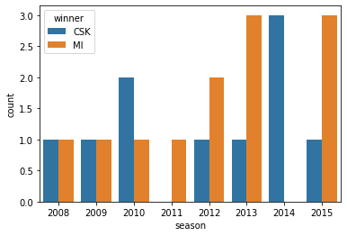

```python
import pandas as pd
import numpy as np
import matplotlib.pyplot as plt
import seaborn as sns

```


```python
df=pd.read_csv('F:\Data Science projects\EDA\IPL/matches.csv')
df.head()
```


<div>
<style scoped>
    .dataframe tbody tr th:only-of-type {
        vertical-align: middle;
    }

    .dataframe tbody tr th {
        vertical-align: top;
    }

    .dataframe thead th {
        text-align: right;
    }
</style>
<table border="1" class="dataframe">
  <thead>
    <tr style="text-align: right;">
      <th></th>
      <th>id</th>
      <th>season</th>
      <th>city</th>
      <th>date</th>
      <th>team1</th>
      <th>team2</th>
      <th>toss_winner</th>
      <th>toss_decision</th>
      <th>result</th>
      <th>dl_applied</th>
      <th>winner</th>
      <th>win_by_runs</th>
      <th>win_by_wickets</th>
      <th>player_of_match</th>
      <th>venue</th>
      <th>umpire1</th>
      <th>umpire2</th>
      <th>umpire3</th>
    </tr>
  </thead>
  <tbody>
    <tr>
      <th>0</th>
      <td>1</td>
      <td>2017</td>
      <td>Hyderabad</td>
      <td>4/5/2017</td>
      <td>Sunrisers Hyderabad</td>
      <td>Royal Challengers Bangalore</td>
      <td>Royal Challengers Bangalore</td>
      <td>field</td>
      <td>normal</td>
      <td>0</td>
      <td>Sunrisers Hyderabad</td>
      <td>35</td>
      <td>0</td>
      <td>Yuvraj Singh</td>
      <td>Rajiv Gandhi International Stadium, Uppal</td>
      <td>AY Dandekar</td>
      <td>NJ Llong</td>
      <td>NaN</td>
    </tr>
    <tr>
      <th>1</th>
      <td>2</td>
      <td>2017</td>
      <td>Pune</td>
      <td>4/6/2017</td>
      <td>Mumbai Indians</td>
      <td>Rising Pune Supergiant</td>
      <td>Rising Pune Supergiant</td>
      <td>field</td>
      <td>normal</td>
      <td>0</td>
      <td>Rising Pune Supergiant</td>
      <td>0</td>
      <td>7</td>
      <td>SPD Smith</td>
      <td>Maharashtra Cricket Association Stadium</td>
      <td>A Nand Kishore</td>
      <td>S Ravi</td>
      <td>NaN</td>
    </tr>
    <tr>
      <th>2</th>
      <td>3</td>
      <td>2017</td>
      <td>Rajkot</td>
      <td>4/7/2017</td>
      <td>Gujarat Lions</td>
      <td>Kolkata Knight Riders</td>
      <td>Kolkata Knight Riders</td>
      <td>field</td>
      <td>normal</td>
      <td>0</td>
      <td>Kolkata Knight Riders</td>
      <td>0</td>
      <td>10</td>
      <td>CA Lynn</td>
      <td>Saurashtra Cricket Association Stadium</td>
      <td>Nitin Menon</td>
      <td>CK Nandan</td>
      <td>NaN</td>
    </tr>
    <tr>
      <th>3</th>
      <td>4</td>
      <td>2017</td>
      <td>Indore</td>
      <td>4/8/2017</td>
      <td>Rising Pune Supergiant</td>
      <td>Kings XI Punjab</td>
      <td>Kings XI Punjab</td>
      <td>field</td>
      <td>normal</td>
      <td>0</td>
      <td>Kings XI Punjab</td>
      <td>0</td>
      <td>6</td>
      <td>GJ Maxwell</td>
      <td>Holkar Cricket Stadium</td>
      <td>AK Chaudhary</td>
      <td>C Shamshuddin</td>
      <td>NaN</td>
    </tr>
    <tr>
      <th>4</th>
      <td>5</td>
      <td>2017</td>
      <td>Bangalore</td>
      <td>4/8/2017</td>
      <td>Royal Challengers Bangalore</td>
      <td>Delhi Daredevils</td>
      <td>Royal Challengers Bangalore</td>
      <td>bat</td>
      <td>normal</td>
      <td>0</td>
      <td>Royal Challengers Bangalore</td>
      <td>15</td>
      <td>0</td>
      <td>KM Jadhav</td>
      <td>M Chinnaswamy Stadium</td>
      <td>NaN</td>
      <td>NaN</td>
      <td>NaN</td>
    </tr>
  </tbody>
</table>
</div>


```python
df.isnull().sum()
```


    id                   0
    season               0
    city                 7
    date                 0
    team1                0
    team2                0
    toss_winner          0
    toss_decision        0
    result               0
    dl_applied           0
    winner               3
    win_by_runs          0
    win_by_wickets       0
    player_of_match      3
    venue                0
    umpire1              1
    umpire2              1
    umpire3            636
    dtype: int64


```python
df.shape
```


    (636, 18)


```python
df.drop(['umpire3'],axis=1,inplace=True)
```


```python
df.columns
```


    Index(['id', 'season', 'city', 'date', 'team1', 'team2', 'toss_winner',
           'toss_decision', 'result', 'dl_applied', 'winner', 'win_by_runs',
           'win_by_wickets', 'player_of_match', 'venue', 'umpire1', 'umpire2'],
          dtype='object')


```python
Teams={
    'Royal Challengers Bangalore':'RCB', 
    'Sunrisers Hyderabad':'SRH',
       'Rising Pune Supergiant':'RPS',
    'Mumbai Indians':'MI',
       'Kolkata Knight Riders':'KKR', 
    'Gujarat Lions':'GL',
    'Kings XI Punjab':'KXIP',
       'Delhi Daredevils':'DD',
    'Chennai Super Kings':'CSK',
    'Rajasthan Royals':'RR',
       'Deccan Chargers':'DC',
    'Kochi Tuskers Kerala':'KTK',
    'Pune Warriors':'PW',
       'Rising Pune Supergiants':'RPS'
}
```


```python
df['team1']=df['team1'].map(Teams)
df['team2']=df['team2'].map(Teams)
```


```python
df.head()
```


<div>
<style scoped>
    .dataframe tbody tr th:only-of-type {
        vertical-align: middle;
    }

    .dataframe tbody tr th {
        vertical-align: top;
    }

    .dataframe thead th {
        text-align: right;
    }
</style>
<table border="1" class="dataframe">
  <thead>
    <tr style="text-align: right;">
      <th></th>
      <th>id</th>
      <th>season</th>
      <th>city</th>
      <th>date</th>
      <th>team1</th>
      <th>team2</th>
      <th>toss_winner</th>
      <th>toss_decision</th>
      <th>result</th>
      <th>dl_applied</th>
      <th>winner</th>
      <th>win_by_runs</th>
      <th>win_by_wickets</th>
      <th>player_of_match</th>
      <th>venue</th>
      <th>umpire1</th>
      <th>umpire2</th>
    </tr>
  </thead>
  <tbody>
    <tr>
      <th>0</th>
      <td>1</td>
      <td>2017</td>
      <td>Hyderabad</td>
      <td>4/5/2017</td>
      <td>SRH</td>
      <td>RCB</td>
      <td>Royal Challengers Bangalore</td>
      <td>field</td>
      <td>normal</td>
      <td>0</td>
      <td>Sunrisers Hyderabad</td>
      <td>35</td>
      <td>0</td>
      <td>Yuvraj Singh</td>
      <td>Rajiv Gandhi International Stadium, Uppal</td>
      <td>AY Dandekar</td>
      <td>NJ Llong</td>
    </tr>
    <tr>
      <th>1</th>
      <td>2</td>
      <td>2017</td>
      <td>Pune</td>
      <td>4/6/2017</td>
      <td>MI</td>
      <td>RPS</td>
      <td>Rising Pune Supergiant</td>
      <td>field</td>
      <td>normal</td>
      <td>0</td>
      <td>Rising Pune Supergiant</td>
      <td>0</td>
      <td>7</td>
      <td>SPD Smith</td>
      <td>Maharashtra Cricket Association Stadium</td>
      <td>A Nand Kishore</td>
      <td>S Ravi</td>
    </tr>
    <tr>
      <th>2</th>
      <td>3</td>
      <td>2017</td>
      <td>Rajkot</td>
      <td>4/7/2017</td>
      <td>GL</td>
      <td>KKR</td>
      <td>Kolkata Knight Riders</td>
      <td>field</td>
      <td>normal</td>
      <td>0</td>
      <td>Kolkata Knight Riders</td>
      <td>0</td>
      <td>10</td>
      <td>CA Lynn</td>
      <td>Saurashtra Cricket Association Stadium</td>
      <td>Nitin Menon</td>
      <td>CK Nandan</td>
    </tr>
    <tr>
      <th>3</th>
      <td>4</td>
      <td>2017</td>
      <td>Indore</td>
      <td>4/8/2017</td>
      <td>RPS</td>
      <td>KXIP</td>
      <td>Kings XI Punjab</td>
      <td>field</td>
      <td>normal</td>
      <td>0</td>
      <td>Kings XI Punjab</td>
      <td>0</td>
      <td>6</td>
      <td>GJ Maxwell</td>
      <td>Holkar Cricket Stadium</td>
      <td>AK Chaudhary</td>
      <td>C Shamshuddin</td>
    </tr>
    <tr>
      <th>4</th>
      <td>5</td>
      <td>2017</td>
      <td>Bangalore</td>
      <td>4/8/2017</td>
      <td>RCB</td>
      <td>DD</td>
      <td>Royal Challengers Bangalore</td>
      <td>bat</td>
      <td>normal</td>
      <td>0</td>
      <td>Royal Challengers Bangalore</td>
      <td>15</td>
      <td>0</td>
      <td>KM Jadhav</td>
      <td>M Chinnaswamy Stadium</td>
      <td>NaN</td>
      <td>NaN</td>
    </tr>
  </tbody>
</table>
</div>


#### Some Basic Analysis


```python
print('Total Matches Played:',df.shape[0])
print(' \n Venues Played At:',df['city'].unique())     
print(' \n Teams :',df['team1'].unique())
```

    Total Matches Played: 636
     
     Venues Played At: ['Hyderabad' 'Pune' 'Rajkot' 'Indore' 'Bangalore' 'Mumbai' 'Kolkata'
     'Delhi' 'Chandigarh' 'Kanpur' 'Jaipur' 'Chennai' 'Cape Town'
     'Port Elizabeth' 'Durban' 'Centurion' 'East London' 'Johannesburg'
     'Kimberley' 'Bloemfontein' 'Ahmedabad' 'Cuttack' 'Nagpur' 'Dharamsala'
     'Kochi' 'Visakhapatnam' 'Raipur' 'Ranchi' 'Abu Dhabi' 'Sharjah' nan]
     
     Teams : ['SRH' 'MI' 'GL' 'RPS' 'RCB' 'KKR' 'DD' 'KXIP' 'CSK' 'RR' 'DC' 'KTK' 'PW']


##### most man of the match awards


```python
print(df['player_of_match'].value_counts())
```

    CH Gayle          18
    YK Pathan         16
    AB de Villiers    15
    DA Warner         15
    SK Raina          14
                      ..
    DL Vettori         1
    AC Voges           1
    JDP Oram           1
    LH Ferguson        1
    BCJ Cutting        1
    Name: player_of_match, Length: 201, dtype: int64


##### maximum win by runs


```python
df[df['win_by_runs']==df['win_by_runs'].max()]
```


<div>
<style scoped>
    .dataframe tbody tr th:only-of-type {
        vertical-align: middle;
    }

    .dataframe tbody tr th {
        vertical-align: top;
    }

    .dataframe thead th {
        text-align: right;
    }
</style>
<table border="1" class="dataframe">
  <thead>
    <tr style="text-align: right;">
      <th></th>
      <th>id</th>
      <th>season</th>
      <th>city</th>
      <th>date</th>
      <th>team1</th>
      <th>team2</th>
      <th>toss_winner</th>
      <th>toss_decision</th>
      <th>result</th>
      <th>dl_applied</th>
      <th>winner</th>
      <th>win_by_runs</th>
      <th>win_by_wickets</th>
      <th>player_of_match</th>
      <th>venue</th>
      <th>umpire1</th>
      <th>umpire2</th>
    </tr>
  </thead>
  <tbody>
    <tr>
      <th>43</th>
      <td>44</td>
      <td>2017</td>
      <td>Delhi</td>
      <td>5/6/2017</td>
      <td>MI</td>
      <td>DD</td>
      <td>Delhi Daredevils</td>
      <td>field</td>
      <td>normal</td>
      <td>0</td>
      <td>Mumbai Indians</td>
      <td>146</td>
      <td>0</td>
      <td>LMP Simmons</td>
      <td>Feroz Shah Kotla</td>
      <td>Nitin Menon</td>
      <td>CK Nandan</td>
    </tr>
  </tbody>
</table>
</div>


##### Mumbai Indians(MI) defeated Delhi Daredevils(DD) with the highest run difference


```python

```

#### highest wins by wickets


```python
df[df['win_by_wickets']==df['win_by_wickets'].max()]
```


<div>
<style scoped>
    .dataframe tbody tr th:only-of-type {
        vertical-align: middle;
    }

    .dataframe tbody tr th {
        vertical-align: top;
    }

    .dataframe thead th {
        text-align: right;
    }
</style>
<table border="1" class="dataframe">
  <thead>
    <tr style="text-align: right;">
      <th></th>
      <th>id</th>
      <th>season</th>
      <th>city</th>
      <th>date</th>
      <th>team1</th>
      <th>team2</th>
      <th>toss_winner</th>
      <th>toss_decision</th>
      <th>result</th>
      <th>dl_applied</th>
      <th>winner</th>
      <th>win_by_runs</th>
      <th>win_by_wickets</th>
      <th>player_of_match</th>
      <th>venue</th>
      <th>umpire1</th>
      <th>umpire2</th>
    </tr>
  </thead>
  <tbody>
    <tr>
      <th>2</th>
      <td>3</td>
      <td>2017</td>
      <td>Rajkot</td>
      <td>4/7/2017</td>
      <td>GL</td>
      <td>KKR</td>
      <td>Kolkata Knight Riders</td>
      <td>field</td>
      <td>normal</td>
      <td>0</td>
      <td>Kolkata Knight Riders</td>
      <td>0</td>
      <td>10</td>
      <td>CA Lynn</td>
      <td>Saurashtra Cricket Association Stadium</td>
      <td>Nitin Menon</td>
      <td>CK Nandan</td>
    </tr>
    <tr>
      <th>34</th>
      <td>35</td>
      <td>2017</td>
      <td>Chandigarh</td>
      <td>4/30/2017</td>
      <td>DD</td>
      <td>KXIP</td>
      <td>Kings XI Punjab</td>
      <td>field</td>
      <td>normal</td>
      <td>0</td>
      <td>Kings XI Punjab</td>
      <td>0</td>
      <td>10</td>
      <td>Sandeep Sharma</td>
      <td>Punjab Cricket Association IS Bindra Stadium, ...</td>
      <td>YC Barde</td>
      <td>CK Nandan</td>
    </tr>
    <tr>
      <th>71</th>
      <td>72</td>
      <td>2008</td>
      <td>Mumbai</td>
      <td>4/27/2008</td>
      <td>MI</td>
      <td>DC</td>
      <td>Deccan Chargers</td>
      <td>field</td>
      <td>normal</td>
      <td>0</td>
      <td>Deccan Chargers</td>
      <td>0</td>
      <td>10</td>
      <td>AC Gilchrist</td>
      <td>Dr DY Patil Sports Academy</td>
      <td>Asad Rauf</td>
      <td>SL Shastri</td>
    </tr>
    <tr>
      <th>119</th>
      <td>120</td>
      <td>2009</td>
      <td>Cape Town</td>
      <td>4/19/2009</td>
      <td>KXIP</td>
      <td>DD</td>
      <td>Delhi Daredevils</td>
      <td>field</td>
      <td>normal</td>
      <td>1</td>
      <td>Delhi Daredevils</td>
      <td>0</td>
      <td>10</td>
      <td>DL Vettori</td>
      <td>Newlands</td>
      <td>MR Benson</td>
      <td>SD Ranade</td>
    </tr>
    <tr>
      <th>183</th>
      <td>184</td>
      <td>2010</td>
      <td>Bangalore</td>
      <td>3/18/2010</td>
      <td>RR</td>
      <td>RCB</td>
      <td>Royal Challengers Bangalore</td>
      <td>field</td>
      <td>normal</td>
      <td>0</td>
      <td>Royal Challengers Bangalore</td>
      <td>0</td>
      <td>10</td>
      <td>JH Kallis</td>
      <td>M Chinnaswamy Stadium</td>
      <td>K Hariharan</td>
      <td>DJ Harper</td>
    </tr>
    <tr>
      <th>298</th>
      <td>299</td>
      <td>2011</td>
      <td>Mumbai</td>
      <td>5/20/2011</td>
      <td>MI</td>
      <td>RR</td>
      <td>Mumbai Indians</td>
      <td>bat</td>
      <td>normal</td>
      <td>0</td>
      <td>Rajasthan Royals</td>
      <td>0</td>
      <td>10</td>
      <td>SR Watson</td>
      <td>Wankhede Stadium</td>
      <td>RE Koertzen</td>
      <td>PR Reiffel</td>
    </tr>
    <tr>
      <th>376</th>
      <td>377</td>
      <td>2012</td>
      <td>Jaipur</td>
      <td>5/20/2012</td>
      <td>RR</td>
      <td>MI</td>
      <td>Rajasthan Royals</td>
      <td>bat</td>
      <td>normal</td>
      <td>0</td>
      <td>Mumbai Indians</td>
      <td>0</td>
      <td>10</td>
      <td>DR Smith</td>
      <td>Sawai Mansingh Stadium</td>
      <td>HDPK Dharmasena</td>
      <td>C Shamshuddin</td>
    </tr>
    <tr>
      <th>390</th>
      <td>391</td>
      <td>2013</td>
      <td>Chandigarh</td>
      <td>4/10/2013</td>
      <td>KXIP</td>
      <td>CSK</td>
      <td>Chennai Super Kings</td>
      <td>field</td>
      <td>normal</td>
      <td>0</td>
      <td>Chennai Super Kings</td>
      <td>0</td>
      <td>10</td>
      <td>MEK Hussey</td>
      <td>Punjab Cricket Association Stadium, Mohali</td>
      <td>Aleem Dar</td>
      <td>C Shamshuddin</td>
    </tr>
    <tr>
      <th>542</th>
      <td>543</td>
      <td>2015</td>
      <td>Delhi</td>
      <td>4/26/2015</td>
      <td>DD</td>
      <td>RCB</td>
      <td>Royal Challengers Bangalore</td>
      <td>field</td>
      <td>normal</td>
      <td>0</td>
      <td>Royal Challengers Bangalore</td>
      <td>0</td>
      <td>10</td>
      <td>VR Aaron</td>
      <td>Feroz Shah Kotla</td>
      <td>M Erasmus</td>
      <td>S Ravi</td>
    </tr>
    <tr>
      <th>590</th>
      <td>591</td>
      <td>2016</td>
      <td>Rajkot</td>
      <td>4/21/2016</td>
      <td>GL</td>
      <td>SRH</td>
      <td>Sunrisers Hyderabad</td>
      <td>field</td>
      <td>normal</td>
      <td>0</td>
      <td>Sunrisers Hyderabad</td>
      <td>0</td>
      <td>10</td>
      <td>B Kumar</td>
      <td>Saurashtra Cricket Association Stadium</td>
      <td>K Bharatan</td>
      <td>HDPK Dharmasena</td>
    </tr>
  </tbody>
</table>
</div>


```python

```

##### Toss Decisions across Seasons


```python
sns.countplot(x='season',hue='toss_decision',data=df)
plt.savefig('F:\Data Science projects\EDA\IPL/IPL_1.png')
```


    

    


##### In some seasons, the probablity that toss winners opt for batting is high while In 2016, the majority of toss winners opted for fielding


```python

```

### Maximum Toss Winners


```python
df['toss_winner'].value_counts().plot(kind='bar')
```


    <matplotlib.axes._subplots.AxesSubplot at 0xbadc442e48>


    

    


```python

```

##### Total Matches vs Wins for Teams 


```python
df.shape
```


    (636, 17)


```python
df.head()
```


<div>
<style scoped>
    .dataframe tbody tr th:only-of-type {
        vertical-align: middle;
    }

    .dataframe tbody tr th {
        vertical-align: top;
    }

    .dataframe thead th {
        text-align: right;
    }
</style>
<table border="1" class="dataframe">
  <thead>
    <tr style="text-align: right;">
      <th></th>
      <th>id</th>
      <th>season</th>
      <th>city</th>
      <th>date</th>
      <th>team1</th>
      <th>team2</th>
      <th>toss_winner</th>
      <th>toss_decision</th>
      <th>result</th>
      <th>dl_applied</th>
      <th>winner</th>
      <th>win_by_runs</th>
      <th>win_by_wickets</th>
      <th>player_of_match</th>
      <th>venue</th>
      <th>umpire1</th>
      <th>umpire2</th>
    </tr>
  </thead>
  <tbody>
    <tr>
      <th>0</th>
      <td>1</td>
      <td>2017</td>
      <td>Hyderabad</td>
      <td>4/5/2017</td>
      <td>SRH</td>
      <td>RCB</td>
      <td>Royal Challengers Bangalore</td>
      <td>field</td>
      <td>normal</td>
      <td>0</td>
      <td>Sunrisers Hyderabad</td>
      <td>35</td>
      <td>0</td>
      <td>Yuvraj Singh</td>
      <td>Rajiv Gandhi International Stadium, Uppal</td>
      <td>AY Dandekar</td>
      <td>NJ Llong</td>
    </tr>
    <tr>
      <th>1</th>
      <td>2</td>
      <td>2017</td>
      <td>Pune</td>
      <td>4/6/2017</td>
      <td>MI</td>
      <td>RPS</td>
      <td>Rising Pune Supergiant</td>
      <td>field</td>
      <td>normal</td>
      <td>0</td>
      <td>Rising Pune Supergiant</td>
      <td>0</td>
      <td>7</td>
      <td>SPD Smith</td>
      <td>Maharashtra Cricket Association Stadium</td>
      <td>A Nand Kishore</td>
      <td>S Ravi</td>
    </tr>
    <tr>
      <th>2</th>
      <td>3</td>
      <td>2017</td>
      <td>Rajkot</td>
      <td>4/7/2017</td>
      <td>GL</td>
      <td>KKR</td>
      <td>Kolkata Knight Riders</td>
      <td>field</td>
      <td>normal</td>
      <td>0</td>
      <td>Kolkata Knight Riders</td>
      <td>0</td>
      <td>10</td>
      <td>CA Lynn</td>
      <td>Saurashtra Cricket Association Stadium</td>
      <td>Nitin Menon</td>
      <td>CK Nandan</td>
    </tr>
    <tr>
      <th>3</th>
      <td>4</td>
      <td>2017</td>
      <td>Indore</td>
      <td>4/8/2017</td>
      <td>RPS</td>
      <td>KXIP</td>
      <td>Kings XI Punjab</td>
      <td>field</td>
      <td>normal</td>
      <td>0</td>
      <td>Kings XI Punjab</td>
      <td>0</td>
      <td>6</td>
      <td>GJ Maxwell</td>
      <td>Holkar Cricket Stadium</td>
      <td>AK Chaudhary</td>
      <td>C Shamshuddin</td>
    </tr>
    <tr>
      <th>4</th>
      <td>5</td>
      <td>2017</td>
      <td>Bangalore</td>
      <td>4/8/2017</td>
      <td>RCB</td>
      <td>DD</td>
      <td>Royal Challengers Bangalore</td>
      <td>bat</td>
      <td>normal</td>
      <td>0</td>
      <td>Royal Challengers Bangalore</td>
      <td>15</td>
      <td>0</td>
      <td>KM Jadhav</td>
      <td>M Chinnaswamy Stadium</td>
      <td>NaN</td>
      <td>NaN</td>
    </tr>
  </tbody>
</table>
</div>


```python
df['team2']
```


    0       RCB
    1       RPS
    2       KKR
    3      KXIP
    4        DD
           ... 
    631     RCB
    632     RCB
    633     KKR
    634     SRH
    635     RCB
    Name: team2, Length: 636, dtype: object


```python
matches_played_byteams=pd.concat([df['team1'],df['team2']],axis=1)
matches_played_byteams
```


<div>
<style scoped>
    .dataframe tbody tr th:only-of-type {
        vertical-align: middle;
    }

    .dataframe tbody tr th {
        vertical-align: top;
    }

    .dataframe thead th {
        text-align: right;
    }
</style>
<table border="1" class="dataframe">
  <thead>
    <tr style="text-align: right;">
      <th></th>
      <th>team1</th>
      <th>team2</th>
    </tr>
  </thead>
  <tbody>
    <tr>
      <th>0</th>
      <td>SRH</td>
      <td>RCB</td>
    </tr>
    <tr>
      <th>1</th>
      <td>MI</td>
      <td>RPS</td>
    </tr>
    <tr>
      <th>2</th>
      <td>GL</td>
      <td>KKR</td>
    </tr>
    <tr>
      <th>3</th>
      <td>RPS</td>
      <td>KXIP</td>
    </tr>
    <tr>
      <th>4</th>
      <td>RCB</td>
      <td>DD</td>
    </tr>
    <tr>
      <th>...</th>
      <td>...</td>
      <td>...</td>
    </tr>
    <tr>
      <th>631</th>
      <td>DD</td>
      <td>RCB</td>
    </tr>
    <tr>
      <th>632</th>
      <td>GL</td>
      <td>RCB</td>
    </tr>
    <tr>
      <th>633</th>
      <td>SRH</td>
      <td>KKR</td>
    </tr>
    <tr>
      <th>634</th>
      <td>GL</td>
      <td>SRH</td>
    </tr>
    <tr>
      <th>635</th>
      <td>SRH</td>
      <td>RCB</td>
    </tr>
  </tbody>
</table>
<p>636 rows × 2 columns</p>
</div>


```python
teams=(matches_played_byteams['team1'].value_counts()+matches_played_byteams['team2'].value_counts()).reset_index()
teams.columns=['team_name','Matches_played']
teams
```


<div>
<style scoped>
    .dataframe tbody tr th:only-of-type {
        vertical-align: middle;
    }

    .dataframe tbody tr th {
        vertical-align: top;
    }

    .dataframe thead th {
        text-align: right;
    }
</style>
<table border="1" class="dataframe">
  <thead>
    <tr style="text-align: right;">
      <th></th>
      <th>team_name</th>
      <th>Matches_played</th>
    </tr>
  </thead>
  <tbody>
    <tr>
      <th>0</th>
      <td>CSK</td>
      <td>131</td>
    </tr>
    <tr>
      <th>1</th>
      <td>DC</td>
      <td>75</td>
    </tr>
    <tr>
      <th>2</th>
      <td>DD</td>
      <td>147</td>
    </tr>
    <tr>
      <th>3</th>
      <td>GL</td>
      <td>30</td>
    </tr>
    <tr>
      <th>4</th>
      <td>KKR</td>
      <td>148</td>
    </tr>
    <tr>
      <th>5</th>
      <td>KTK</td>
      <td>14</td>
    </tr>
    <tr>
      <th>6</th>
      <td>KXIP</td>
      <td>148</td>
    </tr>
    <tr>
      <th>7</th>
      <td>MI</td>
      <td>157</td>
    </tr>
    <tr>
      <th>8</th>
      <td>PW</td>
      <td>46</td>
    </tr>
    <tr>
      <th>9</th>
      <td>RCB</td>
      <td>152</td>
    </tr>
    <tr>
      <th>10</th>
      <td>RPS</td>
      <td>30</td>
    </tr>
    <tr>
      <th>11</th>
      <td>RR</td>
      <td>118</td>
    </tr>
    <tr>
      <th>12</th>
      <td>SRH</td>
      <td>76</td>
    </tr>
  </tbody>
</table>
</div>


```python
df['winner']=df['winner'].map(Teams)
```


```python
wins=pd.DataFrame(df['winner'].value_counts()).reset_index()
wins.columns=['team_name','wins']
wins
```


<div>
<style scoped>
    .dataframe tbody tr th:only-of-type {
        vertical-align: middle;
    }

    .dataframe tbody tr th {
        vertical-align: top;
    }

    .dataframe thead th {
        text-align: right;
    }
</style>
<table border="1" class="dataframe">
  <thead>
    <tr style="text-align: right;">
      <th></th>
      <th>team_name</th>
      <th>wins</th>
    </tr>
  </thead>
  <tbody>
    <tr>
      <th>0</th>
      <td>MI</td>
      <td>92</td>
    </tr>
    <tr>
      <th>1</th>
      <td>CSK</td>
      <td>79</td>
    </tr>
    <tr>
      <th>2</th>
      <td>KKR</td>
      <td>77</td>
    </tr>
    <tr>
      <th>3</th>
      <td>RCB</td>
      <td>73</td>
    </tr>
    <tr>
      <th>4</th>
      <td>KXIP</td>
      <td>70</td>
    </tr>
    <tr>
      <th>5</th>
      <td>RR</td>
      <td>63</td>
    </tr>
    <tr>
      <th>6</th>
      <td>DD</td>
      <td>62</td>
    </tr>
    <tr>
      <th>7</th>
      <td>SRH</td>
      <td>42</td>
    </tr>
    <tr>
      <th>8</th>
      <td>DC</td>
      <td>29</td>
    </tr>
    <tr>
      <th>9</th>
      <td>RPS</td>
      <td>15</td>
    </tr>
    <tr>
      <th>10</th>
      <td>GL</td>
      <td>13</td>
    </tr>
    <tr>
      <th>11</th>
      <td>PW</td>
      <td>12</td>
    </tr>
    <tr>
      <th>12</th>
      <td>KTK</td>
      <td>6</td>
    </tr>
  </tbody>
</table>
</div>


```python
player=teams.merge(wins,left_on='team_name',right_on='team_name',how='inner')
```


```python
player.columns=['team','matches_played','wins']
player
```


<div>
<style scoped>
    .dataframe tbody tr th:only-of-type {
        vertical-align: middle;
    }

    .dataframe tbody tr th {
        vertical-align: top;
    }

    .dataframe thead th {
        text-align: right;
    }
</style>
<table border="1" class="dataframe">
  <thead>
    <tr style="text-align: right;">
      <th></th>
      <th>team</th>
      <th>matches_played</th>
      <th>wins</th>
    </tr>
  </thead>
  <tbody>
    <tr>
      <th>0</th>
      <td>CSK</td>
      <td>131</td>
      <td>79</td>
    </tr>
    <tr>
      <th>1</th>
      <td>DC</td>
      <td>75</td>
      <td>29</td>
    </tr>
    <tr>
      <th>2</th>
      <td>DD</td>
      <td>147</td>
      <td>62</td>
    </tr>
    <tr>
      <th>3</th>
      <td>GL</td>
      <td>30</td>
      <td>13</td>
    </tr>
    <tr>
      <th>4</th>
      <td>KKR</td>
      <td>148</td>
      <td>77</td>
    </tr>
    <tr>
      <th>5</th>
      <td>KTK</td>
      <td>14</td>
      <td>6</td>
    </tr>
    <tr>
      <th>6</th>
      <td>KXIP</td>
      <td>148</td>
      <td>70</td>
    </tr>
    <tr>
      <th>7</th>
      <td>MI</td>
      <td>157</td>
      <td>92</td>
    </tr>
    <tr>
      <th>8</th>
      <td>PW</td>
      <td>46</td>
      <td>12</td>
    </tr>
    <tr>
      <th>9</th>
      <td>RCB</td>
      <td>152</td>
      <td>73</td>
    </tr>
    <tr>
      <th>10</th>
      <td>RPS</td>
      <td>30</td>
      <td>15</td>
    </tr>
    <tr>
      <th>11</th>
      <td>RR</td>
      <td>118</td>
      <td>63</td>
    </tr>
    <tr>
      <th>12</th>
      <td>SRH</td>
      <td>76</td>
      <td>42</td>
    </tr>
  </tbody>
</table>
</div>


```python
player['%win']=(player['wins']/player['matches_played'])*100
player
```


<div>
<style scoped>
    .dataframe tbody tr th:only-of-type {
        vertical-align: middle;
    }

    .dataframe tbody tr th {
        vertical-align: top;
    }

    .dataframe thead th {
        text-align: right;
    }
</style>
<table border="1" class="dataframe">
  <thead>
    <tr style="text-align: right;">
      <th></th>
      <th>team</th>
      <th>matches_played</th>
      <th>wins</th>
      <th>%win</th>
    </tr>
  </thead>
  <tbody>
    <tr>
      <th>0</th>
      <td>CSK</td>
      <td>131</td>
      <td>79</td>
      <td>60.305344</td>
    </tr>
    <tr>
      <th>1</th>
      <td>DC</td>
      <td>75</td>
      <td>29</td>
      <td>38.666667</td>
    </tr>
    <tr>
      <th>2</th>
      <td>DD</td>
      <td>147</td>
      <td>62</td>
      <td>42.176871</td>
    </tr>
    <tr>
      <th>3</th>
      <td>GL</td>
      <td>30</td>
      <td>13</td>
      <td>43.333333</td>
    </tr>
    <tr>
      <th>4</th>
      <td>KKR</td>
      <td>148</td>
      <td>77</td>
      <td>52.027027</td>
    </tr>
    <tr>
      <th>5</th>
      <td>KTK</td>
      <td>14</td>
      <td>6</td>
      <td>42.857143</td>
    </tr>
    <tr>
      <th>6</th>
      <td>KXIP</td>
      <td>148</td>
      <td>70</td>
      <td>47.297297</td>
    </tr>
    <tr>
      <th>7</th>
      <td>MI</td>
      <td>157</td>
      <td>92</td>
      <td>58.598726</td>
    </tr>
    <tr>
      <th>8</th>
      <td>PW</td>
      <td>46</td>
      <td>12</td>
      <td>26.086957</td>
    </tr>
    <tr>
      <th>9</th>
      <td>RCB</td>
      <td>152</td>
      <td>73</td>
      <td>48.026316</td>
    </tr>
    <tr>
      <th>10</th>
      <td>RPS</td>
      <td>30</td>
      <td>15</td>
      <td>50.000000</td>
    </tr>
    <tr>
      <th>11</th>
      <td>RR</td>
      <td>118</td>
      <td>63</td>
      <td>53.389831</td>
    </tr>
    <tr>
      <th>12</th>
      <td>SRH</td>
      <td>76</td>
      <td>42</td>
      <td>55.263158</td>
    </tr>
  </tbody>
</table>
</div>


```python
import plotly.offline as py
py.init_notebook_mode(connected=True)
import plotly.graph_objs as go
```


<script type="text/javascript">
window.PlotlyConfig = {MathJaxConfig: 'local'};
if (window.MathJax) {MathJax.Hub.Config({SVG: {font: "STIX-Web"}});}
if (typeof require !== 'undefined') {
require.undef("plotly");
requirejs.config({
    paths: {
        'plotly': ['https://cdn.plot.ly/plotly-latest.min']
    }
});
require(['plotly'], function(Plotly) {
    window._Plotly = Plotly;
});
}
</script>


```python
trace1 = go.Bar(
    x=player['team'],
    y=player['matches_played'],
    name='Total Matches'
)
trace2 = go.Bar(
    x=player.team,
    y=player['wins'],
    name='Matches Won'
)


```


```python
data = [trace1, trace2]
py.iplot(data)
```


<div>


            <div id="c70d900d-7cad-4d01-b19f-da11169788c7" class="plotly-graph-div" style="height:525px; width:100%;"></div>
            <script type="text/javascript">
                require(["plotly"], function(Plotly) {
                    window.PLOTLYENV=window.PLOTLYENV || {};

                if (document.getElementById("c70d900d-7cad-4d01-b19f-da11169788c7")) {
                    Plotly.newPlot(
                        'c70d900d-7cad-4d01-b19f-da11169788c7',
                        [{"name": "Total Matches", "type": "bar", "x": ["CSK", "DC", "DD", "GL", "KKR", "KTK", "KXIP", "MI", "PW", "RCB", "RPS", "RR", "SRH"], "y": [131, 75, 147, 30, 148, 14, 148, 157, 46, 152, 30, 118, 76]}, {"name": "Matches Won", "type": "bar", "x": ["CSK", "DC", "DD", "GL", "KKR", "KTK", "KXIP", "MI", "PW", "RCB", "RPS", "RR", "SRH"], "y": [79, 29, 62, 13, 77, 6, 70, 92, 12, 73, 15, 63, 42]}],
                        {"template": {"data": {"bar": [{"error_x": {"color": "#2a3f5f"}, "error_y": {"color": "#2a3f5f"}, "marker": {"line": {"color": "#E5ECF6", "width": 0.5}}, "type": "bar"}], "barpolar": [{"marker": {"line": {"color": "#E5ECF6", "width": 0.5}}, "type": "barpolar"}], "carpet": [{"aaxis": {"endlinecolor": "#2a3f5f", "gridcolor": "white", "linecolor": "white", "minorgridcolor": "white", "startlinecolor": "#2a3f5f"}, "baxis": {"endlinecolor": "#2a3f5f", "gridcolor": "white", "linecolor": "white", "minorgridcolor": "white", "startlinecolor": "#2a3f5f"}, "type": "carpet"}], "choropleth": [{"colorbar": {"outlinewidth": 0, "ticks": ""}, "type": "choropleth"}], "contour": [{"colorbar": {"outlinewidth": 0, "ticks": ""}, "colorscale": [[0.0, "#0d0887"], [0.1111111111111111, "#46039f"], [0.2222222222222222, "#7201a8"], [0.3333333333333333, "#9c179e"], [0.4444444444444444, "#bd3786"], [0.5555555555555556, "#d8576b"], [0.6666666666666666, "#ed7953"], [0.7777777777777778, "#fb9f3a"], [0.8888888888888888, "#fdca26"], [1.0, "#f0f921"]], "type": "contour"}], "contourcarpet": [{"colorbar": {"outlinewidth": 0, "ticks": ""}, "type": "contourcarpet"}], "heatmap": [{"colorbar": {"outlinewidth": 0, "ticks": ""}, "colorscale": [[0.0, "#0d0887"], [0.1111111111111111, "#46039f"], [0.2222222222222222, "#7201a8"], [0.3333333333333333, "#9c179e"], [0.4444444444444444, "#bd3786"], [0.5555555555555556, "#d8576b"], [0.6666666666666666, "#ed7953"], [0.7777777777777778, "#fb9f3a"], [0.8888888888888888, "#fdca26"], [1.0, "#f0f921"]], "type": "heatmap"}], "heatmapgl": [{"colorbar": {"outlinewidth": 0, "ticks": ""}, "colorscale": [[0.0, "#0d0887"], [0.1111111111111111, "#46039f"], [0.2222222222222222, "#7201a8"], [0.3333333333333333, "#9c179e"], [0.4444444444444444, "#bd3786"], [0.5555555555555556, "#d8576b"], [0.6666666666666666, "#ed7953"], [0.7777777777777778, "#fb9f3a"], [0.8888888888888888, "#fdca26"], [1.0, "#f0f921"]], "type": "heatmapgl"}], "histogram": [{"marker": {"colorbar": {"outlinewidth": 0, "ticks": ""}}, "type": "histogram"}], "histogram2d": [{"colorbar": {"outlinewidth": 0, "ticks": ""}, "colorscale": [[0.0, "#0d0887"], [0.1111111111111111, "#46039f"], [0.2222222222222222, "#7201a8"], [0.3333333333333333, "#9c179e"], [0.4444444444444444, "#bd3786"], [0.5555555555555556, "#d8576b"], [0.6666666666666666, "#ed7953"], [0.7777777777777778, "#fb9f3a"], [0.8888888888888888, "#fdca26"], [1.0, "#f0f921"]], "type": "histogram2d"}], "histogram2dcontour": [{"colorbar": {"outlinewidth": 0, "ticks": ""}, "colorscale": [[0.0, "#0d0887"], [0.1111111111111111, "#46039f"], [0.2222222222222222, "#7201a8"], [0.3333333333333333, "#9c179e"], [0.4444444444444444, "#bd3786"], [0.5555555555555556, "#d8576b"], [0.6666666666666666, "#ed7953"], [0.7777777777777778, "#fb9f3a"], [0.8888888888888888, "#fdca26"], [1.0, "#f0f921"]], "type": "histogram2dcontour"}], "mesh3d": [{"colorbar": {"outlinewidth": 0, "ticks": ""}, "type": "mesh3d"}], "parcoords": [{"line": {"colorbar": {"outlinewidth": 0, "ticks": ""}}, "type": "parcoords"}], "pie": [{"automargin": true, "type": "pie"}], "scatter": [{"marker": {"colorbar": {"outlinewidth": 0, "ticks": ""}}, "type": "scatter"}], "scatter3d": [{"line": {"colorbar": {"outlinewidth": 0, "ticks": ""}}, "marker": {"colorbar": {"outlinewidth": 0, "ticks": ""}}, "type": "scatter3d"}], "scattercarpet": [{"marker": {"colorbar": {"outlinewidth": 0, "ticks": ""}}, "type": "scattercarpet"}], "scattergeo": [{"marker": {"colorbar": {"outlinewidth": 0, "ticks": ""}}, "type": "scattergeo"}], "scattergl": [{"marker": {"colorbar": {"outlinewidth": 0, "ticks": ""}}, "type": "scattergl"}], "scattermapbox": [{"marker": {"colorbar": {"outlinewidth": 0, "ticks": ""}}, "type": "scattermapbox"}], "scatterpolar": [{"marker": {"colorbar": {"outlinewidth": 0, "ticks": ""}}, "type": "scatterpolar"}], "scatterpolargl": [{"marker": {"colorbar": {"outlinewidth": 0, "ticks": ""}}, "type": "scatterpolargl"}], "scatterternary": [{"marker": {"colorbar": {"outlinewidth": 0, "ticks": ""}}, "type": "scatterternary"}], "surface": [{"colorbar": {"outlinewidth": 0, "ticks": ""}, "colorscale": [[0.0, "#0d0887"], [0.1111111111111111, "#46039f"], [0.2222222222222222, "#7201a8"], [0.3333333333333333, "#9c179e"], [0.4444444444444444, "#bd3786"], [0.5555555555555556, "#d8576b"], [0.6666666666666666, "#ed7953"], [0.7777777777777778, "#fb9f3a"], [0.8888888888888888, "#fdca26"], [1.0, "#f0f921"]], "type": "surface"}], "table": [{"cells": {"fill": {"color": "#EBF0F8"}, "line": {"color": "white"}}, "header": {"fill": {"color": "#C8D4E3"}, "line": {"color": "white"}}, "type": "table"}]}, "layout": {"annotationdefaults": {"arrowcolor": "#2a3f5f", "arrowhead": 0, "arrowwidth": 1}, "coloraxis": {"colorbar": {"outlinewidth": 0, "ticks": ""}}, "colorscale": {"diverging": [[0, "#8e0152"], [0.1, "#c51b7d"], [0.2, "#de77ae"], [0.3, "#f1b6da"], [0.4, "#fde0ef"], [0.5, "#f7f7f7"], [0.6, "#e6f5d0"], [0.7, "#b8e186"], [0.8, "#7fbc41"], [0.9, "#4d9221"], [1, "#276419"]], "sequential": [[0.0, "#0d0887"], [0.1111111111111111, "#46039f"], [0.2222222222222222, "#7201a8"], [0.3333333333333333, "#9c179e"], [0.4444444444444444, "#bd3786"], [0.5555555555555556, "#d8576b"], [0.6666666666666666, "#ed7953"], [0.7777777777777778, "#fb9f3a"], [0.8888888888888888, "#fdca26"], [1.0, "#f0f921"]], "sequentialminus": [[0.0, "#0d0887"], [0.1111111111111111, "#46039f"], [0.2222222222222222, "#7201a8"], [0.3333333333333333, "#9c179e"], [0.4444444444444444, "#bd3786"], [0.5555555555555556, "#d8576b"], [0.6666666666666666, "#ed7953"], [0.7777777777777778, "#fb9f3a"], [0.8888888888888888, "#fdca26"], [1.0, "#f0f921"]]}, "colorway": ["#636efa", "#EF553B", "#00cc96", "#ab63fa", "#FFA15A", "#19d3f3", "#FF6692", "#B6E880", "#FF97FF", "#FECB52"], "font": {"color": "#2a3f5f"}, "geo": {"bgcolor": "white", "lakecolor": "white", "landcolor": "#E5ECF6", "showlakes": true, "showland": true, "subunitcolor": "white"}, "hoverlabel": {"align": "left"}, "hovermode": "closest", "mapbox": {"style": "light"}, "paper_bgcolor": "white", "plot_bgcolor": "#E5ECF6", "polar": {"angularaxis": {"gridcolor": "white", "linecolor": "white", "ticks": ""}, "bgcolor": "#E5ECF6", "radialaxis": {"gridcolor": "white", "linecolor": "white", "ticks": ""}}, "scene": {"xaxis": {"backgroundcolor": "#E5ECF6", "gridcolor": "white", "gridwidth": 2, "linecolor": "white", "showbackground": true, "ticks": "", "zerolinecolor": "white"}, "yaxis": {"backgroundcolor": "#E5ECF6", "gridcolor": "white", "gridwidth": 2, "linecolor": "white", "showbackground": true, "ticks": "", "zerolinecolor": "white"}, "zaxis": {"backgroundcolor": "#E5ECF6", "gridcolor": "white", "gridwidth": 2, "linecolor": "white", "showbackground": true, "ticks": "", "zerolinecolor": "white"}}, "shapedefaults": {"line": {"color": "#2a3f5f"}}, "ternary": {"aaxis": {"gridcolor": "white", "linecolor": "white", "ticks": ""}, "baxis": {"gridcolor": "white", "linecolor": "white", "ticks": ""}, "bgcolor": "#E5ECF6", "caxis": {"gridcolor": "white", "linecolor": "white", "ticks": ""}}, "title": {"x": 0.05}, "xaxis": {"automargin": true, "gridcolor": "white", "linecolor": "white", "ticks": "", "title": {"standoff": 15}, "zerolinecolor": "white", "zerolinewidth": 2}, "yaxis": {"automargin": true, "gridcolor": "white", "linecolor": "white", "ticks": "", "title": {"standoff": 15}, "zerolinecolor": "white", "zerolinewidth": 2}}}},
                        {"responsive": true}
                    ).then(function(){

var gd = document.getElementById('c70d900d-7cad-4d01-b19f-da11169788c7');
var x = new MutationObserver(function (mutations, observer) {{
        var display = window.getComputedStyle(gd).display;
        if (!display || display === 'none') {{
            console.log([gd, 'removed!']);
            Plotly.purge(gd);
            observer.disconnect();
        }}
}});

// Listen for the removal of the full notebook cells
var notebookContainer = gd.closest('#notebook-container');
if (notebookContainer) {{
    x.observe(notebookContainer, {childList: true});
}}

// Listen for the clearing of the current output cell
var outputEl = gd.closest('.output');
if (outputEl) {{
    x.observe(outputEl, {childList: true});
}}

                        })
                };
                });
            </script>
        </div>


##### Matches played across each season


```python
sns.countplot(df['season'])
```


    <matplotlib.axes._subplots.AxesSubplot at 0xbae15e1b48>


    

    


##### Runs Across the Seasons


```python
df.head()
```


<div>
<style scoped>
    .dataframe tbody tr th:only-of-type {
        vertical-align: middle;
    }

    .dataframe tbody tr th {
        vertical-align: top;
    }

    .dataframe thead th {
        text-align: right;
    }
</style>
<table border="1" class="dataframe">
  <thead>
    <tr style="text-align: right;">
      <th></th>
      <th>id</th>
      <th>season</th>
      <th>city</th>
      <th>date</th>
      <th>team1</th>
      <th>team2</th>
      <th>toss_winner</th>
      <th>toss_decision</th>
      <th>result</th>
      <th>dl_applied</th>
      <th>winner</th>
      <th>win_by_runs</th>
      <th>win_by_wickets</th>
      <th>player_of_match</th>
      <th>venue</th>
      <th>umpire1</th>
      <th>umpire2</th>
    </tr>
  </thead>
  <tbody>
    <tr>
      <th>0</th>
      <td>1</td>
      <td>2017</td>
      <td>Hyderabad</td>
      <td>4/5/2017</td>
      <td>SRH</td>
      <td>RCB</td>
      <td>Royal Challengers Bangalore</td>
      <td>field</td>
      <td>normal</td>
      <td>0</td>
      <td>SRH</td>
      <td>35</td>
      <td>0</td>
      <td>Yuvraj Singh</td>
      <td>Rajiv Gandhi International Stadium, Uppal</td>
      <td>AY Dandekar</td>
      <td>NJ Llong</td>
    </tr>
    <tr>
      <th>1</th>
      <td>2</td>
      <td>2017</td>
      <td>Pune</td>
      <td>4/6/2017</td>
      <td>MI</td>
      <td>RPS</td>
      <td>Rising Pune Supergiant</td>
      <td>field</td>
      <td>normal</td>
      <td>0</td>
      <td>RPS</td>
      <td>0</td>
      <td>7</td>
      <td>SPD Smith</td>
      <td>Maharashtra Cricket Association Stadium</td>
      <td>A Nand Kishore</td>
      <td>S Ravi</td>
    </tr>
    <tr>
      <th>2</th>
      <td>3</td>
      <td>2017</td>
      <td>Rajkot</td>
      <td>4/7/2017</td>
      <td>GL</td>
      <td>KKR</td>
      <td>Kolkata Knight Riders</td>
      <td>field</td>
      <td>normal</td>
      <td>0</td>
      <td>KKR</td>
      <td>0</td>
      <td>10</td>
      <td>CA Lynn</td>
      <td>Saurashtra Cricket Association Stadium</td>
      <td>Nitin Menon</td>
      <td>CK Nandan</td>
    </tr>
    <tr>
      <th>3</th>
      <td>4</td>
      <td>2017</td>
      <td>Indore</td>
      <td>4/8/2017</td>
      <td>RPS</td>
      <td>KXIP</td>
      <td>Kings XI Punjab</td>
      <td>field</td>
      <td>normal</td>
      <td>0</td>
      <td>KXIP</td>
      <td>0</td>
      <td>6</td>
      <td>GJ Maxwell</td>
      <td>Holkar Cricket Stadium</td>
      <td>AK Chaudhary</td>
      <td>C Shamshuddin</td>
    </tr>
    <tr>
      <th>4</th>
      <td>5</td>
      <td>2017</td>
      <td>Bangalore</td>
      <td>4/8/2017</td>
      <td>RCB</td>
      <td>DD</td>
      <td>Royal Challengers Bangalore</td>
      <td>bat</td>
      <td>normal</td>
      <td>0</td>
      <td>RCB</td>
      <td>15</td>
      <td>0</td>
      <td>KM Jadhav</td>
      <td>M Chinnaswamy Stadium</td>
      <td>NaN</td>
      <td>NaN</td>
    </tr>
  </tbody>
</table>
</div>


```python
df2=pd.read_csv('F:\Data Science projects\EDA\IPL/deliveries.csv')
df2.head()

```


<div>
<style scoped>
    .dataframe tbody tr th:only-of-type {
        vertical-align: middle;
    }

    .dataframe tbody tr th {
        vertical-align: top;
    }

    .dataframe thead th {
        text-align: right;
    }
</style>
<table border="1" class="dataframe">
  <thead>
    <tr style="text-align: right;">
      <th></th>
      <th>match_id</th>
      <th>inning</th>
      <th>batting_team</th>
      <th>bowling_team</th>
      <th>over</th>
      <th>ball</th>
      <th>batsman</th>
      <th>non_striker</th>
      <th>bowler</th>
      <th>is_super_over</th>
      <th>...</th>
      <th>bye_runs</th>
      <th>legbye_runs</th>
      <th>noball_runs</th>
      <th>penalty_runs</th>
      <th>batsman_runs</th>
      <th>extra_runs</th>
      <th>total_runs</th>
      <th>player_dismissed</th>
      <th>dismissal_kind</th>
      <th>fielder</th>
    </tr>
  </thead>
  <tbody>
    <tr>
      <th>0</th>
      <td>1</td>
      <td>1</td>
      <td>Sunrisers Hyderabad</td>
      <td>Royal Challengers Bangalore</td>
      <td>1</td>
      <td>1</td>
      <td>DA Warner</td>
      <td>S Dhawan</td>
      <td>TS Mills</td>
      <td>0</td>
      <td>...</td>
      <td>0</td>
      <td>0</td>
      <td>0</td>
      <td>0</td>
      <td>0</td>
      <td>0</td>
      <td>0</td>
      <td>NaN</td>
      <td>NaN</td>
      <td>NaN</td>
    </tr>
    <tr>
      <th>1</th>
      <td>1</td>
      <td>1</td>
      <td>Sunrisers Hyderabad</td>
      <td>Royal Challengers Bangalore</td>
      <td>1</td>
      <td>2</td>
      <td>DA Warner</td>
      <td>S Dhawan</td>
      <td>TS Mills</td>
      <td>0</td>
      <td>...</td>
      <td>0</td>
      <td>0</td>
      <td>0</td>
      <td>0</td>
      <td>0</td>
      <td>0</td>
      <td>0</td>
      <td>NaN</td>
      <td>NaN</td>
      <td>NaN</td>
    </tr>
    <tr>
      <th>2</th>
      <td>1</td>
      <td>1</td>
      <td>Sunrisers Hyderabad</td>
      <td>Royal Challengers Bangalore</td>
      <td>1</td>
      <td>3</td>
      <td>DA Warner</td>
      <td>S Dhawan</td>
      <td>TS Mills</td>
      <td>0</td>
      <td>...</td>
      <td>0</td>
      <td>0</td>
      <td>0</td>
      <td>0</td>
      <td>4</td>
      <td>0</td>
      <td>4</td>
      <td>NaN</td>
      <td>NaN</td>
      <td>NaN</td>
    </tr>
    <tr>
      <th>3</th>
      <td>1</td>
      <td>1</td>
      <td>Sunrisers Hyderabad</td>
      <td>Royal Challengers Bangalore</td>
      <td>1</td>
      <td>4</td>
      <td>DA Warner</td>
      <td>S Dhawan</td>
      <td>TS Mills</td>
      <td>0</td>
      <td>...</td>
      <td>0</td>
      <td>0</td>
      <td>0</td>
      <td>0</td>
      <td>0</td>
      <td>0</td>
      <td>0</td>
      <td>NaN</td>
      <td>NaN</td>
      <td>NaN</td>
    </tr>
    <tr>
      <th>4</th>
      <td>1</td>
      <td>1</td>
      <td>Sunrisers Hyderabad</td>
      <td>Royal Challengers Bangalore</td>
      <td>1</td>
      <td>5</td>
      <td>DA Warner</td>
      <td>S Dhawan</td>
      <td>TS Mills</td>
      <td>0</td>
      <td>...</td>
      <td>0</td>
      <td>0</td>
      <td>0</td>
      <td>0</td>
      <td>0</td>
      <td>2</td>
      <td>2</td>
      <td>NaN</td>
      <td>NaN</td>
      <td>NaN</td>
    </tr>
  </tbody>
</table>
<p>5 rows × 21 columns</p>
</div>


```python
season=df[['id','season']].merge(df2, left_on = 'id', right_on = 'match_id', how = 'left').drop('id', axis = 1)
season
```


<div>
<style scoped>
    .dataframe tbody tr th:only-of-type {
        vertical-align: middle;
    }

    .dataframe tbody tr th {
        vertical-align: top;
    }

    .dataframe thead th {
        text-align: right;
    }
</style>
<table border="1" class="dataframe">
  <thead>
    <tr style="text-align: right;">
      <th></th>
      <th>season</th>
      <th>match_id</th>
      <th>inning</th>
      <th>batting_team</th>
      <th>bowling_team</th>
      <th>over</th>
      <th>ball</th>
      <th>batsman</th>
      <th>non_striker</th>
      <th>bowler</th>
      <th>...</th>
      <th>bye_runs</th>
      <th>legbye_runs</th>
      <th>noball_runs</th>
      <th>penalty_runs</th>
      <th>batsman_runs</th>
      <th>extra_runs</th>
      <th>total_runs</th>
      <th>player_dismissed</th>
      <th>dismissal_kind</th>
      <th>fielder</th>
    </tr>
  </thead>
  <tbody>
    <tr>
      <th>0</th>
      <td>2017</td>
      <td>1</td>
      <td>1</td>
      <td>Sunrisers Hyderabad</td>
      <td>Royal Challengers Bangalore</td>
      <td>1</td>
      <td>1</td>
      <td>DA Warner</td>
      <td>S Dhawan</td>
      <td>TS Mills</td>
      <td>...</td>
      <td>0</td>
      <td>0</td>
      <td>0</td>
      <td>0</td>
      <td>0</td>
      <td>0</td>
      <td>0</td>
      <td>NaN</td>
      <td>NaN</td>
      <td>NaN</td>
    </tr>
    <tr>
      <th>1</th>
      <td>2017</td>
      <td>1</td>
      <td>1</td>
      <td>Sunrisers Hyderabad</td>
      <td>Royal Challengers Bangalore</td>
      <td>1</td>
      <td>2</td>
      <td>DA Warner</td>
      <td>S Dhawan</td>
      <td>TS Mills</td>
      <td>...</td>
      <td>0</td>
      <td>0</td>
      <td>0</td>
      <td>0</td>
      <td>0</td>
      <td>0</td>
      <td>0</td>
      <td>NaN</td>
      <td>NaN</td>
      <td>NaN</td>
    </tr>
    <tr>
      <th>2</th>
      <td>2017</td>
      <td>1</td>
      <td>1</td>
      <td>Sunrisers Hyderabad</td>
      <td>Royal Challengers Bangalore</td>
      <td>1</td>
      <td>3</td>
      <td>DA Warner</td>
      <td>S Dhawan</td>
      <td>TS Mills</td>
      <td>...</td>
      <td>0</td>
      <td>0</td>
      <td>0</td>
      <td>0</td>
      <td>4</td>
      <td>0</td>
      <td>4</td>
      <td>NaN</td>
      <td>NaN</td>
      <td>NaN</td>
    </tr>
    <tr>
      <th>3</th>
      <td>2017</td>
      <td>1</td>
      <td>1</td>
      <td>Sunrisers Hyderabad</td>
      <td>Royal Challengers Bangalore</td>
      <td>1</td>
      <td>4</td>
      <td>DA Warner</td>
      <td>S Dhawan</td>
      <td>TS Mills</td>
      <td>...</td>
      <td>0</td>
      <td>0</td>
      <td>0</td>
      <td>0</td>
      <td>0</td>
      <td>0</td>
      <td>0</td>
      <td>NaN</td>
      <td>NaN</td>
      <td>NaN</td>
    </tr>
    <tr>
      <th>4</th>
      <td>2017</td>
      <td>1</td>
      <td>1</td>
      <td>Sunrisers Hyderabad</td>
      <td>Royal Challengers Bangalore</td>
      <td>1</td>
      <td>5</td>
      <td>DA Warner</td>
      <td>S Dhawan</td>
      <td>TS Mills</td>
      <td>...</td>
      <td>0</td>
      <td>0</td>
      <td>0</td>
      <td>0</td>
      <td>0</td>
      <td>2</td>
      <td>2</td>
      <td>NaN</td>
      <td>NaN</td>
      <td>NaN</td>
    </tr>
    <tr>
      <th>...</th>
      <td>...</td>
      <td>...</td>
      <td>...</td>
      <td>...</td>
      <td>...</td>
      <td>...</td>
      <td>...</td>
      <td>...</td>
      <td>...</td>
      <td>...</td>
      <td>...</td>
      <td>...</td>
      <td>...</td>
      <td>...</td>
      <td>...</td>
      <td>...</td>
      <td>...</td>
      <td>...</td>
      <td>...</td>
      <td>...</td>
      <td>...</td>
    </tr>
    <tr>
      <th>150455</th>
      <td>2016</td>
      <td>636</td>
      <td>2</td>
      <td>Royal Challengers Bangalore</td>
      <td>Sunrisers Hyderabad</td>
      <td>20</td>
      <td>2</td>
      <td>Sachin Baby</td>
      <td>CJ Jordan</td>
      <td>B Kumar</td>
      <td>...</td>
      <td>0</td>
      <td>0</td>
      <td>0</td>
      <td>0</td>
      <td>2</td>
      <td>0</td>
      <td>2</td>
      <td>NaN</td>
      <td>NaN</td>
      <td>NaN</td>
    </tr>
    <tr>
      <th>150456</th>
      <td>2016</td>
      <td>636</td>
      <td>2</td>
      <td>Royal Challengers Bangalore</td>
      <td>Sunrisers Hyderabad</td>
      <td>20</td>
      <td>3</td>
      <td>Sachin Baby</td>
      <td>CJ Jordan</td>
      <td>B Kumar</td>
      <td>...</td>
      <td>0</td>
      <td>0</td>
      <td>0</td>
      <td>0</td>
      <td>0</td>
      <td>0</td>
      <td>0</td>
      <td>CJ Jordan</td>
      <td>run out</td>
      <td>NV Ojha</td>
    </tr>
    <tr>
      <th>150457</th>
      <td>2016</td>
      <td>636</td>
      <td>2</td>
      <td>Royal Challengers Bangalore</td>
      <td>Sunrisers Hyderabad</td>
      <td>20</td>
      <td>4</td>
      <td>Iqbal Abdulla</td>
      <td>Sachin Baby</td>
      <td>B Kumar</td>
      <td>...</td>
      <td>0</td>
      <td>1</td>
      <td>0</td>
      <td>0</td>
      <td>0</td>
      <td>1</td>
      <td>1</td>
      <td>NaN</td>
      <td>NaN</td>
      <td>NaN</td>
    </tr>
    <tr>
      <th>150458</th>
      <td>2016</td>
      <td>636</td>
      <td>2</td>
      <td>Royal Challengers Bangalore</td>
      <td>Sunrisers Hyderabad</td>
      <td>20</td>
      <td>5</td>
      <td>Sachin Baby</td>
      <td>Iqbal Abdulla</td>
      <td>B Kumar</td>
      <td>...</td>
      <td>0</td>
      <td>0</td>
      <td>0</td>
      <td>0</td>
      <td>1</td>
      <td>0</td>
      <td>1</td>
      <td>NaN</td>
      <td>NaN</td>
      <td>NaN</td>
    </tr>
    <tr>
      <th>150459</th>
      <td>2016</td>
      <td>636</td>
      <td>2</td>
      <td>Royal Challengers Bangalore</td>
      <td>Sunrisers Hyderabad</td>
      <td>20</td>
      <td>6</td>
      <td>Iqbal Abdulla</td>
      <td>Sachin Baby</td>
      <td>B Kumar</td>
      <td>...</td>
      <td>0</td>
      <td>0</td>
      <td>0</td>
      <td>0</td>
      <td>4</td>
      <td>0</td>
      <td>4</td>
      <td>NaN</td>
      <td>NaN</td>
      <td>NaN</td>
    </tr>
  </tbody>
</table>
<p>150460 rows × 22 columns</p>
</div>


```python
season=season.groupby(['season'])['total_runs'].sum().reset_index()
season.set_index('season').plot()
plt.title('Total Runs Across the Seasons')
plt.show()
```


    

    


##### There was a decline in total runs from 2008 to 2009.But there after there was a  increase in runs in every season until 2013, but from next season there was a slump in the total runs. But the number of matches are not equal in all seasons. We should check the average runs per match in each season


```python
avg_runs=df.groupby(['season'])['id'].count().reset_index().rename(columns={'id':'matches'})
avg_runs
```


<div>
<style scoped>
    .dataframe tbody tr th:only-of-type {
        vertical-align: middle;
    }

    .dataframe tbody tr th {
        vertical-align: top;
    }

    .dataframe thead th {
        text-align: right;
    }
</style>
<table border="1" class="dataframe">
  <thead>
    <tr style="text-align: right;">
      <th></th>
      <th>season</th>
      <th>matches</th>
    </tr>
  </thead>
  <tbody>
    <tr>
      <th>0</th>
      <td>2008</td>
      <td>58</td>
    </tr>
    <tr>
      <th>1</th>
      <td>2009</td>
      <td>57</td>
    </tr>
    <tr>
      <th>2</th>
      <td>2010</td>
      <td>60</td>
    </tr>
    <tr>
      <th>3</th>
      <td>2011</td>
      <td>73</td>
    </tr>
    <tr>
      <th>4</th>
      <td>2012</td>
      <td>74</td>
    </tr>
    <tr>
      <th>5</th>
      <td>2013</td>
      <td>76</td>
    </tr>
    <tr>
      <th>6</th>
      <td>2014</td>
      <td>60</td>
    </tr>
    <tr>
      <th>7</th>
      <td>2015</td>
      <td>59</td>
    </tr>
    <tr>
      <th>8</th>
      <td>2016</td>
      <td>60</td>
    </tr>
    <tr>
      <th>9</th>
      <td>2017</td>
      <td>59</td>
    </tr>
  </tbody>
</table>
</div>


```python
season
```


<div>
<style scoped>
    .dataframe tbody tr th:only-of-type {
        vertical-align: middle;
    }

    .dataframe tbody tr th {
        vertical-align: top;
    }

    .dataframe thead th {
        text-align: right;
    }
</style>
<table border="1" class="dataframe">
  <thead>
    <tr style="text-align: right;">
      <th></th>
      <th>season</th>
      <th>total_runs</th>
    </tr>
  </thead>
  <tbody>
    <tr>
      <th>0</th>
      <td>2008</td>
      <td>17937</td>
    </tr>
    <tr>
      <th>1</th>
      <td>2009</td>
      <td>16353</td>
    </tr>
    <tr>
      <th>2</th>
      <td>2010</td>
      <td>18883</td>
    </tr>
    <tr>
      <th>3</th>
      <td>2011</td>
      <td>21154</td>
    </tr>
    <tr>
      <th>4</th>
      <td>2012</td>
      <td>22453</td>
    </tr>
    <tr>
      <th>5</th>
      <td>2013</td>
      <td>22602</td>
    </tr>
    <tr>
      <th>6</th>
      <td>2014</td>
      <td>18931</td>
    </tr>
    <tr>
      <th>7</th>
      <td>2015</td>
      <td>18353</td>
    </tr>
    <tr>
      <th>8</th>
      <td>2016</td>
      <td>18862</td>
    </tr>
    <tr>
      <th>9</th>
      <td>2017</td>
      <td>18786</td>
    </tr>
  </tbody>
</table>
</div>


```python
final=pd.concat([avg_runs,season.iloc[:,1]],axis=1)
final
```


<div>
<style scoped>
    .dataframe tbody tr th:only-of-type {
        vertical-align: middle;
    }

    .dataframe tbody tr th {
        vertical-align: top;
    }

    .dataframe thead th {
        text-align: right;
    }
</style>
<table border="1" class="dataframe">
  <thead>
    <tr style="text-align: right;">
      <th></th>
      <th>season</th>
      <th>matches</th>
      <th>total_runs</th>
    </tr>
  </thead>
  <tbody>
    <tr>
      <th>0</th>
      <td>2008</td>
      <td>58</td>
      <td>17937</td>
    </tr>
    <tr>
      <th>1</th>
      <td>2009</td>
      <td>57</td>
      <td>16353</td>
    </tr>
    <tr>
      <th>2</th>
      <td>2010</td>
      <td>60</td>
      <td>18883</td>
    </tr>
    <tr>
      <th>3</th>
      <td>2011</td>
      <td>73</td>
      <td>21154</td>
    </tr>
    <tr>
      <th>4</th>
      <td>2012</td>
      <td>74</td>
      <td>22453</td>
    </tr>
    <tr>
      <th>5</th>
      <td>2013</td>
      <td>76</td>
      <td>22602</td>
    </tr>
    <tr>
      <th>6</th>
      <td>2014</td>
      <td>60</td>
      <td>18931</td>
    </tr>
    <tr>
      <th>7</th>
      <td>2015</td>
      <td>59</td>
      <td>18353</td>
    </tr>
    <tr>
      <th>8</th>
      <td>2016</td>
      <td>60</td>
      <td>18862</td>
    </tr>
    <tr>
      <th>9</th>
      <td>2017</td>
      <td>59</td>
      <td>18786</td>
    </tr>
  </tbody>
</table>
</div>


```python
final['per_match_runs']=final['total_runs']/final['matches']
final.set_index('season',inplace=True)
```


```python
final
```


<div>
<style scoped>
    .dataframe tbody tr th:only-of-type {
        vertical-align: middle;
    }

    .dataframe tbody tr th {
        vertical-align: top;
    }

    .dataframe thead th {
        text-align: right;
    }
</style>
<table border="1" class="dataframe">
  <thead>
    <tr style="text-align: right;">
      <th></th>
      <th>matches</th>
      <th>total_runs</th>
      <th>per_match_runs</th>
    </tr>
    <tr>
      <th>season</th>
      <th></th>
      <th></th>
      <th></th>
    </tr>
  </thead>
  <tbody>
    <tr>
      <th>2008</th>
      <td>58</td>
      <td>17937</td>
      <td>309.258621</td>
    </tr>
    <tr>
      <th>2009</th>
      <td>57</td>
      <td>16353</td>
      <td>286.894737</td>
    </tr>
    <tr>
      <th>2010</th>
      <td>60</td>
      <td>18883</td>
      <td>314.716667</td>
    </tr>
    <tr>
      <th>2011</th>
      <td>73</td>
      <td>21154</td>
      <td>289.780822</td>
    </tr>
    <tr>
      <th>2012</th>
      <td>74</td>
      <td>22453</td>
      <td>303.418919</td>
    </tr>
    <tr>
      <th>2013</th>
      <td>76</td>
      <td>22602</td>
      <td>297.394737</td>
    </tr>
    <tr>
      <th>2014</th>
      <td>60</td>
      <td>18931</td>
      <td>315.516667</td>
    </tr>
    <tr>
      <th>2015</th>
      <td>59</td>
      <td>18353</td>
      <td>311.067797</td>
    </tr>
    <tr>
      <th>2016</th>
      <td>60</td>
      <td>18862</td>
      <td>314.366667</td>
    </tr>
    <tr>
      <th>2017</th>
      <td>59</td>
      <td>18786</td>
      <td>318.406780</td>
    </tr>
  </tbody>
</table>
</div>


```python
final['per_match_runs'].plot()
```


    <matplotlib.axes._subplots.AxesSubplot at 0xbae2bd9708>


    

    


```python

```

##### most lucky grounds for teams


```python
def lucky(df,team_name):
    return df[df['winner']==team_name]['venue'].value_counts().nlargest(5)
```


```python
lucky(df,'MI').plot(kind='bar')
```


    <matplotlib.axes._subplots.AxesSubplot at 0xbae2c33548>


    

    


```python

```

##### comparison between 2 teams on the basis of their wins


```python
def comparison(team1,team2):
    compare=df[((df['team1']==team1)|(df['team2']==team1))&((df['team1']==team2)|(df['team2']==team2))]
    sns.countplot(x='season', hue='winner',data=compare)
```


```python
comparison('MI','CSK')
```


    

    


#### Here we can see that MI and CSK have played against each other in more than 2 matches, and MI dominates


```python

```
