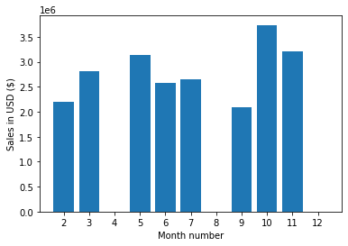
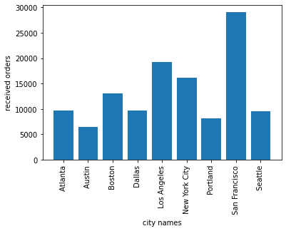
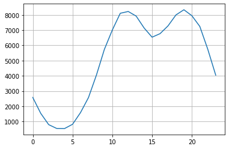
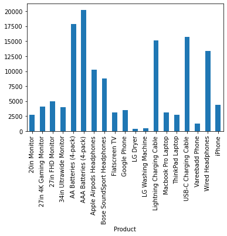
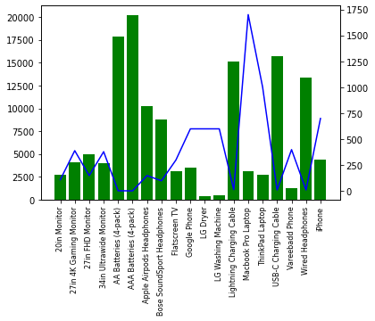
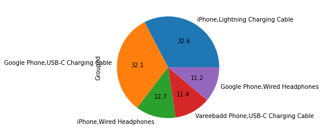

```python
import os
import pandas as pd
import matplotlib.pyplot as plt
import seaborn as sns
```

##### Merge 12 months of sales data into a single csv file 


```python
files =[file for file in os.listdir("/content")]
for file in files:
    print(file)
```

    .config
    Sales_July_2019.csv
    Sales_October_2019.csv
    Sales_March_2019.csv
    Sales_June_2019.csv
    Sales_November_2019.csv
    Sales_September_2019.csv
    Sales_May_2019.csv
    Sales_February_2019.csv
    Sales_January_2019.csv
    sample_data


```python
path = "/content/"

#blank dataframe
all_data = pd.DataFrame()

for file in files:
    current_df = pd.read_csv(f'{path}{file}')
    all_data = pd.concat([all_data, current_df])
    
all_data.shape
```


    (121616, 6)


## Convert it into dataset


```python
all_data.to_csv('/content/all_data.csv', index=False)
```

## Data cleaning and formatting


```python
all_data.dtypes
```


    Order ID            object
    Product             object
    Quantity Ordered    object
    Price Each          object
    Order Date          object
    Purchase Address    object
    dtype: object


```python
all_data.head()
```


<div>
<style scoped>
    .dataframe tbody tr th:only-of-type {
        vertical-align: middle;
    }

    .dataframe tbody tr th {
        vertical-align: top;
    }

    .dataframe thead th {
        text-align: right;
    }
</style>
<table border="1" class="dataframe">
  <thead>
    <tr style="text-align: right;">
      <th></th>
      <th>Order ID</th>
      <th>Product</th>
      <th>Quantity Ordered</th>
      <th>Price Each</th>
      <th>Order Date</th>
      <th>Purchase Address</th>
    </tr>
  </thead>
  <tbody>
    <tr>
      <th>0</th>
      <td>176558</td>
      <td>USB-C Charging Cable</td>
      <td>2</td>
      <td>11.95</td>
      <td>04/19/19 08:46</td>
      <td>917 1st St, Dallas, TX 75001</td>
    </tr>
    <tr>
      <th>1</th>
      <td>NaN</td>
      <td>NaN</td>
      <td>NaN</td>
      <td>NaN</td>
      <td>NaN</td>
      <td>NaN</td>
    </tr>
    <tr>
      <th>2</th>
      <td>176559</td>
      <td>Bose SoundSport Headphones</td>
      <td>1</td>
      <td>99.99</td>
      <td>04/07/19 22:30</td>
      <td>682 Chestnut St, Boston, MA 02215</td>
    </tr>
    <tr>
      <th>3</th>
      <td>176560</td>
      <td>Google Phone</td>
      <td>1</td>
      <td>600</td>
      <td>04/12/19 14:38</td>
      <td>669 Spruce St, Los Angeles, CA 90001</td>
    </tr>
    <tr>
      <th>4</th>
      <td>176560</td>
      <td>Wired Headphones</td>
      <td>1</td>
      <td>11.99</td>
      <td>04/12/19 14:38</td>
      <td>669 Spruce St, Los Angeles, CA 90001</td>
    </tr>
  </tbody>
</table>
</div>


```python
all_data.isnull().sum()
```


    Order ID            352
    Product             352
    Quantity Ordered    352
    Price Each          352
    Order Date          352
    Purchase Address    352
    dtype: int64


```python
all_data = all_data.dropna(how='all')
all_data.shape
```


    (121264, 6)


## What is the best month for sale?


```python
'04/19/19 08:46'.split('/')[0]
```


    '04'


```python
def month(x):
    return x.split('/')[0]
```

### Add month col


```python
all_data['Month'] = all_data['Order Date'].apply(month)
```


```python
all_data.dtypes
```


    Order ID            object
    Product             object
    Quantity Ordered    object
    Price Each          object
    Order Date          object
    Purchase Address    object
    Month               object
    dtype: object


```python
all_data['Month'] = all_data['Month'].astype(int)
```


```python
all_data['Month'].unique()
```


    array([ 7,  8, 10, 11,  3,  4,  6, 12,  9,  5,  2])


```python
filter = all_data['Month'] == 'Order Date'
len(all_data[~filter])
```


    121034


```python
all_data = all_data[~filter]
all_data.shape
all_data.head()
```


  <div id="df-41bde95d-7b5d-4c05-a5d9-a12aaf3cb197">
    <div class="colab-df-container">
      <div>
<style scoped>
    .dataframe tbody tr th:only-of-type {
        vertical-align: middle;
    }

    .dataframe tbody tr th {
        vertical-align: top;
    }

    .dataframe thead th {
        text-align: right;
    }
</style>
<table border="1" class="dataframe">
  <thead>
    <tr style="text-align: right;">
      <th></th>
      <th>Order ID</th>
      <th>Product</th>
      <th>Quantity Ordered</th>
      <th>Price Each</th>
      <th>Order Date</th>
      <th>Purchase Address</th>
      <th>Month</th>
    </tr>
  </thead>
  <tbody>
    <tr>
      <th>0</th>
      <td>222910</td>
      <td>Apple Airpods Headphones</td>
      <td>1</td>
      <td>150</td>
      <td>07/26/19 16:51</td>
      <td>389 South St, Atlanta, GA 30301</td>
      <td>07</td>
    </tr>
    <tr>
      <th>1</th>
      <td>222911</td>
      <td>Flatscreen TV</td>
      <td>1</td>
      <td>300</td>
      <td>07/05/19 08:55</td>
      <td>590 4th St, Seattle, WA 98101</td>
      <td>07</td>
    </tr>
    <tr>
      <th>2</th>
      <td>222912</td>
      <td>AA Batteries (4-pack)</td>
      <td>1</td>
      <td>3.84</td>
      <td>07/29/19 12:41</td>
      <td>861 Hill St, Atlanta, GA 30301</td>
      <td>07</td>
    </tr>
    <tr>
      <th>3</th>
      <td>222913</td>
      <td>AA Batteries (4-pack)</td>
      <td>1</td>
      <td>3.84</td>
      <td>07/28/19 10:15</td>
      <td>190 Ridge St, Atlanta, GA 30301</td>
      <td>07</td>
    </tr>
    <tr>
      <th>4</th>
      <td>222914</td>
      <td>AAA Batteries (4-pack)</td>
      <td>5</td>
      <td>2.99</td>
      <td>07/31/19 02:13</td>
      <td>824 Forest St, Seattle, WA 98101</td>
      <td>07</td>
    </tr>
  </tbody>
</table>
</div>
      <button class="colab-df-convert" onclick="convertToInteractive('df-41bde95d-7b5d-4c05-a5d9-a12aaf3cb197')"
              title="Convert this dataframe to an interactive table."
              style="display:none;">

  <svg xmlns="http://www.w3.org/2000/svg" height="24px"viewBox="0 0 24 24"
       width="24px">
    <path d="M0 0h24v24H0V0z" fill="none"/>
    <path d="M18.56 5.44l.94 2.06.94-2.06 2.06-.94-2.06-.94-.94-2.06-.94 2.06-2.06.94zm-11 1L8.5 8.5l.94-2.06 2.06-.94-2.06-.94L8.5 2.5l-.94 2.06-2.06.94zm10 10l.94 2.06.94-2.06 2.06-.94-2.06-.94-.94-2.06-.94 2.06-2.06.94z"/><path d="M17.41 7.96l-1.37-1.37c-.4-.4-.92-.59-1.43-.59-.52 0-1.04.2-1.43.59L10.3 9.45l-7.72 7.72c-.78.78-.78 2.05 0 2.83L4 21.41c.39.39.9.59 1.41.59.51 0 1.02-.2 1.41-.59l7.78-7.78 2.81-2.81c.8-.78.8-2.07 0-2.86zM5.41 20L4 18.59l7.72-7.72 1.47 1.35L5.41 20z"/>
  </svg>
      </button>

  <style>
    .colab-df-container {
      display:flex;
      flex-wrap:wrap;
      gap: 12px;
    }

    .colab-df-convert {
      background-color: #E8F0FE;
      border: none;
      border-radius: 50%;
      cursor: pointer;
      display: none;
      fill: #1967D2;
      height: 32px;
      padding: 0 0 0 0;
      width: 32px;
    }

    .colab-df-convert:hover {
      background-color: #E2EBFA;
      box-shadow: 0px 1px 2px rgba(60, 64, 67, 0.3), 0px 1px 3px 1px rgba(60, 64, 67, 0.15);
      fill: #174EA6;
    }

    [theme=dark] .colab-df-convert {
      background-color: #3B4455;
      fill: #D2E3FC;
    }

    [theme=dark] .colab-df-convert:hover {
      background-color: #434B5C;
      box-shadow: 0px 1px 3px 1px rgba(0, 0, 0, 0.15);
      filter: drop-shadow(0px 1px 2px rgba(0, 0, 0, 0.3));
      fill: #FFFFFF;
    }
  </style>

      <script>
        const buttonEl =
          document.querySelector('#df-41bde95d-7b5d-4c05-a5d9-a12aaf3cb197 button.colab-df-convert');
        buttonEl.style.display =
          google.colab.kernel.accessAllowed ? 'block' : 'none';

        async function convertToInteractive(key) {
          const element = document.querySelector('#df-41bde95d-7b5d-4c05-a5d9-a12aaf3cb197');
          const dataTable =
            await google.colab.kernel.invokeFunction('convertToInteractive',
                                                     [key], {});
          if (!dataTable) return;

          const docLinkHtml = 'Like what you see? Visit the ' +
            '<a target="_blank" href=https://colab.research.google.com/notebooks/data_table.ipynb>data table notebook</a>'
            + ' to learn more about interactive tables.';
          element.innerHTML = '';
          dataTable['output_type'] = 'display_data';
          await google.colab.output.renderOutput(dataTable, element);
          const docLink = document.createElement('div');
          docLink.innerHTML = docLinkHtml;
          element.appendChild(docLink);
        }
      </script>
    </div>
  </div>


```python
all_data['Month'] = all_data['Month'].astype(int)
all_data.dtypes
```


    Order ID            object
    Product             object
    Quantity Ordered    object
    Price Each          object
    Order Date          object
    Purchase Address    object
    Month                int64
    dtype: object


```python
all_data['Price Each'] = all_data['Price Each'].astype(float)
all_data['Quantity Ordered'] = all_data['Quantity Ordered'].astype(int)
all_data['sales'] = all_data['Quantity Ordered'] * all_data['Price Each']
all_data.head(5)
```


  <div id="df-00a33112-8543-4025-9061-6681f43b8dc3">
    <div class="colab-df-container">
      <div>
<style scoped>
    .dataframe tbody tr th:only-of-type {
        vertical-align: middle;
    }

    .dataframe tbody tr th {
        vertical-align: top;
    }

    .dataframe thead th {
        text-align: right;
    }
</style>
<table border="1" class="dataframe">
  <thead>
    <tr style="text-align: right;">
      <th></th>
      <th>Order ID</th>
      <th>Product</th>
      <th>Quantity Ordered</th>
      <th>Price Each</th>
      <th>Order Date</th>
      <th>Purchase Address</th>
      <th>Month</th>
      <th>sales</th>
    </tr>
  </thead>
  <tbody>
    <tr>
      <th>0</th>
      <td>222910</td>
      <td>Apple Airpods Headphones</td>
      <td>1</td>
      <td>150.00</td>
      <td>07/26/19 16:51</td>
      <td>389 South St, Atlanta, GA 30301</td>
      <td>7</td>
      <td>150.00</td>
    </tr>
    <tr>
      <th>1</th>
      <td>222911</td>
      <td>Flatscreen TV</td>
      <td>1</td>
      <td>300.00</td>
      <td>07/05/19 08:55</td>
      <td>590 4th St, Seattle, WA 98101</td>
      <td>7</td>
      <td>300.00</td>
    </tr>
    <tr>
      <th>2</th>
      <td>222912</td>
      <td>AA Batteries (4-pack)</td>
      <td>1</td>
      <td>3.84</td>
      <td>07/29/19 12:41</td>
      <td>861 Hill St, Atlanta, GA 30301</td>
      <td>7</td>
      <td>3.84</td>
    </tr>
    <tr>
      <th>3</th>
      <td>222913</td>
      <td>AA Batteries (4-pack)</td>
      <td>1</td>
      <td>3.84</td>
      <td>07/28/19 10:15</td>
      <td>190 Ridge St, Atlanta, GA 30301</td>
      <td>7</td>
      <td>3.84</td>
    </tr>
    <tr>
      <th>4</th>
      <td>222914</td>
      <td>AAA Batteries (4-pack)</td>
      <td>5</td>
      <td>2.99</td>
      <td>07/31/19 02:13</td>
      <td>824 Forest St, Seattle, WA 98101</td>
      <td>7</td>
      <td>14.95</td>
    </tr>
  </tbody>
</table>
</div>
      <button class="colab-df-convert" onclick="convertToInteractive('df-00a33112-8543-4025-9061-6681f43b8dc3')"
              title="Convert this dataframe to an interactive table."
              style="display:none;">

  <svg xmlns="http://www.w3.org/2000/svg" height="24px"viewBox="0 0 24 24"
       width="24px">
    <path d="M0 0h24v24H0V0z" fill="none"/>
    <path d="M18.56 5.44l.94 2.06.94-2.06 2.06-.94-2.06-.94-.94-2.06-.94 2.06-2.06.94zm-11 1L8.5 8.5l.94-2.06 2.06-.94-2.06-.94L8.5 2.5l-.94 2.06-2.06.94zm10 10l.94 2.06.94-2.06 2.06-.94-2.06-.94-.94-2.06-.94 2.06-2.06.94z"/><path d="M17.41 7.96l-1.37-1.37c-.4-.4-.92-.59-1.43-.59-.52 0-1.04.2-1.43.59L10.3 9.45l-7.72 7.72c-.78.78-.78 2.05 0 2.83L4 21.41c.39.39.9.59 1.41.59.51 0 1.02-.2 1.41-.59l7.78-7.78 2.81-2.81c.8-.78.8-2.07 0-2.86zM5.41 20L4 18.59l7.72-7.72 1.47 1.35L5.41 20z"/>
  </svg>
      </button>

  <style>
    .colab-df-container {
      display:flex;
      flex-wrap:wrap;
      gap: 12px;
    }

    .colab-df-convert {
      background-color: #E8F0FE;
      border: none;
      border-radius: 50%;
      cursor: pointer;
      display: none;
      fill: #1967D2;
      height: 32px;
      padding: 0 0 0 0;
      width: 32px;
    }

    .colab-df-convert:hover {
      background-color: #E2EBFA;
      box-shadow: 0px 1px 2px rgba(60, 64, 67, 0.3), 0px 1px 3px 1px rgba(60, 64, 67, 0.15);
      fill: #174EA6;
    }

    [theme=dark] .colab-df-convert {
      background-color: #3B4455;
      fill: #D2E3FC;
    }

    [theme=dark] .colab-df-convert:hover {
      background-color: #434B5C;
      box-shadow: 0px 1px 3px 1px rgba(0, 0, 0, 0.15);
      filter: drop-shadow(0px 1px 2px rgba(0, 0, 0, 0.3));
      fill: #FFFFFF;
    }
  </style>

      <script>
        const buttonEl =
          document.querySelector('#df-00a33112-8543-4025-9061-6681f43b8dc3 button.colab-df-convert');
        buttonEl.style.display =
          google.colab.kernel.accessAllowed ? 'block' : 'none';

        async function convertToInteractive(key) {
          const element = document.querySelector('#df-00a33112-8543-4025-9061-6681f43b8dc3');
          const dataTable =
            await google.colab.kernel.invokeFunction('convertToInteractive',
                                                     [key], {});
          if (!dataTable) return;

          const docLinkHtml = 'Like what you see? Visit the ' +
            '<a target="_blank" href=https://colab.research.google.com/notebooks/data_table.ipynb>data table notebook</a>'
            + ' to learn more about interactive tables.';
          element.innerHTML = '';
          dataTable['output_type'] = 'display_data';
          await google.colab.output.renderOutput(dataTable, element);
          const docLink = document.createElement('div');
          docLink.innerHTML = docLinkHtml;
          element.appendChild(docLink);
        }
      </script>
    </div>
  </div>


```python
all_data.groupby('Month')['sales'].sum()
```


    Month
    2     2200273.74
    3     2807100.38
    4        5170.42
    5     3142047.46
    6     2577802.26
    7     2647775.76
    8        2152.31
    9     2095463.39
    10    3736726.88
    11    3199603.20
    12       2816.51
    Name: sales, dtype: float64


```python
months = range(2,13)  # Some issues qith january, August, and December data
plt.bar(months, all_data.groupby('Month')['sales'].sum())
plt.xticks(months)
plt.ylabel('Sales in USD ($)')
plt.xlabel('Month number') 
plt.show()
```


    

    


##### Which city has max order


```python
'917 1st St, Dallas, TX 75001'.split(',')[1]
```


    ' Dallas'


```python
def city(x):
    return x.split(',')[1]
```


```python
all_data['city'] = all_data['Purchase Address'].apply(city)
```


```python
all_data.groupby('city')['city'].count()
```


    city
     Atlanta           9694
     Austin            6406
     Boston           13025
     Dallas            9712
     Los Angeles      19289
     New York City    16105
     Portland          8135
     San Francisco    29087
     Seattle           9581
    Name: city, dtype: int64


```python
plt.bar(all_data.groupby('city')['city'].count().index,all_data.groupby('city')['city'].count())
plt.xticks(rotation='vertical')
plt.ylabel('received orders')
plt.xlabel('city names')
plt.show()
```


    

    


##### What time should we display advertisements to maximise for product purchase?


```python
all_data['Order Date'][0].dtype
```


    dtype('O')


```python
all_data['Hour'] = pd.to_datetime(all_data['Order Date']).dt.hour

keys=[]
hour=[]
for key,hour_df in all_data.groupby('Hour'):
    keys.append(key)
    hour.append(len(hour_df))
```


```python
plt.grid()
plt.plot(keys, hour)
```


    [<matplotlib.lines.Line2D at 0x7f90d8d41310>]


    

    


##### between 12pm and 7pm is probably the best time to advertise to maximise product purchase

#### What product sold the most? &  Why?


```python
all_data.groupby('Product')['Quantity Ordered'].sum().plot(kind='bar')
```


    <matplotlib.axes._subplots.AxesSubplot at 0x7f90d9808410>


    

    


```python
all_data.groupby('Product')['Price Each'].mean()
```


    Product
    20in Monitor                   109.99
    27in 4K Gaming Monitor         389.99
    27in FHD Monitor               149.99
    34in Ultrawide Monitor         379.99
    AA Batteries (4-pack)            3.84
    AAA Batteries (4-pack)           2.99
    Apple Airpods Headphones       150.00
    Bose SoundSport Headphones      99.99
    Flatscreen TV                  300.00
    Google Phone                   600.00
    LG Dryer                       600.00
    LG Washing Machine             600.00
    Lightning Charging Cable        14.95
    Macbook Pro Laptop            1700.00
    ThinkPad Laptop                999.99
    USB-C Charging Cable            11.95
    Vareebadd Phone                400.00
    Wired Headphones                11.99
    iPhone                         700.00
    Name: Price Each, dtype: float64


```python
products = all_data.groupby('Product')['Quantity Ordered'].sum().index
quantity = all_data.groupby('Product')['Quantity Ordered'].sum()
prices = all_data.groupby('Product')['Price Each'].mean()

plt.figure(figsize=(40,24))
fig, ax1 = plt.subplots()
ax2 = ax1.twinx()
ax1.bar(products, quantity, color='g')
ax2.plot(products, prices, 'b-')
ax1.set_xticklabels(products, rotation='vertical', size=8)
```


    [Text(0, 0, '20in Monitor'),
     Text(0, 0, '27in 4K Gaming Monitor'),
     Text(0, 0, '27in FHD Monitor'),
     Text(0, 0, '34in Ultrawide Monitor'),
     Text(0, 0, 'AA Batteries (4-pack)'),
     Text(0, 0, 'AAA Batteries (4-pack)'),
     Text(0, 0, 'Apple Airpods Headphones'),
     Text(0, 0, 'Bose SoundSport Headphones'),
     Text(0, 0, 'Flatscreen TV'),
     Text(0, 0, 'Google Phone'),
     Text(0, 0, 'LG Dryer'),
     Text(0, 0, 'LG Washing Machine'),
     Text(0, 0, 'Lightning Charging Cable'),
     Text(0, 0, 'Macbook Pro Laptop'),
     Text(0, 0, 'ThinkPad Laptop'),
     Text(0, 0, 'USB-C Charging Cable'),
     Text(0, 0, 'Vareebadd Phone'),
     Text(0, 0, 'Wired Headphones'),
     Text(0, 0, 'iPhone')]


    <Figure size 2880x1728 with 0 Axes>


    

    


##### The top selling product is 'AAA Batteries'. The top selling products seem to have a correlation with the price of the product. The cheaper the product higher the quantity ordered and vice versa.


```python
all_data.shape
```


    (121034, 10)


##### What products are most often sold together?

#### note: keep orders that have same order Id,are sold mostly together


```python
df=all_data[all_data['Order ID'].duplicated(keep=False)]
df.head(20)
```


  <div id="df-722ea0e2-96d7-456d-bc49-c0c5b34ebcce">
    <div class="colab-df-container">
      <div>
<style scoped>
    .dataframe tbody tr th:only-of-type {
        vertical-align: middle;
    }

    .dataframe tbody tr th {
        vertical-align: top;
    }

    .dataframe thead th {
        text-align: right;
    }
</style>
<table border="1" class="dataframe">
  <thead>
    <tr style="text-align: right;">
      <th></th>
      <th>Order ID</th>
      <th>Product</th>
      <th>Quantity Ordered</th>
      <th>Price Each</th>
      <th>Order Date</th>
      <th>Purchase Address</th>
      <th>Month</th>
      <th>sales</th>
      <th>city</th>
      <th>Hour</th>
    </tr>
  </thead>
  <tbody>
    <tr>
      <th>118</th>
      <td>223028</td>
      <td>Vareebadd Phone</td>
      <td>1</td>
      <td>400.00</td>
      <td>07/07/19 10:21</td>
      <td>969 10th St, San Francisco, CA 94016</td>
      <td>7</td>
      <td>400.00</td>
      <td>San Francisco</td>
      <td>10</td>
    </tr>
    <tr>
      <th>119</th>
      <td>223028</td>
      <td>USB-C Charging Cable</td>
      <td>2</td>
      <td>11.95</td>
      <td>07/07/19 10:21</td>
      <td>969 10th St, San Francisco, CA 94016</td>
      <td>7</td>
      <td>23.90</td>
      <td>San Francisco</td>
      <td>10</td>
    </tr>
    <tr>
      <th>120</th>
      <td>223028</td>
      <td>Wired Headphones</td>
      <td>1</td>
      <td>11.99</td>
      <td>07/07/19 10:21</td>
      <td>969 10th St, San Francisco, CA 94016</td>
      <td>7</td>
      <td>11.99</td>
      <td>San Francisco</td>
      <td>10</td>
    </tr>
    <tr>
      <th>140</th>
      <td>223048</td>
      <td>Vareebadd Phone</td>
      <td>1</td>
      <td>400.00</td>
      <td>07/21/19 17:19</td>
      <td>168 8th St, Portland, OR 97035</td>
      <td>7</td>
      <td>400.00</td>
      <td>Portland</td>
      <td>17</td>
    </tr>
    <tr>
      <th>141</th>
      <td>223048</td>
      <td>USB-C Charging Cable</td>
      <td>2</td>
      <td>11.95</td>
      <td>07/21/19 17:19</td>
      <td>168 8th St, Portland, OR 97035</td>
      <td>7</td>
      <td>23.90</td>
      <td>Portland</td>
      <td>17</td>
    </tr>
    <tr>
      <th>188</th>
      <td>223095</td>
      <td>Apple Airpods Headphones</td>
      <td>1</td>
      <td>150.00</td>
      <td>07/03/19 13:42</td>
      <td>876 Cedar St, Los Angeles, CA 90001</td>
      <td>7</td>
      <td>150.00</td>
      <td>Los Angeles</td>
      <td>13</td>
    </tr>
    <tr>
      <th>189</th>
      <td>223095</td>
      <td>AA Batteries (4-pack)</td>
      <td>1</td>
      <td>3.84</td>
      <td>07/03/19 13:42</td>
      <td>876 Cedar St, Los Angeles, CA 90001</td>
      <td>7</td>
      <td>3.84</td>
      <td>Los Angeles</td>
      <td>13</td>
    </tr>
    <tr>
      <th>201</th>
      <td>223106</td>
      <td>Wired Headphones</td>
      <td>1</td>
      <td>11.99</td>
      <td>07/14/19 14:30</td>
      <td>630 2nd St, San Francisco, CA 94016</td>
      <td>7</td>
      <td>11.99</td>
      <td>San Francisco</td>
      <td>14</td>
    </tr>
    <tr>
      <th>202</th>
      <td>223106</td>
      <td>Vareebadd Phone</td>
      <td>1</td>
      <td>400.00</td>
      <td>07/14/19 14:30</td>
      <td>630 2nd St, San Francisco, CA 94016</td>
      <td>7</td>
      <td>400.00</td>
      <td>San Francisco</td>
      <td>14</td>
    </tr>
    <tr>
      <th>213</th>
      <td>223117</td>
      <td>Google Phone</td>
      <td>1</td>
      <td>600.00</td>
      <td>07/11/19 23:25</td>
      <td>184 Spruce St, Atlanta, GA 30301</td>
      <td>7</td>
      <td>600.00</td>
      <td>Atlanta</td>
      <td>23</td>
    </tr>
    <tr>
      <th>214</th>
      <td>223117</td>
      <td>USB-C Charging Cable</td>
      <td>1</td>
      <td>11.95</td>
      <td>07/11/19 23:25</td>
      <td>184 Spruce St, Atlanta, GA 30301</td>
      <td>7</td>
      <td>11.95</td>
      <td>Atlanta</td>
      <td>23</td>
    </tr>
    <tr>
      <th>230</th>
      <td>223133</td>
      <td>AA Batteries (4-pack)</td>
      <td>1</td>
      <td>3.84</td>
      <td>07/28/19 20:40</td>
      <td>621 Church St, San Francisco, CA 94016</td>
      <td>7</td>
      <td>3.84</td>
      <td>San Francisco</td>
      <td>20</td>
    </tr>
    <tr>
      <th>231</th>
      <td>223133</td>
      <td>AAA Batteries (4-pack)</td>
      <td>1</td>
      <td>2.99</td>
      <td>07/28/19 20:40</td>
      <td>621 Church St, San Francisco, CA 94016</td>
      <td>7</td>
      <td>2.99</td>
      <td>San Francisco</td>
      <td>20</td>
    </tr>
    <tr>
      <th>238</th>
      <td>223140</td>
      <td>AA Batteries (4-pack)</td>
      <td>1</td>
      <td>3.84</td>
      <td>07/22/19 09:58</td>
      <td>112 Meadow St, San Francisco, CA 94016</td>
      <td>7</td>
      <td>3.84</td>
      <td>San Francisco</td>
      <td>9</td>
    </tr>
    <tr>
      <th>239</th>
      <td>223140</td>
      <td>Flatscreen TV</td>
      <td>1</td>
      <td>300.00</td>
      <td>07/22/19 09:58</td>
      <td>112 Meadow St, San Francisco, CA 94016</td>
      <td>7</td>
      <td>300.00</td>
      <td>San Francisco</td>
      <td>9</td>
    </tr>
    <tr>
      <th>243</th>
      <td>223144</td>
      <td>Google Phone</td>
      <td>1</td>
      <td>600.00</td>
      <td>07/15/19 21:51</td>
      <td>37 Walnut St, New York City, NY 10001</td>
      <td>7</td>
      <td>600.00</td>
      <td>New York City</td>
      <td>21</td>
    </tr>
    <tr>
      <th>244</th>
      <td>223144</td>
      <td>USB-C Charging Cable</td>
      <td>1</td>
      <td>11.95</td>
      <td>07/15/19 21:51</td>
      <td>37 Walnut St, New York City, NY 10001</td>
      <td>7</td>
      <td>11.95</td>
      <td>New York City</td>
      <td>21</td>
    </tr>
    <tr>
      <th>310</th>
      <td>223210</td>
      <td>AA Batteries (4-pack)</td>
      <td>3</td>
      <td>3.84</td>
      <td>07/09/19 17:05</td>
      <td>272 Spruce St, Atlanta, GA 30301</td>
      <td>7</td>
      <td>11.52</td>
      <td>Atlanta</td>
      <td>17</td>
    </tr>
    <tr>
      <th>311</th>
      <td>223210</td>
      <td>27in FHD Monitor</td>
      <td>1</td>
      <td>149.99</td>
      <td>07/09/19 17:05</td>
      <td>272 Spruce St, Atlanta, GA 30301</td>
      <td>7</td>
      <td>149.99</td>
      <td>Atlanta</td>
      <td>17</td>
    </tr>
    <tr>
      <th>323</th>
      <td>223221</td>
      <td>Wired Headphones</td>
      <td>1</td>
      <td>11.99</td>
      <td>07/07/19 18:32</td>
      <td>244 Meadow St, Boston, MA 02215</td>
      <td>7</td>
      <td>11.99</td>
      <td>Boston</td>
      <td>18</td>
    </tr>
  </tbody>
</table>
</div>
      <button class="colab-df-convert" onclick="convertToInteractive('df-722ea0e2-96d7-456d-bc49-c0c5b34ebcce')"
              title="Convert this dataframe to an interactive table."
              style="display:none;">

  <svg xmlns="http://www.w3.org/2000/svg" height="24px"viewBox="0 0 24 24"
       width="24px">
    <path d="M0 0h24v24H0V0z" fill="none"/>
    <path d="M18.56 5.44l.94 2.06.94-2.06 2.06-.94-2.06-.94-.94-2.06-.94 2.06-2.06.94zm-11 1L8.5 8.5l.94-2.06 2.06-.94-2.06-.94L8.5 2.5l-.94 2.06-2.06.94zm10 10l.94 2.06.94-2.06 2.06-.94-2.06-.94-.94-2.06-.94 2.06-2.06.94z"/><path d="M17.41 7.96l-1.37-1.37c-.4-.4-.92-.59-1.43-.59-.52 0-1.04.2-1.43.59L10.3 9.45l-7.72 7.72c-.78.78-.78 2.05 0 2.83L4 21.41c.39.39.9.59 1.41.59.51 0 1.02-.2 1.41-.59l7.78-7.78 2.81-2.81c.8-.78.8-2.07 0-2.86zM5.41 20L4 18.59l7.72-7.72 1.47 1.35L5.41 20z"/>
  </svg>
      </button>

  <style>
    .colab-df-container {
      display:flex;
      flex-wrap:wrap;
      gap: 12px;
    }

    .colab-df-convert {
      background-color: #E8F0FE;
      border: none;
      border-radius: 50%;
      cursor: pointer;
      display: none;
      fill: #1967D2;
      height: 32px;
      padding: 0 0 0 0;
      width: 32px;
    }

    .colab-df-convert:hover {
      background-color: #E2EBFA;
      box-shadow: 0px 1px 2px rgba(60, 64, 67, 0.3), 0px 1px 3px 1px rgba(60, 64, 67, 0.15);
      fill: #174EA6;
    }

    [theme=dark] .colab-df-convert {
      background-color: #3B4455;
      fill: #D2E3FC;
    }

    [theme=dark] .colab-df-convert:hover {
      background-color: #434B5C;
      box-shadow: 0px 1px 3px 1px rgba(0, 0, 0, 0.15);
      filter: drop-shadow(0px 1px 2px rgba(0, 0, 0, 0.3));
      fill: #FFFFFF;
    }
  </style>

      <script>
        const buttonEl =
          document.querySelector('#df-722ea0e2-96d7-456d-bc49-c0c5b34ebcce button.colab-df-convert');
        buttonEl.style.display =
          google.colab.kernel.accessAllowed ? 'block' : 'none';

        async function convertToInteractive(key) {
          const element = document.querySelector('#df-722ea0e2-96d7-456d-bc49-c0c5b34ebcce');
          const dataTable =
            await google.colab.kernel.invokeFunction('convertToInteractive',
                                                     [key], {});
          if (!dataTable) return;

          const docLinkHtml = 'Like what you see? Visit the ' +
            '<a target="_blank" href=https://colab.research.google.com/notebooks/data_table.ipynb>data table notebook</a>'
            + ' to learn more about interactive tables.';
          element.innerHTML = '';
          dataTable['output_type'] = 'display_data';
          await google.colab.output.renderOutput(dataTable, element);
          const docLink = document.createElement('div');
          docLink.innerHTML = docLinkHtml;
          element.appendChild(docLink);
        }
      </script>
    </div>
  </div>


```python
#create grouped col 
df.loc[:, 'Grouped'] = df.groupby('Order ID')['Product'].transform(lambda x: ','.join(x))
df.head()
```

    /usr/local/lib/python3.7/dist-packages/pandas/core/indexing.py:1773: SettingWithCopyWarning: 
    A value is trying to be set on a copy of a slice from a DataFrame.
    Try using .loc[row_indexer,col_indexer] = value instead
    
    See the caveats in the documentation: https://pandas.pydata.org/pandas-docs/stable/user_guide/indexing.html#returning-a-view-versus-a-copy
      self._setitem_single_column(ilocs[0], value, pi)


  <div id="df-1741c8b3-2379-40ea-b21c-dec9699ba3fb">
    <div class="colab-df-container">
      <div>
<style scoped>
    .dataframe tbody tr th:only-of-type {
        vertical-align: middle;
    }

    .dataframe tbody tr th {
        vertical-align: top;
    }

    .dataframe thead th {
        text-align: right;
    }
</style>
<table border="1" class="dataframe">
  <thead>
    <tr style="text-align: right;">
      <th></th>
      <th>Order ID</th>
      <th>Product</th>
      <th>Quantity Ordered</th>
      <th>Price Each</th>
      <th>Order Date</th>
      <th>Purchase Address</th>
      <th>Month</th>
      <th>sales</th>
      <th>city</th>
      <th>Hour</th>
      <th>Grouped</th>
    </tr>
  </thead>
  <tbody>
    <tr>
      <th>118</th>
      <td>223028</td>
      <td>Vareebadd Phone</td>
      <td>1</td>
      <td>400.00</td>
      <td>07/07/19 10:21</td>
      <td>969 10th St, San Francisco, CA 94016</td>
      <td>7</td>
      <td>400.00</td>
      <td>San Francisco</td>
      <td>10</td>
      <td>Vareebadd Phone,USB-C Charging Cable,Wired Hea...</td>
    </tr>
    <tr>
      <th>119</th>
      <td>223028</td>
      <td>USB-C Charging Cable</td>
      <td>2</td>
      <td>11.95</td>
      <td>07/07/19 10:21</td>
      <td>969 10th St, San Francisco, CA 94016</td>
      <td>7</td>
      <td>23.90</td>
      <td>San Francisco</td>
      <td>10</td>
      <td>Vareebadd Phone,USB-C Charging Cable,Wired Hea...</td>
    </tr>
    <tr>
      <th>120</th>
      <td>223028</td>
      <td>Wired Headphones</td>
      <td>1</td>
      <td>11.99</td>
      <td>07/07/19 10:21</td>
      <td>969 10th St, San Francisco, CA 94016</td>
      <td>7</td>
      <td>11.99</td>
      <td>San Francisco</td>
      <td>10</td>
      <td>Vareebadd Phone,USB-C Charging Cable,Wired Hea...</td>
    </tr>
    <tr>
      <th>140</th>
      <td>223048</td>
      <td>Vareebadd Phone</td>
      <td>1</td>
      <td>400.00</td>
      <td>07/21/19 17:19</td>
      <td>168 8th St, Portland, OR 97035</td>
      <td>7</td>
      <td>400.00</td>
      <td>Portland</td>
      <td>17</td>
      <td>Vareebadd Phone,USB-C Charging Cable</td>
    </tr>
    <tr>
      <th>141</th>
      <td>223048</td>
      <td>USB-C Charging Cable</td>
      <td>2</td>
      <td>11.95</td>
      <td>07/21/19 17:19</td>
      <td>168 8th St, Portland, OR 97035</td>
      <td>7</td>
      <td>23.90</td>
      <td>Portland</td>
      <td>17</td>
      <td>Vareebadd Phone,USB-C Charging Cable</td>
    </tr>
  </tbody>
</table>
</div>
      <button class="colab-df-convert" onclick="convertToInteractive('df-1741c8b3-2379-40ea-b21c-dec9699ba3fb')"
              title="Convert this dataframe to an interactive table."
              style="display:none;">

  <svg xmlns="http://www.w3.org/2000/svg" height="24px"viewBox="0 0 24 24"
       width="24px">
    <path d="M0 0h24v24H0V0z" fill="none"/>
    <path d="M18.56 5.44l.94 2.06.94-2.06 2.06-.94-2.06-.94-.94-2.06-.94 2.06-2.06.94zm-11 1L8.5 8.5l.94-2.06 2.06-.94-2.06-.94L8.5 2.5l-.94 2.06-2.06.94zm10 10l.94 2.06.94-2.06 2.06-.94-2.06-.94-.94-2.06-.94 2.06-2.06.94z"/><path d="M17.41 7.96l-1.37-1.37c-.4-.4-.92-.59-1.43-.59-.52 0-1.04.2-1.43.59L10.3 9.45l-7.72 7.72c-.78.78-.78 2.05 0 2.83L4 21.41c.39.39.9.59 1.41.59.51 0 1.02-.2 1.41-.59l7.78-7.78 2.81-2.81c.8-.78.8-2.07 0-2.86zM5.41 20L4 18.59l7.72-7.72 1.47 1.35L5.41 20z"/>
  </svg>
      </button>

  <style>
    .colab-df-container {
      display:flex;
      flex-wrap:wrap;
      gap: 12px;
    }

    .colab-df-convert {
      background-color: #E8F0FE;
      border: none;
      border-radius: 50%;
      cursor: pointer;
      display: none;
      fill: #1967D2;
      height: 32px;
      padding: 0 0 0 0;
      width: 32px;
    }

    .colab-df-convert:hover {
      background-color: #E2EBFA;
      box-shadow: 0px 1px 2px rgba(60, 64, 67, 0.3), 0px 1px 3px 1px rgba(60, 64, 67, 0.15);
      fill: #174EA6;
    }

    [theme=dark] .colab-df-convert {
      background-color: #3B4455;
      fill: #D2E3FC;
    }

    [theme=dark] .colab-df-convert:hover {
      background-color: #434B5C;
      box-shadow: 0px 1px 3px 1px rgba(0, 0, 0, 0.15);
      filter: drop-shadow(0px 1px 2px rgba(0, 0, 0, 0.3));
      fill: #FFFFFF;
    }
  </style>

      <script>
        const buttonEl =
          document.querySelector('#df-1741c8b3-2379-40ea-b21c-dec9699ba3fb button.colab-df-convert');
        buttonEl.style.display =
          google.colab.kernel.accessAllowed ? 'block' : 'none';

        async function convertToInteractive(key) {
          const element = document.querySelector('#df-1741c8b3-2379-40ea-b21c-dec9699ba3fb');
          const dataTable =
            await google.colab.kernel.invokeFunction('convertToInteractive',
                                                     [key], {});
          if (!dataTable) return;

          const docLinkHtml = 'Like what you see? Visit the ' +
            '<a target="_blank" href=https://colab.research.google.com/notebooks/data_table.ipynb>data table notebook</a>'
            + ' to learn more about interactive tables.';
          element.innerHTML = '';
          dataTable['output_type'] = 'display_data';
          await google.colab.output.renderOutput(dataTable, element);
          const docLink = document.createElement('div');
          docLink.innerHTML = docLinkHtml;
          element.appendChild(docLink);
        }
      </script>
    </div>
  </div>


```python
df.shape
```


    (9529, 11)


```python
#lets drop out all duplicate Order ID
df2 = df.drop_duplicates(subset=['Order ID'])
```


```python
df2['Grouped'].value_counts()[0:5].plot.pie(autopct='%.1f')
```


    <matplotlib.axes._subplots.AxesSubplot at 0x7f90d914efd0>


    

    


```python
import plotly.graph_objs as go
from plotly.offline import iplot
```


```python
values=df2['Grouped'].value_counts()[0:5]
labels=df['Grouped'].value_counts()[0:5].index

trace=go.Pie(labels=labels, values=values,
               hoverinfo='label+percent', textinfo='value', 
               textfont=dict(size=25),
              pull=[0, 0, 0,0.2, 0]
               )

iplot([trace])
```


<html>
<head><meta charset="utf-8" /></head>
<body>
    <div>            <script src="https://cdnjs.cloudflare.com/ajax/libs/mathjax/2.7.5/MathJax.js?config=TeX-AMS-MML_SVG"></script><script type="text/javascript">if (window.MathJax) {MathJax.Hub.Config({SVG: {font: "STIX-Web"}});}</script>                <script type="text/javascript">window.PlotlyConfig = {MathJaxConfig: 'local'};</script>
        <script src="https://cdn.plot.ly/plotly-2.8.3.min.js"></script>                <div id="92422547-df6b-4ccc-bd8f-4e4c51de9fe4" class="plotly-graph-div" style="height:525px; width:100%;"></div>            <script type="text/javascript">                                    window.PLOTLYENV=window.PLOTLYENV || {};                                    if (document.getElementById("92422547-df6b-4ccc-bd8f-4e4c51de9fe4")) {                    Plotly.newPlot(                        "92422547-df6b-4ccc-bd8f-4e4c51de9fe4",                        [{"hoverinfo":"label+percent","labels":["iPhone,Lightning Charging Cable","Google Phone,USB-C Charging Cable","iPhone,Wired Headphones","Vareebadd Phone,USB-C Charging Cable","Google Phone,Wired Headphones"],"pull":[0,0,0,0.2,0],"textfont":{"size":25},"textinfo":"value","values":[568,559,221,199,195],"type":"pie"}],                        {"template":{"data":{"barpolar":[{"marker":{"line":{"color":"#E5ECF6","width":0.5},"pattern":{"fillmode":"overlay","size":10,"solidity":0.2}},"type":"barpolar"}],"bar":[{"error_x":{"color":"#2a3f5f"},"error_y":{"color":"#2a3f5f"},"marker":{"line":{"color":"#E5ECF6","width":0.5},"pattern":{"fillmode":"overlay","size":10,"solidity":0.2}},"type":"bar"}],"carpet":[{"aaxis":{"endlinecolor":"#2a3f5f","gridcolor":"white","linecolor":"white","minorgridcolor":"white","startlinecolor":"#2a3f5f"},"baxis":{"endlinecolor":"#2a3f5f","gridcolor":"white","linecolor":"white","minorgridcolor":"white","startlinecolor":"#2a3f5f"},"type":"carpet"}],"choropleth":[{"colorbar":{"outlinewidth":0,"ticks":""},"type":"choropleth"}],"contourcarpet":[{"colorbar":{"outlinewidth":0,"ticks":""},"type":"contourcarpet"}],"contour":[{"colorbar":{"outlinewidth":0,"ticks":""},"colorscale":[[0.0,"#0d0887"],[0.1111111111111111,"#46039f"],[0.2222222222222222,"#7201a8"],[0.3333333333333333,"#9c179e"],[0.4444444444444444,"#bd3786"],[0.5555555555555556,"#d8576b"],[0.6666666666666666,"#ed7953"],[0.7777777777777778,"#fb9f3a"],[0.8888888888888888,"#fdca26"],[1.0,"#f0f921"]],"type":"contour"}],"heatmapgl":[{"colorbar":{"outlinewidth":0,"ticks":""},"colorscale":[[0.0,"#0d0887"],[0.1111111111111111,"#46039f"],[0.2222222222222222,"#7201a8"],[0.3333333333333333,"#9c179e"],[0.4444444444444444,"#bd3786"],[0.5555555555555556,"#d8576b"],[0.6666666666666666,"#ed7953"],[0.7777777777777778,"#fb9f3a"],[0.8888888888888888,"#fdca26"],[1.0,"#f0f921"]],"type":"heatmapgl"}],"heatmap":[{"colorbar":{"outlinewidth":0,"ticks":""},"colorscale":[[0.0,"#0d0887"],[0.1111111111111111,"#46039f"],[0.2222222222222222,"#7201a8"],[0.3333333333333333,"#9c179e"],[0.4444444444444444,"#bd3786"],[0.5555555555555556,"#d8576b"],[0.6666666666666666,"#ed7953"],[0.7777777777777778,"#fb9f3a"],[0.8888888888888888,"#fdca26"],[1.0,"#f0f921"]],"type":"heatmap"}],"histogram2dcontour":[{"colorbar":{"outlinewidth":0,"ticks":""},"colorscale":[[0.0,"#0d0887"],[0.1111111111111111,"#46039f"],[0.2222222222222222,"#7201a8"],[0.3333333333333333,"#9c179e"],[0.4444444444444444,"#bd3786"],[0.5555555555555556,"#d8576b"],[0.6666666666666666,"#ed7953"],[0.7777777777777778,"#fb9f3a"],[0.8888888888888888,"#fdca26"],[1.0,"#f0f921"]],"type":"histogram2dcontour"}],"histogram2d":[{"colorbar":{"outlinewidth":0,"ticks":""},"colorscale":[[0.0,"#0d0887"],[0.1111111111111111,"#46039f"],[0.2222222222222222,"#7201a8"],[0.3333333333333333,"#9c179e"],[0.4444444444444444,"#bd3786"],[0.5555555555555556,"#d8576b"],[0.6666666666666666,"#ed7953"],[0.7777777777777778,"#fb9f3a"],[0.8888888888888888,"#fdca26"],[1.0,"#f0f921"]],"type":"histogram2d"}],"histogram":[{"marker":{"pattern":{"fillmode":"overlay","size":10,"solidity":0.2}},"type":"histogram"}],"mesh3d":[{"colorbar":{"outlinewidth":0,"ticks":""},"type":"mesh3d"}],"parcoords":[{"line":{"colorbar":{"outlinewidth":0,"ticks":""}},"type":"parcoords"}],"pie":[{"automargin":true,"type":"pie"}],"scatter3d":[{"line":{"colorbar":{"outlinewidth":0,"ticks":""}},"marker":{"colorbar":{"outlinewidth":0,"ticks":""}},"type":"scatter3d"}],"scattercarpet":[{"marker":{"colorbar":{"outlinewidth":0,"ticks":""}},"type":"scattercarpet"}],"scattergeo":[{"marker":{"colorbar":{"outlinewidth":0,"ticks":""}},"type":"scattergeo"}],"scattergl":[{"marker":{"colorbar":{"outlinewidth":0,"ticks":""}},"type":"scattergl"}],"scattermapbox":[{"marker":{"colorbar":{"outlinewidth":0,"ticks":""}},"type":"scattermapbox"}],"scatterpolargl":[{"marker":{"colorbar":{"outlinewidth":0,"ticks":""}},"type":"scatterpolargl"}],"scatterpolar":[{"marker":{"colorbar":{"outlinewidth":0,"ticks":""}},"type":"scatterpolar"}],"scatter":[{"marker":{"colorbar":{"outlinewidth":0,"ticks":""}},"type":"scatter"}],"scatterternary":[{"marker":{"colorbar":{"outlinewidth":0,"ticks":""}},"type":"scatterternary"}],"surface":[{"colorbar":{"outlinewidth":0,"ticks":""},"colorscale":[[0.0,"#0d0887"],[0.1111111111111111,"#46039f"],[0.2222222222222222,"#7201a8"],[0.3333333333333333,"#9c179e"],[0.4444444444444444,"#bd3786"],[0.5555555555555556,"#d8576b"],[0.6666666666666666,"#ed7953"],[0.7777777777777778,"#fb9f3a"],[0.8888888888888888,"#fdca26"],[1.0,"#f0f921"]],"type":"surface"}],"table":[{"cells":{"fill":{"color":"#EBF0F8"},"line":{"color":"white"}},"header":{"fill":{"color":"#C8D4E3"},"line":{"color":"white"}},"type":"table"}]},"layout":{"annotationdefaults":{"arrowcolor":"#2a3f5f","arrowhead":0,"arrowwidth":1},"autotypenumbers":"strict","coloraxis":{"colorbar":{"outlinewidth":0,"ticks":""}},"colorscale":{"diverging":[[0,"#8e0152"],[0.1,"#c51b7d"],[0.2,"#de77ae"],[0.3,"#f1b6da"],[0.4,"#fde0ef"],[0.5,"#f7f7f7"],[0.6,"#e6f5d0"],[0.7,"#b8e186"],[0.8,"#7fbc41"],[0.9,"#4d9221"],[1,"#276419"]],"sequential":[[0.0,"#0d0887"],[0.1111111111111111,"#46039f"],[0.2222222222222222,"#7201a8"],[0.3333333333333333,"#9c179e"],[0.4444444444444444,"#bd3786"],[0.5555555555555556,"#d8576b"],[0.6666666666666666,"#ed7953"],[0.7777777777777778,"#fb9f3a"],[0.8888888888888888,"#fdca26"],[1.0,"#f0f921"]],"sequentialminus":[[0.0,"#0d0887"],[0.1111111111111111,"#46039f"],[0.2222222222222222,"#7201a8"],[0.3333333333333333,"#9c179e"],[0.4444444444444444,"#bd3786"],[0.5555555555555556,"#d8576b"],[0.6666666666666666,"#ed7953"],[0.7777777777777778,"#fb9f3a"],[0.8888888888888888,"#fdca26"],[1.0,"#f0f921"]]},"colorway":["#636efa","#EF553B","#00cc96","#ab63fa","#FFA15A","#19d3f3","#FF6692","#B6E880","#FF97FF","#FECB52"],"font":{"color":"#2a3f5f"},"geo":{"bgcolor":"white","lakecolor":"white","landcolor":"#E5ECF6","showlakes":true,"showland":true,"subunitcolor":"white"},"hoverlabel":{"align":"left"},"hovermode":"closest","mapbox":{"style":"light"},"paper_bgcolor":"white","plot_bgcolor":"#E5ECF6","polar":{"angularaxis":{"gridcolor":"white","linecolor":"white","ticks":""},"bgcolor":"#E5ECF6","radialaxis":{"gridcolor":"white","linecolor":"white","ticks":""}},"scene":{"xaxis":{"backgroundcolor":"#E5ECF6","gridcolor":"white","gridwidth":2,"linecolor":"white","showbackground":true,"ticks":"","zerolinecolor":"white"},"yaxis":{"backgroundcolor":"#E5ECF6","gridcolor":"white","gridwidth":2,"linecolor":"white","showbackground":true,"ticks":"","zerolinecolor":"white"},"zaxis":{"backgroundcolor":"#E5ECF6","gridcolor":"white","gridwidth":2,"linecolor":"white","showbackground":true,"ticks":"","zerolinecolor":"white"}},"shapedefaults":{"line":{"color":"#2a3f5f"}},"ternary":{"aaxis":{"gridcolor":"white","linecolor":"white","ticks":""},"baxis":{"gridcolor":"white","linecolor":"white","ticks":""},"bgcolor":"#E5ECF6","caxis":{"gridcolor":"white","linecolor":"white","ticks":""}},"title":{"x":0.05},"xaxis":{"automargin":true,"gridcolor":"white","linecolor":"white","ticks":"","title":{"standoff":15},"zerolinecolor":"white","zerolinewidth":2},"yaxis":{"automargin":true,"gridcolor":"white","linecolor":"white","ticks":"","title":{"standoff":15},"zerolinecolor":"white","zerolinewidth":2}}}},                        {"responsive": true}                    ).then(function(){

var gd = document.getElementById('92422547-df6b-4ccc-bd8f-4e4c51de9fe4');
var x = new MutationObserver(function (mutations, observer) {{
        var display = window.getComputedStyle(gd).display;
        if (!display || display === 'none') {{
            console.log([gd, 'removed!']);
            Plotly.purge(gd);
            observer.disconnect();
        }}
}});

// Listen for the removal of the full notebook cells
var notebookContainer = gd.closest('#notebook-container');
if (notebookContainer) {{
    x.observe(notebookContainer, {childList: true});
}}

// Listen for the clearing of the current output cell
var outputEl = gd.closest('.output');
if (outputEl) {{
    x.observe(outputEl, {childList: true});
}}

                        })                };                            </script>        </div>
</body>
</html>

