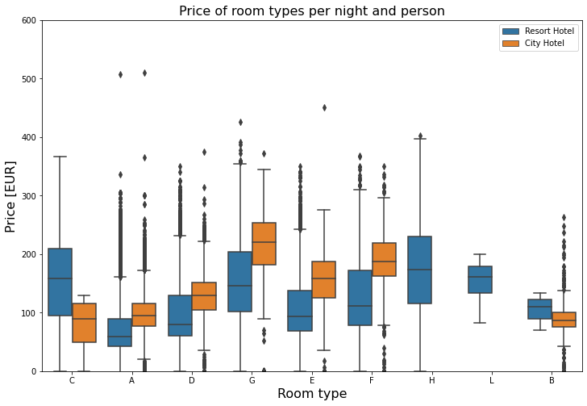
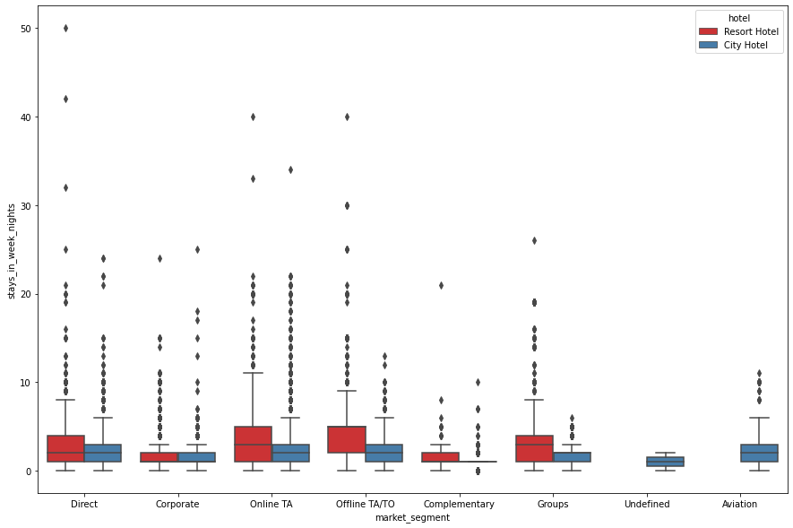
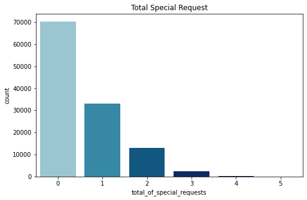
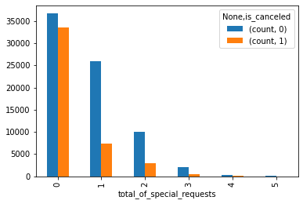
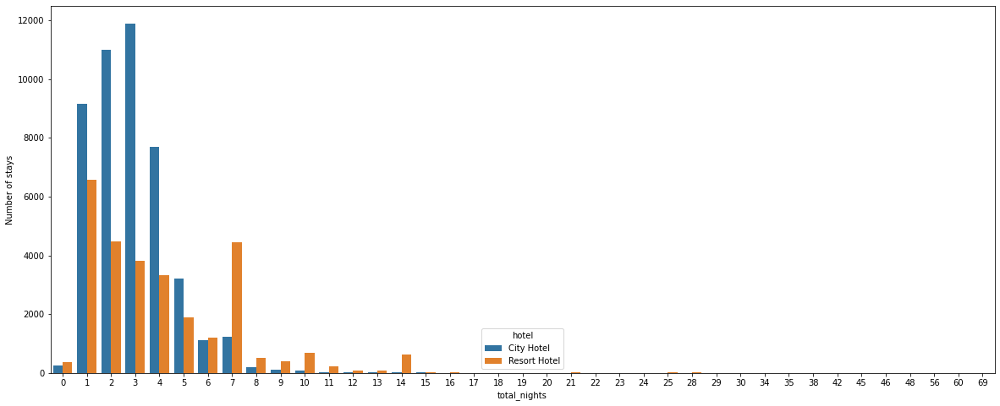
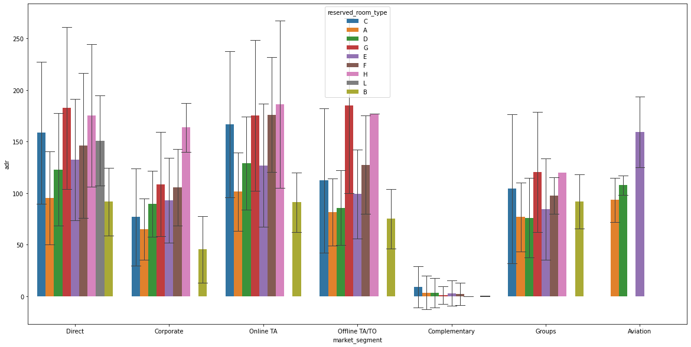
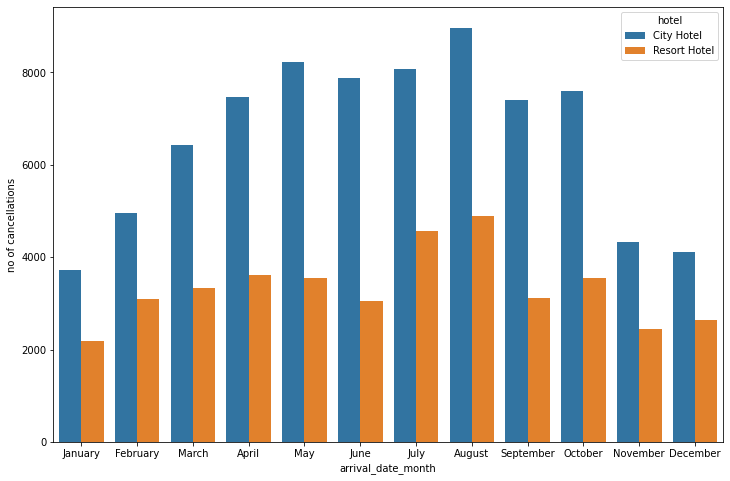

#### https://www.kaggle.com/marcuswingen/eda-of-bookings-and-ml-to-predict-cancelations


```python
import pandas as pd
import numpy as np
import matplotlib.pyplot as plt
import seaborn as sns
```


```python
df = pd.read_csv('/content/hotel_bookings.csv')
df.head()
```


<div>
<style scoped>
    .dataframe tbody tr th:only-of-type {
        vertical-align: middle;
    }

    .dataframe tbody tr th {
        vertical-align: top;
    }

    .dataframe thead th {
        text-align: right;
    }
</style>
<table border="1" class="dataframe">
  <thead>
    <tr style="text-align: right;">
      <th></th>
      <th>hotel</th>
      <th>is_canceled</th>
      <th>lead_time</th>
      <th>arrival_date_year</th>
      <th>arrival_date_month</th>
      <th>arrival_date_week_number</th>
      <th>arrival_date_day_of_month</th>
      <th>stays_in_weekend_nights</th>
      <th>stays_in_week_nights</th>
      <th>adults</th>
      <th>...</th>
      <th>deposit_type</th>
      <th>agent</th>
      <th>company</th>
      <th>days_in_waiting_list</th>
      <th>customer_type</th>
      <th>adr</th>
      <th>required_car_parking_spaces</th>
      <th>total_of_special_requests</th>
      <th>reservation_status</th>
      <th>reservation_status_date</th>
    </tr>
  </thead>
  <tbody>
    <tr>
      <th>0</th>
      <td>Resort Hotel</td>
      <td>0</td>
      <td>342</td>
      <td>2015</td>
      <td>July</td>
      <td>27</td>
      <td>1</td>
      <td>0</td>
      <td>0</td>
      <td>2</td>
      <td>...</td>
      <td>No Deposit</td>
      <td>NaN</td>
      <td>NaN</td>
      <td>0</td>
      <td>Transient</td>
      <td>0.0</td>
      <td>0</td>
      <td>0</td>
      <td>Check-Out</td>
      <td>7/1/2015</td>
    </tr>
    <tr>
      <th>1</th>
      <td>Resort Hotel</td>
      <td>0</td>
      <td>737</td>
      <td>2015</td>
      <td>July</td>
      <td>27</td>
      <td>1</td>
      <td>0</td>
      <td>0</td>
      <td>2</td>
      <td>...</td>
      <td>No Deposit</td>
      <td>NaN</td>
      <td>NaN</td>
      <td>0</td>
      <td>Transient</td>
      <td>0.0</td>
      <td>0</td>
      <td>0</td>
      <td>Check-Out</td>
      <td>7/1/2015</td>
    </tr>
    <tr>
      <th>2</th>
      <td>Resort Hotel</td>
      <td>0</td>
      <td>7</td>
      <td>2015</td>
      <td>July</td>
      <td>27</td>
      <td>1</td>
      <td>0</td>
      <td>1</td>
      <td>1</td>
      <td>...</td>
      <td>No Deposit</td>
      <td>NaN</td>
      <td>NaN</td>
      <td>0</td>
      <td>Transient</td>
      <td>75.0</td>
      <td>0</td>
      <td>0</td>
      <td>Check-Out</td>
      <td>7/2/2015</td>
    </tr>
    <tr>
      <th>3</th>
      <td>Resort Hotel</td>
      <td>0</td>
      <td>13</td>
      <td>2015</td>
      <td>July</td>
      <td>27</td>
      <td>1</td>
      <td>0</td>
      <td>1</td>
      <td>1</td>
      <td>...</td>
      <td>No Deposit</td>
      <td>304.0</td>
      <td>NaN</td>
      <td>0</td>
      <td>Transient</td>
      <td>75.0</td>
      <td>0</td>
      <td>0</td>
      <td>Check-Out</td>
      <td>7/2/2015</td>
    </tr>
    <tr>
      <th>4</th>
      <td>Resort Hotel</td>
      <td>0</td>
      <td>14</td>
      <td>2015</td>
      <td>July</td>
      <td>27</td>
      <td>1</td>
      <td>0</td>
      <td>2</td>
      <td>2</td>
      <td>...</td>
      <td>No Deposit</td>
      <td>240.0</td>
      <td>NaN</td>
      <td>0</td>
      <td>Transient</td>
      <td>98.0</td>
      <td>0</td>
      <td>1</td>
      <td>Check-Out</td>
      <td>7/3/2015</td>
    </tr>
  </tbody>
</table>
<p>5 rows × 32 columns</p>
</div>


```python
df.shape
```


    (119390, 32)


```python
df.columns
```


    Index(['hotel', 'is_canceled', 'lead_time', 'arrival_date_year',
           'arrival_date_month', 'arrival_date_week_number',
           'arrival_date_day_of_month', 'stays_in_weekend_nights',
           'stays_in_week_nights', 'adults', 'children', 'babies', 'meal',
           'country', 'market_segment', 'distribution_channel',
           'is_repeated_guest', 'previous_cancellations',
           'previous_bookings_not_canceled', 'reserved_room_type',
           'assigned_room_type', 'booking_changes', 'deposit_type', 'agent',
           'company', 'days_in_waiting_list', 'customer_type', 'adr',
           'required_car_parking_spaces', 'total_of_special_requests',
           'reservation_status', 'reservation_status_date'],
          dtype='object')


```python
df.isnull().values.any()
```


    True


```python
df.isnull().sum()
```


    hotel                                  0
    is_canceled                            0
    lead_time                              0
    arrival_date_year                      0
    arrival_date_month                     0
    arrival_date_week_number               0
    arrival_date_day_of_month              0
    stays_in_weekend_nights                0
    stays_in_week_nights                   0
    adults                                 0
    children                               4
    babies                                 0
    meal                                   0
    country                              488
    market_segment                         0
    distribution_channel                   0
    is_repeated_guest                      0
    previous_cancellations                 0
    previous_bookings_not_canceled         0
    reserved_room_type                     0
    assigned_room_type                     0
    booking_changes                        0
    deposit_type                           0
    agent                              16340
    company                           112593
    days_in_waiting_list                   0
    customer_type                          0
    adr                                    0
    required_car_parking_spaces            0
    total_of_special_requests              0
    reservation_status                     0
    reservation_status_date                0
    dtype: int64


# Replace missing values:
# agent: If no agency is given, booking was most likely made without one.
# company: If none given, it was most likely private.
# rest schould be self-explanatory.


```python
df.fillna(0, inplace=True)
```


```python
df.isnull().sum()
```


    hotel                             0
    is_canceled                       0
    lead_time                         0
    arrival_date_year                 0
    arrival_date_month                0
    arrival_date_week_number          0
    arrival_date_day_of_month         0
    stays_in_weekend_nights           0
    stays_in_week_nights              0
    adults                            0
    children                          0
    babies                            0
    meal                              0
    country                           0
    market_segment                    0
    distribution_channel              0
    is_repeated_guest                 0
    previous_cancellations            0
    previous_bookings_not_canceled    0
    reserved_room_type                0
    assigned_room_type                0
    booking_changes                   0
    deposit_type                      0
    agent                             0
    company                           0
    days_in_waiting_list              0
    customer_type                     0
    adr                               0
    required_car_parking_spaces       0
    total_of_special_requests         0
    reservation_status                0
    reservation_status_date           0
    dtype: int64


```python
df['meal'].value_counts()
```


    BB           92310
    HB           14463
    SC           10650
    Undefined     1169
    FB             798
    Name: meal, dtype: int64


```python
df['children'].unique()
```


    array([ 0.,  1.,  2., 10.,  3.])


```python
df['adults'].unique()
```


    array([ 2,  1,  3,  4, 40, 26, 50, 27, 55,  0, 20,  6,  5, 10],
          dtype=int64)


```python
df['babies'].unique()
```


    array([ 0,  1,  2, 10,  9], dtype=int64)


### seems to have some dirtiness in data as Adults,babies & children cant be zero at a same time 


```python
df.shape
```


    (119390, 32)


```python
len(df[df['adults'] == 0])
```


    403


```python
filter = (df['children'] == 0) & (df['adults'] == 0) & (df['babies'] == 0)
df[filter]
```


<div>
<style scoped>
    .dataframe tbody tr th:only-of-type {
        vertical-align: middle;
    }

    .dataframe tbody tr th {
        vertical-align: top;
    }

    .dataframe thead th {
        text-align: right;
    }
</style>
<table border="1" class="dataframe">
  <thead>
    <tr style="text-align: right;">
      <th></th>
      <th>hotel</th>
      <th>is_canceled</th>
      <th>lead_time</th>
      <th>arrival_date_year</th>
      <th>arrival_date_month</th>
      <th>arrival_date_week_number</th>
      <th>arrival_date_day_of_month</th>
      <th>stays_in_weekend_nights</th>
      <th>stays_in_week_nights</th>
      <th>adults</th>
      <th>...</th>
      <th>deposit_type</th>
      <th>agent</th>
      <th>company</th>
      <th>days_in_waiting_list</th>
      <th>customer_type</th>
      <th>adr</th>
      <th>required_car_parking_spaces</th>
      <th>total_of_special_requests</th>
      <th>reservation_status</th>
      <th>reservation_status_date</th>
    </tr>
  </thead>
  <tbody>
    <tr>
      <th>2224</th>
      <td>Resort Hotel</td>
      <td>0</td>
      <td>1</td>
      <td>2015</td>
      <td>October</td>
      <td>41</td>
      <td>6</td>
      <td>0</td>
      <td>3</td>
      <td>0</td>
      <td>...</td>
      <td>No Deposit</td>
      <td>0.0</td>
      <td>174.0</td>
      <td>0</td>
      <td>Transient-Party</td>
      <td>0.00</td>
      <td>0</td>
      <td>0</td>
      <td>Check-Out</td>
      <td>10/6/2015</td>
    </tr>
    <tr>
      <th>2409</th>
      <td>Resort Hotel</td>
      <td>0</td>
      <td>0</td>
      <td>2015</td>
      <td>October</td>
      <td>42</td>
      <td>12</td>
      <td>0</td>
      <td>0</td>
      <td>0</td>
      <td>...</td>
      <td>No Deposit</td>
      <td>0.0</td>
      <td>174.0</td>
      <td>0</td>
      <td>Transient</td>
      <td>0.00</td>
      <td>0</td>
      <td>0</td>
      <td>Check-Out</td>
      <td>10/12/2015</td>
    </tr>
    <tr>
      <th>3181</th>
      <td>Resort Hotel</td>
      <td>0</td>
      <td>36</td>
      <td>2015</td>
      <td>November</td>
      <td>47</td>
      <td>20</td>
      <td>1</td>
      <td>2</td>
      <td>0</td>
      <td>...</td>
      <td>No Deposit</td>
      <td>38.0</td>
      <td>0.0</td>
      <td>0</td>
      <td>Transient-Party</td>
      <td>0.00</td>
      <td>0</td>
      <td>0</td>
      <td>Check-Out</td>
      <td>11/23/2015</td>
    </tr>
    <tr>
      <th>3684</th>
      <td>Resort Hotel</td>
      <td>0</td>
      <td>165</td>
      <td>2015</td>
      <td>December</td>
      <td>53</td>
      <td>30</td>
      <td>1</td>
      <td>4</td>
      <td>0</td>
      <td>...</td>
      <td>No Deposit</td>
      <td>308.0</td>
      <td>0.0</td>
      <td>122</td>
      <td>Transient-Party</td>
      <td>0.00</td>
      <td>0</td>
      <td>0</td>
      <td>Check-Out</td>
      <td>1/4/2016</td>
    </tr>
    <tr>
      <th>3708</th>
      <td>Resort Hotel</td>
      <td>0</td>
      <td>165</td>
      <td>2015</td>
      <td>December</td>
      <td>53</td>
      <td>30</td>
      <td>2</td>
      <td>4</td>
      <td>0</td>
      <td>...</td>
      <td>No Deposit</td>
      <td>308.0</td>
      <td>0.0</td>
      <td>122</td>
      <td>Transient-Party</td>
      <td>0.00</td>
      <td>0</td>
      <td>0</td>
      <td>Check-Out</td>
      <td>1/5/2016</td>
    </tr>
    <tr>
      <th>...</th>
      <td>...</td>
      <td>...</td>
      <td>...</td>
      <td>...</td>
      <td>...</td>
      <td>...</td>
      <td>...</td>
      <td>...</td>
      <td>...</td>
      <td>...</td>
      <td>...</td>
      <td>...</td>
      <td>...</td>
      <td>...</td>
      <td>...</td>
      <td>...</td>
      <td>...</td>
      <td>...</td>
      <td>...</td>
      <td>...</td>
      <td>...</td>
    </tr>
    <tr>
      <th>115029</th>
      <td>City Hotel</td>
      <td>0</td>
      <td>107</td>
      <td>2017</td>
      <td>June</td>
      <td>26</td>
      <td>27</td>
      <td>0</td>
      <td>3</td>
      <td>0</td>
      <td>...</td>
      <td>No Deposit</td>
      <td>7.0</td>
      <td>0.0</td>
      <td>0</td>
      <td>Transient</td>
      <td>100.80</td>
      <td>0</td>
      <td>0</td>
      <td>Check-Out</td>
      <td>6/30/2017</td>
    </tr>
    <tr>
      <th>115091</th>
      <td>City Hotel</td>
      <td>0</td>
      <td>1</td>
      <td>2017</td>
      <td>June</td>
      <td>26</td>
      <td>30</td>
      <td>0</td>
      <td>1</td>
      <td>0</td>
      <td>...</td>
      <td>No Deposit</td>
      <td>0.0</td>
      <td>0.0</td>
      <td>0</td>
      <td>Transient</td>
      <td>0.00</td>
      <td>1</td>
      <td>1</td>
      <td>Check-Out</td>
      <td>7/1/2017</td>
    </tr>
    <tr>
      <th>116251</th>
      <td>City Hotel</td>
      <td>0</td>
      <td>44</td>
      <td>2017</td>
      <td>July</td>
      <td>28</td>
      <td>15</td>
      <td>1</td>
      <td>1</td>
      <td>0</td>
      <td>...</td>
      <td>No Deposit</td>
      <td>425.0</td>
      <td>0.0</td>
      <td>0</td>
      <td>Transient</td>
      <td>73.80</td>
      <td>0</td>
      <td>0</td>
      <td>Check-Out</td>
      <td>7/17/2017</td>
    </tr>
    <tr>
      <th>116534</th>
      <td>City Hotel</td>
      <td>0</td>
      <td>2</td>
      <td>2017</td>
      <td>July</td>
      <td>28</td>
      <td>15</td>
      <td>2</td>
      <td>5</td>
      <td>0</td>
      <td>...</td>
      <td>No Deposit</td>
      <td>9.0</td>
      <td>0.0</td>
      <td>0</td>
      <td>Transient-Party</td>
      <td>22.86</td>
      <td>0</td>
      <td>1</td>
      <td>Check-Out</td>
      <td>7/22/2017</td>
    </tr>
    <tr>
      <th>117087</th>
      <td>City Hotel</td>
      <td>0</td>
      <td>170</td>
      <td>2017</td>
      <td>July</td>
      <td>30</td>
      <td>27</td>
      <td>0</td>
      <td>2</td>
      <td>0</td>
      <td>...</td>
      <td>No Deposit</td>
      <td>52.0</td>
      <td>0.0</td>
      <td>0</td>
      <td>Transient</td>
      <td>0.00</td>
      <td>0</td>
      <td>0</td>
      <td>Check-Out</td>
      <td>7/29/2017</td>
    </tr>
  </tbody>
</table>
<p>180 rows × 32 columns</p>
</div>


### Visualise Entire Dataframe where adult,children & babies are 0


```python
pd.set_option('display.max_columns', 32)
filter = (df['children'] == 0) & (df['adults'] == 0) & (df['babies'] == 0)
df[filter]
```


<div>
<style scoped>
    .dataframe tbody tr th:only-of-type {
        vertical-align: middle;
    }

    .dataframe tbody tr th {
        vertical-align: top;
    }

    .dataframe thead th {
        text-align: right;
    }
</style>
<table border="1" class="dataframe">
  <thead>
    <tr style="text-align: right;">
      <th></th>
      <th>hotel</th>
      <th>is_canceled</th>
      <th>lead_time</th>
      <th>arrival_date_year</th>
      <th>arrival_date_month</th>
      <th>arrival_date_week_number</th>
      <th>arrival_date_day_of_month</th>
      <th>stays_in_weekend_nights</th>
      <th>stays_in_week_nights</th>
      <th>adults</th>
      <th>children</th>
      <th>babies</th>
      <th>meal</th>
      <th>country</th>
      <th>market_segment</th>
      <th>distribution_channel</th>
      <th>is_repeated_guest</th>
      <th>previous_cancellations</th>
      <th>previous_bookings_not_canceled</th>
      <th>reserved_room_type</th>
      <th>assigned_room_type</th>
      <th>booking_changes</th>
      <th>deposit_type</th>
      <th>agent</th>
      <th>company</th>
      <th>days_in_waiting_list</th>
      <th>customer_type</th>
      <th>adr</th>
      <th>required_car_parking_spaces</th>
      <th>total_of_special_requests</th>
      <th>reservation_status</th>
      <th>reservation_status_date</th>
    </tr>
  </thead>
  <tbody>
    <tr>
      <th>2224</th>
      <td>Resort Hotel</td>
      <td>0</td>
      <td>1</td>
      <td>2015</td>
      <td>October</td>
      <td>41</td>
      <td>6</td>
      <td>0</td>
      <td>3</td>
      <td>0</td>
      <td>0.0</td>
      <td>0</td>
      <td>SC</td>
      <td>PRT</td>
      <td>Corporate</td>
      <td>Corporate</td>
      <td>0</td>
      <td>0</td>
      <td>0</td>
      <td>A</td>
      <td>I</td>
      <td>1</td>
      <td>No Deposit</td>
      <td>0.0</td>
      <td>174.0</td>
      <td>0</td>
      <td>Transient-Party</td>
      <td>0.00</td>
      <td>0</td>
      <td>0</td>
      <td>Check-Out</td>
      <td>10/6/2015</td>
    </tr>
    <tr>
      <th>2409</th>
      <td>Resort Hotel</td>
      <td>0</td>
      <td>0</td>
      <td>2015</td>
      <td>October</td>
      <td>42</td>
      <td>12</td>
      <td>0</td>
      <td>0</td>
      <td>0</td>
      <td>0.0</td>
      <td>0</td>
      <td>SC</td>
      <td>PRT</td>
      <td>Corporate</td>
      <td>Corporate</td>
      <td>0</td>
      <td>0</td>
      <td>0</td>
      <td>A</td>
      <td>I</td>
      <td>0</td>
      <td>No Deposit</td>
      <td>0.0</td>
      <td>174.0</td>
      <td>0</td>
      <td>Transient</td>
      <td>0.00</td>
      <td>0</td>
      <td>0</td>
      <td>Check-Out</td>
      <td>10/12/2015</td>
    </tr>
    <tr>
      <th>3181</th>
      <td>Resort Hotel</td>
      <td>0</td>
      <td>36</td>
      <td>2015</td>
      <td>November</td>
      <td>47</td>
      <td>20</td>
      <td>1</td>
      <td>2</td>
      <td>0</td>
      <td>0.0</td>
      <td>0</td>
      <td>SC</td>
      <td>ESP</td>
      <td>Groups</td>
      <td>TA/TO</td>
      <td>0</td>
      <td>0</td>
      <td>0</td>
      <td>A</td>
      <td>C</td>
      <td>0</td>
      <td>No Deposit</td>
      <td>38.0</td>
      <td>0.0</td>
      <td>0</td>
      <td>Transient-Party</td>
      <td>0.00</td>
      <td>0</td>
      <td>0</td>
      <td>Check-Out</td>
      <td>11/23/2015</td>
    </tr>
    <tr>
      <th>3684</th>
      <td>Resort Hotel</td>
      <td>0</td>
      <td>165</td>
      <td>2015</td>
      <td>December</td>
      <td>53</td>
      <td>30</td>
      <td>1</td>
      <td>4</td>
      <td>0</td>
      <td>0.0</td>
      <td>0</td>
      <td>SC</td>
      <td>PRT</td>
      <td>Groups</td>
      <td>TA/TO</td>
      <td>0</td>
      <td>0</td>
      <td>0</td>
      <td>A</td>
      <td>A</td>
      <td>1</td>
      <td>No Deposit</td>
      <td>308.0</td>
      <td>0.0</td>
      <td>122</td>
      <td>Transient-Party</td>
      <td>0.00</td>
      <td>0</td>
      <td>0</td>
      <td>Check-Out</td>
      <td>1/4/2016</td>
    </tr>
    <tr>
      <th>3708</th>
      <td>Resort Hotel</td>
      <td>0</td>
      <td>165</td>
      <td>2015</td>
      <td>December</td>
      <td>53</td>
      <td>30</td>
      <td>2</td>
      <td>4</td>
      <td>0</td>
      <td>0.0</td>
      <td>0</td>
      <td>SC</td>
      <td>PRT</td>
      <td>Groups</td>
      <td>TA/TO</td>
      <td>0</td>
      <td>0</td>
      <td>0</td>
      <td>A</td>
      <td>C</td>
      <td>1</td>
      <td>No Deposit</td>
      <td>308.0</td>
      <td>0.0</td>
      <td>122</td>
      <td>Transient-Party</td>
      <td>0.00</td>
      <td>0</td>
      <td>0</td>
      <td>Check-Out</td>
      <td>1/5/2016</td>
    </tr>
    <tr>
      <th>...</th>
      <td>...</td>
      <td>...</td>
      <td>...</td>
      <td>...</td>
      <td>...</td>
      <td>...</td>
      <td>...</td>
      <td>...</td>
      <td>...</td>
      <td>...</td>
      <td>...</td>
      <td>...</td>
      <td>...</td>
      <td>...</td>
      <td>...</td>
      <td>...</td>
      <td>...</td>
      <td>...</td>
      <td>...</td>
      <td>...</td>
      <td>...</td>
      <td>...</td>
      <td>...</td>
      <td>...</td>
      <td>...</td>
      <td>...</td>
      <td>...</td>
      <td>...</td>
      <td>...</td>
      <td>...</td>
      <td>...</td>
      <td>...</td>
    </tr>
    <tr>
      <th>115029</th>
      <td>City Hotel</td>
      <td>0</td>
      <td>107</td>
      <td>2017</td>
      <td>June</td>
      <td>26</td>
      <td>27</td>
      <td>0</td>
      <td>3</td>
      <td>0</td>
      <td>0.0</td>
      <td>0</td>
      <td>BB</td>
      <td>CHE</td>
      <td>Online TA</td>
      <td>TA/TO</td>
      <td>0</td>
      <td>0</td>
      <td>0</td>
      <td>A</td>
      <td>A</td>
      <td>1</td>
      <td>No Deposit</td>
      <td>7.0</td>
      <td>0.0</td>
      <td>0</td>
      <td>Transient</td>
      <td>100.80</td>
      <td>0</td>
      <td>0</td>
      <td>Check-Out</td>
      <td>6/30/2017</td>
    </tr>
    <tr>
      <th>115091</th>
      <td>City Hotel</td>
      <td>0</td>
      <td>1</td>
      <td>2017</td>
      <td>June</td>
      <td>26</td>
      <td>30</td>
      <td>0</td>
      <td>1</td>
      <td>0</td>
      <td>0.0</td>
      <td>0</td>
      <td>SC</td>
      <td>PRT</td>
      <td>Complementary</td>
      <td>Direct</td>
      <td>0</td>
      <td>0</td>
      <td>0</td>
      <td>E</td>
      <td>K</td>
      <td>0</td>
      <td>No Deposit</td>
      <td>0.0</td>
      <td>0.0</td>
      <td>0</td>
      <td>Transient</td>
      <td>0.00</td>
      <td>1</td>
      <td>1</td>
      <td>Check-Out</td>
      <td>7/1/2017</td>
    </tr>
    <tr>
      <th>116251</th>
      <td>City Hotel</td>
      <td>0</td>
      <td>44</td>
      <td>2017</td>
      <td>July</td>
      <td>28</td>
      <td>15</td>
      <td>1</td>
      <td>1</td>
      <td>0</td>
      <td>0.0</td>
      <td>0</td>
      <td>SC</td>
      <td>SWE</td>
      <td>Online TA</td>
      <td>TA/TO</td>
      <td>0</td>
      <td>0</td>
      <td>0</td>
      <td>A</td>
      <td>K</td>
      <td>2</td>
      <td>No Deposit</td>
      <td>425.0</td>
      <td>0.0</td>
      <td>0</td>
      <td>Transient</td>
      <td>73.80</td>
      <td>0</td>
      <td>0</td>
      <td>Check-Out</td>
      <td>7/17/2017</td>
    </tr>
    <tr>
      <th>116534</th>
      <td>City Hotel</td>
      <td>0</td>
      <td>2</td>
      <td>2017</td>
      <td>July</td>
      <td>28</td>
      <td>15</td>
      <td>2</td>
      <td>5</td>
      <td>0</td>
      <td>0.0</td>
      <td>0</td>
      <td>SC</td>
      <td>RUS</td>
      <td>Online TA</td>
      <td>TA/TO</td>
      <td>0</td>
      <td>0</td>
      <td>0</td>
      <td>A</td>
      <td>K</td>
      <td>1</td>
      <td>No Deposit</td>
      <td>9.0</td>
      <td>0.0</td>
      <td>0</td>
      <td>Transient-Party</td>
      <td>22.86</td>
      <td>0</td>
      <td>1</td>
      <td>Check-Out</td>
      <td>7/22/2017</td>
    </tr>
    <tr>
      <th>117087</th>
      <td>City Hotel</td>
      <td>0</td>
      <td>170</td>
      <td>2017</td>
      <td>July</td>
      <td>30</td>
      <td>27</td>
      <td>0</td>
      <td>2</td>
      <td>0</td>
      <td>0.0</td>
      <td>0</td>
      <td>BB</td>
      <td>BRA</td>
      <td>Offline TA/TO</td>
      <td>TA/TO</td>
      <td>0</td>
      <td>0</td>
      <td>0</td>
      <td>A</td>
      <td>A</td>
      <td>0</td>
      <td>No Deposit</td>
      <td>52.0</td>
      <td>0.0</td>
      <td>0</td>
      <td>Transient</td>
      <td>0.00</td>
      <td>0</td>
      <td>0</td>
      <td>Check-Out</td>
      <td>7/29/2017</td>
    </tr>
  </tbody>
</table>
<p>180 rows × 32 columns</p>
</div>


```python
data = df[~filter]
data.shape
```


    (119210, 32)


```python
data.head()
```


<div>
<style scoped>
    .dataframe tbody tr th:only-of-type {
        vertical-align: middle;
    }

    .dataframe tbody tr th {
        vertical-align: top;
    }

    .dataframe thead th {
        text-align: right;
    }
</style>
<table border="1" class="dataframe">
  <thead>
    <tr style="text-align: right;">
      <th></th>
      <th>hotel</th>
      <th>is_canceled</th>
      <th>lead_time</th>
      <th>arrival_date_year</th>
      <th>arrival_date_month</th>
      <th>arrival_date_week_number</th>
      <th>arrival_date_day_of_month</th>
      <th>stays_in_weekend_nights</th>
      <th>stays_in_week_nights</th>
      <th>adults</th>
      <th>children</th>
      <th>babies</th>
      <th>meal</th>
      <th>country</th>
      <th>market_segment</th>
      <th>distribution_channel</th>
      <th>is_repeated_guest</th>
      <th>previous_cancellations</th>
      <th>previous_bookings_not_canceled</th>
      <th>reserved_room_type</th>
      <th>assigned_room_type</th>
      <th>booking_changes</th>
      <th>deposit_type</th>
      <th>agent</th>
      <th>company</th>
      <th>days_in_waiting_list</th>
      <th>customer_type</th>
      <th>adr</th>
      <th>required_car_parking_spaces</th>
      <th>total_of_special_requests</th>
      <th>reservation_status</th>
      <th>reservation_status_date</th>
    </tr>
  </thead>
  <tbody>
    <tr>
      <th>0</th>
      <td>Resort Hotel</td>
      <td>0</td>
      <td>342</td>
      <td>2015</td>
      <td>July</td>
      <td>27</td>
      <td>1</td>
      <td>0</td>
      <td>0</td>
      <td>2</td>
      <td>0.0</td>
      <td>0</td>
      <td>BB</td>
      <td>PRT</td>
      <td>Direct</td>
      <td>Direct</td>
      <td>0</td>
      <td>0</td>
      <td>0</td>
      <td>C</td>
      <td>C</td>
      <td>3</td>
      <td>No Deposit</td>
      <td>0.0</td>
      <td>0.0</td>
      <td>0</td>
      <td>Transient</td>
      <td>0.0</td>
      <td>0</td>
      <td>0</td>
      <td>Check-Out</td>
      <td>7/1/2015</td>
    </tr>
    <tr>
      <th>1</th>
      <td>Resort Hotel</td>
      <td>0</td>
      <td>737</td>
      <td>2015</td>
      <td>July</td>
      <td>27</td>
      <td>1</td>
      <td>0</td>
      <td>0</td>
      <td>2</td>
      <td>0.0</td>
      <td>0</td>
      <td>BB</td>
      <td>PRT</td>
      <td>Direct</td>
      <td>Direct</td>
      <td>0</td>
      <td>0</td>
      <td>0</td>
      <td>C</td>
      <td>C</td>
      <td>4</td>
      <td>No Deposit</td>
      <td>0.0</td>
      <td>0.0</td>
      <td>0</td>
      <td>Transient</td>
      <td>0.0</td>
      <td>0</td>
      <td>0</td>
      <td>Check-Out</td>
      <td>7/1/2015</td>
    </tr>
    <tr>
      <th>2</th>
      <td>Resort Hotel</td>
      <td>0</td>
      <td>7</td>
      <td>2015</td>
      <td>July</td>
      <td>27</td>
      <td>1</td>
      <td>0</td>
      <td>1</td>
      <td>1</td>
      <td>0.0</td>
      <td>0</td>
      <td>BB</td>
      <td>GBR</td>
      <td>Direct</td>
      <td>Direct</td>
      <td>0</td>
      <td>0</td>
      <td>0</td>
      <td>A</td>
      <td>C</td>
      <td>0</td>
      <td>No Deposit</td>
      <td>0.0</td>
      <td>0.0</td>
      <td>0</td>
      <td>Transient</td>
      <td>75.0</td>
      <td>0</td>
      <td>0</td>
      <td>Check-Out</td>
      <td>7/2/2015</td>
    </tr>
    <tr>
      <th>3</th>
      <td>Resort Hotel</td>
      <td>0</td>
      <td>13</td>
      <td>2015</td>
      <td>July</td>
      <td>27</td>
      <td>1</td>
      <td>0</td>
      <td>1</td>
      <td>1</td>
      <td>0.0</td>
      <td>0</td>
      <td>BB</td>
      <td>GBR</td>
      <td>Corporate</td>
      <td>Corporate</td>
      <td>0</td>
      <td>0</td>
      <td>0</td>
      <td>A</td>
      <td>A</td>
      <td>0</td>
      <td>No Deposit</td>
      <td>304.0</td>
      <td>0.0</td>
      <td>0</td>
      <td>Transient</td>
      <td>75.0</td>
      <td>0</td>
      <td>0</td>
      <td>Check-Out</td>
      <td>7/2/2015</td>
    </tr>
    <tr>
      <th>4</th>
      <td>Resort Hotel</td>
      <td>0</td>
      <td>14</td>
      <td>2015</td>
      <td>July</td>
      <td>27</td>
      <td>1</td>
      <td>0</td>
      <td>2</td>
      <td>2</td>
      <td>0.0</td>
      <td>0</td>
      <td>BB</td>
      <td>GBR</td>
      <td>Online TA</td>
      <td>TA/TO</td>
      <td>0</td>
      <td>0</td>
      <td>0</td>
      <td>A</td>
      <td>A</td>
      <td>0</td>
      <td>No Deposit</td>
      <td>240.0</td>
      <td>0.0</td>
      <td>0</td>
      <td>Transient</td>
      <td>98.0</td>
      <td>0</td>
      <td>1</td>
      <td>Check-Out</td>
      <td>7/3/2015</td>
    </tr>
  </tbody>
</table>
</div>


#### After cleaning, separate Resort and City hotel


```python
resort = data[(data["hotel"] == "Resort Hotel") & (data["is_canceled"] == 0)]
city = data[(data["hotel"] == "City Hotel") & (data["is_canceled"] == 0)]

resort.shape
```


    (28927, 32)


```python
city.shape
```


    (46084, 32)


## Where do the guests come from?


```python
resort.head()
```


<div>
<style scoped>
    .dataframe tbody tr th:only-of-type {
        vertical-align: middle;
    }

    .dataframe tbody tr th {
        vertical-align: top;
    }

    .dataframe thead th {
        text-align: right;
    }
</style>
<table border="1" class="dataframe">
  <thead>
    <tr style="text-align: right;">
      <th></th>
      <th>hotel</th>
      <th>is_canceled</th>
      <th>lead_time</th>
      <th>arrival_date_year</th>
      <th>arrival_date_month</th>
      <th>arrival_date_week_number</th>
      <th>arrival_date_day_of_month</th>
      <th>stays_in_weekend_nights</th>
      <th>stays_in_week_nights</th>
      <th>adults</th>
      <th>children</th>
      <th>babies</th>
      <th>meal</th>
      <th>country</th>
      <th>market_segment</th>
      <th>distribution_channel</th>
      <th>is_repeated_guest</th>
      <th>previous_cancellations</th>
      <th>previous_bookings_not_canceled</th>
      <th>reserved_room_type</th>
      <th>assigned_room_type</th>
      <th>booking_changes</th>
      <th>deposit_type</th>
      <th>agent</th>
      <th>company</th>
      <th>days_in_waiting_list</th>
      <th>customer_type</th>
      <th>adr</th>
      <th>required_car_parking_spaces</th>
      <th>total_of_special_requests</th>
      <th>reservation_status</th>
      <th>reservation_status_date</th>
    </tr>
  </thead>
  <tbody>
    <tr>
      <th>0</th>
      <td>Resort Hotel</td>
      <td>0</td>
      <td>342</td>
      <td>2015</td>
      <td>July</td>
      <td>27</td>
      <td>1</td>
      <td>0</td>
      <td>0</td>
      <td>2</td>
      <td>0.0</td>
      <td>0</td>
      <td>BB</td>
      <td>PRT</td>
      <td>Direct</td>
      <td>Direct</td>
      <td>0</td>
      <td>0</td>
      <td>0</td>
      <td>C</td>
      <td>C</td>
      <td>3</td>
      <td>No Deposit</td>
      <td>0.0</td>
      <td>0.0</td>
      <td>0</td>
      <td>Transient</td>
      <td>0.0</td>
      <td>0</td>
      <td>0</td>
      <td>Check-Out</td>
      <td>7/1/2015</td>
    </tr>
    <tr>
      <th>1</th>
      <td>Resort Hotel</td>
      <td>0</td>
      <td>737</td>
      <td>2015</td>
      <td>July</td>
      <td>27</td>
      <td>1</td>
      <td>0</td>
      <td>0</td>
      <td>2</td>
      <td>0.0</td>
      <td>0</td>
      <td>BB</td>
      <td>PRT</td>
      <td>Direct</td>
      <td>Direct</td>
      <td>0</td>
      <td>0</td>
      <td>0</td>
      <td>C</td>
      <td>C</td>
      <td>4</td>
      <td>No Deposit</td>
      <td>0.0</td>
      <td>0.0</td>
      <td>0</td>
      <td>Transient</td>
      <td>0.0</td>
      <td>0</td>
      <td>0</td>
      <td>Check-Out</td>
      <td>7/1/2015</td>
    </tr>
    <tr>
      <th>2</th>
      <td>Resort Hotel</td>
      <td>0</td>
      <td>7</td>
      <td>2015</td>
      <td>July</td>
      <td>27</td>
      <td>1</td>
      <td>0</td>
      <td>1</td>
      <td>1</td>
      <td>0.0</td>
      <td>0</td>
      <td>BB</td>
      <td>GBR</td>
      <td>Direct</td>
      <td>Direct</td>
      <td>0</td>
      <td>0</td>
      <td>0</td>
      <td>A</td>
      <td>C</td>
      <td>0</td>
      <td>No Deposit</td>
      <td>0.0</td>
      <td>0.0</td>
      <td>0</td>
      <td>Transient</td>
      <td>75.0</td>
      <td>0</td>
      <td>0</td>
      <td>Check-Out</td>
      <td>7/2/2015</td>
    </tr>
    <tr>
      <th>3</th>
      <td>Resort Hotel</td>
      <td>0</td>
      <td>13</td>
      <td>2015</td>
      <td>July</td>
      <td>27</td>
      <td>1</td>
      <td>0</td>
      <td>1</td>
      <td>1</td>
      <td>0.0</td>
      <td>0</td>
      <td>BB</td>
      <td>GBR</td>
      <td>Corporate</td>
      <td>Corporate</td>
      <td>0</td>
      <td>0</td>
      <td>0</td>
      <td>A</td>
      <td>A</td>
      <td>0</td>
      <td>No Deposit</td>
      <td>304.0</td>
      <td>0.0</td>
      <td>0</td>
      <td>Transient</td>
      <td>75.0</td>
      <td>0</td>
      <td>0</td>
      <td>Check-Out</td>
      <td>7/2/2015</td>
    </tr>
    <tr>
      <th>4</th>
      <td>Resort Hotel</td>
      <td>0</td>
      <td>14</td>
      <td>2015</td>
      <td>July</td>
      <td>27</td>
      <td>1</td>
      <td>0</td>
      <td>2</td>
      <td>2</td>
      <td>0.0</td>
      <td>0</td>
      <td>BB</td>
      <td>GBR</td>
      <td>Online TA</td>
      <td>TA/TO</td>
      <td>0</td>
      <td>0</td>
      <td>0</td>
      <td>A</td>
      <td>A</td>
      <td>0</td>
      <td>No Deposit</td>
      <td>240.0</td>
      <td>0.0</td>
      <td>0</td>
      <td>Transient</td>
      <td>98.0</td>
      <td>0</td>
      <td>1</td>
      <td>Check-Out</td>
      <td>7/3/2015</td>
    </tr>
  </tbody>
</table>
</div>


```python
labels=resort['country'].value_counts().index
values=resort['country'].value_counts()
```


```python
import plotly.graph_objs as go
from plotly.offline import iplot
import plotly.express as px
```


```python
trace=go.Pie(labels=labels, values=values,
               hoverinfo='label+percent', textinfo='value'
               )

iplot([trace])
```

## Home country of Guests, perform Spatial Analysis


```python
country_wise_data = data[data['is_canceled'] == 0]['country'].value_counts().reset_index()
country_wise_data.columns = ['country', 'No of guests']
country_wise_data
```


<div>
<style scoped>
    .dataframe tbody tr th:only-of-type {
        vertical-align: middle;
    }

    .dataframe tbody tr th {
        vertical-align: top;
    }

    .dataframe thead th {
        text-align: right;
    }
</style>
<table border="1" class="dataframe">
  <thead>
    <tr style="text-align: right;">
      <th></th>
      <th>country</th>
      <th>No of guests</th>
    </tr>
  </thead>
  <tbody>
    <tr>
      <th>0</th>
      <td>PRT</td>
      <td>20977</td>
    </tr>
    <tr>
      <th>1</th>
      <td>GBR</td>
      <td>9668</td>
    </tr>
    <tr>
      <th>2</th>
      <td>FRA</td>
      <td>8468</td>
    </tr>
    <tr>
      <th>3</th>
      <td>ESP</td>
      <td>6383</td>
    </tr>
    <tr>
      <th>4</th>
      <td>DEU</td>
      <td>6067</td>
    </tr>
    <tr>
      <th>...</th>
      <td>...</td>
      <td>...</td>
    </tr>
    <tr>
      <th>161</th>
      <td>SLE</td>
      <td>1</td>
    </tr>
    <tr>
      <th>162</th>
      <td>AIA</td>
      <td>1</td>
    </tr>
    <tr>
      <th>163</th>
      <td>NPL</td>
      <td>1</td>
    </tr>
    <tr>
      <th>164</th>
      <td>SMR</td>
      <td>1</td>
    </tr>
    <tr>
      <th>165</th>
      <td>NCL</td>
      <td>1</td>
    </tr>
  </tbody>
</table>
<p>166 rows × 2 columns</p>
</div>


```python
import folium
from folium.plugins import HeatMap
```


```python
basemap = folium.Map()
country_wise_data.dtypes
```


    country         object
    No of guests     int64
    dtype: object


```python
# show on map
map_guest = px.choropleth(country_wise_data,
                    locations=country_wise_data['country'],
                    color=country_wise_data['No of guests'], 
                    hover_name=country_wise_data['country'], 
                    title="Home country of guests")
map_guest.show()
```


<div>


            <div id="4ea67244-4937-4d20-a932-64ef50a94342" class="plotly-graph-div" style="height:525px; width:100%;"></div>
            <script type="text/javascript">
                require(["plotly"], function(Plotly) {
                    window.PLOTLYENV=window.PLOTLYENV || {};

                if (document.getElementById("4ea67244-4937-4d20-a932-64ef50a94342")) {
                    Plotly.newPlot(
                        '4ea67244-4937-4d20-a932-64ef50a94342',
                        [{"coloraxis": "coloraxis", "geo": "geo", "hovertemplate": "<b>%{hovertext}</b><br><br>country=%{location}<br>No of guests=%{z}<extra></extra>", "hovertext": ["PRT", "GBR", "FRA", "ESP", "DEU", "IRL", "ITA", "BEL", "NLD", "USA", "BRA", "CHE", "AUT", "CN", "SWE", "POL", "CHN", "ISR", "NOR", 0, "RUS", "FIN", "ROU", "DNK", "AUS", "LUX", "JPN", "ARG", "AGO", "HUN", "MAR", "TUR", "CZE", "IND", "SRB", "GRC", "DZA", "KOR", "MEX", "HRV", "LTU", "NZL", "EST", "BGR", "IRN", "ISL", "ZAF", "CHL", "MOZ", "UKR", "COL", "LVA", "SVN", "THA", "SVK", "CYP", "TWN", "MYS", "PER", "URY", "LBN", "SGP", "EGY", "TUN", "ECU", "CRI", "JOR", "BLR", "PHL", "SAU", "VEN", "IRQ", "KAZ", "OMN", "MLT", "NGA", "CPV", "IDN", "BOL", "BIH", "KWT", "PRI", "CMR", "ALB", "PAN", "LBY", "AZE", "MKD", "CUB", "GNB", "ARE", "GEO", "LKA", "GIB", "DOM", "MUS", "JAM", "VNM", "ARM", "PAK", "SUR", "CAF", "QAT", "CIV", "PRY", "GTM", "KEN", "BRB", "SEN", "BGD", "SYR", "HKG", "MDV", "MCO", "MNE", "LAO", "ABW", "COM", "ETH", "ZWE", "ATA", "STP", "UGA", "GHA", "RWA", "UZB", "TMP", "TZA", "AND", "MWI", "TGO", "GAB", "KNA", "LIE", "SLV", "SDN", "MRT", "LCA", "KIR", "SYC", "BHS", "ASM", "PYF", "DMA", "FRO", "BWA", "PLW", "GUY", "BHR", "ZMB", "BDI", "DJI", "MAC", "MMR", "CYM", "BFA", "MLI", "ATF", "TJK", "MDG", "NAM", "SLE", "AIA", "NPL", "SMR", "NCL"], "locations": ["PRT", "GBR", "FRA", "ESP", "DEU", "IRL", "ITA", "BEL", "NLD", "USA", "BRA", "CHE", "AUT", "CN", "SWE", "POL", "CHN", "ISR", "NOR", 0, "RUS", "FIN", "ROU", "DNK", "AUS", "LUX", "JPN", "ARG", "AGO", "HUN", "MAR", "TUR", "CZE", "IND", "SRB", "GRC", "DZA", "KOR", "MEX", "HRV", "LTU", "NZL", "EST", "BGR", "IRN", "ISL", "ZAF", "CHL", "MOZ", "UKR", "COL", "LVA", "SVN", "THA", "SVK", "CYP", "TWN", "MYS", "PER", "URY", "LBN", "SGP", "EGY", "TUN", "ECU", "CRI", "JOR", "BLR", "PHL", "SAU", "VEN", "IRQ", "KAZ", "OMN", "MLT", "NGA", "CPV", "IDN", "BOL", "BIH", "KWT", "PRI", "CMR", "ALB", "PAN", "LBY", "AZE", "MKD", "CUB", "GNB", "ARE", "GEO", "LKA", "GIB", "DOM", "MUS", "JAM", "VNM", "ARM", "PAK", "SUR", "CAF", "QAT", "CIV", "PRY", "GTM", "KEN", "BRB", "SEN", "BGD", "SYR", "HKG", "MDV", "MCO", "MNE", "LAO", "ABW", "COM", "ETH", "ZWE", "ATA", "STP", "UGA", "GHA", "RWA", "UZB", "TMP", "TZA", "AND", "MWI", "TGO", "GAB", "KNA", "LIE", "SLV", "SDN", "MRT", "LCA", "KIR", "SYC", "BHS", "ASM", "PYF", "DMA", "FRO", "BWA", "PLW", "GUY", "BHR", "ZMB", "BDI", "DJI", "MAC", "MMR", "CYM", "BFA", "MLI", "ATF", "TJK", "MDG", "NAM", "SLE", "AIA", "NPL", "SMR", "NCL"], "name": "", "type": "choropleth", "z": [20977, 9668, 8468, 6383, 6067, 2542, 2428, 1868, 1716, 1592, 1392, 1298, 1033, 1025, 793, 703, 537, 500, 426, 421, 391, 377, 366, 326, 319, 177, 169, 160, 157, 153, 150, 146, 134, 116, 98, 93, 82, 78, 75, 75, 74, 68, 65, 63, 59, 53, 49, 49, 48, 48, 48, 46, 41, 41, 41, 40, 37, 25, 23, 23, 22, 22, 21, 20, 19, 18, 18, 17, 15, 15, 14, 14, 14, 14, 13, 13, 12, 11, 10, 10, 10, 10, 10, 10, 9, 8, 8, 8, 8, 8, 8, 7, 7, 7, 6, 6, 6, 6, 6, 5, 5, 5, 4, 4, 4, 4, 4, 4, 3, 3, 3, 3, 3, 3, 3, 2, 2, 2, 2, 2, 2, 2, 2, 2, 2, 2, 2, 2, 2, 2, 2, 2, 2, 2, 2, 1, 1, 1, 1, 1, 1, 1, 1, 1, 1, 1, 1, 1, 1, 1, 1, 1, 1, 1, 1, 1, 1, 1, 1, 1, 1, 1, 1, 1, 1, 1]}],
                        {"coloraxis": {"colorbar": {"title": {"text": "No of guests"}}, "colorscale": [[0.0, "#0d0887"], [0.1111111111111111, "#46039f"], [0.2222222222222222, "#7201a8"], [0.3333333333333333, "#9c179e"], [0.4444444444444444, "#bd3786"], [0.5555555555555556, "#d8576b"], [0.6666666666666666, "#ed7953"], [0.7777777777777778, "#fb9f3a"], [0.8888888888888888, "#fdca26"], [1.0, "#f0f921"]]}, "geo": {"center": {}, "domain": {"x": [0.0, 1.0], "y": [0.0, 1.0]}}, "legend": {"tracegroupgap": 0}, "template": {"data": {"bar": [{"error_x": {"color": "#2a3f5f"}, "error_y": {"color": "#2a3f5f"}, "marker": {"line": {"color": "#E5ECF6", "width": 0.5}}, "type": "bar"}], "barpolar": [{"marker": {"line": {"color": "#E5ECF6", "width": 0.5}}, "type": "barpolar"}], "carpet": [{"aaxis": {"endlinecolor": "#2a3f5f", "gridcolor": "white", "linecolor": "white", "minorgridcolor": "white", "startlinecolor": "#2a3f5f"}, "baxis": {"endlinecolor": "#2a3f5f", "gridcolor": "white", "linecolor": "white", "minorgridcolor": "white", "startlinecolor": "#2a3f5f"}, "type": "carpet"}], "choropleth": [{"colorbar": {"outlinewidth": 0, "ticks": ""}, "type": "choropleth"}], "contour": [{"colorbar": {"outlinewidth": 0, "ticks": ""}, "colorscale": [[0.0, "#0d0887"], [0.1111111111111111, "#46039f"], [0.2222222222222222, "#7201a8"], [0.3333333333333333, "#9c179e"], [0.4444444444444444, "#bd3786"], [0.5555555555555556, "#d8576b"], [0.6666666666666666, "#ed7953"], [0.7777777777777778, "#fb9f3a"], [0.8888888888888888, "#fdca26"], [1.0, "#f0f921"]], "type": "contour"}], "contourcarpet": [{"colorbar": {"outlinewidth": 0, "ticks": ""}, "type": "contourcarpet"}], "heatmap": [{"colorbar": {"outlinewidth": 0, "ticks": ""}, "colorscale": [[0.0, "#0d0887"], [0.1111111111111111, "#46039f"], [0.2222222222222222, "#7201a8"], [0.3333333333333333, "#9c179e"], [0.4444444444444444, "#bd3786"], [0.5555555555555556, "#d8576b"], [0.6666666666666666, "#ed7953"], [0.7777777777777778, "#fb9f3a"], [0.8888888888888888, "#fdca26"], [1.0, "#f0f921"]], "type": "heatmap"}], "heatmapgl": [{"colorbar": {"outlinewidth": 0, "ticks": ""}, "colorscale": [[0.0, "#0d0887"], [0.1111111111111111, "#46039f"], [0.2222222222222222, "#7201a8"], [0.3333333333333333, "#9c179e"], [0.4444444444444444, "#bd3786"], [0.5555555555555556, "#d8576b"], [0.6666666666666666, "#ed7953"], [0.7777777777777778, "#fb9f3a"], [0.8888888888888888, "#fdca26"], [1.0, "#f0f921"]], "type": "heatmapgl"}], "histogram": [{"marker": {"colorbar": {"outlinewidth": 0, "ticks": ""}}, "type": "histogram"}], "histogram2d": [{"colorbar": {"outlinewidth": 0, "ticks": ""}, "colorscale": [[0.0, "#0d0887"], [0.1111111111111111, "#46039f"], [0.2222222222222222, "#7201a8"], [0.3333333333333333, "#9c179e"], [0.4444444444444444, "#bd3786"], [0.5555555555555556, "#d8576b"], [0.6666666666666666, "#ed7953"], [0.7777777777777778, "#fb9f3a"], [0.8888888888888888, "#fdca26"], [1.0, "#f0f921"]], "type": "histogram2d"}], "histogram2dcontour": [{"colorbar": {"outlinewidth": 0, "ticks": ""}, "colorscale": [[0.0, "#0d0887"], [0.1111111111111111, "#46039f"], [0.2222222222222222, "#7201a8"], [0.3333333333333333, "#9c179e"], [0.4444444444444444, "#bd3786"], [0.5555555555555556, "#d8576b"], [0.6666666666666666, "#ed7953"], [0.7777777777777778, "#fb9f3a"], [0.8888888888888888, "#fdca26"], [1.0, "#f0f921"]], "type": "histogram2dcontour"}], "mesh3d": [{"colorbar": {"outlinewidth": 0, "ticks": ""}, "type": "mesh3d"}], "parcoords": [{"line": {"colorbar": {"outlinewidth": 0, "ticks": ""}}, "type": "parcoords"}], "pie": [{"automargin": true, "type": "pie"}], "scatter": [{"marker": {"colorbar": {"outlinewidth": 0, "ticks": ""}}, "type": "scatter"}], "scatter3d": [{"line": {"colorbar": {"outlinewidth": 0, "ticks": ""}}, "marker": {"colorbar": {"outlinewidth": 0, "ticks": ""}}, "type": "scatter3d"}], "scattercarpet": [{"marker": {"colorbar": {"outlinewidth": 0, "ticks": ""}}, "type": "scattercarpet"}], "scattergeo": [{"marker": {"colorbar": {"outlinewidth": 0, "ticks": ""}}, "type": "scattergeo"}], "scattergl": [{"marker": {"colorbar": {"outlinewidth": 0, "ticks": ""}}, "type": "scattergl"}], "scattermapbox": [{"marker": {"colorbar": {"outlinewidth": 0, "ticks": ""}}, "type": "scattermapbox"}], "scatterpolar": [{"marker": {"colorbar": {"outlinewidth": 0, "ticks": ""}}, "type": "scatterpolar"}], "scatterpolargl": [{"marker": {"colorbar": {"outlinewidth": 0, "ticks": ""}}, "type": "scatterpolargl"}], "scatterternary": [{"marker": {"colorbar": {"outlinewidth": 0, "ticks": ""}}, "type": "scatterternary"}], "surface": [{"colorbar": {"outlinewidth": 0, "ticks": ""}, "colorscale": [[0.0, "#0d0887"], [0.1111111111111111, "#46039f"], [0.2222222222222222, "#7201a8"], [0.3333333333333333, "#9c179e"], [0.4444444444444444, "#bd3786"], [0.5555555555555556, "#d8576b"], [0.6666666666666666, "#ed7953"], [0.7777777777777778, "#fb9f3a"], [0.8888888888888888, "#fdca26"], [1.0, "#f0f921"]], "type": "surface"}], "table": [{"cells": {"fill": {"color": "#EBF0F8"}, "line": {"color": "white"}}, "header": {"fill": {"color": "#C8D4E3"}, "line": {"color": "white"}}, "type": "table"}]}, "layout": {"annotationdefaults": {"arrowcolor": "#2a3f5f", "arrowhead": 0, "arrowwidth": 1}, "coloraxis": {"colorbar": {"outlinewidth": 0, "ticks": ""}}, "colorscale": {"diverging": [[0, "#8e0152"], [0.1, "#c51b7d"], [0.2, "#de77ae"], [0.3, "#f1b6da"], [0.4, "#fde0ef"], [0.5, "#f7f7f7"], [0.6, "#e6f5d0"], [0.7, "#b8e186"], [0.8, "#7fbc41"], [0.9, "#4d9221"], [1, "#276419"]], "sequential": [[0.0, "#0d0887"], [0.1111111111111111, "#46039f"], [0.2222222222222222, "#7201a8"], [0.3333333333333333, "#9c179e"], [0.4444444444444444, "#bd3786"], [0.5555555555555556, "#d8576b"], [0.6666666666666666, "#ed7953"], [0.7777777777777778, "#fb9f3a"], [0.8888888888888888, "#fdca26"], [1.0, "#f0f921"]], "sequentialminus": [[0.0, "#0d0887"], [0.1111111111111111, "#46039f"], [0.2222222222222222, "#7201a8"], [0.3333333333333333, "#9c179e"], [0.4444444444444444, "#bd3786"], [0.5555555555555556, "#d8576b"], [0.6666666666666666, "#ed7953"], [0.7777777777777778, "#fb9f3a"], [0.8888888888888888, "#fdca26"], [1.0, "#f0f921"]]}, "colorway": ["#636efa", "#EF553B", "#00cc96", "#ab63fa", "#FFA15A", "#19d3f3", "#FF6692", "#B6E880", "#FF97FF", "#FECB52"], "font": {"color": "#2a3f5f"}, "geo": {"bgcolor": "white", "lakecolor": "white", "landcolor": "#E5ECF6", "showlakes": true, "showland": true, "subunitcolor": "white"}, "hoverlabel": {"align": "left"}, "hovermode": "closest", "mapbox": {"style": "light"}, "paper_bgcolor": "white", "plot_bgcolor": "#E5ECF6", "polar": {"angularaxis": {"gridcolor": "white", "linecolor": "white", "ticks": ""}, "bgcolor": "#E5ECF6", "radialaxis": {"gridcolor": "white", "linecolor": "white", "ticks": ""}}, "scene": {"xaxis": {"backgroundcolor": "#E5ECF6", "gridcolor": "white", "gridwidth": 2, "linecolor": "white", "showbackground": true, "ticks": "", "zerolinecolor": "white"}, "yaxis": {"backgroundcolor": "#E5ECF6", "gridcolor": "white", "gridwidth": 2, "linecolor": "white", "showbackground": true, "ticks": "", "zerolinecolor": "white"}, "zaxis": {"backgroundcolor": "#E5ECF6", "gridcolor": "white", "gridwidth": 2, "linecolor": "white", "showbackground": true, "ticks": "", "zerolinecolor": "white"}}, "shapedefaults": {"line": {"color": "#2a3f5f"}}, "ternary": {"aaxis": {"gridcolor": "white", "linecolor": "white", "ticks": ""}, "baxis": {"gridcolor": "white", "linecolor": "white", "ticks": ""}, "bgcolor": "#E5ECF6", "caxis": {"gridcolor": "white", "linecolor": "white", "ticks": ""}}, "title": {"x": 0.05}, "xaxis": {"automargin": true, "gridcolor": "white", "linecolor": "white", "ticks": "", "title": {"standoff": 15}, "zerolinecolor": "white", "zerolinewidth": 2}, "yaxis": {"automargin": true, "gridcolor": "white", "linecolor": "white", "ticks": "", "title": {"standoff": 15}, "zerolinecolor": "white", "zerolinewidth": 2}}}, "title": {"text": "Home country of guests"}},
                        {"responsive": true}
                    ).then(function(){

var gd = document.getElementById('4ea67244-4937-4d20-a932-64ef50a94342');
var x = new MutationObserver(function (mutations, observer) {{
        var display = window.getComputedStyle(gd).display;
        if (!display || display === 'none') {{
            console.log([gd, 'removed!']);
            Plotly.purge(gd);
            observer.disconnect();
        }}
}});

// Listen for the removal of the full notebook cells
var notebookContainer = gd.closest('#notebook-container');
if (notebookContainer) {{
    x.observe(notebookContainer, {childList: true});
}}

// Listen for the clearing of the current output cell
var outputEl = gd.closest('.output');
if (outputEl) {{
    x.observe(outputEl, {childList: true});
}}

                        })
                };
                });
            </script>
        </div>


#### People from all over the world are staying in these two hotels. Most guests are from Portugal and other countries in Europe

## How much do guests pay for a room per night?


```python
data.head()
```


<div>
<style scoped>
    .dataframe tbody tr th:only-of-type {
        vertical-align: middle;
    }

    .dataframe tbody tr th {
        vertical-align: top;
    }

    .dataframe thead th {
        text-align: right;
    }
</style>
<table border="1" class="dataframe">
  <thead>
    <tr style="text-align: right;">
      <th></th>
      <th>hotel</th>
      <th>is_canceled</th>
      <th>lead_time</th>
      <th>arrival_date_year</th>
      <th>arrival_date_month</th>
      <th>arrival_date_week_number</th>
      <th>arrival_date_day_of_month</th>
      <th>stays_in_weekend_nights</th>
      <th>stays_in_week_nights</th>
      <th>adults</th>
      <th>children</th>
      <th>babies</th>
      <th>meal</th>
      <th>country</th>
      <th>market_segment</th>
      <th>distribution_channel</th>
      <th>is_repeated_guest</th>
      <th>previous_cancellations</th>
      <th>previous_bookings_not_canceled</th>
      <th>reserved_room_type</th>
      <th>assigned_room_type</th>
      <th>booking_changes</th>
      <th>deposit_type</th>
      <th>agent</th>
      <th>company</th>
      <th>days_in_waiting_list</th>
      <th>customer_type</th>
      <th>adr</th>
      <th>required_car_parking_spaces</th>
      <th>total_of_special_requests</th>
      <th>reservation_status</th>
      <th>reservation_status_date</th>
    </tr>
  </thead>
  <tbody>
    <tr>
      <th>0</th>
      <td>Resort Hotel</td>
      <td>0</td>
      <td>342</td>
      <td>2015</td>
      <td>July</td>
      <td>27</td>
      <td>1</td>
      <td>0</td>
      <td>0</td>
      <td>2</td>
      <td>0.0</td>
      <td>0</td>
      <td>BB</td>
      <td>PRT</td>
      <td>Direct</td>
      <td>Direct</td>
      <td>0</td>
      <td>0</td>
      <td>0</td>
      <td>C</td>
      <td>C</td>
      <td>3</td>
      <td>No Deposit</td>
      <td>0.0</td>
      <td>0.0</td>
      <td>0</td>
      <td>Transient</td>
      <td>0.0</td>
      <td>0</td>
      <td>0</td>
      <td>Check-Out</td>
      <td>7/1/2015</td>
    </tr>
    <tr>
      <th>1</th>
      <td>Resort Hotel</td>
      <td>0</td>
      <td>737</td>
      <td>2015</td>
      <td>July</td>
      <td>27</td>
      <td>1</td>
      <td>0</td>
      <td>0</td>
      <td>2</td>
      <td>0.0</td>
      <td>0</td>
      <td>BB</td>
      <td>PRT</td>
      <td>Direct</td>
      <td>Direct</td>
      <td>0</td>
      <td>0</td>
      <td>0</td>
      <td>C</td>
      <td>C</td>
      <td>4</td>
      <td>No Deposit</td>
      <td>0.0</td>
      <td>0.0</td>
      <td>0</td>
      <td>Transient</td>
      <td>0.0</td>
      <td>0</td>
      <td>0</td>
      <td>Check-Out</td>
      <td>7/1/2015</td>
    </tr>
    <tr>
      <th>2</th>
      <td>Resort Hotel</td>
      <td>0</td>
      <td>7</td>
      <td>2015</td>
      <td>July</td>
      <td>27</td>
      <td>1</td>
      <td>0</td>
      <td>1</td>
      <td>1</td>
      <td>0.0</td>
      <td>0</td>
      <td>BB</td>
      <td>GBR</td>
      <td>Direct</td>
      <td>Direct</td>
      <td>0</td>
      <td>0</td>
      <td>0</td>
      <td>A</td>
      <td>C</td>
      <td>0</td>
      <td>No Deposit</td>
      <td>0.0</td>
      <td>0.0</td>
      <td>0</td>
      <td>Transient</td>
      <td>75.0</td>
      <td>0</td>
      <td>0</td>
      <td>Check-Out</td>
      <td>7/2/2015</td>
    </tr>
    <tr>
      <th>3</th>
      <td>Resort Hotel</td>
      <td>0</td>
      <td>13</td>
      <td>2015</td>
      <td>July</td>
      <td>27</td>
      <td>1</td>
      <td>0</td>
      <td>1</td>
      <td>1</td>
      <td>0.0</td>
      <td>0</td>
      <td>BB</td>
      <td>GBR</td>
      <td>Corporate</td>
      <td>Corporate</td>
      <td>0</td>
      <td>0</td>
      <td>0</td>
      <td>A</td>
      <td>A</td>
      <td>0</td>
      <td>No Deposit</td>
      <td>304.0</td>
      <td>0.0</td>
      <td>0</td>
      <td>Transient</td>
      <td>75.0</td>
      <td>0</td>
      <td>0</td>
      <td>Check-Out</td>
      <td>7/2/2015</td>
    </tr>
    <tr>
      <th>4</th>
      <td>Resort Hotel</td>
      <td>0</td>
      <td>14</td>
      <td>2015</td>
      <td>July</td>
      <td>27</td>
      <td>1</td>
      <td>0</td>
      <td>2</td>
      <td>2</td>
      <td>0.0</td>
      <td>0</td>
      <td>BB</td>
      <td>GBR</td>
      <td>Online TA</td>
      <td>TA/TO</td>
      <td>0</td>
      <td>0</td>
      <td>0</td>
      <td>A</td>
      <td>A</td>
      <td>0</td>
      <td>No Deposit</td>
      <td>240.0</td>
      <td>0.0</td>
      <td>0</td>
      <td>Transient</td>
      <td>98.0</td>
      <td>0</td>
      <td>1</td>
      <td>Check-Out</td>
      <td>7/3/2015</td>
    </tr>
  </tbody>
</table>
</div>


#### Both hotels have different room types and different meal arrangements. Seasonal factors are also important. So the prices vary a lot. Since no currency information is given, but Portugal is part of the European Monetary Union, I assume that all prices are in EUR.


```python
data2 = data[data['is_canceled'] == 0]
```


```python
# boxplot:
plt.figure(figsize=(12, 8))
sns.boxplot(x="reserved_room_type",
            y="adr",
            hue="hotel",
            data=data2)
plt.title("Price of room types per night and person", fontsize=16)
plt.xlabel("Room type", fontsize=16)
plt.ylabel("Price [EUR]", fontsize=16)
plt.legend(loc="upper right")
plt.ylim(0, 600)
plt.show()
```


    

    


#### This figure shows the average price per room, depending on its type and the standard deviation. Note that due to data anonymization rooms with the same type letter may not necessarily be the same across hotels.

## How does the price per night vary over the year?


```python
data_resort = resort[resort['is_canceled'] == 0]
data_city = city[city['is_canceled'] == 0]
data_resort.head()
```


<div>
<style scoped>
    .dataframe tbody tr th:only-of-type {
        vertical-align: middle;
    }

    .dataframe tbody tr th {
        vertical-align: top;
    }

    .dataframe thead th {
        text-align: right;
    }
</style>
<table border="1" class="dataframe">
  <thead>
    <tr style="text-align: right;">
      <th></th>
      <th>hotel</th>
      <th>is_canceled</th>
      <th>lead_time</th>
      <th>arrival_date_year</th>
      <th>arrival_date_month</th>
      <th>arrival_date_week_number</th>
      <th>arrival_date_day_of_month</th>
      <th>stays_in_weekend_nights</th>
      <th>stays_in_week_nights</th>
      <th>adults</th>
      <th>children</th>
      <th>babies</th>
      <th>meal</th>
      <th>country</th>
      <th>market_segment</th>
      <th>distribution_channel</th>
      <th>is_repeated_guest</th>
      <th>previous_cancellations</th>
      <th>previous_bookings_not_canceled</th>
      <th>reserved_room_type</th>
      <th>assigned_room_type</th>
      <th>booking_changes</th>
      <th>deposit_type</th>
      <th>agent</th>
      <th>company</th>
      <th>days_in_waiting_list</th>
      <th>customer_type</th>
      <th>adr</th>
      <th>required_car_parking_spaces</th>
      <th>total_of_special_requests</th>
      <th>reservation_status</th>
      <th>reservation_status_date</th>
    </tr>
  </thead>
  <tbody>
    <tr>
      <th>0</th>
      <td>Resort Hotel</td>
      <td>0</td>
      <td>342</td>
      <td>2015</td>
      <td>July</td>
      <td>27</td>
      <td>1</td>
      <td>0</td>
      <td>0</td>
      <td>2</td>
      <td>0.0</td>
      <td>0</td>
      <td>BB</td>
      <td>PRT</td>
      <td>Direct</td>
      <td>Direct</td>
      <td>0</td>
      <td>0</td>
      <td>0</td>
      <td>C</td>
      <td>C</td>
      <td>3</td>
      <td>No Deposit</td>
      <td>0.0</td>
      <td>0.0</td>
      <td>0</td>
      <td>Transient</td>
      <td>0.0</td>
      <td>0</td>
      <td>0</td>
      <td>Check-Out</td>
      <td>7/1/2015</td>
    </tr>
    <tr>
      <th>1</th>
      <td>Resort Hotel</td>
      <td>0</td>
      <td>737</td>
      <td>2015</td>
      <td>July</td>
      <td>27</td>
      <td>1</td>
      <td>0</td>
      <td>0</td>
      <td>2</td>
      <td>0.0</td>
      <td>0</td>
      <td>BB</td>
      <td>PRT</td>
      <td>Direct</td>
      <td>Direct</td>
      <td>0</td>
      <td>0</td>
      <td>0</td>
      <td>C</td>
      <td>C</td>
      <td>4</td>
      <td>No Deposit</td>
      <td>0.0</td>
      <td>0.0</td>
      <td>0</td>
      <td>Transient</td>
      <td>0.0</td>
      <td>0</td>
      <td>0</td>
      <td>Check-Out</td>
      <td>7/1/2015</td>
    </tr>
    <tr>
      <th>2</th>
      <td>Resort Hotel</td>
      <td>0</td>
      <td>7</td>
      <td>2015</td>
      <td>July</td>
      <td>27</td>
      <td>1</td>
      <td>0</td>
      <td>1</td>
      <td>1</td>
      <td>0.0</td>
      <td>0</td>
      <td>BB</td>
      <td>GBR</td>
      <td>Direct</td>
      <td>Direct</td>
      <td>0</td>
      <td>0</td>
      <td>0</td>
      <td>A</td>
      <td>C</td>
      <td>0</td>
      <td>No Deposit</td>
      <td>0.0</td>
      <td>0.0</td>
      <td>0</td>
      <td>Transient</td>
      <td>75.0</td>
      <td>0</td>
      <td>0</td>
      <td>Check-Out</td>
      <td>7/2/2015</td>
    </tr>
    <tr>
      <th>3</th>
      <td>Resort Hotel</td>
      <td>0</td>
      <td>13</td>
      <td>2015</td>
      <td>July</td>
      <td>27</td>
      <td>1</td>
      <td>0</td>
      <td>1</td>
      <td>1</td>
      <td>0.0</td>
      <td>0</td>
      <td>BB</td>
      <td>GBR</td>
      <td>Corporate</td>
      <td>Corporate</td>
      <td>0</td>
      <td>0</td>
      <td>0</td>
      <td>A</td>
      <td>A</td>
      <td>0</td>
      <td>No Deposit</td>
      <td>304.0</td>
      <td>0.0</td>
      <td>0</td>
      <td>Transient</td>
      <td>75.0</td>
      <td>0</td>
      <td>0</td>
      <td>Check-Out</td>
      <td>7/2/2015</td>
    </tr>
    <tr>
      <th>4</th>
      <td>Resort Hotel</td>
      <td>0</td>
      <td>14</td>
      <td>2015</td>
      <td>July</td>
      <td>27</td>
      <td>1</td>
      <td>0</td>
      <td>2</td>
      <td>2</td>
      <td>0.0</td>
      <td>0</td>
      <td>BB</td>
      <td>GBR</td>
      <td>Online TA</td>
      <td>TA/TO</td>
      <td>0</td>
      <td>0</td>
      <td>0</td>
      <td>A</td>
      <td>A</td>
      <td>0</td>
      <td>No Deposit</td>
      <td>240.0</td>
      <td>0.0</td>
      <td>0</td>
      <td>Transient</td>
      <td>98.0</td>
      <td>0</td>
      <td>1</td>
      <td>Check-Out</td>
      <td>7/3/2015</td>
    </tr>
  </tbody>
</table>
</div>


```python
resort_hotel = data_resort.groupby(['arrival_date_month'])['adr'].mean().reset_index()
resort_hotel
```


<div>
<style scoped>
    .dataframe tbody tr th:only-of-type {
        vertical-align: middle;
    }

    .dataframe tbody tr th {
        vertical-align: top;
    }

    .dataframe thead th {
        text-align: right;
    }
</style>
<table border="1" class="dataframe">
  <thead>
    <tr style="text-align: right;">
      <th></th>
      <th>arrival_date_month</th>
      <th>adr</th>
    </tr>
  </thead>
  <tbody>
    <tr>
      <th>0</th>
      <td>April</td>
      <td>75.867816</td>
    </tr>
    <tr>
      <th>1</th>
      <td>August</td>
      <td>181.205892</td>
    </tr>
    <tr>
      <th>2</th>
      <td>December</td>
      <td>68.410104</td>
    </tr>
    <tr>
      <th>3</th>
      <td>February</td>
      <td>54.147478</td>
    </tr>
    <tr>
      <th>4</th>
      <td>January</td>
      <td>48.761125</td>
    </tr>
    <tr>
      <th>5</th>
      <td>July</td>
      <td>150.122528</td>
    </tr>
    <tr>
      <th>6</th>
      <td>June</td>
      <td>107.974850</td>
    </tr>
    <tr>
      <th>7</th>
      <td>March</td>
      <td>57.056838</td>
    </tr>
    <tr>
      <th>8</th>
      <td>May</td>
      <td>76.657558</td>
    </tr>
    <tr>
      <th>9</th>
      <td>November</td>
      <td>48.706289</td>
    </tr>
    <tr>
      <th>10</th>
      <td>October</td>
      <td>61.775449</td>
    </tr>
    <tr>
      <th>11</th>
      <td>September</td>
      <td>96.416860</td>
    </tr>
  </tbody>
</table>
</div>


```python
city_hotel = data_city.groupby(['arrival_date_month'])['adr'].mean().reset_index()
city_hotel
```


<div>
<style scoped>
    .dataframe tbody tr th:only-of-type {
        vertical-align: middle;
    }

    .dataframe tbody tr th {
        vertical-align: top;
    }

    .dataframe thead th {
        text-align: right;
    }
</style>
<table border="1" class="dataframe">
  <thead>
    <tr style="text-align: right;">
      <th></th>
      <th>arrival_date_month</th>
      <th>adr</th>
    </tr>
  </thead>
  <tbody>
    <tr>
      <th>0</th>
      <td>April</td>
      <td>111.962267</td>
    </tr>
    <tr>
      <th>1</th>
      <td>August</td>
      <td>118.674598</td>
    </tr>
    <tr>
      <th>2</th>
      <td>December</td>
      <td>88.401855</td>
    </tr>
    <tr>
      <th>3</th>
      <td>February</td>
      <td>86.520062</td>
    </tr>
    <tr>
      <th>4</th>
      <td>January</td>
      <td>82.330983</td>
    </tr>
    <tr>
      <th>5</th>
      <td>July</td>
      <td>115.818019</td>
    </tr>
    <tr>
      <th>6</th>
      <td>June</td>
      <td>117.874360</td>
    </tr>
    <tr>
      <th>7</th>
      <td>March</td>
      <td>90.658533</td>
    </tr>
    <tr>
      <th>8</th>
      <td>May</td>
      <td>120.669827</td>
    </tr>
    <tr>
      <th>9</th>
      <td>November</td>
      <td>86.946592</td>
    </tr>
    <tr>
      <th>10</th>
      <td>October</td>
      <td>102.004672</td>
    </tr>
    <tr>
      <th>11</th>
      <td>September</td>
      <td>112.776582</td>
    </tr>
  </tbody>
</table>
</div>


```python
final = resort_hotel.merge(city_hotel, on='arrival_date_month')
final.columns = ['month','price_for_resort','price_for_city_hotel']
final
```


<div>
<style scoped>
    .dataframe tbody tr th:only-of-type {
        vertical-align: middle;
    }

    .dataframe tbody tr th {
        vertical-align: top;
    }

    .dataframe thead th {
        text-align: right;
    }
</style>
<table border="1" class="dataframe">
  <thead>
    <tr style="text-align: right;">
      <th></th>
      <th>month</th>
      <th>price_for_resort</th>
      <th>price_for_city_hotel</th>
    </tr>
  </thead>
  <tbody>
    <tr>
      <th>0</th>
      <td>April</td>
      <td>75.867816</td>
      <td>111.962267</td>
    </tr>
    <tr>
      <th>1</th>
      <td>August</td>
      <td>181.205892</td>
      <td>118.674598</td>
    </tr>
    <tr>
      <th>2</th>
      <td>December</td>
      <td>68.410104</td>
      <td>88.401855</td>
    </tr>
    <tr>
      <th>3</th>
      <td>February</td>
      <td>54.147478</td>
      <td>86.520062</td>
    </tr>
    <tr>
      <th>4</th>
      <td>January</td>
      <td>48.761125</td>
      <td>82.330983</td>
    </tr>
    <tr>
      <th>5</th>
      <td>July</td>
      <td>150.122528</td>
      <td>115.818019</td>
    </tr>
    <tr>
      <th>6</th>
      <td>June</td>
      <td>107.974850</td>
      <td>117.874360</td>
    </tr>
    <tr>
      <th>7</th>
      <td>March</td>
      <td>57.056838</td>
      <td>90.658533</td>
    </tr>
    <tr>
      <th>8</th>
      <td>May</td>
      <td>76.657558</td>
      <td>120.669827</td>
    </tr>
    <tr>
      <th>9</th>
      <td>November</td>
      <td>48.706289</td>
      <td>86.946592</td>
    </tr>
    <tr>
      <th>10</th>
      <td>October</td>
      <td>61.775449</td>
      <td>102.004672</td>
    </tr>
    <tr>
      <th>11</th>
      <td>September</td>
      <td>96.416860</td>
      <td>112.776582</td>
    </tr>
  </tbody>
</table>
</div>


#### now we will observe over here is month column is not in order, & if we will visualise we will get improper conclusion
#### so very first we have to provide right hierarchy to the month column


```python
## Dependency package needs to be installed
!pip install sort-dataframeby-monthorweek
!pip install sorted-months-weekdays

import sort_dataframeby_monthorweek as sd
```


```python
final = sd.Sort_Dataframeby_Month(df=final, monthcolumnname='month')
final
```


<div>
<style scoped>
    .dataframe tbody tr th:only-of-type {
        vertical-align: middle;
    }

    .dataframe tbody tr th {
        vertical-align: top;
    }

    .dataframe thead th {
        text-align: right;
    }
</style>
<table border="1" class="dataframe">
  <thead>
    <tr style="text-align: right;">
      <th></th>
      <th>month</th>
      <th>price_for_resort</th>
      <th>price_for_city_hotel</th>
    </tr>
  </thead>
  <tbody>
    <tr>
      <th>0</th>
      <td>January</td>
      <td>48.761125</td>
      <td>82.330983</td>
    </tr>
    <tr>
      <th>1</th>
      <td>February</td>
      <td>54.147478</td>
      <td>86.520062</td>
    </tr>
    <tr>
      <th>2</th>
      <td>March</td>
      <td>57.056838</td>
      <td>90.658533</td>
    </tr>
    <tr>
      <th>3</th>
      <td>April</td>
      <td>75.867816</td>
      <td>111.962267</td>
    </tr>
    <tr>
      <th>4</th>
      <td>May</td>
      <td>76.657558</td>
      <td>120.669827</td>
    </tr>
    <tr>
      <th>5</th>
      <td>June</td>
      <td>107.974850</td>
      <td>117.874360</td>
    </tr>
    <tr>
      <th>6</th>
      <td>July</td>
      <td>150.122528</td>
      <td>115.818019</td>
    </tr>
    <tr>
      <th>7</th>
      <td>August</td>
      <td>181.205892</td>
      <td>118.674598</td>
    </tr>
    <tr>
      <th>8</th>
      <td>September</td>
      <td>96.416860</td>
      <td>112.776582</td>
    </tr>
    <tr>
      <th>9</th>
      <td>October</td>
      <td>61.775449</td>
      <td>102.004672</td>
    </tr>
    <tr>
      <th>10</th>
      <td>November</td>
      <td>48.706289</td>
      <td>86.946592</td>
    </tr>
    <tr>
      <th>11</th>
      <td>December</td>
      <td>68.410104</td>
      <td>88.401855</td>
    </tr>
  </tbody>
</table>
</div>


```python
px.line(final, x='month', y=['price_for_resort', 'price_for_city_hotel'], title='Room price per night over the Months')
```


<div>


            <div id="cc67ae5d-856c-402b-955f-9eb028a078f8" class="plotly-graph-div" style="height:525px; width:100%;"></div>
            <script type="text/javascript">
                require(["plotly"], function(Plotly) {
                    window.PLOTLYENV=window.PLOTLYENV || {};

                if (document.getElementById("cc67ae5d-856c-402b-955f-9eb028a078f8")) {
                    Plotly.newPlot(
                        'cc67ae5d-856c-402b-955f-9eb028a078f8',
                        [{"hovertemplate": "variable=price_for_resort<br>month=%{x}<br>value=%{y}<extra></extra>", "legendgroup": "price_for_resort", "line": {"color": "#636efa", "dash": "solid"}, "mode": "lines", "name": "price_for_resort", "orientation": "v", "showlegend": true, "type": "scatter", "x": ["January", "February", "March", "April", "May", "June", "July", "August", "September", "October", "November", "December"], "xaxis": "x", "y": [48.76112540192932, 54.14747833622187, 57.056837806301175, 75.86781568627462, 76.65755818540472, 107.97485027000545, 150.12252789289084, 181.205891925084, 96.4168601332064, 61.77544854368931, 48.706288607595184, 68.41010427010937], "yaxis": "y"}, {"hovertemplate": "variable=price_for_city_hotel<br>month=%{x}<br>value=%{y}<extra></extra>", "legendgroup": "price_for_city_hotel", "line": {"color": "#EF553B", "dash": "solid"}, "mode": "lines", "name": "price_for_city_hotel", "orientation": "v", "showlegend": true, "type": "scatter", "x": ["January", "February", "March", "April", "May", "June", "July", "August", "September", "October", "November", "December"], "xaxis": "x", "y": [82.33098265895951, 86.52006227466379, 90.65853297110417, 111.96226683291741, 120.66982705779294, 117.87435979807228, 115.81801886792235, 118.6745984721439, 112.77658183516273, 102.00467175219605, 86.94659192825135, 88.40185527976439], "yaxis": "y"}],
                        {"legend": {"title": {"text": "variable"}, "tracegroupgap": 0}, "template": {"data": {"bar": [{"error_x": {"color": "#2a3f5f"}, "error_y": {"color": "#2a3f5f"}, "marker": {"line": {"color": "#E5ECF6", "width": 0.5}}, "type": "bar"}], "barpolar": [{"marker": {"line": {"color": "#E5ECF6", "width": 0.5}}, "type": "barpolar"}], "carpet": [{"aaxis": {"endlinecolor": "#2a3f5f", "gridcolor": "white", "linecolor": "white", "minorgridcolor": "white", "startlinecolor": "#2a3f5f"}, "baxis": {"endlinecolor": "#2a3f5f", "gridcolor": "white", "linecolor": "white", "minorgridcolor": "white", "startlinecolor": "#2a3f5f"}, "type": "carpet"}], "choropleth": [{"colorbar": {"outlinewidth": 0, "ticks": ""}, "type": "choropleth"}], "contour": [{"colorbar": {"outlinewidth": 0, "ticks": ""}, "colorscale": [[0.0, "#0d0887"], [0.1111111111111111, "#46039f"], [0.2222222222222222, "#7201a8"], [0.3333333333333333, "#9c179e"], [0.4444444444444444, "#bd3786"], [0.5555555555555556, "#d8576b"], [0.6666666666666666, "#ed7953"], [0.7777777777777778, "#fb9f3a"], [0.8888888888888888, "#fdca26"], [1.0, "#f0f921"]], "type": "contour"}], "contourcarpet": [{"colorbar": {"outlinewidth": 0, "ticks": ""}, "type": "contourcarpet"}], "heatmap": [{"colorbar": {"outlinewidth": 0, "ticks": ""}, "colorscale": [[0.0, "#0d0887"], [0.1111111111111111, "#46039f"], [0.2222222222222222, "#7201a8"], [0.3333333333333333, "#9c179e"], [0.4444444444444444, "#bd3786"], [0.5555555555555556, "#d8576b"], [0.6666666666666666, "#ed7953"], [0.7777777777777778, "#fb9f3a"], [0.8888888888888888, "#fdca26"], [1.0, "#f0f921"]], "type": "heatmap"}], "heatmapgl": [{"colorbar": {"outlinewidth": 0, "ticks": ""}, "colorscale": [[0.0, "#0d0887"], [0.1111111111111111, "#46039f"], [0.2222222222222222, "#7201a8"], [0.3333333333333333, "#9c179e"], [0.4444444444444444, "#bd3786"], [0.5555555555555556, "#d8576b"], [0.6666666666666666, "#ed7953"], [0.7777777777777778, "#fb9f3a"], [0.8888888888888888, "#fdca26"], [1.0, "#f0f921"]], "type": "heatmapgl"}], "histogram": [{"marker": {"colorbar": {"outlinewidth": 0, "ticks": ""}}, "type": "histogram"}], "histogram2d": [{"colorbar": {"outlinewidth": 0, "ticks": ""}, "colorscale": [[0.0, "#0d0887"], [0.1111111111111111, "#46039f"], [0.2222222222222222, "#7201a8"], [0.3333333333333333, "#9c179e"], [0.4444444444444444, "#bd3786"], [0.5555555555555556, "#d8576b"], [0.6666666666666666, "#ed7953"], [0.7777777777777778, "#fb9f3a"], [0.8888888888888888, "#fdca26"], [1.0, "#f0f921"]], "type": "histogram2d"}], "histogram2dcontour": [{"colorbar": {"outlinewidth": 0, "ticks": ""}, "colorscale": [[0.0, "#0d0887"], [0.1111111111111111, "#46039f"], [0.2222222222222222, "#7201a8"], [0.3333333333333333, "#9c179e"], [0.4444444444444444, "#bd3786"], [0.5555555555555556, "#d8576b"], [0.6666666666666666, "#ed7953"], [0.7777777777777778, "#fb9f3a"], [0.8888888888888888, "#fdca26"], [1.0, "#f0f921"]], "type": "histogram2dcontour"}], "mesh3d": [{"colorbar": {"outlinewidth": 0, "ticks": ""}, "type": "mesh3d"}], "parcoords": [{"line": {"colorbar": {"outlinewidth": 0, "ticks": ""}}, "type": "parcoords"}], "pie": [{"automargin": true, "type": "pie"}], "scatter": [{"marker": {"colorbar": {"outlinewidth": 0, "ticks": ""}}, "type": "scatter"}], "scatter3d": [{"line": {"colorbar": {"outlinewidth": 0, "ticks": ""}}, "marker": {"colorbar": {"outlinewidth": 0, "ticks": ""}}, "type": "scatter3d"}], "scattercarpet": [{"marker": {"colorbar": {"outlinewidth": 0, "ticks": ""}}, "type": "scattercarpet"}], "scattergeo": [{"marker": {"colorbar": {"outlinewidth": 0, "ticks": ""}}, "type": "scattergeo"}], "scattergl": [{"marker": {"colorbar": {"outlinewidth": 0, "ticks": ""}}, "type": "scattergl"}], "scattermapbox": [{"marker": {"colorbar": {"outlinewidth": 0, "ticks": ""}}, "type": "scattermapbox"}], "scatterpolar": [{"marker": {"colorbar": {"outlinewidth": 0, "ticks": ""}}, "type": "scatterpolar"}], "scatterpolargl": [{"marker": {"colorbar": {"outlinewidth": 0, "ticks": ""}}, "type": "scatterpolargl"}], "scatterternary": [{"marker": {"colorbar": {"outlinewidth": 0, "ticks": ""}}, "type": "scatterternary"}], "surface": [{"colorbar": {"outlinewidth": 0, "ticks": ""}, "colorscale": [[0.0, "#0d0887"], [0.1111111111111111, "#46039f"], [0.2222222222222222, "#7201a8"], [0.3333333333333333, "#9c179e"], [0.4444444444444444, "#bd3786"], [0.5555555555555556, "#d8576b"], [0.6666666666666666, "#ed7953"], [0.7777777777777778, "#fb9f3a"], [0.8888888888888888, "#fdca26"], [1.0, "#f0f921"]], "type": "surface"}], "table": [{"cells": {"fill": {"color": "#EBF0F8"}, "line": {"color": "white"}}, "header": {"fill": {"color": "#C8D4E3"}, "line": {"color": "white"}}, "type": "table"}]}, "layout": {"annotationdefaults": {"arrowcolor": "#2a3f5f", "arrowhead": 0, "arrowwidth": 1}, "coloraxis": {"colorbar": {"outlinewidth": 0, "ticks": ""}}, "colorscale": {"diverging": [[0, "#8e0152"], [0.1, "#c51b7d"], [0.2, "#de77ae"], [0.3, "#f1b6da"], [0.4, "#fde0ef"], [0.5, "#f7f7f7"], [0.6, "#e6f5d0"], [0.7, "#b8e186"], [0.8, "#7fbc41"], [0.9, "#4d9221"], [1, "#276419"]], "sequential": [[0.0, "#0d0887"], [0.1111111111111111, "#46039f"], [0.2222222222222222, "#7201a8"], [0.3333333333333333, "#9c179e"], [0.4444444444444444, "#bd3786"], [0.5555555555555556, "#d8576b"], [0.6666666666666666, "#ed7953"], [0.7777777777777778, "#fb9f3a"], [0.8888888888888888, "#fdca26"], [1.0, "#f0f921"]], "sequentialminus": [[0.0, "#0d0887"], [0.1111111111111111, "#46039f"], [0.2222222222222222, "#7201a8"], [0.3333333333333333, "#9c179e"], [0.4444444444444444, "#bd3786"], [0.5555555555555556, "#d8576b"], [0.6666666666666666, "#ed7953"], [0.7777777777777778, "#fb9f3a"], [0.8888888888888888, "#fdca26"], [1.0, "#f0f921"]]}, "colorway": ["#636efa", "#EF553B", "#00cc96", "#ab63fa", "#FFA15A", "#19d3f3", "#FF6692", "#B6E880", "#FF97FF", "#FECB52"], "font": {"color": "#2a3f5f"}, "geo": {"bgcolor": "white", "lakecolor": "white", "landcolor": "#E5ECF6", "showlakes": true, "showland": true, "subunitcolor": "white"}, "hoverlabel": {"align": "left"}, "hovermode": "closest", "mapbox": {"style": "light"}, "paper_bgcolor": "white", "plot_bgcolor": "#E5ECF6", "polar": {"angularaxis": {"gridcolor": "white", "linecolor": "white", "ticks": ""}, "bgcolor": "#E5ECF6", "radialaxis": {"gridcolor": "white", "linecolor": "white", "ticks": ""}}, "scene": {"xaxis": {"backgroundcolor": "#E5ECF6", "gridcolor": "white", "gridwidth": 2, "linecolor": "white", "showbackground": true, "ticks": "", "zerolinecolor": "white"}, "yaxis": {"backgroundcolor": "#E5ECF6", "gridcolor": "white", "gridwidth": 2, "linecolor": "white", "showbackground": true, "ticks": "", "zerolinecolor": "white"}, "zaxis": {"backgroundcolor": "#E5ECF6", "gridcolor": "white", "gridwidth": 2, "linecolor": "white", "showbackground": true, "ticks": "", "zerolinecolor": "white"}}, "shapedefaults": {"line": {"color": "#2a3f5f"}}, "ternary": {"aaxis": {"gridcolor": "white", "linecolor": "white", "ticks": ""}, "baxis": {"gridcolor": "white", "linecolor": "white", "ticks": ""}, "bgcolor": "#E5ECF6", "caxis": {"gridcolor": "white", "linecolor": "white", "ticks": ""}}, "title": {"x": 0.05}, "xaxis": {"automargin": true, "gridcolor": "white", "linecolor": "white", "ticks": "", "title": {"standoff": 15}, "zerolinecolor": "white", "zerolinewidth": 2}, "yaxis": {"automargin": true, "gridcolor": "white", "linecolor": "white", "ticks": "", "title": {"standoff": 15}, "zerolinecolor": "white", "zerolinewidth": 2}}}, "title": {"text": "Room price per night over the Months"}, "xaxis": {"anchor": "y", "domain": [0.0, 1.0], "title": {"text": "month"}}, "yaxis": {"anchor": "x", "domain": [0.0, 1.0], "title": {"text": "value"}}},
                        {"responsive": true}
                    ).then(function(){

var gd = document.getElementById('cc67ae5d-856c-402b-955f-9eb028a078f8');
var x = new MutationObserver(function (mutations, observer) {{
        var display = window.getComputedStyle(gd).display;
        if (!display || display === 'none') {{
            console.log([gd, 'removed!']);
            Plotly.purge(gd);
            observer.disconnect();
        }}
}});

// Listen for the removal of the full notebook cells
var notebookContainer = gd.closest('#notebook-container');
if (notebookContainer) {{
    x.observe(notebookContainer, {childList: true});
}}

// Listen for the clearing of the current output cell
var outputEl = gd.closest('.output');
if (outputEl) {{
    x.observe(outputEl, {childList: true});
}}

                        })
                };
                });
            </script>
        </div>


### Conclusion-->> This clearly shows that the prices in the Resort hotel are much higher during the summer (no surprise here)., The price of the city hotel varies less and is most expensive during spring and autumn.


```python
sns.lineplot(x="month", y="price_for_resort", data=final, label='Resort')
sns.lineplot(x="month", y="price_for_city_hotel", data=final, label='City_hotel')
plt.title("Room price per night and person over the year", fontsize=16)
plt.xlabel("Month", fontsize=16)
plt.xticks(rotation=45)
plt.ylabel("Price [EUR]", fontsize=16)
plt.legend()
plt.show()
```


    ' \nsns.lineplot(x = "month", y="price_for_resort", data=final,label=\'Resort\')\nsns.lineplot(x = "month", y="price_for_city_hotel", data=final,label=\'City_hotel\')\nplt.title("Room price per night and person over the year", fontsize=16)\nplt.xlabel("Month", fontsize=16)\nplt.xticks(rotation=45)\nplt.ylabel("Price [EUR]", fontsize=16)\nplt.legend()\nplt.show()\n'


## Distribution of Nights Spent at Hotels by Market Segment and Hotel Type


```python
data.head()
```


<div>
<style scoped>
    .dataframe tbody tr th:only-of-type {
        vertical-align: middle;
    }

    .dataframe tbody tr th {
        vertical-align: top;
    }

    .dataframe thead th {
        text-align: right;
    }
</style>
<table border="1" class="dataframe">
  <thead>
    <tr style="text-align: right;">
      <th></th>
      <th>hotel</th>
      <th>is_canceled</th>
      <th>lead_time</th>
      <th>arrival_date_year</th>
      <th>arrival_date_month</th>
      <th>arrival_date_week_number</th>
      <th>arrival_date_day_of_month</th>
      <th>stays_in_weekend_nights</th>
      <th>stays_in_week_nights</th>
      <th>adults</th>
      <th>children</th>
      <th>babies</th>
      <th>meal</th>
      <th>country</th>
      <th>market_segment</th>
      <th>distribution_channel</th>
      <th>is_repeated_guest</th>
      <th>previous_cancellations</th>
      <th>previous_bookings_not_canceled</th>
      <th>reserved_room_type</th>
      <th>assigned_room_type</th>
      <th>booking_changes</th>
      <th>deposit_type</th>
      <th>agent</th>
      <th>company</th>
      <th>days_in_waiting_list</th>
      <th>customer_type</th>
      <th>adr</th>
      <th>required_car_parking_spaces</th>
      <th>total_of_special_requests</th>
      <th>reservation_status</th>
      <th>reservation_status_date</th>
    </tr>
  </thead>
  <tbody>
    <tr>
      <th>0</th>
      <td>Resort Hotel</td>
      <td>0</td>
      <td>342</td>
      <td>2015</td>
      <td>July</td>
      <td>27</td>
      <td>1</td>
      <td>0</td>
      <td>0</td>
      <td>2</td>
      <td>0.0</td>
      <td>0</td>
      <td>BB</td>
      <td>PRT</td>
      <td>Direct</td>
      <td>Direct</td>
      <td>0</td>
      <td>0</td>
      <td>0</td>
      <td>C</td>
      <td>C</td>
      <td>3</td>
      <td>No Deposit</td>
      <td>0.0</td>
      <td>0.0</td>
      <td>0</td>
      <td>Transient</td>
      <td>0.0</td>
      <td>0</td>
      <td>0</td>
      <td>Check-Out</td>
      <td>7/1/2015</td>
    </tr>
    <tr>
      <th>1</th>
      <td>Resort Hotel</td>
      <td>0</td>
      <td>737</td>
      <td>2015</td>
      <td>July</td>
      <td>27</td>
      <td>1</td>
      <td>0</td>
      <td>0</td>
      <td>2</td>
      <td>0.0</td>
      <td>0</td>
      <td>BB</td>
      <td>PRT</td>
      <td>Direct</td>
      <td>Direct</td>
      <td>0</td>
      <td>0</td>
      <td>0</td>
      <td>C</td>
      <td>C</td>
      <td>4</td>
      <td>No Deposit</td>
      <td>0.0</td>
      <td>0.0</td>
      <td>0</td>
      <td>Transient</td>
      <td>0.0</td>
      <td>0</td>
      <td>0</td>
      <td>Check-Out</td>
      <td>7/1/2015</td>
    </tr>
    <tr>
      <th>2</th>
      <td>Resort Hotel</td>
      <td>0</td>
      <td>7</td>
      <td>2015</td>
      <td>July</td>
      <td>27</td>
      <td>1</td>
      <td>0</td>
      <td>1</td>
      <td>1</td>
      <td>0.0</td>
      <td>0</td>
      <td>BB</td>
      <td>GBR</td>
      <td>Direct</td>
      <td>Direct</td>
      <td>0</td>
      <td>0</td>
      <td>0</td>
      <td>A</td>
      <td>C</td>
      <td>0</td>
      <td>No Deposit</td>
      <td>0.0</td>
      <td>0.0</td>
      <td>0</td>
      <td>Transient</td>
      <td>75.0</td>
      <td>0</td>
      <td>0</td>
      <td>Check-Out</td>
      <td>7/2/2015</td>
    </tr>
    <tr>
      <th>3</th>
      <td>Resort Hotel</td>
      <td>0</td>
      <td>13</td>
      <td>2015</td>
      <td>July</td>
      <td>27</td>
      <td>1</td>
      <td>0</td>
      <td>1</td>
      <td>1</td>
      <td>0.0</td>
      <td>0</td>
      <td>BB</td>
      <td>GBR</td>
      <td>Corporate</td>
      <td>Corporate</td>
      <td>0</td>
      <td>0</td>
      <td>0</td>
      <td>A</td>
      <td>A</td>
      <td>0</td>
      <td>No Deposit</td>
      <td>304.0</td>
      <td>0.0</td>
      <td>0</td>
      <td>Transient</td>
      <td>75.0</td>
      <td>0</td>
      <td>0</td>
      <td>Check-Out</td>
      <td>7/2/2015</td>
    </tr>
    <tr>
      <th>4</th>
      <td>Resort Hotel</td>
      <td>0</td>
      <td>14</td>
      <td>2015</td>
      <td>July</td>
      <td>27</td>
      <td>1</td>
      <td>0</td>
      <td>2</td>
      <td>2</td>
      <td>0.0</td>
      <td>0</td>
      <td>BB</td>
      <td>GBR</td>
      <td>Online TA</td>
      <td>TA/TO</td>
      <td>0</td>
      <td>0</td>
      <td>0</td>
      <td>A</td>
      <td>A</td>
      <td>0</td>
      <td>No Deposit</td>
      <td>240.0</td>
      <td>0.0</td>
      <td>0</td>
      <td>Transient</td>
      <td>98.0</td>
      <td>0</td>
      <td>1</td>
      <td>Check-Out</td>
      <td>7/3/2015</td>
    </tr>
  </tbody>
</table>
</div>


```python
plt.figure(figsize=(15, 10))
sns.boxplot(x="market_segment", y="stays_in_week_nights", data=data, hue="hotel", palette='Set1');

```


    

    


#### Conclusion-->>
    It can be seen that most of the groups are normal distributed, some of them have high skewness. Looking at the distribution, most people do not seem to prefer to stay at the hotel for more than 1 week. But it seems normal to stay in resort hotels for up to 12-13 days
    It is obvious that when people go to resort hotels, they prefer to stay more.

## Analysing Preference of Guests, what they basically Prefer?


```python
px.pie(data, names=data['meal'].value_counts().index, values=data['meal'].value_counts().values, hole=0.5)
```


<div>


            <div id="24d8011d-6be1-46f7-92f5-2e20cb47702d" class="plotly-graph-div" style="height:525px; width:100%;"></div>
            <script type="text/javascript">
                require(["plotly"], function(Plotly) {
                    window.PLOTLYENV=window.PLOTLYENV || {};

                if (document.getElementById("24d8011d-6be1-46f7-92f5-2e20cb47702d")) {
                    Plotly.newPlot(
                        '24d8011d-6be1-46f7-92f5-2e20cb47702d',
                        [{"domain": {"x": [0.0, 1.0], "y": [0.0, 1.0]}, "hole": 0.5, "hovertemplate": "label=%{label}<br>value=%{value}<extra></extra>", "labels": ["BB", "HB", "SC", "Undefined", "FB"], "legendgroup": "", "name": "", "showlegend": true, "type": "pie", "values": [92236, 14458, 10549, 1169, 798]}],
                        {"legend": {"tracegroupgap": 0}, "margin": {"t": 60}, "template": {"data": {"bar": [{"error_x": {"color": "#2a3f5f"}, "error_y": {"color": "#2a3f5f"}, "marker": {"line": {"color": "#E5ECF6", "width": 0.5}}, "type": "bar"}], "barpolar": [{"marker": {"line": {"color": "#E5ECF6", "width": 0.5}}, "type": "barpolar"}], "carpet": [{"aaxis": {"endlinecolor": "#2a3f5f", "gridcolor": "white", "linecolor": "white", "minorgridcolor": "white", "startlinecolor": "#2a3f5f"}, "baxis": {"endlinecolor": "#2a3f5f", "gridcolor": "white", "linecolor": "white", "minorgridcolor": "white", "startlinecolor": "#2a3f5f"}, "type": "carpet"}], "choropleth": [{"colorbar": {"outlinewidth": 0, "ticks": ""}, "type": "choropleth"}], "contour": [{"colorbar": {"outlinewidth": 0, "ticks": ""}, "colorscale": [[0.0, "#0d0887"], [0.1111111111111111, "#46039f"], [0.2222222222222222, "#7201a8"], [0.3333333333333333, "#9c179e"], [0.4444444444444444, "#bd3786"], [0.5555555555555556, "#d8576b"], [0.6666666666666666, "#ed7953"], [0.7777777777777778, "#fb9f3a"], [0.8888888888888888, "#fdca26"], [1.0, "#f0f921"]], "type": "contour"}], "contourcarpet": [{"colorbar": {"outlinewidth": 0, "ticks": ""}, "type": "contourcarpet"}], "heatmap": [{"colorbar": {"outlinewidth": 0, "ticks": ""}, "colorscale": [[0.0, "#0d0887"], [0.1111111111111111, "#46039f"], [0.2222222222222222, "#7201a8"], [0.3333333333333333, "#9c179e"], [0.4444444444444444, "#bd3786"], [0.5555555555555556, "#d8576b"], [0.6666666666666666, "#ed7953"], [0.7777777777777778, "#fb9f3a"], [0.8888888888888888, "#fdca26"], [1.0, "#f0f921"]], "type": "heatmap"}], "heatmapgl": [{"colorbar": {"outlinewidth": 0, "ticks": ""}, "colorscale": [[0.0, "#0d0887"], [0.1111111111111111, "#46039f"], [0.2222222222222222, "#7201a8"], [0.3333333333333333, "#9c179e"], [0.4444444444444444, "#bd3786"], [0.5555555555555556, "#d8576b"], [0.6666666666666666, "#ed7953"], [0.7777777777777778, "#fb9f3a"], [0.8888888888888888, "#fdca26"], [1.0, "#f0f921"]], "type": "heatmapgl"}], "histogram": [{"marker": {"colorbar": {"outlinewidth": 0, "ticks": ""}}, "type": "histogram"}], "histogram2d": [{"colorbar": {"outlinewidth": 0, "ticks": ""}, "colorscale": [[0.0, "#0d0887"], [0.1111111111111111, "#46039f"], [0.2222222222222222, "#7201a8"], [0.3333333333333333, "#9c179e"], [0.4444444444444444, "#bd3786"], [0.5555555555555556, "#d8576b"], [0.6666666666666666, "#ed7953"], [0.7777777777777778, "#fb9f3a"], [0.8888888888888888, "#fdca26"], [1.0, "#f0f921"]], "type": "histogram2d"}], "histogram2dcontour": [{"colorbar": {"outlinewidth": 0, "ticks": ""}, "colorscale": [[0.0, "#0d0887"], [0.1111111111111111, "#46039f"], [0.2222222222222222, "#7201a8"], [0.3333333333333333, "#9c179e"], [0.4444444444444444, "#bd3786"], [0.5555555555555556, "#d8576b"], [0.6666666666666666, "#ed7953"], [0.7777777777777778, "#fb9f3a"], [0.8888888888888888, "#fdca26"], [1.0, "#f0f921"]], "type": "histogram2dcontour"}], "mesh3d": [{"colorbar": {"outlinewidth": 0, "ticks": ""}, "type": "mesh3d"}], "parcoords": [{"line": {"colorbar": {"outlinewidth": 0, "ticks": ""}}, "type": "parcoords"}], "pie": [{"automargin": true, "type": "pie"}], "scatter": [{"marker": {"colorbar": {"outlinewidth": 0, "ticks": ""}}, "type": "scatter"}], "scatter3d": [{"line": {"colorbar": {"outlinewidth": 0, "ticks": ""}}, "marker": {"colorbar": {"outlinewidth": 0, "ticks": ""}}, "type": "scatter3d"}], "scattercarpet": [{"marker": {"colorbar": {"outlinewidth": 0, "ticks": ""}}, "type": "scattercarpet"}], "scattergeo": [{"marker": {"colorbar": {"outlinewidth": 0, "ticks": ""}}, "type": "scattergeo"}], "scattergl": [{"marker": {"colorbar": {"outlinewidth": 0, "ticks": ""}}, "type": "scattergl"}], "scattermapbox": [{"marker": {"colorbar": {"outlinewidth": 0, "ticks": ""}}, "type": "scattermapbox"}], "scatterpolar": [{"marker": {"colorbar": {"outlinewidth": 0, "ticks": ""}}, "type": "scatterpolar"}], "scatterpolargl": [{"marker": {"colorbar": {"outlinewidth": 0, "ticks": ""}}, "type": "scatterpolargl"}], "scatterternary": [{"marker": {"colorbar": {"outlinewidth": 0, "ticks": ""}}, "type": "scatterternary"}], "surface": [{"colorbar": {"outlinewidth": 0, "ticks": ""}, "colorscale": [[0.0, "#0d0887"], [0.1111111111111111, "#46039f"], [0.2222222222222222, "#7201a8"], [0.3333333333333333, "#9c179e"], [0.4444444444444444, "#bd3786"], [0.5555555555555556, "#d8576b"], [0.6666666666666666, "#ed7953"], [0.7777777777777778, "#fb9f3a"], [0.8888888888888888, "#fdca26"], [1.0, "#f0f921"]], "type": "surface"}], "table": [{"cells": {"fill": {"color": "#EBF0F8"}, "line": {"color": "white"}}, "header": {"fill": {"color": "#C8D4E3"}, "line": {"color": "white"}}, "type": "table"}]}, "layout": {"annotationdefaults": {"arrowcolor": "#2a3f5f", "arrowhead": 0, "arrowwidth": 1}, "coloraxis": {"colorbar": {"outlinewidth": 0, "ticks": ""}}, "colorscale": {"diverging": [[0, "#8e0152"], [0.1, "#c51b7d"], [0.2, "#de77ae"], [0.3, "#f1b6da"], [0.4, "#fde0ef"], [0.5, "#f7f7f7"], [0.6, "#e6f5d0"], [0.7, "#b8e186"], [0.8, "#7fbc41"], [0.9, "#4d9221"], [1, "#276419"]], "sequential": [[0.0, "#0d0887"], [0.1111111111111111, "#46039f"], [0.2222222222222222, "#7201a8"], [0.3333333333333333, "#9c179e"], [0.4444444444444444, "#bd3786"], [0.5555555555555556, "#d8576b"], [0.6666666666666666, "#ed7953"], [0.7777777777777778, "#fb9f3a"], [0.8888888888888888, "#fdca26"], [1.0, "#f0f921"]], "sequentialminus": [[0.0, "#0d0887"], [0.1111111111111111, "#46039f"], [0.2222222222222222, "#7201a8"], [0.3333333333333333, "#9c179e"], [0.4444444444444444, "#bd3786"], [0.5555555555555556, "#d8576b"], [0.6666666666666666, "#ed7953"], [0.7777777777777778, "#fb9f3a"], [0.8888888888888888, "#fdca26"], [1.0, "#f0f921"]]}, "colorway": ["#636efa", "#EF553B", "#00cc96", "#ab63fa", "#FFA15A", "#19d3f3", "#FF6692", "#B6E880", "#FF97FF", "#FECB52"], "font": {"color": "#2a3f5f"}, "geo": {"bgcolor": "white", "lakecolor": "white", "landcolor": "#E5ECF6", "showlakes": true, "showland": true, "subunitcolor": "white"}, "hoverlabel": {"align": "left"}, "hovermode": "closest", "mapbox": {"style": "light"}, "paper_bgcolor": "white", "plot_bgcolor": "#E5ECF6", "polar": {"angularaxis": {"gridcolor": "white", "linecolor": "white", "ticks": ""}, "bgcolor": "#E5ECF6", "radialaxis": {"gridcolor": "white", "linecolor": "white", "ticks": ""}}, "scene": {"xaxis": {"backgroundcolor": "#E5ECF6", "gridcolor": "white", "gridwidth": 2, "linecolor": "white", "showbackground": true, "ticks": "", "zerolinecolor": "white"}, "yaxis": {"backgroundcolor": "#E5ECF6", "gridcolor": "white", "gridwidth": 2, "linecolor": "white", "showbackground": true, "ticks": "", "zerolinecolor": "white"}, "zaxis": {"backgroundcolor": "#E5ECF6", "gridcolor": "white", "gridwidth": 2, "linecolor": "white", "showbackground": true, "ticks": "", "zerolinecolor": "white"}}, "shapedefaults": {"line": {"color": "#2a3f5f"}}, "ternary": {"aaxis": {"gridcolor": "white", "linecolor": "white", "ticks": ""}, "baxis": {"gridcolor": "white", "linecolor": "white", "ticks": ""}, "bgcolor": "#E5ECF6", "caxis": {"gridcolor": "white", "linecolor": "white", "ticks": ""}}, "title": {"x": 0.05}, "xaxis": {"automargin": true, "gridcolor": "white", "linecolor": "white", "ticks": "", "title": {"standoff": 15}, "zerolinecolor": "white", "zerolinewidth": 2}, "yaxis": {"automargin": true, "gridcolor": "white", "linecolor": "white", "ticks": "", "title": {"standoff": 15}, "zerolinecolor": "white", "zerolinewidth": 2}}}},
                        {"responsive": true}
                    ).then(function(){

var gd = document.getElementById('24d8011d-6be1-46f7-92f5-2e20cb47702d');
var x = new MutationObserver(function (mutations, observer) {{
        var display = window.getComputedStyle(gd).display;
        if (!display || display === 'none') {{
            console.log([gd, 'removed!']);
            Plotly.purge(gd);
            observer.disconnect();
        }}
}});

// Listen for the removal of the full notebook cells
var notebookContainer = gd.closest('#notebook-container');
if (notebookContainer) {{
    x.observe(notebookContainer, {childList: true});
}}

// Listen for the clearing of the current output cell
var outputEl = gd.closest('.output');
if (outputEl) {{
    x.observe(outputEl, {childList: true});
}}

                        })
                };
                });
            </script>
        </div>


## Conclusion:

Below the donut pie graph shows the meal categories. There is a big difference in the Bed&Breakfast category and the others. Almost 80% of bookings reserved for Bed&Breakfast.

## Simplify your analysis on the basis of differen types of hotels & meals


```python
data.groupby(['hotel', 'meal']).agg({'meal': 'count'}).unstack()
```


<div>
<style scoped>
    .dataframe tbody tr th:only-of-type {
        vertical-align: middle;
    }

    .dataframe tbody tr th {
        vertical-align: top;
    }

    .dataframe thead tr th {
        text-align: left;
    }

    .dataframe thead tr:last-of-type th {
        text-align: right;
    }
</style>
<table border="1" class="dataframe">
  <thead>
    <tr>
      <th></th>
      <th colspan="5" halign="left">meal</th>
    </tr>
    <tr>
      <th>meal</th>
      <th>BB</th>
      <th>FB</th>
      <th>HB</th>
      <th>SC</th>
      <th>Undefined</th>
    </tr>
    <tr>
      <th>hotel</th>
      <th></th>
      <th></th>
      <th></th>
      <th></th>
      <th></th>
    </tr>
  </thead>
  <tbody>
    <tr>
      <th>City Hotel</th>
      <td>62233.0</td>
      <td>44.0</td>
      <td>6412.0</td>
      <td>10474.0</td>
      <td>NaN</td>
    </tr>
    <tr>
      <th>Resort Hotel</th>
      <td>30003.0</td>
      <td>754.0</td>
      <td>8046.0</td>
      <td>75.0</td>
      <td>1169.0</td>
    </tr>
  </tbody>
</table>
</div>


## Analyse Special Request done by Cuustomers¶


```python
plt.figure(figsize=(8, 5))
sns.countplot(x='total_of_special_requests', data=data, palette='ocean_r')
plt.title('Total Special Request')
```


    Text(0.5, 1.0, 'Total Special Request')


    

    


## Conclusion:

Around 55% of bookings do not have any special requests


```python
data.head()
```


<div>
<style scoped>
    .dataframe tbody tr th:only-of-type {
        vertical-align: middle;
    }

    .dataframe tbody tr th {
        vertical-align: top;
    }

    .dataframe thead th {
        text-align: right;
    }
</style>
<table border="1" class="dataframe">
  <thead>
    <tr style="text-align: right;">
      <th></th>
      <th>hotel</th>
      <th>is_canceled</th>
      <th>lead_time</th>
      <th>arrival_date_year</th>
      <th>arrival_date_month</th>
      <th>arrival_date_week_number</th>
      <th>arrival_date_day_of_month</th>
      <th>stays_in_weekend_nights</th>
      <th>stays_in_week_nights</th>
      <th>adults</th>
      <th>children</th>
      <th>babies</th>
      <th>meal</th>
      <th>country</th>
      <th>market_segment</th>
      <th>distribution_channel</th>
      <th>is_repeated_guest</th>
      <th>previous_cancellations</th>
      <th>previous_bookings_not_canceled</th>
      <th>reserved_room_type</th>
      <th>assigned_room_type</th>
      <th>booking_changes</th>
      <th>deposit_type</th>
      <th>agent</th>
      <th>company</th>
      <th>days_in_waiting_list</th>
      <th>customer_type</th>
      <th>adr</th>
      <th>required_car_parking_spaces</th>
      <th>total_of_special_requests</th>
      <th>reservation_status</th>
      <th>reservation_status_date</th>
    </tr>
  </thead>
  <tbody>
    <tr>
      <th>0</th>
      <td>Resort Hotel</td>
      <td>0</td>
      <td>342</td>
      <td>2015</td>
      <td>July</td>
      <td>27</td>
      <td>1</td>
      <td>0</td>
      <td>0</td>
      <td>2</td>
      <td>0.0</td>
      <td>0</td>
      <td>BB</td>
      <td>PRT</td>
      <td>Direct</td>
      <td>Direct</td>
      <td>0</td>
      <td>0</td>
      <td>0</td>
      <td>C</td>
      <td>C</td>
      <td>3</td>
      <td>No Deposit</td>
      <td>0.0</td>
      <td>0.0</td>
      <td>0</td>
      <td>Transient</td>
      <td>0.0</td>
      <td>0</td>
      <td>0</td>
      <td>Check-Out</td>
      <td>7/1/2015</td>
    </tr>
    <tr>
      <th>1</th>
      <td>Resort Hotel</td>
      <td>0</td>
      <td>737</td>
      <td>2015</td>
      <td>July</td>
      <td>27</td>
      <td>1</td>
      <td>0</td>
      <td>0</td>
      <td>2</td>
      <td>0.0</td>
      <td>0</td>
      <td>BB</td>
      <td>PRT</td>
      <td>Direct</td>
      <td>Direct</td>
      <td>0</td>
      <td>0</td>
      <td>0</td>
      <td>C</td>
      <td>C</td>
      <td>4</td>
      <td>No Deposit</td>
      <td>0.0</td>
      <td>0.0</td>
      <td>0</td>
      <td>Transient</td>
      <td>0.0</td>
      <td>0</td>
      <td>0</td>
      <td>Check-Out</td>
      <td>7/1/2015</td>
    </tr>
    <tr>
      <th>2</th>
      <td>Resort Hotel</td>
      <td>0</td>
      <td>7</td>
      <td>2015</td>
      <td>July</td>
      <td>27</td>
      <td>1</td>
      <td>0</td>
      <td>1</td>
      <td>1</td>
      <td>0.0</td>
      <td>0</td>
      <td>BB</td>
      <td>GBR</td>
      <td>Direct</td>
      <td>Direct</td>
      <td>0</td>
      <td>0</td>
      <td>0</td>
      <td>A</td>
      <td>C</td>
      <td>0</td>
      <td>No Deposit</td>
      <td>0.0</td>
      <td>0.0</td>
      <td>0</td>
      <td>Transient</td>
      <td>75.0</td>
      <td>0</td>
      <td>0</td>
      <td>Check-Out</td>
      <td>7/2/2015</td>
    </tr>
    <tr>
      <th>3</th>
      <td>Resort Hotel</td>
      <td>0</td>
      <td>13</td>
      <td>2015</td>
      <td>July</td>
      <td>27</td>
      <td>1</td>
      <td>0</td>
      <td>1</td>
      <td>1</td>
      <td>0.0</td>
      <td>0</td>
      <td>BB</td>
      <td>GBR</td>
      <td>Corporate</td>
      <td>Corporate</td>
      <td>0</td>
      <td>0</td>
      <td>0</td>
      <td>A</td>
      <td>A</td>
      <td>0</td>
      <td>No Deposit</td>
      <td>304.0</td>
      <td>0.0</td>
      <td>0</td>
      <td>Transient</td>
      <td>75.0</td>
      <td>0</td>
      <td>0</td>
      <td>Check-Out</td>
      <td>7/2/2015</td>
    </tr>
    <tr>
      <th>4</th>
      <td>Resort Hotel</td>
      <td>0</td>
      <td>14</td>
      <td>2015</td>
      <td>July</td>
      <td>27</td>
      <td>1</td>
      <td>0</td>
      <td>2</td>
      <td>2</td>
      <td>0.0</td>
      <td>0</td>
      <td>BB</td>
      <td>GBR</td>
      <td>Online TA</td>
      <td>TA/TO</td>
      <td>0</td>
      <td>0</td>
      <td>0</td>
      <td>A</td>
      <td>A</td>
      <td>0</td>
      <td>No Deposit</td>
      <td>240.0</td>
      <td>0.0</td>
      <td>0</td>
      <td>Transient</td>
      <td>98.0</td>
      <td>0</td>
      <td>1</td>
      <td>Check-Out</td>
      <td>7/3/2015</td>
    </tr>
  </tbody>
</table>
</div>


```python
pivot = data.groupby(['total_of_special_requests', 'is_canceled']).agg({'total_of_special_requests': 'count'}).rename(columns={'total_of_special_requests': 'count'}).unstack()
pivot
```


<div>
<style scoped>
    .dataframe tbody tr th:only-of-type {
        vertical-align: middle;
    }

    .dataframe tbody tr th {
        vertical-align: top;
    }

    .dataframe thead tr th {
        text-align: left;
    }

    .dataframe thead tr:last-of-type th {
        text-align: right;
    }
</style>
<table border="1" class="dataframe">
  <thead>
    <tr>
      <th></th>
      <th colspan="2" halign="left">count</th>
    </tr>
    <tr>
      <th>is_canceled</th>
      <th>0</th>
      <th>1</th>
    </tr>
    <tr>
      <th>total_of_special_requests</th>
      <th></th>
      <th></th>
    </tr>
  </thead>
  <tbody>
    <tr>
      <th>0</th>
      <td>36667</td>
      <td>33534</td>
    </tr>
    <tr>
      <th>1</th>
      <td>25867</td>
      <td>7316</td>
    </tr>
    <tr>
      <th>2</th>
      <td>10086</td>
      <td>2866</td>
    </tr>
    <tr>
      <th>3</th>
      <td>2049</td>
      <td>445</td>
    </tr>
    <tr>
      <th>4</th>
      <td>304</td>
      <td>36</td>
    </tr>
    <tr>
      <th>5</th>
      <td>38</td>
      <td>2</td>
    </tr>
  </tbody>
</table>
</div>


```python
pivot.plot(kind='bar')
```


    <matplotlib.axes._subplots.AxesSubplot at 0x1547cce108>


    

    


## Conclusion:

This graph is about the relationship between special requests and cancellation booking status. Nearly half bookings without any special requests have been cancelled and another half of them have not been canceled.

## Which are the most busy month or in which months Guests are high?


```python
data_resort.head()
```


<div>
<style scoped>
    .dataframe tbody tr th:only-of-type {
        vertical-align: middle;
    }

    .dataframe tbody tr th {
        vertical-align: top;
    }

    .dataframe thead th {
        text-align: right;
    }
</style>
<table border="1" class="dataframe">
  <thead>
    <tr style="text-align: right;">
      <th></th>
      <th>hotel</th>
      <th>is_canceled</th>
      <th>lead_time</th>
      <th>arrival_date_year</th>
      <th>arrival_date_month</th>
      <th>arrival_date_week_number</th>
      <th>arrival_date_day_of_month</th>
      <th>stays_in_weekend_nights</th>
      <th>stays_in_week_nights</th>
      <th>adults</th>
      <th>children</th>
      <th>babies</th>
      <th>meal</th>
      <th>country</th>
      <th>market_segment</th>
      <th>distribution_channel</th>
      <th>is_repeated_guest</th>
      <th>previous_cancellations</th>
      <th>previous_bookings_not_canceled</th>
      <th>reserved_room_type</th>
      <th>assigned_room_type</th>
      <th>booking_changes</th>
      <th>deposit_type</th>
      <th>agent</th>
      <th>company</th>
      <th>days_in_waiting_list</th>
      <th>customer_type</th>
      <th>adr</th>
      <th>required_car_parking_spaces</th>
      <th>total_of_special_requests</th>
      <th>reservation_status</th>
      <th>reservation_status_date</th>
    </tr>
  </thead>
  <tbody>
    <tr>
      <th>0</th>
      <td>Resort Hotel</td>
      <td>0</td>
      <td>342</td>
      <td>2015</td>
      <td>July</td>
      <td>27</td>
      <td>1</td>
      <td>0</td>
      <td>0</td>
      <td>2</td>
      <td>0.0</td>
      <td>0</td>
      <td>BB</td>
      <td>PRT</td>
      <td>Direct</td>
      <td>Direct</td>
      <td>0</td>
      <td>0</td>
      <td>0</td>
      <td>C</td>
      <td>C</td>
      <td>3</td>
      <td>No Deposit</td>
      <td>0.0</td>
      <td>0.0</td>
      <td>0</td>
      <td>Transient</td>
      <td>0.0</td>
      <td>0</td>
      <td>0</td>
      <td>Check-Out</td>
      <td>7/1/2015</td>
    </tr>
    <tr>
      <th>1</th>
      <td>Resort Hotel</td>
      <td>0</td>
      <td>737</td>
      <td>2015</td>
      <td>July</td>
      <td>27</td>
      <td>1</td>
      <td>0</td>
      <td>0</td>
      <td>2</td>
      <td>0.0</td>
      <td>0</td>
      <td>BB</td>
      <td>PRT</td>
      <td>Direct</td>
      <td>Direct</td>
      <td>0</td>
      <td>0</td>
      <td>0</td>
      <td>C</td>
      <td>C</td>
      <td>4</td>
      <td>No Deposit</td>
      <td>0.0</td>
      <td>0.0</td>
      <td>0</td>
      <td>Transient</td>
      <td>0.0</td>
      <td>0</td>
      <td>0</td>
      <td>Check-Out</td>
      <td>7/1/2015</td>
    </tr>
    <tr>
      <th>2</th>
      <td>Resort Hotel</td>
      <td>0</td>
      <td>7</td>
      <td>2015</td>
      <td>July</td>
      <td>27</td>
      <td>1</td>
      <td>0</td>
      <td>1</td>
      <td>1</td>
      <td>0.0</td>
      <td>0</td>
      <td>BB</td>
      <td>GBR</td>
      <td>Direct</td>
      <td>Direct</td>
      <td>0</td>
      <td>0</td>
      <td>0</td>
      <td>A</td>
      <td>C</td>
      <td>0</td>
      <td>No Deposit</td>
      <td>0.0</td>
      <td>0.0</td>
      <td>0</td>
      <td>Transient</td>
      <td>75.0</td>
      <td>0</td>
      <td>0</td>
      <td>Check-Out</td>
      <td>7/2/2015</td>
    </tr>
    <tr>
      <th>3</th>
      <td>Resort Hotel</td>
      <td>0</td>
      <td>13</td>
      <td>2015</td>
      <td>July</td>
      <td>27</td>
      <td>1</td>
      <td>0</td>
      <td>1</td>
      <td>1</td>
      <td>0.0</td>
      <td>0</td>
      <td>BB</td>
      <td>GBR</td>
      <td>Corporate</td>
      <td>Corporate</td>
      <td>0</td>
      <td>0</td>
      <td>0</td>
      <td>A</td>
      <td>A</td>
      <td>0</td>
      <td>No Deposit</td>
      <td>304.0</td>
      <td>0.0</td>
      <td>0</td>
      <td>Transient</td>
      <td>75.0</td>
      <td>0</td>
      <td>0</td>
      <td>Check-Out</td>
      <td>7/2/2015</td>
    </tr>
    <tr>
      <th>4</th>
      <td>Resort Hotel</td>
      <td>0</td>
      <td>14</td>
      <td>2015</td>
      <td>July</td>
      <td>27</td>
      <td>1</td>
      <td>0</td>
      <td>2</td>
      <td>2</td>
      <td>0.0</td>
      <td>0</td>
      <td>BB</td>
      <td>GBR</td>
      <td>Online TA</td>
      <td>TA/TO</td>
      <td>0</td>
      <td>0</td>
      <td>0</td>
      <td>A</td>
      <td>A</td>
      <td>0</td>
      <td>No Deposit</td>
      <td>240.0</td>
      <td>0.0</td>
      <td>0</td>
      <td>Transient</td>
      <td>98.0</td>
      <td>0</td>
      <td>1</td>
      <td>Check-Out</td>
      <td>7/3/2015</td>
    </tr>
  </tbody>
</table>
</div>


```python
rush_resort = data_resort['arrival_date_month'].value_counts().reset_index()
rush_resort.columns = ['month', 'no of guests']
rush_resort
```


<div>
<style scoped>
    .dataframe tbody tr th:only-of-type {
        vertical-align: middle;
    }

    .dataframe tbody tr th {
        vertical-align: top;
    }

    .dataframe thead th {
        text-align: right;
    }
</style>
<table border="1" class="dataframe">
  <thead>
    <tr style="text-align: right;">
      <th></th>
      <th>month</th>
      <th>no of guests</th>
    </tr>
  </thead>
  <tbody>
    <tr>
      <th>0</th>
      <td>August</td>
      <td>3257</td>
    </tr>
    <tr>
      <th>1</th>
      <td>July</td>
      <td>3137</td>
    </tr>
    <tr>
      <th>2</th>
      <td>October</td>
      <td>2575</td>
    </tr>
    <tr>
      <th>3</th>
      <td>March</td>
      <td>2571</td>
    </tr>
    <tr>
      <th>4</th>
      <td>April</td>
      <td>2550</td>
    </tr>
    <tr>
      <th>5</th>
      <td>May</td>
      <td>2535</td>
    </tr>
    <tr>
      <th>6</th>
      <td>February</td>
      <td>2308</td>
    </tr>
    <tr>
      <th>7</th>
      <td>September</td>
      <td>2102</td>
    </tr>
    <tr>
      <th>8</th>
      <td>June</td>
      <td>2037</td>
    </tr>
    <tr>
      <th>9</th>
      <td>December</td>
      <td>2014</td>
    </tr>
    <tr>
      <th>10</th>
      <td>November</td>
      <td>1975</td>
    </tr>
    <tr>
      <th>11</th>
      <td>January</td>
      <td>1866</td>
    </tr>
  </tbody>
</table>
</div>


```python
rush_city = data_city['arrival_date_month'].value_counts().reset_index()
rush_city.columns = ['month', 'no of guests']
rush_city
```


<div>
<style scoped>
    .dataframe tbody tr th:only-of-type {
        vertical-align: middle;
    }

    .dataframe tbody tr th {
        vertical-align: top;
    }

    .dataframe thead th {
        text-align: right;
    }
</style>
<table border="1" class="dataframe">
  <thead>
    <tr style="text-align: right;">
      <th></th>
      <th>month</th>
      <th>no of guests</th>
    </tr>
  </thead>
  <tbody>
    <tr>
      <th>0</th>
      <td>August</td>
      <td>5367</td>
    </tr>
    <tr>
      <th>1</th>
      <td>July</td>
      <td>4770</td>
    </tr>
    <tr>
      <th>2</th>
      <td>May</td>
      <td>4568</td>
    </tr>
    <tr>
      <th>3</th>
      <td>June</td>
      <td>4358</td>
    </tr>
    <tr>
      <th>4</th>
      <td>October</td>
      <td>4326</td>
    </tr>
    <tr>
      <th>5</th>
      <td>September</td>
      <td>4283</td>
    </tr>
    <tr>
      <th>6</th>
      <td>March</td>
      <td>4049</td>
    </tr>
    <tr>
      <th>7</th>
      <td>April</td>
      <td>4010</td>
    </tr>
    <tr>
      <th>8</th>
      <td>February</td>
      <td>3051</td>
    </tr>
    <tr>
      <th>9</th>
      <td>November</td>
      <td>2676</td>
    </tr>
    <tr>
      <th>10</th>
      <td>December</td>
      <td>2377</td>
    </tr>
    <tr>
      <th>11</th>
      <td>January</td>
      <td>2249</td>
    </tr>
  </tbody>
</table>
</div>


```python
final_rush = rush_resort.merge(rush_city, on='month')
final_rush.columns = ['month', 'no of guests in resort', 'no of guest in city hotel']
final_rush
```


<div>
<style scoped>
    .dataframe tbody tr th:only-of-type {
        vertical-align: middle;
    }

    .dataframe tbody tr th {
        vertical-align: top;
    }

    .dataframe thead th {
        text-align: right;
    }
</style>
<table border="1" class="dataframe">
  <thead>
    <tr style="text-align: right;">
      <th></th>
      <th>month</th>
      <th>no of guests in resort</th>
      <th>no of guest in city hotel</th>
    </tr>
  </thead>
  <tbody>
    <tr>
      <th>0</th>
      <td>August</td>
      <td>3257</td>
      <td>5367</td>
    </tr>
    <tr>
      <th>1</th>
      <td>July</td>
      <td>3137</td>
      <td>4770</td>
    </tr>
    <tr>
      <th>2</th>
      <td>October</td>
      <td>2575</td>
      <td>4326</td>
    </tr>
    <tr>
      <th>3</th>
      <td>March</td>
      <td>2571</td>
      <td>4049</td>
    </tr>
    <tr>
      <th>4</th>
      <td>April</td>
      <td>2550</td>
      <td>4010</td>
    </tr>
    <tr>
      <th>5</th>
      <td>May</td>
      <td>2535</td>
      <td>4568</td>
    </tr>
    <tr>
      <th>6</th>
      <td>February</td>
      <td>2308</td>
      <td>3051</td>
    </tr>
    <tr>
      <th>7</th>
      <td>September</td>
      <td>2102</td>
      <td>4283</td>
    </tr>
    <tr>
      <th>8</th>
      <td>June</td>
      <td>2037</td>
      <td>4358</td>
    </tr>
    <tr>
      <th>9</th>
      <td>December</td>
      <td>2014</td>
      <td>2377</td>
    </tr>
    <tr>
      <th>10</th>
      <td>November</td>
      <td>1975</td>
      <td>2676</td>
    </tr>
    <tr>
      <th>11</th>
      <td>January</td>
      <td>1866</td>
      <td>2249</td>
    </tr>
  </tbody>
</table>
</div>


```python
final_rush = sd.Sort_Dataframeby_Month(df=final_rush, monthcolumnname='month')
final_rush
```


<div>
<style scoped>
    .dataframe tbody tr th:only-of-type {
        vertical-align: middle;
    }

    .dataframe tbody tr th {
        vertical-align: top;
    }

    .dataframe thead th {
        text-align: right;
    }
</style>
<table border="1" class="dataframe">
  <thead>
    <tr style="text-align: right;">
      <th></th>
      <th>month</th>
      <th>no of guests in resort</th>
      <th>no of guest in city hotel</th>
    </tr>
  </thead>
  <tbody>
    <tr>
      <th>0</th>
      <td>January</td>
      <td>1866</td>
      <td>2249</td>
    </tr>
    <tr>
      <th>1</th>
      <td>February</td>
      <td>2308</td>
      <td>3051</td>
    </tr>
    <tr>
      <th>2</th>
      <td>March</td>
      <td>2571</td>
      <td>4049</td>
    </tr>
    <tr>
      <th>3</th>
      <td>April</td>
      <td>2550</td>
      <td>4010</td>
    </tr>
    <tr>
      <th>4</th>
      <td>May</td>
      <td>2535</td>
      <td>4568</td>
    </tr>
    <tr>
      <th>5</th>
      <td>June</td>
      <td>2037</td>
      <td>4358</td>
    </tr>
    <tr>
      <th>6</th>
      <td>July</td>
      <td>3137</td>
      <td>4770</td>
    </tr>
    <tr>
      <th>7</th>
      <td>August</td>
      <td>3257</td>
      <td>5367</td>
    </tr>
    <tr>
      <th>8</th>
      <td>September</td>
      <td>2102</td>
      <td>4283</td>
    </tr>
    <tr>
      <th>9</th>
      <td>October</td>
      <td>2575</td>
      <td>4326</td>
    </tr>
    <tr>
      <th>10</th>
      <td>November</td>
      <td>1975</td>
      <td>2676</td>
    </tr>
    <tr>
      <th>11</th>
      <td>December</td>
      <td>2014</td>
      <td>2377</td>
    </tr>
  </tbody>
</table>
</div>


```python
final_rush.dtypes
```


    month                        object
    no of guests in resort        int64
    no of guest in city hotel     int64
    dtype: object


```python
final_rush.columns
```


    Index(['month', 'no of guests in resort', 'no of guest in city hotel'], dtype='object')


```python
px.line(data_frame=final_rush, x='month', y=['no of guests in resort', 'no of guest in city hotel'], title='Total no of guests per Months')
```


<div>


            <div id="0590178f-93be-452d-8fc3-f3c068bc5522" class="plotly-graph-div" style="height:525px; width:100%;"></div>
            <script type="text/javascript">
                require(["plotly"], function(Plotly) {
                    window.PLOTLYENV=window.PLOTLYENV || {};

                if (document.getElementById("0590178f-93be-452d-8fc3-f3c068bc5522")) {
                    Plotly.newPlot(
                        '0590178f-93be-452d-8fc3-f3c068bc5522',
                        [{"hovertemplate": "variable=no of guests in resort<br>month=%{x}<br>value=%{y}<extra></extra>", "legendgroup": "no of guests in resort", "line": {"color": "#636efa", "dash": "solid"}, "mode": "lines", "name": "no of guests in resort", "orientation": "v", "showlegend": true, "type": "scatter", "x": ["January", "February", "March", "April", "May", "June", "July", "August", "September", "October", "November", "December"], "xaxis": "x", "y": [1866, 2308, 2571, 2550, 2535, 2037, 3137, 3257, 2102, 2575, 1975, 2014], "yaxis": "y"}, {"hovertemplate": "variable=no of guest in city hotel<br>month=%{x}<br>value=%{y}<extra></extra>", "legendgroup": "no of guest in city hotel", "line": {"color": "#EF553B", "dash": "solid"}, "mode": "lines", "name": "no of guest in city hotel", "orientation": "v", "showlegend": true, "type": "scatter", "x": ["January", "February", "March", "April", "May", "June", "July", "August", "September", "October", "November", "December"], "xaxis": "x", "y": [2249, 3051, 4049, 4010, 4568, 4358, 4770, 5367, 4283, 4326, 2676, 2377], "yaxis": "y"}],
                        {"legend": {"title": {"text": "variable"}, "tracegroupgap": 0}, "template": {"data": {"bar": [{"error_x": {"color": "#2a3f5f"}, "error_y": {"color": "#2a3f5f"}, "marker": {"line": {"color": "#E5ECF6", "width": 0.5}}, "type": "bar"}], "barpolar": [{"marker": {"line": {"color": "#E5ECF6", "width": 0.5}}, "type": "barpolar"}], "carpet": [{"aaxis": {"endlinecolor": "#2a3f5f", "gridcolor": "white", "linecolor": "white", "minorgridcolor": "white", "startlinecolor": "#2a3f5f"}, "baxis": {"endlinecolor": "#2a3f5f", "gridcolor": "white", "linecolor": "white", "minorgridcolor": "white", "startlinecolor": "#2a3f5f"}, "type": "carpet"}], "choropleth": [{"colorbar": {"outlinewidth": 0, "ticks": ""}, "type": "choropleth"}], "contour": [{"colorbar": {"outlinewidth": 0, "ticks": ""}, "colorscale": [[0.0, "#0d0887"], [0.1111111111111111, "#46039f"], [0.2222222222222222, "#7201a8"], [0.3333333333333333, "#9c179e"], [0.4444444444444444, "#bd3786"], [0.5555555555555556, "#d8576b"], [0.6666666666666666, "#ed7953"], [0.7777777777777778, "#fb9f3a"], [0.8888888888888888, "#fdca26"], [1.0, "#f0f921"]], "type": "contour"}], "contourcarpet": [{"colorbar": {"outlinewidth": 0, "ticks": ""}, "type": "contourcarpet"}], "heatmap": [{"colorbar": {"outlinewidth": 0, "ticks": ""}, "colorscale": [[0.0, "#0d0887"], [0.1111111111111111, "#46039f"], [0.2222222222222222, "#7201a8"], [0.3333333333333333, "#9c179e"], [0.4444444444444444, "#bd3786"], [0.5555555555555556, "#d8576b"], [0.6666666666666666, "#ed7953"], [0.7777777777777778, "#fb9f3a"], [0.8888888888888888, "#fdca26"], [1.0, "#f0f921"]], "type": "heatmap"}], "heatmapgl": [{"colorbar": {"outlinewidth": 0, "ticks": ""}, "colorscale": [[0.0, "#0d0887"], [0.1111111111111111, "#46039f"], [0.2222222222222222, "#7201a8"], [0.3333333333333333, "#9c179e"], [0.4444444444444444, "#bd3786"], [0.5555555555555556, "#d8576b"], [0.6666666666666666, "#ed7953"], [0.7777777777777778, "#fb9f3a"], [0.8888888888888888, "#fdca26"], [1.0, "#f0f921"]], "type": "heatmapgl"}], "histogram": [{"marker": {"colorbar": {"outlinewidth": 0, "ticks": ""}}, "type": "histogram"}], "histogram2d": [{"colorbar": {"outlinewidth": 0, "ticks": ""}, "colorscale": [[0.0, "#0d0887"], [0.1111111111111111, "#46039f"], [0.2222222222222222, "#7201a8"], [0.3333333333333333, "#9c179e"], [0.4444444444444444, "#bd3786"], [0.5555555555555556, "#d8576b"], [0.6666666666666666, "#ed7953"], [0.7777777777777778, "#fb9f3a"], [0.8888888888888888, "#fdca26"], [1.0, "#f0f921"]], "type": "histogram2d"}], "histogram2dcontour": [{"colorbar": {"outlinewidth": 0, "ticks": ""}, "colorscale": [[0.0, "#0d0887"], [0.1111111111111111, "#46039f"], [0.2222222222222222, "#7201a8"], [0.3333333333333333, "#9c179e"], [0.4444444444444444, "#bd3786"], [0.5555555555555556, "#d8576b"], [0.6666666666666666, "#ed7953"], [0.7777777777777778, "#fb9f3a"], [0.8888888888888888, "#fdca26"], [1.0, "#f0f921"]], "type": "histogram2dcontour"}], "mesh3d": [{"colorbar": {"outlinewidth": 0, "ticks": ""}, "type": "mesh3d"}], "parcoords": [{"line": {"colorbar": {"outlinewidth": 0, "ticks": ""}}, "type": "parcoords"}], "pie": [{"automargin": true, "type": "pie"}], "scatter": [{"marker": {"colorbar": {"outlinewidth": 0, "ticks": ""}}, "type": "scatter"}], "scatter3d": [{"line": {"colorbar": {"outlinewidth": 0, "ticks": ""}}, "marker": {"colorbar": {"outlinewidth": 0, "ticks": ""}}, "type": "scatter3d"}], "scattercarpet": [{"marker": {"colorbar": {"outlinewidth": 0, "ticks": ""}}, "type": "scattercarpet"}], "scattergeo": [{"marker": {"colorbar": {"outlinewidth": 0, "ticks": ""}}, "type": "scattergeo"}], "scattergl": [{"marker": {"colorbar": {"outlinewidth": 0, "ticks": ""}}, "type": "scattergl"}], "scattermapbox": [{"marker": {"colorbar": {"outlinewidth": 0, "ticks": ""}}, "type": "scattermapbox"}], "scatterpolar": [{"marker": {"colorbar": {"outlinewidth": 0, "ticks": ""}}, "type": "scatterpolar"}], "scatterpolargl": [{"marker": {"colorbar": {"outlinewidth": 0, "ticks": ""}}, "type": "scatterpolargl"}], "scatterternary": [{"marker": {"colorbar": {"outlinewidth": 0, "ticks": ""}}, "type": "scatterternary"}], "surface": [{"colorbar": {"outlinewidth": 0, "ticks": ""}, "colorscale": [[0.0, "#0d0887"], [0.1111111111111111, "#46039f"], [0.2222222222222222, "#7201a8"], [0.3333333333333333, "#9c179e"], [0.4444444444444444, "#bd3786"], [0.5555555555555556, "#d8576b"], [0.6666666666666666, "#ed7953"], [0.7777777777777778, "#fb9f3a"], [0.8888888888888888, "#fdca26"], [1.0, "#f0f921"]], "type": "surface"}], "table": [{"cells": {"fill": {"color": "#EBF0F8"}, "line": {"color": "white"}}, "header": {"fill": {"color": "#C8D4E3"}, "line": {"color": "white"}}, "type": "table"}]}, "layout": {"annotationdefaults": {"arrowcolor": "#2a3f5f", "arrowhead": 0, "arrowwidth": 1}, "coloraxis": {"colorbar": {"outlinewidth": 0, "ticks": ""}}, "colorscale": {"diverging": [[0, "#8e0152"], [0.1, "#c51b7d"], [0.2, "#de77ae"], [0.3, "#f1b6da"], [0.4, "#fde0ef"], [0.5, "#f7f7f7"], [0.6, "#e6f5d0"], [0.7, "#b8e186"], [0.8, "#7fbc41"], [0.9, "#4d9221"], [1, "#276419"]], "sequential": [[0.0, "#0d0887"], [0.1111111111111111, "#46039f"], [0.2222222222222222, "#7201a8"], [0.3333333333333333, "#9c179e"], [0.4444444444444444, "#bd3786"], [0.5555555555555556, "#d8576b"], [0.6666666666666666, "#ed7953"], [0.7777777777777778, "#fb9f3a"], [0.8888888888888888, "#fdca26"], [1.0, "#f0f921"]], "sequentialminus": [[0.0, "#0d0887"], [0.1111111111111111, "#46039f"], [0.2222222222222222, "#7201a8"], [0.3333333333333333, "#9c179e"], [0.4444444444444444, "#bd3786"], [0.5555555555555556, "#d8576b"], [0.6666666666666666, "#ed7953"], [0.7777777777777778, "#fb9f3a"], [0.8888888888888888, "#fdca26"], [1.0, "#f0f921"]]}, "colorway": ["#636efa", "#EF553B", "#00cc96", "#ab63fa", "#FFA15A", "#19d3f3", "#FF6692", "#B6E880", "#FF97FF", "#FECB52"], "font": {"color": "#2a3f5f"}, "geo": {"bgcolor": "white", "lakecolor": "white", "landcolor": "#E5ECF6", "showlakes": true, "showland": true, "subunitcolor": "white"}, "hoverlabel": {"align": "left"}, "hovermode": "closest", "mapbox": {"style": "light"}, "paper_bgcolor": "white", "plot_bgcolor": "#E5ECF6", "polar": {"angularaxis": {"gridcolor": "white", "linecolor": "white", "ticks": ""}, "bgcolor": "#E5ECF6", "radialaxis": {"gridcolor": "white", "linecolor": "white", "ticks": ""}}, "scene": {"xaxis": {"backgroundcolor": "#E5ECF6", "gridcolor": "white", "gridwidth": 2, "linecolor": "white", "showbackground": true, "ticks": "", "zerolinecolor": "white"}, "yaxis": {"backgroundcolor": "#E5ECF6", "gridcolor": "white", "gridwidth": 2, "linecolor": "white", "showbackground": true, "ticks": "", "zerolinecolor": "white"}, "zaxis": {"backgroundcolor": "#E5ECF6", "gridcolor": "white", "gridwidth": 2, "linecolor": "white", "showbackground": true, "ticks": "", "zerolinecolor": "white"}}, "shapedefaults": {"line": {"color": "#2a3f5f"}}, "ternary": {"aaxis": {"gridcolor": "white", "linecolor": "white", "ticks": ""}, "baxis": {"gridcolor": "white", "linecolor": "white", "ticks": ""}, "bgcolor": "#E5ECF6", "caxis": {"gridcolor": "white", "linecolor": "white", "ticks": ""}}, "title": {"x": 0.05}, "xaxis": {"automargin": true, "gridcolor": "white", "linecolor": "white", "ticks": "", "title": {"standoff": 15}, "zerolinecolor": "white", "zerolinewidth": 2}, "yaxis": {"automargin": true, "gridcolor": "white", "linecolor": "white", "ticks": "", "title": {"standoff": 15}, "zerolinecolor": "white", "zerolinewidth": 2}}}, "title": {"text": "Total no of guests per Months"}, "xaxis": {"anchor": "y", "domain": [0.0, 1.0], "title": {"text": "month"}}, "yaxis": {"anchor": "x", "domain": [0.0, 1.0], "title": {"text": "value"}}},
                        {"responsive": true}
                    ).then(function(){

var gd = document.getElementById('0590178f-93be-452d-8fc3-f3c068bc5522');
var x = new MutationObserver(function (mutations, observer) {{
        var display = window.getComputedStyle(gd).display;
        if (!display || display === 'none') {{
            console.log([gd, 'removed!']);
            Plotly.purge(gd);
            observer.disconnect();
        }}
}});

// Listen for the removal of the full notebook cells
var notebookContainer = gd.closest('#notebook-container');
if (notebookContainer) {{
    x.observe(notebookContainer, {childList: true});
}}

// Listen for the clearing of the current output cell
var outputEl = gd.closest('.output');
if (outputEl) {{
    x.observe(outputEl, {childList: true});
}}

                        })
                };
                });
            </script>
        </div>


### Conclusion:

The City hotel has more guests during spring and autumn, when the prices are also highest.

In July and August there are less visitors, although prices are lower.

Guest numbers for the Resort hotel go down slighty from June to September, which is also when the prices are highest.

Both hotels have the fewest guests during the winter.

## How long do people stay at the hotels?


```python
filter = data['is_canceled'] == 0
clean_data = data[filter]
clean_data.head()
```


<div>
<style scoped>
    .dataframe tbody tr th:only-of-type {
        vertical-align: middle;
    }

    .dataframe tbody tr th {
        vertical-align: top;
    }

    .dataframe thead th {
        text-align: right;
    }
</style>
<table border="1" class="dataframe">
  <thead>
    <tr style="text-align: right;">
      <th></th>
      <th>hotel</th>
      <th>is_canceled</th>
      <th>lead_time</th>
      <th>arrival_date_year</th>
      <th>arrival_date_month</th>
      <th>arrival_date_week_number</th>
      <th>arrival_date_day_of_month</th>
      <th>stays_in_weekend_nights</th>
      <th>stays_in_week_nights</th>
      <th>adults</th>
      <th>children</th>
      <th>babies</th>
      <th>meal</th>
      <th>country</th>
      <th>market_segment</th>
      <th>distribution_channel</th>
      <th>is_repeated_guest</th>
      <th>previous_cancellations</th>
      <th>previous_bookings_not_canceled</th>
      <th>reserved_room_type</th>
      <th>assigned_room_type</th>
      <th>booking_changes</th>
      <th>deposit_type</th>
      <th>agent</th>
      <th>company</th>
      <th>days_in_waiting_list</th>
      <th>customer_type</th>
      <th>adr</th>
      <th>required_car_parking_spaces</th>
      <th>total_of_special_requests</th>
      <th>reservation_status</th>
      <th>reservation_status_date</th>
    </tr>
  </thead>
  <tbody>
    <tr>
      <th>0</th>
      <td>Resort Hotel</td>
      <td>0</td>
      <td>342</td>
      <td>2015</td>
      <td>July</td>
      <td>27</td>
      <td>1</td>
      <td>0</td>
      <td>0</td>
      <td>2</td>
      <td>0.0</td>
      <td>0</td>
      <td>BB</td>
      <td>PRT</td>
      <td>Direct</td>
      <td>Direct</td>
      <td>0</td>
      <td>0</td>
      <td>0</td>
      <td>C</td>
      <td>C</td>
      <td>3</td>
      <td>No Deposit</td>
      <td>0.0</td>
      <td>0.0</td>
      <td>0</td>
      <td>Transient</td>
      <td>0.0</td>
      <td>0</td>
      <td>0</td>
      <td>Check-Out</td>
      <td>7/1/2015</td>
    </tr>
    <tr>
      <th>1</th>
      <td>Resort Hotel</td>
      <td>0</td>
      <td>737</td>
      <td>2015</td>
      <td>July</td>
      <td>27</td>
      <td>1</td>
      <td>0</td>
      <td>0</td>
      <td>2</td>
      <td>0.0</td>
      <td>0</td>
      <td>BB</td>
      <td>PRT</td>
      <td>Direct</td>
      <td>Direct</td>
      <td>0</td>
      <td>0</td>
      <td>0</td>
      <td>C</td>
      <td>C</td>
      <td>4</td>
      <td>No Deposit</td>
      <td>0.0</td>
      <td>0.0</td>
      <td>0</td>
      <td>Transient</td>
      <td>0.0</td>
      <td>0</td>
      <td>0</td>
      <td>Check-Out</td>
      <td>7/1/2015</td>
    </tr>
    <tr>
      <th>2</th>
      <td>Resort Hotel</td>
      <td>0</td>
      <td>7</td>
      <td>2015</td>
      <td>July</td>
      <td>27</td>
      <td>1</td>
      <td>0</td>
      <td>1</td>
      <td>1</td>
      <td>0.0</td>
      <td>0</td>
      <td>BB</td>
      <td>GBR</td>
      <td>Direct</td>
      <td>Direct</td>
      <td>0</td>
      <td>0</td>
      <td>0</td>
      <td>A</td>
      <td>C</td>
      <td>0</td>
      <td>No Deposit</td>
      <td>0.0</td>
      <td>0.0</td>
      <td>0</td>
      <td>Transient</td>
      <td>75.0</td>
      <td>0</td>
      <td>0</td>
      <td>Check-Out</td>
      <td>7/2/2015</td>
    </tr>
    <tr>
      <th>3</th>
      <td>Resort Hotel</td>
      <td>0</td>
      <td>13</td>
      <td>2015</td>
      <td>July</td>
      <td>27</td>
      <td>1</td>
      <td>0</td>
      <td>1</td>
      <td>1</td>
      <td>0.0</td>
      <td>0</td>
      <td>BB</td>
      <td>GBR</td>
      <td>Corporate</td>
      <td>Corporate</td>
      <td>0</td>
      <td>0</td>
      <td>0</td>
      <td>A</td>
      <td>A</td>
      <td>0</td>
      <td>No Deposit</td>
      <td>304.0</td>
      <td>0.0</td>
      <td>0</td>
      <td>Transient</td>
      <td>75.0</td>
      <td>0</td>
      <td>0</td>
      <td>Check-Out</td>
      <td>7/2/2015</td>
    </tr>
    <tr>
      <th>4</th>
      <td>Resort Hotel</td>
      <td>0</td>
      <td>14</td>
      <td>2015</td>
      <td>July</td>
      <td>27</td>
      <td>1</td>
      <td>0</td>
      <td>2</td>
      <td>2</td>
      <td>0.0</td>
      <td>0</td>
      <td>BB</td>
      <td>GBR</td>
      <td>Online TA</td>
      <td>TA/TO</td>
      <td>0</td>
      <td>0</td>
      <td>0</td>
      <td>A</td>
      <td>A</td>
      <td>0</td>
      <td>No Deposit</td>
      <td>240.0</td>
      <td>0.0</td>
      <td>0</td>
      <td>Transient</td>
      <td>98.0</td>
      <td>0</td>
      <td>1</td>
      <td>Check-Out</td>
      <td>7/3/2015</td>
    </tr>
  </tbody>
</table>
</div>


```python
clean_data["total_nights"] = clean_data["stays_in_weekend_nights"] + clean_data["stays_in_week_nights"]
```

    C:\Users\mcr\Anaconda3\lib\site-packages\ipykernel_launcher.py:1: SettingWithCopyWarning:
    
    
    A value is trying to be set on a copy of a slice from a DataFrame.
    Try using .loc[row_indexer,col_indexer] = value instead
    
    See the caveats in the documentation: https://pandas.pydata.org/pandas-docs/stable/user_guide/indexing.html#returning-a-view-versus-a-copy
    


```python
clean_data.head()
```


<div>
<style scoped>
    .dataframe tbody tr th:only-of-type {
        vertical-align: middle;
    }

    .dataframe tbody tr th {
        vertical-align: top;
    }

    .dataframe thead th {
        text-align: right;
    }
</style>
<table border="1" class="dataframe">
  <thead>
    <tr style="text-align: right;">
      <th></th>
      <th>hotel</th>
      <th>is_canceled</th>
      <th>lead_time</th>
      <th>arrival_date_year</th>
      <th>arrival_date_month</th>
      <th>arrival_date_week_number</th>
      <th>arrival_date_day_of_month</th>
      <th>stays_in_weekend_nights</th>
      <th>stays_in_week_nights</th>
      <th>adults</th>
      <th>children</th>
      <th>babies</th>
      <th>meal</th>
      <th>country</th>
      <th>market_segment</th>
      <th>distribution_channel</th>
      <th>...</th>
      <th>previous_cancellations</th>
      <th>previous_bookings_not_canceled</th>
      <th>reserved_room_type</th>
      <th>assigned_room_type</th>
      <th>booking_changes</th>
      <th>deposit_type</th>
      <th>agent</th>
      <th>company</th>
      <th>days_in_waiting_list</th>
      <th>customer_type</th>
      <th>adr</th>
      <th>required_car_parking_spaces</th>
      <th>total_of_special_requests</th>
      <th>reservation_status</th>
      <th>reservation_status_date</th>
      <th>total_nights</th>
    </tr>
  </thead>
  <tbody>
    <tr>
      <th>0</th>
      <td>Resort Hotel</td>
      <td>0</td>
      <td>342</td>
      <td>2015</td>
      <td>July</td>
      <td>27</td>
      <td>1</td>
      <td>0</td>
      <td>0</td>
      <td>2</td>
      <td>0.0</td>
      <td>0</td>
      <td>BB</td>
      <td>PRT</td>
      <td>Direct</td>
      <td>Direct</td>
      <td>...</td>
      <td>0</td>
      <td>0</td>
      <td>C</td>
      <td>C</td>
      <td>3</td>
      <td>No Deposit</td>
      <td>0.0</td>
      <td>0.0</td>
      <td>0</td>
      <td>Transient</td>
      <td>0.0</td>
      <td>0</td>
      <td>0</td>
      <td>Check-Out</td>
      <td>7/1/2015</td>
      <td>0</td>
    </tr>
    <tr>
      <th>1</th>
      <td>Resort Hotel</td>
      <td>0</td>
      <td>737</td>
      <td>2015</td>
      <td>July</td>
      <td>27</td>
      <td>1</td>
      <td>0</td>
      <td>0</td>
      <td>2</td>
      <td>0.0</td>
      <td>0</td>
      <td>BB</td>
      <td>PRT</td>
      <td>Direct</td>
      <td>Direct</td>
      <td>...</td>
      <td>0</td>
      <td>0</td>
      <td>C</td>
      <td>C</td>
      <td>4</td>
      <td>No Deposit</td>
      <td>0.0</td>
      <td>0.0</td>
      <td>0</td>
      <td>Transient</td>
      <td>0.0</td>
      <td>0</td>
      <td>0</td>
      <td>Check-Out</td>
      <td>7/1/2015</td>
      <td>0</td>
    </tr>
    <tr>
      <th>2</th>
      <td>Resort Hotel</td>
      <td>0</td>
      <td>7</td>
      <td>2015</td>
      <td>July</td>
      <td>27</td>
      <td>1</td>
      <td>0</td>
      <td>1</td>
      <td>1</td>
      <td>0.0</td>
      <td>0</td>
      <td>BB</td>
      <td>GBR</td>
      <td>Direct</td>
      <td>Direct</td>
      <td>...</td>
      <td>0</td>
      <td>0</td>
      <td>A</td>
      <td>C</td>
      <td>0</td>
      <td>No Deposit</td>
      <td>0.0</td>
      <td>0.0</td>
      <td>0</td>
      <td>Transient</td>
      <td>75.0</td>
      <td>0</td>
      <td>0</td>
      <td>Check-Out</td>
      <td>7/2/2015</td>
      <td>1</td>
    </tr>
    <tr>
      <th>3</th>
      <td>Resort Hotel</td>
      <td>0</td>
      <td>13</td>
      <td>2015</td>
      <td>July</td>
      <td>27</td>
      <td>1</td>
      <td>0</td>
      <td>1</td>
      <td>1</td>
      <td>0.0</td>
      <td>0</td>
      <td>BB</td>
      <td>GBR</td>
      <td>Corporate</td>
      <td>Corporate</td>
      <td>...</td>
      <td>0</td>
      <td>0</td>
      <td>A</td>
      <td>A</td>
      <td>0</td>
      <td>No Deposit</td>
      <td>304.0</td>
      <td>0.0</td>
      <td>0</td>
      <td>Transient</td>
      <td>75.0</td>
      <td>0</td>
      <td>0</td>
      <td>Check-Out</td>
      <td>7/2/2015</td>
      <td>1</td>
    </tr>
    <tr>
      <th>4</th>
      <td>Resort Hotel</td>
      <td>0</td>
      <td>14</td>
      <td>2015</td>
      <td>July</td>
      <td>27</td>
      <td>1</td>
      <td>0</td>
      <td>2</td>
      <td>2</td>
      <td>0.0</td>
      <td>0</td>
      <td>BB</td>
      <td>GBR</td>
      <td>Online TA</td>
      <td>TA/TO</td>
      <td>...</td>
      <td>0</td>
      <td>0</td>
      <td>A</td>
      <td>A</td>
      <td>0</td>
      <td>No Deposit</td>
      <td>240.0</td>
      <td>0.0</td>
      <td>0</td>
      <td>Transient</td>
      <td>98.0</td>
      <td>0</td>
      <td>1</td>
      <td>Check-Out</td>
      <td>7/3/2015</td>
      <td>2</td>
    </tr>
  </tbody>
</table>
<p>5 rows × 33 columns</p>
</div>


```python
stay = clean_data.groupby(['total_nights', 'hotel']).agg('count').reset_index()
stay = stay.iloc[:, 0:3]
stay.head()
```


<div>
<style scoped>
    .dataframe tbody tr th:only-of-type {
        vertical-align: middle;
    }

    .dataframe tbody tr th {
        vertical-align: top;
    }

    .dataframe thead th {
        text-align: right;
    }
</style>
<table border="1" class="dataframe">
  <thead>
    <tr style="text-align: right;">
      <th></th>
      <th>total_nights</th>
      <th>hotel</th>
      <th>is_canceled</th>
    </tr>
  </thead>
  <tbody>
    <tr>
      <th>0</th>
      <td>0</td>
      <td>City Hotel</td>
      <td>251</td>
    </tr>
    <tr>
      <th>1</th>
      <td>0</td>
      <td>Resort Hotel</td>
      <td>371</td>
    </tr>
    <tr>
      <th>2</th>
      <td>1</td>
      <td>City Hotel</td>
      <td>9155</td>
    </tr>
    <tr>
      <th>3</th>
      <td>1</td>
      <td>Resort Hotel</td>
      <td>6579</td>
    </tr>
    <tr>
      <th>4</th>
      <td>2</td>
      <td>City Hotel</td>
      <td>10983</td>
    </tr>
  </tbody>
</table>
</div>


```python
stay = stay.rename(columns={'is_canceled': 'Number of stays'})
stay.head()
```


<div>
<style scoped>
    .dataframe tbody tr th:only-of-type {
        vertical-align: middle;
    }

    .dataframe tbody tr th {
        vertical-align: top;
    }

    .dataframe thead th {
        text-align: right;
    }
</style>
<table border="1" class="dataframe">
  <thead>
    <tr style="text-align: right;">
      <th></th>
      <th>total_nights</th>
      <th>hotel</th>
      <th>Number of stays</th>
    </tr>
  </thead>
  <tbody>
    <tr>
      <th>0</th>
      <td>0</td>
      <td>City Hotel</td>
      <td>251</td>
    </tr>
    <tr>
      <th>1</th>
      <td>0</td>
      <td>Resort Hotel</td>
      <td>371</td>
    </tr>
    <tr>
      <th>2</th>
      <td>1</td>
      <td>City Hotel</td>
      <td>9155</td>
    </tr>
    <tr>
      <th>3</th>
      <td>1</td>
      <td>Resort Hotel</td>
      <td>6579</td>
    </tr>
    <tr>
      <th>4</th>
      <td>2</td>
      <td>City Hotel</td>
      <td>10983</td>
    </tr>
  </tbody>
</table>
</div>


```python
plt.figure(figsize=(20, 8))
sns.barplot(x="total_nights", y="Number of stays", hue="hotel",
            hue_order=["City Hotel", "Resort Hotel"], data=stay)
```


    <matplotlib.axes._subplots.AxesSubplot at 0x153df06d48>


    

    


## Bookings by market segment


```python
clean_data['market_segment'].value_counts()
```


    Online TA        35673
    Offline TA/TO    15880
    Direct           10648
    Groups            7697
    Corporate         4291
    Complementary      639
    Aviation           183
    Name: market_segment, dtype: int64


```python
# pie plot
fig=px.pie(clean_data,
             values=clean_data['market_segment'].value_counts().values,
             names=clean_data['market_segment'].value_counts().index,
             title="Bookings per market segment")
fig.update_traces(rotation=-90, textinfo="percent+label")
fig.show()
```


<div>


            <div id="d5b8e277-e62d-49ff-991b-48208c298749" class="plotly-graph-div" style="height:525px; width:100%;"></div>
            <script type="text/javascript">
                require(["plotly"], function(Plotly) {
                    window.PLOTLYENV=window.PLOTLYENV || {};

                if (document.getElementById("d5b8e277-e62d-49ff-991b-48208c298749")) {
                    Plotly.newPlot(
                        'd5b8e277-e62d-49ff-991b-48208c298749',
                        [{"domain": {"x": [0.0, 1.0], "y": [0.0, 1.0]}, "hovertemplate": "label=%{label}<br>value=%{value}<extra></extra>", "labels": ["Online TA", "Offline TA/TO", "Direct", "Groups", "Corporate", "Complementary", "Aviation"], "legendgroup": "", "name": "", "rotation": -90, "showlegend": true, "textinfo": "percent+label", "type": "pie", "values": [35673, 15880, 10648, 7697, 4291, 639, 183]}],
                        {"legend": {"tracegroupgap": 0}, "template": {"data": {"bar": [{"error_x": {"color": "#2a3f5f"}, "error_y": {"color": "#2a3f5f"}, "marker": {"line": {"color": "#E5ECF6", "width": 0.5}}, "type": "bar"}], "barpolar": [{"marker": {"line": {"color": "#E5ECF6", "width": 0.5}}, "type": "barpolar"}], "carpet": [{"aaxis": {"endlinecolor": "#2a3f5f", "gridcolor": "white", "linecolor": "white", "minorgridcolor": "white", "startlinecolor": "#2a3f5f"}, "baxis": {"endlinecolor": "#2a3f5f", "gridcolor": "white", "linecolor": "white", "minorgridcolor": "white", "startlinecolor": "#2a3f5f"}, "type": "carpet"}], "choropleth": [{"colorbar": {"outlinewidth": 0, "ticks": ""}, "type": "choropleth"}], "contour": [{"colorbar": {"outlinewidth": 0, "ticks": ""}, "colorscale": [[0.0, "#0d0887"], [0.1111111111111111, "#46039f"], [0.2222222222222222, "#7201a8"], [0.3333333333333333, "#9c179e"], [0.4444444444444444, "#bd3786"], [0.5555555555555556, "#d8576b"], [0.6666666666666666, "#ed7953"], [0.7777777777777778, "#fb9f3a"], [0.8888888888888888, "#fdca26"], [1.0, "#f0f921"]], "type": "contour"}], "contourcarpet": [{"colorbar": {"outlinewidth": 0, "ticks": ""}, "type": "contourcarpet"}], "heatmap": [{"colorbar": {"outlinewidth": 0, "ticks": ""}, "colorscale": [[0.0, "#0d0887"], [0.1111111111111111, "#46039f"], [0.2222222222222222, "#7201a8"], [0.3333333333333333, "#9c179e"], [0.4444444444444444, "#bd3786"], [0.5555555555555556, "#d8576b"], [0.6666666666666666, "#ed7953"], [0.7777777777777778, "#fb9f3a"], [0.8888888888888888, "#fdca26"], [1.0, "#f0f921"]], "type": "heatmap"}], "heatmapgl": [{"colorbar": {"outlinewidth": 0, "ticks": ""}, "colorscale": [[0.0, "#0d0887"], [0.1111111111111111, "#46039f"], [0.2222222222222222, "#7201a8"], [0.3333333333333333, "#9c179e"], [0.4444444444444444, "#bd3786"], [0.5555555555555556, "#d8576b"], [0.6666666666666666, "#ed7953"], [0.7777777777777778, "#fb9f3a"], [0.8888888888888888, "#fdca26"], [1.0, "#f0f921"]], "type": "heatmapgl"}], "histogram": [{"marker": {"colorbar": {"outlinewidth": 0, "ticks": ""}}, "type": "histogram"}], "histogram2d": [{"colorbar": {"outlinewidth": 0, "ticks": ""}, "colorscale": [[0.0, "#0d0887"], [0.1111111111111111, "#46039f"], [0.2222222222222222, "#7201a8"], [0.3333333333333333, "#9c179e"], [0.4444444444444444, "#bd3786"], [0.5555555555555556, "#d8576b"], [0.6666666666666666, "#ed7953"], [0.7777777777777778, "#fb9f3a"], [0.8888888888888888, "#fdca26"], [1.0, "#f0f921"]], "type": "histogram2d"}], "histogram2dcontour": [{"colorbar": {"outlinewidth": 0, "ticks": ""}, "colorscale": [[0.0, "#0d0887"], [0.1111111111111111, "#46039f"], [0.2222222222222222, "#7201a8"], [0.3333333333333333, "#9c179e"], [0.4444444444444444, "#bd3786"], [0.5555555555555556, "#d8576b"], [0.6666666666666666, "#ed7953"], [0.7777777777777778, "#fb9f3a"], [0.8888888888888888, "#fdca26"], [1.0, "#f0f921"]], "type": "histogram2dcontour"}], "mesh3d": [{"colorbar": {"outlinewidth": 0, "ticks": ""}, "type": "mesh3d"}], "parcoords": [{"line": {"colorbar": {"outlinewidth": 0, "ticks": ""}}, "type": "parcoords"}], "pie": [{"automargin": true, "type": "pie"}], "scatter": [{"marker": {"colorbar": {"outlinewidth": 0, "ticks": ""}}, "type": "scatter"}], "scatter3d": [{"line": {"colorbar": {"outlinewidth": 0, "ticks": ""}}, "marker": {"colorbar": {"outlinewidth": 0, "ticks": ""}}, "type": "scatter3d"}], "scattercarpet": [{"marker": {"colorbar": {"outlinewidth": 0, "ticks": ""}}, "type": "scattercarpet"}], "scattergeo": [{"marker": {"colorbar": {"outlinewidth": 0, "ticks": ""}}, "type": "scattergeo"}], "scattergl": [{"marker": {"colorbar": {"outlinewidth": 0, "ticks": ""}}, "type": "scattergl"}], "scattermapbox": [{"marker": {"colorbar": {"outlinewidth": 0, "ticks": ""}}, "type": "scattermapbox"}], "scatterpolar": [{"marker": {"colorbar": {"outlinewidth": 0, "ticks": ""}}, "type": "scatterpolar"}], "scatterpolargl": [{"marker": {"colorbar": {"outlinewidth": 0, "ticks": ""}}, "type": "scatterpolargl"}], "scatterternary": [{"marker": {"colorbar": {"outlinewidth": 0, "ticks": ""}}, "type": "scatterternary"}], "surface": [{"colorbar": {"outlinewidth": 0, "ticks": ""}, "colorscale": [[0.0, "#0d0887"], [0.1111111111111111, "#46039f"], [0.2222222222222222, "#7201a8"], [0.3333333333333333, "#9c179e"], [0.4444444444444444, "#bd3786"], [0.5555555555555556, "#d8576b"], [0.6666666666666666, "#ed7953"], [0.7777777777777778, "#fb9f3a"], [0.8888888888888888, "#fdca26"], [1.0, "#f0f921"]], "type": "surface"}], "table": [{"cells": {"fill": {"color": "#EBF0F8"}, "line": {"color": "white"}}, "header": {"fill": {"color": "#C8D4E3"}, "line": {"color": "white"}}, "type": "table"}]}, "layout": {"annotationdefaults": {"arrowcolor": "#2a3f5f", "arrowhead": 0, "arrowwidth": 1}, "coloraxis": {"colorbar": {"outlinewidth": 0, "ticks": ""}}, "colorscale": {"diverging": [[0, "#8e0152"], [0.1, "#c51b7d"], [0.2, "#de77ae"], [0.3, "#f1b6da"], [0.4, "#fde0ef"], [0.5, "#f7f7f7"], [0.6, "#e6f5d0"], [0.7, "#b8e186"], [0.8, "#7fbc41"], [0.9, "#4d9221"], [1, "#276419"]], "sequential": [[0.0, "#0d0887"], [0.1111111111111111, "#46039f"], [0.2222222222222222, "#7201a8"], [0.3333333333333333, "#9c179e"], [0.4444444444444444, "#bd3786"], [0.5555555555555556, "#d8576b"], [0.6666666666666666, "#ed7953"], [0.7777777777777778, "#fb9f3a"], [0.8888888888888888, "#fdca26"], [1.0, "#f0f921"]], "sequentialminus": [[0.0, "#0d0887"], [0.1111111111111111, "#46039f"], [0.2222222222222222, "#7201a8"], [0.3333333333333333, "#9c179e"], [0.4444444444444444, "#bd3786"], [0.5555555555555556, "#d8576b"], [0.6666666666666666, "#ed7953"], [0.7777777777777778, "#fb9f3a"], [0.8888888888888888, "#fdca26"], [1.0, "#f0f921"]]}, "colorway": ["#636efa", "#EF553B", "#00cc96", "#ab63fa", "#FFA15A", "#19d3f3", "#FF6692", "#B6E880", "#FF97FF", "#FECB52"], "font": {"color": "#2a3f5f"}, "geo": {"bgcolor": "white", "lakecolor": "white", "landcolor": "#E5ECF6", "showlakes": true, "showland": true, "subunitcolor": "white"}, "hoverlabel": {"align": "left"}, "hovermode": "closest", "mapbox": {"style": "light"}, "paper_bgcolor": "white", "plot_bgcolor": "#E5ECF6", "polar": {"angularaxis": {"gridcolor": "white", "linecolor": "white", "ticks": ""}, "bgcolor": "#E5ECF6", "radialaxis": {"gridcolor": "white", "linecolor": "white", "ticks": ""}}, "scene": {"xaxis": {"backgroundcolor": "#E5ECF6", "gridcolor": "white", "gridwidth": 2, "linecolor": "white", "showbackground": true, "ticks": "", "zerolinecolor": "white"}, "yaxis": {"backgroundcolor": "#E5ECF6", "gridcolor": "white", "gridwidth": 2, "linecolor": "white", "showbackground": true, "ticks": "", "zerolinecolor": "white"}, "zaxis": {"backgroundcolor": "#E5ECF6", "gridcolor": "white", "gridwidth": 2, "linecolor": "white", "showbackground": true, "ticks": "", "zerolinecolor": "white"}}, "shapedefaults": {"line": {"color": "#2a3f5f"}}, "ternary": {"aaxis": {"gridcolor": "white", "linecolor": "white", "ticks": ""}, "baxis": {"gridcolor": "white", "linecolor": "white", "ticks": ""}, "bgcolor": "#E5ECF6", "caxis": {"gridcolor": "white", "linecolor": "white", "ticks": ""}}, "title": {"x": 0.05}, "xaxis": {"automargin": true, "gridcolor": "white", "linecolor": "white", "ticks": "", "title": {"standoff": 15}, "zerolinecolor": "white", "zerolinewidth": 2}, "yaxis": {"automargin": true, "gridcolor": "white", "linecolor": "white", "ticks": "", "title": {"standoff": 15}, "zerolinecolor": "white", "zerolinewidth": 2}}}, "title": {"text": "Bookings per market segment"}},
                        {"responsive": true}
                    ).then(function(){

var gd = document.getElementById('d5b8e277-e62d-49ff-991b-48208c298749');
var x = new MutationObserver(function (mutations, observer) {{
        var display = window.getComputedStyle(gd).display;
        if (!display || display === 'none') {{
            console.log([gd, 'removed!']);
            Plotly.purge(gd);
            observer.disconnect();
        }}
}});

// Listen for the removal of the full notebook cells
var notebookContainer = gd.closest('#notebook-container');
if (notebookContainer) {{
    x.observe(notebookContainer, {childList: true});
}}

// Listen for the clearing of the current output cell
var outputEl = gd.closest('.output');
if (outputEl) {{
    x.observe(outputEl, {childList: true});
}}

                        })
                };
                });
            </script>
        </div>


##  price per night (ADR) and person based on booking and room


```python
clean_data.head()
```


<div>
<style scoped>
    .dataframe tbody tr th:only-of-type {
        vertical-align: middle;
    }

    .dataframe tbody tr th {
        vertical-align: top;
    }

    .dataframe thead th {
        text-align: right;
    }
</style>
<table border="1" class="dataframe">
  <thead>
    <tr style="text-align: right;">
      <th></th>
      <th>hotel</th>
      <th>is_canceled</th>
      <th>lead_time</th>
      <th>arrival_date_year</th>
      <th>arrival_date_month</th>
      <th>arrival_date_week_number</th>
      <th>arrival_date_day_of_month</th>
      <th>stays_in_weekend_nights</th>
      <th>stays_in_week_nights</th>
      <th>adults</th>
      <th>children</th>
      <th>babies</th>
      <th>meal</th>
      <th>country</th>
      <th>market_segment</th>
      <th>distribution_channel</th>
      <th>...</th>
      <th>previous_cancellations</th>
      <th>previous_bookings_not_canceled</th>
      <th>reserved_room_type</th>
      <th>assigned_room_type</th>
      <th>booking_changes</th>
      <th>deposit_type</th>
      <th>agent</th>
      <th>company</th>
      <th>days_in_waiting_list</th>
      <th>customer_type</th>
      <th>adr</th>
      <th>required_car_parking_spaces</th>
      <th>total_of_special_requests</th>
      <th>reservation_status</th>
      <th>reservation_status_date</th>
      <th>total_nights</th>
    </tr>
  </thead>
  <tbody>
    <tr>
      <th>0</th>
      <td>Resort Hotel</td>
      <td>0</td>
      <td>342</td>
      <td>2015</td>
      <td>July</td>
      <td>27</td>
      <td>1</td>
      <td>0</td>
      <td>0</td>
      <td>2</td>
      <td>0.0</td>
      <td>0</td>
      <td>BB</td>
      <td>PRT</td>
      <td>Direct</td>
      <td>Direct</td>
      <td>...</td>
      <td>0</td>
      <td>0</td>
      <td>C</td>
      <td>C</td>
      <td>3</td>
      <td>No Deposit</td>
      <td>0.0</td>
      <td>0.0</td>
      <td>0</td>
      <td>Transient</td>
      <td>0.0</td>
      <td>0</td>
      <td>0</td>
      <td>Check-Out</td>
      <td>7/1/2015</td>
      <td>0</td>
    </tr>
    <tr>
      <th>1</th>
      <td>Resort Hotel</td>
      <td>0</td>
      <td>737</td>
      <td>2015</td>
      <td>July</td>
      <td>27</td>
      <td>1</td>
      <td>0</td>
      <td>0</td>
      <td>2</td>
      <td>0.0</td>
      <td>0</td>
      <td>BB</td>
      <td>PRT</td>
      <td>Direct</td>
      <td>Direct</td>
      <td>...</td>
      <td>0</td>
      <td>0</td>
      <td>C</td>
      <td>C</td>
      <td>4</td>
      <td>No Deposit</td>
      <td>0.0</td>
      <td>0.0</td>
      <td>0</td>
      <td>Transient</td>
      <td>0.0</td>
      <td>0</td>
      <td>0</td>
      <td>Check-Out</td>
      <td>7/1/2015</td>
      <td>0</td>
    </tr>
    <tr>
      <th>2</th>
      <td>Resort Hotel</td>
      <td>0</td>
      <td>7</td>
      <td>2015</td>
      <td>July</td>
      <td>27</td>
      <td>1</td>
      <td>0</td>
      <td>1</td>
      <td>1</td>
      <td>0.0</td>
      <td>0</td>
      <td>BB</td>
      <td>GBR</td>
      <td>Direct</td>
      <td>Direct</td>
      <td>...</td>
      <td>0</td>
      <td>0</td>
      <td>A</td>
      <td>C</td>
      <td>0</td>
      <td>No Deposit</td>
      <td>0.0</td>
      <td>0.0</td>
      <td>0</td>
      <td>Transient</td>
      <td>75.0</td>
      <td>0</td>
      <td>0</td>
      <td>Check-Out</td>
      <td>7/2/2015</td>
      <td>1</td>
    </tr>
    <tr>
      <th>3</th>
      <td>Resort Hotel</td>
      <td>0</td>
      <td>13</td>
      <td>2015</td>
      <td>July</td>
      <td>27</td>
      <td>1</td>
      <td>0</td>
      <td>1</td>
      <td>1</td>
      <td>0.0</td>
      <td>0</td>
      <td>BB</td>
      <td>GBR</td>
      <td>Corporate</td>
      <td>Corporate</td>
      <td>...</td>
      <td>0</td>
      <td>0</td>
      <td>A</td>
      <td>A</td>
      <td>0</td>
      <td>No Deposit</td>
      <td>304.0</td>
      <td>0.0</td>
      <td>0</td>
      <td>Transient</td>
      <td>75.0</td>
      <td>0</td>
      <td>0</td>
      <td>Check-Out</td>
      <td>7/2/2015</td>
      <td>1</td>
    </tr>
    <tr>
      <th>4</th>
      <td>Resort Hotel</td>
      <td>0</td>
      <td>14</td>
      <td>2015</td>
      <td>July</td>
      <td>27</td>
      <td>1</td>
      <td>0</td>
      <td>2</td>
      <td>2</td>
      <td>0.0</td>
      <td>0</td>
      <td>BB</td>
      <td>GBR</td>
      <td>Online TA</td>
      <td>TA/TO</td>
      <td>...</td>
      <td>0</td>
      <td>0</td>
      <td>A</td>
      <td>A</td>
      <td>0</td>
      <td>No Deposit</td>
      <td>240.0</td>
      <td>0.0</td>
      <td>0</td>
      <td>Transient</td>
      <td>98.0</td>
      <td>0</td>
      <td>1</td>
      <td>Check-Out</td>
      <td>7/3/2015</td>
      <td>2</td>
    </tr>
  </tbody>
</table>
<p>5 rows × 33 columns</p>
</div>


```python
plt.figure(figsize=(20, 10))
sns.barplot(x="market_segment",
            y="adr",
            hue="reserved_room_type",
            data=clean_data,
            ci="sd",
            errwidth=1,
            capsize=0.1)
```


    <matplotlib.axes._subplots.AxesSubplot at 0x1541803ac8>


    

    


## How many bookings were cancelled?


```python
cancel = data[data['is_canceled'] == 1]
```


```python
rh_cancelations = cancel[cancel["hotel"] == "Resort Hotel"]["is_canceled"].sum()
ch_cancelations = cancel[cancel["hotel"] == "City Hotel"]["is_canceled"].sum()
```


```python
rh_cancelations
```


    11120


```python
ch_cancelations
```


    33079


```python
### convert entire stats into percentage
px.pie(values=[11120,33079], names=[rh_cancelations, ch_cancelations])
```


<div>


            <div id="88417867-f397-453a-910a-c5f104c02b4a" class="plotly-graph-div" style="height:525px; width:100%;"></div>
            <script type="text/javascript">
                require(["plotly"], function(Plotly) {
                    window.PLOTLYENV=window.PLOTLYENV || {};

                if (document.getElementById("88417867-f397-453a-910a-c5f104c02b4a")) {
                    Plotly.newPlot(
                        '88417867-f397-453a-910a-c5f104c02b4a',
                        [{"domain": {"x": [0.0, 1.0], "y": [0.0, 1.0]}, "hovertemplate": "label=%{label}<br>value=%{value}<extra></extra>", "labels": [11120, 33079], "legendgroup": "", "name": "", "showlegend": true, "type": "pie", "values": [11120, 33079]}],
                        {"legend": {"tracegroupgap": 0}, "margin": {"t": 60}, "template": {"data": {"bar": [{"error_x": {"color": "#2a3f5f"}, "error_y": {"color": "#2a3f5f"}, "marker": {"line": {"color": "#E5ECF6", "width": 0.5}}, "type": "bar"}], "barpolar": [{"marker": {"line": {"color": "#E5ECF6", "width": 0.5}}, "type": "barpolar"}], "carpet": [{"aaxis": {"endlinecolor": "#2a3f5f", "gridcolor": "white", "linecolor": "white", "minorgridcolor": "white", "startlinecolor": "#2a3f5f"}, "baxis": {"endlinecolor": "#2a3f5f", "gridcolor": "white", "linecolor": "white", "minorgridcolor": "white", "startlinecolor": "#2a3f5f"}, "type": "carpet"}], "choropleth": [{"colorbar": {"outlinewidth": 0, "ticks": ""}, "type": "choropleth"}], "contour": [{"colorbar": {"outlinewidth": 0, "ticks": ""}, "colorscale": [[0.0, "#0d0887"], [0.1111111111111111, "#46039f"], [0.2222222222222222, "#7201a8"], [0.3333333333333333, "#9c179e"], [0.4444444444444444, "#bd3786"], [0.5555555555555556, "#d8576b"], [0.6666666666666666, "#ed7953"], [0.7777777777777778, "#fb9f3a"], [0.8888888888888888, "#fdca26"], [1.0, "#f0f921"]], "type": "contour"}], "contourcarpet": [{"colorbar": {"outlinewidth": 0, "ticks": ""}, "type": "contourcarpet"}], "heatmap": [{"colorbar": {"outlinewidth": 0, "ticks": ""}, "colorscale": [[0.0, "#0d0887"], [0.1111111111111111, "#46039f"], [0.2222222222222222, "#7201a8"], [0.3333333333333333, "#9c179e"], [0.4444444444444444, "#bd3786"], [0.5555555555555556, "#d8576b"], [0.6666666666666666, "#ed7953"], [0.7777777777777778, "#fb9f3a"], [0.8888888888888888, "#fdca26"], [1.0, "#f0f921"]], "type": "heatmap"}], "heatmapgl": [{"colorbar": {"outlinewidth": 0, "ticks": ""}, "colorscale": [[0.0, "#0d0887"], [0.1111111111111111, "#46039f"], [0.2222222222222222, "#7201a8"], [0.3333333333333333, "#9c179e"], [0.4444444444444444, "#bd3786"], [0.5555555555555556, "#d8576b"], [0.6666666666666666, "#ed7953"], [0.7777777777777778, "#fb9f3a"], [0.8888888888888888, "#fdca26"], [1.0, "#f0f921"]], "type": "heatmapgl"}], "histogram": [{"marker": {"colorbar": {"outlinewidth": 0, "ticks": ""}}, "type": "histogram"}], "histogram2d": [{"colorbar": {"outlinewidth": 0, "ticks": ""}, "colorscale": [[0.0, "#0d0887"], [0.1111111111111111, "#46039f"], [0.2222222222222222, "#7201a8"], [0.3333333333333333, "#9c179e"], [0.4444444444444444, "#bd3786"], [0.5555555555555556, "#d8576b"], [0.6666666666666666, "#ed7953"], [0.7777777777777778, "#fb9f3a"], [0.8888888888888888, "#fdca26"], [1.0, "#f0f921"]], "type": "histogram2d"}], "histogram2dcontour": [{"colorbar": {"outlinewidth": 0, "ticks": ""}, "colorscale": [[0.0, "#0d0887"], [0.1111111111111111, "#46039f"], [0.2222222222222222, "#7201a8"], [0.3333333333333333, "#9c179e"], [0.4444444444444444, "#bd3786"], [0.5555555555555556, "#d8576b"], [0.6666666666666666, "#ed7953"], [0.7777777777777778, "#fb9f3a"], [0.8888888888888888, "#fdca26"], [1.0, "#f0f921"]], "type": "histogram2dcontour"}], "mesh3d": [{"colorbar": {"outlinewidth": 0, "ticks": ""}, "type": "mesh3d"}], "parcoords": [{"line": {"colorbar": {"outlinewidth": 0, "ticks": ""}}, "type": "parcoords"}], "pie": [{"automargin": true, "type": "pie"}], "scatter": [{"marker": {"colorbar": {"outlinewidth": 0, "ticks": ""}}, "type": "scatter"}], "scatter3d": [{"line": {"colorbar": {"outlinewidth": 0, "ticks": ""}}, "marker": {"colorbar": {"outlinewidth": 0, "ticks": ""}}, "type": "scatter3d"}], "scattercarpet": [{"marker": {"colorbar": {"outlinewidth": 0, "ticks": ""}}, "type": "scattercarpet"}], "scattergeo": [{"marker": {"colorbar": {"outlinewidth": 0, "ticks": ""}}, "type": "scattergeo"}], "scattergl": [{"marker": {"colorbar": {"outlinewidth": 0, "ticks": ""}}, "type": "scattergl"}], "scattermapbox": [{"marker": {"colorbar": {"outlinewidth": 0, "ticks": ""}}, "type": "scattermapbox"}], "scatterpolar": [{"marker": {"colorbar": {"outlinewidth": 0, "ticks": ""}}, "type": "scatterpolar"}], "scatterpolargl": [{"marker": {"colorbar": {"outlinewidth": 0, "ticks": ""}}, "type": "scatterpolargl"}], "scatterternary": [{"marker": {"colorbar": {"outlinewidth": 0, "ticks": ""}}, "type": "scatterternary"}], "surface": [{"colorbar": {"outlinewidth": 0, "ticks": ""}, "colorscale": [[0.0, "#0d0887"], [0.1111111111111111, "#46039f"], [0.2222222222222222, "#7201a8"], [0.3333333333333333, "#9c179e"], [0.4444444444444444, "#bd3786"], [0.5555555555555556, "#d8576b"], [0.6666666666666666, "#ed7953"], [0.7777777777777778, "#fb9f3a"], [0.8888888888888888, "#fdca26"], [1.0, "#f0f921"]], "type": "surface"}], "table": [{"cells": {"fill": {"color": "#EBF0F8"}, "line": {"color": "white"}}, "header": {"fill": {"color": "#C8D4E3"}, "line": {"color": "white"}}, "type": "table"}]}, "layout": {"annotationdefaults": {"arrowcolor": "#2a3f5f", "arrowhead": 0, "arrowwidth": 1}, "coloraxis": {"colorbar": {"outlinewidth": 0, "ticks": ""}}, "colorscale": {"diverging": [[0, "#8e0152"], [0.1, "#c51b7d"], [0.2, "#de77ae"], [0.3, "#f1b6da"], [0.4, "#fde0ef"], [0.5, "#f7f7f7"], [0.6, "#e6f5d0"], [0.7, "#b8e186"], [0.8, "#7fbc41"], [0.9, "#4d9221"], [1, "#276419"]], "sequential": [[0.0, "#0d0887"], [0.1111111111111111, "#46039f"], [0.2222222222222222, "#7201a8"], [0.3333333333333333, "#9c179e"], [0.4444444444444444, "#bd3786"], [0.5555555555555556, "#d8576b"], [0.6666666666666666, "#ed7953"], [0.7777777777777778, "#fb9f3a"], [0.8888888888888888, "#fdca26"], [1.0, "#f0f921"]], "sequentialminus": [[0.0, "#0d0887"], [0.1111111111111111, "#46039f"], [0.2222222222222222, "#7201a8"], [0.3333333333333333, "#9c179e"], [0.4444444444444444, "#bd3786"], [0.5555555555555556, "#d8576b"], [0.6666666666666666, "#ed7953"], [0.7777777777777778, "#fb9f3a"], [0.8888888888888888, "#fdca26"], [1.0, "#f0f921"]]}, "colorway": ["#636efa", "#EF553B", "#00cc96", "#ab63fa", "#FFA15A", "#19d3f3", "#FF6692", "#B6E880", "#FF97FF", "#FECB52"], "font": {"color": "#2a3f5f"}, "geo": {"bgcolor": "white", "lakecolor": "white", "landcolor": "#E5ECF6", "showlakes": true, "showland": true, "subunitcolor": "white"}, "hoverlabel": {"align": "left"}, "hovermode": "closest", "mapbox": {"style": "light"}, "paper_bgcolor": "white", "plot_bgcolor": "#E5ECF6", "polar": {"angularaxis": {"gridcolor": "white", "linecolor": "white", "ticks": ""}, "bgcolor": "#E5ECF6", "radialaxis": {"gridcolor": "white", "linecolor": "white", "ticks": ""}}, "scene": {"xaxis": {"backgroundcolor": "#E5ECF6", "gridcolor": "white", "gridwidth": 2, "linecolor": "white", "showbackground": true, "ticks": "", "zerolinecolor": "white"}, "yaxis": {"backgroundcolor": "#E5ECF6", "gridcolor": "white", "gridwidth": 2, "linecolor": "white", "showbackground": true, "ticks": "", "zerolinecolor": "white"}, "zaxis": {"backgroundcolor": "#E5ECF6", "gridcolor": "white", "gridwidth": 2, "linecolor": "white", "showbackground": true, "ticks": "", "zerolinecolor": "white"}}, "shapedefaults": {"line": {"color": "#2a3f5f"}}, "ternary": {"aaxis": {"gridcolor": "white", "linecolor": "white", "ticks": ""}, "baxis": {"gridcolor": "white", "linecolor": "white", "ticks": ""}, "bgcolor": "#E5ECF6", "caxis": {"gridcolor": "white", "linecolor": "white", "ticks": ""}}, "title": {"x": 0.05}, "xaxis": {"automargin": true, "gridcolor": "white", "linecolor": "white", "ticks": "", "title": {"standoff": 15}, "zerolinecolor": "white", "zerolinewidth": 2}, "yaxis": {"automargin": true, "gridcolor": "white", "linecolor": "white", "ticks": "", "title": {"standoff": 15}, "zerolinecolor": "white", "zerolinewidth": 2}}}},
                        {"responsive": true}
                    ).then(function(){

var gd = document.getElementById('88417867-f397-453a-910a-c5f104c02b4a');
var x = new MutationObserver(function (mutations, observer) {{
        var display = window.getComputedStyle(gd).display;
        if (!display || display === 'none') {{
            console.log([gd, 'removed!']);
            Plotly.purge(gd);
            observer.disconnect();
        }}
}});

// Listen for the removal of the full notebook cells
var notebookContainer = gd.closest('#notebook-container');
if (notebookContainer) {{
    x.observe(notebookContainer, {childList: true});
}}

// Listen for the clearing of the current output cell
var outputEl = gd.closest('.output');
if (outputEl) {{
    x.observe(outputEl, {childList: true});
}}

                        })
                };
                });
            </script>
        </div>


## Which month have the highest number of cancellations?


```python
data.head()
```


<div>
<style scoped>
    .dataframe tbody tr th:only-of-type {
        vertical-align: middle;
    }

    .dataframe tbody tr th {
        vertical-align: top;
    }

    .dataframe thead th {
        text-align: right;
    }
</style>
<table border="1" class="dataframe">
  <thead>
    <tr style="text-align: right;">
      <th></th>
      <th>hotel</th>
      <th>is_canceled</th>
      <th>lead_time</th>
      <th>arrival_date_year</th>
      <th>arrival_date_month</th>
      <th>arrival_date_week_number</th>
      <th>arrival_date_day_of_month</th>
      <th>stays_in_weekend_nights</th>
      <th>stays_in_week_nights</th>
      <th>adults</th>
      <th>children</th>
      <th>babies</th>
      <th>meal</th>
      <th>country</th>
      <th>market_segment</th>
      <th>distribution_channel</th>
      <th>is_repeated_guest</th>
      <th>previous_cancellations</th>
      <th>previous_bookings_not_canceled</th>
      <th>reserved_room_type</th>
      <th>assigned_room_type</th>
      <th>booking_changes</th>
      <th>deposit_type</th>
      <th>agent</th>
      <th>company</th>
      <th>days_in_waiting_list</th>
      <th>customer_type</th>
      <th>adr</th>
      <th>required_car_parking_spaces</th>
      <th>total_of_special_requests</th>
      <th>reservation_status</th>
      <th>reservation_status_date</th>
    </tr>
  </thead>
  <tbody>
    <tr>
      <th>0</th>
      <td>Resort Hotel</td>
      <td>0</td>
      <td>342</td>
      <td>2015</td>
      <td>July</td>
      <td>27</td>
      <td>1</td>
      <td>0</td>
      <td>0</td>
      <td>2</td>
      <td>0.0</td>
      <td>0</td>
      <td>BB</td>
      <td>PRT</td>
      <td>Direct</td>
      <td>Direct</td>
      <td>0</td>
      <td>0</td>
      <td>0</td>
      <td>C</td>
      <td>C</td>
      <td>3</td>
      <td>No Deposit</td>
      <td>0.0</td>
      <td>0.0</td>
      <td>0</td>
      <td>Transient</td>
      <td>0.0</td>
      <td>0</td>
      <td>0</td>
      <td>Check-Out</td>
      <td>7/1/2015</td>
    </tr>
    <tr>
      <th>1</th>
      <td>Resort Hotel</td>
      <td>0</td>
      <td>737</td>
      <td>2015</td>
      <td>July</td>
      <td>27</td>
      <td>1</td>
      <td>0</td>
      <td>0</td>
      <td>2</td>
      <td>0.0</td>
      <td>0</td>
      <td>BB</td>
      <td>PRT</td>
      <td>Direct</td>
      <td>Direct</td>
      <td>0</td>
      <td>0</td>
      <td>0</td>
      <td>C</td>
      <td>C</td>
      <td>4</td>
      <td>No Deposit</td>
      <td>0.0</td>
      <td>0.0</td>
      <td>0</td>
      <td>Transient</td>
      <td>0.0</td>
      <td>0</td>
      <td>0</td>
      <td>Check-Out</td>
      <td>7/1/2015</td>
    </tr>
    <tr>
      <th>2</th>
      <td>Resort Hotel</td>
      <td>0</td>
      <td>7</td>
      <td>2015</td>
      <td>July</td>
      <td>27</td>
      <td>1</td>
      <td>0</td>
      <td>1</td>
      <td>1</td>
      <td>0.0</td>
      <td>0</td>
      <td>BB</td>
      <td>GBR</td>
      <td>Direct</td>
      <td>Direct</td>
      <td>0</td>
      <td>0</td>
      <td>0</td>
      <td>A</td>
      <td>C</td>
      <td>0</td>
      <td>No Deposit</td>
      <td>0.0</td>
      <td>0.0</td>
      <td>0</td>
      <td>Transient</td>
      <td>75.0</td>
      <td>0</td>
      <td>0</td>
      <td>Check-Out</td>
      <td>7/2/2015</td>
    </tr>
    <tr>
      <th>3</th>
      <td>Resort Hotel</td>
      <td>0</td>
      <td>13</td>
      <td>2015</td>
      <td>July</td>
      <td>27</td>
      <td>1</td>
      <td>0</td>
      <td>1</td>
      <td>1</td>
      <td>0.0</td>
      <td>0</td>
      <td>BB</td>
      <td>GBR</td>
      <td>Corporate</td>
      <td>Corporate</td>
      <td>0</td>
      <td>0</td>
      <td>0</td>
      <td>A</td>
      <td>A</td>
      <td>0</td>
      <td>No Deposit</td>
      <td>304.0</td>
      <td>0.0</td>
      <td>0</td>
      <td>Transient</td>
      <td>75.0</td>
      <td>0</td>
      <td>0</td>
      <td>Check-Out</td>
      <td>7/2/2015</td>
    </tr>
    <tr>
      <th>4</th>
      <td>Resort Hotel</td>
      <td>0</td>
      <td>14</td>
      <td>2015</td>
      <td>July</td>
      <td>27</td>
      <td>1</td>
      <td>0</td>
      <td>2</td>
      <td>2</td>
      <td>0.0</td>
      <td>0</td>
      <td>BB</td>
      <td>GBR</td>
      <td>Online TA</td>
      <td>TA/TO</td>
      <td>0</td>
      <td>0</td>
      <td>0</td>
      <td>A</td>
      <td>A</td>
      <td>0</td>
      <td>No Deposit</td>
      <td>240.0</td>
      <td>0.0</td>
      <td>0</td>
      <td>Transient</td>
      <td>98.0</td>
      <td>0</td>
      <td>1</td>
      <td>Check-Out</td>
      <td>7/3/2015</td>
    </tr>
  </tbody>
</table>
</div>


```python
cancellation = data[data['is_canceled'] == 1]
cancellation.head()
```


<div>
<style scoped>
    .dataframe tbody tr th:only-of-type {
        vertical-align: middle;
    }

    .dataframe tbody tr th {
        vertical-align: top;
    }

    .dataframe thead th {
        text-align: right;
    }
</style>
<table border="1" class="dataframe">
  <thead>
    <tr style="text-align: right;">
      <th></th>
      <th>hotel</th>
      <th>is_canceled</th>
      <th>lead_time</th>
      <th>arrival_date_year</th>
      <th>arrival_date_month</th>
      <th>arrival_date_week_number</th>
      <th>arrival_date_day_of_month</th>
      <th>stays_in_weekend_nights</th>
      <th>stays_in_week_nights</th>
      <th>adults</th>
      <th>children</th>
      <th>babies</th>
      <th>meal</th>
      <th>country</th>
      <th>market_segment</th>
      <th>distribution_channel</th>
      <th>is_repeated_guest</th>
      <th>previous_cancellations</th>
      <th>previous_bookings_not_canceled</th>
      <th>reserved_room_type</th>
      <th>assigned_room_type</th>
      <th>booking_changes</th>
      <th>deposit_type</th>
      <th>agent</th>
      <th>company</th>
      <th>days_in_waiting_list</th>
      <th>customer_type</th>
      <th>adr</th>
      <th>required_car_parking_spaces</th>
      <th>total_of_special_requests</th>
      <th>reservation_status</th>
      <th>reservation_status_date</th>
    </tr>
  </thead>
  <tbody>
    <tr>
      <th>8</th>
      <td>Resort Hotel</td>
      <td>1</td>
      <td>85</td>
      <td>2015</td>
      <td>July</td>
      <td>27</td>
      <td>1</td>
      <td>0</td>
      <td>3</td>
      <td>2</td>
      <td>0.0</td>
      <td>0</td>
      <td>BB</td>
      <td>PRT</td>
      <td>Online TA</td>
      <td>TA/TO</td>
      <td>0</td>
      <td>0</td>
      <td>0</td>
      <td>A</td>
      <td>A</td>
      <td>0</td>
      <td>No Deposit</td>
      <td>240.0</td>
      <td>0.0</td>
      <td>0</td>
      <td>Transient</td>
      <td>82.0</td>
      <td>0</td>
      <td>1</td>
      <td>Canceled</td>
      <td>5/6/2015</td>
    </tr>
    <tr>
      <th>9</th>
      <td>Resort Hotel</td>
      <td>1</td>
      <td>75</td>
      <td>2015</td>
      <td>July</td>
      <td>27</td>
      <td>1</td>
      <td>0</td>
      <td>3</td>
      <td>2</td>
      <td>0.0</td>
      <td>0</td>
      <td>HB</td>
      <td>PRT</td>
      <td>Offline TA/TO</td>
      <td>TA/TO</td>
      <td>0</td>
      <td>0</td>
      <td>0</td>
      <td>D</td>
      <td>D</td>
      <td>0</td>
      <td>No Deposit</td>
      <td>15.0</td>
      <td>0.0</td>
      <td>0</td>
      <td>Transient</td>
      <td>105.5</td>
      <td>0</td>
      <td>0</td>
      <td>Canceled</td>
      <td>4/22/2015</td>
    </tr>
    <tr>
      <th>10</th>
      <td>Resort Hotel</td>
      <td>1</td>
      <td>23</td>
      <td>2015</td>
      <td>July</td>
      <td>27</td>
      <td>1</td>
      <td>0</td>
      <td>4</td>
      <td>2</td>
      <td>0.0</td>
      <td>0</td>
      <td>BB</td>
      <td>PRT</td>
      <td>Online TA</td>
      <td>TA/TO</td>
      <td>0</td>
      <td>0</td>
      <td>0</td>
      <td>E</td>
      <td>E</td>
      <td>0</td>
      <td>No Deposit</td>
      <td>240.0</td>
      <td>0.0</td>
      <td>0</td>
      <td>Transient</td>
      <td>123.0</td>
      <td>0</td>
      <td>0</td>
      <td>Canceled</td>
      <td>6/23/2015</td>
    </tr>
    <tr>
      <th>27</th>
      <td>Resort Hotel</td>
      <td>1</td>
      <td>60</td>
      <td>2015</td>
      <td>July</td>
      <td>27</td>
      <td>1</td>
      <td>2</td>
      <td>5</td>
      <td>2</td>
      <td>0.0</td>
      <td>0</td>
      <td>BB</td>
      <td>PRT</td>
      <td>Online TA</td>
      <td>TA/TO</td>
      <td>0</td>
      <td>0</td>
      <td>0</td>
      <td>E</td>
      <td>E</td>
      <td>0</td>
      <td>No Deposit</td>
      <td>240.0</td>
      <td>0.0</td>
      <td>0</td>
      <td>Transient</td>
      <td>107.0</td>
      <td>0</td>
      <td>2</td>
      <td>Canceled</td>
      <td>5/11/2015</td>
    </tr>
    <tr>
      <th>32</th>
      <td>Resort Hotel</td>
      <td>1</td>
      <td>96</td>
      <td>2015</td>
      <td>July</td>
      <td>27</td>
      <td>1</td>
      <td>2</td>
      <td>8</td>
      <td>2</td>
      <td>0.0</td>
      <td>0</td>
      <td>BB</td>
      <td>PRT</td>
      <td>Direct</td>
      <td>Direct</td>
      <td>0</td>
      <td>0</td>
      <td>0</td>
      <td>E</td>
      <td>E</td>
      <td>0</td>
      <td>No Deposit</td>
      <td>0.0</td>
      <td>0.0</td>
      <td>0</td>
      <td>Transient</td>
      <td>108.3</td>
      <td>0</td>
      <td>2</td>
      <td>Canceled</td>
      <td>5/29/2015</td>
    </tr>
  </tbody>
</table>
</div>


```python
cancellation['hotel'].unique()
```


    array(['Resort Hotel', 'City Hotel'], dtype=object)


```python
cancel_month = data.groupby(['arrival_date_month', 'hotel']).agg('count').reset_index()
cancelled = cancel_month.iloc[:, 0:3]
```


```python
cancelled
```


<div>
<style scoped>
    .dataframe tbody tr th:only-of-type {
        vertical-align: middle;
    }

    .dataframe tbody tr th {
        vertical-align: top;
    }

    .dataframe thead th {
        text-align: right;
    }
</style>
<table border="1" class="dataframe">
  <thead>
    <tr style="text-align: right;">
      <th></th>
      <th>arrival_date_month</th>
      <th>hotel</th>
      <th>is_canceled</th>
    </tr>
  </thead>
  <tbody>
    <tr>
      <th>0</th>
      <td>April</td>
      <td>City Hotel</td>
      <td>7469</td>
    </tr>
    <tr>
      <th>1</th>
      <td>April</td>
      <td>Resort Hotel</td>
      <td>3609</td>
    </tr>
    <tr>
      <th>2</th>
      <td>August</td>
      <td>City Hotel</td>
      <td>8967</td>
    </tr>
    <tr>
      <th>3</th>
      <td>August</td>
      <td>Resort Hotel</td>
      <td>4894</td>
    </tr>
    <tr>
      <th>4</th>
      <td>December</td>
      <td>City Hotel</td>
      <td>4114</td>
    </tr>
    <tr>
      <th>5</th>
      <td>December</td>
      <td>Resort Hotel</td>
      <td>2645</td>
    </tr>
    <tr>
      <th>6</th>
      <td>February</td>
      <td>City Hotel</td>
      <td>4950</td>
    </tr>
    <tr>
      <th>7</th>
      <td>February</td>
      <td>Resort Hotel</td>
      <td>3102</td>
    </tr>
    <tr>
      <th>8</th>
      <td>January</td>
      <td>City Hotel</td>
      <td>3730</td>
    </tr>
    <tr>
      <th>9</th>
      <td>January</td>
      <td>Resort Hotel</td>
      <td>2191</td>
    </tr>
    <tr>
      <th>10</th>
      <td>July</td>
      <td>City Hotel</td>
      <td>8071</td>
    </tr>
    <tr>
      <th>11</th>
      <td>July</td>
      <td>Resort Hotel</td>
      <td>4573</td>
    </tr>
    <tr>
      <th>12</th>
      <td>June</td>
      <td>City Hotel</td>
      <td>7885</td>
    </tr>
    <tr>
      <th>13</th>
      <td>June</td>
      <td>Resort Hotel</td>
      <td>3044</td>
    </tr>
    <tr>
      <th>14</th>
      <td>March</td>
      <td>City Hotel</td>
      <td>6434</td>
    </tr>
    <tr>
      <th>15</th>
      <td>March</td>
      <td>Resort Hotel</td>
      <td>3334</td>
    </tr>
    <tr>
      <th>16</th>
      <td>May</td>
      <td>City Hotel</td>
      <td>8221</td>
    </tr>
    <tr>
      <th>17</th>
      <td>May</td>
      <td>Resort Hotel</td>
      <td>3559</td>
    </tr>
    <tr>
      <th>18</th>
      <td>November</td>
      <td>City Hotel</td>
      <td>4336</td>
    </tr>
    <tr>
      <th>19</th>
      <td>November</td>
      <td>Resort Hotel</td>
      <td>2435</td>
    </tr>
    <tr>
      <th>20</th>
      <td>October</td>
      <td>City Hotel</td>
      <td>7594</td>
    </tr>
    <tr>
      <th>21</th>
      <td>October</td>
      <td>Resort Hotel</td>
      <td>3553</td>
    </tr>
    <tr>
      <th>22</th>
      <td>September</td>
      <td>City Hotel</td>
      <td>7392</td>
    </tr>
    <tr>
      <th>23</th>
      <td>September</td>
      <td>Resort Hotel</td>
      <td>3108</td>
    </tr>
  </tbody>
</table>
</div>


```python
cancelled = cancelled.rename(columns={'is_canceled': 'no of cancellations'})
cancelled
```


<div>
<style scoped>
    .dataframe tbody tr th:only-of-type {
        vertical-align: middle;
    }

    .dataframe tbody tr th {
        vertical-align: top;
    }

    .dataframe thead th {
        text-align: right;
    }
</style>
<table border="1" class="dataframe">
  <thead>
    <tr style="text-align: right;">
      <th></th>
      <th>arrival_date_month</th>
      <th>hotel</th>
      <th>no of cancellations</th>
    </tr>
  </thead>
  <tbody>
    <tr>
      <th>0</th>
      <td>April</td>
      <td>City Hotel</td>
      <td>7469</td>
    </tr>
    <tr>
      <th>1</th>
      <td>April</td>
      <td>Resort Hotel</td>
      <td>3609</td>
    </tr>
    <tr>
      <th>2</th>
      <td>August</td>
      <td>City Hotel</td>
      <td>8967</td>
    </tr>
    <tr>
      <th>3</th>
      <td>August</td>
      <td>Resort Hotel</td>
      <td>4894</td>
    </tr>
    <tr>
      <th>4</th>
      <td>December</td>
      <td>City Hotel</td>
      <td>4114</td>
    </tr>
    <tr>
      <th>5</th>
      <td>December</td>
      <td>Resort Hotel</td>
      <td>2645</td>
    </tr>
    <tr>
      <th>6</th>
      <td>February</td>
      <td>City Hotel</td>
      <td>4950</td>
    </tr>
    <tr>
      <th>7</th>
      <td>February</td>
      <td>Resort Hotel</td>
      <td>3102</td>
    </tr>
    <tr>
      <th>8</th>
      <td>January</td>
      <td>City Hotel</td>
      <td>3730</td>
    </tr>
    <tr>
      <th>9</th>
      <td>January</td>
      <td>Resort Hotel</td>
      <td>2191</td>
    </tr>
    <tr>
      <th>10</th>
      <td>July</td>
      <td>City Hotel</td>
      <td>8071</td>
    </tr>
    <tr>
      <th>11</th>
      <td>July</td>
      <td>Resort Hotel</td>
      <td>4573</td>
    </tr>
    <tr>
      <th>12</th>
      <td>June</td>
      <td>City Hotel</td>
      <td>7885</td>
    </tr>
    <tr>
      <th>13</th>
      <td>June</td>
      <td>Resort Hotel</td>
      <td>3044</td>
    </tr>
    <tr>
      <th>14</th>
      <td>March</td>
      <td>City Hotel</td>
      <td>6434</td>
    </tr>
    <tr>
      <th>15</th>
      <td>March</td>
      <td>Resort Hotel</td>
      <td>3334</td>
    </tr>
    <tr>
      <th>16</th>
      <td>May</td>
      <td>City Hotel</td>
      <td>8221</td>
    </tr>
    <tr>
      <th>17</th>
      <td>May</td>
      <td>Resort Hotel</td>
      <td>3559</td>
    </tr>
    <tr>
      <th>18</th>
      <td>November</td>
      <td>City Hotel</td>
      <td>4336</td>
    </tr>
    <tr>
      <th>19</th>
      <td>November</td>
      <td>Resort Hotel</td>
      <td>2435</td>
    </tr>
    <tr>
      <th>20</th>
      <td>October</td>
      <td>City Hotel</td>
      <td>7594</td>
    </tr>
    <tr>
      <th>21</th>
      <td>October</td>
      <td>Resort Hotel</td>
      <td>3553</td>
    </tr>
    <tr>
      <th>22</th>
      <td>September</td>
      <td>City Hotel</td>
      <td>7392</td>
    </tr>
    <tr>
      <th>23</th>
      <td>September</td>
      <td>Resort Hotel</td>
      <td>3108</td>
    </tr>
  </tbody>
</table>
</div>


```python
final = sd.Sort_Dataframeby_Month(cancelled, 'arrival_date_month')
final
```


<div>
<style scoped>
    .dataframe tbody tr th:only-of-type {
        vertical-align: middle;
    }

    .dataframe tbody tr th {
        vertical-align: top;
    }

    .dataframe thead th {
        text-align: right;
    }
</style>
<table border="1" class="dataframe">
  <thead>
    <tr style="text-align: right;">
      <th></th>
      <th>arrival_date_month</th>
      <th>hotel</th>
      <th>no of cancellations</th>
    </tr>
  </thead>
  <tbody>
    <tr>
      <th>0</th>
      <td>January</td>
      <td>City Hotel</td>
      <td>3730</td>
    </tr>
    <tr>
      <th>1</th>
      <td>January</td>
      <td>Resort Hotel</td>
      <td>2191</td>
    </tr>
    <tr>
      <th>2</th>
      <td>February</td>
      <td>City Hotel</td>
      <td>4950</td>
    </tr>
    <tr>
      <th>3</th>
      <td>February</td>
      <td>Resort Hotel</td>
      <td>3102</td>
    </tr>
    <tr>
      <th>4</th>
      <td>March</td>
      <td>City Hotel</td>
      <td>6434</td>
    </tr>
    <tr>
      <th>5</th>
      <td>March</td>
      <td>Resort Hotel</td>
      <td>3334</td>
    </tr>
    <tr>
      <th>6</th>
      <td>April</td>
      <td>City Hotel</td>
      <td>7469</td>
    </tr>
    <tr>
      <th>7</th>
      <td>April</td>
      <td>Resort Hotel</td>
      <td>3609</td>
    </tr>
    <tr>
      <th>8</th>
      <td>May</td>
      <td>City Hotel</td>
      <td>8221</td>
    </tr>
    <tr>
      <th>9</th>
      <td>May</td>
      <td>Resort Hotel</td>
      <td>3559</td>
    </tr>
    <tr>
      <th>10</th>
      <td>June</td>
      <td>City Hotel</td>
      <td>7885</td>
    </tr>
    <tr>
      <th>11</th>
      <td>June</td>
      <td>Resort Hotel</td>
      <td>3044</td>
    </tr>
    <tr>
      <th>12</th>
      <td>July</td>
      <td>City Hotel</td>
      <td>8071</td>
    </tr>
    <tr>
      <th>13</th>
      <td>July</td>
      <td>Resort Hotel</td>
      <td>4573</td>
    </tr>
    <tr>
      <th>14</th>
      <td>August</td>
      <td>City Hotel</td>
      <td>8967</td>
    </tr>
    <tr>
      <th>15</th>
      <td>August</td>
      <td>Resort Hotel</td>
      <td>4894</td>
    </tr>
    <tr>
      <th>16</th>
      <td>September</td>
      <td>City Hotel</td>
      <td>7392</td>
    </tr>
    <tr>
      <th>17</th>
      <td>September</td>
      <td>Resort Hotel</td>
      <td>3108</td>
    </tr>
    <tr>
      <th>18</th>
      <td>October</td>
      <td>City Hotel</td>
      <td>7594</td>
    </tr>
    <tr>
      <th>19</th>
      <td>October</td>
      <td>Resort Hotel</td>
      <td>3553</td>
    </tr>
    <tr>
      <th>20</th>
      <td>November</td>
      <td>City Hotel</td>
      <td>4336</td>
    </tr>
    <tr>
      <th>21</th>
      <td>November</td>
      <td>Resort Hotel</td>
      <td>2435</td>
    </tr>
    <tr>
      <th>22</th>
      <td>December</td>
      <td>City Hotel</td>
      <td>4114</td>
    </tr>
    <tr>
      <th>23</th>
      <td>December</td>
      <td>Resort Hotel</td>
      <td>2645</td>
    </tr>
  </tbody>
</table>
</div>


```python
plt.figure(figsize=(12, 8))
sns.barplot(x="arrival_date_month", y="no of cancellations" , hue="hotel",
            hue_order=["City Hotel", "Resort Hotel"], data=final)
```


    <matplotlib.axes._subplots.AxesSubplot at 0x154484e9c8>


    

    


## Conclusion: 

For the City hotel the relative number of cancelations is around 40 % throughout the year.

For the Resort hotel it is highest in the summer and lowest during the winter.
