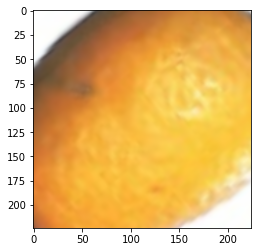
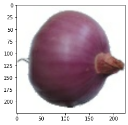
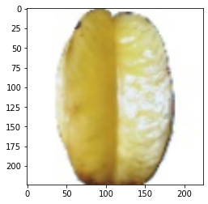

```python
!nvidia-smi
```

    Wed Dec 23 17:12:10 2020       
    +-----------------------------------------------------------------------------+
    | NVIDIA-SMI 460.27.04    Driver Version: 418.67       CUDA Version: 10.1     |
    |-------------------------------+----------------------+----------------------+
    | GPU  Name        Persistence-M| Bus-Id        Disp.A | Volatile Uncorr. ECC |
    | Fan  Temp  Perf  Pwr:Usage/Cap|         Memory-Usage | GPU-Util  Compute M. |
    |                               |                      |               MIG M. |
    |===============================+======================+======================|
    |   0  Tesla T4            Off  | 00000000:00:04.0 Off |                    0 |
    | N/A   64C    P8    11W /  70W |      0MiB / 15079MiB |      0%      Default |
    |                               |                      |                 ERR! |
    +-------------------------------+----------------------+----------------------+
                                                                                   
    +-----------------------------------------------------------------------------+
    | Processes:                                                                  |
    |  GPU   GI   CI        PID   Type   Process name                  GPU Memory |
    |        ID   ID                                                   Usage      |
    |=============================================================================|
    |  No running processes found                                                 |
    +-----------------------------------------------------------------------------+


```python
!wget https://www.dropbox.com/s/fxn3ldztzwxm0rw/FruitsData.zip
```

    --2020-12-23 17:12:11--  https://www.dropbox.com/s/fxn3ldztzwxm0rw/FruitsData.zip
    Resolving www.dropbox.com (www.dropbox.com)... 162.125.1.18, 2620:100:601a:18::a27d:712
    Connecting to www.dropbox.com (www.dropbox.com)|162.125.1.18|:443... connected.
    HTTP request sent, awaiting response... 301 Moved Permanently
    Location: /s/raw/fxn3ldztzwxm0rw/FruitsData.zip [following]
    --2020-12-23 17:12:11--  https://www.dropbox.com/s/raw/fxn3ldztzwxm0rw/FruitsData.zip
    Reusing existing connection to www.dropbox.com:443.
    HTTP request sent, awaiting response... 302 Found
    Location: https://uc5151054852030ef26c03a798be.dl.dropboxusercontent.com/cd/0/inline/BFr7Bib4ALhr0oZZWs_D3YcSe0Ao91lVm78G8LfS6eLk2MWuGYquh3Cp5IUVJ6WqnhJ7TpmFCCnpa8qLS0Ft__hp2qOusUwsj_t5Iz7vJ9Nfy96iF96Pre6lblxSXA6_b8A/file# [following]
    --2020-12-23 17:12:11--  https://uc5151054852030ef26c03a798be.dl.dropboxusercontent.com/cd/0/inline/BFr7Bib4ALhr0oZZWs_D3YcSe0Ao91lVm78G8LfS6eLk2MWuGYquh3Cp5IUVJ6WqnhJ7TpmFCCnpa8qLS0Ft__hp2qOusUwsj_t5Iz7vJ9Nfy96iF96Pre6lblxSXA6_b8A/file
    Resolving uc5151054852030ef26c03a798be.dl.dropboxusercontent.com (uc5151054852030ef26c03a798be.dl.dropboxusercontent.com)... 162.125.1.15, 2620:100:6016:15::a27d:10f
    Connecting to uc5151054852030ef26c03a798be.dl.dropboxusercontent.com (uc5151054852030ef26c03a798be.dl.dropboxusercontent.com)|162.125.1.15|:443... connected.
    HTTP request sent, awaiting response... 302 Found
    Location: /cd/0/inline2/BFptTlNpPc9hYARfjWjBJ3uPx2I_N1RCxxYPCTHIXvYw0aOeNSoIejEjV23ggBtFLcJ9kgGWiLlZmIHe7yBUM0kg2vLIT_-JqJC-3Dz1dMgfEdfO0pqL7uBHZEaNrlmcqKPEqtUKh6Ub98dwGijz1x1B2LtgFBxwzmmsEtOR-8iIgvQ3xTiWdBH894-1BW4R568KKZf_FbURFWb7CDainolLp4jLcZSJDvEsBSKzKcX9A60YFlctCP-w489Pf3FPc-MO2yMqb6RBzFEGlA2yDsGloF4-ERjkoDrIwjS7aGoYeK44U78f_WzMROP71AhxGn4IGr6KQuPO_14X6DDALIm1T5GexL3jLqf-3Xe4whGnAA/file [following]
    --2020-12-23 17:12:12--  https://uc5151054852030ef26c03a798be.dl.dropboxusercontent.com/cd/0/inline2/BFptTlNpPc9hYARfjWjBJ3uPx2I_N1RCxxYPCTHIXvYw0aOeNSoIejEjV23ggBtFLcJ9kgGWiLlZmIHe7yBUM0kg2vLIT_-JqJC-3Dz1dMgfEdfO0pqL7uBHZEaNrlmcqKPEqtUKh6Ub98dwGijz1x1B2LtgFBxwzmmsEtOR-8iIgvQ3xTiWdBH894-1BW4R568KKZf_FbURFWb7CDainolLp4jLcZSJDvEsBSKzKcX9A60YFlctCP-w489Pf3FPc-MO2yMqb6RBzFEGlA2yDsGloF4-ERjkoDrIwjS7aGoYeK44U78f_WzMROP71AhxGn4IGr6KQuPO_14X6DDALIm1T5GexL3jLqf-3Xe4whGnAA/file
    Reusing existing connection to uc5151054852030ef26c03a798be.dl.dropboxusercontent.com:443.
    HTTP request sent, awaiting response... 200 OK
    Length: 796742678 (760M) [application/zip]
    Saving to: ‘FruitsData.zip’
    
    FruitsData.zip      100%[===================>] 759.83M   188MB/s    in 4.3s    
    
    2020-12-23 17:12:17 (178 MB/s) - ‘FruitsData.zip’ saved [796742678/796742678]
    


```python
!unzip -q "/content/FruitsData.zip"
```


```python
# Imports required for this project
import tensorflow as tf
import numpy as np
import matplotlib.pyplot as plt
from pathlib import Path

tf.random.set_seed(4)
```


```python
# Creating the Pathlib PATH objects
train_path = Path("fruits-360/Training")
test_path = Path("fruits-360/Test")
```


```python
# Getting Image paths 
train_image_paths = list(train_path.glob("*/*"))
train_image_paths = list(map(lambda x : str(x) , train_image_paths))

train_image_paths[:10]
```


    ['fruits-360/Training/Carambula/249_100.jpg',
     'fruits-360/Training/Carambula/r_38_100.jpg',
     'fruits-360/Training/Carambula/318_100.jpg',
     'fruits-360/Training/Carambula/40_100.jpg',
     'fruits-360/Training/Carambula/243_100.jpg',
     'fruits-360/Training/Carambula/26_100.jpg',
     'fruits-360/Training/Carambula/113_100.jpg',
     'fruits-360/Training/Carambula/124_100.jpg',
     'fruits-360/Training/Carambula/141_100.jpg',
     'fruits-360/Training/Carambula/r_154_100.jpg']


```python
# Getting their respective labels 

def get_label(image_path):
    return image_path.split("/")[-2]

train_image_labels = list(map(lambda x : get_label(x) , train_image_paths))
train_image_labels[:10]
```


    ['Carambula',
     'Carambula',
     'Carambula',
     'Carambula',
     'Carambula',
     'Carambula',
     'Carambula',
     'Carambula',
     'Carambula',
     'Carambula']


```python
from sklearn.preprocessing import LabelEncoder 

Le = LabelEncoder()
train_image_labels = Le.fit_transform(train_image_labels)

train_image_labels[:10]
```


    array([24, 24, 24, 24, 24, 24, 24, 24, 24, 24])


```python
train_image_labels = tf.keras.utils.to_categorical(train_image_labels)

train_image_labels[:10]
```


    array([[0., 0., 0., ..., 0., 0., 0.],
           [0., 0., 0., ..., 0., 0., 0.],
           [0., 0., 0., ..., 0., 0., 0.],
           ...,
           [0., 0., 0., ..., 0., 0., 0.],
           [0., 0., 0., ..., 0., 0., 0.],
           [0., 0., 0., ..., 0., 0., 0.]], dtype=float32)


```python
from sklearn.model_selection import train_test_split 

Train_paths , Val_paths , Train_labels , Val_labels = train_test_split(train_image_paths , train_image_labels)
```


```python
Train_paths[:10] , Train_labels[:10]
```


    (['fruits-360/Training/Strawberry/29_100.jpg',
      'fruits-360/Training/Grape White/r_181_100.jpg',
      'fruits-360/Training/Banana/197_100.jpg',
      'fruits-360/Training/Apple Golden 3/12_100.jpg',
      'fruits-360/Training/Fig/r_137_100.jpg',
      'fruits-360/Training/Lychee/124_100.jpg',
      'fruits-360/Training/Avocado/227_100.jpg',
      'fruits-360/Training/Apple Red Yellow 2/r_187_100.jpg',
      'fruits-360/Training/Banana Lady Finger/r2_56_100.jpg',
      'fruits-360/Training/Strawberry/128_100.jpg'],
     array([[0., 0., 0., ..., 0., 0., 0.],
            [0., 0., 0., ..., 0., 0., 0.],
            [0., 0., 0., ..., 0., 0., 0.],
            ...,
            [0., 0., 0., ..., 0., 0., 0.],
            [0., 0., 0., ..., 0., 0., 0.],
            [0., 0., 0., ..., 0., 0., 0.]], dtype=float32))


```python
# Function used for Transformation

def load(image , label):
    image = tf.io.read_file(image)
    image = tf.io.decode_jpeg(image , channels = 3)
    return image , label
```


```python
# Define IMAGE SIZE and BATCH SIZE 
IMG_SIZE = 224 
BATCH_SIZE = 32

# Basic Transformation
resize = tf.keras.Sequential([
    tf.keras.layers.experimental.preprocessing.Resizing(IMG_SIZE, IMG_SIZE)          
])

# Data Augmentation
data_augmentation = tf.keras.Sequential([
    tf.keras.layers.experimental.preprocessing.RandomFlip("horizontal"),
    tf.keras.layers.experimental.preprocessing.RandomRotation(0.2),
    tf.keras.layers.experimental.preprocessing.RandomZoom(height_factor = (-0.3, -0.2))
])
```


```python
# Function used to Create a Tensorflow Data Object
AUTOTUNE = tf.data.experimental.AUTOTUNE
def get_dataset(paths , labels , train = True):
    image_paths = tf.convert_to_tensor(paths)
    labels = tf.convert_to_tensor(labels)

    image_dataset = tf.data.Dataset.from_tensor_slices(image_paths)
    label_dataset = tf.data.Dataset.from_tensor_slices(labels)

    dataset = tf.data.Dataset.zip((image_dataset , label_dataset))

    dataset = dataset.map(lambda image , label : load(image , label))
    dataset = dataset.map(lambda image, label: (resize(image), label) , num_parallel_calls=AUTOTUNE)
    dataset = dataset.shuffle(1000)
    dataset = dataset.batch(BATCH_SIZE)

    if train:
        dataset = dataset.map(lambda image, label: (data_augmentation(image), label) , num_parallel_calls=AUTOTUNE)
    
    dataset = dataset.repeat()
    return dataset
```


```python
# Creating Train Dataset object and Verifying it
%time train_dataset = get_dataset(Train_paths , Train_labels)

image , label = next(iter(train_dataset))
print(image.shape)
print(label.shape)
```

    CPU times: user 342 ms, sys: 8.29 ms, total: 350 ms
    Wall time: 399 ms
    (32, 224, 224, 3)
    (32, 131)


```python
# View a sample Training Image
print(Le.inverse_transform(np.argmax(label , axis = 1))[0])
plt.imshow((image[0].numpy()/255).reshape(224 , 224 , 3))
```

    Kumquats


    <matplotlib.image.AxesImage at 0x7f2db0b0d358>


    

    


```python
%time val_dataset = get_dataset(Val_paths , Val_labels , train = False)

image , label = next(iter(val_dataset))
print(image.shape)
print(label.shape)
```

    CPU times: user 31 ms, sys: 520 µs, total: 31.5 ms
    Wall time: 33.1 ms
    (32, 224, 224, 3)
    (32, 131)


```python
# View a sample Validation Image
print(Le.inverse_transform(np.argmax(label , axis = 1))[0])
plt.imshow((image[0].numpy()/255).reshape(224 , 224 , 3))
```

    Onion Red Peeled


    <matplotlib.image.AxesImage at 0x7f2db1a7e748>


    

    


```python
# Building ResNet50 model
from tensorflow.keras.applications import EfficientNetB3

backbone = EfficientNetB3(
    input_shape=(224, 224, 3),
    include_top=False
)

model = tf.keras.Sequential([
    backbone,
    tf.keras.layers.GlobalAveragePooling2D(),
    tf.keras.layers.Dropout(0.3),
    tf.keras.layers.Dense(128, activation='relu'),
    tf.keras.layers.Dense(131, activation='softmax')
])

model.summary()
```

    Downloading data from https://storage.googleapis.com/keras-applications/efficientnetb3_notop.h5
    43941888/43941136 [==============================] - 1s 0us/step
    Model: "sequential_2"
    _________________________________________________________________
    Layer (type)                 Output Shape              Param #   
    =================================================================
    efficientnetb3 (Functional)  (None, 7, 7, 1536)        10783535  
    _________________________________________________________________
    global_average_pooling2d (Gl (None, 1536)              0         
    _________________________________________________________________
    dropout (Dropout)            (None, 1536)              0         
    _________________________________________________________________
    dense (Dense)                (None, 128)               196736    
    _________________________________________________________________
    dense_1 (Dense)              (None, 131)               16899     
    =================================================================
    Total params: 10,997,170
    Trainable params: 10,909,867
    Non-trainable params: 87,303
    _________________________________________________________________


```python
# Compiling your model by providing the Optimizer , Loss and Metrics
model.compile(
    optimizer=tf.keras.optimizers.Adam(learning_rate=0.001, beta_1=0.9, beta_2=0.999, epsilon=1e-07),
    loss = 'categorical_crossentropy',
    metrics=['accuracy' , tf.keras.metrics.Precision(name='precision'),tf.keras.metrics.Recall(name='recall')]
)
```


```python
# Train the model
history = model.fit(
    train_dataset,
    steps_per_epoch=len(Train_paths)//BATCH_SIZE,
    epochs=1,
    #callbacks=[checkpoint , early_stop],
    validation_data=val_dataset,
    validation_steps = len(Val_paths)//BATCH_SIZE,
)
```

    1586/1586 [==============================] - 1103s 683ms/step - loss: 1.0167 - accuracy: 0.7617 - precision: 0.8991 - recall: 0.6925 - val_loss: 0.6522 - val_accuracy: 0.8410 - val_precision: 0.8687 - val_recall: 0.8229


```python
model.layers[0].trainable = False
```


```python
# Defining our callbacks 
checkpoint = tf.keras.callbacks.ModelCheckpoint("best_weights.h5",verbose=1,save_best_only=True,save_weights_only = True)
early_stop = tf.keras.callbacks.EarlyStopping(patience=4)
```


```python
model.summary()
```

    Model: "sequential_2"
    _________________________________________________________________
    Layer (type)                 Output Shape              Param #   
    =================================================================
    efficientnetb3 (Functional)  (None, 7, 7, 1536)        10783535  
    _________________________________________________________________
    global_average_pooling2d (Gl (None, 1536)              0         
    _________________________________________________________________
    dropout (Dropout)            (None, 1536)              0         
    _________________________________________________________________
    dense (Dense)                (None, 128)               196736    
    _________________________________________________________________
    dense_1 (Dense)              (None, 131)               16899     
    =================================================================
    Total params: 10,997,170
    Trainable params: 213,635
    Non-trainable params: 10,783,535
    _________________________________________________________________


```python
# Train the model
history = model.fit(
    train_dataset,
    steps_per_epoch=len(Train_paths)//BATCH_SIZE,
    epochs=8,
    callbacks=[checkpoint , early_stop],
    validation_data=val_dataset,
    validation_steps = len(Val_paths)//BATCH_SIZE,
)
```

Testing Phase


```python
from tensorflow.keras.applications import EfficientNetB3

backbone = EfficientNetB3(
    input_shape=(224, 224, 3),
    include_top=False
)

model = tf.keras.Sequential([
    backbone,
    tf.keras.layers.GlobalAveragePooling2D(),
    tf.keras.layers.Dropout(0.3),
    tf.keras.layers.Dense(128, activation='relu'),
    tf.keras.layers.Dense(131, activation='softmax')
])

model.compile(
    optimizer=tf.keras.optimizers.Adam(learning_rate=0.001, beta_1=0.9, beta_2=0.999, epsilon=1e-07),
    loss = 'categorical_crossentropy',
    metrics=['accuracy' , tf.keras.metrics.Precision(name='precision'),tf.keras.metrics.Recall(name='recall')]
)
```


```python
model.load_weights("best_weights.h5")
```


```python
# Create a Dataset Object for 'Testing' Set just the way we did for Training and Validation
test_image_paths = list(test_path.glob("*/*"))
test_image_paths = list(map(lambda x : str(x) , test_image_paths))
test_labels = list(map(lambda x : get_label(x) , test_image_paths))

test_labels = Le.transform(test_labels)
test_labels = tf.keras.utils.to_categorical(test_labels)

test_image_paths = tf.convert_to_tensor(test_image_paths)
test_labels = tf.convert_to_tensor(test_labels)

def decode_image(image , label):
    image = tf.io.read_file(image)
    image = tf.io.decode_jpeg(image , channels = 3)
    image = tf.image.resize(image , [224 , 224] , method="bilinear")
    return image , label

test_dataset = (
     tf.data.Dataset
    .from_tensor_slices((test_image_paths, test_labels))
    .map(decode_image)
    .batch(BATCH_SIZE)
)
```


```python
# Verify Test Dataset Object
image , label = next(iter(test_dataset))
print(image.shape)
print(label.shape)
```

    (32, 224, 224, 3)
    (32, 131)


```python
# View a sample Validation Image
print(Le.inverse_transform(np.argmax(label , axis = 1))[0])
plt.imshow((image[0].numpy()/255).reshape(224 , 224 , 3))
```

    Carambula


    <matplotlib.image.AxesImage at 0x7f29b2cb4ba8>


    

    


```python
# Evaluating the loaded model
loss, acc, prec, rec = model.evaluate(test_dataset)

print(" Testing Acc : " , acc)
print(" Testing Precision " , prec)
print(" Testing Recall " , rec)
```

    709/709 [==============================] - 79s 111ms/step - loss: 1.0295 - accuracy: 0.7495 - precision: 0.7978 - recall: 0.7152
     Testing Acc :  0.749515175819397
     Testing Precision  0.797787606716156
     Testing Recall  0.7152239084243774


Real time case


```python
def LoadImage(image_path):
    image = tf.io.read_file(image_path)
    image = tf.io.decode_jpeg(image , channels = 3)
    image = tf.image.resize(image , [224 , 224] , method="bilinear")
    plt.imshow(image.numpy()/255)
    image = tf.expand_dims(image , 0)
    return image

def RealtimePrediction(image_path , model, encoder_):
    image = LoadImage(image_path)
    prediction = model.predict(image)
    prediction = np.argmax(prediction , axis = 1)
    return encoder_.inverse_transform(prediction)[0]
```


```python
RealtimePrediction("/content/fruits-360/Training/Apple Braeburn/100_100.jpg" , model , Le)
```


    'Apple Braeburn'


    

    


```python

```
