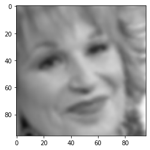
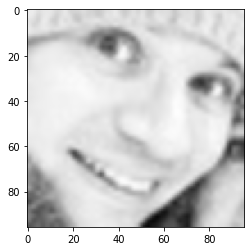
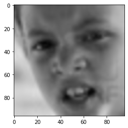

Lesson 4


```
!wget https://www.dropbox.com/s/si11cws2pyho1bp/archive.zip
```

    --2021-03-11 08:35:46--  https://www.dropbox.com/s/si11cws2pyho1bp/archive.zip
    Resolving www.dropbox.com (www.dropbox.com)... 162.125.1.18, 2620:100:601a:18::a27d:712
    Connecting to www.dropbox.com (www.dropbox.com)|162.125.1.18|:443... connected.
    HTTP request sent, awaiting response... 301 Moved Permanently
    Location: /s/raw/si11cws2pyho1bp/archive.zip [following]
    --2021-03-11 08:35:46--  https://www.dropbox.com/s/raw/si11cws2pyho1bp/archive.zip
    Reusing existing connection to www.dropbox.com:443.
    HTTP request sent, awaiting response... 302 Found
    Location: https://uc25e83f58f1b9a6f7e55e255ff7.dl.dropboxusercontent.com/cd/0/inline/BKe5xQbgYQYCGZSiScKP9o9MoFKrpNB8kKMjOWc-TqSoOxtV4VStZnTI-5n1SmzyR_R0slfpbIXnAHTLxvaV5_WWKmQMxJZgvt09byHs0gBMRNNLhcJDemxc3-46QnoNG8TST36XoPNs_RFplIQZILqb/file# [following]
    --2021-03-11 08:35:47--  https://uc25e83f58f1b9a6f7e55e255ff7.dl.dropboxusercontent.com/cd/0/inline/BKe5xQbgYQYCGZSiScKP9o9MoFKrpNB8kKMjOWc-TqSoOxtV4VStZnTI-5n1SmzyR_R0slfpbIXnAHTLxvaV5_WWKmQMxJZgvt09byHs0gBMRNNLhcJDemxc3-46QnoNG8TST36XoPNs_RFplIQZILqb/file
    Resolving uc25e83f58f1b9a6f7e55e255ff7.dl.dropboxusercontent.com (uc25e83f58f1b9a6f7e55e255ff7.dl.dropboxusercontent.com)... 162.125.1.15, 2620:100:6017:15::a27d:20f
    Connecting to uc25e83f58f1b9a6f7e55e255ff7.dl.dropboxusercontent.com (uc25e83f58f1b9a6f7e55e255ff7.dl.dropboxusercontent.com)|162.125.1.15|:443... connected.
    HTTP request sent, awaiting response... 302 Found
    Location: /cd/0/inline2/BKcUT2VOgFnvwuU-AZyPmqt2sTcKsUQtigI1EeyESkq-z88r6IThYgc1B0oOSUt161_MxtHKeMql_cjQhcxVqM1YY5a0NSsJs7LZmwC3uRpGuAadiHAfdTc_nYofotxktGqTxet4VGVpePRgmziN0Eu5-flIU-Ffn8wCxObLR7o8p69IJYfRBHsec3Ce3V8s3pFKnJxNfN2HlOOkERM4PMCCI7OrFXrpSMPleVxznEo7wN0VYGSdhwDN-y0hlt8sAFrocdGD2z5HNGHL8G-gVbsPdrwyGvi5aF7jXUWOasmZBepc9iyPvHmE1i5wtDbZG4Dc9xt_5M-VdOd8oRpzJsd4gWQyBklhUsbcJCs0viZxCM0-ZU1O_SXxjt3I_o07cmw/file [following]
    --2021-03-11 08:35:48--  https://uc25e83f58f1b9a6f7e55e255ff7.dl.dropboxusercontent.com/cd/0/inline2/BKcUT2VOgFnvwuU-AZyPmqt2sTcKsUQtigI1EeyESkq-z88r6IThYgc1B0oOSUt161_MxtHKeMql_cjQhcxVqM1YY5a0NSsJs7LZmwC3uRpGuAadiHAfdTc_nYofotxktGqTxet4VGVpePRgmziN0Eu5-flIU-Ffn8wCxObLR7o8p69IJYfRBHsec3Ce3V8s3pFKnJxNfN2HlOOkERM4PMCCI7OrFXrpSMPleVxznEo7wN0VYGSdhwDN-y0hlt8sAFrocdGD2z5HNGHL8G-gVbsPdrwyGvi5aF7jXUWOasmZBepc9iyPvHmE1i5wtDbZG4Dc9xt_5M-VdOd8oRpzJsd4gWQyBklhUsbcJCs0viZxCM0-ZU1O_SXxjt3I_o07cmw/file
    Reusing existing connection to uc25e83f58f1b9a6f7e55e255ff7.dl.dropboxusercontent.com:443.
    HTTP request sent, awaiting response... 200 OK
    Length: 63252113 (60M) [application/zip]
    Saving to: ‘archive.zip’
    
    archive.zip         100%[===================>]  60.32M  30.0MB/s    in 2.0s    
    
    2021-03-11 08:35:50 (30.0 MB/s) - ‘archive.zip’ saved [63252113/63252113]
    


```
!unzip -q "/content/archive.zip"
```


```
# Imports required for this project
import tensorflow as tf
import numpy as np
import matplotlib.pyplot as plt
from pathlib import Path

tf.random.set_seed(4)
```


```
# Creating the Pathlib PATH objects
train_path = Path("/content/train")
test_path = Path("/content/test")
```


```
# Getting Image paths 
train_image_paths = list(train_path.glob("*/*"))
train_image_paths = list(map(lambda x : str(x) , train_image_paths))

train_image_paths[:10]
```


    ['/content/train/surprise/Training_13005739.jpg',
     '/content/train/surprise/Training_42331850.jpg',
     '/content/train/surprise/Training_44495606.jpg',
     '/content/train/surprise/Training_4944485.jpg',
     '/content/train/surprise/Training_42143192.jpg',
     '/content/train/surprise/Training_43002756.jpg',
     '/content/train/surprise/Training_67986198.jpg',
     '/content/train/surprise/Training_48914569.jpg',
     '/content/train/surprise/Training_98393554.jpg',
     '/content/train/surprise/Training_11999214.jpg']


```
# Getting their respective labels 

def get_label(image_path):
    return image_path.split("/")[-2]

train_image_labels = list(map(lambda x : get_label(x) , train_image_paths))
train_image_labels[:10]
```


    ['surprise',
     'surprise',
     'surprise',
     'surprise',
     'surprise',
     'surprise',
     'surprise',
     'surprise',
     'surprise',
     'surprise']


```
from sklearn.preprocessing import LabelEncoder 

Le = LabelEncoder()
train_image_labels = Le.fit_transform(train_image_labels)

train_image_labels[:10]
```


    array([6, 6, 6, 6, 6, 6, 6, 6, 6, 6])


```
train_image_labels = tf.keras.utils.to_categorical(train_image_labels)

train_image_labels[:10]
```


    array([[0., 0., 0., 0., 0., 0., 1.],
           [0., 0., 0., 0., 0., 0., 1.],
           [0., 0., 0., 0., 0., 0., 1.],
           [0., 0., 0., 0., 0., 0., 1.],
           [0., 0., 0., 0., 0., 0., 1.],
           [0., 0., 0., 0., 0., 0., 1.],
           [0., 0., 0., 0., 0., 0., 1.],
           [0., 0., 0., 0., 0., 0., 1.],
           [0., 0., 0., 0., 0., 0., 1.],
           [0., 0., 0., 0., 0., 0., 1.]], dtype=float32)


```
from sklearn.model_selection import train_test_split 

Train_paths , Val_paths , Train_labels , Val_labels = train_test_split(train_image_paths , train_image_labels , test_size = 0.25)
```


```
# Compute class weights 

classTotals = Train_labels.sum(axis=0)
classWeight = classTotals.max() / classTotals

class_weight = {e : weight for e , weight in enumerate(classWeight)}
print(class_weight)
```

    {0: 1.7802706, 1: 16.302114, 2: 1.7732501, 3: 1.0, 4: 1.4556245, 5: 1.4865013, 6: 2.2549102}


Lesson 5


```
# Function used for Transformation

def load(image , label):
    image = tf.io.read_file(image)
    image = tf.io.decode_jpeg(image , channels = 3)
    return image , label
```


```
# Define IMAGE SIZE and BATCH SIZE 
IMG_SIZE = 96 
BATCH_SIZE = 32

# Basic Transformation
resize = tf.keras.Sequential([
    tf.keras.layers.experimental.preprocessing.Resizing(IMG_SIZE, IMG_SIZE)          
])

# Data Augmentation
data_augmentation = tf.keras.Sequential([
    tf.keras.layers.experimental.preprocessing.RandomFlip("horizontal"),
    tf.keras.layers.experimental.preprocessing.RandomRotation(0.1),
    tf.keras.layers.experimental.preprocessing.RandomZoom(height_factor = (-0.1, -0.05))
])
```


```
# Function used to Create a Tensorflow Data Object
AUTOTUNE = tf.data.experimental.AUTOTUNE
def get_dataset(paths , labels , train = True):
    image_paths = tf.convert_to_tensor(paths)
    labels = tf.convert_to_tensor(labels)

    image_dataset = tf.data.Dataset.from_tensor_slices(image_paths)
    label_dataset = tf.data.Dataset.from_tensor_slices(labels)

    dataset = tf.data.Dataset.zip((image_dataset , label_dataset))

    dataset = dataset.map(lambda image , label : load(image , label))
    dataset = dataset.map(lambda image, label: (resize(image), label) , num_parallel_calls=AUTOTUNE)
    dataset = dataset.shuffle(1000)
    dataset = dataset.batch(BATCH_SIZE)

    if train:
        dataset = dataset.map(lambda image, label: (data_augmentation(image), label) , num_parallel_calls=AUTOTUNE)
    
    dataset = dataset.repeat()
    return dataset
```


```
# Creating Train Dataset object and Verifying it
%time train_dataset = get_dataset(Train_paths , Train_labels)

image , label = next(iter(train_dataset))
print(image.shape)
print(label.shape)
```

    CPU times: user 318 ms, sys: 8.77 ms, total: 327 ms
    Wall time: 328 ms
    (32, 96, 96, 3)
    (32, 7)


```
# View a sample Training Image
print(Le.inverse_transform(np.argmax(label , axis = 1))[0])
plt.imshow((image[0].numpy()/255).reshape(96 , 96 , 3))
```

    happy


    <matplotlib.image.AxesImage at 0x7fdd8a76b4d0>


    

    


```
%time val_dataset = get_dataset(Val_paths , Val_labels , train = False)

image , label = next(iter(val_dataset))
print(image.shape)
print(label.shape)
```

    CPU times: user 113 ms, sys: 981 µs, total: 114 ms
    Wall time: 114 ms
    (32, 96, 96, 3)
    (32, 7)


```
# View a sample Validation Image
print(Le.inverse_transform(np.argmax(label , axis = 1))[0])
plt.imshow((image[0].numpy()/255).reshape(96 , 96 , 3))
```

    happy


    <matplotlib.image.AxesImage at 0x7fddc00f5b10>


    

    


```
# Building EfficientNet model
from tensorflow.keras.applications import EfficientNetB2

backbone = EfficientNetB2(
    input_shape=(96, 96, 3),
    include_top=False
)

model = tf.keras.Sequential([
    backbone,
    tf.keras.layers.GlobalAveragePooling2D(),
    tf.keras.layers.Dropout(0.3),
    tf.keras.layers.Dense(128, activation='relu'),
    tf.keras.layers.Dense(7, activation='softmax')
])

model.summary()
```

    Model: "sequential_2"
    _________________________________________________________________
    Layer (type)                 Output Shape              Param #   
    =================================================================
    efficientnetb2 (Functional)  (None, 3, 3, 1408)        7768569   
    _________________________________________________________________
    global_average_pooling2d (Gl (None, 1408)              0         
    _________________________________________________________________
    dropout (Dropout)            (None, 1408)              0         
    _________________________________________________________________
    dense (Dense)                (None, 128)               180352    
    _________________________________________________________________
    dense_1 (Dense)              (None, 7)                 903       
    =================================================================
    Total params: 7,949,824
    Trainable params: 7,882,249
    Non-trainable params: 67,575
    _________________________________________________________________


```
# Compiling your model by providing the Optimizer , Loss and Metrics
model.compile(
    optimizer=tf.keras.optimizers.Adam(learning_rate=0.001, beta_1=0.9, beta_2=0.999, epsilon=1e-07),
    loss = 'categorical_crossentropy',
    metrics=['accuracy' , tf.keras.metrics.Precision(name='precision'),tf.keras.metrics.Recall(name='recall')]
)
```


```
# Train the model
history = model.fit(
    train_dataset,
    steps_per_epoch=len(Train_paths)//BATCH_SIZE,
    epochs=12,
    validation_data=val_dataset,
    validation_steps = len(Val_paths)//BATCH_SIZE,
    class_weight=class_weight
)
```

    Epoch 1/12
    672/672 [==============================] - 109s 141ms/step - loss: 3.0738 - accuracy: 0.3426 - precision: 0.5389 - recall: 0.1286 - val_loss: 1.6473 - val_accuracy: 0.4103 - val_precision: 0.6277 - val_recall: 0.2335
    
    Epoch 00001: val_loss improved from inf to 1.64727, saving model to best_weights.h5
    Epoch 2/12
    672/672 [==============================] - 95s 139ms/step - loss: 2.5196 - accuracy: 0.4631 - precision: 0.6873 - recall: 0.2533 - val_loss: 1.3696 - val_accuracy: 0.5056 - val_precision: 0.6726 - val_recall: 0.2780
    
    Epoch 00002: val_loss improved from 1.64727 to 1.36964, saving model to best_weights.h5
    Epoch 3/12
    672/672 [==============================] - 93s 139ms/step - loss: 2.3181 - accuracy: 0.4999 - precision: 0.6924 - recall: 0.3048 - val_loss: 1.2035 - val_accuracy: 0.5480 - val_precision: 0.7116 - val_recall: 0.3952
    
    Epoch 00003: val_loss improved from 1.36964 to 1.20353, saving model to best_weights.h5
    Epoch 4/12
    672/672 [==============================] - 93s 139ms/step - loss: 2.1488 - accuracy: 0.5367 - precision: 0.6990 - recall: 0.3515 - val_loss: 1.2342 - val_accuracy: 0.5388 - val_precision: 0.7082 - val_recall: 0.3707
    
    Epoch 00004: val_loss did not improve from 1.20353
    Epoch 5/12
    672/672 [==============================] - 95s 141ms/step - loss: 2.1016 - accuracy: 0.5455 - precision: 0.7158 - recall: 0.3617 - val_loss: 1.2610 - val_accuracy: 0.5501 - val_precision: 0.6694 - val_recall: 0.4231
    
    Epoch 00005: val_loss did not improve from 1.20353
    Epoch 6/12
    672/672 [==============================] - 94s 140ms/step - loss: 2.0161 - accuracy: 0.5577 - precision: 0.7152 - recall: 0.3809 - val_loss: 1.1664 - val_accuracy: 0.5698 - val_precision: 0.7223 - val_recall: 0.3789
    
    Epoch 00006: val_loss improved from 1.20353 to 1.16642, saving model to best_weights.h5
    Epoch 7/12
    672/672 [==============================] - 94s 140ms/step - loss: 1.9538 - accuracy: 0.5732 - precision: 0.7218 - recall: 0.3932 - val_loss: 1.1001 - val_accuracy: 0.5850 - val_precision: 0.7291 - val_recall: 0.4156
    
    Epoch 00007: val_loss improved from 1.16642 to 1.10012, saving model to best_weights.h5
    Epoch 8/12
    672/672 [==============================] - 94s 140ms/step - loss: 1.9337 - accuracy: 0.5771 - precision: 0.7231 - recall: 0.4199 - val_loss: 1.1276 - val_accuracy: 0.5706 - val_precision: 0.7548 - val_recall: 0.3994
    
    Epoch 00008: val_loss did not improve from 1.10012
    Epoch 9/12
    672/672 [==============================] - 94s 139ms/step - loss: 1.8548 - accuracy: 0.5925 - precision: 0.7284 - recall: 0.4217 - val_loss: 1.1313 - val_accuracy: 0.5765 - val_precision: 0.6968 - val_recall: 0.4505
    
    Epoch 00009: val_loss did not improve from 1.10012
    Epoch 10/12
    672/672 [==============================] - 94s 139ms/step - loss: 1.7887 - accuracy: 0.6010 - precision: 0.7413 - recall: 0.4530 - val_loss: 1.0988 - val_accuracy: 0.5936 - val_precision: 0.7226 - val_recall: 0.4343
    
    Epoch 00010: val_loss improved from 1.10012 to 1.09875, saving model to best_weights.h5
    Epoch 11/12
    672/672 [==============================] - 93s 139ms/step - loss: 1.7803 - accuracy: 0.6086 - precision: 0.7400 - recall: 0.4580 - val_loss: 1.1499 - val_accuracy: 0.5785 - val_precision: 0.7051 - val_recall: 0.4362
    
    Epoch 00011: val_loss did not improve from 1.09875
    Epoch 12/12
    672/672 [==============================] - 93s 139ms/step - loss: 1.7870 - accuracy: 0.6056 - precision: 0.7373 - recall: 0.4594 - val_loss: 1.0737 - val_accuracy: 0.6044 - val_precision: 0.7047 - val_recall: 0.4993
    
    Epoch 00012: val_loss improved from 1.09875 to 1.07375, saving model to best_weights.h5


```
model.layers[0].trainable = False
```


```
# Defining our callbacks 
checkpoint = tf.keras.callbacks.ModelCheckpoint("best_weights.h5",verbose=1,save_best_only=True,save_weights_only = True)
early_stop = tf.keras.callbacks.EarlyStopping(patience=4)
```


```
model.summary()
```

    Model: "sequential_2"
    _________________________________________________________________
    Layer (type)                 Output Shape              Param #   
    =================================================================
    efficientnetb2 (Functional)  (None, 3, 3, 1408)        7768569   
    _________________________________________________________________
    global_average_pooling2d (Gl (None, 1408)              0         
    _________________________________________________________________
    dropout (Dropout)            (None, 1408)              0         
    _________________________________________________________________
    dense (Dense)                (None, 128)               180352    
    _________________________________________________________________
    dense_1 (Dense)              (None, 7)                 903       
    =================================================================
    Total params: 7,949,824
    Trainable params: 181,255
    Non-trainable params: 7,768,569
    _________________________________________________________________


```
# Train the model
history = model.fit(
    train_dataset,
    steps_per_epoch=len(Train_paths)//BATCH_SIZE,
    epochs=8,
    callbacks=[checkpoint , early_stop],
    validation_data=val_dataset,
    validation_steps = len(Val_paths)//BATCH_SIZE,
    class_weight=class_weight
)
```

    Epoch 1/8
    672/672 [==============================] - 93s 137ms/step - loss: 1.6803 - accuracy: 0.6242 - precision: 0.7489 - recall: 0.4868 - val_loss: 1.1238 - val_accuracy: 0.5917 - val_precision: 0.6829 - val_recall: 0.4951
    
    Epoch 00001: val_loss improved from inf to 1.12379, saving model to best_weights.h5
    Epoch 2/8
    672/672 [==============================] - 93s 138ms/step - loss: 1.6224 - accuracy: 0.6365 - precision: 0.7547 - recall: 0.5037 - val_loss: 1.0560 - val_accuracy: 0.6112 - val_precision: 0.7309 - val_recall: 0.4747
    
    Epoch 00002: val_loss improved from 1.12379 to 1.05605, saving model to best_weights.h5
    Epoch 3/8
    672/672 [==============================] - 92s 138ms/step - loss: 1.6350 - accuracy: 0.6336 - precision: 0.7525 - recall: 0.4995 - val_loss: 1.0810 - val_accuracy: 0.6062 - val_precision: 0.6921 - val_recall: 0.5059
    
    Epoch 00003: val_loss did not improve from 1.05605
    Epoch 4/8
    672/672 [==============================] - 93s 138ms/step - loss: 1.6116 - accuracy: 0.6402 - precision: 0.7515 - recall: 0.5105 - val_loss: 1.0096 - val_accuracy: 0.6272 - val_precision: 0.7210 - val_recall: 0.5280
    
    Epoch 00004: val_loss improved from 1.05605 to 1.00958, saving model to best_weights.h5
    Epoch 5/8
    672/672 [==============================] - 92s 137ms/step - loss: 1.5672 - accuracy: 0.6467 - precision: 0.7617 - recall: 0.5258 - val_loss: 1.1598 - val_accuracy: 0.5855 - val_precision: 0.6835 - val_recall: 0.4828
    
    Epoch 00005: val_loss did not improve from 1.00958
    Epoch 6/8
    672/672 [==============================] - 92s 137ms/step - loss: 1.5009 - accuracy: 0.6615 - precision: 0.7641 - recall: 0.5435 - val_loss: 1.0226 - val_accuracy: 0.6258 - val_precision: 0.7183 - val_recall: 0.5318
    
    Epoch 00006: val_loss did not improve from 1.00958
    Epoch 7/8
    672/672 [==============================] - 93s 139ms/step - loss: 1.5229 - accuracy: 0.6539 - precision: 0.7616 - recall: 0.5385 - val_loss: 1.0430 - val_accuracy: 0.6208 - val_precision: 0.7213 - val_recall: 0.5045
    
    Epoch 00007: val_loss did not improve from 1.00958
    Epoch 8/8
    672/672 [==============================] - 93s 138ms/step - loss: 1.5159 - accuracy: 0.6536 - precision: 0.7611 - recall: 0.5376 - val_loss: 1.0722 - val_accuracy: 0.6085 - val_precision: 0.7042 - val_recall: 0.5038
    
    Epoch 00008: val_loss did not improve from 1.00958


Testing Phase


```
from tensorflow.keras.applications import EfficientNetB2

backbone = EfficientNetB2(
    input_shape=(96, 96, 3),
    include_top=False
)

model = tf.keras.Sequential([
    backbone,
    tf.keras.layers.GlobalAveragePooling2D(),
    tf.keras.layers.Dropout(0.3),
    tf.keras.layers.Dense(128, activation='relu'),
    tf.keras.layers.Dense(7, activation='softmax')
])

model.compile(
    optimizer=tf.keras.optimizers.Adam(learning_rate=0.001, beta_1=0.9, beta_2=0.999, epsilon=1e-07),
    loss = 'categorical_crossentropy',
    metrics=['accuracy' , tf.keras.metrics.Precision(name='precision'),tf.keras.metrics.Recall(name='recall')]
)
```


```
model.load_weights("best_weights.h5")
```


```
# Create a Dataset Object for 'Testing' Set just the way we did for Training and Validation
test_image_paths = list(test_path.glob("*/*"))
test_image_paths = list(map(lambda x : str(x) , test_image_paths))
test_labels = list(map(lambda x : get_label(x) , test_image_paths))

test_labels = Le.transform(test_labels)
test_labels = tf.keras.utils.to_categorical(test_labels)

test_image_paths = tf.convert_to_tensor(test_image_paths)
test_labels = tf.convert_to_tensor(test_labels)

def decode_image(image , label):
    image = tf.io.read_file(image)
    image = tf.io.decode_jpeg(image , channels = 3)
    image = tf.image.resize(image , [96 , 96] , method="bilinear")
    return image , label

test_dataset = (
     tf.data.Dataset
    .from_tensor_slices((test_image_paths, test_labels))
    .map(decode_image)
    .batch(BATCH_SIZE)
)
```


```
# Verify Test Dataset Object
image , label = next(iter(test_dataset))
print(image.shape)
print(label.shape)
```

    (32, 96, 96, 3)
    (32, 7)


```
# View a sample Validation Image
print(Le.inverse_transform(np.argmax(label , axis = 1))[0])
plt.imshow((image[0].numpy()/255).reshape(96 , 96 , 3))
```

    disgust


    <matplotlib.image.AxesImage at 0x7fdd83fbaad0>


    

    


```
# Evaluating the loaded model
loss, acc, prec, rec = model.evaluate(test_dataset)

print(" Testing Acc : " , acc)
print(" Testing Precision " , prec)
print(" Testing Recall " , rec)
```

    225/225 [==============================] - 9s 26ms/step - loss: 1.1528 - accuracy: 0.5663 - precision: 0.6564 - recall: 0.4516
     Testing Acc :  0.622596800327301
     Testing Precision  0.7180851101875305
     Testing Recall  0.5266090631484985


Save Objects


```
# Save Model
model.save("FacialExpressionModel.h5")
```


```
# Save Label Encoder 
import pickle

def save_object(obj , name):
    pickle_obj = open(f"{name}.pck","wb")
    pickle.dump(obj, pickle_obj)
    pickle_obj.close()
```


```
save_object(Le, "LabelEncoder")
```
