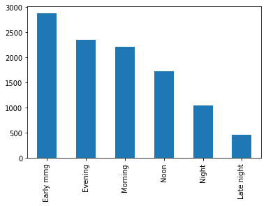
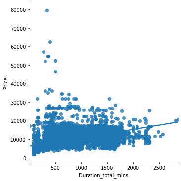
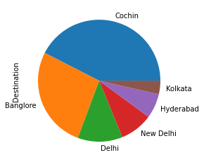
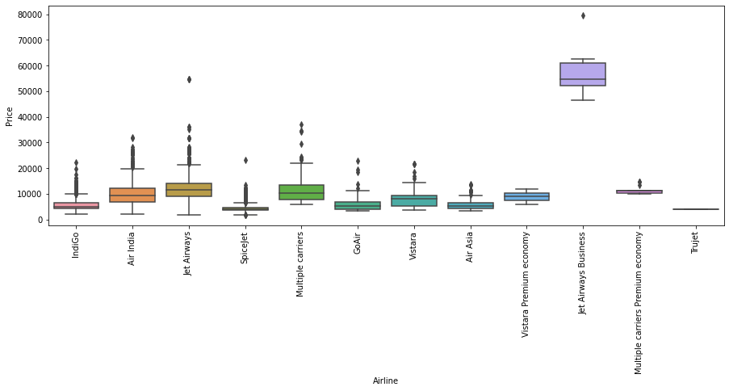
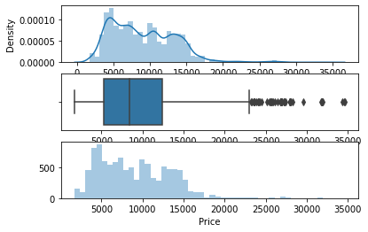
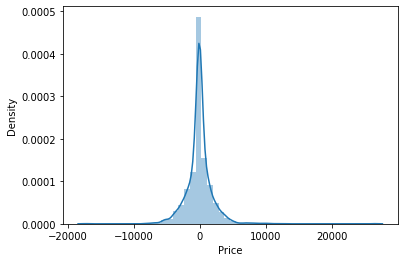

```python

```

#### importing all the necessary libraries !


```python
import pandas as pd
import numpy as np
import matplotlib.pyplot as plt
import seaborn as sns
```


```python
train_data=pd.read_excel(r'E:\End-2-end Projects\Flight_Price\Datasets/Data_Train.xlsx')
```


```python

```


```python
### why there is a need to append 'r' (raw_string?
```


```python
print('Hello\tPython')

### Now, here 'Hello\tPython' is a normal string literal, the sequences “\t” will be treated as escape characters.
```

    Hello	Python


```python
print(r'Hello\xPython')

'''
 we cannot put 'Hello\xPython' into a normal string literal. What can we do now?

This is where raw string come handy.
## so just to convert normal string into raw string  , u can think of appending "r" or "R"!

'''
```

    Hello\xPython


```python
train_data.head(7)
```


<div>
<style scoped>
    .dataframe tbody tr th:only-of-type {
        vertical-align: middle;
    }

    .dataframe tbody tr th {
        vertical-align: top;
    }

    .dataframe thead th {
        text-align: right;
    }
</style>
<table border="1" class="dataframe">
  <thead>
    <tr style="text-align: right;">
      <th></th>
      <th>Airline</th>
      <th>Date_of_Journey</th>
      <th>Source</th>
      <th>Destination</th>
      <th>Route</th>
      <th>Dep_Time</th>
      <th>Arrival_Time</th>
      <th>Duration</th>
      <th>Total_Stops</th>
      <th>Additional_Info</th>
      <th>Price</th>
    </tr>
  </thead>
  <tbody>
    <tr>
      <th>0</th>
      <td>IndiGo</td>
      <td>24/03/2019</td>
      <td>Banglore</td>
      <td>New Delhi</td>
      <td>BLR → DEL</td>
      <td>22:20</td>
      <td>01:10 22 Mar</td>
      <td>2h 50m</td>
      <td>non-stop</td>
      <td>No info</td>
      <td>3897</td>
    </tr>
    <tr>
      <th>1</th>
      <td>Air India</td>
      <td>1/05/2019</td>
      <td>Kolkata</td>
      <td>Banglore</td>
      <td>CCU → IXR → BBI → BLR</td>
      <td>05:50</td>
      <td>13:15</td>
      <td>7h 25m</td>
      <td>2 stops</td>
      <td>No info</td>
      <td>7662</td>
    </tr>
    <tr>
      <th>2</th>
      <td>Jet Airways</td>
      <td>9/06/2019</td>
      <td>Delhi</td>
      <td>Cochin</td>
      <td>DEL → LKO → BOM → COK</td>
      <td>09:25</td>
      <td>04:25 10 Jun</td>
      <td>19h</td>
      <td>2 stops</td>
      <td>No info</td>
      <td>13882</td>
    </tr>
    <tr>
      <th>3</th>
      <td>IndiGo</td>
      <td>12/05/2019</td>
      <td>Kolkata</td>
      <td>Banglore</td>
      <td>CCU → NAG → BLR</td>
      <td>18:05</td>
      <td>23:30</td>
      <td>5h 25m</td>
      <td>1 stop</td>
      <td>No info</td>
      <td>6218</td>
    </tr>
    <tr>
      <th>4</th>
      <td>IndiGo</td>
      <td>01/03/2019</td>
      <td>Banglore</td>
      <td>New Delhi</td>
      <td>BLR → NAG → DEL</td>
      <td>16:50</td>
      <td>21:35</td>
      <td>4h 45m</td>
      <td>1 stop</td>
      <td>No info</td>
      <td>13302</td>
    </tr>
    <tr>
      <th>5</th>
      <td>SpiceJet</td>
      <td>24/06/2019</td>
      <td>Kolkata</td>
      <td>Banglore</td>
      <td>CCU → BLR</td>
      <td>09:00</td>
      <td>11:25</td>
      <td>2h 25m</td>
      <td>non-stop</td>
      <td>No info</td>
      <td>3873</td>
    </tr>
    <tr>
      <th>6</th>
      <td>Jet Airways</td>
      <td>12/03/2019</td>
      <td>Banglore</td>
      <td>New Delhi</td>
      <td>BLR → BOM → DEL</td>
      <td>18:55</td>
      <td>10:25 13 Mar</td>
      <td>15h 30m</td>
      <td>1 stop</td>
      <td>In-flight meal not included</td>
      <td>11087</td>
    </tr>
  </tbody>
</table>
</div>


```python
train_data.info()
```

    <class 'pandas.core.frame.DataFrame'>
    RangeIndex: 10683 entries, 0 to 10682
    Data columns (total 11 columns):
     #   Column           Non-Null Count  Dtype 
    ---  ------           --------------  ----- 
     0   Airline          10683 non-null  object
     1   Date_of_Journey  10683 non-null  object
     2   Source           10683 non-null  object
     3   Destination      10683 non-null  object
     4   Route            10682 non-null  object
     5   Dep_Time         10683 non-null  object
     6   Arrival_Time     10683 non-null  object
     7   Duration         10683 non-null  object
     8   Total_Stops      10682 non-null  object
     9   Additional_Info  10683 non-null  object
     10  Price            10683 non-null  int64 
    dtypes: int64(1), object(10)
    memory usage: 918.2+ KB


#### Importing dataset
    1.Since data is in form of excel file we have to use pandas read_excel to load the data
    2.After loading it is important to check null values in a column or a row
    3.If it is present then following can be done,
        a.Filling NaN values with mean, median and mode using fillna() method
        b.If Less missing values, we can drop it as well


```python

```


```python
train_data.isnull().sum()

## train_data.isnull().sum(axis=0)
## by-default axis is 0 , ie it computes total missing values column-wise !

## train_data.isnull().sum(axis=1) -->> if axis=1 , ie it computes total missing values row-wise !
```


    Airline            0
    Date_of_Journey    0
    Source             0
    Destination        0
    Route              1
    Dep_Time           0
    Arrival_Time       0
    Duration           0
    Total_Stops        1
    Additional_Info    0
    Price              0
    dtype: int64


```python
train_data.shape
```


    (10683, 11)


```python
### getting all the rows where we have missing value
train_data[train_data['Total_Stops'].isnull()]
```


<div>
<style scoped>
    .dataframe tbody tr th:only-of-type {
        vertical-align: middle;
    }

    .dataframe tbody tr th {
        vertical-align: top;
    }

    .dataframe thead th {
        text-align: right;
    }
</style>
<table border="1" class="dataframe">
  <thead>
    <tr style="text-align: right;">
      <th></th>
      <th>Airline</th>
      <th>Date_of_Journey</th>
      <th>Source</th>
      <th>Destination</th>
      <th>Route</th>
      <th>Dep_Time</th>
      <th>Arrival_Time</th>
      <th>Duration</th>
      <th>Total_Stops</th>
      <th>Additional_Info</th>
      <th>Price</th>
    </tr>
  </thead>
  <tbody>
    <tr>
      <th>9039</th>
      <td>Air India</td>
      <td>6/05/2019</td>
      <td>Delhi</td>
      <td>Cochin</td>
      <td>NaN</td>
      <td>09:45</td>
      <td>09:25 07 May</td>
      <td>23h 40m</td>
      <td>NaN</td>
      <td>No info</td>
      <td>7480</td>
    </tr>
  </tbody>
</table>
</div>


```python

```

#### as we have 1 missing value , I can directly drop these


```python
train_data.dropna(inplace=True)
```


```python
train_data.isnull().sum()
```


    Airline            0
    Date_of_Journey    0
    Source             0
    Destination        0
    Route              0
    Dep_Time           0
    Arrival_Time       0
    Duration           0
    Total_Stops        0
    Additional_Info    0
    Price              0
    dtype: int64


```python

```


```python

```

## Pre-process & Perform Featurization of "Date_of_Journey"
    ie pre-process it & extract day,month,year from "Date_of_Journey" feature..


```python
data=train_data.copy()
```


```python
data.head(2)
```


<div>
<style scoped>
    .dataframe tbody tr th:only-of-type {
        vertical-align: middle;
    }

    .dataframe tbody tr th {
        vertical-align: top;
    }

    .dataframe thead th {
        text-align: right;
    }
</style>
<table border="1" class="dataframe">
  <thead>
    <tr style="text-align: right;">
      <th></th>
      <th>Airline</th>
      <th>Date_of_Journey</th>
      <th>Source</th>
      <th>Destination</th>
      <th>Route</th>
      <th>Dep_Time</th>
      <th>Arrival_Time</th>
      <th>Duration</th>
      <th>Total_Stops</th>
      <th>Additional_Info</th>
      <th>Price</th>
    </tr>
  </thead>
  <tbody>
    <tr>
      <th>0</th>
      <td>IndiGo</td>
      <td>24/03/2019</td>
      <td>Banglore</td>
      <td>New Delhi</td>
      <td>BLR → DEL</td>
      <td>22:20</td>
      <td>01:10 22 Mar</td>
      <td>2h 50m</td>
      <td>non-stop</td>
      <td>No info</td>
      <td>3897</td>
    </tr>
    <tr>
      <th>1</th>
      <td>Air India</td>
      <td>1/05/2019</td>
      <td>Kolkata</td>
      <td>Banglore</td>
      <td>CCU → IXR → BBI → BLR</td>
      <td>05:50</td>
      <td>13:15</td>
      <td>7h 25m</td>
      <td>2 stops</td>
      <td>No info</td>
      <td>7662</td>
    </tr>
  </tbody>
</table>
</div>


```python
data.dtypes
```


    Airline            object
    Date_of_Journey    object
    Source             object
    Destination        object
    Route              object
    Dep_Time           object
    Arrival_Time       object
    Duration           object
    Total_Stops        object
    Additional_Info    object
    Price               int64
    dtype: object


we can see that Date_of_Journey is a object data type,
Therefore, we have to convert this datatype into timestamp bcz our 
model will not be able to understand these string values,it just understand Time-stamp..

For this we require pandas to_datetime to convert object data type to datetime dtype.

```python

```


```python
def change_into_datetime(col):
    data[col]=pd.to_datetime(data[col])
```


```python
data.columns
```


    Index(['Airline', 'Date_of_Journey', 'Source', 'Destination', 'Route',
           'Dep_Time', 'Arrival_Time', 'Duration', 'Total_Stops',
           'Additional_Info', 'Price'],
          dtype='object')


```python
for feature in ['Date_of_Journey','Dep_Time', 'Arrival_Time']:
    change_into_datetime(feature)
```


```python
data.dtypes
```


    Airline                    object
    Date_of_Journey    datetime64[ns]
    Source                     object
    Destination                object
    Route                      object
    Dep_Time           datetime64[ns]
    Arrival_Time       datetime64[ns]
    Duration                   object
    Total_Stops                object
    Additional_Info            object
    Price                       int64
    dtype: object


```python
data['Date_of_Journey'].min()
```


    Timestamp('2019-01-03 00:00:00')


```python
data['Date_of_Journey'].max()
```


    Timestamp('2019-12-06 00:00:00')


```python
### it means our data belongs to 2019 year only, hence extracting year feature & consider this as a input to my machine learning model makes no sense !
### but if we have more than 1 year  , then of-course it may impact !
```


```python

```


```python

```

## lets do Feature Engineering of "Date_of_Journey" & fetch day,month,year !


```python
data['journey_day']=data['Date_of_Journey'].dt.day
```


```python
data['journey_month']=data['Date_of_Journey'].dt.month
```


```python
data['journey_year']=data['Date_of_Journey'].dt.year
```


```python
data.head(2)
```


<div>
<style scoped>
    .dataframe tbody tr th:only-of-type {
        vertical-align: middle;
    }

    .dataframe tbody tr th {
        vertical-align: top;
    }

    .dataframe thead th {
        text-align: right;
    }
</style>
<table border="1" class="dataframe">
  <thead>
    <tr style="text-align: right;">
      <th></th>
      <th>Airline</th>
      <th>Date_of_Journey</th>
      <th>Source</th>
      <th>Destination</th>
      <th>Route</th>
      <th>Dep_Time</th>
      <th>Arrival_Time</th>
      <th>Duration</th>
      <th>Total_Stops</th>
      <th>Additional_Info</th>
      <th>Price</th>
      <th>journey_day</th>
      <th>journey_month</th>
      <th>journey_year</th>
    </tr>
  </thead>
  <tbody>
    <tr>
      <th>0</th>
      <td>IndiGo</td>
      <td>2019-03-24</td>
      <td>Banglore</td>
      <td>New Delhi</td>
      <td>BLR → DEL</td>
      <td>2022-03-24 22:20:00</td>
      <td>2022-03-22 01:10:00</td>
      <td>2h 50m</td>
      <td>non-stop</td>
      <td>No info</td>
      <td>3897</td>
      <td>24</td>
      <td>3</td>
      <td>2019</td>
    </tr>
    <tr>
      <th>1</th>
      <td>Air India</td>
      <td>2019-01-05</td>
      <td>Kolkata</td>
      <td>Banglore</td>
      <td>CCU → IXR → BBI → BLR</td>
      <td>2022-03-24 05:50:00</td>
      <td>2022-03-24 13:15:00</td>
      <td>7h 25m</td>
      <td>2 stops</td>
      <td>No info</td>
      <td>7662</td>
      <td>5</td>
      <td>1</td>
      <td>2019</td>
    </tr>
  </tbody>
</table>
</div>


```python
data.drop('Date_of_Journey',axis=1,inplace=True)
```


```python
data.head(2)
```


<div>
<style scoped>
    .dataframe tbody tr th:only-of-type {
        vertical-align: middle;
    }

    .dataframe tbody tr th {
        vertical-align: top;
    }

    .dataframe thead th {
        text-align: right;
    }
</style>
<table border="1" class="dataframe">
  <thead>
    <tr style="text-align: right;">
      <th></th>
      <th>Airline</th>
      <th>Source</th>
      <th>Destination</th>
      <th>Route</th>
      <th>Dep_Time</th>
      <th>Arrival_Time</th>
      <th>Duration</th>
      <th>Total_Stops</th>
      <th>Additional_Info</th>
      <th>Price</th>
      <th>journey_day</th>
      <th>journey_month</th>
      <th>journey_year</th>
    </tr>
  </thead>
  <tbody>
    <tr>
      <th>0</th>
      <td>IndiGo</td>
      <td>Banglore</td>
      <td>New Delhi</td>
      <td>BLR → DEL</td>
      <td>2022-03-24 22:20:00</td>
      <td>2022-03-22 01:10:00</td>
      <td>2h 50m</td>
      <td>non-stop</td>
      <td>No info</td>
      <td>3897</td>
      <td>24</td>
      <td>3</td>
      <td>2019</td>
    </tr>
    <tr>
      <th>1</th>
      <td>Air India</td>
      <td>Kolkata</td>
      <td>Banglore</td>
      <td>CCU → IXR → BBI → BLR</td>
      <td>2022-03-24 05:50:00</td>
      <td>2022-03-24 13:15:00</td>
      <td>7h 25m</td>
      <td>2 stops</td>
      <td>No info</td>
      <td>7662</td>
      <td>5</td>
      <td>1</td>
      <td>2019</td>
    </tr>
  </tbody>
</table>
</div>


```python

```

# Your Task :
    Doing Featurization using Map ,Lambda ,Custom function ,string splitting :
    
    Map ,Lambda -->> 
https://www.geeksforgeeks.org/python-map-function/
    
    How to write a function in Python -->> 
https://www.geeksforgeeks.org/python-functions/
    
    String splitting ->> 
https://www.programiz.com/python-programming/methods/string/split
    


```python

```


```python

```


```python

```


```python

```

## Lets try to clean Dep_Time & Arrival_Time & featurize it..¶


```python
def extract_hour_min(df,col):
    df[col+'_hour']=df[col].dt.hour
    df[col+'_minute']=df[col].dt.minute
    df.drop(col,axis=1,inplace=True)
    return df.head(2)
```


```python
# Departure time is when a plane leaves the gate

extract_hour_min(data,'Dep_Time')
```


<div>
<style scoped>
    .dataframe tbody tr th:only-of-type {
        vertical-align: middle;
    }

    .dataframe tbody tr th {
        vertical-align: top;
    }

    .dataframe thead th {
        text-align: right;
    }
</style>
<table border="1" class="dataframe">
  <thead>
    <tr style="text-align: right;">
      <th></th>
      <th>Airline</th>
      <th>Source</th>
      <th>Destination</th>
      <th>Route</th>
      <th>Arrival_Time</th>
      <th>Duration</th>
      <th>Total_Stops</th>
      <th>Additional_Info</th>
      <th>Price</th>
      <th>journey_day</th>
      <th>journey_month</th>
      <th>journey_year</th>
      <th>Dep_Time_hour</th>
      <th>Dep_Time_minute</th>
    </tr>
  </thead>
  <tbody>
    <tr>
      <th>0</th>
      <td>IndiGo</td>
      <td>Banglore</td>
      <td>New Delhi</td>
      <td>BLR → DEL</td>
      <td>2022-03-22 01:10:00</td>
      <td>2h 50m</td>
      <td>non-stop</td>
      <td>No info</td>
      <td>3897</td>
      <td>24</td>
      <td>3</td>
      <td>2019</td>
      <td>22</td>
      <td>20</td>
    </tr>
    <tr>
      <th>1</th>
      <td>Air India</td>
      <td>Kolkata</td>
      <td>Banglore</td>
      <td>CCU → IXR → BBI → BLR</td>
      <td>2022-03-24 13:15:00</td>
      <td>7h 25m</td>
      <td>2 stops</td>
      <td>No info</td>
      <td>7662</td>
      <td>5</td>
      <td>1</td>
      <td>2019</td>
      <td>5</td>
      <td>50</td>
    </tr>
  </tbody>
</table>
</div>


```python

```


```python
### lets Featurize 'Arrival_Time' !
```


```python
extract_hour_min(data,'Arrival_Time')
```


<div>
<style scoped>
    .dataframe tbody tr th:only-of-type {
        vertical-align: middle;
    }

    .dataframe tbody tr th {
        vertical-align: top;
    }

    .dataframe thead th {
        text-align: right;
    }
</style>
<table border="1" class="dataframe">
  <thead>
    <tr style="text-align: right;">
      <th></th>
      <th>Airline</th>
      <th>Source</th>
      <th>Destination</th>
      <th>Route</th>
      <th>Duration</th>
      <th>Total_Stops</th>
      <th>Additional_Info</th>
      <th>Price</th>
      <th>journey_day</th>
      <th>journey_month</th>
      <th>journey_year</th>
      <th>Dep_Time_hour</th>
      <th>Dep_Time_minute</th>
      <th>Arrival_Time_hour</th>
      <th>Arrival_Time_minute</th>
    </tr>
  </thead>
  <tbody>
    <tr>
      <th>0</th>
      <td>IndiGo</td>
      <td>Banglore</td>
      <td>New Delhi</td>
      <td>BLR → DEL</td>
      <td>2h 50m</td>
      <td>non-stop</td>
      <td>No info</td>
      <td>3897</td>
      <td>24</td>
      <td>3</td>
      <td>2019</td>
      <td>22</td>
      <td>20</td>
      <td>1</td>
      <td>10</td>
    </tr>
    <tr>
      <th>1</th>
      <td>Air India</td>
      <td>Kolkata</td>
      <td>Banglore</td>
      <td>CCU → IXR → BBI → BLR</td>
      <td>7h 25m</td>
      <td>2 stops</td>
      <td>No info</td>
      <td>7662</td>
      <td>5</td>
      <td>1</td>
      <td>2019</td>
      <td>5</td>
      <td>50</td>
      <td>13</td>
      <td>15</td>
    </tr>
  </tbody>
</table>
</div>


```python

```

## Your Task :
Doing Featurization of Arrival_Time using Map ,Lambda ,Custom function  ,for loop  :

Map ,Lambda -->> 
https://www.geeksforgeeks.org/python-map-function/

How to write a function in Python -->> 
https://www.geeksforgeeks.org/python-functions/

For loop in python:
https://www.quora.com/What-does-for-loop-in-python-means


```python

```


```python

```


```python

```

## lets analyse when will most of the flights will take-off


```python
### Converting the flight Dep_Time into proper time i.e. mid_night, morning, afternoon and evening.

def flight_dep_time(x):
    '''
    This function takes the flight Departure time 
    and convert into appropriate format.
    '''
    if ( x> 4) and (x<=8 ):
        return 'Early mrng'
    
    elif ( x>8 ) and (x<=12 ):
        return 'Morning'
    
    elif ( x>12 ) and (x<=16 ):
        return 'Noon'
    
    elif ( x>16 ) and (x<=20 ):
        return 'Evening'
    
    elif ( x>20 ) and (x<=24 ):
        return 'Night'
    else:
        return 'Late night'
```


```python
data['Dep_Time_hour'].apply(flight_dep_time).value_counts().plot(kind='bar')
```


    <AxesSubplot:>


    

    


# Your Task :
    Create Donut & Pie of above  chart :
    Pie chart : 
https://pandas.pydata.org/docs/reference/api/pandas.DataFrame.plot.pie.html
    
    Donut chart : 
https://www.geeksforgeeks.org/donut-chart-using-matplotlib-in-python/


```python

```


```python

```

## lets use Cufflinks & plotly to make your visuals more interactive !


```python
## !pip install plotly
```


```python
## Lets use Plotly interactive plots directly with Pandas dataframes, but First u need below set-up !

import plotly
import cufflinks as cf
from cufflinks.offline import go_offline
from plotly.offline import download_plotlyjs,init_notebook_mode,plot,iplot
```


```python
cf.go_offline()
```


<script type="text/javascript">
window.PlotlyConfig = {MathJaxConfig: 'local'};
if (window.MathJax) {MathJax.Hub.Config({SVG: {font: "STIX-Web"}});}
if (typeof require !== 'undefined') {
require.undef("plotly");
requirejs.config({
    paths: {
        'plotly': ['https://cdn.plot.ly/plotly-2.4.2.min']
    }
});
require(['plotly'], function(Plotly) {
    window._Plotly = Plotly;
});
}
</script>


```python
data['Dep_Time_hour'].apply(flight_dep_time).value_counts().iplot(kind='bar')
```


<div>                            <div id="e83d4364-6612-4045-8051-55c484552e2d" class="plotly-graph-div" style="height:525px; width:100%;"></div>            <script type="text/javascript">                require(["plotly"], function(Plotly) {                    window.PLOTLYENV=window.PLOTLYENV || {};
                    window.PLOTLYENV.BASE_URL='https://plot.ly';                                    if (document.getElementById("e83d4364-6612-4045-8051-55c484552e2d")) {                    Plotly.newPlot(                        "e83d4364-6612-4045-8051-55c484552e2d",                        [{"marker":{"color":"rgba(0, 128, 240, 0.6)","line":{"color":"rgba(0, 128, 240, 1.0)","width":1}},"name":"Dep_Time_hour","orientation":"v","text":"","type":"bar","x":["Early mrng","Evening","Morning","Noon","Night","Late night"],"y":[2880,2357,2209,1731,1040,465]}],                        {"legend":{"bgcolor":"#F2F3F7","font":{"color":"#505050"}},"paper_bgcolor":"#F2F3F7","plot_bgcolor":"#F2F3F7","template":{"data":{"bar":[{"error_x":{"color":"#2a3f5f"},"error_y":{"color":"#2a3f5f"},"marker":{"line":{"color":"#E5ECF6","width":0.5},"pattern":{"fillmode":"overlay","size":10,"solidity":0.2}},"type":"bar"}],"barpolar":[{"marker":{"line":{"color":"#E5ECF6","width":0.5},"pattern":{"fillmode":"overlay","size":10,"solidity":0.2}},"type":"barpolar"}],"carpet":[{"aaxis":{"endlinecolor":"#2a3f5f","gridcolor":"white","linecolor":"white","minorgridcolor":"white","startlinecolor":"#2a3f5f"},"baxis":{"endlinecolor":"#2a3f5f","gridcolor":"white","linecolor":"white","minorgridcolor":"white","startlinecolor":"#2a3f5f"},"type":"carpet"}],"choropleth":[{"colorbar":{"outlinewidth":0,"ticks":""},"type":"choropleth"}],"contour":[{"colorbar":{"outlinewidth":0,"ticks":""},"colorscale":[[0.0,"#0d0887"],[0.1111111111111111,"#46039f"],[0.2222222222222222,"#7201a8"],[0.3333333333333333,"#9c179e"],[0.4444444444444444,"#bd3786"],[0.5555555555555556,"#d8576b"],[0.6666666666666666,"#ed7953"],[0.7777777777777778,"#fb9f3a"],[0.8888888888888888,"#fdca26"],[1.0,"#f0f921"]],"type":"contour"}],"contourcarpet":[{"colorbar":{"outlinewidth":0,"ticks":""},"type":"contourcarpet"}],"heatmap":[{"colorbar":{"outlinewidth":0,"ticks":""},"colorscale":[[0.0,"#0d0887"],[0.1111111111111111,"#46039f"],[0.2222222222222222,"#7201a8"],[0.3333333333333333,"#9c179e"],[0.4444444444444444,"#bd3786"],[0.5555555555555556,"#d8576b"],[0.6666666666666666,"#ed7953"],[0.7777777777777778,"#fb9f3a"],[0.8888888888888888,"#fdca26"],[1.0,"#f0f921"]],"type":"heatmap"}],"heatmapgl":[{"colorbar":{"outlinewidth":0,"ticks":""},"colorscale":[[0.0,"#0d0887"],[0.1111111111111111,"#46039f"],[0.2222222222222222,"#7201a8"],[0.3333333333333333,"#9c179e"],[0.4444444444444444,"#bd3786"],[0.5555555555555556,"#d8576b"],[0.6666666666666666,"#ed7953"],[0.7777777777777778,"#fb9f3a"],[0.8888888888888888,"#fdca26"],[1.0,"#f0f921"]],"type":"heatmapgl"}],"histogram":[{"marker":{"pattern":{"fillmode":"overlay","size":10,"solidity":0.2}},"type":"histogram"}],"histogram2d":[{"colorbar":{"outlinewidth":0,"ticks":""},"colorscale":[[0.0,"#0d0887"],[0.1111111111111111,"#46039f"],[0.2222222222222222,"#7201a8"],[0.3333333333333333,"#9c179e"],[0.4444444444444444,"#bd3786"],[0.5555555555555556,"#d8576b"],[0.6666666666666666,"#ed7953"],[0.7777777777777778,"#fb9f3a"],[0.8888888888888888,"#fdca26"],[1.0,"#f0f921"]],"type":"histogram2d"}],"histogram2dcontour":[{"colorbar":{"outlinewidth":0,"ticks":""},"colorscale":[[0.0,"#0d0887"],[0.1111111111111111,"#46039f"],[0.2222222222222222,"#7201a8"],[0.3333333333333333,"#9c179e"],[0.4444444444444444,"#bd3786"],[0.5555555555555556,"#d8576b"],[0.6666666666666666,"#ed7953"],[0.7777777777777778,"#fb9f3a"],[0.8888888888888888,"#fdca26"],[1.0,"#f0f921"]],"type":"histogram2dcontour"}],"mesh3d":[{"colorbar":{"outlinewidth":0,"ticks":""},"type":"mesh3d"}],"parcoords":[{"line":{"colorbar":{"outlinewidth":0,"ticks":""}},"type":"parcoords"}],"pie":[{"automargin":true,"type":"pie"}],"scatter":[{"marker":{"colorbar":{"outlinewidth":0,"ticks":""}},"type":"scatter"}],"scatter3d":[{"line":{"colorbar":{"outlinewidth":0,"ticks":""}},"marker":{"colorbar":{"outlinewidth":0,"ticks":""}},"type":"scatter3d"}],"scattercarpet":[{"marker":{"colorbar":{"outlinewidth":0,"ticks":""}},"type":"scattercarpet"}],"scattergeo":[{"marker":{"colorbar":{"outlinewidth":0,"ticks":""}},"type":"scattergeo"}],"scattergl":[{"marker":{"colorbar":{"outlinewidth":0,"ticks":""}},"type":"scattergl"}],"scattermapbox":[{"marker":{"colorbar":{"outlinewidth":0,"ticks":""}},"type":"scattermapbox"}],"scatterpolar":[{"marker":{"colorbar":{"outlinewidth":0,"ticks":""}},"type":"scatterpolar"}],"scatterpolargl":[{"marker":{"colorbar":{"outlinewidth":0,"ticks":""}},"type":"scatterpolargl"}],"scatterternary":[{"marker":{"colorbar":{"outlinewidth":0,"ticks":""}},"type":"scatterternary"}],"surface":[{"colorbar":{"outlinewidth":0,"ticks":""},"colorscale":[[0.0,"#0d0887"],[0.1111111111111111,"#46039f"],[0.2222222222222222,"#7201a8"],[0.3333333333333333,"#9c179e"],[0.4444444444444444,"#bd3786"],[0.5555555555555556,"#d8576b"],[0.6666666666666666,"#ed7953"],[0.7777777777777778,"#fb9f3a"],[0.8888888888888888,"#fdca26"],[1.0,"#f0f921"]],"type":"surface"}],"table":[{"cells":{"fill":{"color":"#EBF0F8"},"line":{"color":"white"}},"header":{"fill":{"color":"#C8D4E3"},"line":{"color":"white"}},"type":"table"}]},"layout":{"annotationdefaults":{"arrowcolor":"#2a3f5f","arrowhead":0,"arrowwidth":1},"autotypenumbers":"strict","coloraxis":{"colorbar":{"outlinewidth":0,"ticks":""}},"colorscale":{"diverging":[[0,"#8e0152"],[0.1,"#c51b7d"],[0.2,"#de77ae"],[0.3,"#f1b6da"],[0.4,"#fde0ef"],[0.5,"#f7f7f7"],[0.6,"#e6f5d0"],[0.7,"#b8e186"],[0.8,"#7fbc41"],[0.9,"#4d9221"],[1,"#276419"]],"sequential":[[0.0,"#0d0887"],[0.1111111111111111,"#46039f"],[0.2222222222222222,"#7201a8"],[0.3333333333333333,"#9c179e"],[0.4444444444444444,"#bd3786"],[0.5555555555555556,"#d8576b"],[0.6666666666666666,"#ed7953"],[0.7777777777777778,"#fb9f3a"],[0.8888888888888888,"#fdca26"],[1.0,"#f0f921"]],"sequentialminus":[[0.0,"#0d0887"],[0.1111111111111111,"#46039f"],[0.2222222222222222,"#7201a8"],[0.3333333333333333,"#9c179e"],[0.4444444444444444,"#bd3786"],[0.5555555555555556,"#d8576b"],[0.6666666666666666,"#ed7953"],[0.7777777777777778,"#fb9f3a"],[0.8888888888888888,"#fdca26"],[1.0,"#f0f921"]]},"colorway":["#636efa","#EF553B","#00cc96","#ab63fa","#FFA15A","#19d3f3","#FF6692","#B6E880","#FF97FF","#FECB52"],"font":{"color":"#2a3f5f"},"geo":{"bgcolor":"white","lakecolor":"white","landcolor":"#E5ECF6","showlakes":true,"showland":true,"subunitcolor":"white"},"hoverlabel":{"align":"left"},"hovermode":"closest","mapbox":{"style":"light"},"paper_bgcolor":"white","plot_bgcolor":"#E5ECF6","polar":{"angularaxis":{"gridcolor":"white","linecolor":"white","ticks":""},"bgcolor":"#E5ECF6","radialaxis":{"gridcolor":"white","linecolor":"white","ticks":""}},"scene":{"xaxis":{"backgroundcolor":"#E5ECF6","gridcolor":"white","gridwidth":2,"linecolor":"white","showbackground":true,"ticks":"","zerolinecolor":"white"},"yaxis":{"backgroundcolor":"#E5ECF6","gridcolor":"white","gridwidth":2,"linecolor":"white","showbackground":true,"ticks":"","zerolinecolor":"white"},"zaxis":{"backgroundcolor":"#E5ECF6","gridcolor":"white","gridwidth":2,"linecolor":"white","showbackground":true,"ticks":"","zerolinecolor":"white"}},"shapedefaults":{"line":{"color":"#2a3f5f"}},"ternary":{"aaxis":{"gridcolor":"white","linecolor":"white","ticks":""},"baxis":{"gridcolor":"white","linecolor":"white","ticks":""},"bgcolor":"#E5ECF6","caxis":{"gridcolor":"white","linecolor":"white","ticks":""}},"title":{"x":0.05},"xaxis":{"automargin":true,"gridcolor":"white","linecolor":"white","ticks":"","title":{"standoff":15},"zerolinecolor":"white","zerolinewidth":2},"yaxis":{"automargin":true,"gridcolor":"white","linecolor":"white","ticks":"","title":{"standoff":15},"zerolinecolor":"white","zerolinewidth":2}}},"title":{"font":{"color":"#484848"}},"xaxis":{"gridcolor":"#E1E5ED","showgrid":true,"tickfont":{"color":"#505050"},"title":{"font":{"color":"#505050"},"text":""},"zerolinecolor":"#E1E5ED"},"yaxis":{"gridcolor":"#E1E5ED","showgrid":true,"tickfont":{"color":"#505050"},"title":{"font":{"color":"#505050"},"text":""},"zerolinecolor":"#E1E5ED"}},                        {"showLink": true, "linkText": "Export to plot.ly", "plotlyServerURL": "https://plot.ly", "responsive": true}                    ).then(function(){

var gd = document.getElementById('e83d4364-6612-4045-8051-55c484552e2d');
var x = new MutationObserver(function (mutations, observer) {{
        var display = window.getComputedStyle(gd).display;
        if (!display || display === 'none') {{
            console.log([gd, 'removed!']);
            Plotly.purge(gd);
            observer.disconnect();
        }}
}});

// Listen for the removal of the full notebook cells
var notebookContainer = gd.closest('#notebook-container');
if (notebookContainer) {{
    x.observe(notebookContainer, {childList: true});
}}

// Listen for the clearing of the current output cell
var outputEl = gd.closest('.output');
if (outputEl) {{
    x.observe(outputEl, {childList: true});
}}

                        })                };                });            </script>        </div>


```python

```


```python

```


```python
data.head(10)
```


<div>
<style scoped>
    .dataframe tbody tr th:only-of-type {
        vertical-align: middle;
    }

    .dataframe tbody tr th {
        vertical-align: top;
    }

    .dataframe thead th {
        text-align: right;
    }
</style>
<table border="1" class="dataframe">
  <thead>
    <tr style="text-align: right;">
      <th></th>
      <th>Airline</th>
      <th>Source</th>
      <th>Destination</th>
      <th>Route</th>
      <th>Duration</th>
      <th>Total_Stops</th>
      <th>Additional_Info</th>
      <th>Price</th>
      <th>journey_day</th>
      <th>journey_month</th>
      <th>journey_year</th>
      <th>Dep_Time_hour</th>
      <th>Dep_Time_minute</th>
      <th>Arrival_Time_hour</th>
      <th>Arrival_Time_minute</th>
    </tr>
  </thead>
  <tbody>
    <tr>
      <th>0</th>
      <td>IndiGo</td>
      <td>Banglore</td>
      <td>New Delhi</td>
      <td>BLR → DEL</td>
      <td>2h 50m</td>
      <td>non-stop</td>
      <td>No info</td>
      <td>3897</td>
      <td>24</td>
      <td>3</td>
      <td>2019</td>
      <td>22</td>
      <td>20</td>
      <td>1</td>
      <td>10</td>
    </tr>
    <tr>
      <th>1</th>
      <td>Air India</td>
      <td>Kolkata</td>
      <td>Banglore</td>
      <td>CCU → IXR → BBI → BLR</td>
      <td>7h 25m</td>
      <td>2 stops</td>
      <td>No info</td>
      <td>7662</td>
      <td>5</td>
      <td>1</td>
      <td>2019</td>
      <td>5</td>
      <td>50</td>
      <td>13</td>
      <td>15</td>
    </tr>
    <tr>
      <th>2</th>
      <td>Jet Airways</td>
      <td>Delhi</td>
      <td>Cochin</td>
      <td>DEL → LKO → BOM → COK</td>
      <td>19h</td>
      <td>2 stops</td>
      <td>No info</td>
      <td>13882</td>
      <td>6</td>
      <td>9</td>
      <td>2019</td>
      <td>9</td>
      <td>25</td>
      <td>4</td>
      <td>25</td>
    </tr>
    <tr>
      <th>3</th>
      <td>IndiGo</td>
      <td>Kolkata</td>
      <td>Banglore</td>
      <td>CCU → NAG → BLR</td>
      <td>5h 25m</td>
      <td>1 stop</td>
      <td>No info</td>
      <td>6218</td>
      <td>5</td>
      <td>12</td>
      <td>2019</td>
      <td>18</td>
      <td>5</td>
      <td>23</td>
      <td>30</td>
    </tr>
    <tr>
      <th>4</th>
      <td>IndiGo</td>
      <td>Banglore</td>
      <td>New Delhi</td>
      <td>BLR → NAG → DEL</td>
      <td>4h 45m</td>
      <td>1 stop</td>
      <td>No info</td>
      <td>13302</td>
      <td>3</td>
      <td>1</td>
      <td>2019</td>
      <td>16</td>
      <td>50</td>
      <td>21</td>
      <td>35</td>
    </tr>
    <tr>
      <th>5</th>
      <td>SpiceJet</td>
      <td>Kolkata</td>
      <td>Banglore</td>
      <td>CCU → BLR</td>
      <td>2h 25m</td>
      <td>non-stop</td>
      <td>No info</td>
      <td>3873</td>
      <td>24</td>
      <td>6</td>
      <td>2019</td>
      <td>9</td>
      <td>0</td>
      <td>11</td>
      <td>25</td>
    </tr>
    <tr>
      <th>6</th>
      <td>Jet Airways</td>
      <td>Banglore</td>
      <td>New Delhi</td>
      <td>BLR → BOM → DEL</td>
      <td>15h 30m</td>
      <td>1 stop</td>
      <td>In-flight meal not included</td>
      <td>11087</td>
      <td>3</td>
      <td>12</td>
      <td>2019</td>
      <td>18</td>
      <td>55</td>
      <td>10</td>
      <td>25</td>
    </tr>
    <tr>
      <th>7</th>
      <td>Jet Airways</td>
      <td>Banglore</td>
      <td>New Delhi</td>
      <td>BLR → BOM → DEL</td>
      <td>21h 5m</td>
      <td>1 stop</td>
      <td>No info</td>
      <td>22270</td>
      <td>3</td>
      <td>1</td>
      <td>2019</td>
      <td>8</td>
      <td>0</td>
      <td>5</td>
      <td>5</td>
    </tr>
    <tr>
      <th>8</th>
      <td>Jet Airways</td>
      <td>Banglore</td>
      <td>New Delhi</td>
      <td>BLR → BOM → DEL</td>
      <td>25h 30m</td>
      <td>1 stop</td>
      <td>In-flight meal not included</td>
      <td>11087</td>
      <td>3</td>
      <td>12</td>
      <td>2019</td>
      <td>8</td>
      <td>55</td>
      <td>10</td>
      <td>25</td>
    </tr>
    <tr>
      <th>9</th>
      <td>Multiple carriers</td>
      <td>Delhi</td>
      <td>Cochin</td>
      <td>DEL → BOM → COK</td>
      <td>7h 50m</td>
      <td>1 stop</td>
      <td>No info</td>
      <td>8625</td>
      <td>27</td>
      <td>5</td>
      <td>2019</td>
      <td>11</td>
      <td>25</td>
      <td>19</td>
      <td>15</td>
    </tr>
  </tbody>
</table>
</div>


```python

```


```python

```

## Pre-process Duration Feature & extract meaningful features 
Lets Apply pre-processing on duration column,
-->> Once we pre-processed our Duration feature , lets featurize this feature & extract Duration hours and minute from duration..


-->> As my ML model is not able to understand this duration as it contains string values , thats why we have to tell our
Ml Model that this is Duration_hour & this Duration_is minute..

```python
def preprocess_duration(x):
    if 'h' not in x:
        x='0h '+x
    elif 'm' not in x:
        x=x+' 0m'
    return x
    
```


```python
data['Duration']=data['Duration'].apply(preprocess_duration)
```


```python
data['Duration']
```


    0        2h 50m
    1        7h 25m
    2        19h 0m
    3        5h 25m
    4        4h 45m
              ...  
    10678    2h 30m
    10679    2h 35m
    10680     3h 0m
    10681    2h 40m
    10682    8h 20m
    Name: Duration, Length: 10682, dtype: object


```python
data['Duration'][0].split(' ')[0]
```


    '2h'


```python
int(data['Duration'][0].split(' ')[0][0:-1])
```


    2


```python
int(data['Duration'][0].split(' ')[1][0:-1])
```


    50


```python
data['Duration_hours']=data['Duration'].apply(lambda x:int(x.split(' ')[0][0:-1]))
```


```python
data['Duration_mins']=data['Duration'].apply(lambda x:int(x.split(' ')[1][0:-1]))
```


```python
data.head(3)
```


<div>
<style scoped>
    .dataframe tbody tr th:only-of-type {
        vertical-align: middle;
    }

    .dataframe tbody tr th {
        vertical-align: top;
    }

    .dataframe thead th {
        text-align: right;
    }
</style>
<table border="1" class="dataframe">
  <thead>
    <tr style="text-align: right;">
      <th></th>
      <th>Airline</th>
      <th>Source</th>
      <th>Destination</th>
      <th>Route</th>
      <th>Duration</th>
      <th>Total_Stops</th>
      <th>Additional_Info</th>
      <th>Price</th>
      <th>journey_day</th>
      <th>journey_month</th>
      <th>journey_year</th>
      <th>Dep_Time_hour</th>
      <th>Dep_Time_minute</th>
      <th>Arrival_Time_hour</th>
      <th>Arrival_Time_minute</th>
      <th>Duration_hours</th>
      <th>Duration_mins</th>
    </tr>
  </thead>
  <tbody>
    <tr>
      <th>0</th>
      <td>IndiGo</td>
      <td>Banglore</td>
      <td>New Delhi</td>
      <td>BLR → DEL</td>
      <td>2h 50m</td>
      <td>non-stop</td>
      <td>No info</td>
      <td>3897</td>
      <td>24</td>
      <td>3</td>
      <td>2019</td>
      <td>22</td>
      <td>20</td>
      <td>1</td>
      <td>10</td>
      <td>2</td>
      <td>50</td>
    </tr>
    <tr>
      <th>1</th>
      <td>Air India</td>
      <td>Kolkata</td>
      <td>Banglore</td>
      <td>CCU → IXR → BBI → BLR</td>
      <td>7h 25m</td>
      <td>2 stops</td>
      <td>No info</td>
      <td>7662</td>
      <td>5</td>
      <td>1</td>
      <td>2019</td>
      <td>5</td>
      <td>50</td>
      <td>13</td>
      <td>15</td>
      <td>7</td>
      <td>25</td>
    </tr>
    <tr>
      <th>2</th>
      <td>Jet Airways</td>
      <td>Delhi</td>
      <td>Cochin</td>
      <td>DEL → LKO → BOM → COK</td>
      <td>19h 0m</td>
      <td>2 stops</td>
      <td>No info</td>
      <td>13882</td>
      <td>6</td>
      <td>9</td>
      <td>2019</td>
      <td>9</td>
      <td>25</td>
      <td>4</td>
      <td>25</td>
      <td>19</td>
      <td>0</td>
    </tr>
  </tbody>
</table>
</div>


```python

```


```python

```

## Lets Analyse whether Duration impacts on Price or not ?


```python
'2*60+50*1'
```


    '2*60+50*1'


```python
### eval is a in-built function of python which evaluates the “String” like a python expression and returns the result as an integer.
eval('2*60+50*1')
```


    170


```python

```


```python
data['Duration_total_mins']=data['Duration'].str.replace('h','*60').str.replace(' ','+').str.replace('m','*1').apply(eval)
```


```python
data.head(2)
```


<div>
<style scoped>
    .dataframe tbody tr th:only-of-type {
        vertical-align: middle;
    }

    .dataframe tbody tr th {
        vertical-align: top;
    }

    .dataframe thead th {
        text-align: right;
    }
</style>
<table border="1" class="dataframe">
  <thead>
    <tr style="text-align: right;">
      <th></th>
      <th>Airline</th>
      <th>Source</th>
      <th>Destination</th>
      <th>Route</th>
      <th>Duration</th>
      <th>Total_Stops</th>
      <th>Additional_Info</th>
      <th>Price</th>
      <th>journey_day</th>
      <th>journey_month</th>
      <th>journey_year</th>
      <th>Dep_Time_hour</th>
      <th>Dep_Time_minute</th>
      <th>Arrival_Time_hour</th>
      <th>Arrival_Time_minute</th>
      <th>Duration_hours</th>
      <th>Duration_mins</th>
      <th>Duration_total_mins</th>
    </tr>
  </thead>
  <tbody>
    <tr>
      <th>0</th>
      <td>IndiGo</td>
      <td>Banglore</td>
      <td>New Delhi</td>
      <td>BLR → DEL</td>
      <td>2h 50m</td>
      <td>non-stop</td>
      <td>No info</td>
      <td>3897</td>
      <td>24</td>
      <td>3</td>
      <td>2019</td>
      <td>22</td>
      <td>20</td>
      <td>1</td>
      <td>10</td>
      <td>2</td>
      <td>50</td>
      <td>170</td>
    </tr>
    <tr>
      <th>1</th>
      <td>Air India</td>
      <td>Kolkata</td>
      <td>Banglore</td>
      <td>CCU → IXR → BBI → BLR</td>
      <td>7h 25m</td>
      <td>2 stops</td>
      <td>No info</td>
      <td>7662</td>
      <td>5</td>
      <td>1</td>
      <td>2019</td>
      <td>5</td>
      <td>50</td>
      <td>13</td>
      <td>15</td>
      <td>7</td>
      <td>25</td>
      <td>445</td>
    </tr>
  </tbody>
</table>
</div>


```python
#### It Plot data and regression model fits across a FacetGrid.. (combination of 'regplot` and :class:`FacetGrid)
#### its a extended form of scatter plot..

sns.lmplot(x='Duration_total_mins',y='Price',data=data)


## Conclusion-->> pretty clear that As the duration of minutes increases Flight price also increases.
```


    <seaborn.axisgrid.FacetGrid at 0x26b97931d90>


    

    


```python

```


```python

```

## which city has maximum final destination of flights ?


```python
data['Destination'].unique()
```


    array(['New Delhi', 'Banglore', 'Cochin', 'Kolkata', 'Delhi', 'Hyderabad'],
          dtype=object)


```python
data['Destination'].value_counts().plot(kind='pie')
```


    <AxesSubplot:ylabel='Destination'>


    

    


```python
'''
Inference->> 
Final destination of majority of flights is Cochin. There are two values for Delhi destination which needs to be corrected,

'''
```


```python

```

## Lets Perform Exploratory Data Analysis(Bivariate Analysis) to come up with some business insights
    Problem Statement-->> on which route Jet Airways is extremely used???


```python
data['Route']
```


    0                    BLR → DEL
    1        CCU → IXR → BBI → BLR
    2        DEL → LKO → BOM → COK
    3              CCU → NAG → BLR
    4              BLR → NAG → DEL
                     ...          
    10678                CCU → BLR
    10679                CCU → BLR
    10680                BLR → DEL
    10681                BLR → DEL
    10682    DEL → GOI → BOM → COK
    Name: Route, Length: 10682, dtype: object


```python
data[data['Airline']=='Jet Airways'].groupby('Route').size().sort_values(ascending=False)
```


    Route
    CCU → BOM → BLR          930
    DEL → BOM → COK          875
    BLR → BOM → DEL          385
    BLR → DEL                382
    CCU → DEL → BLR          300
    BOM → HYD                207
    DEL → JAI → BOM → COK    207
    DEL → AMD → BOM → COK    141
    DEL → IDR → BOM → COK     86
    DEL → NAG → BOM → COK     61
    DEL → ATQ → BOM → COK     38
    DEL → COK                 34
    DEL → BHO → BOM → COK     29
    DEL → BDQ → BOM → COK     28
    DEL → LKO → BOM → COK     25
    DEL → JDH → BOM → COK     23
    CCU → GAU → BLR           22
    DEL → MAA → BOM → COK     16
    DEL → IXC → BOM → COK     13
    BLR → MAA → DEL           10
    BLR → BDQ → DEL            8
    DEL → UDR → BOM → COK      7
    BOM → DEL → HYD            5
    CCU → BOM → PNQ → BLR      4
    BLR → BOM → JDH → DEL      3
    DEL → DED → BOM → COK      2
    BOM → BDQ → DEL → HYD      2
    DEL → CCU → BOM → COK      1
    BOM → VNS → DEL → HYD      1
    BOM → UDR → DEL → HYD      1
    BOM → JDH → DEL → HYD      1
    BOM → IDR → DEL → HYD      1
    BOM → DED → DEL → HYD      1
    dtype: int64


```python

```

## Airline vs Price Analysis
    ie finding price distribution & 5-point summary of each Airline..


```python
plt.figure(figsize=(15,5))
sns.boxplot(y='Price',x='Airline',data=data)
plt.xticks(rotation='vertical')
```


    (array([ 0,  1,  2,  3,  4,  5,  6,  7,  8,  9, 10, 11]),
     [Text(0, 0, 'IndiGo'),
      Text(1, 0, 'Air India'),
      Text(2, 0, 'Jet Airways'),
      Text(3, 0, 'SpiceJet'),
      Text(4, 0, 'Multiple carriers'),
      Text(5, 0, 'GoAir'),
      Text(6, 0, 'Vistara'),
      Text(7, 0, 'Air Asia'),
      Text(8, 0, 'Vistara Premium economy'),
      Text(9, 0, 'Jet Airways Business'),
      Text(10, 0, 'Multiple carriers Premium economy'),
      Text(11, 0, 'Trujet')])


    

    

Conclusion--> From graph we can see that Jet Airways Business have the highest Price., Apart from the first Airline almost all are having similar median

```python

```


```python

```


```python
### when we need boxplot + distribution both , its good to consider violinplot..
```


```python
plt.figure(figsize=(15,5))
sns.violinplot(y='Price',x='Airline',data=data)
plt.xticks(rotation='vertical')
```


    (array([ 0,  1,  2,  3,  4,  5,  6,  7,  8,  9, 10, 11]),
     [Text(0, 0, 'IndiGo'),
      Text(1, 0, 'Air India'),
      Text(2, 0, 'Jet Airways'),
      Text(3, 0, 'SpiceJet'),
      Text(4, 0, 'Multiple carriers'),
      Text(5, 0, 'GoAir'),
      Text(6, 0, 'Vistara'),
      Text(7, 0, 'Air Asia'),
      Text(8, 0, 'Vistara Premium economy'),
      Text(9, 0, 'Jet Airways Business'),
      Text(10, 0, 'Multiple carriers Premium economy'),
      Text(11, 0, 'Trujet')])


    

    


```python

```


```python

```

## Lets Perform Feature-Encoding on Data !
    Applying one-hot on data !


```python

```


```python
## but lets remove some of the un-necessary features !
```


```python
data.head(4)
```


<div>
<style scoped>
    .dataframe tbody tr th:only-of-type {
        vertical-align: middle;
    }

    .dataframe tbody tr th {
        vertical-align: top;
    }

    .dataframe thead th {
        text-align: right;
    }
</style>
<table border="1" class="dataframe">
  <thead>
    <tr style="text-align: right;">
      <th></th>
      <th>Airline</th>
      <th>Source</th>
      <th>Destination</th>
      <th>Route</th>
      <th>Duration</th>
      <th>Total_Stops</th>
      <th>Additional_Info</th>
      <th>Price</th>
      <th>journey_day</th>
      <th>journey_month</th>
      <th>journey_year</th>
      <th>Dep_Time_hour</th>
      <th>Dep_Time_minute</th>
      <th>Arrival_Time_hour</th>
      <th>Arrival_Time_minute</th>
      <th>Duration_hours</th>
      <th>Duration_mins</th>
      <th>Duration_total_mins</th>
    </tr>
  </thead>
  <tbody>
    <tr>
      <th>0</th>
      <td>IndiGo</td>
      <td>Banglore</td>
      <td>New Delhi</td>
      <td>BLR → DEL</td>
      <td>2h 50m</td>
      <td>non-stop</td>
      <td>No info</td>
      <td>3897</td>
      <td>24</td>
      <td>3</td>
      <td>2019</td>
      <td>22</td>
      <td>20</td>
      <td>1</td>
      <td>10</td>
      <td>2</td>
      <td>50</td>
      <td>170</td>
    </tr>
    <tr>
      <th>1</th>
      <td>Air India</td>
      <td>Kolkata</td>
      <td>Banglore</td>
      <td>CCU → IXR → BBI → BLR</td>
      <td>7h 25m</td>
      <td>2 stops</td>
      <td>No info</td>
      <td>7662</td>
      <td>5</td>
      <td>1</td>
      <td>2019</td>
      <td>5</td>
      <td>50</td>
      <td>13</td>
      <td>15</td>
      <td>7</td>
      <td>25</td>
      <td>445</td>
    </tr>
    <tr>
      <th>2</th>
      <td>Jet Airways</td>
      <td>Delhi</td>
      <td>Cochin</td>
      <td>DEL → LKO → BOM → COK</td>
      <td>19h 0m</td>
      <td>2 stops</td>
      <td>No info</td>
      <td>13882</td>
      <td>6</td>
      <td>9</td>
      <td>2019</td>
      <td>9</td>
      <td>25</td>
      <td>4</td>
      <td>25</td>
      <td>19</td>
      <td>0</td>
      <td>1140</td>
    </tr>
    <tr>
      <th>3</th>
      <td>IndiGo</td>
      <td>Kolkata</td>
      <td>Banglore</td>
      <td>CCU → NAG → BLR</td>
      <td>5h 25m</td>
      <td>1 stop</td>
      <td>No info</td>
      <td>6218</td>
      <td>5</td>
      <td>12</td>
      <td>2019</td>
      <td>18</td>
      <td>5</td>
      <td>23</td>
      <td>30</td>
      <td>5</td>
      <td>25</td>
      <td>325</td>
    </tr>
  </tbody>
</table>
</div>


```python
np.round(data['Additional_Info'].value_counts()/len(data)*100,2)
```


    No info                         78.11
    In-flight meal not included     18.55
    No check-in baggage included     3.00
    1 Long layover                   0.18
    Change airports                  0.07
    Business class                   0.04
    No Info                          0.03
    2 Long layover                   0.01
    1 Short layover                  0.01
    Red-eye flight                   0.01
    Name: Additional_Info, dtype: float64


```python
# Additional_Info contains almost 80% no_info,so we can drop this column
# we can drop Route as well as we have pre-process that column
## lets drop Duration_total_mins as we have already extracted "Duration_hours" & "Duration_mins"

data.drop(columns=['Additional_Info','Route','Duration_total_mins','journey_year'],axis=1,inplace=True)
```


```python
data.columns
```


    Index(['Airline', 'Source', 'Destination', 'Duration', 'Total_Stops', 'Price',
           'journey_day', 'journey_month', 'Dep_Time_hour', 'Dep_Time_minute',
           'Arrival_Time_hour', 'Arrival_Time_minute', 'Duration_hours',
           'Duration_mins'],
          dtype='object')


```python
data.head(4)
```


<div>
<style scoped>
    .dataframe tbody tr th:only-of-type {
        vertical-align: middle;
    }

    .dataframe tbody tr th {
        vertical-align: top;
    }

    .dataframe thead th {
        text-align: right;
    }
</style>
<table border="1" class="dataframe">
  <thead>
    <tr style="text-align: right;">
      <th></th>
      <th>Airline</th>
      <th>Source</th>
      <th>Destination</th>
      <th>Duration</th>
      <th>Total_Stops</th>
      <th>Price</th>
      <th>journey_day</th>
      <th>journey_month</th>
      <th>Dep_Time_hour</th>
      <th>Dep_Time_minute</th>
      <th>Arrival_Time_hour</th>
      <th>Arrival_Time_minute</th>
      <th>Duration_hours</th>
      <th>Duration_mins</th>
    </tr>
  </thead>
  <tbody>
    <tr>
      <th>0</th>
      <td>IndiGo</td>
      <td>Banglore</td>
      <td>New Delhi</td>
      <td>2h 50m</td>
      <td>non-stop</td>
      <td>3897</td>
      <td>24</td>
      <td>3</td>
      <td>22</td>
      <td>20</td>
      <td>1</td>
      <td>10</td>
      <td>2</td>
      <td>50</td>
    </tr>
    <tr>
      <th>1</th>
      <td>Air India</td>
      <td>Kolkata</td>
      <td>Banglore</td>
      <td>7h 25m</td>
      <td>2 stops</td>
      <td>7662</td>
      <td>5</td>
      <td>1</td>
      <td>5</td>
      <td>50</td>
      <td>13</td>
      <td>15</td>
      <td>7</td>
      <td>25</td>
    </tr>
    <tr>
      <th>2</th>
      <td>Jet Airways</td>
      <td>Delhi</td>
      <td>Cochin</td>
      <td>19h 0m</td>
      <td>2 stops</td>
      <td>13882</td>
      <td>6</td>
      <td>9</td>
      <td>9</td>
      <td>25</td>
      <td>4</td>
      <td>25</td>
      <td>19</td>
      <td>0</td>
    </tr>
    <tr>
      <th>3</th>
      <td>IndiGo</td>
      <td>Kolkata</td>
      <td>Banglore</td>
      <td>5h 25m</td>
      <td>1 stop</td>
      <td>6218</td>
      <td>5</td>
      <td>12</td>
      <td>18</td>
      <td>5</td>
      <td>23</td>
      <td>30</td>
      <td>5</td>
      <td>25</td>
    </tr>
  </tbody>
</table>
</div>


```python

```


```python

```

## Lets separate categorical data & numerical data !
    categorical data are those whose data-type is 'object'
    Numerical data are those whose data-type is either int of float


```python
cat_col=[col for col in data.columns if data[col].dtype=='object']
```


```python
num_col=[col for col in data.columns if data[col].dtype!='object']
```


```python
cat_col
```


    ['Airline', 'Source', 'Destination', 'Duration', 'Total_Stops']


```python

```

## Handling Categorical Data
    We are using 2 basic Encoding Techniques to convert Categorical data into some numerical format
    if data belongs to Nominal data (ie data is not in any order) -->> OneHotEncoder is used in this case
    if data belongs to Ordinal data (ie data is in order ) -->>       LabelEncoder is used in this case

    But in real-world , it is not necessary that u have to always One-hot or label , hence we will discuss more interesting approaches to do this !

### Lets apply one-hot encoding on 'Source' feature !


```python
### One-hot from scratch :
```


```python
data['Source'].unique()
```


    array(['Banglore', 'Kolkata', 'Delhi', 'Chennai', 'Mumbai'], dtype=object)


```python
data['Source']
```


    0        Banglore
    1         Kolkata
    2           Delhi
    3         Kolkata
    4        Banglore
               ...   
    10678     Kolkata
    10679     Kolkata
    10680    Banglore
    10681    Banglore
    10682       Delhi
    Name: Source, Length: 10682, dtype: object


```python
data['Source'].apply(lambda x: 1 if x=='Banglore' else 0)
```


    0        1
    1        0
    2        0
    3        0
    4        1
            ..
    10678    0
    10679    0
    10680    1
    10681    1
    10682    0
    Name: Source, Length: 10682, dtype: int64


```python
for category in data['Source'].unique():
    data['Source_'+category]=data['Source'].apply(lambda x: 1 if x==category else 0)
```


```python
data.head(3)
```


<div>
<style scoped>
    .dataframe tbody tr th:only-of-type {
        vertical-align: middle;
    }

    .dataframe tbody tr th {
        vertical-align: top;
    }

    .dataframe thead th {
        text-align: right;
    }
</style>
<table border="1" class="dataframe">
  <thead>
    <tr style="text-align: right;">
      <th></th>
      <th>Airline</th>
      <th>Source</th>
      <th>Destination</th>
      <th>Duration</th>
      <th>Total_Stops</th>
      <th>Price</th>
      <th>journey_day</th>
      <th>journey_month</th>
      <th>Dep_Time_hour</th>
      <th>Dep_Time_minute</th>
      <th>Arrival_Time_hour</th>
      <th>Arrival_Time_minute</th>
      <th>Duration_hours</th>
      <th>Duration_mins</th>
      <th>Source_Banglore</th>
      <th>Source_Kolkata</th>
      <th>Source_Delhi</th>
      <th>Source_Chennai</th>
      <th>Source_Mumbai</th>
    </tr>
  </thead>
  <tbody>
    <tr>
      <th>0</th>
      <td>IndiGo</td>
      <td>Banglore</td>
      <td>New Delhi</td>
      <td>2h 50m</td>
      <td>non-stop</td>
      <td>3897</td>
      <td>24</td>
      <td>3</td>
      <td>22</td>
      <td>20</td>
      <td>1</td>
      <td>10</td>
      <td>2</td>
      <td>50</td>
      <td>1</td>
      <td>0</td>
      <td>0</td>
      <td>0</td>
      <td>0</td>
    </tr>
    <tr>
      <th>1</th>
      <td>Air India</td>
      <td>Kolkata</td>
      <td>Banglore</td>
      <td>7h 25m</td>
      <td>2 stops</td>
      <td>7662</td>
      <td>5</td>
      <td>1</td>
      <td>5</td>
      <td>50</td>
      <td>13</td>
      <td>15</td>
      <td>7</td>
      <td>25</td>
      <td>0</td>
      <td>1</td>
      <td>0</td>
      <td>0</td>
      <td>0</td>
    </tr>
    <tr>
      <th>2</th>
      <td>Jet Airways</td>
      <td>Delhi</td>
      <td>Cochin</td>
      <td>19h 0m</td>
      <td>2 stops</td>
      <td>13882</td>
      <td>6</td>
      <td>9</td>
      <td>9</td>
      <td>25</td>
      <td>4</td>
      <td>25</td>
      <td>19</td>
      <td>0</td>
      <td>0</td>
      <td>0</td>
      <td>1</td>
      <td>0</td>
      <td>0</td>
    </tr>
  </tbody>
</table>
</div>


```python

```

## Performing Target Guided Mean Encoding !
    ofcourse we can use One-hot , but if we have more sub-categories , it creates curse of dimensionality in ML..
    lets use Target Guided Mean Encoding in order to get rid of this..


```python

```


```python
airlines=data.groupby(['Airline'])['Price'].mean().sort_values().index
```


```python
airlines
```


    Index(['Trujet', 'SpiceJet', 'Air Asia', 'IndiGo', 'GoAir', 'Vistara',
           'Vistara Premium economy', 'Air India', 'Multiple carriers',
           'Multiple carriers Premium economy', 'Jet Airways',
           'Jet Airways Business'],
          dtype='object', name='Airline')


```python
dict1={key:index for index,key in enumerate(airlines,0)}
```


```python
dict1
```


    {'Trujet': 0,
     'SpiceJet': 1,
     'Air Asia': 2,
     'IndiGo': 3,
     'GoAir': 4,
     'Vistara': 5,
     'Vistara Premium economy': 6,
     'Air India': 7,
     'Multiple carriers': 8,
     'Multiple carriers Premium economy': 9,
     'Jet Airways': 10,
     'Jet Airways Business': 11}


```python
data['Airline']=data['Airline'].map(dict1)
```


```python
data['Airline']
```


    0         3
    1         7
    2        10
    3         3
    4         3
             ..
    10678     2
    10679     7
    10680    10
    10681     5
    10682     7
    Name: Airline, Length: 10682, dtype: int64


```python
data.head(2)
```


<div>
<style scoped>
    .dataframe tbody tr th:only-of-type {
        vertical-align: middle;
    }

    .dataframe tbody tr th {
        vertical-align: top;
    }

    .dataframe thead th {
        text-align: right;
    }
</style>
<table border="1" class="dataframe">
  <thead>
    <tr style="text-align: right;">
      <th></th>
      <th>Airline</th>
      <th>Source</th>
      <th>Destination</th>
      <th>Duration</th>
      <th>Total_Stops</th>
      <th>Price</th>
      <th>journey_day</th>
      <th>journey_month</th>
      <th>Dep_Time_hour</th>
      <th>Dep_Time_minute</th>
      <th>Arrival_Time_hour</th>
      <th>Arrival_Time_minute</th>
      <th>Duration_hours</th>
      <th>Duration_mins</th>
      <th>Source_Banglore</th>
      <th>Source_Kolkata</th>
      <th>Source_Delhi</th>
      <th>Source_Chennai</th>
      <th>Source_Mumbai</th>
    </tr>
  </thead>
  <tbody>
    <tr>
      <th>0</th>
      <td>3</td>
      <td>Banglore</td>
      <td>New Delhi</td>
      <td>2h 50m</td>
      <td>non-stop</td>
      <td>3897</td>
      <td>24</td>
      <td>3</td>
      <td>22</td>
      <td>20</td>
      <td>1</td>
      <td>10</td>
      <td>2</td>
      <td>50</td>
      <td>1</td>
      <td>0</td>
      <td>0</td>
      <td>0</td>
      <td>0</td>
    </tr>
    <tr>
      <th>1</th>
      <td>7</td>
      <td>Kolkata</td>
      <td>Banglore</td>
      <td>7h 25m</td>
      <td>2 stops</td>
      <td>7662</td>
      <td>5</td>
      <td>1</td>
      <td>5</td>
      <td>50</td>
      <td>13</td>
      <td>15</td>
      <td>7</td>
      <td>25</td>
      <td>0</td>
      <td>1</td>
      <td>0</td>
      <td>0</td>
      <td>0</td>
    </tr>
  </tbody>
</table>
</div>


```python

```


```python
data['Destination'].unique()
```


    array(['New Delhi', 'Banglore', 'Cochin', 'Kolkata', 'Delhi', 'Hyderabad'],
          dtype=object)


Note: till now , Delhi (Capital of India) has one Airport & its second Airport is yet to build in Greater Noida (Jewar)
      which is part of NCR , so we will consider New Delhi & Delhi as same ...


      but in future , these conditions may change..

```python
data['Destination'].replace('New Delhi','Delhi',inplace=True)
```


```python
data['Destination'].unique()
```


    array(['Delhi', 'Banglore', 'Cochin', 'Kolkata', 'Hyderabad'],
          dtype=object)


```python
dest=data.groupby(['Destination'])['Price'].mean().sort_values().index
```


```python
dest
```


    Index(['Kolkata', 'Hyderabad', 'Delhi', 'Banglore', 'Cochin'], dtype='object', name='Destination')


```python
dict2={key:index for index,key in enumerate(dest,0)}
```


```python
dict2
```


    {'Kolkata': 0, 'Hyderabad': 1, 'Delhi': 2, 'Banglore': 3, 'Cochin': 4}


```python
data['Destination']=data['Destination'].map(dict2)
```


```python
data['Destination']
```


    0        2
    1        3
    2        4
    3        3
    4        2
            ..
    10678    3
    10679    3
    10680    2
    10681    2
    10682    4
    Name: Destination, Length: 10682, dtype: int64


```python
data.head(2)
```


<div>
<style scoped>
    .dataframe tbody tr th:only-of-type {
        vertical-align: middle;
    }

    .dataframe tbody tr th {
        vertical-align: top;
    }

    .dataframe thead th {
        text-align: right;
    }
</style>
<table border="1" class="dataframe">
  <thead>
    <tr style="text-align: right;">
      <th></th>
      <th>Airline</th>
      <th>Source</th>
      <th>Destination</th>
      <th>Duration</th>
      <th>Total_Stops</th>
      <th>Price</th>
      <th>journey_day</th>
      <th>journey_month</th>
      <th>Dep_Time_hour</th>
      <th>Dep_Time_minute</th>
      <th>Arrival_Time_hour</th>
      <th>Arrival_Time_minute</th>
      <th>Duration_hours</th>
      <th>Duration_mins</th>
      <th>Source_Banglore</th>
      <th>Source_Kolkata</th>
      <th>Source_Delhi</th>
      <th>Source_Chennai</th>
      <th>Source_Mumbai</th>
    </tr>
  </thead>
  <tbody>
    <tr>
      <th>0</th>
      <td>3</td>
      <td>Banglore</td>
      <td>2</td>
      <td>2h 50m</td>
      <td>non-stop</td>
      <td>3897</td>
      <td>24</td>
      <td>3</td>
      <td>22</td>
      <td>20</td>
      <td>1</td>
      <td>10</td>
      <td>2</td>
      <td>50</td>
      <td>1</td>
      <td>0</td>
      <td>0</td>
      <td>0</td>
      <td>0</td>
    </tr>
    <tr>
      <th>1</th>
      <td>7</td>
      <td>Kolkata</td>
      <td>3</td>
      <td>7h 25m</td>
      <td>2 stops</td>
      <td>7662</td>
      <td>5</td>
      <td>1</td>
      <td>5</td>
      <td>50</td>
      <td>13</td>
      <td>15</td>
      <td>7</td>
      <td>25</td>
      <td>0</td>
      <td>1</td>
      <td>0</td>
      <td>0</td>
      <td>0</td>
    </tr>
  </tbody>
</table>
</div>


```python

```

### Perform Manual Encoding on Total_stops feature


```python
data['Total_Stops'].unique()
```


    array(['non-stop', '2 stops', '1 stop', '3 stops', '4 stops'],
          dtype=object)


```python
stops={'non-stop':0, '2 stops':2, '1 stop':1, '3 stops':3, '4 stops':4}
```


```python
data['Total_Stops']=data['Total_Stops'].map(stops)
```


```python
data['Total_Stops']
```


    0        0
    1        2
    2        2
    3        1
    4        1
            ..
    10678    0
    10679    0
    10680    0
    10681    0
    10682    2
    Name: Total_Stops, Length: 10682, dtype: int64


```python

```

## Performing Outlier Detection !
    Here the list of data visualization plots to spot the outliers.
1. Box and whisker plot (box plot).
2. Scatter plot.
3. Histogram.
4. Distribution Plot.
5. QQ plot
CAUSE FOR OUTLIERS
* Data Entry Errors:- Human errors such as errors caused during data collection, recording, or entry can cause outliers in data.
* Measurement Error:- It is the most common source of outliers. This is caused when the measurement instrument used turns out to be faulty.
* Natural Outlier:- When an outlier is not artificial (due to error), it is a natural outlier. Most of real world data belong to this category.

```python
def plot(df,col):
    fig,(ax1,ax2,ax3)=plt.subplots(3,1)
    sns.distplot(df[col],ax=ax1)
    sns.boxplot(df[col],ax=ax2)
    sns.distplot(df[col],ax=ax3,kde=False)
    
```


```python
plot(data,'Price')
```

    C:\Users\mcr\anaconda3\lib\site-packages\seaborn\distributions.py:2557: FutureWarning:
    
    `distplot` is a deprecated function and will be removed in a future version. Please adapt your code to use either `displot` (a figure-level function with similar flexibility) or `histplot` (an axes-level function for histograms).
    
    C:\Users\mcr\anaconda3\lib\site-packages\seaborn\_decorators.py:36: FutureWarning:
    
    Pass the following variable as a keyword arg: x. From version 0.12, the only valid positional argument will be `data`, and passing other arguments without an explicit keyword will result in an error or misinterpretation.
    
    C:\Users\mcr\anaconda3\lib\site-packages\seaborn\distributions.py:2557: FutureWarning:
    
    `distplot` is a deprecated function and will be removed in a future version. Please adapt your code to use either `displot` (a figure-level function with similar flexibility) or `histplot` (an axes-level function for histograms).
    


    

    


```python

```

### getting a high level over-view of various ways to deal with outliers:


Again there are various ways to deal with outliers :


1..Statistical imputation , ie impute it with mean , median or mode of data..

a..Whenever ur data is Gaussian Distributed ,use 3 std dev approach to remove outliers in such case
     ie we will use u+3*sigma & u-3*sigma
        data pts greater than upper_boundary( u+3*sigma) are my outliers 
            & data pts which are less than lower_boundary(u-3*sigma) are my outliers

        Above approach is known as Z-score & it has a extended version known as Robust z-score..
        Robust Z-score is also called as Median absolute deviation method. 
        It is similar to Z-score method with some changes in parameters.


b..If Features Are Skewed We Use the below Technique which is IQR
    Data which are greater than IQR +1.5 IQR and data which are below than IQR - 1.5 IQR are my outliers
     where IQR=75th%ile data - 25th%ile data

     & IQR +- 1.5 IQR  will be changed depending upon the domain ie it may be IQR + 3IQR 


       Extended version of above is WINSORIZATION METHOD(PERCENTILE CAPPING)..
       This method is similar to IQR method. It says -->> 

       Data points that are greater than 99th percentile and data points that are below tha 1st percentile 
       are treated as outliers.


 c..If we have huge high dimensional data , then it is good to perform isolation forest...
     It is a clustering algo which works based on decision tree and it isolate the outliers.
     It classify the data point to outlier and not outliers..
         If the result is -1, it means that this specific data point is an outlier. 
         If the result is 1, then it means that the data point is not an outlier.


So we have tonnes of ways to deal with outliers..

```python
data['Price']=np.where(data['Price']>=35000,data['Price'].median(),data['Price'])
```


```python
plot(data,'Price')
```

    C:\Users\mcr\anaconda3\lib\site-packages\seaborn\distributions.py:2557: FutureWarning:
    
    `distplot` is a deprecated function and will be removed in a future version. Please adapt your code to use either `displot` (a figure-level function with similar flexibility) or `histplot` (an axes-level function for histograms).
    
    C:\Users\mcr\anaconda3\lib\site-packages\seaborn\_decorators.py:36: FutureWarning:
    
    Pass the following variable as a keyword arg: x. From version 0.12, the only valid positional argument will be `data`, and passing other arguments without an explicit keyword will result in an error or misinterpretation.
    
    C:\Users\mcr\anaconda3\lib\site-packages\seaborn\distributions.py:2557: FutureWarning:
    
    `distplot` is a deprecated function and will be removed in a future version. Please adapt your code to use either `displot` (a figure-level function with similar flexibility) or `histplot` (an axes-level function for histograms).
    


    

    


```python

```


```python
data.head(2)
```


<div>
<style scoped>
    .dataframe tbody tr th:only-of-type {
        vertical-align: middle;
    }

    .dataframe tbody tr th {
        vertical-align: top;
    }

    .dataframe thead th {
        text-align: right;
    }
</style>
<table border="1" class="dataframe">
  <thead>
    <tr style="text-align: right;">
      <th></th>
      <th>Airline</th>
      <th>Source</th>
      <th>Destination</th>
      <th>Duration</th>
      <th>Total_Stops</th>
      <th>Price</th>
      <th>journey_day</th>
      <th>journey_month</th>
      <th>Dep_Time_hour</th>
      <th>Dep_Time_minute</th>
      <th>Arrival_Time_hour</th>
      <th>Arrival_Time_minute</th>
      <th>Duration_hours</th>
      <th>Duration_mins</th>
      <th>Source_Banglore</th>
      <th>Source_Kolkata</th>
      <th>Source_Delhi</th>
      <th>Source_Chennai</th>
      <th>Source_Mumbai</th>
    </tr>
  </thead>
  <tbody>
    <tr>
      <th>0</th>
      <td>3</td>
      <td>Banglore</td>
      <td>2</td>
      <td>2h 50m</td>
      <td>0</td>
      <td>3897.0</td>
      <td>24</td>
      <td>3</td>
      <td>22</td>
      <td>20</td>
      <td>1</td>
      <td>10</td>
      <td>2</td>
      <td>50</td>
      <td>1</td>
      <td>0</td>
      <td>0</td>
      <td>0</td>
      <td>0</td>
    </tr>
    <tr>
      <th>1</th>
      <td>7</td>
      <td>Kolkata</td>
      <td>3</td>
      <td>7h 25m</td>
      <td>2</td>
      <td>7662.0</td>
      <td>5</td>
      <td>1</td>
      <td>5</td>
      <td>50</td>
      <td>13</td>
      <td>15</td>
      <td>7</td>
      <td>25</td>
      <td>0</td>
      <td>1</td>
      <td>0</td>
      <td>0</td>
      <td>0</td>
    </tr>
  </tbody>
</table>
</div>


```python
data.drop(columns=['Source','Duration'],axis=1,inplace=True)
```


```python
data.head(2)
```


<div>
<style scoped>
    .dataframe tbody tr th:only-of-type {
        vertical-align: middle;
    }

    .dataframe tbody tr th {
        vertical-align: top;
    }

    .dataframe thead th {
        text-align: right;
    }
</style>
<table border="1" class="dataframe">
  <thead>
    <tr style="text-align: right;">
      <th></th>
      <th>Airline</th>
      <th>Destination</th>
      <th>Total_Stops</th>
      <th>Price</th>
      <th>journey_day</th>
      <th>journey_month</th>
      <th>Dep_Time_hour</th>
      <th>Dep_Time_minute</th>
      <th>Arrival_Time_hour</th>
      <th>Arrival_Time_minute</th>
      <th>Duration_hours</th>
      <th>Duration_mins</th>
      <th>Source_Banglore</th>
      <th>Source_Kolkata</th>
      <th>Source_Delhi</th>
      <th>Source_Chennai</th>
      <th>Source_Mumbai</th>
    </tr>
  </thead>
  <tbody>
    <tr>
      <th>0</th>
      <td>3</td>
      <td>2</td>
      <td>0</td>
      <td>3897.0</td>
      <td>24</td>
      <td>3</td>
      <td>22</td>
      <td>20</td>
      <td>1</td>
      <td>10</td>
      <td>2</td>
      <td>50</td>
      <td>1</td>
      <td>0</td>
      <td>0</td>
      <td>0</td>
      <td>0</td>
    </tr>
    <tr>
      <th>1</th>
      <td>7</td>
      <td>3</td>
      <td>2</td>
      <td>7662.0</td>
      <td>5</td>
      <td>1</td>
      <td>5</td>
      <td>50</td>
      <td>13</td>
      <td>15</td>
      <td>7</td>
      <td>25</td>
      <td>0</td>
      <td>1</td>
      <td>0</td>
      <td>0</td>
      <td>0</td>
    </tr>
  </tbody>
</table>
</div>


```python
data.dtypes
```


    Airline                  int64
    Destination              int64
    Total_Stops              int64
    Price                  float64
    journey_day              int64
    journey_month            int64
    Dep_Time_hour            int64
    Dep_Time_minute          int64
    Arrival_Time_hour        int64
    Arrival_Time_minute      int64
    Duration_hours           int64
    Duration_mins            int64
    Source_Banglore          int64
    Source_Kolkata           int64
    Source_Delhi             int64
    Source_Chennai           int64
    Source_Mumbai            int64
    dtype: object


```python

```

## Performing Feature Selection !

Finding out the best feature which will contribute most to the target variable. 
Lets get a high level overview of most of the frequently used feature selection technique..


Why to apply Feature Selection?
To select important features to get rid of curse of dimensionality ie..to get rid of duplicate features


ways or technqiues to do it if we have regression use-case
a..SelectKBest
    Score function:
    
    For regression: f_regression, mutual_info_regression

    f_regression
    Its backbone is pearson co-relation.. 


    mutual_info_regression 
    Its Backbone is Various statistical test like Chi-sq,Anova & p-value.


b..ExtraTreesClassifier
   This technique gives you a score for each feature of your data,the higher the score more relevant it is


```python
from sklearn.feature_selection import mutual_info_regression
```


```python
X=data.drop(['Price'],axis=1)
```


```python
y=data['Price']
```


```python
X.dtypes
```


    Airline                int64
    Destination            int64
    Total_Stops            int64
    journey_day            int64
    journey_month          int64
    Dep_Time_hour          int64
    Dep_Time_minute        int64
    Arrival_Time_hour      int64
    Arrival_Time_minute    int64
    Duration_hours         int64
    Duration_mins          int64
    Source_Banglore        int64
    Source_Kolkata         int64
    Source_Delhi           int64
    Source_Chennai         int64
    Source_Mumbai          int64
    dtype: object


```python
mutual_info_regression(X,y)
```


    array([0.98286122, 1.00592059, 0.79248293, 0.18016325, 0.24058519,
           0.34355597, 0.25470737, 0.3933345 , 0.33968518, 0.46633157,
           0.34408044, 0.38267856, 0.45556606, 0.52445805, 0.12874953,
           0.19799099])


```python
imp=pd.DataFrame(mutual_info_regression(X,y),index=X.columns)
imp.columns=['importance']
```


```python
imp.sort_values(by='importance',ascending=False)
```


<div>
<style scoped>
    .dataframe tbody tr th:only-of-type {
        vertical-align: middle;
    }

    .dataframe tbody tr th {
        vertical-align: top;
    }

    .dataframe thead th {
        text-align: right;
    }
</style>
<table border="1" class="dataframe">
  <thead>
    <tr style="text-align: right;">
      <th></th>
      <th>importance</th>
    </tr>
  </thead>
  <tbody>
    <tr>
      <th>Destination</th>
      <td>1.005740</td>
    </tr>
    <tr>
      <th>Airline</th>
      <td>0.969470</td>
    </tr>
    <tr>
      <th>Total_Stops</th>
      <td>0.788123</td>
    </tr>
    <tr>
      <th>Source_Delhi</th>
      <td>0.519929</td>
    </tr>
    <tr>
      <th>Duration_hours</th>
      <td>0.477345</td>
    </tr>
    <tr>
      <th>Source_Kolkata</th>
      <td>0.456298</td>
    </tr>
    <tr>
      <th>Arrival_Time_hour</th>
      <td>0.400439</td>
    </tr>
    <tr>
      <th>Source_Banglore</th>
      <td>0.392985</td>
    </tr>
    <tr>
      <th>Arrival_Time_minute</th>
      <td>0.348128</td>
    </tr>
    <tr>
      <th>Duration_mins</th>
      <td>0.346181</td>
    </tr>
    <tr>
      <th>Dep_Time_hour</th>
      <td>0.345226</td>
    </tr>
    <tr>
      <th>Dep_Time_minute</th>
      <td>0.259922</td>
    </tr>
    <tr>
      <th>journey_month</th>
      <td>0.233702</td>
    </tr>
    <tr>
      <th>Source_Mumbai</th>
      <td>0.203205</td>
    </tr>
    <tr>
      <th>journey_day</th>
      <td>0.192198</td>
    </tr>
    <tr>
      <th>Source_Chennai</th>
      <td>0.132871</td>
    </tr>
  </tbody>
</table>
</div>


```python

```

## Lets build ML Model  , then later on we can think of saving it..

#### split dataset into train & test


```python
from sklearn.model_selection import train_test_split
```


```python
X_train, X_test, y_train, y_test = train_test_split(X, y, test_size=0.25, random_state=42)
```

#### what we often do in modelling:
    a..Initially ,lets build basic random forest model.
    b..then later-on , we will try to improve this model using some parameters..
    c..Then we will hyper-tune my model to get optimal value of parameters in order to achieve optimal value of params..


```python
from sklearn.ensemble import RandomForestRegressor
```


```python
ml_model=RandomForestRegressor()
```


```python
model=ml_model.fit(X_train,y_train)
```


```python
y_pred=model.predict(X_test)
```


```python
y_pred
```


    array([16771.12,  6530.66,  8842.67, ...,  3498.6 ,  6430.97,  6849.96])


```python
y_pred.shape
```


    (2671,)


```python
len(X_test)
```


    2671


```python

```

### How to save ML model into disk
lets try to dump ml model using pickle & joblib..
advantage of dumping--
imagine in future we have new data ,& lets say we have to predict price on this huge data

then just for this new data , we have to execute all the above cells follow the entire pipeline,  then only we are able to predict on this...


so to get rid of such issue , will just dump it to reuse it again & again..
what does this file store??
this save coefficients of our model.. not an entire dataset

```python
### !pip install pickle
```


```python
import pickle
```


```python
file=open(r'E:\End-2-end Projects\Flight_Price\Datasets/rf_random.pkl','wb')
```


```python
pickle.dump(model,file)
```


```python
model=open(r'E:\End-2-end Projects\Flight_Price\Datasets/rf_random.pkl','rb')
```


```python
forest=pickle.load(model)
```


```python
forest.predict(X_test)
```


    array([16771.12,  6530.66,  8842.67, ...,  3498.6 ,  6430.97,  6849.96])


```python

```


```python

```

## Defining your own evaluation metric :


```python
def mape(y_true,y_pred):
    y_true,y_pred=np.array(y_true),np.array(y_pred)
    
    return np.mean(np.abs((y_true-y_pred)/y_true))*100
```


```python
mape(y_test,forest.predict(X_test))
```


    13.168122671175029


```python

```

## How to Automate ML Pipeline :


```python
def predict(ml_model):
    
    model=ml_model.fit(X_train,y_train)
    print('Training_score: {}'.format(model.score(X_train,y_train)))
    y_prediction=model.predict(X_test)
    print('Predictions are : {}'.format(y_prediction))
    print('\n')
    
    from sklearn import metrics
    r2_score=metrics.r2_score(y_test,y_prediction)
    print('r2_score: {}'.format(r2_score))
    print('MSE : ', metrics.mean_squared_error(y_test,y_prediction))
    print('MAE : ', metrics.mean_absolute_error(y_test,y_prediction))
    print('RMSE : ', np.sqrt(metrics.mean_squared_error(y_test,y_prediction)))
    print('MAPE : ', mape(y_test,y_prediction))
    sns.distplot(y_test-y_prediction)
    
```


```python
predict(RandomForestRegressor())
```

    Training_score: 0.9515032800315092
    Predictions are : [16788.62  6423.72  8848.83 ...  3543.45  6349.43  6898.63]
    
    
    r2_score: 0.8053218217045761
    MSE :  3789916.8386505432
    MAE :  1187.3284159521165
    RMSE :  1946.770874718066
    MAPE :  13.27313841848225


    C:\Users\mcr\anaconda3\lib\site-packages\seaborn\distributions.py:2557: FutureWarning:
    
    `distplot` is a deprecated function and will be removed in a future version. Please adapt your code to use either `displot` (a figure-level function with similar flexibility) or `histplot` (an axes-level function for histograms).
    


    

    


```python

```


```python

```

## how to hypertune ml model
    Hyperparameter Tuning or Hyperparameter Optimization
    1.Choose following method for hyperparameter tuning
        a.RandomizedSearchCV --> Fast way to Hypertune model
        b.GridSearchCV--> Slow way to hypertune my model
    2.Choose ML algo that u have to hypertune
    2.Assign hyperparameters in form of dictionary or create hyper-parameter space
    3.define searching &  apply searching on Training data or  Fit the CV model 
    4.Check best parameters and best score


```python
from sklearn.model_selection import RandomizedSearchCV
```


```python
### initialise your estimator
reg_rf=RandomForestRegressor()
```


```python
np.linspace(start=1000,stop=1200,num=6)
```


    array([1000., 1040., 1080., 1120., 1160., 1200.])


```python
# Number of trees in random forest
n_estimators=[int(x) for x in np.linspace(start=1000,stop=1200,num=6)]

# Number of features to consider at every split
max_features=["auto", "sqrt"]

# Maximum number of levels in tree
max_depth=[int(x) for x in np.linspace(start=5,stop=30,num=4)]

# Minimum number of samples required to split a node
min_samples_split=[5,10,15,100]
```


```python
# Create the grid or hyper-parameter space
random_grid={
    'n_estimators':n_estimators,
    'max_features':max_features,
    'max_depth':max_depth,
    'min_samples_split':min_samples_split
    
}
```


```python
random_grid
```


    {'n_estimators': [1000, 1040, 1080, 1120, 1160, 1200],
     'max_features': ['auto', 'sqrt'],
     'max_depth': [5, 13, 21, 30],
     'min_samples_split': [5, 10, 15, 100]}


```python
rf_Random=RandomizedSearchCV(reg_rf,param_distributions=random_grid,cv=3,verbose=2,n_jobs=-1)
```


```python
rf_Random.fit(X_train,y_train)
```

    Fitting 3 folds for each of 10 candidates, totalling 30 fits


    RandomizedSearchCV(cv=3, estimator=RandomForestRegressor(), n_jobs=-1,
                       param_distributions={'max_depth': [5, 13, 21, 30],
                                            'max_features': ['auto', 'sqrt'],
                                            'min_samples_split': [5, 10, 15, 100],
                                            'n_estimators': [1000, 1040, 1080, 1120,
                                                             1160, 1200]},
                       verbose=2)


```python
### to get your best model..
rf_Random.best_params_
```


    {'n_estimators': 1040,
     'min_samples_split': 5,
     'max_features': 'auto',
     'max_depth': 13}


```python
pred2=rf_Random.predict(X_test)
```


```python
from sklearn import metrics
metrics.r2_score(y_test,pred2)
```


    0.8291428366500607


```python

```


```python

```


```python

```


```python

```


```python

```
