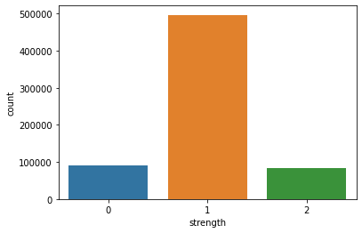

```python
import pandas as pd
import numpy as np
import seaborn as sns
import warnings
warnings.filterwarnings('ignore')
```

#### REading dataset


```python
data=pd.read_csv('E:\End-2-end Projects\Password_Classifier/data.csv',error_bad_lines=False)
data.head()
```

    b'Skipping line 2810: expected 2 fields, saw 5\nSkipping line 4641: expected 2 fields, saw 5\nSkipping line 7171: expected 2 fields, saw 5\nSkipping line 11220: expected 2 fields, saw 5\nSkipping line 13809: expected 2 fields, saw 5\nSkipping line 14132: expected 2 fields, saw 5\nSkipping line 14293: expected 2 fields, saw 5\nSkipping line 14865: expected 2 fields, saw 5\nSkipping line 17419: expected 2 fields, saw 5\nSkipping line 22801: expected 2 fields, saw 5\nSkipping line 25001: expected 2 fields, saw 5\nSkipping line 26603: expected 2 fields, saw 5\nSkipping line 26742: expected 2 fields, saw 5\nSkipping line 29702: expected 2 fields, saw 5\nSkipping line 32767: expected 2 fields, saw 5\nSkipping line 32878: expected 2 fields, saw 5\nSkipping line 35643: expected 2 fields, saw 5\nSkipping line 36550: expected 2 fields, saw 5\nSkipping line 38732: expected 2 fields, saw 5\nSkipping line 40567: expected 2 fields, saw 5\nSkipping line 40576: expected 2 fields, saw 5\nSkipping line 41864: expected 2 fields, saw 5\nSkipping line 46861: expected 2 fields, saw 5\nSkipping line 47939: expected 2 fields, saw 5\nSkipping line 48628: expected 2 fields, saw 5\nSkipping line 48908: expected 2 fields, saw 5\nSkipping line 57582: expected 2 fields, saw 5\nSkipping line 58782: expected 2 fields, saw 5\nSkipping line 58984: expected 2 fields, saw 5\nSkipping line 61518: expected 2 fields, saw 5\nSkipping line 63451: expected 2 fields, saw 5\nSkipping line 68141: expected 2 fields, saw 5\nSkipping line 72083: expected 2 fields, saw 5\nSkipping line 74027: expected 2 fields, saw 5\nSkipping line 77811: expected 2 fields, saw 5\nSkipping line 83958: expected 2 fields, saw 5\nSkipping line 85295: expected 2 fields, saw 5\nSkipping line 88665: expected 2 fields, saw 5\nSkipping line 89198: expected 2 fields, saw 5\nSkipping line 92499: expected 2 fields, saw 5\nSkipping line 92751: expected 2 fields, saw 5\nSkipping line 93689: expected 2 fields, saw 5\nSkipping line 94776: expected 2 fields, saw 5\nSkipping line 97334: expected 2 fields, saw 5\nSkipping line 102316: expected 2 fields, saw 5\nSkipping line 103421: expected 2 fields, saw 5\nSkipping line 106872: expected 2 fields, saw 5\nSkipping line 109363: expected 2 fields, saw 5\nSkipping line 110117: expected 2 fields, saw 5\nSkipping line 110465: expected 2 fields, saw 5\nSkipping line 113843: expected 2 fields, saw 5\nSkipping line 115634: expected 2 fields, saw 5\nSkipping line 121518: expected 2 fields, saw 5\nSkipping line 123692: expected 2 fields, saw 5\nSkipping line 124708: expected 2 fields, saw 5\nSkipping line 129608: expected 2 fields, saw 5\nSkipping line 133176: expected 2 fields, saw 5\nSkipping line 135532: expected 2 fields, saw 5\nSkipping line 138042: expected 2 fields, saw 5\nSkipping line 139485: expected 2 fields, saw 5\nSkipping line 140401: expected 2 fields, saw 5\nSkipping line 144093: expected 2 fields, saw 5\nSkipping line 149850: expected 2 fields, saw 5\nSkipping line 151831: expected 2 fields, saw 5\nSkipping line 158014: expected 2 fields, saw 5\nSkipping line 162047: expected 2 fields, saw 5\nSkipping line 164515: expected 2 fields, saw 5\nSkipping line 170313: expected 2 fields, saw 5\nSkipping line 171325: expected 2 fields, saw 5\nSkipping line 171424: expected 2 fields, saw 5\nSkipping line 175920: expected 2 fields, saw 5\nSkipping line 176210: expected 2 fields, saw 5\nSkipping line 183603: expected 2 fields, saw 5\nSkipping line 190264: expected 2 fields, saw 5\nSkipping line 191683: expected 2 fields, saw 5\nSkipping line 191988: expected 2 fields, saw 5\nSkipping line 195450: expected 2 fields, saw 5\nSkipping line 195754: expected 2 fields, saw 5\nSkipping line 197124: expected 2 fields, saw 5\nSkipping line 199263: expected 2 fields, saw 5\nSkipping line 202603: expected 2 fields, saw 5\nSkipping line 209960: expected 2 fields, saw 5\nSkipping line 213218: expected 2 fields, saw 5\nSkipping line 217060: expected 2 fields, saw 5\nSkipping line 220121: expected 2 fields, saw 5\nSkipping line 223518: expected 2 fields, saw 5\nSkipping line 226293: expected 2 fields, saw 5\nSkipping line 227035: expected 2 fields, saw 7\nSkipping line 227341: expected 2 fields, saw 5\nSkipping line 227808: expected 2 fields, saw 5\nSkipping line 228516: expected 2 fields, saw 5\nSkipping line 228733: expected 2 fields, saw 5\nSkipping line 232043: expected 2 fields, saw 5\nSkipping line 232426: expected 2 fields, saw 5\nSkipping line 234490: expected 2 fields, saw 5\nSkipping line 239626: expected 2 fields, saw 5\nSkipping line 240461: expected 2 fields, saw 5\nSkipping line 244518: expected 2 fields, saw 5\nSkipping line 245395: expected 2 fields, saw 5\nSkipping line 246168: expected 2 fields, saw 5\nSkipping line 246655: expected 2 fields, saw 5\nSkipping line 246752: expected 2 fields, saw 5\nSkipping line 247189: expected 2 fields, saw 5\nSkipping line 250276: expected 2 fields, saw 5\nSkipping line 255327: expected 2 fields, saw 5\nSkipping line 257094: expected 2 fields, saw 5\n'
    b'Skipping line 264626: expected 2 fields, saw 5\nSkipping line 265028: expected 2 fields, saw 5\nSkipping line 269150: expected 2 fields, saw 5\nSkipping line 271360: expected 2 fields, saw 5\nSkipping line 273975: expected 2 fields, saw 5\nSkipping line 274742: expected 2 fields, saw 5\nSkipping line 276227: expected 2 fields, saw 5\nSkipping line 279807: expected 2 fields, saw 5\nSkipping line 283425: expected 2 fields, saw 5\nSkipping line 287468: expected 2 fields, saw 5\nSkipping line 292995: expected 2 fields, saw 5\nSkipping line 293496: expected 2 fields, saw 5\nSkipping line 293735: expected 2 fields, saw 5\nSkipping line 295060: expected 2 fields, saw 5\nSkipping line 296643: expected 2 fields, saw 5\nSkipping line 296848: expected 2 fields, saw 5\nSkipping line 308926: expected 2 fields, saw 5\nSkipping line 310360: expected 2 fields, saw 5\nSkipping line 317004: expected 2 fields, saw 5\nSkipping line 318207: expected 2 fields, saw 5\nSkipping line 331783: expected 2 fields, saw 5\nSkipping line 333864: expected 2 fields, saw 5\nSkipping line 335958: expected 2 fields, saw 5\nSkipping line 336290: expected 2 fields, saw 5\nSkipping line 343526: expected 2 fields, saw 5\nSkipping line 343857: expected 2 fields, saw 5\nSkipping line 344059: expected 2 fields, saw 5\nSkipping line 348691: expected 2 fields, saw 5\nSkipping line 353446: expected 2 fields, saw 5\nSkipping line 357073: expected 2 fields, saw 5\nSkipping line 359753: expected 2 fields, saw 5\nSkipping line 359974: expected 2 fields, saw 5\nSkipping line 366534: expected 2 fields, saw 5\nSkipping line 369514: expected 2 fields, saw 5\nSkipping line 377759: expected 2 fields, saw 5\nSkipping line 379327: expected 2 fields, saw 5\nSkipping line 380769: expected 2 fields, saw 5\nSkipping line 381073: expected 2 fields, saw 5\nSkipping line 381489: expected 2 fields, saw 5\nSkipping line 386304: expected 2 fields, saw 5\nSkipping line 387635: expected 2 fields, saw 5\nSkipping line 389613: expected 2 fields, saw 5\nSkipping line 392604: expected 2 fields, saw 5\nSkipping line 393184: expected 2 fields, saw 5\nSkipping line 395530: expected 2 fields, saw 5\nSkipping line 396939: expected 2 fields, saw 5\nSkipping line 397385: expected 2 fields, saw 5\nSkipping line 397509: expected 2 fields, saw 5\nSkipping line 402902: expected 2 fields, saw 5\nSkipping line 405187: expected 2 fields, saw 5\nSkipping line 408412: expected 2 fields, saw 5\nSkipping line 419423: expected 2 fields, saw 5\nSkipping line 420962: expected 2 fields, saw 5\nSkipping line 425965: expected 2 fields, saw 5\nSkipping line 427496: expected 2 fields, saw 5\nSkipping line 438881: expected 2 fields, saw 5\nSkipping line 439776: expected 2 fields, saw 5\nSkipping line 440345: expected 2 fields, saw 5\nSkipping line 445507: expected 2 fields, saw 5\nSkipping line 445548: expected 2 fields, saw 5\nSkipping line 447184: expected 2 fields, saw 5\nSkipping line 448603: expected 2 fields, saw 5\nSkipping line 451732: expected 2 fields, saw 5\nSkipping line 458249: expected 2 fields, saw 5\nSkipping line 460274: expected 2 fields, saw 5\nSkipping line 467630: expected 2 fields, saw 5\nSkipping line 473961: expected 2 fields, saw 5\nSkipping line 476281: expected 2 fields, saw 5\nSkipping line 478010: expected 2 fields, saw 5\nSkipping line 478322: expected 2 fields, saw 5\nSkipping line 479999: expected 2 fields, saw 5\nSkipping line 480898: expected 2 fields, saw 5\nSkipping line 481688: expected 2 fields, saw 5\nSkipping line 485193: expected 2 fields, saw 5\nSkipping line 485519: expected 2 fields, saw 5\nSkipping line 486000: expected 2 fields, saw 5\nSkipping line 489063: expected 2 fields, saw 5\nSkipping line 494525: expected 2 fields, saw 5\nSkipping line 495009: expected 2 fields, saw 5\nSkipping line 501954: expected 2 fields, saw 5\nSkipping line 508035: expected 2 fields, saw 5\nSkipping line 508828: expected 2 fields, saw 5\nSkipping line 509833: expected 2 fields, saw 5\nSkipping line 510410: expected 2 fields, saw 5\nSkipping line 518229: expected 2 fields, saw 5\nSkipping line 520302: expected 2 fields, saw 5\nSkipping line 520340: expected 2 fields, saw 5\n'
    b'Skipping line 525174: expected 2 fields, saw 5\nSkipping line 526251: expected 2 fields, saw 5\nSkipping line 529611: expected 2 fields, saw 5\nSkipping line 531398: expected 2 fields, saw 5\nSkipping line 534146: expected 2 fields, saw 5\nSkipping line 544954: expected 2 fields, saw 5\nSkipping line 553002: expected 2 fields, saw 5\nSkipping line 553883: expected 2 fields, saw 5\nSkipping line 553887: expected 2 fields, saw 5\nSkipping line 553915: expected 2 fields, saw 5\nSkipping line 554172: expected 2 fields, saw 5\nSkipping line 563534: expected 2 fields, saw 5\nSkipping line 565191: expected 2 fields, saw 5\nSkipping line 574108: expected 2 fields, saw 5\nSkipping line 574412: expected 2 fields, saw 5\nSkipping line 575985: expected 2 fields, saw 5\nSkipping line 580091: expected 2 fields, saw 5\nSkipping line 582682: expected 2 fields, saw 5\nSkipping line 585885: expected 2 fields, saw 5\nSkipping line 590171: expected 2 fields, saw 5\nSkipping line 591924: expected 2 fields, saw 5\nSkipping line 592515: expected 2 fields, saw 5\nSkipping line 593888: expected 2 fields, saw 5\nSkipping line 596245: expected 2 fields, saw 5\nSkipping line 607344: expected 2 fields, saw 5\nSkipping line 607633: expected 2 fields, saw 5\nSkipping line 610939: expected 2 fields, saw 5\nSkipping line 613638: expected 2 fields, saw 5\nSkipping line 615643: expected 2 fields, saw 5\nSkipping line 615901: expected 2 fields, saw 5\nSkipping line 617389: expected 2 fields, saw 5\nSkipping line 634641: expected 2 fields, saw 5\nSkipping line 635755: expected 2 fields, saw 5\nSkipping line 646243: expected 2 fields, saw 5\nSkipping line 647165: expected 2 fields, saw 5\nSkipping line 648610: expected 2 fields, saw 5\nSkipping line 648772: expected 2 fields, saw 5\nSkipping line 651833: expected 2 fields, saw 5\nSkipping line 653663: expected 2 fields, saw 5\nSkipping line 656233: expected 2 fields, saw 5\nSkipping line 656694: expected 2 fields, saw 5\nSkipping line 659783: expected 2 fields, saw 5\nSkipping line 660478: expected 2 fields, saw 5\nSkipping line 661133: expected 2 fields, saw 5\nSkipping line 661736: expected 2 fields, saw 5\nSkipping line 669827: expected 2 fields, saw 5\n'


<div>
<style scoped>
    .dataframe tbody tr th:only-of-type {
        vertical-align: middle;
    }

    .dataframe tbody tr th {
        vertical-align: top;
    }

    .dataframe thead th {
        text-align: right;
    }
</style>
<table border="1" class="dataframe">
  <thead>
    <tr style="text-align: right;">
      <th></th>
      <th>password</th>
      <th>strength</th>
    </tr>
  </thead>
  <tbody>
    <tr>
      <th>0</th>
      <td>kzde5577</td>
      <td>1</td>
    </tr>
    <tr>
      <th>1</th>
      <td>kino3434</td>
      <td>1</td>
    </tr>
    <tr>
      <th>2</th>
      <td>visi7k1yr</td>
      <td>1</td>
    </tr>
    <tr>
      <th>3</th>
      <td>megzy123</td>
      <td>1</td>
    </tr>
    <tr>
      <th>4</th>
      <td>lamborghin1</td>
      <td>1</td>
    </tr>
  </tbody>
</table>
</div>


```python
data['strength'].unique()
```


    array([1, 2, 0], dtype=int64)


```python

```

#### code to check all the missing values in my dataset


```python
data.isna().sum()
```


    password    1
    strength    0
    dtype: int64


```python
data[data['password'].isnull()]
```


<div>
<style scoped>
    .dataframe tbody tr th:only-of-type {
        vertical-align: middle;
    }

    .dataframe tbody tr th {
        vertical-align: top;
    }

    .dataframe thead th {
        text-align: right;
    }
</style>
<table border="1" class="dataframe">
  <thead>
    <tr style="text-align: right;">
      <th></th>
      <th>password</th>
      <th>strength</th>
    </tr>
  </thead>
  <tbody>
    <tr>
      <th>367579</th>
      <td>NaN</td>
      <td>0</td>
    </tr>
  </tbody>
</table>
</div>


```python
data.dropna(inplace=True)
```


```python
data.isnull().sum()
```


    password    0
    strength    0
    dtype: int64


```python
sns.countplot(data['strength'])
```


    <matplotlib.axes._subplots.AxesSubplot at 0x1140874d08>


    

    


```python
password_tuple=np.array(data)
```


```python
password_tuple
```


    array([['kzde5577', 1],
           ['kino3434', 1],
           ['visi7k1yr', 1],
           ...,
           ['184520socram', 1],
           ['marken22a', 1],
           ['fxx4pw4g', 1]], dtype=object)


```python

```

#### shuffling randomly for robustness


```python
import random
random.shuffle(password_tuple)
```


```python
x=[labels[0] for labels in password_tuple]
y=[labels[1] for labels in password_tuple]

```


```python
x
```


    ['kzde5577',
     'kzde5577',
     'kino3434',
     'kino3434',
     'megzy123',
     'AVYq1lDE4MgAZfNt',
     'lamborghin1',
     'kino3434',
     'v1118714',
     'lamborghin1',
     'v1118714',
     'v1118714',
     'u6c8vhow',
     'lamborghin1',
     'AVYq1lDE4MgAZfNt',
     'jytifok873',
     'asv5o9yu',
     'as326159',
     'asv5o9yu',
     'v1118714',
     'jytifok873',
     'elyass15@ajilent-ci',
     'visi7k1yr',
     'v1118714',
     'visi7k1yr',
     'sbl571017',
     'intel1',
     'universe2908',
     'visi7k1yr',
     'megzy123',
     'v1118714',
     'asgaliu11',
     'visi7k1yr',
     'megzy123',
     'universe2908',
     'faranumar91',
     'elyass15@ajilent-ci',
     'memjan123',
     'jytifok873',
     'jerusalem393',
     'trabajonet9',
     'asgaliu11',
     'lsdlsd1',
     'asv5o9yu',
     'kzde5577',
     'yitbos77',
     'idofo673',
     'g067057895',
     'yitbos77',
     '52558000aaa',
     'jytifok873',
     '0169395484a',
     'yqugu927',
     'ejeko677',
     'gaymaids1',
     'intel1',
     'asv5o9yu',
     'as326159',
     'bozoxik602',
     'juliel009',
     'lsdlsd1',
     'visi7k1yr',
     'calcifer32',
     'b4NbTxDEyNgG141J',
     'megzy123',
     'cigicigi123',
     'AVYq1lDE4MgAZfNt',
     'kswa2mrv',
     'cigicigi123',
     'trabajonet9',
     'yqugu927',
     'faranumar91',
     'u6c8vhow',
     'olmaz.',
     'faranumar91',
     'exitos2009',
     'ok>bdk',
     'patri1973',
     'mickael12',
     'fk9qi21m',
     'matiofox08',
     '612035180tok',
     'czuodhj972',
     'u6c8vhow',
     'matiofox08',
     'prisonbreak1',
     'schalke04',
     'ejeko677',
     'k9b8cz6aj2',
     'fahad123',
     'lamborghin1',
     'trabajonet9',
     'juliana19',
     '123477889a',
     '283671gus',
     'pHyqueDIyNQ8vmhb',
     'asgaliu11',
     'obstacle25',
     'patri1973',
     'd04m11',
     'kjkjkj1',
     'p2share',
     'czuodhj972',
     'poseidon2011',
     'a2531106',
     'gdfn76',
     'yllime123',
     'poseidon2011',
     'bozoxik602',
     'matiofox08',
     'b4NbTxDEyNgG141J',
     '746xitEGiqObog',
     'ok>bdk',
     'jerusalem393',
     'jalingo1',
     'mmm23mm',
     'lamborghin1',
     'asgaliu11',
     'pHyqueDIyNQ8vmhb',
     '52558000aaa',
     'zoobike04',
     'czuodhj972',
     'ok>bdk',
     'bozoxik602',
     'trabajonet9',
     'ejeko677',
     '6975038lp',
     'woon12',
     'go7kew7a2po',
     'hpqkoxsn5',
     'bgrvl80',
     'portales1',
     '2021848709.',
     'ikanez886',
     'snolyuj04',
     'poseidon2011',
     'g067057895',
     'jUV4dSDQwNwPpA36',
     'vehat387',
     'asgaliu11',
     '3y6iwef2g6',
     'asv5o9yu',
     '2yz4ewwg',
     '2akira2',
     'icap12',
     'jUV4dSDQwNwPpA36',
     'visi7k1yr',
     'ga98SIzk0NwhiZaE',
     'AVYq1lDE4MgAZfNt',
     'sknq7m0',
     'olmaz.',
     'khmer100.03278&?><Mnb',
     'klara-tershina3H',
     'teemteem97',
     '2010server',
     'alimagik1',
     'portales1',
     'as326159',
     'gill02',
     'portales1',
     '52558000aaa',
     's4m2dx9e6',
     '6tequila6',
     'fk9qi21m',
     '2akira2',
     '6975038lp',
     'aquhih220',
     'yuri110995',
     'yitbos77',
     'zoobike04',
     'cesarmaio1',
     'kinga22',
     'yqugu927',
     '2021848709.',
     'cesarmaio1',
     'snolyuj04',
     'warriors08',
     'obstacle25',
     'alchimie79',
     'x8512514',
     'x8512514',
     'IjUcOtYqAwel725',
     'moken7',
     'demon10',
     'Iamthelegend1!',
     'teemteem97',
     'a2531106',
     '3vszncp4',
     'tia150979',
     's0xwym7h',
     'g3rappa',
     'pato221182',
     'mazdarx7',
     'znbl5tj1',
     's0xwym7h',
     'v1118714',
     'khmer100.03278&?><Mnb',
     'g3rappa',
     'ikanez886',
     'kunyukbabi69',
     'damyvo114',
     '5gzj5uf',
     'a2531106',
     'k1k2k3k4k5k6',
     'exitos2009',
     'snolyuj04',
     'denise18',
     'rogyh820',
     'prisonbreak1',
     'AVYq1lDE4MgAZfNt',
     'p2share',
     'taurofive16',
     'hodygid757',
     'farrukhcse12',
     'intel1',
     'alchimie79',
     'ebacuro434',
     'd04m11',
     'rntprns7',
     'tucagu356',
     'potatobus150',
     'gkrqjs6',
     'denise18',
     'kVczcljg4OA25Aeb',
     'jerusalem393',
     '4osxw4r',
     'jerusalem393',
     '7942vikas',
     'g3rappa',
     'XqMB7vDMzOQocAFV',
     'b4NbTxDEyNgG141J',
     'X9WVojjE4MgVAIiR',
     'kyxvufl37',
     'www32223222',
     'fk9qi21m',
     'khmer100.03278&?><Mnb',
     'c3h8bkzr',
     'gozv3e5',
     'faranumar91',
     'njmania114',
     'ubojig109',
     'bugatti01',
     'hodygid757',
     '838188linh',
     'polo2014',
     'omakiva153',
     'XqMB7vDMzOQocAFV',
     'il0vey0u',
     'elonex24',
     'finisterra1',
     'kyxvufl37',
     'ga98SIzk0NwhiZaE',
     'yut0838828185',
     'kino3434',
     'il0vey0u',
     'elyass15@ajilent-ci',
     'patri1973',
     'z7zbgIDkzMQeHUd9',
     'atigi839',
     'openup12',
     'uou2dae',
     '6975038lp',
     'alchimie79',
     'k9b8cz6aj2',
     'AVYq1lDE4MgAZfNt',
     'bgrvl80',
     'z888888',
     'omakiva153',
     'ubojig109',
     'gkrqjs6',
     'enziitoo1234',
     'nello11',
     'jalal123456',
     'yuri110995',
     'matiofox08',
     'barboza221294',
     'ok>bdk',
     'enziitoo1234',
     'peluchin4',
     'hpqkoxsn5',
     '7mV0pKTA3MgHy8Jv',
     '1katertje',
     'universe2908',
     'djngeyut2707',
     'pHyqueDIyNQ8vmhb',
     'marita1',
     'juliana19',
     'zgmfnwuq25',
     'rogyh820',
     'tamanagung6',
     'mario489800',
     '123net123',
     '10Erjrlmebup0n',
     'p@sslng2diword',
     '20010509wang',
     'tamanagung6',
     'tia150979',
     '1972vishara',
     'damyvo114',
     'prisonbreak1',
     'XqMB7vDMzOQocAFV',
     'mike09',
     'meriton23',
     'rogyh820',
     '2akira2',
     'tamanagung6',
     'hqh2eYjQxOQPYIsA',
     'khmer100.03278&?><Mnb',
     'v10rica',
     'rogyh820',
     'z3ro1sm',
     'damyvo114',
     'roxana1993',
     'gaymaids1',
     'xp;ysmybst',
     'balamuc123',
     'ajyrew547',
     'yu4cmn',
     'oekojWyH120063',
     '12345yolanda',
     'calcifer32',
     '147963asd',
     'zgmfnwuq25',
     'tamanagung6',
     'markama10',
     'yut0838828185',
     'hosna1368',
     'jEzZXUTE3MgJ4fVk',
     'z7zbgIDkzMQeHUd9',
     'q0pv0fk',
     'IjUcOtYqAwel725',
     'xW8-3w7-MFB-CKH',
     '26522876p',
     'bozoxik602',
     'afavin964',
     'taurofive16',
     'openup12',
     '1972vishara',
     'ycqtgdso3',
     'e667794c1d',
     'gill02',
     'kP82iqDMxNgBMxBP',
     'poseidon2011',
     '6tequila6',
     'khaled12',
     'cdann123',
     'finisterra1',
     '612035180tok',
     'p2share',
     'roxana1993',
     '2yz4ewwg',
     '215466kenyi',
     'bellsuki1',
     'abizar08',
     'bozoxik602',
     'pazzini24',
     'nello11',
     'a2486315',
     '3y6iwef2g6',
     'a2486315',
     'samael666',
     'webstudio8',
     'mario489800',
     'a03242241431a',
     'x8512514',
     'balamuc123',
     'cUFUSYKIPuGo024',
     '123nicole',
     'warriors08',
     'nK0yKXTU0NQHZE2e',
     'matiofox08',
     'ryjypes139',
     'xanyrum650',
     'portales1',
     'schalke04',
     'weicat12',
     'clyioqzgw42',
     'vehat387',
     '07dpv1127b',
     'wycinu436',
     '7mV0pKTA3MgHy8Jv',
     '1qa2ws3ed4r',
     'g067057895',
     'elyass15@ajilent-ci',
     'juliel009',
     'pablo321159',
     'khmer100.03278&?><Mnb',
     'a2486315',
     'barra23',
     'wibi182d',
     'yu4cmn',
     'gill02',
     'hasan18',
     'openup12',
     'ginger972',
     'lymuvop730',
     'alimagik1',
     'woon12',
     'acetita478',
     'juliana19',
     'polo2014',
     'poseidon2011',
     'webstudio8',
     'webstudio8',
     '631ihOZogELoVap',
     'njmania114',
     'kry1z9',
     'clyioqzgw42',
     'colorado27',
     'p2share',
     'vgnfs495vp',
     'X9WVojjE4MgVAIiR',
     'kzde5577',
     'jytifok873',
     'krishna2',
     'asdasdf1',
     'a03242241431a',
     'ram@!sita15392',
     '64959rodro',
     'farrukhcse12',
     'balamuc123',
     '1972vishara',
     'gerardway1',
     'olmaz.',
     'warriors08',
     'parvizrus13',
     'metopelo1623',
     'u03kz6ez',
     'iwaguh884',
     'njmania114',
     'ok>bdk',
     'a2486315',
     'aslpls2009',
     'aslpls2009',
     'mustang337',
     'XqMB7vDMzOQocAFV',
     '4fqa52vecr',
     's0xwym7h',
     'yu86640132',
     'gandhi8513',
     '123477889a',
     'pHyqueDIyNQ8vmhb',
     'kuntz80',
     'QWERTY0011',
     'llahetihw1',
     'laedbchsx687',
     'JEQuloqOFUd102',
     'kdl9cl53',
     '52558000aaa',
     'd6VyrkFV6oblxNs5N8cW',
     'gtlek',
     'frhnsvelhfr1',
     'lrhxmevb620',
     'ginger972',
     'clave08',
     'yitbos77',
     'fk9qi21m',
     'sofietou74',
     'zgmfnwuq25',
     'universe2908',
     'walterivl13',
     'examy624',
     '52558000aaa',
     'just1n0k',
     's4m2dx9e6',
     'spl51190595',
     'jUV4dSDQwNwPpA36',
     'kunyukbabi69',
     'tia150979',
     'rakag279',
     '9950twofour0',
     'lrhxmevb620',
     'u6c8vhow',
     'a03242241431a',
     'hasan18',
     'patri1973',
     'gerardway1',
     'teemteem97',
     'IRZA98',
     'QWERTY0011',
     '19840510kkk1',
     'fr8OClDY1MAdEhHa',
     'zoobike04',
     'cerner09',
     'njmania114',
     'xlxlxl777',
     'z7zbgIDkzMQeHUd9',
     'cdann123',
     'QWERTY0011',
     'wasanun13',
     'qopybuxi2',
     'laedbchsx687',
     '33kanun03',
     'novelia21',
     'tin030201',
     'kino3434',
     'Scipio21152030067254',
     'olmaz.',
     'mohantra1',
     'frhnsvelhfr1',
     'aslpls2009',
     'calcifer32',
     'mathilde54550',
     'galoucura1',
     'faranumar91',
     '3CgRg8DA1NQY1iEj',
     'grazi0201',
     '4osxw4r',
     'ubojig109',
     'pikey231',
     'qn5xpg3k00',
     'hola45',
     'novelia21',
     'password0880',
     'control9',
     'sanjaime1',
     'poilkjmnb987',
     'elyass15@ajilent-ci',
     'teemteem97',
     'saule123',
     'kXzWOozU2MQ1Jv1h',
     'sydney213',
     'eth36498',
     'faisal213',
     'buqodym199',
     'elonex24',
     'qefoquf1uf',
     'djngeyut2707',
     'lsdlsd1',
     'vietnga92',
     'prisonbreak1',
     '238wofutUtIGyf',
     'njmania114',
     'elabadmin1386',
     'cigicigi123',
     'p3rf3ct0',
     'mashhood_afzal21087',
     'b9m7cxcgc',
     'grazi0201',
     'robot425',
     'denise18',
     'lqksuym982',
     'balamuc123',
     'buqodym199',
     'prisonbreak1',
     'Oshity07142014',
     'kyodai666',
     'kukimuki123',
     'asgaliu11',
     'hasan18',
     'pilatyj280',
     'folashade1',
     'kzde5577',
     'matiz4533',
     'kenyu001',
     'nello11',
     'wo9aiwangyan',
     '248sUqiFEJuRag',
     'nLIGyhTU1NQTAp6u',
     'wasanun13',
     'sanki1',
     's4m2dx9e6',
     'kVczcljg4OA25Aeb',
     'kXzWOozU2MQ1Jv1h',
     'fudijep286',
     'adminmao888',
     'taiga0088',
     'kah4544875',
     '0112358mayin0',
     'urban1',
     'amoadios321',
     'aosmaxd0',
     'aslpls2009',
     'meriton23',
     'klara-tershina3H',
     'stalucia66',
     'han19660120',
     'sbnivetha123',
     'bgrvl80',
     '01161590m',
     'tin030201',
     'rakag279',
     'jEzZXUTE3MgJ4fVk',
     '3f5xd41l0ik7',
     'wasanun13',
     'mdaffandi74',
     't8IkFRDIxMAFV2JW',
     'ixehawojEPe418',
     'fbjurcd961',
     'limichan99',
     'olyucskw52',
     'avanakit72',
     'sbl571017',
     'c3h8bkzr',
     'kayal123',
     'ycqtgdso3',
     'iacool99',
     'junaid5',
     'matiofox08',
     'a2531106',
     'pato221182',
     'iwaguh884',
     'ts34a3fodh3i',
     'kry1z9',
     'c1brb3lt',
     'kahcyxvj24',
     'juliel009',
     'ejeko677',
     'kevin24',
     'afavin964',
     'sebo82',
     'matiz4533',
     'n501iomf',
     'taccy12',
     'webhost08',
     'xp;ysmybst',
     'matha81',
     '123477889a',
     '72o0yzekib4',
     'sanjaime1',
     'teste10',
     '283671gus',
     '159951josh',
     'yogesh143',
     'vardhan19',
     'gutergut599',
     'wo9aiwangyan',
     'g067057895',
     'kenyu001',
     'franczuk33',
     'ppnyadam09',
     'teste10',
     'zgmfnwuq25',
     'kzde5577',
     'jannia5',
     'w1ll1ams',
     'paulino123',
     'p2share',
     'tahseen75',
     '8g8x2su3',
     'g3rappa',
     'kayal123',
     'afs34214',
     '0VKWoODkwOAc0pZK',
     'c3h8bkzr',
     'afavin964',
     'TyWM72UNEex8Q8Y',
     'yllime123',
     'webhost08',
     'b4NbTxDEyNgG141J',
     'clumsy0619',
     'RqsuUsDYxNgr8T40',
     'lqksuym982',
     'legna13',
     'xlxlxl777',
     'gandhi8513',
     'webstudio8',
     'ci0n3exor',
     '8g8x2su3',
     'patata91',
     'j03l4ytr1',
     'sasuke4',
     'synyxyr723',
     'bghuyku37',
     'pugceya468',
     'ginger972',
     'a2531106',
     'han19660120',
     'zedika521',
     'pukiw102',
     'ns2b0727',
     'ldteugao6',
     'd4xQ3LjUwMQFVCYQ',
     'vietnga92',
     'sbnivetha123',
     'natalia12',
     'v1s2c3456',
     'yogesh143',
     'gvczfel801',
     '3f5xd41l0ik7',
     'BZVQZBTM1MApRV7s',
     'padhila30',
     '1justogax',
     'megzy123',
     'fahad123',
     'pacific52',
     'lymuvop730',
     'raykuaz32',
     'princ3sa',
     'fahad123',
     '2fakjv',
     'afavin964',
     'aosmaxd0',
     'obstacle25',
     'sandra0547',
     'josue12',
     'examy624',
     'Zdyf0kjMzNQycqPx',
     'yu86640132',
     'ilunia20',
     'onurb1994',
     'lymuvop730',
     'Herzberg@ABBOTT33656888commerce',
     'nokia6020',
     'mashhood_afzal21087',
     'groster152',
     'rrilni1747',
     'taulant123',
     'ppnyadam09',
     'faranumar91',
     'uqilyni846',
     'gill02',
     'metopelo1623',
     '2021848709.',
     '9950twofour0',
     '00J46LTAxMgME7C4',
     'enziitoo1234',
     'urban1',
     'vuqADUSatAJO800',
     'numero2',
     'olyucskw52',
     '1972vishara',
     'idofo673',
     'd04m11',
     'hello2104',
     'kahcyxvj24',
     'CabezaDePollo476',
     'djngeyut2707',
     'iacool99',
     'samael666',
     'buqodym199',
     'abizar08',
     'anon13',
     'sysoja794',
     '2652033abc',
     'senghong2009',
     'pugceya468',
     'sun4shine76',
     'diegote10',
     'RPFUOUDQwMwVW0AS',
     'edcmki90',
     'g067057895',
     'metopelo1623',
     'megdam55',
     'adminmao888',
     'novelia21',
     '07dpv1127b',
     'Ju6BIMTU0MwYXtL4',
     'cesarmaio1',
     'sasuke4',
     'qn5xpg3k00',
     'faqih82',
     'v1118714',
     'gkrqjs6',
     'nK0yKXTU0NQHZE2e',
     'mdaffandi74',
     'oscar2002',
     'julie1989',
     'rogama69',
     'mzhrmir786',
     'RPFUOUDQwMwVW0AS',
     'j2yj2yj2y',
     'barra23',
     'jbtcnd6',
     'wo9aiwangyan',
     'woaini0',
     'ykfums1',
     'growerz543',
     'as8594505',
     '64959rodro',
     'g067057895',
     '3y6iwef2g6',
     'hello2104',
     '2GnTStTE4Mw4MTwv',
     'Truelove19902610',
     '4osxw4r',
     'oscar69',
     'deryxi704',
     'coy29061994',
     'seng987321',
     'czuodhj972',
     'jeeves123',
     'wearehis7',
     'lqksuym982',
     'mayur@8netinfotech',
     'kdl9cl53',
     'bghuyku37',
     'MT766631',
     'butisugo39',
     'khmer100.03278&?><Mnb',
     '746xitEGiqObog',
     'Iamthelegend1!',
     'qn5xpg3k00',
     'hello2104',
     'ym2130104',
     'saule123',
     '1katertje',
     'gpc151192',
     'fr8OClDY1MAdEhHa',
     'nhfdff2512',
     'sydney213',
     'vestax25',
     'peluchin4',
     'hodygid757',
     'alodise603',
     'icap12',
     'tim80327',
     'asdasdf1',
     'jUV4dSDQwNwPpA36',
     'vmdo3i',
     'rsuvxz08b',
     'mashhood_afzal21087',
     'kunyukbabi69',
     'mike09',
     'tot2531s',
     'kubafu77',
     'gdfn76',
     'tiga33',
     'goony01',
     'ekufite742',
     'prisonbreak1',
     'emufat882',
     '0123one47',
     'kaiden12',
     'ejeko677',
     'BB11227122',
     '0VKWoODkwOAc0pZK',
     'hosna1368',
     'synyxyr723',
     'oatcake87',
     'TyWM72UNEex8Q8Y',
     'fahad123',
     'rogyh820',
     'pHyqueDIyNQ8vmhb',
     'nello11',
     'uqilyni846',
     'sarahi1628',
     'wjngzro27',
     '9950twofour0',
     '7l1hu1xa',
     '12345yolanda',
     'h3ndr4',
     'oscar2002',
     'clave08',
     'ekufite742',
     'moimoimoi9',
     'j09000',
     'AVYq1lDE4MgAZfNt',
     'demon10',
     'shH3t7TcyOQwKRLt',
     'cyborged69',
     'z888888',
     '1ngaymuadong',
     'paola1995',
     'memjan123',
     'sknq7m0',
     'planes123',
     'caramelo9',
     'clumsy0619',
     'xzeyfbi495',
     'junaid5',
     'zb08110229',
     '1w2e3s4l5e6y',
     'mazdarx7',
     '1907sedat58',
     'gaymaids1',
     'WUt9IZzE0OQ7PkNE',
     '123456789YO',
     'juany57',
     '2010server',
     'la3na4you',
     'vestax25',
     'nello11',
     'poluxyj32',
     'sbaUsoTA1OAzuevI',
     'oatcake87',
     'v1s2c3456',
     'mndzbqkv651',
     '3clrcaevu7',
     'ilonu497',
     'coy29061994',
     'ebacuro434',
     'ci0n3exor',
     '1qa2ws3ed4rf',
     'x57669',
     '8g8x2su3',
     'graciela2',
     'paulino123',
     'ryjypes139',
     'u03kz6ez',
     'sex1353245',
     'aan2900220',
     'IRZA98',
     '929865yt',
     'bgrvl80',
     'PEPITO00',
     'nicolas05',
     'jr88072635',
     'kry1z9',
     'kuntz80',
     'mario489800',
     'sono11',
     'pekai2004',
     'pastorius88',
     'paws1111',
     'qefoquf1uf',
     'kyodai666',
     'asv5o9yu',
     'ic8i6ac',
     'up8444',
     'cristiano7',
     '52558000aaa',
     'czuodhj972',
     'TyWM72UNEex8Q8Y',
     'bambink182',
     'uziwocy148',
     'JEQuloqOFUd102',
     '000martin',
     'demanet147',
     'clave2013',
     'caitianci33',
     '029992546sj',
     'cerner09',
     'xawipy995',
     'artom111478',
     'ikanez886',
     '2akira2',
     'roxana1993',
     'vocal0619',
     'cristiano7',
     'uou2dae',
     '159951josh',
     'tahseen75',
     '52558000aaa',
     'mmm23mm',
     '1justogax',
     'nokia6020',
     'spl51190595',
     'icap12',
     '123nicole',
     'parent777',
     'ahibyg892',
     'laedbchsx687',
     'd4xQ3LjUwMQFVCYQ',
     'gandhi8513',
     'ebogel225',
     'gandhi8513',
     '147963asd',
     'idofo673',
     'killer5',
     'jeckericek24',
     'Herzberg@ABBOTT33656888commerce',
     'igejasy712',
     '10Elgei1ygybpw',
     'paul2007',
     'icap12',
     'failz0r',
     'kitty555',
     'Truelove19902610',
     'alimagik1',
     'ppnyadam09',
     '123maxbala',
     'yu4cmn',
     '123nicole',
     'tukaxo486',
     'afs34214',
     'lizbeth12',
     '0870330135a',
     '9h7v4z91',
     'matiz4533',
     'c3h8bkzr',
     'wbtdrieus345',
     'webhost08',
     'fbjurcd961',
     'w1ll1ams',
     'creeped12',
     'afan520307',
     'emufat882',
     'jaciara25',
     'moimoimoi9',
     'llahetihw1',
     'd04m11',
     'SLAEgyTk0OQxphJq',
     'rogama69',
     'sucupi516',
     'pr0f1s10',
     'jeckericek24',
     'emufat882',
     'znbl5tj1',
     'weicat12',
     'kdl9cl53',
     'ts02521712',
     'finisterra1',
     'tamanagung6',
     'MT766631',
     'ashaii12',
     'w1ll1ams',
     'seller1',
     'igoj0w740luj',
     'jj46azbo',
     ...]


```python

```

#### create a custom function to split input into characters of list


```python
def word_divide_char(inputs):
    character=[]
    for i in inputs:
        character.append(i)
    return character
```


```python
word_divide_char('kzde5577')
```


    ['k', 'z', 'd', 'e', '5', '5', '7', '7']


```python

```

#### import TF-IDF vectorizer to convert String data into numerical data


```python
from sklearn.feature_extraction.text import TfidfVectorizer
```


```python
vectorizer=TfidfVectorizer(tokenizer=word_divide_char)
```

#### apply TF-IDF vectorizer on data


```python
X=vectorizer.fit_transform(x)
```


```python
X.shape
```


    (669639, 128)


```python
vectorizer.get_feature_names()
```


    ['\x04',
     '\x05',
     '\x06',
     '\x08',
     '\x0e',
     '\x10',
     '\x11',
     '\x12',
     '\x16',
     '\x17',
     '\x19',
     '\x1b',
     '\x1c',
     '\x1e',
     ' ',
     '!',
     '"',
     '#',
     '$',
     '%',
     '&',
     '(',
     ')',
     '*',
     '+',
     '-',
     '.',
     '/',
     '0',
     '1',
     '2',
     '3',
     '4',
     '5',
     '6',
     '7',
     '8',
     '9',
     ';',
     '<',
     '=',
     '>',
     '?',
     '@',
     '[',
     '\\',
     ']',
     '^',
     '_',
     '`',
     'a',
     'b',
     'c',
     'd',
     'e',
     'f',
     'g',
     'h',
     'i',
     'j',
     'k',
     'l',
     'm',
     'n',
     'o',
     'p',
     'q',
     'r',
     's',
     't',
     'u',
     'v',
     'w',
     'x',
     'y',
     'z',
     '{',
     '|',
     '}',
     '~',
     '\x7f',
     '\x81',
     '\x8d',
     '\xa0',
     '¡',
     '¨',
     '«',
     '°',
     '±',
     '²',
     '³',
     '´',
     'µ',
     '¶',
     '·',
     '¹',
     'º',
     '¾',
     '¿',
     'ß',
     'à',
     'á',
     'â',
     'ä',
     'å',
     'æ',
     'ç',
     'è',
     'ê',
     'î',
     'ð',
     'ñ',
     'ò',
     'ó',
     'ô',
     'õ',
     'ö',
     '÷',
     'ú',
     'û',
     'ý',
     'þ',
     'ÿ',
     'œ',
     '—',
     '‚',
     '‹',
     '›']


```python
first_document_vector=X[0]
first_document_vector
```


    <1x128 sparse matrix of type '<class 'numpy.float64'>'
    	with 6 stored elements in Compressed Sparse Row format>


```python
first_document_vector.T.todense()
```


    matrix([[0.        ],
            [0.        ],
            [0.        ],
            [0.        ],
            [0.        ],
            [0.        ],
            [0.        ],
            [0.        ],
            [0.        ],
            [0.        ],
            [0.        ],
            [0.        ],
            [0.        ],
            [0.        ],
            [0.        ],
            [0.        ],
            [0.        ],
            [0.        ],
            [0.        ],
            [0.        ],
            [0.        ],
            [0.        ],
            [0.        ],
            [0.        ],
            [0.        ],
            [0.        ],
            [0.        ],
            [0.        ],
            [0.        ],
            [0.        ],
            [0.        ],
            [0.        ],
            [0.        ],
            [0.56744396],
            [0.        ],
            [0.59121824],
            [0.        ],
            [0.        ],
            [0.        ],
            [0.        ],
            [0.        ],
            [0.        ],
            [0.        ],
            [0.        ],
            [0.        ],
            [0.        ],
            [0.        ],
            [0.        ],
            [0.        ],
            [0.        ],
            [0.        ],
            [0.        ],
            [0.        ],
            [0.2857414 ],
            [0.22130957],
            [0.        ],
            [0.        ],
            [0.        ],
            [0.        ],
            [0.        ],
            [0.29161928],
            [0.        ],
            [0.        ],
            [0.        ],
            [0.        ],
            [0.        ],
            [0.        ],
            [0.        ],
            [0.        ],
            [0.        ],
            [0.        ],
            [0.        ],
            [0.        ],
            [0.        ],
            [0.        ],
            [0.33585783],
            [0.        ],
            [0.        ],
            [0.        ],
            [0.        ],
            [0.        ],
            [0.        ],
            [0.        ],
            [0.        ],
            [0.        ],
            [0.        ],
            [0.        ],
            [0.        ],
            [0.        ],
            [0.        ],
            [0.        ],
            [0.        ],
            [0.        ],
            [0.        ],
            [0.        ],
            [0.        ],
            [0.        ],
            [0.        ],
            [0.        ],
            [0.        ],
            [0.        ],
            [0.        ],
            [0.        ],
            [0.        ],
            [0.        ],
            [0.        ],
            [0.        ],
            [0.        ],
            [0.        ],
            [0.        ],
            [0.        ],
            [0.        ],
            [0.        ],
            [0.        ],
            [0.        ],
            [0.        ],
            [0.        ],
            [0.        ],
            [0.        ],
            [0.        ],
            [0.        ],
            [0.        ],
            [0.        ],
            [0.        ],
            [0.        ],
            [0.        ],
            [0.        ],
            [0.        ]])


```python
df=pd.DataFrame(first_document_vector.T.todense(),index=vectorizer.get_feature_names(),columns=['TF-IDF'])
df.sort_values(by=['TF-IDF'],ascending=False)
```


<div>
<style scoped>
    .dataframe tbody tr th:only-of-type {
        vertical-align: middle;
    }

    .dataframe tbody tr th {
        vertical-align: top;
    }

    .dataframe thead th {
        text-align: right;
    }
</style>
<table border="1" class="dataframe">
  <thead>
    <tr style="text-align: right;">
      <th></th>
      <th>TF-IDF</th>
    </tr>
  </thead>
  <tbody>
    <tr>
      <th>7</th>
      <td>0.591218</td>
    </tr>
    <tr>
      <th>5</th>
      <td>0.567444</td>
    </tr>
    <tr>
      <th>z</th>
      <td>0.335858</td>
    </tr>
    <tr>
      <th>k</th>
      <td>0.291619</td>
    </tr>
    <tr>
      <th>d</th>
      <td>0.285741</td>
    </tr>
    <tr>
      <th>...</th>
      <td>...</td>
    </tr>
    <tr>
      <th>;</th>
      <td>0.000000</td>
    </tr>
    <tr>
      <th>9</th>
      <td>0.000000</td>
    </tr>
    <tr>
      <th>8</th>
      <td>0.000000</td>
    </tr>
    <tr>
      <th>6</th>
      <td>0.000000</td>
    </tr>
    <tr>
      <th>›</th>
      <td>0.000000</td>
    </tr>
  </tbody>
</table>
<p>128 rows × 1 columns</p>
</div>


```python

```

#### split data into train & test
    train---> To learn the relationship within data, 
    test-->  To do predictions, and this testing data will be unseen to my model


```python
from sklearn.model_selection import train_test_split
```


```python
X_train, X_test, y_train, y_test=train_test_split(X,y,test_size=0.2)
```


```python
X_train.shape
```


    (535711, 128)


```python
from sklearn.linear_model import LogisticRegression
```


```python

```

#### Apply Logistic on data as use-cas is Classification


```python
clf=LogisticRegression(random_state=0,multi_class='multinomial')
```


```python
clf.fit(X_train,y_train)
```


    LogisticRegression(C=1.0, class_weight=None, dual=False, fit_intercept=True,
                       intercept_scaling=1, l1_ratio=None, max_iter=100,
                       multi_class='multinomial', n_jobs=None, penalty='l2',
                       random_state=0, solver='lbfgs', tol=0.0001, verbose=0,
                       warm_start=False)


```python

```

#### doing prediction for specific custom data


```python
dt=np.array(['%@123abcd'])
pred=vectorizer.transform(dt)
clf.predict(pred)
```


    array([1])


```python

```

#### doing prediction on X-Test data


```python
y_pred=clf.predict(X_test)
y_pred
```


    array([1, 2, 2, ..., 1, 1, 1])


```python

```

#### check Accuracy of your model using confusion_matrix,accuracy_score


```python
from sklearn.metrics import confusion_matrix,accuracy_score
```


```python
cm=confusion_matrix(y_test,y_pred)
print(cm)
print(accuracy_score(y_test,y_pred))
```

    [[ 5338 12530    18]
     [ 3811 92928  2629]
     [   50  4982 11642]]
    0.8206499014395795


```python

```

##### create report of your model


```python
from sklearn.metrics import classification_report
print(classification_report(y_test,y_pred))
```

                  precision    recall  f1-score   support
    
               0       0.58      0.30      0.39     17886
               1       0.84      0.94      0.89     99368
               2       0.81      0.70      0.75     16674
    
        accuracy                           0.82    133928
       macro avg       0.75      0.64      0.68    133928
    weighted avg       0.80      0.82      0.80    133928
    


```python

```


```python

```
