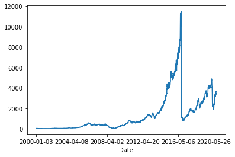
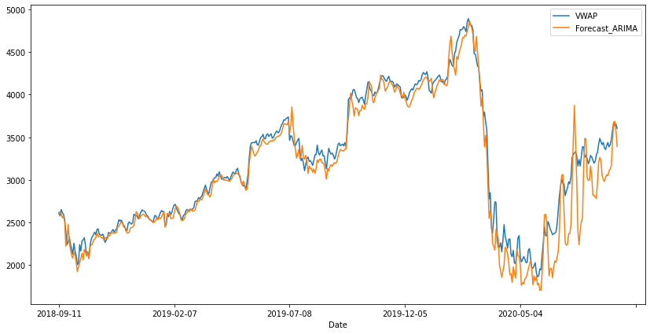

### Reading the market data of BAJAJFINSV stock and preparing a training dataset and validation dataset.


```python
import pandas as pd
import numpy as np
```


```python
df=pd.read_csv('E:\End-2-end Projects\Time_Series/BAJFINANCE.csv')
df.head()
```


<div>
<style scoped>
    .dataframe tbody tr th:only-of-type {
        vertical-align: middle;
    }

    .dataframe tbody tr th {
        vertical-align: top;
    }

    .dataframe thead th {
        text-align: right;
    }
</style>
<table border="1" class="dataframe">
  <thead>
    <tr style="text-align: right;">
      <th></th>
      <th>Date</th>
      <th>Symbol</th>
      <th>Series</th>
      <th>Prev Close</th>
      <th>Open</th>
      <th>High</th>
      <th>Low</th>
      <th>Last</th>
      <th>Close</th>
      <th>VWAP</th>
      <th>Volume</th>
      <th>Turnover</th>
      <th>Trades</th>
      <th>Deliverable Volume</th>
      <th>%Deliverble</th>
    </tr>
  </thead>
  <tbody>
    <tr>
      <th>0</th>
      <td>2000-01-03</td>
      <td>BAJAUTOFIN</td>
      <td>EQ</td>
      <td>46.95</td>
      <td>49.45</td>
      <td>50.75</td>
      <td>46.5</td>
      <td>50.75</td>
      <td>50.75</td>
      <td>50.05</td>
      <td>7600</td>
      <td>3.803800e+10</td>
      <td>NaN</td>
      <td>NaN</td>
      <td>NaN</td>
    </tr>
    <tr>
      <th>1</th>
      <td>2000-01-04</td>
      <td>BAJAUTOFIN</td>
      <td>EQ</td>
      <td>50.75</td>
      <td>53.20</td>
      <td>53.20</td>
      <td>47.9</td>
      <td>48.00</td>
      <td>48.10</td>
      <td>48.56</td>
      <td>5000</td>
      <td>2.428000e+10</td>
      <td>NaN</td>
      <td>NaN</td>
      <td>NaN</td>
    </tr>
    <tr>
      <th>2</th>
      <td>2000-01-05</td>
      <td>BAJAUTOFIN</td>
      <td>EQ</td>
      <td>48.10</td>
      <td>46.55</td>
      <td>47.40</td>
      <td>44.6</td>
      <td>44.60</td>
      <td>44.60</td>
      <td>45.47</td>
      <td>3500</td>
      <td>1.591450e+10</td>
      <td>NaN</td>
      <td>NaN</td>
      <td>NaN</td>
    </tr>
    <tr>
      <th>3</th>
      <td>2000-01-06</td>
      <td>BAJAUTOFIN</td>
      <td>EQ</td>
      <td>44.60</td>
      <td>43.50</td>
      <td>46.00</td>
      <td>42.1</td>
      <td>46.00</td>
      <td>45.25</td>
      <td>44.43</td>
      <td>6200</td>
      <td>2.754750e+10</td>
      <td>NaN</td>
      <td>NaN</td>
      <td>NaN</td>
    </tr>
    <tr>
      <th>4</th>
      <td>2000-01-07</td>
      <td>BAJAUTOFIN</td>
      <td>EQ</td>
      <td>45.25</td>
      <td>48.00</td>
      <td>48.00</td>
      <td>42.0</td>
      <td>42.90</td>
      <td>42.90</td>
      <td>44.44</td>
      <td>3500</td>
      <td>1.555550e+10</td>
      <td>NaN</td>
      <td>NaN</td>
      <td>NaN</td>
    </tr>
  </tbody>
</table>
</div>


```python
df.set_index('Date',inplace=True)
```


```python

```

#### Plotting the target variable VWAP over time


```python
df['VWAP'].plot()
```


    <matplotlib.axes._subplots.AxesSubplot at 0x3e7d032588>


    

    


### so u can observe here some kind of Seasonality
Feature Engineering
Almost every time series problem will have some external features or some internal feature engineering to help the model.

Let's add some basic features like lag values of available numeric features that are widely used for time series problems. Since we need to predict the price of the stock for a day, we cannot use the feature values of the same day since they will be unavailable at actual inference time. We need to use statistics like mean, standard deviation of their lagged values.

We will use three sets of lagged values, one previous day, one looking back 7 days and another looking back 30 days as a proxy for last week and last month metrics.
### Data Pre-Processing


```python
df.shape
```


    (5070, 14)


```python
df.isna().sum()
```


    Symbol                   0
    Series                   0
    Prev Close               0
    Open                     0
    High                     0
    Low                      0
    Last                     0
    Close                    0
    VWAP                     0
    Volume                   0
    Turnover                 0
    Trades                2779
    Deliverable Volume     446
    %Deliverble            446
    dtype: int64


```python
df.dropna(inplace=True)
```


```python
df.isna().sum()
```


    Symbol                0
    Series                0
    Prev Close            0
    Open                  0
    High                  0
    Low                   0
    Last                  0
    Close                 0
    VWAP                  0
    Volume                0
    Turnover              0
    Trades                0
    Deliverable Volume    0
    %Deliverble           0
    dtype: int64


```python
df.shape
```


    (2291, 14)


```python
data=df.copy()
```


```python
data.dtypes
```


    Symbol                 object
    Series                 object
    Prev Close            float64
    Open                  float64
    High                  float64
    Low                   float64
    Last                  float64
    Close                 float64
    VWAP                  float64
    Volume                  int64
    Turnover              float64
    Trades                float64
    Deliverable Volume    float64
    %Deliverble           float64
    dtype: object


```python
data.columns
```


    Index(['Symbol', 'Series', 'Prev Close', 'Open', 'High', 'Low', 'Last',
           'Close', 'VWAP', 'Volume', 'Turnover', 'Trades', 'Deliverable Volume',
           '%Deliverble'],
          dtype='object')


```python
lag_features=['High','Low','Volume','Turnover','Trades']
window1=3
window2=7
```


```python
for feature in lag_features:
    data[feature+'rolling_mean_3']=data[feature].rolling(window=window1).mean()
    data[feature+'rolling_mean_7']=data[feature].rolling(window=window2).mean()
```


```python
for feature in lag_features:
    data[feature+'rolling_std_3']=data[feature].rolling(window=window1).std()
    data[feature+'rolling_std_7']=data[feature].rolling(window=window2).std()
```


```python
data.head()
```


<div>
<style scoped>
    .dataframe tbody tr th:only-of-type {
        vertical-align: middle;
    }

    .dataframe tbody tr th {
        vertical-align: top;
    }

    .dataframe thead th {
        text-align: right;
    }
</style>
<table border="1" class="dataframe">
  <thead>
    <tr style="text-align: right;">
      <th></th>
      <th>Symbol</th>
      <th>Series</th>
      <th>Prev Close</th>
      <th>Open</th>
      <th>High</th>
      <th>Low</th>
      <th>Last</th>
      <th>Close</th>
      <th>VWAP</th>
      <th>Volume</th>
      <th>...</th>
      <th>Highrolling_std_3</th>
      <th>Highrolling_std_7</th>
      <th>Lowrolling_std_3</th>
      <th>Lowrolling_std_7</th>
      <th>Volumerolling_std_3</th>
      <th>Volumerolling_std_7</th>
      <th>Turnoverrolling_std_3</th>
      <th>Turnoverrolling_std_7</th>
      <th>Tradesrolling_std_3</th>
      <th>Tradesrolling_std_7</th>
    </tr>
    <tr>
      <th>Date</th>
      <th></th>
      <th></th>
      <th></th>
      <th></th>
      <th></th>
      <th></th>
      <th></th>
      <th></th>
      <th></th>
      <th></th>
      <th></th>
      <th></th>
      <th></th>
      <th></th>
      <th></th>
      <th></th>
      <th></th>
      <th></th>
      <th></th>
      <th></th>
      <th></th>
    </tr>
  </thead>
  <tbody>
    <tr>
      <th>2011-06-01</th>
      <td>BAJFINANCE</td>
      <td>EQ</td>
      <td>616.70</td>
      <td>617.00</td>
      <td>636.50</td>
      <td>616.00</td>
      <td>627.00</td>
      <td>631.85</td>
      <td>627.01</td>
      <td>6894</td>
      <td>...</td>
      <td>NaN</td>
      <td>NaN</td>
      <td>NaN</td>
      <td>NaN</td>
      <td>NaN</td>
      <td>NaN</td>
      <td>NaN</td>
      <td>NaN</td>
      <td>NaN</td>
      <td>NaN</td>
    </tr>
    <tr>
      <th>2011-06-02</th>
      <td>BAJFINANCE</td>
      <td>EQ</td>
      <td>631.85</td>
      <td>625.00</td>
      <td>638.90</td>
      <td>620.00</td>
      <td>634.00</td>
      <td>633.45</td>
      <td>636.04</td>
      <td>2769</td>
      <td>...</td>
      <td>NaN</td>
      <td>NaN</td>
      <td>NaN</td>
      <td>NaN</td>
      <td>NaN</td>
      <td>NaN</td>
      <td>NaN</td>
      <td>NaN</td>
      <td>NaN</td>
      <td>NaN</td>
    </tr>
    <tr>
      <th>2011-06-03</th>
      <td>BAJFINANCE</td>
      <td>EQ</td>
      <td>633.45</td>
      <td>625.15</td>
      <td>637.80</td>
      <td>620.00</td>
      <td>623.00</td>
      <td>625.00</td>
      <td>625.09</td>
      <td>51427</td>
      <td>...</td>
      <td>1.201388</td>
      <td>NaN</td>
      <td>2.309401</td>
      <td>NaN</td>
      <td>26980.871860</td>
      <td>NaN</td>
      <td>1.685217e+12</td>
      <td>NaN</td>
      <td>670.500559</td>
      <td>NaN</td>
    </tr>
    <tr>
      <th>2011-06-06</th>
      <td>BAJFINANCE</td>
      <td>EQ</td>
      <td>625.00</td>
      <td>620.00</td>
      <td>641.00</td>
      <td>611.35</td>
      <td>611.35</td>
      <td>614.00</td>
      <td>616.03</td>
      <td>5446</td>
      <td>...</td>
      <td>1.625833</td>
      <td>NaN</td>
      <td>4.994080</td>
      <td>NaN</td>
      <td>27352.695339</td>
      <td>NaN</td>
      <td>1.710136e+12</td>
      <td>NaN</td>
      <td>148.769396</td>
      <td>NaN</td>
    </tr>
    <tr>
      <th>2011-06-07</th>
      <td>BAJFINANCE</td>
      <td>EQ</td>
      <td>614.00</td>
      <td>604.00</td>
      <td>623.95</td>
      <td>604.00</td>
      <td>619.90</td>
      <td>619.15</td>
      <td>617.73</td>
      <td>5991</td>
      <td>...</td>
      <td>9.062422</td>
      <td>NaN</td>
      <td>8.008797</td>
      <td>NaN</td>
      <td>26391.221653</td>
      <td>NaN</td>
      <td>1.652377e+12</td>
      <td>NaN</td>
      <td>78.270897</td>
      <td>NaN</td>
    </tr>
  </tbody>
</table>
<p>5 rows × 34 columns</p>
</div>


```python
data.columns
```


    Index(['Symbol', 'Series', 'Prev Close', 'Open', 'High', 'Low', 'Last',
           'Close', 'VWAP', 'Volume', 'Turnover', 'Trades', 'Deliverable Volume',
           '%Deliverble', 'Highrolling_mean_3', 'Highrolling_mean_7',
           'Lowrolling_mean_3', 'Lowrolling_mean_7', 'Volumerolling_mean_3',
           'Volumerolling_mean_7', 'Turnoverrolling_mean_3',
           'Turnoverrolling_mean_7', 'Tradesrolling_mean_3',
           'Tradesrolling_mean_7', 'Highrolling_std_3', 'Highrolling_std_7',
           'Lowrolling_std_3', 'Lowrolling_std_7', 'Volumerolling_std_3',
           'Volumerolling_std_7', 'Turnoverrolling_std_3', 'Turnoverrolling_std_7',
           'Tradesrolling_std_3', 'Tradesrolling_std_7'],
          dtype='object')


```python
data.shape
```


    (2291, 34)


```python
data.isna().sum()
```


    Symbol                    0
    Series                    0
    Prev Close                0
    Open                      0
    High                      0
    Low                       0
    Last                      0
    Close                     0
    VWAP                      0
    Volume                    0
    Turnover                  0
    Trades                    0
    Deliverable Volume        0
    %Deliverble               0
    Highrolling_mean_3        2
    Highrolling_mean_7        6
    Lowrolling_mean_3         2
    Lowrolling_mean_7         6
    Volumerolling_mean_3      2
    Volumerolling_mean_7      6
    Turnoverrolling_mean_3    2
    Turnoverrolling_mean_7    6
    Tradesrolling_mean_3      2
    Tradesrolling_mean_7      6
    Highrolling_std_3         2
    Highrolling_std_7         6
    Lowrolling_std_3          2
    Lowrolling_std_7          6
    Volumerolling_std_3       2
    Volumerolling_std_7       6
    Turnoverrolling_std_3     2
    Turnoverrolling_std_7     6
    Tradesrolling_std_3       2
    Tradesrolling_std_7       6
    dtype: int64


```python
data.dropna(inplace=True)
```


```python
data.columns
```


    Index(['Symbol', 'Series', 'Prev Close', 'Open', 'High', 'Low', 'Last',
           'Close', 'VWAP', 'Volume', 'Turnover', 'Trades', 'Deliverable Volume',
           '%Deliverble', 'Highrolling_mean_3', 'Highrolling_mean_7',
           'Lowrolling_mean_3', 'Lowrolling_mean_7', 'Volumerolling_mean_3',
           'Volumerolling_mean_7', 'Turnoverrolling_mean_3',
           'Turnoverrolling_mean_7', 'Tradesrolling_mean_3',
           'Tradesrolling_mean_7', 'Highrolling_std_3', 'Highrolling_std_7',
           'Lowrolling_std_3', 'Lowrolling_std_7', 'Volumerolling_std_3',
           'Volumerolling_std_7', 'Turnoverrolling_std_3', 'Turnoverrolling_std_7',
           'Tradesrolling_std_3', 'Tradesrolling_std_7'],
          dtype='object')


```python
ind_features=['Highrolling_mean_3', 'Highrolling_mean_7',
       'Lowrolling_mean_3', 'Lowrolling_mean_7', 'Volumerolling_mean_3',
       'Volumerolling_mean_7', 'Turnoverrolling_mean_3',
       'Turnoverrolling_mean_7', 'Tradesrolling_mean_3',
       'Tradesrolling_mean_7', 'Highrolling_std_3', 'Highrolling_std_7',
       'Lowrolling_std_3', 'Lowrolling_std_7', 'Volumerolling_std_3',
       'Volumerolling_std_7', 'Turnoverrolling_std_3', 'Turnoverrolling_std_7',
       'Tradesrolling_std_3', 'Tradesrolling_std_7']
```


```python
training_data=data[0:1800]
test_data=data[1800:]
```


```python
training_data
```


<div>
<style scoped>
    .dataframe tbody tr th:only-of-type {
        vertical-align: middle;
    }

    .dataframe tbody tr th {
        vertical-align: top;
    }

    .dataframe thead th {
        text-align: right;
    }
</style>
<table border="1" class="dataframe">
  <thead>
    <tr style="text-align: right;">
      <th></th>
      <th>Symbol</th>
      <th>Series</th>
      <th>Prev Close</th>
      <th>Open</th>
      <th>High</th>
      <th>Low</th>
      <th>Last</th>
      <th>Close</th>
      <th>VWAP</th>
      <th>Volume</th>
      <th>...</th>
      <th>Highrolling_std_3</th>
      <th>Highrolling_std_7</th>
      <th>Lowrolling_std_3</th>
      <th>Lowrolling_std_7</th>
      <th>Volumerolling_std_3</th>
      <th>Volumerolling_std_7</th>
      <th>Turnoverrolling_std_3</th>
      <th>Turnoverrolling_std_7</th>
      <th>Tradesrolling_std_3</th>
      <th>Tradesrolling_std_7</th>
    </tr>
    <tr>
      <th>Date</th>
      <th></th>
      <th></th>
      <th></th>
      <th></th>
      <th></th>
      <th></th>
      <th></th>
      <th></th>
      <th></th>
      <th></th>
      <th></th>
      <th></th>
      <th></th>
      <th></th>
      <th></th>
      <th></th>
      <th></th>
      <th></th>
      <th></th>
      <th></th>
      <th></th>
    </tr>
  </thead>
  <tbody>
    <tr>
      <th>2011-06-09</th>
      <td>BAJFINANCE</td>
      <td>EQ</td>
      <td>635.60</td>
      <td>639.80</td>
      <td>647.00</td>
      <td>630.00</td>
      <td>630.00</td>
      <td>631.10</td>
      <td>638.27</td>
      <td>31252</td>
      <td>...</td>
      <td>12.769789</td>
      <td>7.494911</td>
      <td>15.011107</td>
      <td>9.410145</td>
      <td>13497.047986</td>
      <td>18373.894011</td>
      <td>8.665128e+11</td>
      <td>1.155773e+12</td>
      <td>354.841279</td>
      <td>463.942320</td>
    </tr>
    <tr>
      <th>2011-06-10</th>
      <td>BAJFINANCE</td>
      <td>EQ</td>
      <td>631.10</td>
      <td>641.85</td>
      <td>648.25</td>
      <td>618.55</td>
      <td>621.10</td>
      <td>622.20</td>
      <td>634.16</td>
      <td>30885</td>
      <td>...</td>
      <td>1.639360</td>
      <td>8.227994</td>
      <td>13.030765</td>
      <td>9.501961</td>
      <td>2434.970705</td>
      <td>18047.331029</td>
      <td>1.579562e+11</td>
      <td>1.136003e+12</td>
      <td>272.875429</td>
      <td>448.020620</td>
    </tr>
    <tr>
      <th>2011-06-13</th>
      <td>BAJFINANCE</td>
      <td>EQ</td>
      <td>622.20</td>
      <td>616.00</td>
      <td>627.85</td>
      <td>616.00</td>
      <td>622.75</td>
      <td>624.95</td>
      <td>622.92</td>
      <td>3981</td>
      <td>...</td>
      <td>11.434196</td>
      <td>9.497080</td>
      <td>7.456597</td>
      <td>9.298317</td>
      <td>15640.051929</td>
      <td>17835.642665</td>
      <td>9.982094e+11</td>
      <td>1.123423e+12</td>
      <td>557.373603</td>
      <td>464.778596</td>
    </tr>
    <tr>
      <th>2011-06-14</th>
      <td>BAJFINANCE</td>
      <td>EQ</td>
      <td>624.95</td>
      <td>625.00</td>
      <td>628.95</td>
      <td>619.95</td>
      <td>621.20</td>
      <td>622.10</td>
      <td>625.35</td>
      <td>5597</td>
      <td>...</td>
      <td>11.473593</td>
      <td>10.198891</td>
      <td>2.002707</td>
      <td>9.293713</td>
      <td>15088.183102</td>
      <td>13139.472184</td>
      <td>9.595224e+11</td>
      <td>8.397765e+11</td>
      <td>656.385050</td>
      <td>455.234163</td>
    </tr>
    <tr>
      <th>2011-06-15</th>
      <td>BAJFINANCE</td>
      <td>EQ</td>
      <td>622.10</td>
      <td>612.00</td>
      <td>623.00</td>
      <td>598.10</td>
      <td>605.00</td>
      <td>601.70</td>
      <td>606.90</td>
      <td>12590</td>
      <td>...</td>
      <td>3.165833</td>
      <td>11.352292</td>
      <td>11.643560</td>
      <td>11.262712</td>
      <td>4575.812970</td>
      <td>12469.137006</td>
      <td>2.733211e+11</td>
      <td>7.983186e+11</td>
      <td>150.639747</td>
      <td>436.941971</td>
    </tr>
    <tr>
      <th>...</th>
      <td>...</td>
      <td>...</td>
      <td>...</td>
      <td>...</td>
      <td>...</td>
      <td>...</td>
      <td>...</td>
      <td>...</td>
      <td>...</td>
      <td>...</td>
      <td>...</td>
      <td>...</td>
      <td>...</td>
      <td>...</td>
      <td>...</td>
      <td>...</td>
      <td>...</td>
      <td>...</td>
      <td>...</td>
      <td>...</td>
      <td>...</td>
    </tr>
    <tr>
      <th>2018-09-04</th>
      <td>BAJFINANCE</td>
      <td>EQ</td>
      <td>2724.05</td>
      <td>2724.00</td>
      <td>2777.65</td>
      <td>2683.50</td>
      <td>2748.00</td>
      <td>2746.30</td>
      <td>2726.23</td>
      <td>2606992</td>
      <td>...</td>
      <td>88.954937</td>
      <td>79.489416</td>
      <td>83.341306</td>
      <td>107.041856</td>
      <td>696998.737787</td>
      <td>642979.884199</td>
      <td>1.827289e+14</td>
      <td>1.673270e+14</td>
      <td>2794.744413</td>
      <td>21708.856675</td>
    </tr>
    <tr>
      <th>2018-09-05</th>
      <td>BAJFINANCE</td>
      <td>EQ</td>
      <td>2746.30</td>
      <td>2740.15</td>
      <td>2764.80</td>
      <td>2668.00</td>
      <td>2704.45</td>
      <td>2716.90</td>
      <td>2712.53</td>
      <td>1728455</td>
      <td>...</td>
      <td>63.129081</td>
      <td>100.594924</td>
      <td>24.113551</td>
      <td>119.854378</td>
      <td>483305.554092</td>
      <td>570427.041296</td>
      <td>1.375623e+14</td>
      <td>1.467744e+14</td>
      <td>21770.352164</td>
      <td>17267.163548</td>
    </tr>
    <tr>
      <th>2018-09-06</th>
      <td>BAJFINANCE</td>
      <td>EQ</td>
      <td>2716.90</td>
      <td>2729.00</td>
      <td>2731.50</td>
      <td>2671.40</td>
      <td>2672.20</td>
      <td>2684.10</td>
      <td>2695.89</td>
      <td>1147879</td>
      <td>...</td>
      <td>23.818183</td>
      <td>113.135709</td>
      <td>8.146778</td>
      <td>118.187686</td>
      <td>734609.476628</td>
      <td>584307.816124</td>
      <td>2.020435e+14</td>
      <td>1.561692e+14</td>
      <td>30923.312263</td>
      <td>24013.596897</td>
    </tr>
    <tr>
      <th>2018-09-07</th>
      <td>BAJFINANCE</td>
      <td>EQ</td>
      <td>2684.10</td>
      <td>2698.40</td>
      <td>2751.40</td>
      <td>2672.60</td>
      <td>2745.00</td>
      <td>2744.20</td>
      <td>2716.32</td>
      <td>1264436</td>
      <td>...</td>
      <td>16.755397</td>
      <td>106.101111</td>
      <td>2.386071</td>
      <td>100.988340</td>
      <td>307128.544854</td>
      <td>599913.723573</td>
      <td>8.394860e+13</td>
      <td>1.641199e+14</td>
      <td>12123.301421</td>
      <td>25604.694191</td>
    </tr>
    <tr>
      <th>2018-09-10</th>
      <td>BAJFINANCE</td>
      <td>EQ</td>
      <td>2744.20</td>
      <td>2732.00</td>
      <td>2738.00</td>
      <td>2596.00</td>
      <td>2607.60</td>
      <td>2615.65</td>
      <td>2655.39</td>
      <td>1570179</td>
      <td>...</td>
      <td>10.147413</td>
      <td>84.670766</td>
      <td>43.882722</td>
      <td>74.650851</td>
      <td>218098.451125</td>
      <td>592650.415369</td>
      <td>5.493903e+13</td>
      <td>1.647685e+14</td>
      <td>15501.359822</td>
      <td>25567.783116</td>
    </tr>
  </tbody>
</table>
<p>1800 rows × 34 columns</p>
</div>


```python

```


```python
!pip install pmdarima
```

    Requirement already satisfied: pmdarima in c:\users\mcr\anaconda3\lib\site-packages (1.7.1)
    Requirement already satisfied: scipy>=1.3.2 in c:\users\mcr\anaconda3\lib\site-packages (from pmdarima) (1.4.1)
    Requirement already satisfied: numpy>=1.17.3 in c:\users\mcr\anaconda3\lib\site-packages (from pmdarima) (1.19.1)
    Requirement already satisfied: setuptools<50.0.0 in c:\users\mcr\anaconda3\lib\site-packages (from pmdarima) (49.6.0)
    Requirement already satisfied: urllib3 in c:\users\mcr\anaconda3\lib\site-packages (from pmdarima) (1.25.8)
    Requirement already satisfied: Cython<0.29.18,>=0.29 in c:\users\mcr\anaconda3\lib\site-packages (from pmdarima) (0.29.13)
    Requirement already satisfied: pandas>=0.19 in c:\users\mcr\anaconda3\lib\site-packages (from pmdarima) (1.1.3)
    Requirement already satisfied: scikit-learn>=0.22 in c:\users\mcr\anaconda3\lib\site-packages (from pmdarima) (0.22.2.post1)
    Requirement already satisfied: joblib>=0.11 in c:\users\mcr\anaconda3\lib\site-packages (from pmdarima) (0.16.0)
    Requirement already satisfied: statsmodels<0.12,>=0.11 in c:\users\mcr\anaconda3\lib\site-packages (from pmdarima) (0.11.1)
    Requirement already satisfied: python-dateutil>=2.7.3 in c:\users\mcr\anaconda3\lib\site-packages (from pandas>=0.19->pmdarima) (2.8.1)
    Requirement already satisfied: pytz>=2017.2 in c:\users\mcr\anaconda3\lib\site-packages (from pandas>=0.19->pmdarima) (2019.3)
    Requirement already satisfied: patsy>=0.5 in c:\users\mcr\anaconda3\lib\site-packages (from statsmodels<0.12,>=0.11->pmdarima) (0.5.1)
    Requirement already satisfied: six>=1.5 in c:\users\mcr\anaconda3\lib\site-packages (from python-dateutil>=2.7.3->pandas>=0.19->pmdarima) (1.14.0)


```python
from pmdarima import auto_arima
```


```python
import warnings
warnings.filterwarnings('ignore')
```


```python
model=auto_arima(y=training_data['VWAP'],exogenous=training_data[ind_features],trace=True)
```

    Performing stepwise search to minimize aic
     ARIMA(2,0,2)(0,0,0)[0] intercept   : AIC=20931.535, Time=7.75 sec
     ARIMA(0,0,0)(0,0,0)[0] intercept   : AIC=20925.223, Time=3.55 sec
     ARIMA(1,0,0)(0,0,0)[0] intercept   : AIC=20926.347, Time=3.65 sec
     ARIMA(0,0,1)(0,0,0)[0] intercept   : AIC=20926.319, Time=5.41 sec
     ARIMA(0,0,0)(0,0,0)[0]             : AIC=32616.913, Time=3.66 sec
     ARIMA(1,0,1)(0,0,0)[0] intercept   : AIC=20929.233, Time=5.84 sec
    
    Best model:  ARIMA(0,0,0)(0,0,0)[0] intercept
    Total fit time: 29.929 seconds


```python
model.fit(training_data['VWAP'],training_data[ind_features])
```


    ARIMA(maxiter=50, method='lbfgs', order=(0, 0, 0), out_of_sample_size=0,
          scoring='mse', scoring_args={}, seasonal_order=(0, 0, 0, 0),
          start_params=None, suppress_warnings=False, trend=None,
          with_intercept=True)


```python
forecast=model.predict(n_periods=len(test_data), exogenous=test_data[ind_features])
```


```python
test_data['Forecast_ARIMA']=forecast
```


```python
test_data[['VWAP','Forecast_ARIMA']].plot(figsize=(14,7))
```


    <matplotlib.axes._subplots.AxesSubplot at 0x3e08801388>


    

    


#### The Auto ARIMA model seems to do a fairly good job in predicting the stock price


```python

```

#### Checking Accuracy of our model


```python
from sklearn.metrics import mean_absolute_error, mean_squared_error
```


```python
np.sqrt(mean_squared_error(test_data['VWAP'],test_data['Forecast_ARIMA']))
```


    187.74981304003023


```python
mean_absolute_error(test_data['VWAP'],test_data['Forecast_ARIMA'])
```


    124.63531557933726


```python

```


```python

```


```python

```


```python

```


```python

```


```python

```
