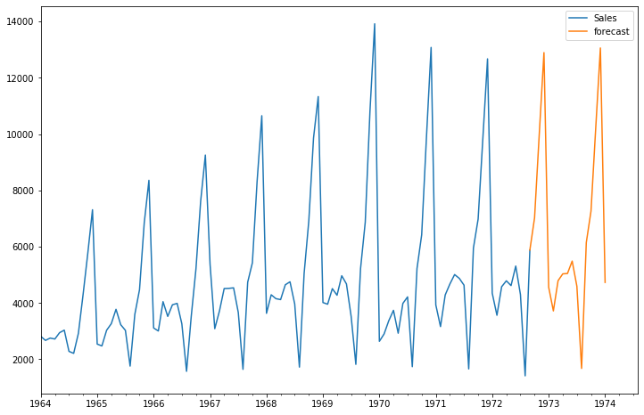

```python
import numpy as np
import pandas as pd

import matplotlib.pyplot as plt
%matplotlib inline
```


```python
df=pd.read_csv(r'F:\Time_Series Data Analysis\Projects\Product_sales/perrin-freres-monthly-champagne-.csv')
```


```python
df.head()
```


<div>
<style scoped>
    .dataframe tbody tr th:only-of-type {
        vertical-align: middle;
    }

    .dataframe tbody tr th {
        vertical-align: top;
    }

    .dataframe thead th {
        text-align: right;
    }
</style>
<table border="1" class="dataframe">
  <thead>
    <tr style="text-align: right;">
      <th></th>
      <th>Month</th>
      <th>Perrin Freres monthly champagne sales millions ?64-?72</th>
    </tr>
  </thead>
  <tbody>
    <tr>
      <th>0</th>
      <td>1964-01</td>
      <td>2815.0</td>
    </tr>
    <tr>
      <th>1</th>
      <td>1964-02</td>
      <td>2672.0</td>
    </tr>
    <tr>
      <th>2</th>
      <td>1964-03</td>
      <td>2755.0</td>
    </tr>
    <tr>
      <th>3</th>
      <td>1964-04</td>
      <td>2721.0</td>
    </tr>
    <tr>
      <th>4</th>
      <td>1964-05</td>
      <td>2946.0</td>
    </tr>
  </tbody>
</table>
</div>


```python
df.tail()
```


<div>
<style scoped>
    .dataframe tbody tr th:only-of-type {
        vertical-align: middle;
    }

    .dataframe tbody tr th {
        vertical-align: top;
    }

    .dataframe thead th {
        text-align: right;
    }
</style>
<table border="1" class="dataframe">
  <thead>
    <tr style="text-align: right;">
      <th></th>
      <th>Month</th>
      <th>Perrin Freres monthly champagne sales millions ?64-?72</th>
    </tr>
  </thead>
  <tbody>
    <tr>
      <th>102</th>
      <td>1972-07</td>
      <td>4298.0</td>
    </tr>
    <tr>
      <th>103</th>
      <td>1972-08</td>
      <td>1413.0</td>
    </tr>
    <tr>
      <th>104</th>
      <td>1972-09</td>
      <td>5877.0</td>
    </tr>
    <tr>
      <th>105</th>
      <td>NaN</td>
      <td>NaN</td>
    </tr>
    <tr>
      <th>106</th>
      <td>Perrin Freres monthly champagne sales millions...</td>
      <td>NaN</td>
    </tr>
  </tbody>
</table>
</div>


```python
df.shape
```


    (107, 2)


```python
## Cleaning up the data
df.columns=["Month","Sales"]
df.head()
```


<div>
<style scoped>
    .dataframe tbody tr th:only-of-type {
        vertical-align: middle;
    }

    .dataframe tbody tr th {
        vertical-align: top;
    }

    .dataframe thead th {
        text-align: right;
    }
</style>
<table border="1" class="dataframe">
  <thead>
    <tr style="text-align: right;">
      <th></th>
      <th>Month</th>
      <th>Sales</th>
    </tr>
  </thead>
  <tbody>
    <tr>
      <th>0</th>
      <td>1964-01</td>
      <td>2815.0</td>
    </tr>
    <tr>
      <th>1</th>
      <td>1964-02</td>
      <td>2672.0</td>
    </tr>
    <tr>
      <th>2</th>
      <td>1964-03</td>
      <td>2755.0</td>
    </tr>
    <tr>
      <th>3</th>
      <td>1964-04</td>
      <td>2721.0</td>
    </tr>
    <tr>
      <th>4</th>
      <td>1964-05</td>
      <td>2946.0</td>
    </tr>
  </tbody>
</table>
</div>


```python
## Drop last 2 rows
df.drop(106,axis=0,inplace=True)
```


```python
df.tail()
```


<div>
<style scoped>
    .dataframe tbody tr th:only-of-type {
        vertical-align: middle;
    }

    .dataframe tbody tr th {
        vertical-align: top;
    }

    .dataframe thead th {
        text-align: right;
    }
</style>
<table border="1" class="dataframe">
  <thead>
    <tr style="text-align: right;">
      <th></th>
      <th>Month</th>
      <th>Sales</th>
    </tr>
  </thead>
  <tbody>
    <tr>
      <th>101</th>
      <td>1972-06</td>
      <td>5312.0</td>
    </tr>
    <tr>
      <th>102</th>
      <td>1972-07</td>
      <td>4298.0</td>
    </tr>
    <tr>
      <th>103</th>
      <td>1972-08</td>
      <td>1413.0</td>
    </tr>
    <tr>
      <th>104</th>
      <td>1972-09</td>
      <td>5877.0</td>
    </tr>
    <tr>
      <th>105</th>
      <td>NaN</td>
      <td>NaN</td>
    </tr>
  </tbody>
</table>
</div>


```python
df.drop(105,axis=0,inplace=True)
```


```python
df.tail()
```


<div>
<style scoped>
    .dataframe tbody tr th:only-of-type {
        vertical-align: middle;
    }

    .dataframe tbody tr th {
        vertical-align: top;
    }

    .dataframe thead th {
        text-align: right;
    }
</style>
<table border="1" class="dataframe">
  <thead>
    <tr style="text-align: right;">
      <th></th>
      <th>Month</th>
      <th>Sales</th>
    </tr>
  </thead>
  <tbody>
    <tr>
      <th>100</th>
      <td>1972-05</td>
      <td>4618.0</td>
    </tr>
    <tr>
      <th>101</th>
      <td>1972-06</td>
      <td>5312.0</td>
    </tr>
    <tr>
      <th>102</th>
      <td>1972-07</td>
      <td>4298.0</td>
    </tr>
    <tr>
      <th>103</th>
      <td>1972-08</td>
      <td>1413.0</td>
    </tr>
    <tr>
      <th>104</th>
      <td>1972-09</td>
      <td>5877.0</td>
    </tr>
  </tbody>
</table>
</div>


```python
# Convert Month into Datetime
df['Month']=pd.to_datetime(df['Month'])
```


```python
df.head()
```


<div>
<style scoped>
    .dataframe tbody tr th:only-of-type {
        vertical-align: middle;
    }

    .dataframe tbody tr th {
        vertical-align: top;
    }

    .dataframe thead th {
        text-align: right;
    }
</style>
<table border="1" class="dataframe">
  <thead>
    <tr style="text-align: right;">
      <th></th>
      <th>Month</th>
      <th>Sales</th>
    </tr>
  </thead>
  <tbody>
    <tr>
      <th>0</th>
      <td>1964-01-01</td>
      <td>2815.0</td>
    </tr>
    <tr>
      <th>1</th>
      <td>1964-02-01</td>
      <td>2672.0</td>
    </tr>
    <tr>
      <th>2</th>
      <td>1964-03-01</td>
      <td>2755.0</td>
    </tr>
    <tr>
      <th>3</th>
      <td>1964-04-01</td>
      <td>2721.0</td>
    </tr>
    <tr>
      <th>4</th>
      <td>1964-05-01</td>
      <td>2946.0</td>
    </tr>
  </tbody>
</table>
</div>


```python
df.set_index('Month',inplace=True)
```


```python
df.head()
```


<div>
<style scoped>
    .dataframe tbody tr th:only-of-type {
        vertical-align: middle;
    }

    .dataframe tbody tr th {
        vertical-align: top;
    }

    .dataframe thead th {
        text-align: right;
    }
</style>
<table border="1" class="dataframe">
  <thead>
    <tr style="text-align: right;">
      <th></th>
      <th>Sales</th>
    </tr>
    <tr>
      <th>Month</th>
      <th></th>
    </tr>
  </thead>
  <tbody>
    <tr>
      <th>1964-01-01</th>
      <td>2815.0</td>
    </tr>
    <tr>
      <th>1964-02-01</th>
      <td>2672.0</td>
    </tr>
    <tr>
      <th>1964-03-01</th>
      <td>2755.0</td>
    </tr>
    <tr>
      <th>1964-04-01</th>
      <td>2721.0</td>
    </tr>
    <tr>
      <th>1964-05-01</th>
      <td>2946.0</td>
    </tr>
  </tbody>
</table>
</div>


```python
df.describe()
```


<div>
<style scoped>
    .dataframe tbody tr th:only-of-type {
        vertical-align: middle;
    }

    .dataframe tbody tr th {
        vertical-align: top;
    }

    .dataframe thead th {
        text-align: right;
    }
</style>
<table border="1" class="dataframe">
  <thead>
    <tr style="text-align: right;">
      <th></th>
      <th>Sales</th>
    </tr>
  </thead>
  <tbody>
    <tr>
      <th>count</th>
      <td>105.000000</td>
    </tr>
    <tr>
      <th>mean</th>
      <td>4761.152381</td>
    </tr>
    <tr>
      <th>std</th>
      <td>2553.502601</td>
    </tr>
    <tr>
      <th>min</th>
      <td>1413.000000</td>
    </tr>
    <tr>
      <th>25%</th>
      <td>3113.000000</td>
    </tr>
    <tr>
      <th>50%</th>
      <td>4217.000000</td>
    </tr>
    <tr>
      <th>75%</th>
      <td>5221.000000</td>
    </tr>
    <tr>
      <th>max</th>
      <td>13916.000000</td>
    </tr>
  </tbody>
</table>
</div>


## Step 2: Visualize the Data


```python
df.plot()
```


    <matplotlib.axes._subplots.AxesSubplot at 0x17caa3fb08>


    

    


```python
#looking this graph,we can say this data is seasonal
#(seasonal is all about suppose in each yr in christmas sales goes up) and then down
```


```python
# we plot,whether test is stationary or not
#if not stationery then how to make it stationery
```


```python
### Testing For Stationarity

from statsmodels.tsa.stattools import adfuller
```


```python
test_result=adfuller(df['Sales'])
```


```python
#adfuller gives 5 values ['ADF Test Statistic','p-value','#Lags Used','Number of Observations Used']
#most imp is p-value
#this is almost similar to Hypothesis testing,whereas Null hypo which says Data is not Stationery
#whereas Alternate hypo says data is stationery


```


```python
###if Pvalue<0.05 ,we reject Null hypo ie alternate hypo is true,ie data is stationery
```


```python

#zip basically combines result,labels

def adfuller_test(sales):
    result=adfuller(sales)
    labels = ['ADF Test Statistic','p-value','#Lags Used','Number of Observations Used']
    for value,label in zip(result,labels):
        print(label+' : '+str(value) )
    if result[1] <= 0.05:
        print("strong evidence against the null hypothesis(Ho), reject the null hypothesis. Data has no unit root and is stationary")
    else:
        print("weak evidence against null hypothesis, time series has a unit root, indicating it is non-stationary ")
    
```


```python
adfuller_test(df['Sales'])
```

    ADF Test Statistic : -1.8335930563276246
    p-value : 0.3639157716602442
    #Lags Used : 11
    Number of Observations Used : 93
    weak evidence against null hypothesis, time series has a unit root, indicating it is non-stationary 


```python
#if our data is non-stationery,we have to make it stationery using various techniques such as Differencing & many more
```

## Differencing


```python
df
```


<div>
<style scoped>
    .dataframe tbody tr th:only-of-type {
        vertical-align: middle;
    }

    .dataframe tbody tr th {
        vertical-align: top;
    }

    .dataframe thead th {
        text-align: right;
    }
</style>
<table border="1" class="dataframe">
  <thead>
    <tr style="text-align: right;">
      <th></th>
      <th>Sales</th>
    </tr>
    <tr>
      <th>Month</th>
      <th></th>
    </tr>
  </thead>
  <tbody>
    <tr>
      <th>1964-01-01</th>
      <td>2815.0</td>
    </tr>
    <tr>
      <th>1964-02-01</th>
      <td>2672.0</td>
    </tr>
    <tr>
      <th>1964-03-01</th>
      <td>2755.0</td>
    </tr>
    <tr>
      <th>1964-04-01</th>
      <td>2721.0</td>
    </tr>
    <tr>
      <th>1964-05-01</th>
      <td>2946.0</td>
    </tr>
    <tr>
      <th>...</th>
      <td>...</td>
    </tr>
    <tr>
      <th>1972-05-01</th>
      <td>4618.0</td>
    </tr>
    <tr>
      <th>1972-06-01</th>
      <td>5312.0</td>
    </tr>
    <tr>
      <th>1972-07-01</th>
      <td>4298.0</td>
    </tr>
    <tr>
      <th>1972-08-01</th>
      <td>1413.0</td>
    </tr>
    <tr>
      <th>1972-09-01</th>
      <td>5877.0</td>
    </tr>
  </tbody>
</table>
<p>105 rows × 1 columns</p>
</div>


```python
df['Sales'].shift(1)
```


    Month
    1964-01-01       NaN
    1964-02-01    2815.0
    1964-03-01    2672.0
    1964-04-01    2755.0
    1964-05-01    2721.0
                   ...  
    1972-05-01    4788.0
    1972-06-01    4618.0
    1972-07-01    5312.0
    1972-08-01    4298.0
    1972-09-01    1413.0
    Name: Sales, Length: 105, dtype: float64


```python
df['Sales First Difference'] = df['Sales'] - df['Sales'].shift(1)
```


```python
#why taken shift(12),bcz basically year has 12 month cycle
df['Seasonal First Difference']=df['Sales']-df['Sales'].shift(12)
```


```python
df.head(14)
```


<div>
<style scoped>
    .dataframe tbody tr th:only-of-type {
        vertical-align: middle;
    }

    .dataframe tbody tr th {
        vertical-align: top;
    }

    .dataframe thead th {
        text-align: right;
    }
</style>
<table border="1" class="dataframe">
  <thead>
    <tr style="text-align: right;">
      <th></th>
      <th>Sales</th>
      <th>Sales First Difference</th>
      <th>Seasonal First Difference</th>
    </tr>
    <tr>
      <th>Month</th>
      <th></th>
      <th></th>
      <th></th>
    </tr>
  </thead>
  <tbody>
    <tr>
      <th>1964-01-01</th>
      <td>2815.0</td>
      <td>NaN</td>
      <td>NaN</td>
    </tr>
    <tr>
      <th>1964-02-01</th>
      <td>2672.0</td>
      <td>-143.0</td>
      <td>NaN</td>
    </tr>
    <tr>
      <th>1964-03-01</th>
      <td>2755.0</td>
      <td>83.0</td>
      <td>NaN</td>
    </tr>
    <tr>
      <th>1964-04-01</th>
      <td>2721.0</td>
      <td>-34.0</td>
      <td>NaN</td>
    </tr>
    <tr>
      <th>1964-05-01</th>
      <td>2946.0</td>
      <td>225.0</td>
      <td>NaN</td>
    </tr>
    <tr>
      <th>1964-06-01</th>
      <td>3036.0</td>
      <td>90.0</td>
      <td>NaN</td>
    </tr>
    <tr>
      <th>1964-07-01</th>
      <td>2282.0</td>
      <td>-754.0</td>
      <td>NaN</td>
    </tr>
    <tr>
      <th>1964-08-01</th>
      <td>2212.0</td>
      <td>-70.0</td>
      <td>NaN</td>
    </tr>
    <tr>
      <th>1964-09-01</th>
      <td>2922.0</td>
      <td>710.0</td>
      <td>NaN</td>
    </tr>
    <tr>
      <th>1964-10-01</th>
      <td>4301.0</td>
      <td>1379.0</td>
      <td>NaN</td>
    </tr>
    <tr>
      <th>1964-11-01</th>
      <td>5764.0</td>
      <td>1463.0</td>
      <td>NaN</td>
    </tr>
    <tr>
      <th>1964-12-01</th>
      <td>7312.0</td>
      <td>1548.0</td>
      <td>NaN</td>
    </tr>
    <tr>
      <th>1965-01-01</th>
      <td>2541.0</td>
      <td>-4771.0</td>
      <td>-274.0</td>
    </tr>
    <tr>
      <th>1965-02-01</th>
      <td>2475.0</td>
      <td>-66.0</td>
      <td>-197.0</td>
    </tr>
  </tbody>
</table>
</div>


```python
## Again test dickey fuller test on df['Sales First Difference']
adfuller_test(df['Seasonal First Difference'].dropna())
```

    ADF Test Statistic : -7.626619157213164
    p-value : 2.060579696813685e-11
    #Lags Used : 0
    Number of Observations Used : 92
    strong evidence against the null hypothesis(Ho), reject the null hypothesis. Data has no unit root and is stationary


```python
#now our p-value is less than 0.05 which basically says we are rejecting null hypo and accepting alternate hypo
#ie data is stationery
#if p-value is almost 0,then we have a wonderful stationery graph
```


```python
df['Seasonal First Difference'].plot()
```


    <matplotlib.axes._subplots.AxesSubplot at 0x17cabae408>


    

    


```python
from statsmodels.graphics.tsaplots import plot_acf,plot_pacf
#Autocorrelation(plot_acf),Partial Autocorrelation(plot_pacf)
```


```python
from statsmodels.graphics.tsaplots import plot_acf,plot_pacf
```


```python

fig = plt.figure(figsize=(12,8))
ax1 = fig.add_subplot(211)
fig = plot_acf(df['Seasonal First Difference'].iloc[13:],lags=40,ax=ax1)
ax2 = fig.add_subplot(212)
fig = plot_pacf(df['Seasonal First Difference'].iloc[13:],lags=40,ax=ax2)
```


    

    


```python

```


```python

```


```python

```


```python
# For non-seasonal data
#p=1, d=1, q=0 or 1
from statsmodels.tsa.arima_model import ARIMA
```


```python
model=ARIMA(df['Sales'],order=(1,1,1))
model_fit=model.fit()
```

    C:\Users\mcr\Anaconda3\lib\site-packages\statsmodels\tsa\base\tsa_model.py:162: ValueWarning: No frequency information was provided, so inferred frequency MS will be used.
      % freq, ValueWarning)
    C:\Users\mcr\Anaconda3\lib\site-packages\statsmodels\tsa\base\tsa_model.py:162: ValueWarning: No frequency information was provided, so inferred frequency MS will be used.
      % freq, ValueWarning)


```python
model_fit.summary()
```


<table class="simpletable">
<caption>ARIMA Model Results</caption>
<tr>
  <th>Dep. Variable:</th>      <td>D.Sales</td>     <th>  No. Observations:  </th>    <td>104</td>  
</tr>
<tr>
  <th>Model:</th>          <td>ARIMA(1, 1, 1)</td>  <th>  Log Likelihood     </th> <td>-951.126</td>
</tr>
<tr>
  <th>Method:</th>             <td>css-mle</td>     <th>  S.D. of innovations</th> <td>2227.262</td>
</tr>
<tr>
  <th>Date:</th>          <td>Thu, 11 Mar 2021</td> <th>  AIC                </th> <td>1910.251</td>
</tr>
<tr>
  <th>Time:</th>              <td>19:34:24</td>     <th>  BIC                </th> <td>1920.829</td>
</tr>
<tr>
  <th>Sample:</th>           <td>02-01-1964</td>    <th>  HQIC               </th> <td>1914.536</td>
</tr>
<tr>
  <th></th>                 <td>- 09-01-1972</td>   <th>                     </th>     <td> </td>   
</tr>
</table>
<table class="simpletable">
<tr>
        <td></td>           <th>coef</th>     <th>std err</th>      <th>z</th>      <th>P>|z|</th>  <th>[0.025</th>    <th>0.975]</th>  
</tr>
<tr>
  <th>const</th>         <td>   22.7856</td> <td>   12.405</td> <td>    1.837</td> <td> 0.066</td> <td>   -1.528</td> <td>   47.099</td>
</tr>
<tr>
  <th>ar.L1.D.Sales</th> <td>    0.4343</td> <td>    0.089</td> <td>    4.866</td> <td> 0.000</td> <td>    0.259</td> <td>    0.609</td>
</tr>
<tr>
  <th>ma.L1.D.Sales</th> <td>   -1.0000</td> <td>    0.026</td> <td>  -38.503</td> <td> 0.000</td> <td>   -1.051</td> <td>   -0.949</td>
</tr>
</table>
<table class="simpletable">
<caption>Roots</caption>
<tr>
    <td></td>   <th>            Real</th>  <th>         Imaginary</th> <th>         Modulus</th>  <th>        Frequency</th>
</tr>
<tr>
  <th>AR.1</th> <td>           2.3023</td> <td>          +0.0000j</td> <td>           2.3023</td> <td>           0.0000</td>
</tr>
<tr>
  <th>MA.1</th> <td>           1.0000</td> <td>          +0.0000j</td> <td>           1.0000</td> <td>           0.0000</td>
</tr>
</table>


```python
df['forecast']=model_fit.predict(start=90,end=103,dynamic=True)
df[['Sales','forecast']].plot(figsize=(12,8))
```


    <matplotlib.axes._subplots.AxesSubplot at 0x17c05b7608>


    

    


```python
## note: when u have seasonal data, use SARIMAX over there..
```


```python
import statsmodels.api as sm
```


```python
#seasonal_order=(1,1,1,12)
#(p,d,q,shift_value)
```


```python
model=sm.tsa.statespace.SARIMAX(df['Sales'],order=(1, 1, 1),seasonal_order=(1,1,1,12))
results=model.fit()
```

    C:\Users\mcr\Anaconda3\lib\site-packages\statsmodels\tsa\base\tsa_model.py:162: ValueWarning: No frequency information was provided, so inferred frequency MS will be used.
      % freq, ValueWarning)
    C:\Users\mcr\Anaconda3\lib\site-packages\statsmodels\tsa\base\tsa_model.py:162: ValueWarning: No frequency information was provided, so inferred frequency MS will be used.
      % freq, ValueWarning)


```python
#predicting from index 90 to 103
df['forecast']=results.predict(start=90,end=103,dynamic=True)

```


```python
#blue line is original data anf orange is a forecasted data
df[['Sales','forecast']].plot(figsize=(12,8))
```


    <matplotlib.axes._subplots.AxesSubplot at 0x17cc16f2c8>


    

    


```python
### to see how future predictions/projections looks like
```


```python
from pandas.tseries.offsets import DateOffset
```


```python
df.index[-1]
```


    Timestamp('1972-09-01 00:00:00')


```python
future_dates=[df.index[-1]+ DateOffset(months=x)for x in range(0,24)]
```


```python
future_dates
```


    [Timestamp('1972-09-01 00:00:00'),
     Timestamp('1972-10-01 00:00:00'),
     Timestamp('1972-11-01 00:00:00'),
     Timestamp('1972-12-01 00:00:00'),
     Timestamp('1973-01-01 00:00:00'),
     Timestamp('1973-02-01 00:00:00'),
     Timestamp('1973-03-01 00:00:00'),
     Timestamp('1973-04-01 00:00:00'),
     Timestamp('1973-05-01 00:00:00'),
     Timestamp('1973-06-01 00:00:00'),
     Timestamp('1973-07-01 00:00:00'),
     Timestamp('1973-08-01 00:00:00'),
     Timestamp('1973-09-01 00:00:00'),
     Timestamp('1973-10-01 00:00:00'),
     Timestamp('1973-11-01 00:00:00'),
     Timestamp('1973-12-01 00:00:00'),
     Timestamp('1974-01-01 00:00:00'),
     Timestamp('1974-02-01 00:00:00'),
     Timestamp('1974-03-01 00:00:00'),
     Timestamp('1974-04-01 00:00:00'),
     Timestamp('1974-05-01 00:00:00'),
     Timestamp('1974-06-01 00:00:00'),
     Timestamp('1974-07-01 00:00:00'),
     Timestamp('1974-08-01 00:00:00')]


```python
from pandas.tseries.offsets import DateOffset

#creating additional dataset for 24 months,
future_dates=[df.index[-1]+ DateOffset(months=x)for x in range(0,24)]
```


```python
future_datset_df=pd.DataFrame(index=future_dates[1:],columns=df.columns)
```


```python
future_datest_df.tail()
```


<div>
<style scoped>
    .dataframe tbody tr th:only-of-type {
        vertical-align: middle;
    }

    .dataframe tbody tr th {
        vertical-align: top;
    }

    .dataframe thead th {
        text-align: right;
    }
</style>
<table border="1" class="dataframe">
  <thead>
    <tr style="text-align: right;">
      <th></th>
      <th>Sales</th>
      <th>Sales First Difference</th>
      <th>Seasonal First Difference</th>
      <th>forecast</th>
    </tr>
  </thead>
  <tbody>
    <tr>
      <td>1974-04-01</td>
      <td>NaN</td>
      <td>NaN</td>
      <td>NaN</td>
      <td>NaN</td>
    </tr>
    <tr>
      <td>1974-05-01</td>
      <td>NaN</td>
      <td>NaN</td>
      <td>NaN</td>
      <td>NaN</td>
    </tr>
    <tr>
      <td>1974-06-01</td>
      <td>NaN</td>
      <td>NaN</td>
      <td>NaN</td>
      <td>NaN</td>
    </tr>
    <tr>
      <td>1974-07-01</td>
      <td>NaN</td>
      <td>NaN</td>
      <td>NaN</td>
      <td>NaN</td>
    </tr>
    <tr>
      <td>1974-08-01</td>
      <td>NaN</td>
      <td>NaN</td>
      <td>NaN</td>
      <td>NaN</td>
    </tr>
  </tbody>
</table>
</div>


```python
future_df=pd.concat([df,future_datest_df])
```


```python
#then we can see future predictions
```


```python
future_df['forecast'] = results.predict(start = 104, end = 120, dynamic= True)  
future_df[['Sales', 'forecast']].plot(figsize=(12, 8)) 
```


    <matplotlib.axes._subplots.AxesSubplot at 0x9d0ccbc208>


    

    


```python

```
