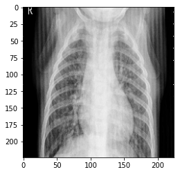
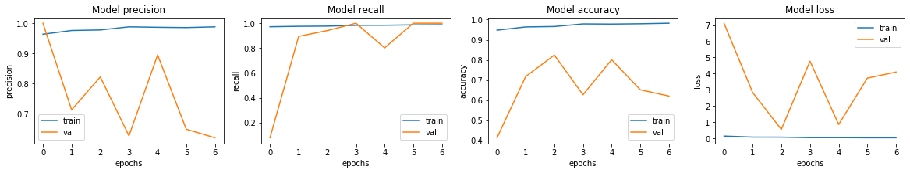
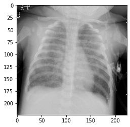

```python
# Data hosted at below link (downloading it)
!wget https://www.dropbox.com/s/tlxserrdhe240lu/archive.zip
# Unzipping the data
!unzip -q "archive.zip"
```

    --2020-12-22 02:37:58--  https://www.dropbox.com/s/tlxserrdhe240lu/archive.zip
    Resolving www.dropbox.com (www.dropbox.com)... 162.125.1.18, 2620:100:6016:18::a27d:112
    Connecting to www.dropbox.com (www.dropbox.com)|162.125.1.18|:443... connected.
    HTTP request sent, awaiting response... 301 Moved Permanently
    Location: /s/raw/tlxserrdhe240lu/archive.zip [following]
    --2020-12-22 02:37:58--  https://www.dropbox.com/s/raw/tlxserrdhe240lu/archive.zip
    Reusing existing connection to www.dropbox.com:443.
    HTTP request sent, awaiting response... 302 Found
    Location: https://uc953060ba3dd1888acb0ef81d5a.dl.dropboxusercontent.com/cd/0/inline/BFiSmYgKWJNtxO1dZyoXEXwJ9EslADQIG3HUc-X_70uRq8e24s1zMJriEWS43lKXNPY0zvhk7iwYqehHU-a-rU1bwAshciJez_xJOsVLE18fOyrjJfFKtZHePqob2LlQsIw/file# [following]
    --2020-12-22 02:37:59--  https://uc953060ba3dd1888acb0ef81d5a.dl.dropboxusercontent.com/cd/0/inline/BFiSmYgKWJNtxO1dZyoXEXwJ9EslADQIG3HUc-X_70uRq8e24s1zMJriEWS43lKXNPY0zvhk7iwYqehHU-a-rU1bwAshciJez_xJOsVLE18fOyrjJfFKtZHePqob2LlQsIw/file
    Resolving uc953060ba3dd1888acb0ef81d5a.dl.dropboxusercontent.com (uc953060ba3dd1888acb0ef81d5a.dl.dropboxusercontent.com)... 162.125.1.15, 2620:100:6016:15::a27d:10f
    Connecting to uc953060ba3dd1888acb0ef81d5a.dl.dropboxusercontent.com (uc953060ba3dd1888acb0ef81d5a.dl.dropboxusercontent.com)|162.125.1.15|:443... connected.
    HTTP request sent, awaiting response... 302 Found
    Location: /cd/0/inline2/BFgEGOPa2vKEU2AuZN4VD_8K_bVFnQsNue7j5Mg4323wc9TzHB-EvAPDb0-7L6YzRc52pWJ0OZh4ltyFK_ZQEtH_tq6I_cYuvJW8mn6J5zp50f1KjYo4Oc6A_6N_mORtfRwxCGFV82CZdPFDCMw-ttitNGwRtvcs5i3iN0D-k4lgqZZQUqEMHQMKfuMC0cnsDztEu1haZtGNfiDeCmM7Ub7a-D49Aw6VR3vedzODDLxDHINBzxcW4i0kPcgJBr5dQlP81ZPjbazm1xy8g3T_a8rvECtN-7EeVA_Ndcwh3ECSoV-tq8OwWUYT9VGxRsWlK1fsRzPRqLaF_8B9_UXIqCs4Qpip6pB75jZgW2B4WjzgZQ/file [following]
    --2020-12-22 02:37:59--  https://uc953060ba3dd1888acb0ef81d5a.dl.dropboxusercontent.com/cd/0/inline2/BFgEGOPa2vKEU2AuZN4VD_8K_bVFnQsNue7j5Mg4323wc9TzHB-EvAPDb0-7L6YzRc52pWJ0OZh4ltyFK_ZQEtH_tq6I_cYuvJW8mn6J5zp50f1KjYo4Oc6A_6N_mORtfRwxCGFV82CZdPFDCMw-ttitNGwRtvcs5i3iN0D-k4lgqZZQUqEMHQMKfuMC0cnsDztEu1haZtGNfiDeCmM7Ub7a-D49Aw6VR3vedzODDLxDHINBzxcW4i0kPcgJBr5dQlP81ZPjbazm1xy8g3T_a8rvECtN-7EeVA_Ndcwh3ECSoV-tq8OwWUYT9VGxRsWlK1fsRzPRqLaF_8B9_UXIqCs4Qpip6pB75jZgW2B4WjzgZQ/file
    Reusing existing connection to uc953060ba3dd1888acb0ef81d5a.dl.dropboxusercontent.com:443.
    HTTP request sent, awaiting response... 200 OK
    Length: 1237072214 (1.2G) [application/zip]
    Saving to: ‘archive.zip’
    
    archive.zip         100%[===================>]   1.15G  72.2MB/s    in 17s     
    
    2020-12-22 02:38:17 (67.6 MB/s) - ‘archive.zip’ saved [1237072214/1237072214]
    


```python
# Imports required for this project
import tensorflow as tf
import numpy as np
import matplotlib.pyplot as plt
from pathlib import Path

tf.random.set_seed(4)
```


```python
# Creating the Pathlib PATH objects
train_path = Path("chest_xray/train/")
validation_path = Path("chest_xray/test")
test_path = Path("chest_xray/val")
```


```python
# Collecting all the Paths Inside "Normal" and "Pneumonia" folders of the above paths
train_image_paths = train_path.glob("*/*")
val_image_paths = validation_path.glob("*/*")

# Output is a Generator object
print(train_image_paths)
```

    <generator object Path.glob at 0x7fc2a022cd58>


```python
# Convert Generator Object to List of elements 
train_image_paths = list(train_image_paths)
val_image_paths = list(val_image_paths)

# Now the outputs are "PosixPath" objects
print(train_image_paths[:3])
```

    [PosixPath('chest_xray/train/PNEUMONIA/person841_bacteria_2761.jpeg'), PosixPath('chest_xray/train/PNEUMONIA/person1539_bacteria_4022.jpeg'), PosixPath('chest_xray/train/PNEUMONIA/person75_bacteria_366.jpeg')]


```python
# Convert Posix paths to normal strings
train_image_paths = list(map(lambda x : str(x) , train_image_paths))
val_image_paths = list(map(lambda x : str(x) , val_image_paths)) 

print(train_image_paths[:3])
```

    ['chest_xray/train/PNEUMONIA/person841_bacteria_2761.jpeg', 'chest_xray/train/PNEUMONIA/person1539_bacteria_4022.jpeg', 'chest_xray/train/PNEUMONIA/person75_bacteria_366.jpeg']


```python
# Collect Length for Training and Validation Datasets
train_dataset_length = len(train_image_paths)
val_dataset_length = len(val_image_paths)
```


```python
# Every Image has Label in its path , so lets slice it 
LABELS = {'NORMAL' : 0 , 'PNEUMONIA' : 1}
INV_LABELS = {0 : 'NORMAL', 1 : 'PNEUMONIA'}

def get_label(path : str) -> int:
    return LABELS[path.split("/")[-2]]

train_labels = list(map(lambda x : get_label(x) , train_image_paths))
val_labels = list(map(lambda x : get_label(x) , val_image_paths))

print(train_labels[:3])
```

    [1, 1, 1]


```python
# Now we have all training, validation image paths and their respective labels 

BATCH_SIZE = 32

# Function used for Transformation
def load_and_transform(image , label , train = True):
    image = tf.io.read_file(image)
    image = tf.io.decode_jpeg(image , channels = 3)
    image = tf.image.resize(image , [224 , 224] , method="nearest")
    if train:
        image = tf.image.random_flip_left_right(image)
    return image , label

# Function used to Create a Tensorflow Data Object
def get_dataset(paths , labels , train = True):
    image_paths = tf.convert_to_tensor(paths)
    labels = tf.convert_to_tensor(labels)

    image_dataset = tf.data.Dataset.from_tensor_slices(image_paths)
    label_dataset = tf.data.Dataset.from_tensor_slices(labels)

    dataset = tf.data.Dataset.zip((image_dataset , label_dataset)).shuffle(1000)

    dataset = dataset.map(lambda image , label : load_and_transform(image , label , train))
    dataset = dataset.repeat()
    dataset = dataset.shuffle(2048)
    dataset = dataset.batch(BATCH_SIZE)

    return dataset
```


```python
# Creating Train Dataset object and Verifying it
%time train_dataset = get_dataset(train_image_paths , train_labels)

image , label = next(iter(train_dataset))
print(image.shape)
print(label.shape)
```

    CPU times: user 75.6 ms, sys: 0 ns, total: 75.6 ms
    Wall time: 78.3 ms
    (32, 224, 224, 3)
    (32,)


```python
# View a sample Train Image
print(INV_LABELS[label[0].numpy()])
plt.imshow(image[0].numpy().reshape(224 , 224 , 3))
```

    PNEUMONIA


    <matplotlib.image.AxesImage at 0x7fc2a02d0198>


    

    


```python
%time val_dataset = get_dataset(val_image_paths , val_labels , train = False)

image , label = next(iter(val_dataset))
print(image.shape)
print(label.shape)
```

    CPU times: user 16.1 ms, sys: 0 ns, total: 16.1 ms
    Wall time: 22.5 ms
    (32, 224, 224, 3)
    (32,)


```python
# View a sample Validation Image
print(INV_LABELS[label[0].numpy()])
plt.imshow(image[0].numpy().reshape(224 , 224 , 3))
```

    PNEUMONIA


    <matplotlib.image.AxesImage at 0x7fc2906deba8>


    

    


```python
# Building ResNet50 model
from tensorflow.keras.applications import ResNet50V2

backbone = ResNet50V2(
    input_shape=(224, 224, 3),
    include_top=False
)

model = tf.keras.Sequential([
    backbone,
    tf.keras.layers.GlobalAveragePooling2D(),
    tf.keras.layers.Dense(1, activation='sigmoid')
])

model.summary()
```

    Downloading data from https://storage.googleapis.com/tensorflow/keras-applications/resnet/resnet50v2_weights_tf_dim_ordering_tf_kernels_notop.h5
    94674944/94668760 [==============================] - 1s 0us/step
    Model: "sequential"
    _________________________________________________________________
    Layer (type)                 Output Shape              Param #   
    =================================================================
    resnet50v2 (Functional)      (None, 7, 7, 2048)        23564800  
    _________________________________________________________________
    global_average_pooling2d (Gl (None, 2048)              0         
    _________________________________________________________________
    dense (Dense)                (None, 1)                 2049      
    =================================================================
    Total params: 23,566,849
    Trainable params: 23,521,409
    Non-trainable params: 45,440
    _________________________________________________________________


```python
# Compiling your model by providing the Optimizer , Loss and Metrics
model.compile(
    optimizer=tf.keras.optimizers.Adam(learning_rate=0.001, beta_1=0.9, beta_2=0.999, epsilon=1e-07),
    loss = 'binary_crossentropy',
    metrics=['accuracy' , tf.keras.metrics.Precision(name='precision'),tf.keras.metrics.Recall(name='recall')]
)
```


```python
# Defining our callbacks 
checkpoint = tf.keras.callbacks.ModelCheckpoint("best_weights.h5",verbose=1,save_best_only=True,save_weights_only = True)
early_stop = tf.keras.callbacks.EarlyStopping(patience=4)
```


```python
# Train the model
history = model.fit(
    train_dataset,
    steps_per_epoch=train_dataset_length//BATCH_SIZE,
    epochs=8,
    callbacks=[checkpoint , early_stop],
    validation_data=val_dataset,
    validation_steps = val_dataset_length//BATCH_SIZE,
)
```

    Epoch 1/8
    163/163 [==============================] - ETA: 0s - loss: 0.1560 - accuracy: 0.9477 - precision: 0.9637 - recall: 0.9717
    Epoch 00001: val_loss improved from inf to 7.11311, saving model to best_weights.h5
    163/163 [==============================] - 110s 676ms/step - loss: 0.1560 - accuracy: 0.9477 - precision: 0.9637 - recall: 0.9717 - val_loss: 7.1131 - val_accuracy: 0.4128 - val_precision: 1.0000 - val_recall: 0.0775
    Epoch 2/8
    163/163 [==============================] - ETA: 0s - loss: 0.0928 - accuracy: 0.9638 - precision: 0.9760 - recall: 0.9752
    Epoch 00002: val_loss improved from 7.11311 to 2.83684, saving model to best_weights.h5
    163/163 [==============================] - 110s 677ms/step - loss: 0.0928 - accuracy: 0.9638 - precision: 0.9760 - recall: 0.9752 - val_loss: 2.8368 - val_accuracy: 0.7171 - val_precision: 0.7127 - val_recall: 0.8943
    Epoch 3/8
    163/163 [==============================] - ETA: 0s - loss: 0.0897 - accuracy: 0.9659 - precision: 0.9777 - recall: 0.9767
    Epoch 00003: val_loss improved from 2.83684 to 0.56685, saving model to best_weights.h5
    163/163 [==============================] - 110s 672ms/step - loss: 0.0897 - accuracy: 0.9659 - precision: 0.9777 - recall: 0.9767 - val_loss: 0.5668 - val_accuracy: 0.8240 - val_precision: 0.8219 - val_recall: 0.9410
    Epoch 4/8
    163/163 [==============================] - ETA: 0s - loss: 0.0589 - accuracy: 0.9787 - precision: 0.9880 - recall: 0.9832
    Epoch 00004: val_loss did not improve from 0.56685
    163/163 [==============================] - 109s 666ms/step - loss: 0.0589 - accuracy: 0.9787 - precision: 0.9880 - recall: 0.9832 - val_loss: 4.7747 - val_accuracy: 0.6266 - val_precision: 0.6266 - val_recall: 1.0000
    Epoch 5/8
    163/163 [==============================] - ETA: 0s - loss: 0.0593 - accuracy: 0.9780 - precision: 0.9866 - recall: 0.9838
    Epoch 00005: val_loss did not improve from 0.56685
    163/163 [==============================] - 109s 668ms/step - loss: 0.0593 - accuracy: 0.9780 - precision: 0.9866 - recall: 0.9838 - val_loss: 0.8688 - val_accuracy: 0.8010 - val_precision: 0.8949 - val_recall: 0.8019
    Epoch 6/8
    163/163 [==============================] - ETA: 0s - loss: 0.0510 - accuracy: 0.9795 - precision: 0.9856 - recall: 0.9869
    Epoch 00006: val_loss did not improve from 0.56685
    163/163 [==============================] - 108s 662ms/step - loss: 0.0510 - accuracy: 0.9795 - precision: 0.9856 - recall: 0.9869 - val_loss: 3.7289 - val_accuracy: 0.6513 - val_precision: 0.6484 - val_recall: 1.0000
    Epoch 7/8
    163/163 [==============================] - ETA: 0s - loss: 0.0512 - accuracy: 0.9822 - precision: 0.9881 - recall: 0.9878
    Epoch 00007: val_loss did not improve from 0.56685
    163/163 [==============================] - 109s 667ms/step - loss: 0.0512 - accuracy: 0.9822 - precision: 0.9881 - recall: 0.9878 - val_loss: 4.1027 - val_accuracy: 0.6201 - val_precision: 0.6201 - val_recall: 1.0000


```python
# Interpreting the Metrics 
fig, ax = plt.subplots(1, 4, figsize=(20, 3))
ax = ax.ravel()

for i, met in enumerate(['precision', 'recall', 'accuracy', 'loss']):
    ax[i].plot(history.history[met])
    ax[i].plot(history.history['val_' + met])
    ax[i].set_title('Model {}'.format(met))
    ax[i].set_xlabel('epochs')
    ax[i].set_ylabel(met)
    ax[i].legend(['train', 'val'])
```


    

    


```python
# Saving the best Model

# Load the best weights
model.load_weights("best_weights.h5")
# Save the whole model (weigths + architecture)
model.save("model.h5")
```


```python
# Loading the whole model
loaded_model = tf.keras.models.load_model("model.h5")
```

Create a Testing Dataset


```python
# Create a Dataset Object for 'Testing' Set just the way we did for Training and Validation
test_image_paths = list(test_path.glob("*/*"))
test_image_paths = list(map(lambda x : str(x) , test_image_paths))
test_labels = list(map(lambda x : get_label(x) , test_image_paths))

test_image_paths = tf.convert_to_tensor(test_image_paths)
test_labels = tf.convert_to_tensor(test_labels)

def decode_image(image , label):
    image = tf.io.read_file(image)
    image = tf.io.decode_jpeg(image , channels = 3)
    image = tf.image.resize(image , [224 , 224] , method="nearest")
    return image , label

test_dataset = (
     tf.data.Dataset
    .from_tensor_slices((test_image_paths, test_labels))
    .map(decode_image)
    .batch(BATCH_SIZE)
)
```


```python
# Verify Test Dataset Object
image , label = next(iter(test_dataset))
print(image.shape)
print(label.shape)
```

    (16, 224, 224, 3)
    (16,)


```python
# View a sample Validation Image
print(INV_LABELS[label[0].numpy()])
plt.imshow(image[0].numpy().reshape(224 , 224 , 3))
```

    PNEUMONIA


    <matplotlib.image.AxesImage at 0x7f88c2a04c18>


    

    


```python
# Evaluating the loaded model
loss, acc, prec, rec = loaded_model.evaluate(test_dataset)

print(" Testing Acc : " , acc)
print(" Testing Precision " , prec)
print(" Testing Recall " , rec)
```

    1/1 [==============================] - 0s 2ms/step - loss: 0.4424 - accuracy: 0.7500 - precision: 0.7000 - recall: 0.8750
     Testing Acc :  0.75
     Testing Precision  0.699999988079071
     Testing Recall  0.875

